# 计算机系统导论：09：机器级编程进阶（上篇）

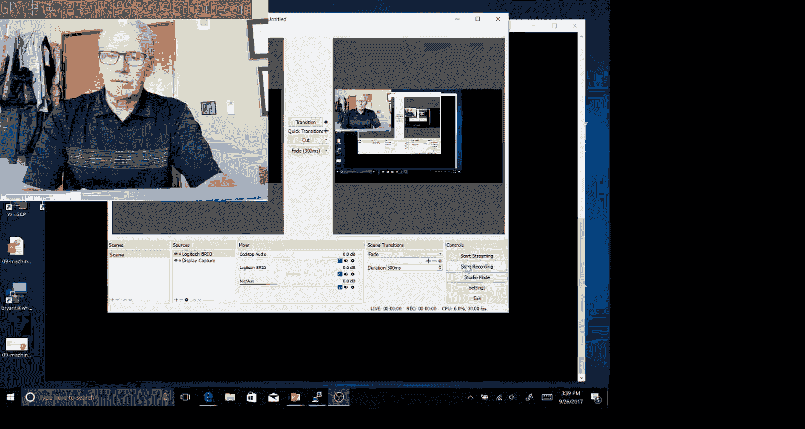

在本节课中，我们将学习与机器级编程相关的几个高级主题，重点关注内存的组织方式以及程序如何利用内存的不同部分。我们将特别探讨一类常见的程序漏洞——缓冲区溢出，并了解攻击者如何利用这些漏洞获取系统访问权限。

## 🗺️ 内存布局总览

上一节我们介绍了程序的基本执行流程，本节中我们来看看程序在内存中是如何组织的。下图展示了Linux系统中，从汇编/机器级程序视角看到的内存整体布局。


尽管这是一个64位地址空间，但用户空间大约只占用到2^47位地址。硬件本身支持2^48位，但地址空间的上半部分被操作系统内核占用，用于存放进程所需但用户无法直接访问的数据。

在内存空间的最高端是共享库代码，例如 `malloc`、`free`、`printf` 等函数。这些代码通常在所有执行进程之间共享。

紧接着共享库下方是栈。在典型机器上，栈的大小被限制为8兆字节。需要特别注意的是，此图并非按比例绘制。8兆字节（约2^23字节）相对于2^47字节的地址空间来说微不足道。限制栈大小的目的是为了防止程序因无限递归而不断进行函数调用，最终可能耗尽整个内存。如果你尝试访问超过8兆字节的栈空间，将会导致段错误，程序会出错退出。

在地址空间的低端，你会看到第一个地址范围未被使用。我相信这与降低某些攻击的脆弱性有关。黄色区域称为文本段。尽管名字叫“文本”，但它并非指字符串，而是指由编译器和链接器生成的可执行代码。这个内存区域通常被标记为可读和可执行，但不可写，以防止程序在执行过程中被无意或恶意修改。

粉色区域是数据区，用于存放程序中声明的全局变量。带有箭头的部分是堆。堆是由 `malloc` 等程序管理的区域，是动态分配和释放的大型数据结构存放的地方。

这些区域之间的边界实际上会根据代码量、全局变量量、堆和栈的使用量而变化。

## 📍 内存地址示例

以下是我们编写的一段代码，用于生成各种数据结构并打印其地址。

```c
// 示例代码：打印不同类型数据的地址
// 包含全局变量、数组、函数、malloc分配的数据等
```

这段代码在一次执行中展示了不同数据实际存放的区域。局部变量（图中紫色部分）最终位于栈的某个位置，其地址通常以 `0x7f...` 开头。指针是堆分配的，它们位于堆区域的某个位置。在这个特定例子中，非常大的数组被分配在堆中较高的地址，紧挨着栈的下方，而较小的数组则被分配在堆中较低的地址，靠近数据区。操作系统如何分配并没有固定规则，这会因机器或操作系统的不同而变化。

`static` 或全局分配的数组存储在数据区。列出的两个函数则位于文本段。

重要的是要认识到，所有这些都只是同一地址空间中的不同区域，因此一个指针可以指向其中任何一个区域。如果你尝试访问图中白色的、尚未分配的区域，通常会导致段错误，这意味着操作系统报告了一个无效地址错误。

## 🚫 栈空间限制示例

我之前提到栈被限制为8兆字节，这里有一个示例来演示这一点。这是一个递归调用函数。

```c
int recursive(int x) {
    char big_array[128 * 1024]; // 分配约128KB的栈帧
    if (x <= 0) return -x;
    return recursive(x - 1);
}
```

如果你仔细看这个程序，它应该返回 `-x`，但递归深度会达到 `x` 的数值。每次递归调用都会分配一个约128KB的栈帧，占用相当大的内存。你会发现，在大约46次深度递归调用后，就会遇到段错误。

这提醒我们，在C编程实验中不允许使用递归来遍历链表，原因正在于此。如果你有一个非常大的数据结构并尝试递归遍历，会产生巨大而深的递归嵌套调用，栈空间无法容纳。因此，执行此类功能时，必须使用迭代。

## ⚠️ 内存越界访问的隐患

让我们回到第一节课，你会记得我们展示了一个可能产生不同结果的例子。

```c
double fun(int i) {
    volatile double d = 3.14;
    volatile int a[2];
    a[i] = 1073741824; // 可能越界写入
    return d;
}
```

尽管看函数 `fun`，它应该返回值3.14。它对数组 `a` 的其他操作实际上并未被读取。但由于对数组 `a` 的内存引用，根据 `i` 的值，你可能会访问正常的数组 `a`，也可能破坏内存的其他部分。

具体来说，我们发现调用 `fun(0)` 和 `fun(1)` 没有问题。但如果调用 `fun(2)`，它会修改双精度数 `d` 的低4个字节，从而损害浮点数表示中的低位数字。如果调用 `fun(3)`，则会覆盖双精度数 `d` 的高位字节，从而完全破坏该值。我们发现 `fun(4)` 会导致段错误。在我进行的一些实验中，你会发现运行 `fun(8)` 也能正常返回，因为它修改了内存中某些对这个程序来说似乎不关键的部分。

总的来说，栈帧的布局是典型方式，只是我们绘制时把低地址放在了底部。首先是 `a[0]`，然后是 `a[1]`，接着是8字节的双精度数据 `d`。之后是4个字节一组的关键状态区域，当你破坏它们时，就会得到段错误。在位置8，我们发现可以修改它而不破坏程序，这可能是因为程序运行时间很短无关紧要，或者那是一些未使用的空间，很难确切知道。

然而，这通常是一种可怕的情况，因为内存在整个程序中是共享的。程序某一部分的无意写入可能会破坏另一部分。当代码编写方式允许缓冲区或数组超出预期溢出时，这就可能成为一个漏洞。从C语言本身来看，没有什么能阻止这种情况发生。接下来，我们将看看这个缺陷如何成为可能被攻击者利用的安全漏洞。

## 🚨 危险的库函数：`gets`

让我们回顾一下这个名为 `gets` 的Unix库函数。如果你现在尝试在代码中使用它，编译器会给出各种警告，因为它确实是一个危险的函数。我想明确展示它，以便你理解危险所在。下图展示了一个 `gets` 的示例实现（不一定是真实的，但功能类似）。

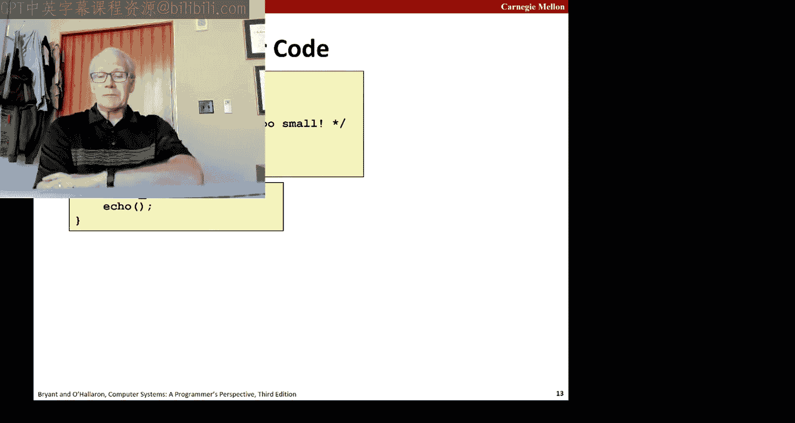

`gets` 的想法是从标准输入读取一个字符序列，一旦遇到文件结束符或换行符就停止。但在此之前，它会一直将结果写入目标缓冲区。这里的问题是，`gets` 没有参数来指定缓冲区有多大。因此，`gets` 会愉快地一直写入，直到遇到文件结束符或换行符。所以，如果你传递一个非常长的字符串，比如1000个、10000个甚至一百万个字符，它都会一直写入，直到结束或出现错误。

这种未检查的复制在许多标准库函数中都很常见，例如 `strcpy`、`strcat`，以及某些版本的 `scanf` 格式化字符串函数等，它们都会一直写入字符串，直到遇到换行符或空字符。


## 🧪 漏洞代码示例

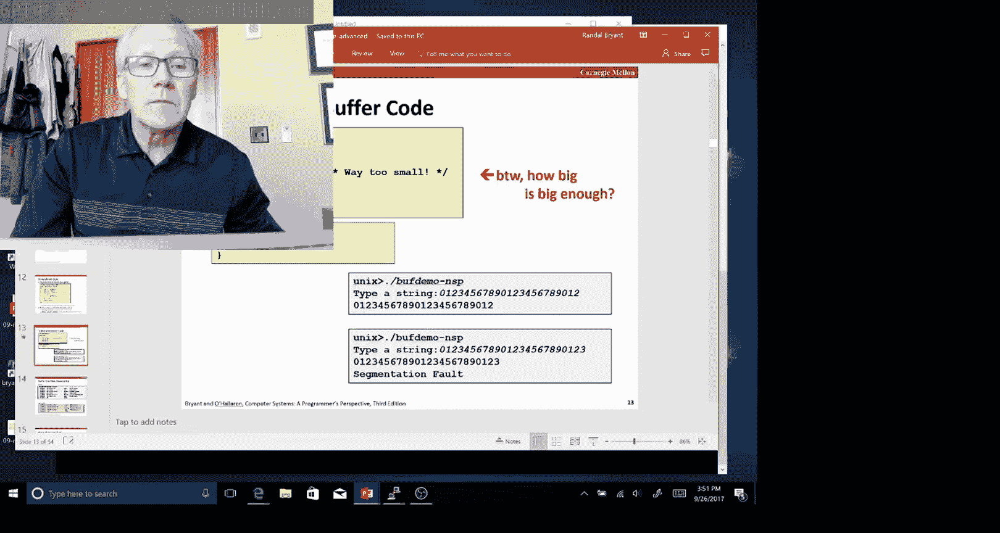

以下是一个使用 `gets` 的非常脆弱的代码示例。它只有一个大小为4的缓冲区，这并不大，并且设计用于回显输入。

```c
void echo() {
    char buf[4]; // 仅4字节的缓冲区
    gets(buf);   // 危险！未检查边界
    puts(buf);
}
```

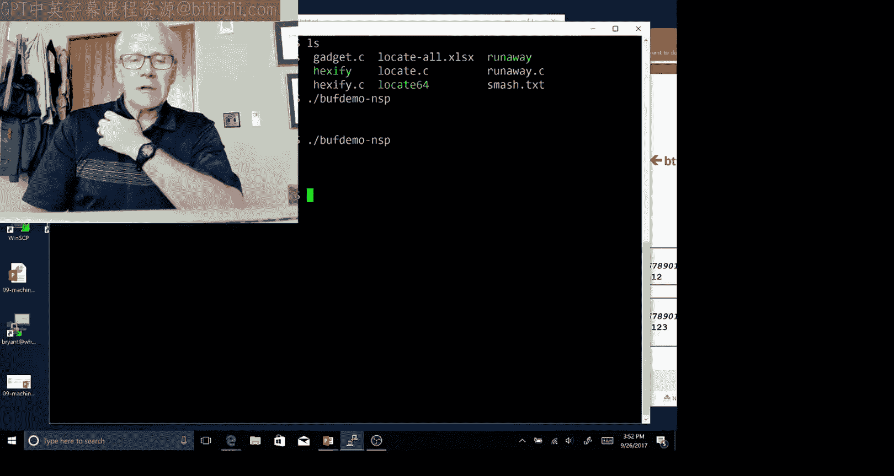

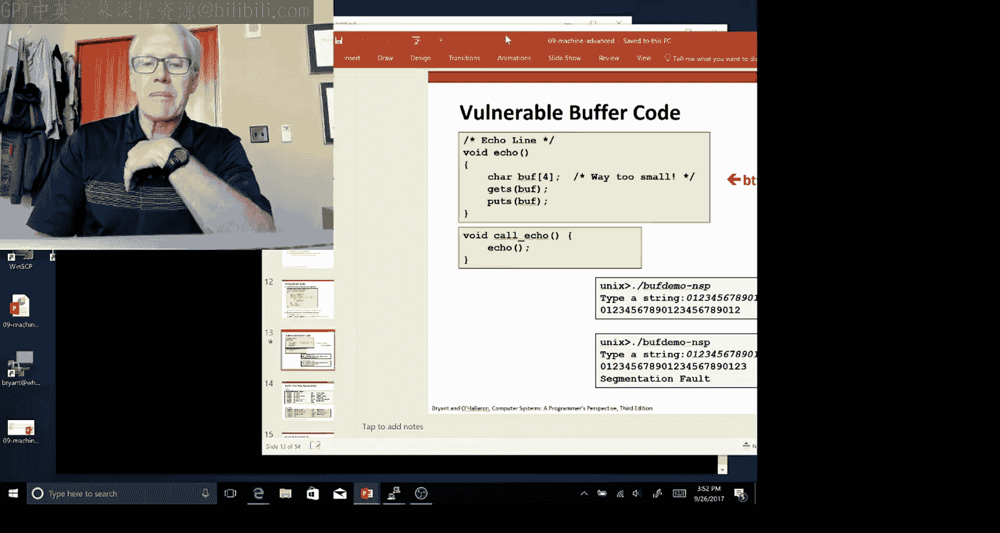

如果你访问课程网站上链接的代码，会找到一个名为 `buf_demo_nsp` 的函数（NSP代表无栈保护）。你会发现，你可以输入一个最多23个字符的字符串，它会正常打印并退出。但是，如果你尝试输入一个只多一个字符的字符串（24个字符），它仍然会回显，`puts` 工作正常，但当 `echo` 函数试图返回时，会导致段错误。让我们试着理解那里发生了什么，以及这一切意味着什么。

## 🔍 分析缓冲区溢出

为了理解，我们必须查看 `echo` 和 `call_echo` 的反汇编代码。


`echo` 在栈上分配了一些空间。十六进制 `0x18` 相当于十进制24，即在栈上分配了24字节。它将栈指针设置为 `gets` 的参数，然后 `gets` 调用 `puts`，之后释放空间并完成。

这里的关键部分是分配了24字节。栈上为缓冲区分配了多少空间？在 `call_echo` 中，唯一有趣的是它的返回地址是这个十六进制代码 `0x4006f6`。所以当 `call_echo` 调用 `echo` 时，它会将这个地址压入栈中。

因此，在调用 `gets` 之前，栈的布局是这样的：我们压入了返回地址，为缓冲区分配了24字节，但我们只打算使用其中的4个字节，所以有20字节是未使用的。为什么存在这些空间，我不完全清楚，但它确实存在，使得这个程序实际上可以接受比声明更大的字符串。

对于 `call_echo`，它将特定的返回地址放在栈上。如果我输入一个只有23个或更少字符的字符串，你会发现它不仅填满了提供的4字节缓冲区，还填入了未使用的区域，但不会破坏栈上的返回地址。在这种情况下，它只是在字符串的末尾插入空字符。这就是为什么23是一个神奇的数字，而不是24。我可以输入23个字符并以空字符结尾，这将适合这个分配的区域。

另一方面，如果我有一个24个字符的字符串，那么空字符将覆盖返回地址的低位字节。因此，它将不会返回到原始的调用位置，而是跳转到地址 `0x400600` 处恰好存放的任何代码。在这个例子中，它完全失控并导致了段错误。

## ⚔️ 漏洞利用：栈溢出攻击

漏洞是指可能导致程序行为异常的东西。作为攻击者，兴趣在于利用这些漏洞来获取系统访问权限。因此，有一类曾经非常常见的攻击称为“栈溢出攻击”，它利用未检查的缓冲区来覆盖机器状态（特别是返回指针），从而获得系统控制权。

其思想是，P正常调用Q，会将地址A压入栈，然后为Q设置栈帧。如果Q包含一些易受攻击的代码（如 `gets`），它可能会溢出其栈帧并修改A的值。

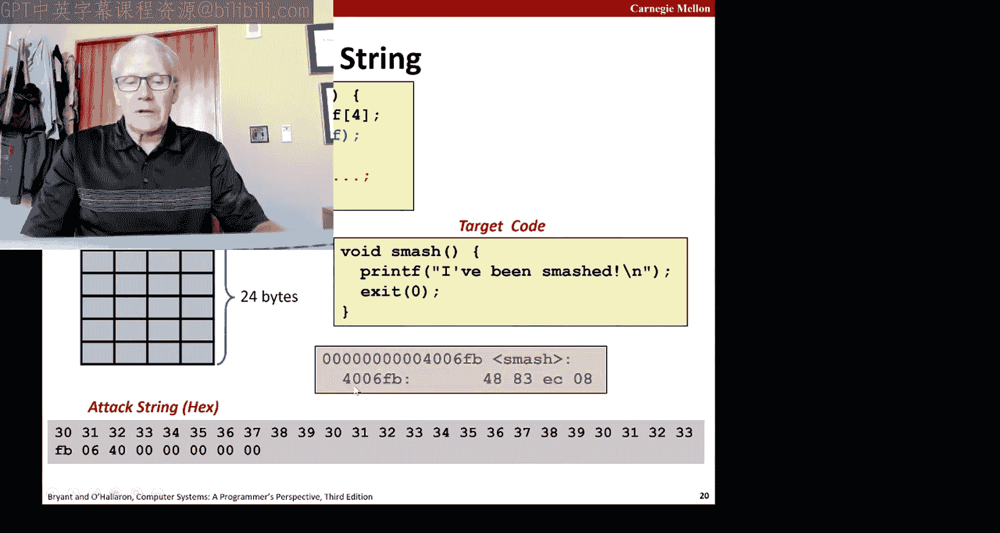

如果我的程序中有某个函数（比如位于地址S的函数 `smash`）不是正常的返回目标，那么如果漏洞利用可以覆盖返回地址并将其从A改为S，那么当函数返回时，它将不会返回到原始调用点，而是会跳转到函数S的第一条指令，本质上就是调用了那个函数。

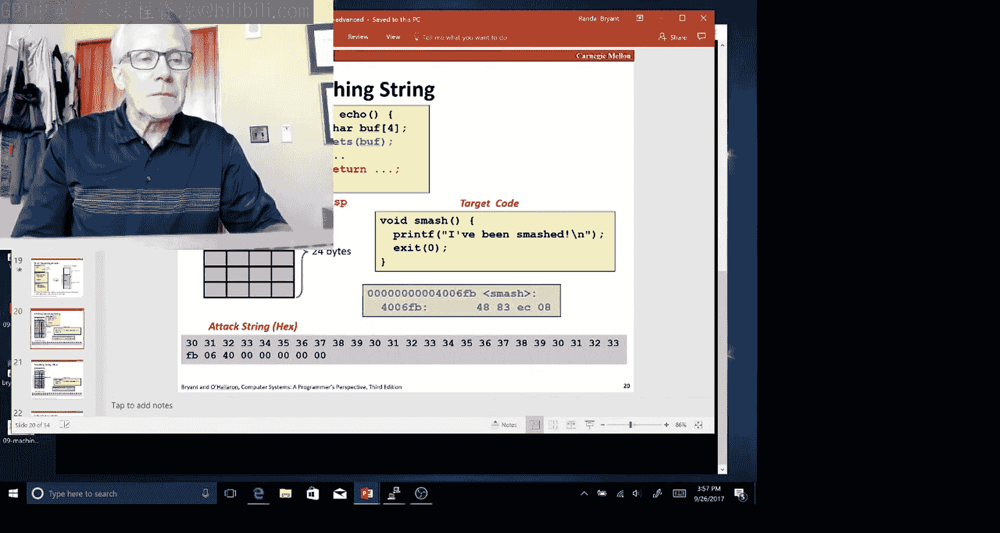

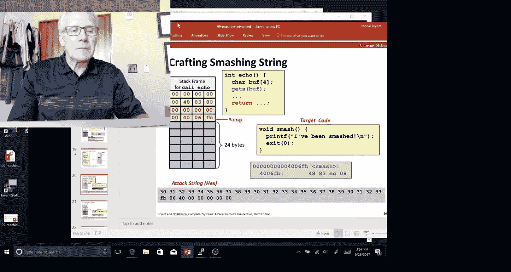

为了进行这种攻击，我需要创建一个字符串，其中有足够的填充字符以达到我想要的位置，然后在字符串中插入我希望它返回的地址（在这个例子中是函数 `smash` 的地址 `0x4006fb`）。


我可以演示这一点。

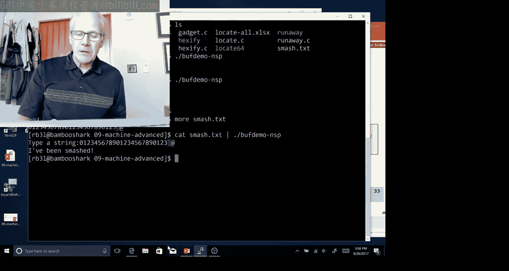


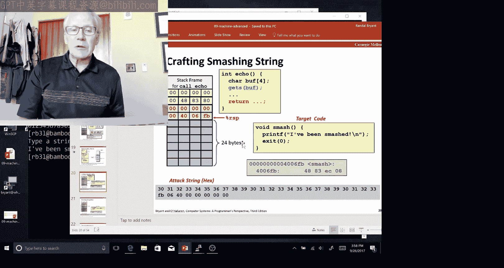

通常这有点棘手，因为字符串可能包含非标准ASCII字符。但我可以写一个函数。我写了一个名为 `hexify` 的程序，它将这种十六进制字节形式的字符串直接转换成原始格式。我创建了一个名为 `smash.txt` 的字符串文件，末尾看起来有点奇怪，因为它实际上包含了一些无法在普通终端上打印的字符。

现在，如果我将该字符串通过管道传输到我的 `buf_demo` 程序，你会看到它最终调用了名为 `smash` 的函数，该函数打印出“I've been smashed!”。因此，通过向这个程序提供一个巧妙设计的字符串，我能够使程序跳转到一个位置并执行一个不在程序正常控制流中的函数。

这是一种简单的攻击，但你可以看到，我现在能够控制系统并执行它原本不打算做的事情。


## 💉 代码注入攻击

攻击者可以更进一步：为什么不只是调用一个碰巧在那里的函数，而是调用一个我自己编写代码的函数呢？这可以通过一种称为“代码注入”的技术来实现。

其思想是在我们提供的字符串中，不仅构建用于填充的随机数字，还要构建编码了我们想要执行的指令的字节（即可执行代码）。然后，想法是用这个漏洞利用代码的起始地址覆盖返回地址。

现在，在函数调用中，如果我能将这个组合注入到栈中，那么当程序执行正常返回时，它实际上会跳转到栈中的某个位置并开始执行那里的代码。当它执行完后，可能会在漏洞利用代码中找到一个返回指令，这将使程序返回到原始程序的某个地方。但关键在于，我创造了让系统执行我作为输入提供的代码的能力，并且如果做得巧妙，操作系统本身完全无法检测。

这有点可怕，而且过去有很多易受攻击的代码和很多可以利用的地方。

## 🛡️ 防御机制

因此，人们采取了多种方法来减少这种情况，使攻击者更难得手。一是强制代码编写者遵守更好的规范，避免留下这些未受保护的缓冲区。另一种是使用保护措施来增加攻击难度，我们将展示其中的两种：一些由操作系统完成，一些由编译器完成。

以下是几种主要的防御技术：

1.  **使用安全函数**
    作为程序员，你应该采用的第一种方法是永远不要使用可能对缓冲区进行无限制写入的函数。应该始终给出边界限制。例如，用 `fgets` 代替 `gets`，`fgets` 的参数中包含最大长度，如果达到该长度（即使尚未遇到换行符或文件结束符），函数就会停止。

2.  **栈随机化（地址空间布局随机化 - ASLR）**
    系统可以做的另一种技术是所谓的栈随机化，或更一般地称为基于地址的布局随机化。其思想是，每次程序执行时，栈的起始位置都与之前略有不同。这样做的目的是利用这样一个事实：这种特定的漏洞利用要求我知道注入到栈中的代码块的起始位置。如果这个位置每次都在变化，那么我就很难利用它。这个格式不太好的十六进制数字系列显示，对于一个特定程序，它运行了多次，每次全局变量的地址都不同，这是因为整个栈在每次运行之间都发生了偏移。一般来说，避免攻击的一个好方法是使用难以预测、难以被攻击者利用的随机化事物。

3.  **不可执行栈（NX位）**
    另一种相对较晚才添加到Intel处理器中的技术是将程序的某些部分标记为可读和可写，但不可执行。特别是，有充分的理由需要读写栈，但没有很好的理由让程序能够执行位于栈上的代码。因此，如果我将这些内存部分简单地标记为不可执行，那么任何跳转到那里执行代码的尝试都会导致错误（段错误），基本上，你违反了操作系统强制执行的权限。

4.  **栈金丝雀**
    第三种技术称为栈金丝雀，由编译器插入，试图使易受攻击的代码不那么脆弱。这个术语源于19世纪80年代英格兰的煤矿。矿工们会带着关在笼子里的金丝雀下井。如果金丝雀死了，就表明矿井中有有毒气体，必须立即撤离。因此，金丝雀（有时你会听到“煤矿中的金丝雀”这个说法）的想法是一个能检测到问题并采取必要措施的非常敏感的对象。栈金丝雀的想法是在栈上放置一些小标记，以便能够轻松可靠地检测缓冲区是否溢出。

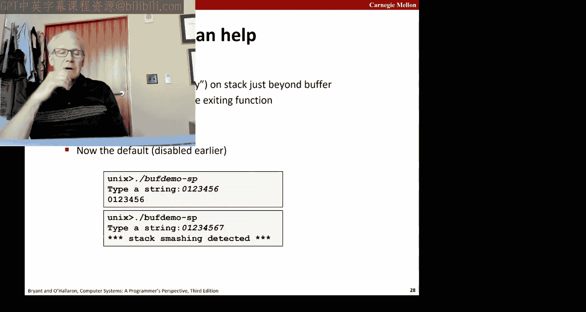

这已成为GCC的默认设置。为了编译那段代码（`buf_demo_nsp`），我禁用了该保护。你会发现，对于相同的代码，如果我给出一个超过7位数字的字符串，它会给出错误信息。


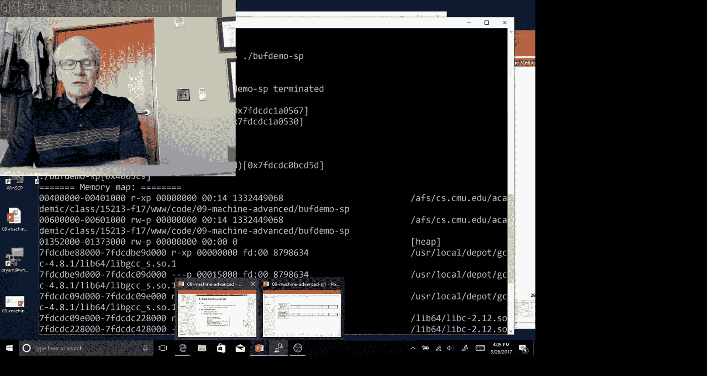

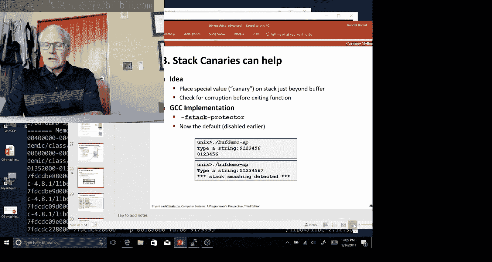

让我为你演示一下。`buf_demo_s` 表示启用了栈保护。所以，7个字符没问题。8个字符输入后，程序崩溃，并返回各种关于检测到栈破坏的错误信息。


所以，它没有强制执行我的8字节限制，但不知何故它检测到8（实际上是8加1，即9字节的数据）正在破坏栈，超出了程序应该支持的范围。

这是 `echo` 函数的代码，其中红线是用于实现栈金丝雀的部分。一般方案是：在内存的某个通常无法访问的部分，有一个字节序列，它是该特定进程运行时专门随机生成的。这成为一种密钥。程序的前三行会读取该密钥并将其放入栈中，就在缓冲区区域的上方。然后，稍后调用可能破坏栈的函数。在所有操作完成后，通过从栈中读回这个值并确保它等于最初写入时的值，来检查栈是否被破坏。如果不相等，就表明出了问题。请注意，每次执行都必须以不同且随机的方式进行，否则攻击者可能计算出它是什么，并伪装起来，修改金丝雀然后再恢复它。

因此，总体方案是：我有一个缓冲区，假设是4字节长。我添加了另外4字节的“金丝雀”值。任何溢出该金丝雀的操作都会被检测到。

## 🧩 面向返回的编程（ROP）攻击

攻击者非常聪明，如果他们看到像我们刚才展示的新防御措施，他们会试图找出新的攻击方法。特别是，我们看到地址空间布局随机化使得很难准确预测任何代码块或缓冲区的位置。不可执行栈意味着我无法在栈中注入代码。

因此，开发出了一种称为“面向返回的编程”（ROP）的技术。其思想是尝试将现有程序（数据段或共享库中）的代码片段串联起来，组装成一个可用于执行我想要的任何操作的序列。

通常你找不到一个完全符合我需求的函数，所以我必须以某种方式用一堆更小的片段来构建这个函数，而不是让它全部存在那里。

因此，我将组装一个称为“小工具”的集合，它们是指令序列，每个都以返回指令结束。在x86机器上，字节 `0xc3` 编码了 `ret`（返回）指令。其前的字节则可能是一个小工具的一部分。

一个小工具将是一个以 `0xc3` 结尾的字节序列。例如，这段代码的前四个字节，如果被执行，将产生将寄存器 `rdi` 和 `rdx` 相加并将结果存储在寄存器 `rax` 中的效果，然后有一个返回。或者我可能找到像这样的代码，其中有一些来自某个指令的字节序列，但它恰好编码了我希望拥有的指令，比如这个三字节序列编码了将寄存器 `rax` 的内容移动到 `rdi` 的指令，并以 `0xc3` 结尾。

一般来说，攻击者会用一系列小工具的地址加载栈。记住，每个小工具都以返回指令结束。所以现在，如果我能设置好，并且我能执行一个返回指令，那么接下来会发生的是：我将开始从栈中弹出地址，跳转到那个地址，那将是一些小工具代码，执行完后遇到另一个返回，导致弹出、执行代码、返回，如此循环，直到我完成整个序列。

因此，我可以获取这些小工具的任何序列（其中一些可能只做一件小事），并将它们组装在一起，基本上创建出任意代码。例如，如果我想实现将 `rdi` 和 `rdx` 相加的效果，我可以将一些填充字符和该代码片段的起始地址 `0x4004de4` 压入栈。你必须小心排序。然后，当我执行返回时，它将跳转到代码的这部分并产生那个效果。这个很快就结束了，但你可以想象通过将一系列小工具串联起来做更有趣的事情。

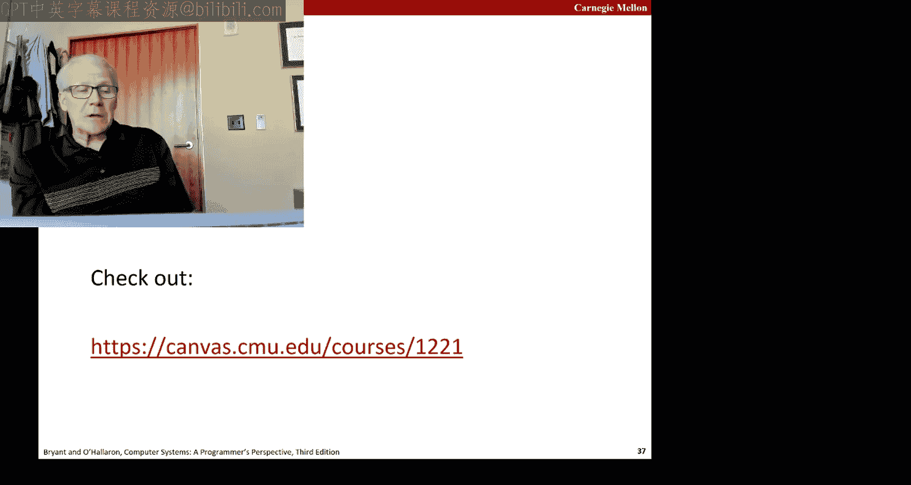

## 📝 结构体内存布局练习

对于在课堂上学习这门课的人，我们有一个小测验。我建议你暂停一下，做一个小练习来测试你对机器代码的理解。


这里有一张幻灯片，是测验中的一个问题，学生们觉得很难，值得讲解。

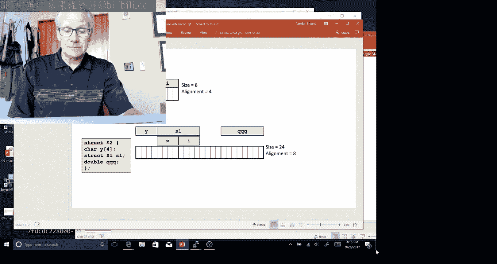

问题是这样的：有两个结构体 `S1` 和 `S2`。`S1` 包含一个4字符的数组和一个整数。`S2` 包含一个4字符的数组，然后内嵌了一个 `S1` 的副本。记住，对于结构体，当你内嵌它们时，你确实拥有该结构体的确切字节放在更大的结构体内部。如果是指向结构体的指针，情况就不同了，你会有指针。但在这种情况下，我们拥有的是实际的结构体本身。然后还有一个双精度数。

现在暂停，尝试使用这个图，标记出这两个结构体的不同字段使用了哪些字节。

好的，我们回来了。你发现了什么？我将直接跳到解决方案，希望你能理解。

首先，`S1` 总共8字节：需要4字节存放四个字符（四个单字节），4字节存放整数 `i`。关于结构体，要记住的一个重要点是它们既有大小又有对齐要求。这对于任何数据结构都是如此。大小是使用的总字节数。对齐要求是结构体内最大字段的对齐要求（如果是像 `int` 或 `double` 这样的简单原始数据类型，则对齐要求就是其大小）。在这种情况下，我的对齐要求是4，因为 `i` 是一个4字节对象。你会看到，我不必在这个结构体中添加任何填充，因为按照声明方式，`i` 会在4的倍数地址上开始。

另一方面，对于结构体 `S2`，你会看到我有4字节用于 `y`，然后我可以直接将 `S1` 内嵌在它后面，因为 `S1` 有4字节对齐要求。所以我会用接下来的8个字节存放它。之后，我必须插入4字节的填充，以满足双精度数 `qqq` 的对齐要求。如果我不这样做，`qqq` 将从地址12开始，这不是16的倍数。通过添加那额外的4字节，现在 `qqq` 从字节16跨越到字节23。内部存在这种浪费的空间。

这类问题在考试中经常出现，我们很容易生成。非常重要的是，你要了解、理解并完全熟悉结构体的概念：它们是如何布局的，它们的对齐要求是什么，它们有多大，以及它们是如何组织的。

## 📚 本节课总结


在本节课中，我们一起学习了机器级编程中与内存相关的核心概念。我们首先了解了程序内存空间的整体布局，包括栈、堆、数据段和文本段。然后，我们深入探讨了缓冲区溢出这一常见漏洞的原理，通过 `gets` 函数示例展示了如何因缺乏边界检查而导致栈数据被覆盖。我们分析了攻击者如何利用此漏洞修改返回地址，执行非预期的代码，甚至通过代码注入和面向返回的编程（ROP）技术实施更复杂的攻击。最后，我们介绍了多种防御机制，包括使用安全函数、栈随机化（ASLR）、不可执行栈（NX）和栈金丝雀，以增强程序的安全性。理解这些底层机制对于编写安全、健壮的系统软件至关重要。