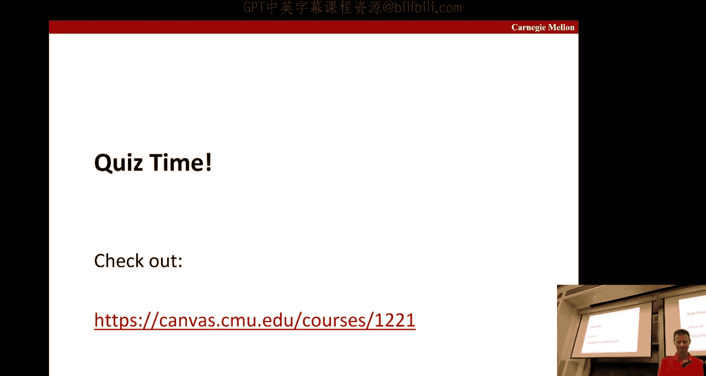
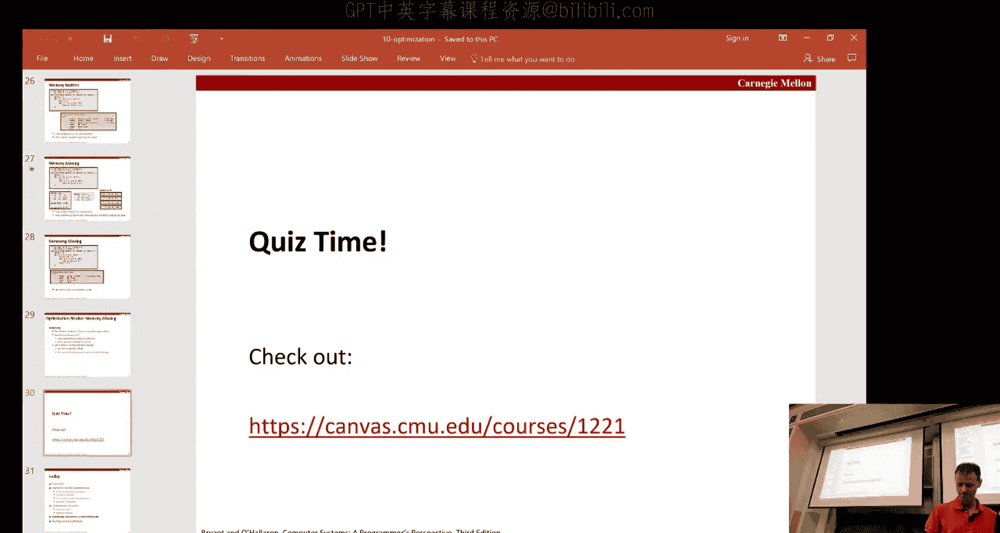
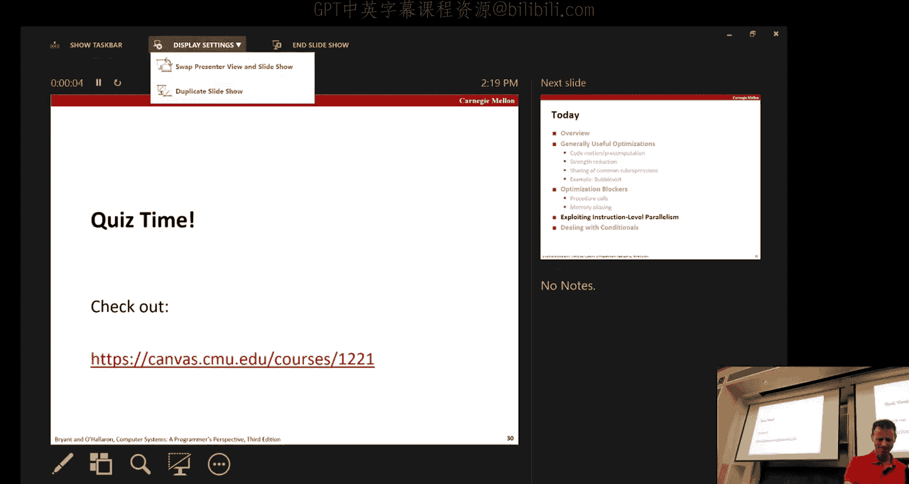
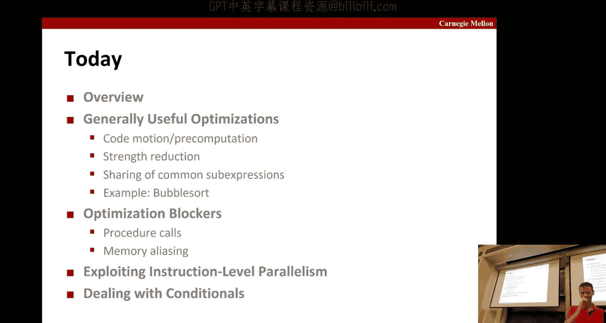
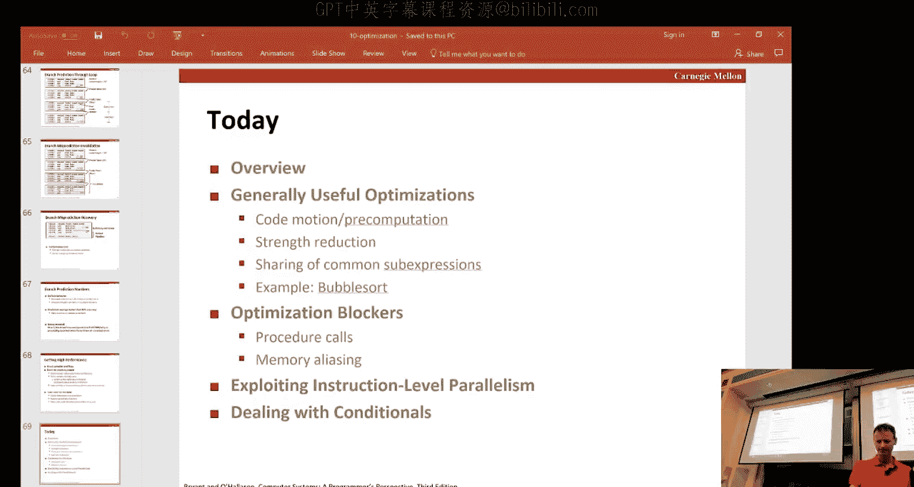

# 计算机系统导论：第5章：代码优化 🚀

在本节课中，我们将要学习代码优化的核心概念。我们将探讨编译器如何自动优化代码，以及哪些因素会阻碍编译器进行优化。我们还将了解如何利用现代处理器的指令级并行能力来提升程序性能，并讨论条件分支对性能的影响。通过学习这些内容，你将能够理解代码的性能瓶颈，并学会如何编写更高效的代码。

## 编译器优化概述

上一节我们介绍了课程主题，本节中我们来看看编译器通常执行的一些通用优化。

编译器会分析代码，寻找并消除冗余计算。例如，当你使用GCC编译时，如果不开启优化选项，生成的汇编代码会与你编写的C代码有更清晰的对应关系。但通常，使用`-O3`优化级别时，编译器会进行大量变换，例如内联函数等，以加速你的代码。

### 代码移动

代码移动是一种常见的优化。其核心思想是，如果循环内的某个计算是循环不变量（即其值在循环迭代中不改变），那么就没有必要在每次迭代中都重新计算它，可以将其移出循环。

以下是一个C代码示例：
```c
for (int i = 0; i < n; i++) {
    result = n * i; // 如果n在循环中不变，这个乘法可以移出
}
```
优化后：
```c
int temp = n;
for (int i = 0; i < n; i++) {
    result = temp * i; // 现在循环内只使用预先计算好的值
}
```
在汇编层面，编译器会自动进行这种优化，将类似`n * (n-1)`的计算置于循环之外。

### 强度削弱与公共子表达式消除

编译器还会尝试将昂贵的操作替换为更廉价的操作。例如，将乘以2的幂次转换为移位操作，或者利用`LEA`指令进行巧妙的计算。

另一个常见优化是公共子表达式消除。考虑一个在二维网格中计算上下左右邻居位置的程序：
```c
up = (i - 1) * n + j;
down = (i + 1) * n + j;
left = i * n + (j - 1);
right = i * n + (j + 1);
```
这里重复计算了`i * n`。优化后，我们可以先计算`base = i * n`，然后：
```c
up = base - n;
down = base + n;
left = base - 1;
right = base + 1;
```
这样就将三次乘法减少为一次，提升了效率。编译器在生成代码时会自动应用此类优化。

## 优化示例：冒泡排序

上一节我们介绍了一些通用优化，本节中我们通过一个具体的例子——冒泡排序算法，来观察编译器如何逐步优化代码。

我们从一个简单的、假设数组索引从1开始的冒泡排序C代码开始。编译器首先会将其转换为一种中间表示，这是一种直接的、机械的翻译。

初始生成的代码效率不高。例如，在计算数组元素地址`a[j]`和`a[j+1]`时，存在冗余的加1和减1操作。编译器首先会进行局部优化，消除这些明显的冗余。

接下来，编译器会发现，在交换元素时，`a[j]`和`a[j+1]`的地址已经被计算并存储在临时变量中，因此可以复用这些值，避免重复计算地址和加载值。

进一步的优化是观察循环。在内层循环中，变量`j`每次递增1，而基于`j`的地址计算每次递增4（假设`int`为4字节）。因此，我们可以直接使用地址指针进行循环，完全消除对`j`的依赖。初始化时设置好起始地址指针，每次循环时指针增加4，并通过比较地址指针来判断循环结束。

经过这一系列优化，内层循环的指令数显著减少。所有这些变换都由编译器在确保程序语义正确的前提下自动完成。

## 编译器的优化限制

上一节我们看到了编译器强大的优化能力，本节中我们来看看哪些因素会限制编译器进行优化。

编译器优化必须保证安全性。它只能基于对程序已知的信息进行不会破坏程序正确性的变换。一个例外是，如果程序使用了非标准的语言特性，编译器可能被允许采取更自由的行为，因为编译器作者不需要为所有非标准特性负责。

编译器优化的主要限制包括：
*   **过程内分析**：传统编译器通常只在一个函数（过程）内部进行分析优化。进行跨函数的全局分析非常昂贵，尤其是对于大型程序。
*   **静态信息**：像C这样的语言，编译器优化仅基于代码的静态文本，它不知道程序运行时的输入数据，因此必须做出保守的假设。
*   **内存别名**：当两个指针可能指向同一内存位置时，会阻碍优化。编译器必须假设这种可能性存在，从而无法安全地进行某些代码重排或复用。

### 优化受阻示例：小写转换函数

考虑一个将字符串转换为小写的函数：
```c
void lower(char *s) {
    for (int i = 0; i < strlen(s); i++) {
        if (s[i] >= 'A' && s[i] <= 'Z') {
            s[i] -= ('A' - 'a');
        }
    }
}
```
这段代码的性能是**O(n²)**，而非预期的**O(n)**。原因是每次循环都调用`strlen(s)`，而`strlen`需要遍历字符串直到遇到空字符。

为什么编译器不能将`strlen(s)`移出循环？因为`strlen`是一个函数调用，编译器无法确定每次调用它是否返回相同的值（例如，字符串内容可能在循环中被其他方式修改）。因此，编译器必须保守地假设每次都需要重新计算。

解决方案是进行手动代码移动，在循环前计算一次长度：
```c
void lower(char *s) {
    int len = strlen(s);
    for (int i = 0; i < len; i++) {
        if (s[i] >= 'A' && s[i] <= 'Z') {
            s[i] -= ('A' - 'a');
        }
    }
}
```
对于短小的函数，编译器可以尝试内联它，从而看到函数内部逻辑并进行优化。但最直接的方法还是程序员自己进行这种显而易见的优化。

### 优化受阻示例：行求和函数

另一个例子是计算矩阵各行和的函数：
```c
void sum_rows(float *a, float *b, long n) {
    for (int i = 0; i < n; i++) {
        b[i] = 0;
        for (int j = 0; j < n; j++) {
            b[i] += a[i*n + j];
        }
    }
}
```
在内层循环中，代码反复读写`b[i]`（加载、相加、存储）。看起来编译器可以优化为使用一个寄存器临时累加，循环结束后再写回`b[i]`。



但编译器不能这样做，因为存在内存别名的可能性：参数`a`和`b`指向的数组可能重叠。例如，如果`b`恰好是`a`的一部分，那么在内层循环中更新`b[i]`可能会意外地改变后续要读取的`a`中的值。编译器必须考虑这种极端情况，因此无法进行优化。

解决方案是引入局部变量，明确告诉编译器我们的意图：
```c
void sum_rows(float *a, float *b, long n) {
    for (int i = 0; i < n; i++) {
        float val = 0;
        for (int j = 0; j < n; j++) {
            val += a[i*n + j];
        }
        b[i] = val;
    }
}
```
这样，累加过程完全在寄存器中进行，消除了不必要的内存访问，性能得到提升。

## 利用指令级并行

上一节我们讨论了优化障碍，本节中我们来看看如何利用现代处理器的指令级并行来突破性能瓶颈。



现代CPU内部有多个功能单元（如加载单元、存储单元、多个算术逻辑单元等），并且采用流水线设计。这意味着在理想情况下，多个操作可以同时进行。例如，当一条指令在执行时，下一条指令已经在解码，再下一条指令在取指。



### 性能界限

程序的性能受两个关键因素限制：
1.  **延迟**：完成一个操作所需的时间（周期数）。
2.  **吞吐量**：单位时间内可以启动多少个该操作。

有些操作（如整数乘法、浮点运算）具有多个流水线阶段。虽然完成一次操作的延迟可能较长（例如3个周期），但由于流水线化，其吞吐量可以很高（例如每个周期可以启动一个新的乘法操作），前提是这些操作之间没有数据依赖。

### 案例分析：合并运算函数

我们通过一个“合并运算”函数（可执行累加或累乘）来探索性能提升。初始的简单实现性能不佳，因为累积操作`acc = acc OP data[i]`形成了长的依赖链，后一次操作必须等待前一次操作的结果，无法利用流水线。

以下是逐步优化策略：

**第一步：循环展开**
一次处理两个元素，但采用相同的累积方式`acc = (acc OP data[i]) OP data[i+1]`。这并没有打破依赖链，帮助有限。

**第二步：重结合变换**
改变结合顺序，计算`acc = acc OP (data[i] OP data[i+1])`。这样，`data[i] OP data[i+1]`可以独立计算，与`acc`的更新并行，减少了依赖，提高了吞吐量。

**第三步：多路累积**
创建两个独立的累积变量，分别累加偶数索引和奇数索引的元素：
```c
acc0 = acc0 OP data[0];
acc1 = acc1 OP data[1];
acc0 = acc0 OP data[2];
acc1 = acc1 OP data[3];
...
result = acc0 OP acc1;
```
这完全打破了顺序依赖，允许两个累积流完全并行。结合循环展开，可以充分利用多个功能单元。

通过实验不同的展开因子和累积路数，可以找到特定硬件和操作类型下的最优组合。最终，性能可以非常接近由硬件功能单元数量决定的理论吞吐量极限，相比原始代码有数十倍的提升。

### 向量化

现代CPU还支持SIMD（单指令多数据）指令集（如x86的SSE、AVX）。这些指令可以同时对向量寄存器中的多个数据元素（如8个32位整数）执行同一个操作，从而在指令级并行之上，进一步实现数据级并行，获得更高的吞吐量。

## 条件分支的性能影响

上一节我们探讨了如何利用并行性，本节中我们来看看条件分支如何成为性能提升的障碍。

为了保持流水线充满，处理器需要提前取指和解码指令。当遇到条件分支时，处理器在真正执行到该指令之前，并不知道程序会走向哪个分支（“taken”还是“not taken”）。为了不使流水线停滞，处理器必须进行**分支预测**。

处理器会根据历史信息（保存在分支预测缓冲器中）来预测分支的走向。如果预测正确，程序继续高速执行。如果预测错误，处理器必须丢弃所有在错误路径上已经进行的推测执行结果，并回到正确的分支起点重新开始，这会导致严重的性能损失（流水线清空）。

### 编写分支友好型代码

对于循环，处理器通常能很好地预测“继续循环”，只有在循环退出时才会预测错误一次。

对于`if-then-else`结构，处理器在没有任何历史记录时的默认预测是“分支不跳转”（即执行`then`块之后的代码）。因此，一个有用的编程技巧是：**将更常见的条件放在`if`中，使得最常见的情况是“不跳转”的路径（fall-through）**。例如，检查指针是否非空比检查是否为空更常见。

## 总结与建议

本节课中我们一起学习了代码优化的核心思想。我们了解了编译器能够自动进行的优化（如代码移动、强度削弱、公共子表达式消除），也认识了限制编译器优化的因素（如内存别名、过程间分析限制）。

为了编写高性能代码，建议：
1.  **警惕隐藏的算法低效**：像在循环内调用`strlen`这样的操作。
2.  **帮助编译器**：使用局部变量避免内存别名问题，进行必要的手动代码移动。
3.  **关注热点**：将优化精力集中在程序最耗时的部分（通常是深层嵌套的循环）。
4.  **促进指令级并行**：通过循环展开和多路累积等技术，减少操作间的数据依赖。
5.  **考虑分支预测**：组织代码结构，使最常见执行路径成为分支预测的默认路径。
6.  **保持代码清晰**：在追求性能的同时，不应过度牺牲代码的模块化和可读性。





通过理解底层系统如何工作，你可以更好地与编译器协作，写出既优雅又高效的代码。