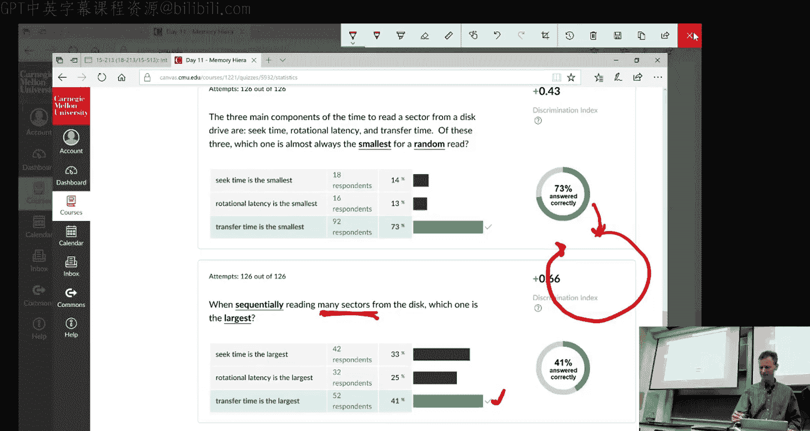
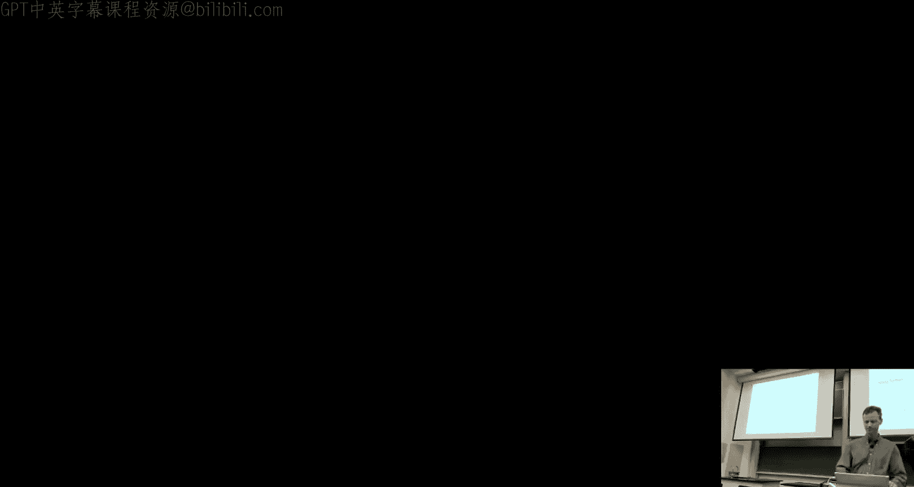
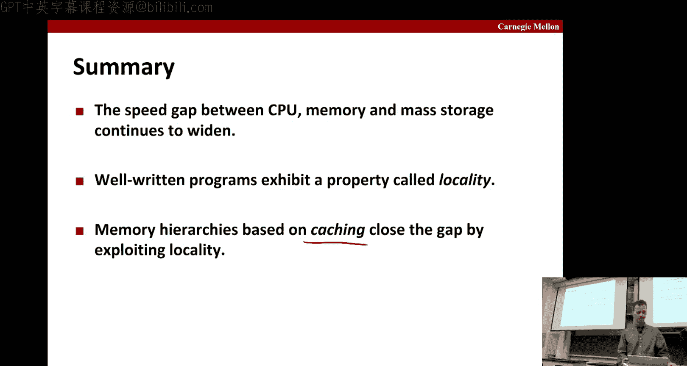

# CMU《计算机系统导论｜CMU 15-213，15-513，14-513 Introduction to Computer Systems 2017 p12 12 - The Memory Hierarchy -BV17jcReyETC_p12-

All right， why don't we get and get started？So there's been some questions about the midterm。

Basically， we will send out。A signup sheet。Probably early next week。

And you sign up for your four hour slots either on Tuesday， Wednesday， Thursday evening or Friday。

At the same time， we'll be releasing additional practice questions that you can take for those who haven't looked at the syllabus。

The exams are taken into the classrooms， they're online。

 you get questions electronically you use them electronically。And as like I said。

 you're giving a four hour block of time the exam is only intended to take about an hour and a half。

 but we don't want anybody to have to rush。And the other thing that will happen is we'll have two review sessions。

The啊。Monday of the week of the exam。There will be a review session during normal recitation hours。

And the day before that， we'll have one of our Sunday night sort of boot camps。

 but it'll be an examator。In terms of the final exam。

 some people have looked at the sort of the release scheduled final exam so they don't see 213 on there and so they' been worried。

It's because we don't schedule our final exam through the registrar's office because again。

 our final exam is done online in the clusters。Very similar to way midterm is done， again。

 there's four days or so for which you can take the sign up to take the final CM。Okay。

 so any questions on how the exams are going to work in this class for your research？Okay， good。

Today we're going to talk about the mearchy。In particular。

 we're going to start off by talking about scores， technology and trends。

Spend Bush the lecture on that and then a little bit talking about locality of reference and cashing。

And that'll lead into the Thursday's lecture， which is entirely on cash。

And that'll be helpful for doing cash La， for instance it goes out later today。Okay。

 so what we normally think about as memory is this random access memory。😔，It comes in。You know。

 sort what's called a dim form factor， you just plug it into slots， on of your machines。

 dependingending what kind of machine you have you may have。Just one slot here may have。

 say eight slots and so forth。And the basic we talked about memories being bitete addressable。

 the basic unit of memory that you can address is a p。But from the。So the technology standpoint。

There's individual cells which will encode a single bit。嗯。So modern technologies， particularly in。

That's the steam world。Have tried to make some enhancements of storing multiple bits for cell。

 but the traditional thing is just to have a single bit for cell。

Random access memory comes in two flavors， DRA， which is kind of the stuff that。

We're used to because that's what we think about when we're programming。

 but for the caches that are internal to the processor。

 we'll use a different kind of Ramm called static gra eRA。But what are the obvious to there？啊。

So DRAM， as I mentioned， has one transistor for bit， sort of one cell。

 whereas SM that you need four or six transistors for bit。

The trade off view is that SRM is faster to access by a about order of magnitude。

It doesn't need refresh to Dium as this property that you have to constantly apply current to。

Sort of keep the values that are stored there from degra。So they're stored as voltages。

 those voltages leak， and so over time， you could lose your data。

 so to make sure that doesn't happen， there's a refresh step。

It's done relatively frequently that we'll go through and read a row of DRA。So of clean it up。

 amplifier was there to get it back to nice， fully charged values and so forth。嗯。

So why do we have gear at all if it's slower and it needs refreshed because it's 100 times cheap。

 okay we could not afford， I mean， your machine would cost almost 100 times more if all the memory was Sra。

And as noted here， as I mentioned， the SRM is typically used for things like。Prorusss their caches。

Cache memories within the processor， DM is used for things like main memory and frame buffers。

So the basic DM cell has not changed since 1966。😔，Intel actually。Took off as a memory company。

 and mean we think of it as making chips now， but it started off。

 it's got its mark making memories and transitioned to making chips。

And they got out of memory business。That's the way companies work， I guess。嗯。

There are different flavors of DM that have come out over the years。

 some of this you may have heard of， the one you may have heard of the most is the most recent one。

 which is the family and DDR。It stands for double data rate synchronous theium。啊，你。

They are different by the。So size the small it prefe buffer。So for years two bits。

 then weve got to four and eight and so forth。And DDR is really the standard since the last seven years for both server and desktop systems。

And the Intel QI7 support both DDR3 and DDR4。Then there's oils。

 so that's what we're used to the consider of memory。

 it's this dynamic stuff that needs to be refreshed。There's also nonva memories。

Memories that don't lose their information if the power goes off。

And historically that's been used for things like redo memory that you would put inside a chip so that when the thing roots up。

 it has something to read， right that gets programmed during production。

 there's also notions of programmable rum。You can program once， and then there's Eprom。

 which you can program more than once， but it's kind of very heavyweight to bulk era erase it。

Then there's Eprom。Which has， again， the capabilities to era era and use。

 but it can be done electronically。More recently， you probably know all about flash memory。

Which is typically found in Sal Sea drives or SSDs。

It's a type of E prom that allows you to erase in sort of large block sizes at a time。

 and then you can。Right from there。It has a lot of advantages which we'll cover in a bit。

 but one of the disadvantages that it wears out so you can only write it anyone sell of this so many times before it writes out。

 so roughly around 100，000 times if you go through thiscycl。

 then the memory don't get you anymore and you need to find new stuff。Okay。Which is actually。

 you know， if you sell memories， it's probably a good idea， right？For you to find yourself。Now。

 the latest and greatest thing that you may have heard of， but probably don't happen。Access to yet。

Although there are some urgent shipments。Is these emerging class of nonvaulting memories。

That are using technology very different from what's in flash， from Nan flash。

And the materials that they use are things like。Fhaace change memory and resistive RAM and STT RAM。

These are all again sort of new technologies， the vendors consider these closely guarded secrets is exactly what technology they're putting in these things。

So the most commercially available and announced。Product is this Inteloctane。

 which uses a technology they call 3D cross point。You can see the picture here。And that is， again。

 in this new emerging family of。Novol memories that are made out of these new materials of which they won't tell us exactly which it is。

So we don't know， but I mean even when I worked for Intel， you know it was kind of need to know。

 they wouldn't tell you if you didn't absolutely working on the product and needed to know。

But these are exciting new technologies， they're currently the initial versions of these are coming out as。

Solicity drive， so flash replacements。But in a year or so。Well。

 let's let's say a year from now where that projection has been pushed ahead by six months for the last two years。

 so you'll take away the grain of soil that's been a year from now。

 you know every six months for the last two years but anyway it's eventually coming and it will be one of these dim form factors that I mentioned that DRAM is in now and so you can just plug it in where you now plugging in in DRAM and you'll get this nonvolat memory that you can again。

Read and write， it's very to address that we want just like memory to be critical。All right。

 so historically nonvol memory has been used in these sort of firmware programs。

 the kinds of programs that like the bios that starts up。

 that's the first thing that starts up when you turn on your machine， disk controllers。

 networks cards， and so forth。It's been used in cellate disk。For a number of reasons。

 one is that it's lower energy， the other is that it persists so you don't lose it if you power down on your phone or your phone inside a battery piecesis。

It's more shock resistant。You'll see when we cover disks。

 these things are very mechanical and so when they drop， they break。It's allizer。Electronics。

They're less likely to break。And because so historically， they've been in smaller。

 small form factors。But because of the energy savings of these things。

 they make sense sort of the other end at the very large data centers。

 where some significant fraction of your operating expenses goes to energy。

 your Google or Facebook or whatever you're running these big data centers or Amazon。

 you're running these big clouds。You benefit sort of cost of ownership by using solid safe drives because they're low energy consumers。

不给你国信息话。Yes。他。That's a good question， I assume thats。That's a type of air correction。Okay。

 so how does this thing get hooked up by you have the system bus and a memory bus shown here？And so。

All devices that are sort of memory based can hook off the memory bus。So if you have a re。

 for instance， the CPU， which is sort of shown by here and include the ALU。

 which is the computing part of it， plus the register file。

It has a bus interface and if it wants to do a read for instance。

 for instance this load operation it wants to get from location A and store the value REX。

 the first thing it's going to do is it's going to put on the memory bus， this address。

 and indication that it's a read。Okay。And in response to that。

The memory will transfer the value of x， the value of location A is x on the bus。

 and then it can be put in the register。Okay， so were stuck in register。是谁？Similarly on the right。

 the first thing you do is you send out the address。Okay， you tell the memory， okay。

 the next thing we send you， I want you to store in location A。And then you put the actual value。

 the data word on the bus， and then it gets stored in the memory location。可以。All right。

 any questions on that？And there's all sorts of intricacies about actually what happens inside the main memory。

 where it's in the book， it's also in the there's slides， extra slides at the end。

 supplemental slides at the end of this deck， you can look there and see more about how for instance when you go to the memory。

 and you request a particular， word from the memory。

 it actually will spill out into what's called a row buffer。

 an entire row of cells in the hopes of getting some locality maybe your future references will visit that row and it would be sort of a cache for the memory system。

That can return values quickly。哎， so this is呃。You know the standard hard drive。

And if you look inside it， you see this big long thing， which is the collection of platters。

 which is where you store the data gets stored， there's a spindle which causes the platters to move。

There's an arm。That drops down and reads from the platters and then some way of controlling the arm through the actutor。

Then there's the connector to the outside world。And various kinds of electronics。Okay。

 so if we look at these in turn。We see that this is a picture of a platter。

And the centered against the spindle。And each there's like concentric circles of data。

 those we'll call it tracks。And then each track。Take anyone one track。

 it's divided into these little sectors with some gaps in between them。Okay。

So if that was sort of the view of a single similarimar now， if we look on the side。

 we'll see that these things have multiple platters。And not only that。

 they're able to read from the both sides of the pla。这些意思。Scr from the top and the bottom。Okay。

 so we talk about the capacity of disc， one of the main reasons that disc。I still use it all。

 hard drive， are still use it all today is because they have tremendous capacity for the price and for their size。

So the capacity is usually measured in gigabytes。Where， again， a gigabyte is 10 to the ninth bytes。

So you have kilobytes， 10 a third of megabytes，7 to6。Gabyte at night。

And there's sort of three factors that go into the actual overalleral capacity。

 one is sort of the number of bits。That you can squeeze into sort of one inch segment of a track。

Then the number of tracks that can be squeezed into a one inch radial segment， right。

So one is how many bits can you squeeze into when is little？One inch or one inch little pieces。

The other thing is how many of these tracks can you squeeze？You know how thin are they。

 so how many can you squeeze into a single clter？And the aerial density is based on the product of these two。

Okay， so how many can get an in squared on your disc？Okay， so。

The disc partition the tracks into these disjoint subsets called recording zones。

 so here I've shown in sort this lavender color， the outermost zone。Okay。

 and this will consist of a series of tracks generally。All right。And。Inside a zone。

 you have the same number of sectors， so all the tractions in this purple thing have this exact same number of sectors as shown。

 this is a sector right here， as shown it as a picture。But if you think about it。

 that zone is at the widest part of the sonny， so there's actually more area out there。Okay。

 so if you go to one of these zones， that's much closer。To the spindle。And the sector size is fixed。

 and you realize you just can't get as many of them。Allro， right？

So the notion of a zone is sort of a discretization of this feature。 so it says， okay。

 the innermost zone maybe one to before you maybe to maybe eight in this picture。

Then you have some intermediateing zones， you get somewhere between eight and whatever the maximum is。

 and this added OS are， at least in this picture is what 16。Okay， so it's just a way of。

It's taking something that could be sort of more continuous。

where more incremental where you have you know set this tract has one more sector than the previous one and two more and three more and just making it more uniform by having it jump in bigger numbers and then sort of。

Making all these have the same number sectors， of course which means you remember I showed you the gaps。

 read these ones at the very end have slightly larger gaps。

Because the sectors themselves are the same size， then the ones in here will have the least gap。Okay。

 and then use the average number of sectors to track when computing capacity。

So as a formula looks like this， you say， well， how many bytes can we store in a sector？

And then what's the average number of sectors for track？The number of tracks per surface。

 the number of surfaces per platter， which as we said is two， and the number of platters per disk。

Okay， so here's an example and you just multiply it all out and you see that this is a for that particular example。

 it's a 30。Give it my disc。可以。How does six operate？The set of the arm moving around。

 the arm stays still and the platter operates。So if you think of this the spindle is turning this whole thing。

 when you rotate the spindled， the disc goes the pla go along for the right。

And the way the arm gets actuated is it just moves。From track to track， okay。

 so this picture is showing that this arm， which is in a fixed position。

 can rotate to any of these different kinds of tracks。Okay。Now。All the arms are。So are rigid。

 so they're actuated in parallel， so they move in unison。

 so if you decide to move the arm inward to one of these inner tracks。

 then it's inward on all of them。Okay。So。What does that tell you about how you may want to actually lay out the data on this disk？

I mean， given that， you know， common usage is to read like a whole bunch of data from the disk。Yes。

Exactly， so instead of maybe you naturally think， oh， I'll just load up upon my data。

 maybe on this one platter。That data， I think can to be read consecutive like a really large file。

 that would be very inefficient because you would only be reading off this one so youd only be able to read off this one so get no parallelism。

So you want to use all these arms at once and as was noted since they all sort of moved in unison。

 then the information you want to sort this big file is at the same spot on all these platters。Good。

Okay， so。So now let's think of the arm as being fixed on the top of this picture。

And it's currently summer。And now and it's。Okay， so the other thing is that the the。呃。The the。

Sort of the natural thing for a dis to do is to keep spinning。

So it's not like it starts and stops and starts and stops it starts and stops rights like once once it's fired up。

 but once it just keep spinning I mean if there's nothing accessing yes it it will power itself down。

 but if it's in the middle of accessing a bunch of requests。

 then it will just keep spinning and you have to pull data off when it goes past and we'll see example here。

Okay， so it's rotating around counterclockwise。And so if it's rotating that way。

 then you want to and your head is pointing to this sector here。Then as it goes by。

 you can read this blue sound。The disc is rotating that way。Right， so thatll move this data。Okay。

And when you're done with that， that's the position you' to be in。Now。

 let's suppose the next thing that you want to read is this red sector。Okay。

So the first thing you need to do is you need to sink for the red。

 so sink means you want to pull the head。Move the heads to the right track。

 so in this case is' the outer track so you can see that here。

And then you just have to wait for that to come around right so maybe if it was。

So if it was here when you started， say and by the time you move this head so you it's spinning right so in the time it took you to do the seek so this head moved to here。

This red thing has moved a little bit in this picture。 and some amount is able to get around。

But it hasn't made it all way to here。And so then you just wait and you wait for it to show up and that's called the rotation ratess。

 and that's a term in the delay to read this thing。That's called rotation Le。

And then when it gets there， then you can read it。So from the time of the previous data transfer。

 the time components from there are CQ and the rotational latency and the actual transfers。

and this is just expressing as a formula， the axis time。

 the average axis time is just sort of your average seat time plus your average rotational time。Plus。

 your average transfer time。Seat times are typically in the sort of three to nine millisecond range if you're doing a random。

Yeah， sort of a random movement。Fanddom seek。The rotational laency。Is well。

 it depends how fast this thing is spinning， right？

So it spinning is measured in revolutions per minute。So if you have a disc that's spinning it。呃。呃，是。

7，200 revolution per minute。It means that。Right that you got basically。But we want to convert that。

 okay so the hour is rotational， so let me sorry。On average， you have to rotate halfway around， okay？

If you get lucky less， if you're unlucky more， but on average you rotate halfway around。

 and then it's sort of at one over the rate。Or second it tip you to hours around。

 so if the rotation is is7200， that's especially minutes you have to actually divide。

You have to motpivly that to get the number of seconds and that gets you the overall time。

To go halfway around。And then the transfer time is the time to read the bits， and that's again。

 a function of how fast the thing is spinning。And then converting from seconds to minutes and then it has to do with the average number of sectors per track because that's telling you about the size of the sector。

可以。So for example， if you have a disk and it tells you and it specs that it rotates at 1700 brothers per minute。

 and the average seat time is nine milliseconds and the average number of sectors per track is 400 on this disk。

Then using our little formulas here， we can calculate all these times。In particular。

 when we do that and just plug in all those numbers。

 we get that the rotation latency is four milliseconds。The transfer time is。200 of a millisecond。

And the total axis in this case is 13 13 mills。Okay。

So what's important to note is sort of the relative order of these things， right。

 relative size of these things。😔，Okay。The rotational latency and the seat time。You know， our。

You know， ballpark maybe factor of two from another。On average， right？

The transfer time just for the single sector is minus school comparison。

So if you're doing a random access to the disk and you're only reading one sector。

You it's completely dominated by the time for the seekq and the rotation length。Any question on that？

Okay。So in contrast， we said we were about 13 milliseconds， so in contrast。

 DRAM is only 60 nanoiseseconds。And so the disc is 2，500 times slower than DM。

And SsRAM was only 4 nanoiseseconds， and so it's 40，000 times slower than SRAamM。

So you can see it's painfully， painfully slow to go to the disc。All right。

 so when we reference the disk either like through the file system we just。

 I'm technical it through the file system， I guess。We don't， all this is hidden from us。

 all this notion of sectors and tracks and so forth。And instead we just write to logical blocks。

 so everything to write has sort of LBN a logical block number。嗯。

And they have a certain size to them。And the disc。TheDis controllertroller and such。

 maintain this mapping from logical blocks to physical sectors。Okay。And。

So when they see a request from software for a particular logical block。

 they will convert it to oh this is on this particular surface， this particular track。

 this particular sector， and that's what it gets fed into the。Ands their cr here for the disk？Okay。

So啊。So this's truly a level of interaction。It turns out that， of course。

 for something that runs as slowly as this， this level of direction and the translation and so forth。

 and the storage for the translation is in the noise that doesn't really impact performance。

And it gives flexibility to the disk itself。So as you can imagine。

 the diskmanus are always looking for ways to have more intelligence beside their disccontrollers。

And having the flexibility to map logical data to different parts of the disk。

 maybe to get this nice access pattern and so forth。

For things that are accessed together is a nice freedom for them to do okay and the other main thing is that disk。

Can have failure corruptions to them inside and that。呃。

Again you don't let the user have to the software you have to worry about that and so by having this level of injection you can remap logical blocks of different physical sectors if there's some corruption in particular physical sectors okay so it provides a fault tolerance a transparency。

And。And so that's what's noted here is that that's the difference between sort of the maximum capacity because it requires extra space and parts the that aren't getting used and so forth。

 that's the difference between the sort of the formatted capacity。And the maximum capacity。Okay。

 things like these spare cylinders。That are set aside for each zone in case of corruptions。Yes。😊。

On the previous slide。What does it mean by the first business sectors most expensive？你。You know。

 it's basically the way to think about it， right I mean。

 it's cost me 13 milliseconds to get that first bid。RightAnd the rest of the sector was in the noise。

 right， so if you're in that sector yeah。Now， of course， if you read a huge amount of data。

 this is just for reading a sector。But if you read serial， a huge amount of data。

Then you you only seek and rotate once and you can read a whole bunch of data and in those cases。

 the actual transfer time can become a large component so it depends on what the actual request。

 the size of the actual request is。20块钱送的。Okay， so how does the processor talk to the disk off this same system bus in IO Bridge as before。

 we have the IO bus， here's your disc controller， sits in front of the disk。

Also off that Iio bust or things like the USB controller， which。

Things like a keyboard in your mouse and a graphics adapter and so forth。可以。

You all runs off the eye of bus， Okay， so that means that the。

This particular buses business is contended by all these different components of the system and so if you' ever trying to。

Use this bus for say both a lot of disk transfers， plus a lot of whatever things you're trying a lot of displays and things like that。

 that bus can slow things down it can be highly contented。ピ？But for most cases， that's not an issue。

 they can take turns and everybody's happy。All right， so if you want to do a read。

 you write the command， the logical block number mentioned the LBM， and okay。

 and then so that tells you what you want at the disk。

And now I have to tell it where I want to put it， so I put the destination。Memory address。

And I write that all to a port basically addresses that's associated with a disc controllerer。And so。

It gets there。Then the disconroller reads the sector and performance is called DMA direct memory access。

And it transfers it in the main memory。So the nice thing about DMA， of course。

 is that the processors out of the loop， you don't have to interrupt the good work that the processor is doing。

 it justs asynous it sends off his request， and then particularly if this is a large transfer。

 this can be transferred for quite a while and only when it's done。

Do you get an interrupt back to the processor saying， okay， this David。Okay， so that's shown here。

You do an assert on a special interruptop that will alert the CPU the data is available。Okay。

 and then an interruptop panel will be kicked kicked off by the operating system and the system you decide what to do for them maybe it's actually servicing something even the higher priority。

 maybe not， but eventually it can。De with the fact that the data is available。So solid say this are。

Are a bit different。Okay， they're off the same Iowa bus as before。And again。

 you have these the logical disk blockss， these LBNs that you read and write。And you have。

 but there's nothing mechanical， there's no rotating， things like that。

 there's no inner tracks and outer tracks。It's just the data is just laid out。And these blockss。

It consists of a bunch of pages， pages typically a page for an SSD is typically somewhere half between four kilobytes and 5 or 12 kilobytes。

Typically more towards the 5 and12 kilobyte size， unlike like a so typical operating system page might be 4 kilobytes。

 but a typical page on SSD is closer to the 5 and12。A block consists of between 32 and 128 pages。

And data is and written in units of these pages。And as I mentioned before。

 it has this interesting quirk to it that before you can start to write to any one of these pages in the block。

 you have to erase the entire block。Okay。So you basically zero all out and then you can start to write these pages。

Rightr once each sign of these pages， okay？And then。

As things fill up and you need to want to free up some more space。

 then you basically have this garbage collection kind of thing where you go through these pages。

And look for where there's still good data and you copy those into some other page。

 other block so they you can raise the entire block。And as mentioned before。

 the block wear out after 100，000 repeated rights。Now there's this concern that because of this。Okay。

 so。So SSD manufacturers， particularly for manufacturers for client devices like a laptop。

They don't quote this number。They say things like， you， your disk will。

 your SSD will last three years of use。We guarantee it will give you three years of use。Okay。

 how can they get to you that， right？I mean， for one thing， what if I picked one of these pages？

And just。Re continuously。For a year。You know， or less， it wouldn't take me that long， right。

 I could write continuously for。For a week， couldn't I just wear that out？

And then the warranty do void and I get my money back right so but they're on that Okay so what they do is they because you're writing to these logical blocks。

 they're constantly cycling through the physical blocks right they're doing this remapping where they're moving around the physical blocks so you can。

You can try to write to the same page again and again and again。

 but that will happen is you actually write。😔，Over time， it's just different pages。

Okay so now you've got to do basically 100，000 repeated rights to all the blocks in order to wear that out。

 and they figure that you know that for a typical client device that's unlikely to happen。Okay。

 and I don't know if they still do it， but I remember a vendor once she confidentially told me that if it looks like you're getting close。

 they will actually slow up your accesses to make sure you。Sretches out full down here。そ。第二点。

Prob shouldn't have recorded that right anyway。啊。I didn't name names That's good Okay。

 so so SCs have much better performance than hard drives。

You can see here some of the typical numbers retime in the around 50 microseconds as opposed。

Milliseconds， the random read throughput and the sequential read throughput。

And ran a right to put a bunch of right to put his shelf。Okay。

 sequential access is faster than random access， but not by all that much。呃。

So what's interesting is that because of this block erased feature。

Writing is actually much more costly reading， so how in the world are they getting？Um， you know。

 this kind of random and write throughput when you're writing sort of all you want。

 your application wants to write all over the place。

Which means I'm going to have to do this to race and the collection all the time right so how do they get rid about anybody have a guess？

😔，Like。ますげ。就 yeah， number check。any other guesses。So basically instead of doing updates in place。

 they just create a log， you want it to right。Just， you know。

 you create you know logical black number valueism black number value， whatever。

We just create our page， our page values， page values， page values。

 and so therefore it takes random rights over place into this just log of serial pairs of location pages and values。

Okay so that makes what was supposed to be a random right into a squ right。

And then they fix it up by making sure everyone need to read that they first scan through this log。

And see if the thing you're trying to access is in the log， and if so。

 that's where it's returned from， and if not， then they'll go to the real data and then this log is only go big it not the cache it's only go big and so every now and then you flush out the whole block。

So that's how inside this flash translation layer， they fix the problem of ridiculously slow randomites。

I mean I went from like an order magnitude just lower two。almost I'm part of specialism。

He questions yes。はで对い。タ論ででもい。嗯。So。If they did sort of a stop and flush。

Which actually the early SSCs did that， you could be writing along。

 your program's running just fine and all of a sudden there's this huge hiccup where nothing's happening okay and it's because it's doing this compaction and whatever and then it started again so you would see these very strange performance anomalies where things are running very fast and then hugely slow and' very fast again。

So later generations of SSDs fix this so things are smoother now。Yeah， so it's， it's sort of。

It may be a little bit amortized in that sense， but not like it used to be where it's like you know。

 pretty fast and then really slow and pretty fast and we just sort of measure the overall amortized motion of it。

Okay， so as I mentioned， SSDs have no moving parts， they're more rugged， they less power。

 they're faster， I've already talked about this wear leveling logic。

 that's a thing where they cycle through the pages。In order to say you don't just wear out one thing。

But they are more expensive，3 times more expensive for biteers of 2015。And as I mentioned before。

 it used to be that you didn't have them your laptops， now laptops have them。

 and now even in servers just because of the energy。So it's 30 times more expensive for bite。To buy。

But in terms of ownership and the performance and stuff like that。

 it's very effective for data centers because they want to do most of what they do in SSD because it's better performance and less power than on hard drives。

Okay。But the other hand， you know a hard drive you' get terabytes in just like a tiny。

 tiny form factor， so it's pretty cool。How much the density has increased in hard drives？

Over the last couple of decades。Any more questions on this？All right， let's do the quiz。2。

see people did。All right， so does the first one required you to remember last lecture， okay？

Maybe you already flushed through your heads。But it was a slight variation on an example that we did in class。

Okay。So what this is showing is that， I mean， you could draw yourself a little。

 this is like a practice。这こしね。So you can draw yourself a little。Chart of the pipeline， right to。Okay。

 so what's going to happen， so A times B is going to start off cycle1。Stage1 of the pipeline。

In stageage two with pipeline in time two。And stage three of the pipeline in time three。

In the meantime， though， because it's a。Ha this throughput of one cycle issue。

 then I can actually go ahead and issue a times C here。Right。A times C。It time see。But。Okay， so。

Sorry， at actually this morning。These are the three stages， here's time on。Okay。

So I think what happens， well， so now we've got this one here。

hi is B times P1 that's were slightly different from the problem we come to class。In the last class。

Because here the dependency is on P1， which is。Computed here。 so that finished right here。

And B is available from the beginning， so we can actually start B times P1 here。Okay。

 he times fewer here。And it finishes at time six。Okay， that's right。The correct answer is six。行。

希望在的 the。This three stage unit allows you to takes three cycles to do a single multi。

But if there were no dependencies， you can issue a new modification in every single cycle。

But because the dependencies is just like the example in class。

 there's a slightly different dependency。You can't start a morplication until the thing it depends on is over。

So this will finish here， which means the next cycle you can start the be time one。

And that takes for five and six， and you're done。Okay。😊，こしそな。Yes。😊。

The throughput told me that I could issue a new multiplication every cycle if I have one who's ready to go。

😔，All right， good。All right， let's go down and if we can do that。2嗯。Okay。

 so most people got this first one right， this is the one that is sort of more directly covered in class。

 right？That if you're doing this random axis on the disk。Then you're spending， you know。Milliseconds。

 10 milliseconds to get four， nine milliseconds to get these two done。But the transfer time for this。

 this one sector is really tiny， so this is by far the smallest order of magnitude， small amount。

So most of you got that right， So here the difference was。The sequentially。

 I guess I probably should also highlight in many sectors。Okay。So。Sequentialally means that。

That you know there's okay， the beginning there's some seat time and there's some rotation latency。

 but after that you're just zooming sequentially on the disk。And you're doing that for many。

 many sectors。You know， if。I guess I should have been more clear about what many is。

After you go long enough， the transfer time is by far the largest。いけ。

Or maybe another way to say it is if the sector you read right before this already has the arm and at the exact place you need。

 then the seat time rotation lengthency is zero and it's only transfer time for Min。

So the transfer time is the largest。Okay questions on that。

So the arm is moving like when it's reading sequentially， it's moving on the track like really。

 really small amount。It only so it doesn't need to move at all if Eli Elijah' staying on the same track。

It's only if like your sequential reads so large that you have to switch to another track。

And that doesn't， I mean there's a lot of transfer time before you that happen。

But the arm moves like a little bit along it。DoesIt reachs values？They're right spot。It just， well。

 the arm doesn't move the discoo， but the arm sits there and it starts reading。

And then the disc just keeps zipping and just it's able， so maybe I didn't make that clear before。

 the arm is able to read at the rate the dispense。Okay， so so if you want to read， you know。

 if you want to read a whole bunch。呃。Of the way around a track and your arm is here。

Then it just it can just keep up， right the thing spins and it just keeps up。给你快写上来。Allright， good。

Okay， so we discussed how the disc was ridiculously slow。呃。Compared to DRAM。Here's SRAM。

ItSort of CPU cycle times and so forth。And the SSD turns out is somewhere in middle。

 several words of magnitude better than this。But still， there's a large gap。Here。

Now these new emerging nonvol memory technology I told you about close this gap， right。

 they're more closer to the deer room we're down here。They're non volatile。

 but much more closely to giving funds。At least the dim factors of it， the SSD factors of it。

You know， be slightly higher because you're reading。

Here's the disc interface and the entire blocks of time。Okay。But this so before we had SSDs。

We had this huge huge gap， it was the only like really super large gap in the system。

SSDs kind of filled the gaps。Brdge the gap a little bit。

 and these new memory technologies do a even better job of closing that gap。Okay。All right。

 so what are we can do， we have this really large， slow sword devices and you know basically localities is what helps right if it weren't for locality。

 if you really access random points of your data all the time。

 you would be stuck running at the speed of the slowest device right if you had disk reant data be stuck running at the speed of the disk。

Butly， we don't do that generally。We we benefit from Westernor's local reference。

Programs tend to use both the same data and the same instructions。

That have addresses that are either the same or near to those they've used recently。

If it's the exact same address， like the same data location， call the temporal locality。

If it's a nearby address a spatial county， so for instance， if this is a page in the system。

Then once we' sort of loaded this page from disk or from SSD or whatever。

 then we can access all the other ones of the page quicker than we could if we had to go out to disk's time。

 Similarly if this is a cache line， again， we can access this quicker than going out to memory all the time。

Okay， so if you have this simple little program here， we're just cumulating a sum of these AI。

All right。Let's think about the data references。The fact that the array elements are accessed in succession。

 right act a0， a1， A2， A3。Is that special a temporal accounting？Sppaial， good。

What about the fact that we reference this sum variable every time every arrangement？That's temp。

 good。All right， so we tend to think about that， we tend to think less about construction references because for most programs that we write。

 it's not much of an issue。😔，Okay on the other hand， for like a database， it's a huge issue。

 right they have to be very careful about making sure that they have good locality in their instruction sequence。

In this particular code， it's nice because we have this loop。

 so we're going to continually reference the same like this is just a single instruction in the code。

 right？And we're going to keep accessing that one instruction again again again as we do this loop。

Okay。啊。And furthermore， whenever we're marched through a program。

 know we're doing instructions of sequence right if there's no branches we know you know we're executing。

codeode instructions in order so they will be close to other so referencing instructions and sequence is that spatial or Temple Academy。

Special accounting good。And what about the fact that we cycle through this loop？

And we visit this instruction again day。T right。Good。你快洗上来。Okay， so。

So the compiler getting back to our class compilers。

We'll attempt to try to create more locality for programs。But。As。

As we noted before in the when we talked about in the last lecture about sort of。

impeditments or obstructions to compiler doing things well。

 there'll be cases where the compiler can't figure it out， but you know， okay。

 and so what this slide is talking about is as a programmer。

 it's useful for you to be able to sort of look at。

Soy to collection loops in this case and figure out whether this is going to have good locality or not。

Okay。Compilr， if it doesn't， the compiler be able to fix it， But again。

 if there's one of these impediment blockers， maybe not。 So it's kind of also good to know yourself。

 So in terms of this array A。We have this doubly necessary loop。Is this going to have good locality？

Be your spatial temple with respect。Any the guesses。Here's my yet。Remember we talked about a raise？

Now they're laid out of memory。Something called real major order。Do remember what that is？I mean。

 so when you lay out memory， you lay out。A row and then the next row and the next row。

So how is this inter loop accessing this array？对。It's stepping through the columns of a single race。

 so it's actually marching。In grow major order。Okay， so the answer is yes， this has a good lookout。

你的开始做吧。Al right。これ about this one。现在交给。Exactly。So this does not have good locality。我是我错。Now。

 this is still single major order。Theyll raise money， right？So。

If M is very small then what's going to happen， yes， it's going to， so this is the layout。😔，Yeah。

So suppose there were only three columns。So yes， it's going to access this guy。

 this guy and this guy， which is very bad initially， but then we come back and access this guy。

This guy and this guy。So and because this is only three。These guys are this is still in the cache。

 right？It still has good locality， it special foruse。Okay。So in a common case where M is large。

 then by time you got back there again， it's already evicted and that's the problem right so when M is really large。

😔，This is not good locality because by time we get back to the sky。For the second iteration the out。

It's already been evicted。But if M is very small， it hasn't。

 and so you get good suspicious cut Okay it's just one it's a little bit of a subt， but again。

 as a programmer or compiler， we'll try to make a guess as of the size of them if it can。

 so for instance， if M is set somewhere earlier in the program and doesn't change。

 then compiler can figure it out。我已经这个两不信是。快速上哪儿？Yeah this is that usually you have like multiple page。

 even if you have evicted a previous page， it should not be like evicted。

 the newest previous one is it。So that's a good question。

 so typically we use with as lease recently used。Okay。

 so as you' if I have a whole bunch of these right， so if I these all these of my rows。

 you have a zillion on， right？对不起。好。So let's suppose that only this many thing in cash at the time。

Okay， let many cash lines been in cash of time then when I get to this one here。

I need to make some space， so watch's the least recently used， it's this guy here。So that goes away。

Then you go here and this guy gets invented and then you go here and this guy gets evic。

So these ones are when you come back， are the first one to be evicted。

So that's because you have a really long one of the one。Yeah。Any other的 questionす。

What about this one？We've got these three loops I J and K。And here's J， here's I， here's K。嗯。

So and let's assume for now that I'm an an at launch。

 okay so we don't have that corner case we have before。

So is there what's the thing you want to do for this loop。

 is there a way to reor re premiere the order of these loops that will get you better locality？😔。

提取的 out。So we can move k out it， good。What about between I and J。

 which one do we want the innermost loop？J， yeah，就 that' sir。This one' here march your long there。

All right， good， thank。Okay， so。All right， so let me get turn of this picture because this explains it better than those words Okay。

 so what we have in systems is a memory hardy。So we have。The fastest。Smallest。呃。

Sort of expensive and often most expensive technology at the tip of it， in this case， the registers。

And then we have different levels of cash inside the processor。In this figure here。

 we're showing three levels of cash， L1， L2 and L3。They're all in SRAM， this example。Okay。And。

Then we have main memory， and then we have our sort of our local sort of。

Of geographical and local diss， and then maybe we have some web remote data okay。

And so as we go down this harky， we have memories that are larger。

But slower and they're cheaper per bite。Okay， storage devices that have those properties。

And conversely， the other way things are smaller， faster， but often costly。

And so we can afford to have tons and tons of this stuff because it's cheap。

 we can't afford to have lots of this stuff both because it's expensive and because one of the reasons it's fast is there's so little it。

 so we have a very fast direct access pan if you think about how I guess we haven't covered in detail tail but if you think about how the processor is able to access its registers。

 it's a very efficient single cycle access to the registers。

So this is a classic picture of how memoryarchies work， and then between each two levels。

You could take any two levels like say this line here and you can say， well。

 this here is the holds a cache of some subset of the locations here。

 right so it holds cache lines retrieve from May9。All right。

 now typically systems are set up so that。All the cache is used the same cache line size。

So this is the unit here is a。Cash line， cast line。Cash line。Here tends to be a page。

This is a much bigger like four kilobytes or whatever。嗯。

Auch larger unit than 64 bytes of typical cash line。Okay， so there's different sizes of transfer。

But the principles are the same，わしなや。L1， L2 and L3 is there。Like someone。Well。

 it is faster in part because so。So。There's pretty part so okay。So what makes L1 fast。

 There are two things。 One is it's physically placed。

The closest to the processor right so a lot of latency is just you know even speed of light。

 how long does it take you to get？There and back right。

 So it's got the it's got the prime seat at the table right It's the prime seat。

 And the second thing is it's it's the smallest right， so this could be like。You know。

 32 kilobytes or 64 kilobytes。And because it's tiny。

 they can afford to have a very fast lookup circuitry so they can get in there and grab the stuff they need really quick。

 and in fact that's this kind of what limits this， the reason L1 cash sizes haven't grown over the years is because they want to keep them fast。

Okay， L2 cash。嗯。Yeah， its。嗯。Not in the technology is not in inherently slower。

 but it's further away in Intel processors， it servicess not just the。The L1 data cache。

 but also the L1 instruction cache， so this ser in two different caches。嗯。

The L3 tends to be as large as they can fit always they call the last level cache。

That's the one on multicoion machines that gets shared by all the different cores。

 so it has to have the ability to handle that， deal with all that arbitration and consistency and so forth of having all the different processor all the different cores on the chip share the same cache。

Okay good。Okay I think you talked about all that。The big idea of caches of memory hardks。

Is that if you can keep the stuff you're referencing most frequently in the higher levels of cash。

And sort of cycle in the other stuff， then you can have the goal of the speed of the fastest storage。

But the capacity。And an expense of the cheaper storage。Okay。

And so that's sort of the ideal and if you have programs with really good locality。

 then you can get that ideal。These days， you know， depending what you're doing。

 a lot of sort of big data kinds of things。A't so good in locality anymore。

 but that's why I sort of changed it from the idea to the ideal on this slide， but that's the goal。

So general concept， you have caches， they hold they have space for some number of cache lines。

And then you think of the next level down is also partitioning into cache line size pieces。

 we'll call blocks。And if you access four， it gets transferred on the bus into the cash。

If you access 10。Similarly gets transferred into cash and so forth。

We have a notion of a hit if you have a request for something that's in the cache。

Like this crest of 14， that's a hit。If you have requests to something that's not in the cache。

It's called a mist， you have to go fetch it from the next level down， if it doesn't have。

 it has to fetch from the next level down and so forth。

 but eventually it comes back and you put it into cash。And now you can the competition proceed。

So there's two factors to consider and you'll deal with this a lot in the cash lab。

 one is the sort of the placement policy that's when you bring in a cash line。

 you know where do you want to put it？And a related notion of their replacement policy。

 because if where you put it means you have tovict something' that's。

You have tovic something from a set of things that want to be in that same place。

Then you get to determine who's the victim right which block are you going to kick out right we sort of hit that under here but' nine is selected for eviction。

 so that's got to be kicked out。Okay。Now， if nine is sitting in cache and it's only been read。

 then the copy and memory is the same， so nothing needs to be done。

 if nine is sitting in cash when it's evicted and it's been overridden。

Then it has data here that's not reflected yet in here。In what's called a write back cash。

 you only write back on eviction。Or in some sort of flush instruction。

So you would have to actually do it right。Back to memory and update this with the most recent value of not。

对。可信承担。Okay， we' talked about three different types of cash misses。Cold capacity and content。

Does anybody know what coldness is， cold or compulsory miss is？Seeing caches in your other classes。

 yes。That's one example you'd get them， yes， that's maybe the main example。

When else might you get a coldness？The first time I access anything that's not first time I access a cashline。

 right？So if you have a first reference to block， there's no。

can there's nothing the system would do to avoid ending this。你可。So it's compulsory。

But about a capac miss， anybody know what that is？Yes。Right。

 it's when the set of things that you want to keep in the cash。This bigger。

 what's called the working set， it larger than with the cashier。可。And you get capacists。

 What about a conflict miss， let know what that is？So this has to deal with the the。

The different styles of cash placement policies， okay。So the most simplelist kind of cash。

Looks like this。If I haven't it， suppose these themic。I think these are my cash lines。

If I have a block。I just take it its。It's block number。

And I just look at that number mod using modular arithmetic based on the number of cast liness they have。

Okay， so since these tend to be powers of two， it's just looking at the lowest order of bits of that。

And so if and then that。Dicates that it goes in this particular slide。So in the example here。

 we're using example four， so I had only four cache lines。Okay I fix it。

And say my address number was six， then six mod fours is sorry。I guess I got a number from zero。

 right zero？2。But if it's six， then six mod four is two， and so I would put it in two。

And would devic us everywhere。对。So if I had sequence like this shown here， which is just 08008。

 then it's always going to try to hit in this slot here。😔。

And so even though these three might still be empty。

So it's not a capac miss and I've seen zero and eight before， so it's not a cold miss。

 I'm still getting misses because there's only in a direct map cache there's only place for one block here and so I'd put zero in there and I'd get evicted when eight came in and then zero would be a conflict miss but I because I had to bring it back in the only reason how to bring it back in is because it got evicted due to conflicts。

Okay， next lecture we'll talk about other。Placement policies besides direct out cashs。

Which is what this is where there's only one slot。嗯。And you'll see what a conflict this is canize。

Okay， so caches in the memoryarchy are all over the place。

There' the ones we've talked about so far plus things like TLBs。Which cache not data。

 but address to translations， well cover there' a lot more when we talk about virtual memory with your lectures。

So in summary， the speed opportunity the CPU memory of storage continues to widen。

In order to not have your program suffered。Tair performance。

 the one didn't have programs that have locality， take locality。

And the cashing unit the system closes the gap bikes 4 on。Okay。

