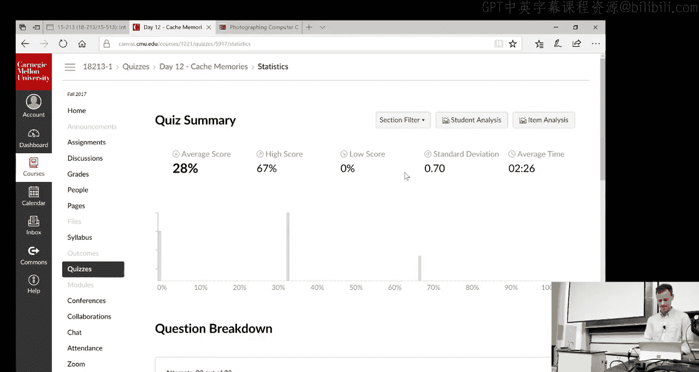
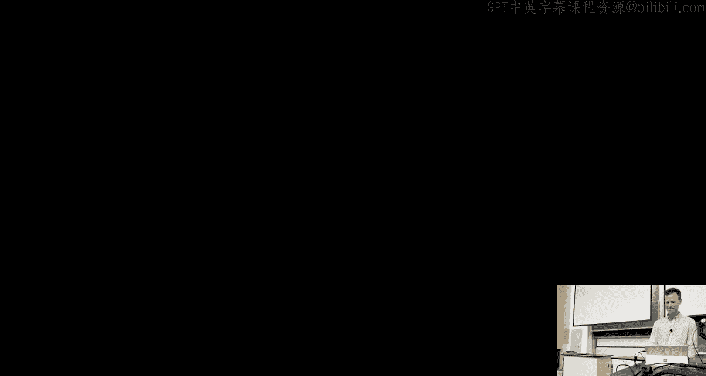
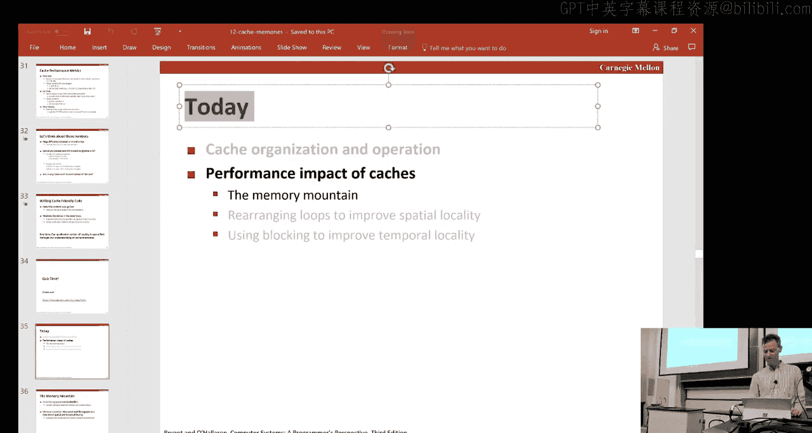
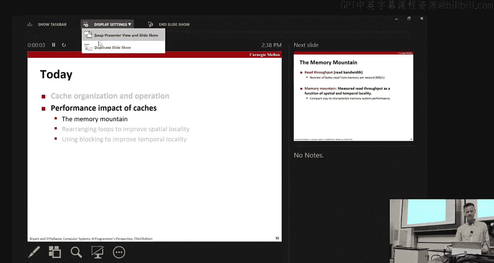
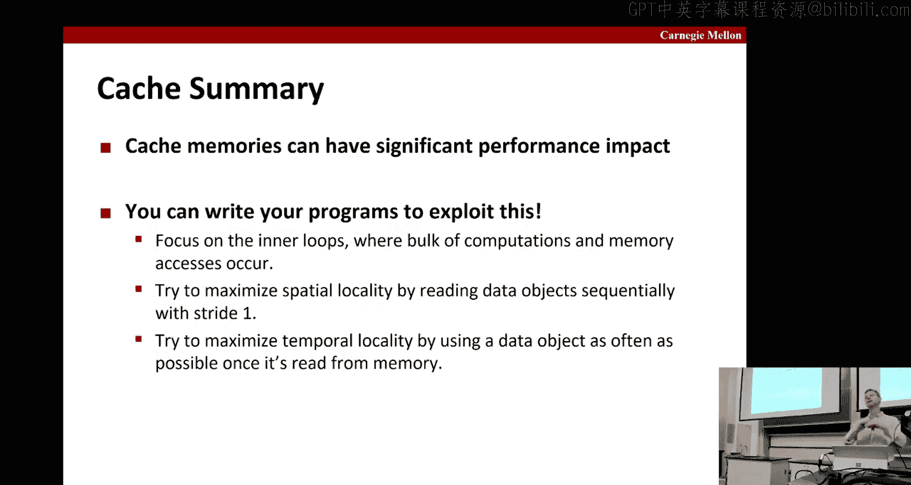

# CMU《计算机系统导论｜CMU 15-213，15-513，14-513 Introduction to Computer Systems 2017 p13 13 - Cache Memories -BV17jcReyETC_p13-

H， so why don' we get get started。Getting a little bit of feedback on the Michael for that will be an issue today。

你觉打好。じ件し。要你是 just get。So today we're going to talk about cash memories。

The organization and their performance。First we're going to review a couple things from the last class。

 the first thing is this notion of locality。It says that programs tend to access data and access code。

That's either the same or close by to things they've used recently。

We distinguished a few two types of locality， temporal locality was where the actual location is accessed again in the near future。

Versus facial locality， where it's honestly to the exact same location， but it's a nearby one。

 so it might be for instance in the same cash flow。And we had this picture of Nami Hary。

And I want to stress that this is obviously not drawn to scale right， I mean。

 it wouldn't be a nice smooth thing like this it would be sort of exponentially shooting out wide think towards the bottom。

 but this gives the idea that at the top we have these smaller faster。

But more expensive for bike storage devices。And as we get increasingly towards the bottom。

 the storage devices get larger， slower， but cheaper per white。

And data gets moved between consecutive layers。这样吗。Okay。

 and then we have this notion of that we give you any two layers。

 consecutive layers in this hierarchy as one being the cache for the layer right below。

And so if here's the cache， again， this is much smaller size of the thing below it。

 let's call the thing below it memory。We think of。Memory is being divided into blocks that are the size of the unit of transfer back and forth。

Okay， so what can happen here is that。If you want to access this。Block it from memory。You are。

Bring it into the cash itself。And all this is saying about this partitioning is really an alignment issue that basically。

 although with this cache line here say。Could hold a certain amount of data no matter where it resided in memory。

 so for instance， it might hold like data and look like that。😔。

That's not the way the machines work for simplicity in doing addresses， dress calculation。

 a data movement， and so forth， you move data between levels on alignment boundaries。Good。

 similar for chat。Okay， so we have this notion of a hit。

Which is when you go to access something that's already in cash， that's good。

And then a miss is when it's not there， and you have to go fetch it from the next level down to the hierarchy or if it's not there。

 then recursively we continue on down the hierarchy。You find it， and you。Thattch it sick in the cash。

Okay and when you do that you have two choices， one is where do you want to place the new data？

And a related choice is what do you want to evict？Okay。

 so that is the difference between the placement policy and the replacement policy。

Okay what do you want tovict replace， what is the victim？

And we mentioned there were three types of cash buses， cold capacity and conflict。Cold。

 your cause is because sort of the cash starts empty。 And if you ever。

Access something for the first time， there's no way you can be in their cash。

 so there's no way of getting around that miss it's a cold a compulsory miss。

Any system must pay that kind of miss。Capacity Miss has to do with the size of the cash。

 so if the cash relative to the active working set of the program。

 the set of data the program is touching is if the cache is smaller。

 then you start getting misses because you're evicting things from the cash that you need later。

And finally if。When you。Place data， you don't have complete freedom in where we're placing the cache。

 but there' are some restrictions on where in the cache it goes。

 then you can have as known as conflict misses where data items that sort of collide and where they want to be placed。

Causes them to evict one another， even if there's plenty of space elsewhere in the cache， yes。

 visualize？です。そで。也是啊。That is fine， but it doesn't get。Get beyond the notion。

 so that would save look up in the cache， but you still have to pay the cost of fetching the data。

Yeah， and so so from the viewpoint of the program that's running。

 you're still having to pay the latency to go get it from something other than the capture rate before remembering's not the capture。

哎。Yesす。Her completeness， where we don't just get like a list of empty slots。

Then we allocate based on the MP。Well we。Yes， in fact。

 that's a good strategy that gets used for instance in memory allocators when you write your Ma cl。

You do your Malic lab， you will explore different ways of keeping track of everywhere in the cache。

That there's holes， There's。Ail the last。The challenge here is that these things have to run really fast and so we don't have want to pay the extra cycles to do some fancy lookup to find where things are。

 okay so they're kept very simple and is similar to we'll see later that the actual mapping of the placement outcomess。

Are very straightforward with they're just extracting bits off of the address that you're actually using。

 so it's just a masking of the bits or selecting of those bits。

 which is very fast as opposed to say some complicated scheme where you I don't know maybe you。

There's some decision tree to figure out where it belongs or you take the address and you apply some hash function so that sort of randomize where it fits in the cache。

 which might make it less likely that you have these bad conflicts and so forth。

But the decision was made that that was going to add cycles on re latency and particularly for readmisses。

 the program is often waiting for the day to get back and so if you can have few。

 if you can make that run as fast as possible， that's going to be good for quote。

Okay so you could do it， but it's a highergri， but when we get to things like memory allocators。

 like Malik， thoses aren't all all that frequently and so forth。

 then you could do the tricks you mentioned。Good。Okay， so。So where' does it fit in the system。

 so the cache memories？A on ship， there's often multiple levels of them。

 they can be accessed directly by the registers and they have through the bus interface access to arriving meat to the memory we covered that last time。

啊。Looking a little bit more closely in terms of the logic within the CPU。

 we have an extraction cache here。Okay， where you're storing recent instructions so if you have。

Loality in your instructions， you'll get hits in this cache。

And then these structures get decoded and they get executed， and then if there's the load to restore。

Then you're going to want to fetch addresses。Okay so if you load you pass an address。

 you get back a data value store and pass with the address and the data you want to write if you get a hit in the cache and everything stays on chip。

 at least in the L1 or L2 cache and so it stays very close to the processor within the core itself even an L3 cache is typically on chip so thats pretty good as well。

 but if you miss in all those then you usually have to go off chip to De and memory somewhere。Okay。

 so again， that's schematically how it looks like if you were to you know， look inside your machines。

 you might see something looks like this。rt of the whole CPU with a cover on it with the branded cover and all the goodies are inside it if you look inside it you see。

Again， as you're not scale， you can see something that looks like this。After you。Yeah， I mean。

 either before they put all this encasing around it or if you dissolve off all the encasing。

 you see something like that， we'll see it closer with that in the next slide。

Then this whole so that's within the chip， then the whole system that includes these buses and so forth and a lot of other things is all part of my motherboard。

 looks like that， and then the DRAM is in these little dims that looks something like that。Okay。

So looking more closely at just one of those seaview chips， you get a picture that looks like this。

 this happens to be the Sandy Bridge processorer guy。

 you can see here that there are so here's a core。Right here。Here's another one here。Within the core。

 you can see the L1 cache is there。L2 cache is there， I mean， not that looking to tell what it is。

 but if you're used to looking at these things， you know caches have these very regular structures。

 there are eight cores in all，234，5，678。They're all sharing my chip， the L3 cash。

Which is this huge thing gear。And it's divided into banks。

 and here you're showing one bank of L3 cash。Okay， De Mcer and so forth。Okay。

 so in this particular dye， there's a 32 killed by instruction cache， 32 killed by data cache。

256 kbyte L2， which is the back of cash for both the instruction and data， and then this L3 cash。

 depending how much money you spend can be anywhere from 3 to 20 megabytes。Okay。😊。

So any questions on that？Okay， so now I look at a picture like this and I say， you know。

 does it really look like that？I mean， you know， it's awful colorful， right？

Who knows how they get it so colorful， is it really not cold？下に。I hitic。It's just a photography chi。

 right， they shine a tungsten halogen light on it that has a range of spectrum within it and depending on what it is。

 it reflects in different ways and they get these pretty color pictures okay otherwise it's you know it's all just。

They're born black and。Gray and stuff。Okay， but they're the beautiful。

 it's like the pictures they show you from space， right？You know。Okay， space。

 it's just dark out there right and a little bit of light。

 but when they show you these know astronomical phenomenon。

 they color code it right so everything looks so colorful。All right，Same idea。All right。

 so let's talk a bit more about cashs。So， cashs。Can be organized in various ways。

Here we're showing organized we're going to define these terms SEEB。

So S is going to be the number of。Of sets， what we call sets。And he is the number of lines per set。

Okay， and they're both powers of two。And the choices for unSs vary from the process the class。

And basically， what happens is that a。嗯。哎对第一。Placement policy will dictate which of these sets。

The particular cash。P address。Cast block。Based on its address goes。

And then you have a choice within the set as to where to put it and so you might， for instance。

 as part of the replacement policy， you might decide to evict the least recently used of the ones in this set。

Okay。Now if you look at one of these lines， it's more than just the data。

 we're going to let B denote the number of bytes for cache blocks and that's the data and again that's a power two。

 but there's also this tag and this ballot。Okay， the vt just says that something validated is stored in there。

So initially that would be set default false。嗯。And we'll talk about the tag in a second。O。

So if you look at the address， then as I said， the placement policy。

And everything is just dictated by the dress itself。

 there's no separate hash function or any sort of tricky scrambling of the bits or whatever。

And it works as follows。So you use the these theres。B bits。That we B equal two。

So capital B is the amount of data in one of these blocks。

So that's going to be used to address where within the block once we've got everyone want to go。

But in order to get there， first， we have to pick a set， the set is the next Ss。

Most significant bits above the Bbits。Okay， so if this is a bit representation， if that's zero。

 you'd be up here， that's all ones you'd be done here okay， so in this example。

 unless it' about all ones because we're focusing on that set。啊。Okay， and then you。

Then the rest of the address becomes the tag。And so if the addresses is w bits y。

 then t plus S plus b equals W。And he used this tag to compare against the tags of things that are stored in this。

Se。And if there's a match and the line is also valid， then you have a hit。

Otherwise it's missed so you have a hit that says this is the right data block and then I use the block offset to say where the data starts。

 so in this case it starts at that second bite。Okay。

And then where the data ends and we know how you figure that out。Can good guess。

Well it's encoded in the instruction itself right， remember if it's a move L， it's long， move Q。

 it's a quad， whatever， so the instruction itself will indicate other length。

 the annual address of it。Okay， so an extreme example that's popular for simplicity and so you on more on less。

Expensive。Settings or more power frugal settings。You may see a drag map cache。

 so that's the case where it equals1。Okay， so there's exactly one place that every address can go in your cache。

And so as you can imagine， that makes the most likely to have suffered from。These conflict misses。

 right， because there's no choice to go on， there's just one place。Okay， so as before。

 refine find the set。But now there's， there's no。呃。There's not multiple tags we have to against。

 we just compare against the one tag。And if the tags match and the valid is set。Then we have a hit。

So let's assume that's what happened。Then we use this。These bits here。Which is four。

 so we know we want to start four。And that's where the data starts that we're trying to retreat。Okay。

So for instance， this was an int and so we want four bytes， then the green bys would be the ones yes。

So additional， these are all going to be zero right。

 nothing in the cash is valid every time you bring something into the cash。

You marked the bitest ballot。Okay。So on conflicts that you kick out what's there。

And you put in the new thing， and so the bit well say is one。Okay。啊呀。

And there are other cases in which the val bits will get resect to zero。嗯。For instance。

 if you swap in a new process。呃。Or if they're a。If there's like multiple cores and their one core sort of steals the cash from another。

Then you could reset this to zero， even though you didn't have anything to put in it。

Anything replace with it right away as well？Okay， the opposite is if either the valve is not set or the tag does a match。

 that'll be a miss and in a direct map cache， there's you've got to make space with a new thing in here。

 so you always evict what's there， there's only one choice of what youvict and you replace it with the new data that you fetch from cache。

啊，说没。Yes。So what happens if like if I want to。Like it once but eight bags。分到拉十三。

So like in this like in this set， you only have my。The last four。嗰嗰啲大旺者。

Then you'd have to do two cash roses。So I have to read them。Yeah。

 you'd have to read not just this address but the next one after it。But what the第 other one that。

So the case you don't want is you don't want two consecutive cash lines to map the exact same。显了你币。

Really in trouble， but unfortunately systems are designed to avoid that case。

But what you're pointing to is the reason that sort of aligned。

You know why things likestructs and things you want them aligned， right。

 Because if they're aligned and you have this 8 by。呃。Value。

 then you're guaranteed that it won't span across two cash lines and so it'll be much more。

Fient system， so since equals one， that means there's two lines in the situation。equals one。嗯。Oh。

 that's a good catch。嗯。Now sorry， E is the number of。A number of lines。

 literally is the power of two。So little it would be zero and biggie is one。对。Good。Yeah。

 so the notation we're going to use is that the E version。There's always the。Well。

 the Big E version is always two to the little E version。Similarly for B。

 capital B will say is2 to the little B and the capital S is 2 to the little S。So两 the zero。被一楚。Good。

All right， so you're writing。Cash。Cashs and things like that in your assignments。

In a couple of your labs and so you know if you' sos all this is happening hardware。

 but if you want to simulate a cache like we do for your labs。

 then you want to mimic the behavior in your code okay so let's take the case where the。

You have 16 bytes。And B is 2， S is4， E is1。so because of that。Because B is two， the little be is one。

Because S is four， then the little S is four。And the other key to note here。

 so how big the tag is depends on how large they addresses。Okay。

 so in this toy example where dress are only four bits long， we only have one bit left for tap。Okay。

 just keeps it simple otherwise， I mean， if the addresseses were 16 bits。

 we'd have 13 bits stuff for that。Okay， so here we have a dress sequence and let's just say reads。

And we're only doing under bitements。And let's suppose that we want to access 0，17，8 and zero again。

So when we look at the binary representations for them， they look like this。

And then we've color coded them according to whether they're part of the B， the S or the T。

 So in this case， there's just one B bit。So that's there。

There's two S bits because we have these four sets。

 and so it's these S bits that will determine what set in the Str map cache。

Okay so the fact that this is 0 zero means that the first axis is the set。Okay。All right。

 well the cache is absolutely secluded， it's going to be missed and then we put it in there。

 so when we put it in there， we set the valid bit to one。In our code。

 the tag now is just the red part， in this case it's just very simple， it's just a bit zero。

And we store the data okay now the data is the entire cache line， which is two bytes。

 so even though the program only one and byte zero byte one comes along for the ride Okay so now this cash block well its both byte zero and byte one。

Okay in a gentle that holds the whole cache lines with the day。

 no matter which element and the cache line you wanted， it's going to bring in the entire cache line。

Okay。So what about this next one， So this next one comes in。Is that going to be hittering this？きます。

It's actually going to be a hit， right because if you go because basically it's part of the same cache line。

 right， just one and just zero within the same cache line。

To look at how it plays out in your simulation， you'd say， okay， this is zero。And so therefore。

 it goes to the same set。I'm looking for a tag of zero and I found it。Okay。

 and so wait a hit and the difference here is that in the first case， once I found that data。

 once I put in the cache， I was interested in the zeroth fight and here I'm interested in the first fight。

 so they are two different。Locations， but they're within the same cashstone， okay。

 so that becomes a hit。got ahead of myself。 So the next one， you look in the set 1，1。

 there's nothing there。 So that's clearly to miss。Okay。

 so you put it in there and again it's it brings in an entire cash block。

 which is both six and seven you'd only be interested in。In the first instead the zero。

 the first bit of that might of that， and so you've won seven。

Now what happens with the eight comes in。Yes。三。こ lock。Yes， so exactly。

 so it's going to come in here and zero zero is's going to evict that guy。

And you get to black this show。Okay。😊，So now we go back to zero。And you know， Jean。

 we're hopeful since we just access zero， only four axises go， there'll be the cache。

 but we've just had a conflictness， two things that even though there's plenty of space in the cache。

 two things that map the same set， and therefore this also do。可。So， you know， these are all。

Cold misses because the first time compulsory miss because the first time we see it。

 this one is a con。Any questions on that？ Yes， How you get those6。嗯。So it's again。

 the memory is divided into， we think of as partitioned into blocks of size B。So in this case。

 there's two bytes per block， which means that the first block is  zero and1。And two to three。

4 and five。6 and7。8 and nine0。Okay， so if you address either of those two。In any one of the pair。

 you're getting both in there。Yes，But something said here。So that's a good question。

 One of the ways to think about it is that if if the cash for。

Infinitely large would it still be a miss。And the answer is yes。

 because we don't have aid in there at all。是的 right。But if you have。Said the reason why。

Right well it's because of the first time you've ever accessed that cashline。All right。

 so that was the dragm cache typically because of the issues of conflict misses。

Most clusterers do not have direct map caches， they have set ofsociative caches of some level of soivity。

 so it'll take the simplest level of soivity that's not TMap， suppose we have two lines per set。

点 then。Again， we we use the。The bits here， there'll be little less bits here to a particular set。

And now that leaves， in this case， two things we want to check。

 and we just there's logic to do a parallel comparison against all the tags。And in this case。

 the two tags and wherever there's a gi。And if the valid bid is set。Then we know we have our data。

 and then we use again， our block offset to figure out where the data starts in that cache flow。

And so if this is a and then the type of the。The value treat indicates the sort of the other end。

So in green， we showed if you were just doing a two bite。Operation。

 then that's where you would access it。And as before， if either the valid is not set。

Or there's no match among all the sets。Then we have a miss。

 and the only difference here is now we have a choice。 Okay。

 we could choose to put the new thing here or here。And that's what defines the replacement policy。

 the most frequent one is our sort of variant， at least recently used。Which says that。

If I look at these two things and I see one has been accessed more recently。

 this is the more recent one。😔，If I just got done touching this。

Ear than the last time I touched that， then maybe this is kind of on scale。

 I'm not going to need this one anymore， so I'll get rid of this one。You keep the others。All right。

 so how might your code look So let's say that again， synonmium equals 2。

 keep it simple we'll just have two S equals 2。 we're sticking to B equals 2。

Which means we have one bit。For the offset， one bit for the index， and since okay。

 it didn't right here， but since there's four bit addresses。

I assuming' before leaves only two bits left for the attack。Okay， and they color code here。

 so now it's the exact same address sequence。啊好 good。買うです。表是。

So typically what's done is you want to you don't want any false positive。

 false negative so you want to make sure that the tag is in right so every single address in the virtual dress in the system will you know use these same discard these same bits and have the rest of these bits as tag。

Okay， and all the ones that match in these bits here will either go to different sets or different places within this set。

Okay so this tag uniquely defines a location， because therefore it's a unique comparison。嗯。

There are certainly other settings。Besides processors in which sort of the tag bits。

It's sometimes called the fingerprint of what you're looking at is reduced。

 greatly reduced to be something more likely one that you suggested that it's just large enough that you're very unlikely to have a collision。

 and so you can distinguish things that are the same versus things that are different。In this case。

 we don't have any probability of that kind of collision。

 and so we just use all the rest of the address as the tech。Okay， so again。

 the things were color coded， so we have the exact same sequences before。But this time。

 so it starts off the same， we get this initial miss。あ the。

And now we have a choice of where you set to place it。

 let's say we place it in the first position here。And then we have a hit as before because it goes exactly to here again。

And we get a miss。Okay， we're a completely different set， so let's go ahead and place it there。

Then another miss。Okay， but here it's in set  zero， the tag is 10。

 we don't have a tag of 10 together with a valid anywhere here， so it's still amiss but。

There's space for without having to victim anything。Okay， so we get this in the cache as before。

 but we didn't have to evict this earlier one， which gives us。

The wind we're looking for because now this has gone from a mist to a attack。可以。那你块起证来。Yes。そを？我。

いずにきたい。提す？Your accessing。Essentially one位。嗯。Is it possible for that read as directed from？

From the trace to。こぼは。呃。The the。So the original address this gets， yeah。

 this is similar to the earlier question right the original address。Can， of course。

 span mobile cash lines like maybe you're telling you that you want to。

That's this stuff here and the cash boundariesties right here。That will get translated into。You know。

Two cash line requests。And they。You know a shift and so forth because you're going to let's say you want to bring that into a register right so you get this piece from one cache line。

 you get this piece from another cash line， you have to shift over this first piece and then put the other one in the。

And the lower bites of the register。And so you can see it's rather more expensive right all around。

 so therefore if either the cash， I'm sorry if either the compiler can move this so this is aligned if it's like an array。

Maybe add some paddings so things are aligned。嗯。You knowOr otherwise try to make things aligned。

 then it's much more efficient。Okay， so that was all about reads。

 so the issue with rights is that the。You're changing the data。

 so you've got these cache copies in the memory hiarchy and now you're changing them right so particular changing the L1 would be the first one that got changed。

So if it's a hit。To the cash， then there's basically two policies right through right back so right through says that you you update the value and the cache and you update the value in the next level of the cash and so forth。

 all the way down。诶。Throughout the cash hierarchy。As you can imagine， that's rather costly。

To do right away， because oftentimes you're writing things because of locality。

 you're writing things multiple times before they get evicted， safe on the cash。

So a much more common policy is right back。And that is that you let the the the。Other levels。

 the hierarchy be stale， the old values， and the system has to make sure that the。

 proper things happen。啊。One of the things it needs to do is it needs to contract track of which things have changed。

 and so for that we add an additional bit。Besides the valve bit， called the dirty bit。Okay。

 and that's initially zero for a read， but it's one for a write。

 either know when you bring it in or anytime something's sitting in the cache and you write it。

 you go ahead and set the dirty bit。What that tells the system is that if you go to evictus。

 it's the victim in a replacement policy。Then if this bit is zero。

Then what I know is the next level of the cashery has。The same value。

 and so it's up to date and I can just drop this on the floor。On the other hand。

 if this is a one that says that this cache line has the most recent value。

 what's in the other levels of the cache， the memory hardery are stale。

 and so therefore I do I need to update when Ivict this。

 I need to update the copy of it in the next level of the hay。In the system。Okay。So if this is。

 for instance， the L1， and I do an eviction for L1， then the L2， I need to update。

If it's in the outcome， I need to update the。啲。The value there and declare it end market is dirty and so it's all up to date so therefore the next time maybe it fed from the alt too。

 then it will have the proper value。If on the other hand， it gets evicted from the al two。

 then the same thing happenside down the heart， yes。Okay。So on the right this。

 we have a couple of choices， one is that we could do an allocate。Which basically， you。

 you're loading the cache and update the line of cache。

The other is that you write straight to the memory and you don't put it into the cache。Okay。

And so these kind of go hand in hand if you're doing a right through。

 there's no necessarily reason to load it into the cache。

 if you're doing it right back then clearly the cache the copy is the freshest copy of the data and so you need to allocate。

嗯。A place within in the cache。And again， this is by far， by far the most common。All right。

 so I said that these lookups are gone based on the different bit combination。

In the address and so the。Having the lowest order bits be for the placement inside the cash line？

Makes perfect sense， right， because。All the upper level bits。呃，有。BBecause once you have a cash line。

Then because you know。Bits are laid out， memories laid out consecutive in memory。

 then all the fights from000。Up to1，1， one。Will just be consecutive in memory。Okay， and so therefore。

 if you trunccate these this to be the exact size of the cache line。

 that means that all these things will be consecutive in the cache line。Okay。

 so that's why you want to use these bits to do the lookup within the cache line。

But what about these bits， I mean this is just does a look up to pick a set okay。

 it's at first blush maybe seems arbitrary that you picked these lower order bits and maybe even problematic in some settings。

 right， maybe maybe some you know bits scattered across things or maybe the high order bits or whatever would be good。

嗯。So for instance， let's look an alternative wave。Method， which should be high be indexing right。

 suppose we took the S most。The as high sort of bits as the index set。What might have。Okay。

 so let's do this illustration， so this is a memory， we have a direct map Cakeeping simple there are。

Four sets。Okay， and we'll just show color code of where the the。Setets fall memory。

 so if we have mill bit bit indexing， they look like this。Okay， basically， you know。

If you go across the sets if this is like one big array and you were just scanning the other array。

 you would cycle through the sets， right green， yellow through pink， blue and so forth。

 okay and so that would make it more likely that you were spreading using your cache in。

Spreading the data across your cache。And so therefore， less likely to have conflictnesses。

On the other hand， with the high order bits， it's the other extreme in which you've basically take in your address space and divide into four consecutive partitions。

So if you allocated an array that for instance， was only this big。

Then all the access to that array would hit in the same set， okay？And that would be。

Very poor use of your cap。So that just gives you a little bit of hint as to why things are done the way there。

那块行了。Okay， so as I mentioned in the Intel coreRI7 processors， like the one we looked at before。

 there's registers， there's L1 for data and L1 for instructions。An L2。

Then there's L3 that we saw in that die that gets shared among all cores and main memory。

 and here are some typical sizes， third two kilobytes for each of the instruction data caches。

8ight ways is that asciative。呃。256， so not all them much larger for the L2， much larger for the L3。

 a little bit higher， even higher sosociivity。Cash line sizes are 64 bytes。

Throughout the system and you can see something about the leg， so L1 hit his four cycles。And L2。

Its roughly 10， L3s can be 40 to 75 cycles， depending on how close the memory bank is to where a。

Where your core is？And so forth。Okay， so let's look at Jordan out a little bit more on that。

 so let's suppose that we use some realistic numbers that said the tory numbers we used before。

So we have a 32 kilobyte8 way set of social care El data cache。Again， the cache line size are 64。

 so this is our B。Equal 64。 eightway said associative。So that's our。Yes， right？Okay。All right。

 so again， this is our。星期一。And the attack。Okay， so all right， so I already said that。B was 64。Right。

 passes。eight。What about E， How big is E？Well， you have to work backwards， right？

We said that the B was 64， so that's six bits the tag for the block offset，2 to 6 is 64。TheThere are。

S is 8。Right， so that means there are。But three bits。Nice the。Sorry。A。But so sorry， I got this back。

You guys should stop you when I make stupid mistakes。せ道。Sorry， good。Did you look around work okay。

This is ER， there we go， much better。Okay， so this is。8。Mix this three。Okay， so good。对。

So how big is the tech？The tag is going to be。嗯。So this is six。And this is the。I see the tag。

47 B address range。Okay， so we want the total。Number this to be。We7， right。And so the。

How many sets do we end up with？So。Anybody know here Im getting myself from here three？that workout3。

9。です。So a bit address right。 I me just cheat so I'm getting myself。オケー。All right。

 so the total of this was 47。Good。The tag ends up being 35。The block offset， as we said was。

6 bits from that。And six fifth for that。6。12，47 okay。Okay， here's where I was overlooking。

 Did you let see what wass overlooking？They gave us the capacity to cash。That was the missing piece。

 Okay， so once I know this thing is 32 kilobtes。Okay， then I know that the product。

S times e times b is got to be 32 kilowabts。Okay， so that's here。All right， good。

 so from that I was supposed to be able to work backwards and say， okay。

 so if I know that you know I have my B and I have my E， so I have。Three nodes of one unknown。

 and that's how you drive 64。Okay。So from the 64， I get the6 and then from the 47， I get the 35。O。

So that was my mistake， I wasn't looking at the size of the cache as the missing variable。

To figure this out。Okay。😊，So again， as long as you're given three of the four numbers you need。

 you can， you can figure out what。You know where all these things are。和是是。Okay。

 so so given that that's the case， we know that we have six bits so let's look at this address。

 this is in hex so we look at。The lower of bits and we split it up into the S bits and the B bits。

 there's six of each， and so what we see is that the tag here is all zeros。So we get， I mean。

 sorry tiger7， this is all zero， so we get a zero here。The block offset is this here。

 which is you know。10 in hex。Or're 16， and the tag is all the rest of the stuff。Okay。

 so it's the 35 bits。That are left。Okay。😊，Yes。啊。Because the cash line size is 64 bytes so we were given that。

B was 64。Did you take the log at that。Okay， other questions？Yesす。Let's be time。Yeah。

 so this was the block offset here。This was the set index here。😔。

And the rest of the bits were tagged， so what's a little confusing is is you have to translate from the hex down to the binary。

 right？So this is zero hex1， hex， zero looks like binaryer， but it's certainly tax。你 question是怎呢。

Okay， so we talk about the mis rate for cash。That's the rate at which the fraction memory references where you go to look at court the cash and you don't fight it there。

So typical numbers are for L1 is between  three and 10%。Roround two， it can be even smaller。

The hit time is， again， if you missed， you you have to go to the next level of cash。

And how long does it take to get fed things from that？嗯。If you miss all the way out to main memory。

 then compared to the let's say four and 10 cycle hit times for L1 and L2。

 it's up to 200 cycles for main memory and that gap is increasing。

So therefore there's this huge difference between a hit and a miss。

 for instance 100 actx on moisture for。For El and main memory。And。

So this got an interesting way to think about it。If I tell you， I'm getting 99% hits。And in one case。

 a 97% hits in another case， you might think， oh， well， that's pretty similar， all right。

 we're at Walpark。But actually， 99% hits is twice as fast as 97% hits。

And this is illustrated by by example， if I have a cash hit time of one cycle and a misspelling hunter cycles。

Then if 97% of the time， if 97 hits， that means 3% of time。

 I pay this expensive thing and so when you multip out and add it up you get four cycles，For 99%。

 I only get this expensive thing once，1% of the time， and so it's only two cycles。

 so the average of access time is double when the hit rate drops from 99% to 97%。Okay。

 and this is why because of that sort of false sense of goodness though we talk about the miss rates is hit rates because the miss rates。

 of course， will focus exactly on。The fact that these numbers are different。Dramatically different。

 right factors real。Okay， so to write cash friendly code， you want to you know。

 if you want to make the stuff you're doing frequently cash friendly。

 so inner loopops is a good place to always look。We want to minimize the misses in inner loops。

We've shown a bunch of techniques but doing that， you know repeated reference as the variables are good。

 particularly if you can if they're in registers， then that's really fast。

 don't go out the memory at all， and then stride one reference patterns are good right because then you hit。

In the cache， if you're touching items in the same， cash lines are 64 bytes long， so you can read。

 for instance， eight consecutive doubles and they're all hits after the first one。O。😊。

And so our qualitative Notional county is quantified。Through things like analyzing this rates。

 which are a function of the organization the capture and the size of the。给郭性生的。H。

So let's do the quiz。

All right， to' see how people are doing。こたす。お。啊，O。Interesting。Okay， so the first question was review。

 and we're about to do a。Midterm moment， we you also get to。Do I remember this stuff？呃。Yeah。

 basically the the。The float。The float。Is four。Or bites。And then you have this。Ray of characters。

 which is 5，5 bys。Okay。But then the whole thing has to be a multiple of the largest。Item。

 which is four bytes， so it has to be multiple four bytes。

 and the next largest multiple four above nine is 12。Okay。まあ。ですよ。Okay， this one。All right。

 what do we have here have。We need bits for。The offset。So the offset as eight。

 so you need three bits for that。We need bits for the set index， there's four。

 so we need two bits for that。And so with a 16 bit address， that leaves 16 minus 5，11 bits left。こ心中呢。

Okay， so this is the correct answer here。And most people， I mean， it is a favorite。fair is。

 all right。And what is the total capacity， the total capacity is just the product。Of。These things。

 so you have。If you have four sets。And each set has two。诶。Lines in it and each line is eight bytes。

And sorry， that。说了。Read on here so。Each line is two bites。There are four sets。うの。啊系识时佢有嘅。

It my maximum， all， so that's how you get 64。Okay， then people got that one away。对。生日经。

Questions on that quiz。

Okay， so let's talk about performance impact of caches。啊，修的。

The cover of your book shows a picture of a memory boundary。

And Randy covered this in the first day of class。Remin you of that， but this is how it's generated。

 so what's showing is read throughput， the bandwidth you're able to get the number of fights。

Rs the memory per second。As across different settings。

And the memory Mountain shows this read throughput as a function of。

Things that capture space locality and temporal。So here's what the code looks like。

You have this big array of data and you every time you call tests， you pass it two arguments。

Ems and strideide。You。You call test once to warm up the caches。

 and then you call it again to measure the throughput。

And if you see what happens is this is used to that looper rolling trip we showed before。

 that you do four。Accesses within each inner loop。And so that would be starting from。From eye。

To I plus the stride， I plus the stride times 2， I plus the stride times 3。

so that'll get you sort of four consecutive axises according to whatever energy you set for stride。

 so if the stride of1， this is just get you I I plus 1 i plus2 plus3， but if the stride is 4。

's get you I I plus4 plus z I plus 12。All right， and you do that。

Until you're done and then if there's some rounding error。In terms of things of it evenly。

 there's less last little bit， but most of the throughput overwhelming is from there。

 and then you return the sum of those four accumulations。Okay。嗯。

So here's what you get for the features of the core， the HsL core I7。Paster。Again。

 it has the memory hierarchy characteristics that we've been discussing。

And what you can see from here is that on this axis we're varying the stride， so here's stride1。

 that's the best case， and then it gets higher and higher。

And over here we're varying the size of the data that we're cycling through right so remember we have this warm up so we run through the whole data to warm up the cache and then we start measuring it through so if the data after warming up fits inside the cache entirely then we'll get all hits from there on okay and that's kind of what happens up here。

Because the size of the cache again is 30 kilobytes。

 so if that's the size of thing we're cycling through， we're getting the highest input。All。

 so here up is good。Okay， so what you observe from here is versus these ridges。

Which correspond to different cast sizes。So L1 just rich up here when your data fits within the L1 cache。

Then you get this nice rich form here as soon as you no longer fit in the cache so you get a lot of capacitynesses。

And but those get service in the L2 Ca， which is 2056 case or somewhere in here。Okay。

 you get all those。And then if you're too big for that， then you get service the L3 cache。

 so this is sort of up to  eight megabytes。Where this drops off again。

 and then the rest is in memory。可以。😊，啊。The way the stride impacts things。Is it sort of the the？

The special ca。That basically strideide one always has the best fish lookity， stride two。

 you're sort of you're cuttingnning， you only use half the cash。

Half half the cash line and so you know twice as fast you're getting it twice the number of misses increased by factor two and so。

Okay。And this are all。The stride， you multip that by 8 points。

 So this 11 stride of 11 times impacts 88 points。Okay， any questions on this picture？All right。

 now you can understand your book cover。There were only how many weeks in the course and you now know the cover of the book？

だけ。So how can you help the out your program so one thing you do similar to what we showed before in the previous class is you can rearrange the loops。

Okay， so if we have matrix modification。Then we've got these two N in matrices that we're multiplying A B。

 we're putting the result in C， we're accumulating into a sum。That starts at0， and then。呃。You know。

 the CIJ element is the sum over all these ks of ak times k J。

And so then you write back the answer here。And so some will typically be held in a register。

And so let's see how it does。Well， again， so we're going to assume that this end。

So remember we had this special case last class where we said if wealth n is really small。

 then you can actually get locality more than just the inner loop。But that's not the typical case。

 so we're going to access consider the typical case where this n is very large。

 and so by time you get kind of。The second hike through the intermost loop。

 you've already blown out of cash。Okay， so you can't even hold multiple rows in the cache。All right。

 so if that happens， that's a fairly common setting。Then。

How can we analyze the cash so the number we said this a raw major order。

So each row is continuoustiguous in memory。So if we want to step through the comms  one row。

 then it's this last index that we step through。啊。And so as long as the。

As long as the block size is bigger than the size of a data item， in other words。

 as long as you can fit more than one data item in a cache line。

Then this is a very nice access pattern and in fact you only miss every time you have to bring in new cache line。

 so for instance， if you could fit eight data items in a cache line。

Then you do one miss and then seven hit， so your mystery rate is one out of eight。Okay。

 that's always the same year， it's one out of over eight。嗯。But the other hand。

 if you step through the rows of one column， then you're jumping in huge strides way past the end of the cache。

In memory said there's， certainly no spatial look at it， and so you get a mis rate of 100%。Okay。

 so what does this look like if we look at the A loop？This is the index is changing， so we are going。

R wise in a。And so you know， if a block size is 32 so it holds four doubles。

 then it's one over four or the mis rate is 。25 in that case。

 B we're accessing the wrong direction so it's a one and C is this basically sitting the register so it's。

You decide you see。In the center， there is no Ca Mr as whatsoeverfield。ok。😊。

So what if we do if we rearrange the loops well there's some rearraning that it's not going to matter much when n is this much bigger than the cache size。

 so for instance in the supplemental slides， we show the case where these two are swapped。

 but k is still kept as zeroverse loop and the misrates are identical and you can look at the supplemental slides for that。

So let's try something more interesting， let's try K not being。So if we make K the outer loop。

 then what happens is that。You know， J is the inner loop and so B is now accessed in a good way。

C is now accessed in a good way， and A is now the one that's basically when the inter loop was fixed。

And so you get very different characteristics and better numbers， right， because you have a 25。25。

25 is 0， suppose a 1。25 is0。啊。If we were to put I in the innermost loop， and similar， we do。

 if we swap these two， the supplement on the slideshow it's the exact same。It谁。

So the only other pair of combinations are where I the even with and we either do JK or KJ。

 the analysis is the same， this is disaster because A is column wise， C is column wise。

 and so you're getting 100% mis rates on both of those。

Questions on that so either the compiler or you as a programmer should keep that in mind and look at your intermosts loops and make sure that you're getting the you know。

The best behavior。はい、く。嗯。And this is just summarizing again， and this is for iteration。

 this is the best case。Hows it play out in reality， So this is experiments run。

 and it shows again that the。This is log scale， okay， so this is much worse so cycle greater。

 so this is good， we're happy down here。We're unhappy up there。

 and we can see that the ones as the theory predicted， the ones where J is the universemost loop。

 are excellent， and the K ones are much worse than the high ones are either。O。

So that's rearranging loops， let me just spend two minutes talking about。Blocking。

So you can get further locality of nature multiification by not just rearranging the inner loops。

 but also。During things blocks of time， I're just go ahead and skip to pictures like this。

 where you're pulling entire blocks， which consists of little square matrices and multiple rows and columns。

One by one by having an entire set of。Intermost loops， tripling acid。

 innermost loops to go with your tripling acid outermost loops that had before， and if you do that。

 then you can go through the analysis and show that the number of misses drop significantly。

The constraint you have is that you want and any time you're working with these blocks。

You're working on three of them at a time and you want。嗯。

You want all three to fit inside in your cast size。

I want so they don't thrusts each other right so far as you fit all of them in there。

 you're good This B here is not the B from our cache parameters， this is the B。

 which is sort of the dimension of the block right block size here is B times B。

So subject to this constraint， the locality improves with larger and larger B。

 so you want to push B as big as you can while keeping it the whole thing three times be square fitting in cache。

And the2 missus ends up being。Divided by something that grows as be。

Which isch you didn't have that B term before。So here's the comparison in the node blocking case。

 where we did the analysis over the entire run of the program。

 you had n cubed times nine/ eighths misses。But in the blocking case， you still have N cube term。

 but it's multipl by。This expression here， which is much better。So as B grows， it gets， much。

 much better。那么让我。And that's why all practical matrix publication codes do block。So in summary。

 cache memories can have significant performance。impactmpact and you want to write your programs to make good use of the cash by understanding how data it' laid out。

 understanding the properties of the cash。

れ。