# 计算机系统导论：第14讲：链接 🔗

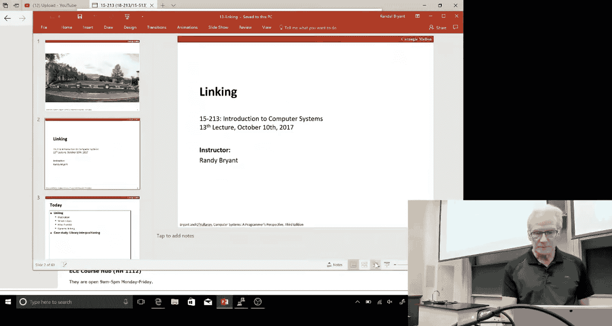

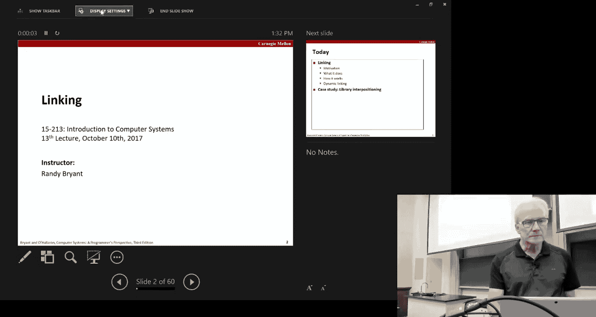


在本节课中，我们将要学习编译过程中的一个关键但常被忽视的环节——链接。链接负责将多个编译后的文件以及各种库代码组合在一起，形成一个可执行的程序。理解链接对于避免编程错误和成为高级用户至关重要。

## 链接的基本概念

上一节我们介绍了链接的总体目标。本节中，我们来看看链接的具体任务。

想象一个程序由两个不同的文件组成：`main.c` 和 `sum.c`。`main.c` 中的 `main` 函数调用了一个名为 `sum` 的函数，但 `sum` 函数只在 `main.c` 中声明，其定义在 `sum.c` 中。链接器的任务就是将这两个文件（以及必要的库信息）合并，生成一个名为 `prog` 的可执行程序。


链接的核心活动是**符号解析**。符号可以是变量或函数的名称。链接器需要确定每个符号的定义位置，并将其与所有引用该符号的地方关联起来。

## 为什么需要链接器？

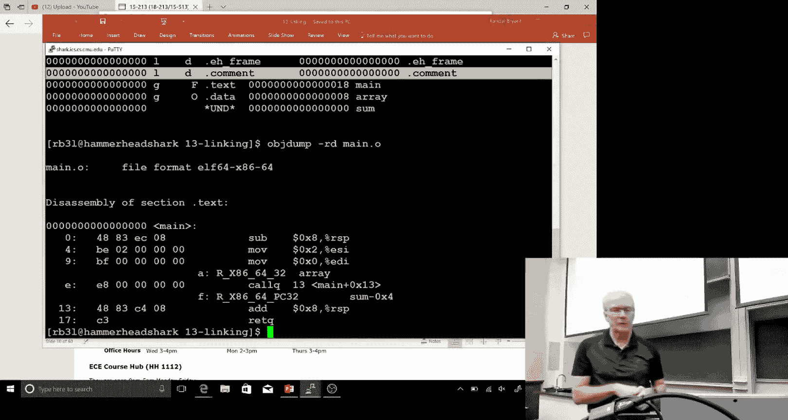

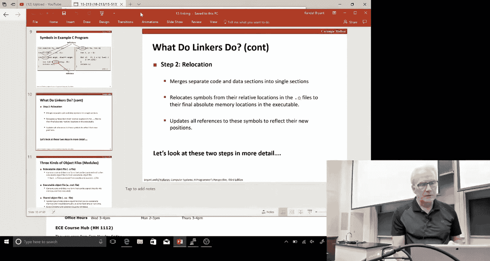


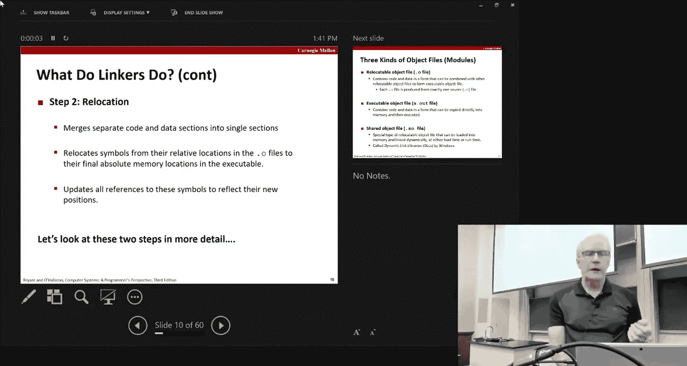


以下是链接器存在的几个主要原因：

*   **分离编译**：大型项目包含大量代码，分离编译允许我们独立编译单个文件，而无需在每次修改一行代码时重新编译整个项目。
*   **库的使用**：程序经常使用如 `printf`、`malloc` 等库函数。链接器负责将这些库函数的代码引入到我们的程序中。
*   **效率**：链接器帮助创建高效的可执行程序，避免在运行时产生大量调用外部函数的开销。同时，通过**动态链接**，可以避免在每个可执行程序中重复复制整个C标准库，从而节省磁盘和内存空间。

## 目标文件与符号

编译器将 `.c` 源文件编译成 `.o` **可重定位目标文件**。这些文件包含了机器代码，但其中引用外部符号（如其他文件中定义的函数或变量）的地址尚未确定。

链接器将这些 `.o` 文件合并，并解析其中的符号。只有具有全局作用域的变量和函数才会成为符号，局部变量（如函数内的临时变量）不会出现在符号表中。

我们可以使用 `objdump` 工具来查看目标文件中的符号和代码。

```
objdump -t main.o  # 查看 main.o 的符号表
objdump -d -r main.o # 反汇编代码并显示重定位信息
```

在反汇编输出中，你会看到类似 `R_X86_64_PC32` 的条目，这表示该处指令需要链接器填入正确的地址（例如，调用 `sum` 函数或访问全局数组 `array` 的地址）。

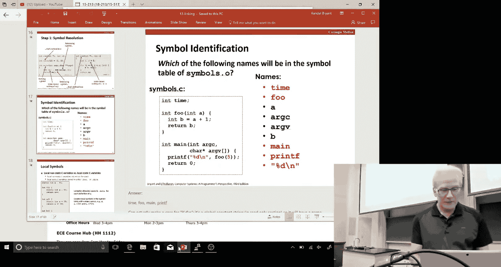

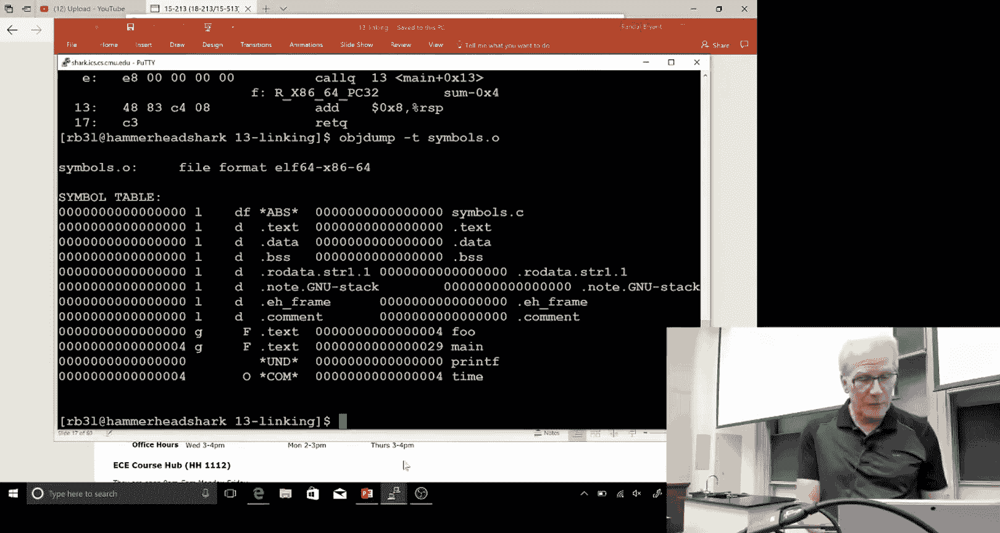

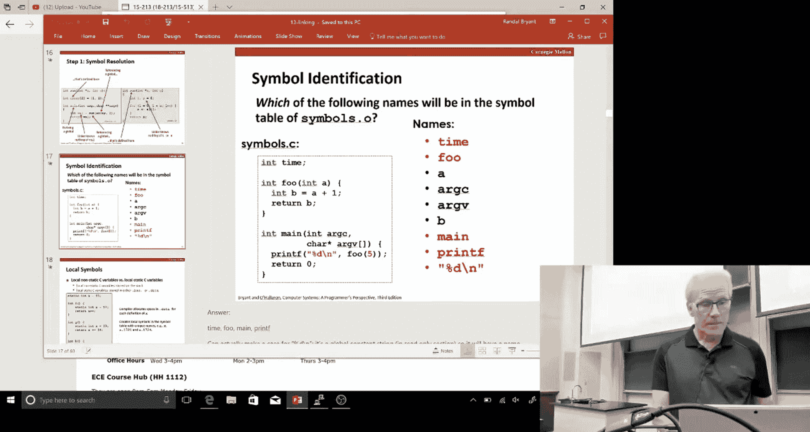


链接器不是编译器。它假设代码已经编译完成，其工作仅仅是根据符号表信息，在代码的特定字节处覆写正确的地址，然后将所有部分拼接成一个完整的可执行文件。

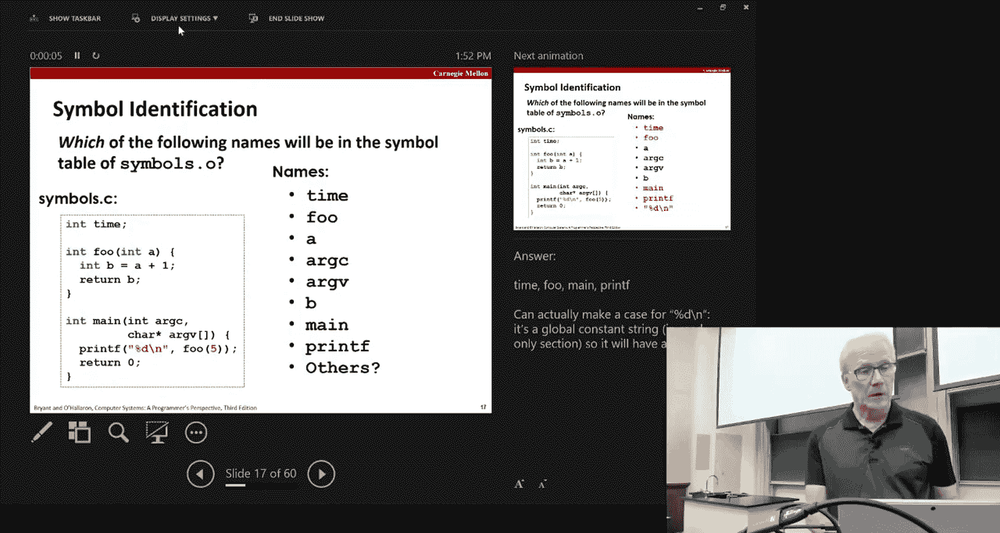


## ELF 文件格式

可重定位目标文件（`.o`）、可执行文件（`a.out` 或自定义名称）和共享库文件（`.so`）都采用一种称为 **ELF** 的标准格式。

一个ELF文件包含多个节（section），每个节存储不同类型的数据：

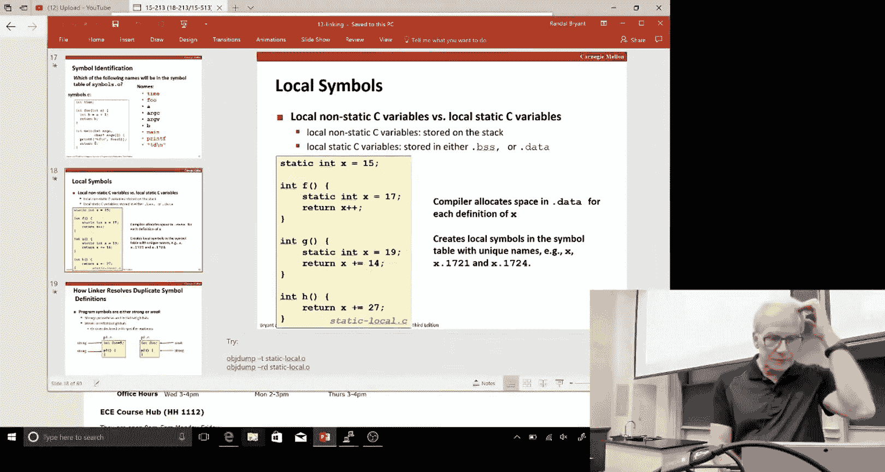

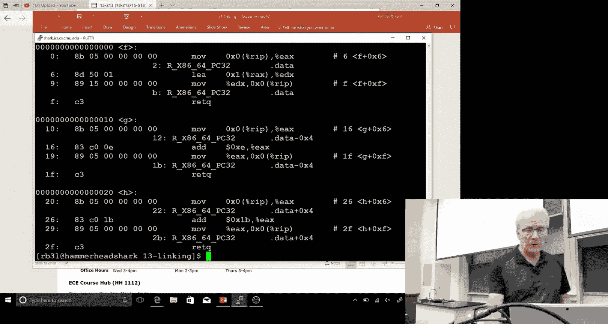

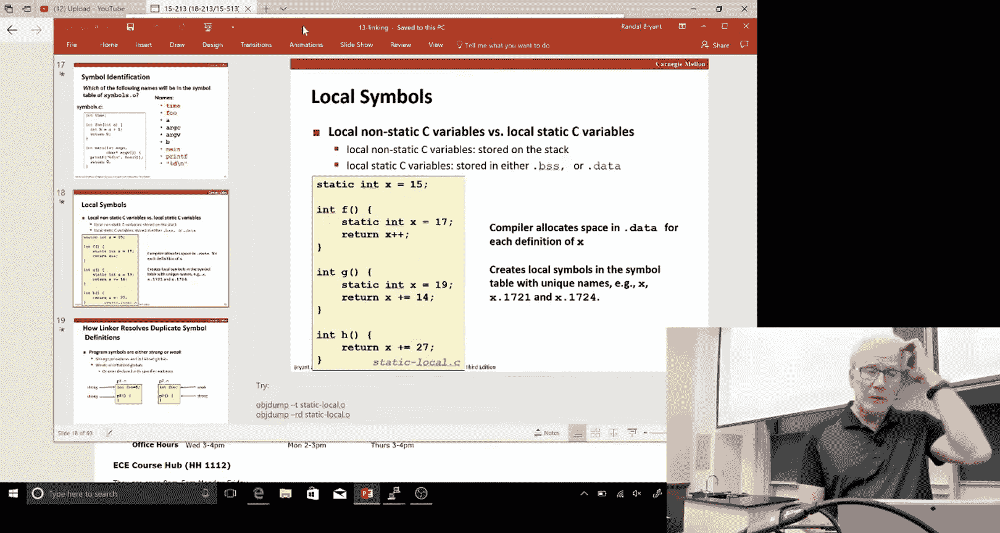

*   **ELF头**：包含文件类别、字节序等通用信息。
*   **.text节**：存放已编译的机器代码。
*   **.rodata节**：存放只读的全局数据，例如字符串常量。
*   **.data节**：存放已初始化的全局变量。
*   **.bss节**：存放未初始化的全局变量。该节在文件中不占实际空间，程序加载时会被初始化为零，以节省磁盘空间。
*   **.symtab节**：符号表。
*   **.rel.text节**：代码部分的重定位信息。
*   **.rel.data节**：数据部分的重定位信息。
*   **.debug节**：调试信息（供GDB等调试器使用）。


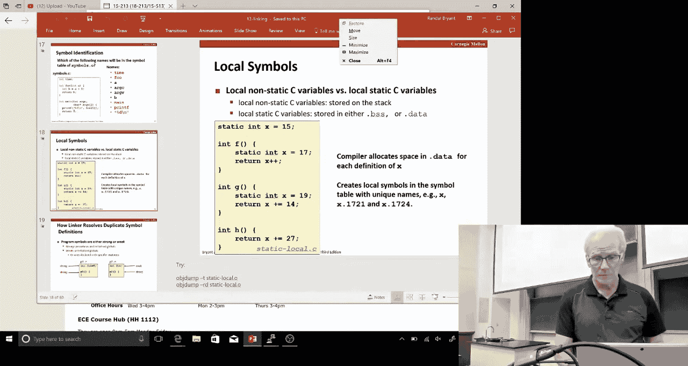

## 符号解析的规则

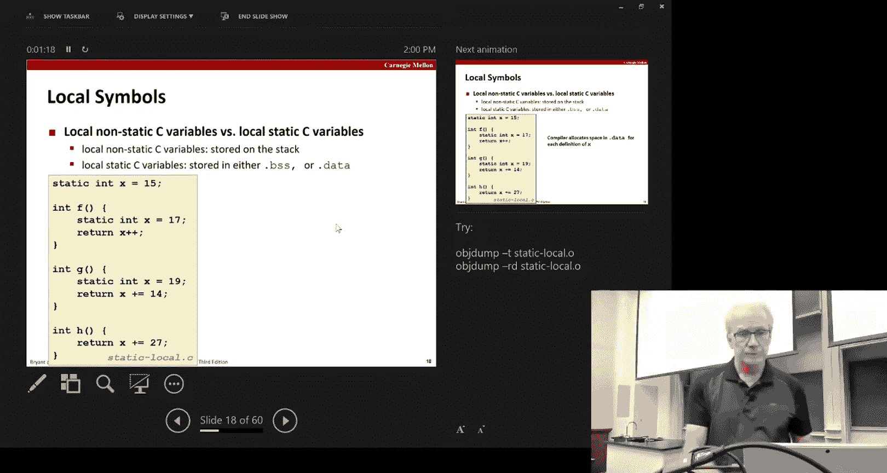


上一节我们了解了ELF文件的结构。本节中，我们深入探讨链接器如何解析跨文件的符号。

每个符号被分类为**强符号**或**弱符号**。
*   **强符号**：函数定义，或已初始化的全局变量。
*   **弱符号**：未初始化的全局变量（或通过 `extern` 声明的变量）。

链接器按以下规则处理多重定义的符号：
1.  不允许有多个同名的强符号。如果存在，链接器会报错。
2.  如果有一个强符号和多个弱符号同名，则选择强符号。
3.  如果只有多个弱符号同名，链接器会**任意选择其中一个**。这可能导致难以调试的问题。

**关键点**：链接器**不进行类型检查**。如果两个文件中同名全局变量的类型不同（例如 `int` 和 `double`），链接器可能不会报错，但程序运行时会出现数据解释错误，导致诡异的结果。

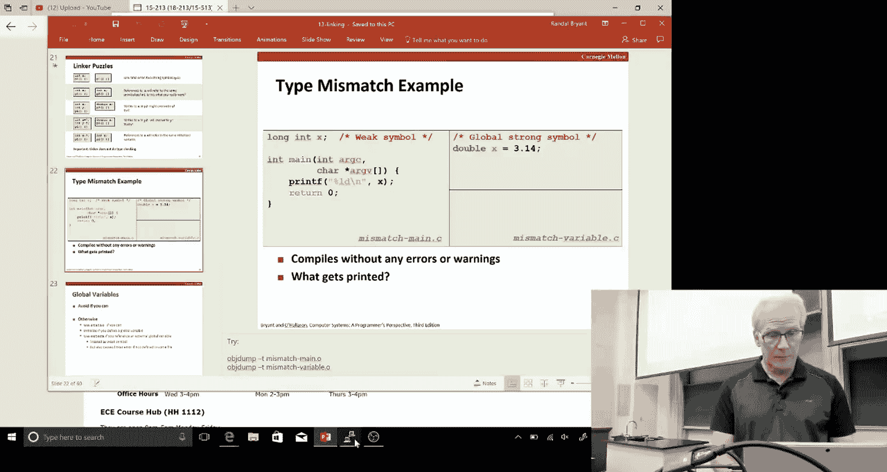


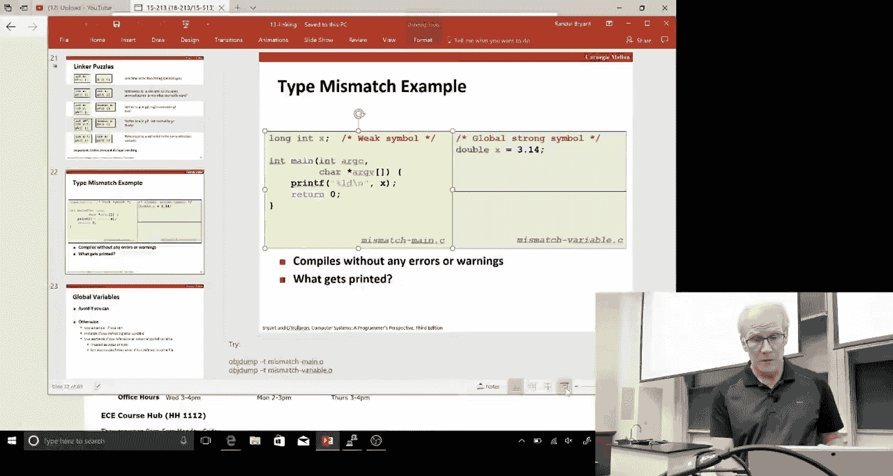

为了避免这类问题，应遵循以下最佳实践：
*   尽量使用 `static` 关键字将变量和函数的作用域限制在文件内。
*   对于需要在文件间共享的全局变量，总是在头文件（`.h`）中用 `extern` 声明，并在且仅在一个 `.c` 文件中定义。

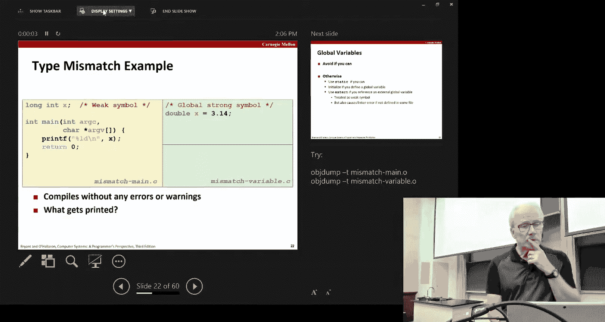

`static` 关键字在文件作用域和函数作用域有不同的含义：
*   在函数外使用 `static`：定义了一个文件内全局可见，但对其他文件不可见的变量或函数。
*   在函数内使用 `static`：定义了一个在多次函数调用间保持其值的局部变量。

## 静态库与动态库

到目前为止，我们主要讨论了如何链接我们自己编写的多个文件。链接器的另一个重要角色是链接库代码。

### 静态链接

静态库是一组预先编译好的目标文件（`.o`）的归档文件，后缀为 `.a`（例如，C标准库的静态版本是 `libc.a`）。使用静态链接时，链接器会从静态库中拷贝**程序实际用到的**目标文件，将它们直接合并到最终的可执行文件中。

创建和使用静态库的命令如下：
```
# 创建静态库 libvector.a，包含 addvec.o 和 multvec.o
ar rcs libvector.a addvec.o multvec.o

# 编译程序，并静态链接 libvector.a
gcc -o prog2c main2.o -L. -lvector
```

静态链接的缺点：
1.  **代码膨胀**：相同的库代码会被复制到每个使用它的可执行程序中。
2.  **更新困难**：如果库中发现安全漏洞，所有静态链接了该库的程序都需要重新编译和分发。

### 动态链接（共享库）

为了解决静态链接的问题，现代系统广泛使用共享库（在Linux上后缀为 `.so`，在Windows上为 `.dll`）。

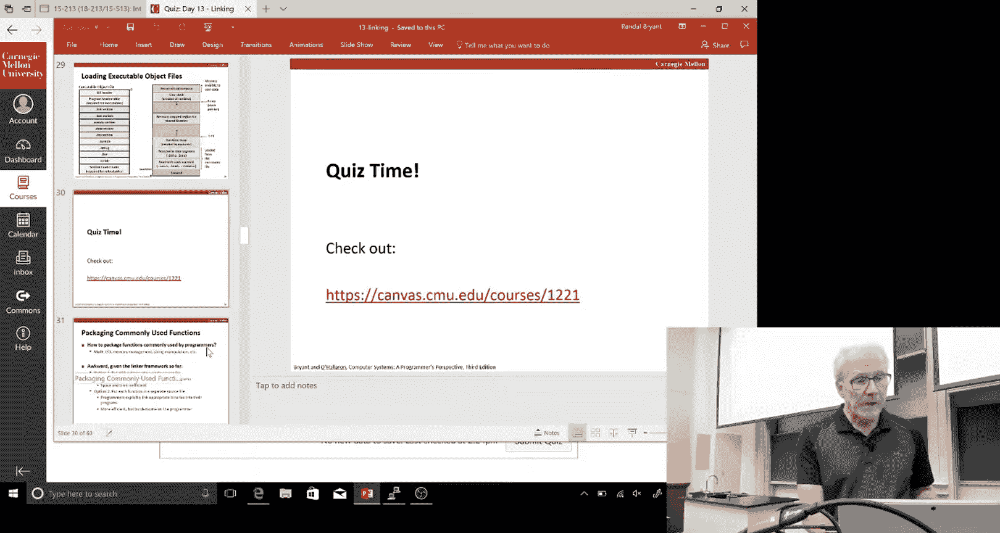


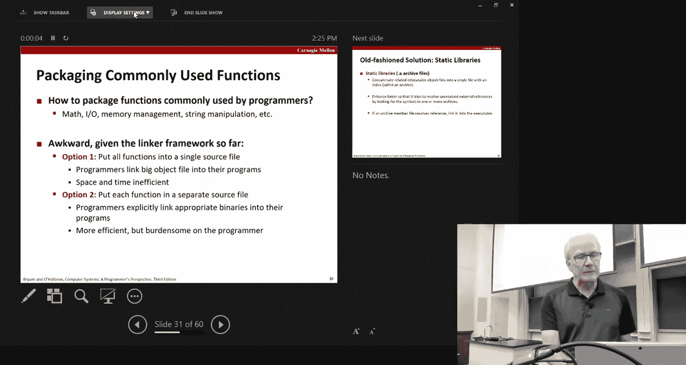


共享库在链接时不会被复制到可执行文件中。相反，可执行文件中只记录它依赖哪个共享库以及所需的符号。在程序**加载时**或**运行时**，动态链接器才会将共享库的代码和数据映射到进程的内存空间中。

创建和使用共享库的命令如下：
```
# 编译位置无关代码（-fPIC 是关键）
gcc -c -fPIC addvec.c multvec.c

# 创建共享库 libvector.so
gcc -shared -o libvector.so addvec.o multvec.o

# 编译程序，并动态链接 libvector.so
gcc -o prog2 main2.o ./libvector.so

# 使用 ldd 命令查看程序的动态库依赖
ldd prog2
```

**位置无关代码（PIC）** 是共享库的关键特性，它使得库代码可以被加载到内存的任何地址而不需要修改其内部指令。

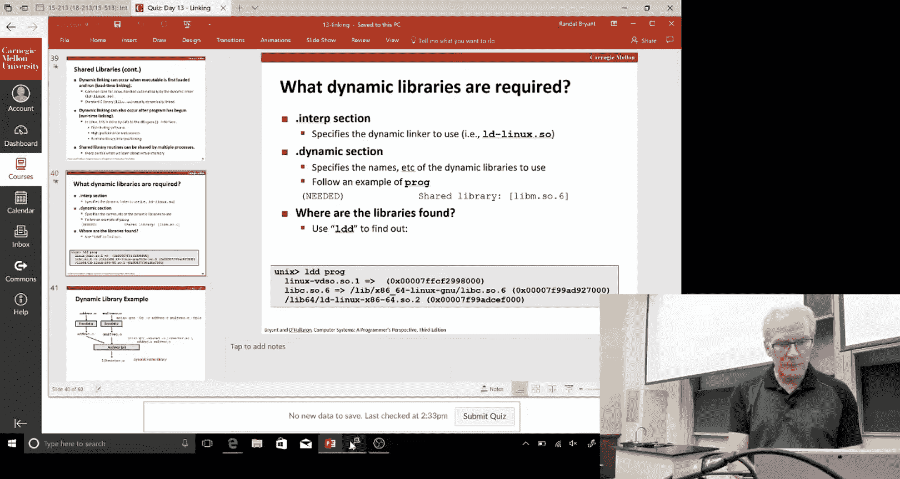

### 运行时链接

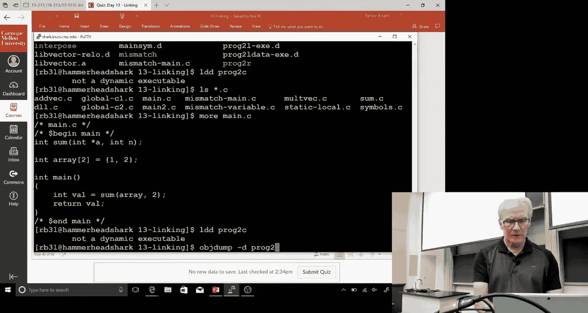

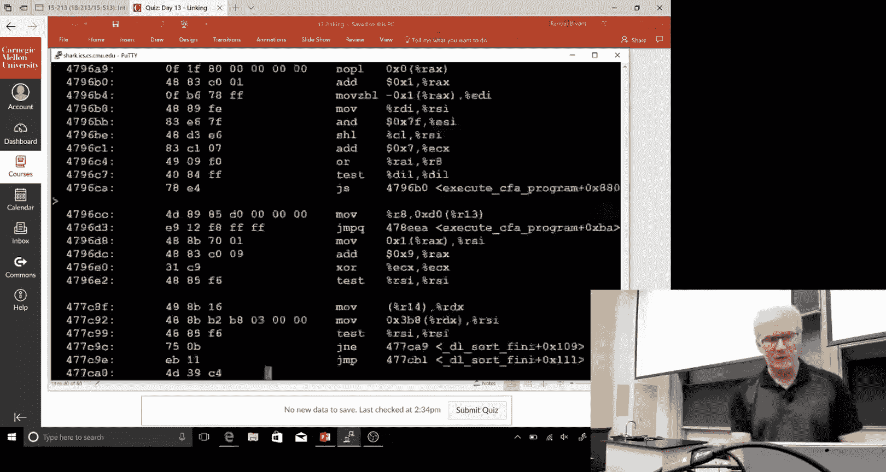

除了加载时链接，程序还可以在运行过程中显式地请求加载和链接共享库，这称为运行时链接或动态加载。通过 `dlopen`、`dlsym` 等函数实现。

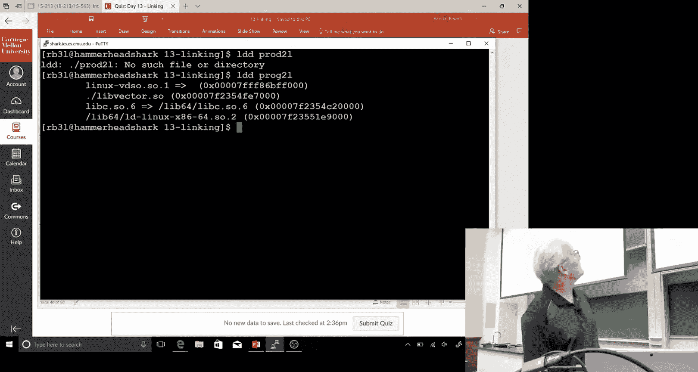

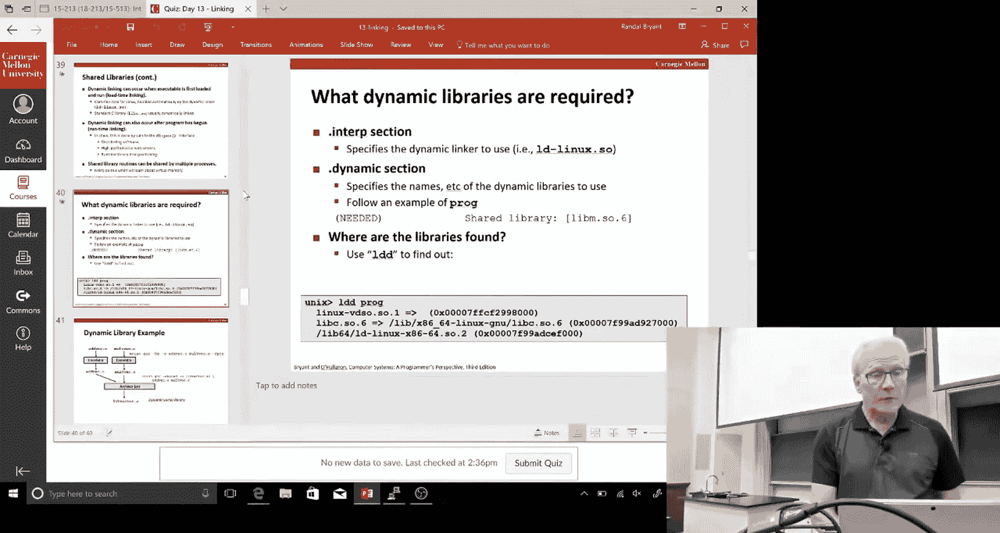

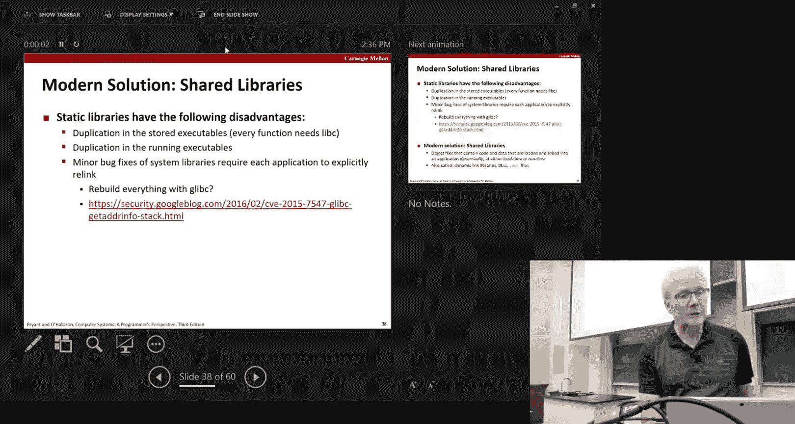


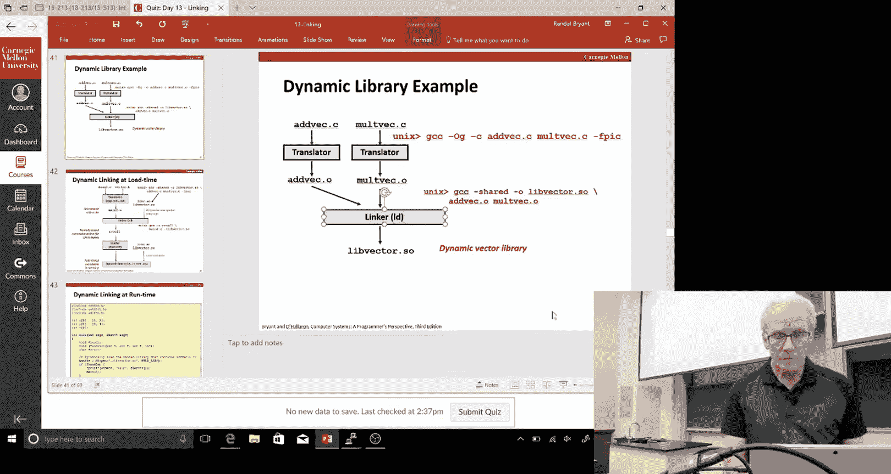

```
#include <dlfcn.h>
void *handle = dlopen("./libvector.so", RTLD_LAZY);
void (*addvec)(int*, int*, int*, int) = dlsym(handle, "addvec");
// ... 使用 addvec 函数指针 ...
dlclose(handle);
```

## 链接器技巧：拦截（Interpositioning）

拦截是一种强大的技术，它允许你“劫持”对标准库函数（如 `malloc`、`free`）的调用，并将其替换为自己的代码。这在性能分析、内存调试（如 `Valgrind` 的原理）和测试中非常有用。

主要有三种实现拦截的方式：

1.  **编译时拦截**：通过预处理器宏实现。
    ```
    // mymalloc.h
    #define malloc(size) mymalloc(size)
    #define free(ptr) myfree(ptr)
    ```

2.  **链接时拦截**：使用链接器的 `--wrap` 标志。
    ```
    // 定义包装函数
    void *__wrap_malloc(size_t size) { ...调用 __real_malloc... }
    void __wrap_free(void *ptr) { ...调用 __real_free... }

    // 编译链接命令
    gcc -Wl,--wrap,malloc -Wl,--wrap,free -o prog ...
    ```

3.  **运行时拦截**：通过设置 `LD_PRELOAD` 环境变量，让动态链接器优先加载你自定义的共享库。
    ```
    // 编译包含自定义 malloc/free 的共享库
    gcc -shared -fPIC -o mylib.so mylib.c

    // 运行程序时拦截
    LD_PRELOAD="./mylib.so" ./any_program
    ```
    这种方法甚至可以对没有源代码的二进制程序进行拦截和分析。

## 总结

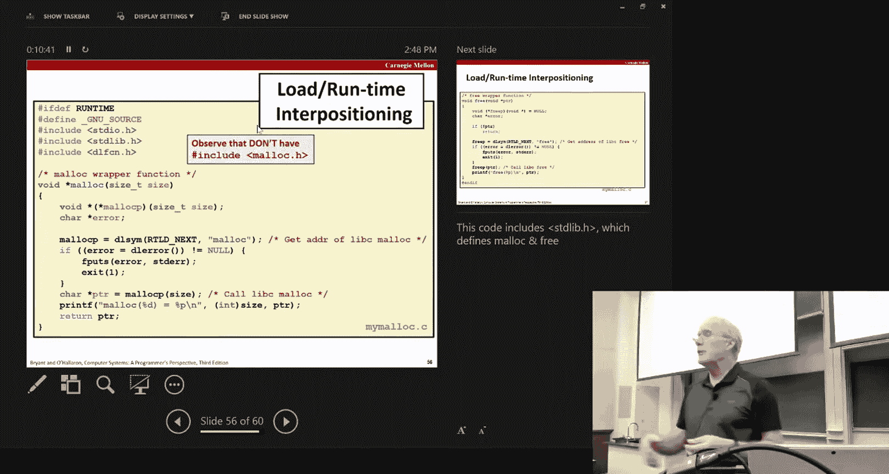


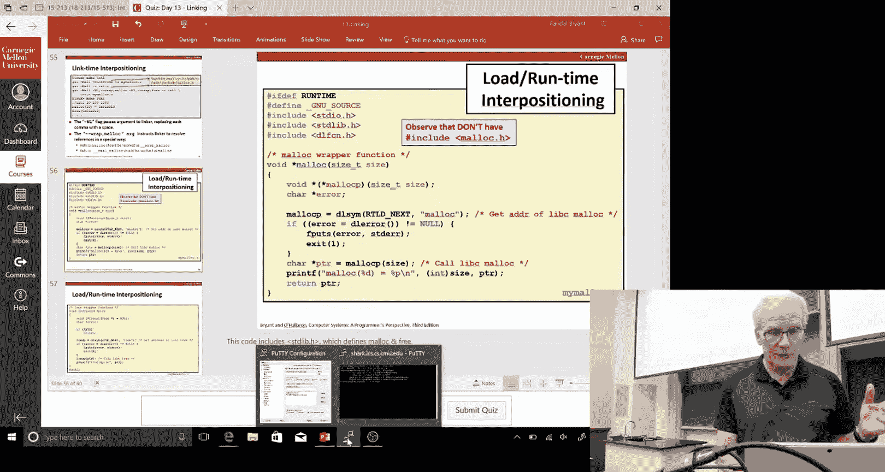

本节课中我们一起学习了链接的完整过程。我们从链接的基本需求出发，了解了符号解析的规则和潜在陷阱。然后，我们深入探讨了目标文件的ELF格式。接着，我们比较了静态库和动态库（共享库）的优缺点及创建方法，并介绍了运行时链接。最后，我们探讨了强大的拦截技术，它展示了深入理解链接器所能带来的可能性。

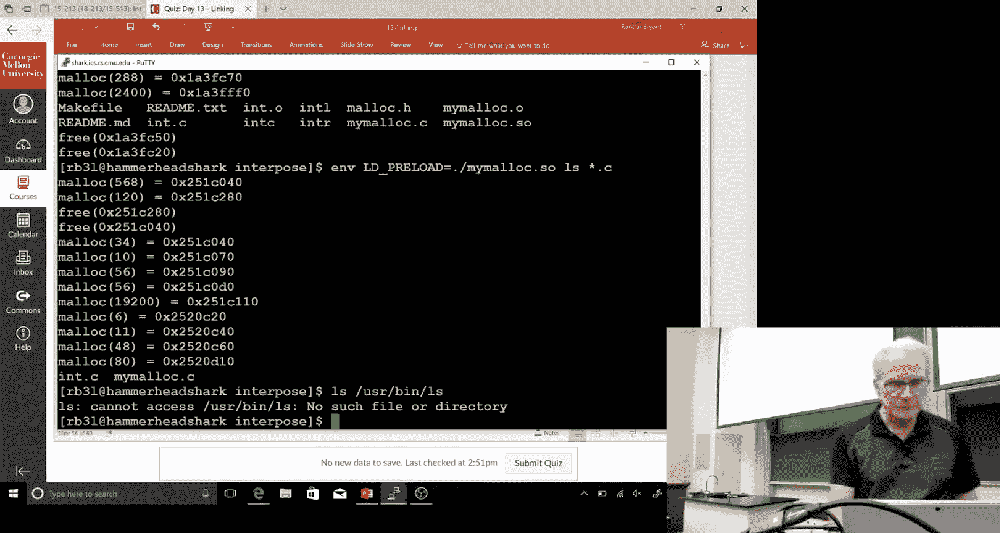

理解链接不仅能帮助你避免“未定义符号”或“多重定义”这类常见错误，更能使你掌握构建复杂程序、优化程序体积和性能、以及进行高级调试和剖析的工具与思想。