# CMU《计算机系统导论｜CMU 15-213，15-513，14-513 Introduction to Computer Systems 2017 p15 15 - ECF_ Exceptions & Processes -BV17jcReyETC_p15-

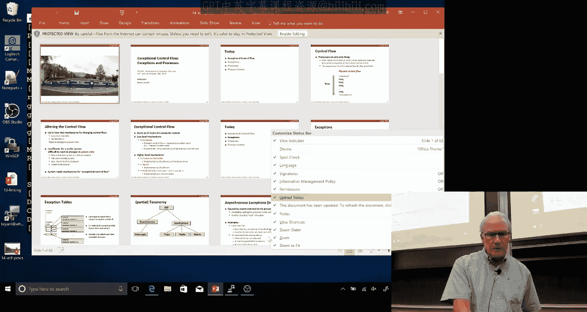

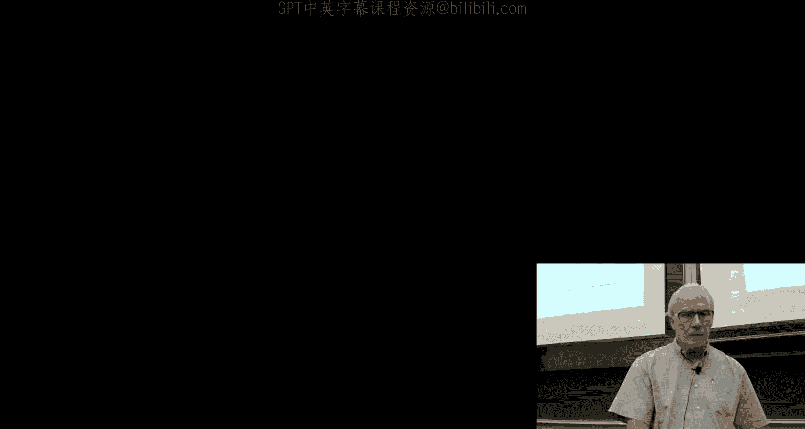

O啊。So today we're going to move on to what's covered in。The book， I think， chapter 7。

 So as you've probably seen the midterm exam。What we covered last class and what we're covering in this class will not be on midterms。

midterm exam covers up through cash。But nevertheless。

 what I'm talking about today will be very central to the next assignment you do after the midterm。

Which is called the She lab。So。As always， the class， you're doing one thing for assignment。

 you're doing something for exams， you're listening to lectures about other things。

Just kind of the way the pipeline works。What we'll talk about today is what the book refers to as exceptional control flow。

 which by the way， is not a universally understood term。

 but the idea of exceptional control flow is you've seen and you've written a lot of programs that just do one thing and then they do another thing and basically that program only does exactly what。

I very predictable and that it will do exactly what it's told in each step of the program。

But there's another kind of class of activities you have to deal with in a computer system where things happen that you don't expect them to happen。

And that might be some internal problem like you have a segmentation fault。

 so you try to reference a pointer to an invalid memory area and that comes back as an error。

 so that's an exception to your normal control flow。Or it might come as an external event。

 so for example， as I。Move this cursor around on this screen and that arrow is moving。好。

The PowerPoint that's running。It's not。Processing that activity at all。

 it's external that there's signals going into the CPU from the。T and controller。That saying。Move XY。

 move XY， everythings and then the software is then tracking those XY coordinates and putting this arrow overlaying this arrow on this screen。

 so all that is happening。As a sequence of of exceptional events。

 And the reason why we can create user interfaces that appear to low scrolling or。

Allow you to interact is that the computer is so much faster than a human reaction time that it can do all kinds of processing in what to you seems like infinitesimal time。

 so one way to think about it is the fastest you can react to something like you winking your eye or grabbing something is about 10 milliseconds。

The human reaction time is limited， so it's measured in some numbers of milliseconds。But as you know。

 processors， the typical cock is a gigahertz or more， a gigahertz is equivalent to a pico set。

10 to the minus 12 seconds， so in that amount of time， I'm sorry。

That would be a more a gigahertz is a nanosecond， so that's still 10 to the minus9cond。

 so in the millisecond you have over a million of those clock cycles。And so。

Computer can do a lot in a million cog cycles， including keeping track of these XY positions and generating the output for the graphics controller that tells it to move around。

And that happens over and over in a computer system。

 and that's one of the things you just have to kind of appreciate is is that。This big time gap。

 time scale difference between interactions involving people or most external events and the processing rate of a computer。

So。That's what you can think of a computer is really not a terribly we clever machine from the moment you power it up so the moment you power it down。

 all it's doing is executing instructions in some sequence。

 and normally it executes according to the control flow of whatever program it's running。

But as I mentioned， there's these exceptional events that will basically interrupt the normal control flow and the operating system will jump in and have it do something else。

And that's what exceptional control flow refers to。

So the idea of exceptions then is sort of present in multiple ways in a computer system。In general。

 it's just a。Change in control flow in response to some event。And as I mentioned。

 it's some combination of the hardware and the operating system that supports these。

So at a very high level。When you're running a program and all your computers， you have open。

 say a web browser and an email client and。Whatever other Vm client。

So and a Tnet client or putty or something like that。

 so you're running a whole bunch of programs simultaneously。

And somehow the computer is able to deal with that。啊。Dealt with by what's called context switching。

 so for example， if you start up multiple jobs in parallel。

 it will look like they're all running at the same time。

 even if you have more jobs running than you have cores of processor。

And so that mechanism is handled by a technique that involves context switching。

 the system that is rapidly jumping from one execution thread to another and making it look like it's running a mall simultaneously。

There's some other ones that。好。Signal is a mechanism。

 and we'll talk about that in the lecture on Tuesday that lets you， the programmer， sort of interact。

And generate and control events， external events to a program， and it can be a very useful feature。

And then finally， there's a section that we won't cover in class。

 but it's described in the book and it's useful is called set Ju and Long jump， it's a way to。

 if you've used languages， most other languages， Java， Python， etc cea。

 have some kind of exception mechanism， like if you've used Python， you say try colon。

 you can do something except colon。And then what happens if an exception is raised。

 So that's a way if you think about what happens with that is if some bad thing happens during in that block that you're trying。

Then it jumps back out to your code and then follows the path of whatever you say in accept。Right。

 and so that's an exceptional event。 C does not directly support exceptions。

 but this technique called set jump and long jump is it sort of。Not very。呃呃呃谁了。

Low level systems level way of giving you that same ability to jump back up into some part of the program if something goes wrong。

So in general， what happens then？Where the program is that your user code is just chugging along。

 executing whatever program it wants。And some event occurs。

 as I mentioned that event could be internal to the program like a Seg fall or it could be external。

 it could be a signal by the hardware that there's been some event on the track path。

And that will raise an exception and what happens then is it jumps into operating system code and it's referred to as the operating system kernel and you'll hear that from a lot。

 the kernel is sort of the inner part of the operating system and one important part is it isn't a program that's running on its own it's just part of the operating system thats sort of spread around and actually executes is part of your program。

 your executing program on your behalf。And then the exception handware will decide what to do with this event。

 and there's various options for that and we'll talk about why there might be different possible outcomes。

And then it will take some action when it' service that exception， and there's multiple， again。

 we'll look at various possibilities， one of which is it will just return back to the original program and resume execution wherever it finished。

But there's other possibilities too。So for example。If a。好。

A timer goes off that is what sort of triggers you might want to switch to some other program now。

And the operating system says no， I'll just stick with the original one。

 it'll just return back to the original programming and resume execution where it left on。

But we'll look at various other possibilities here。

So the general idea is somewhere in the operating system data structures is a table that given a set of different possible numbered exceptions。

 it will then jump and execute the code for that。Particular exception。

 and so you can think of it as like a giant switch statement that is branching based on some numeric indication of what particular exception has been raised。

 guess。So。最三台。秋きの昼るんだって。在こ。So you， this is actually。

 that's a very good question because this table is part of the operating system kernel。

 so you do not。Drek， you don't have permission to do anything with this。But。

You can make calls and we'll see that this is exactly when you call this function called signal and basically you're giving your own。

You're saying to the operating system， if this particular signal。

 which you can think of as an exception type ever gets raised， I want you to execute this program。

And so what that that。A system call you're making。To signal will cause the kernel。

So then put a new entry in the exception table with a pointer to your code。

So that's the general idea that。In general with the operating system。

 you don't get to touch any of these data structures or in protected regions。

 but there's various operating system functions that you can call that will cause the operating system to do something on your behalf。

So as I mentioned， this really this term exceptional control flow really involves a whole range of different possibilities and it's hard to bring them together。

 but you can think of that this distinction of asynchronous meaning responding to external events。

Like。Like one other one that happens is when a new packet arrives from the network。

It actually will get loaded into。A network interface and it will load it into some little buffer in hardware and then raise a flag that tells the processor hey。

 there's some new data here coming in from the network you might want to take a look at so that's another example of an asynchronous event。

And so those will cause what commonly called interrupts。And then there's synchronous events。

 which are ones that are related to the program you're executing。

And they can have different effects that we'll go into a little bit。So as I mentioned。

 the simplest version is what's called the timer interrupt。

 which on most of these systems happens either every one millisecond or 10 milliseconds depending on configuration。

 and that's just sort of the way the machine kind of just hops around so it's always executing different programs。

Or it can be some external。啊。Pie of。IO， so for example， disk drive， which。

I know are' becoming increasingly rare on laptops， but they still exist。

 iss so slow if you think about it， it takes like a couple milliseconds before you start receiving information from it。

That in the meantime， the processor can jump over and do all kinds of other stuff on some of their program whilst waiting for the read that you've asked for off of a disk drive。

 So what will happen is。The program will say， I want to read from this file and the operating system will say。

 okay， disc， give me this part of the the。The sector from the disk。

And then the operating systems will jump over and say any other programs need anything done now let's see。

 and then finally when that data comes off the disk。

 it'll send another signal to the operating system which should go oh， well。

 this process is the one that's waiting for that input and so wake that one up and executed so the point is it's always managing this very different timescales of things that happen from the external or the real world versus things that happen in sort of the rate of processor。

他。And so there's a distinction of different types of synchronous events。

 but it really isn't that critical to know the distinction between them， but in general。

Trapps are things where you intentionally cause an exception an event。

 faults are things where something appears to be wrong。

And the operating system may not be able to fix it up。

And ofport are places where the program will be unable to continue executing because either the machine's broken or the program's broken。

But all of these， there's not a strong distinction between these three categories。

So down at the lowest level of code。There' in X86， there's actually an instruction called Cisco。

And this call is sort of like the lowest level version of。嗯。Interaction with the operating system。

 So a lot of the functions that you're familiar with， like low level file operations， read， write。

Open and close， so those you'll recall are the。到。The unbffered。

 lowest dwell type of file interactions。And you'll get a lot more of those coming up， a fork itself。

Which we'll look into later this lecture， which is the way you create new processes。

 you create a new executing program。Exec， which is the way you can run some other program。Exit。

 which is the way you exit a program or kill， which we'll look at next time。

Which is actually a misnamed command， those are all called system calls。

And so in terms of the actual。Instruction。It uses and this is kind of low level stuff。

 but it actually uses。第一啊。The register RAX， whoops。

So it's a little like looks like a procedure call that you've seen。

 the call instruction where you pass some arguments in registers。But it's not quite the same。

 it uses a different set of registers， in particular， RAX。

Is used to pass the ID of which system call you want to make， so these IDs like01，2，3，4 and 57，57。

 those are all you call the cis call instruction， but you've put in register REX one of these numbers in advance。

And then the other arguments you might pass are put in other registers。

 So this is actually the disassembled version of the。The function open。

 which is the way you open a file。啊。An unbffered open， so it's we'll look more into。FileIO。

In a few lectures， but think of it is just a very low level version of file。

Opening and getting a file ready to read or write。So what happens is。

It puts the number two in register EAX， which you recall is the 32 bit。Subset of RAX。

 and that corresponds to this particular call to open。And then it executes the cis call。

 which is just this instruction。 It's just a two byte instruction，0，5，0 F 0，5。

 And that what Cis call does though， is it actually jumps up to the kernel。

 jumps up to the operating system and says， hey。My program wants you to do this。

 could you please do it and what happens then is the operating system shifts into kernel mode。

 which means it has access to all these data structures that you your normal program。

Is not allowed to touch they in protected areas of memory。

 and it can do whatever the operating system needs to do。And then when it's completed that。

 it will return back。嗯。And。It actually will return back。To this part of this function。

 just like a regular procedure call， and then the open the library call will do other things to sort of complete that call but the point is this little instruction cis call is sort of the way you invoke the operating system to do something for you。

So let's imagine some example scenarios in why they'd cause exceptions and what the exception handover should do about it。

So the first is imagine I have some uninitialized array and the first time I go to assign some value to some element of that array。

The chances are。That that part of memory has not actually been allocated yet。

 or it's potentially the case。And so what will happen is it will cause a page fault。

 the operating system will recognize that this particular address。嗯。Is not。Is not valid。But。

The operating system will say well， it should be valid and so what it will do is it'll allocate the necessary。

 build up the necessary data structures in what are called page tables so that this page is actually there in memory。

And then what it should do after it's done that then。Is it well。Actually。

Either allocate a fresh part of memory or if it's an old part of the memory that's been used。

 but is temporarily unavailable， it will bring it into memory from a disk whatever type of。

mechanismchanism is being used to store these pages。But then what it's supposed to do is go back。

And reexecute this instruction a second time and the second time that will proceed without any exceptions because now the page is available and it will access it。

 so this is an example of an exception where the proper behavior is for the operating system to do something and then resume back and execute that instruction again。

A different version would be imagine you'd try to make a reference to memory location that is completely out of bound。

So the same steps will happen， it will cause an exception and it will the operating system will start running。

 but recognize that this particular address is not within the range of valid addresses for this particular program right now。

And so it will say， oh， there's an error here and so when you experience that when you have your program dump out on you and say segmentation fault。

What's happened is the programs just aborted all together and gone back and terminated the program。

So there's various mechanisms you can invoke with segmentation faults。

 but this default behavior is to abor approval。So one thing， and I've been alluding to this。

 I've been talking about executing programs and things。

 there is instead of a very important concept in computer science that's called a process。

 so a process is an executing program， an instance of an executing program。

And so a process and a program are different， you can think of a program as just something that's dead。

 it's lying there， it's not really， it's just the code。But a process is actually a program that's。

Being run right now， and so it has state associated with it。

 it has things like the contents of the memory， the registers， and things like the program counter。

And you can have multiple processes running the same program simultaneouslyimultaneous。So。

So it's not the process or， the process so is the physical hardware that runs programs。

 it's the process， it's an abstract object that has some state that is currently executing。

Or it might actually be suspended。So for example。

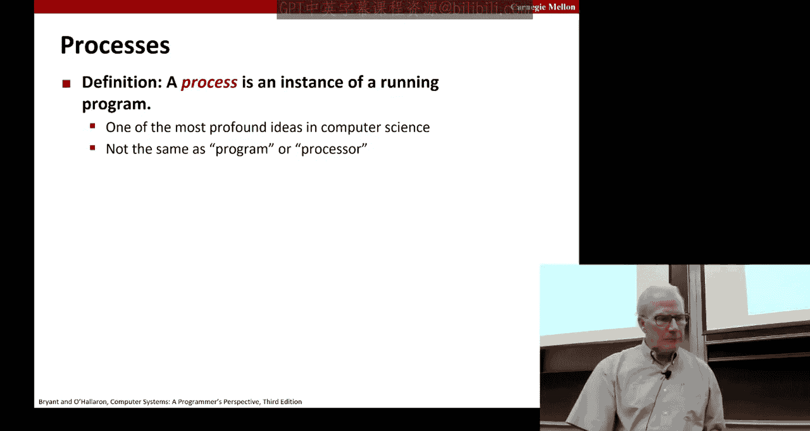

I'm gonna。気ちす。So for example， if I run， I'm on one of the shark machines。

And I used a program called TRP。Which is a standard UniX program。

You'll see that it says that right now there are 488 processes overall， of which only one is running。

So the machine's basically not doing much。And in fact， the only one that's really running is me。

And you'll see other people are like running editors， emAC， Zm， and so forth。Those programs。

 if you think about it， don't really need to do very much because your typing is so slow。That。

That it consumes like an infiniteestinal amount of effort for the processor to do basically so the program is an editor is mostly sleeping all the time it's sort of just in the suspended state and then when you hit a keyboard that'll cause an interrupt it will。

Do whatever that keyboard action tells it to do in terms of displaying text or updating a buffer。

 and then it will go back to sleep again。So you can see that this is a machine that's got some people editing。

 I'm running top， but there's not much going on， but the point is that there's many。

 many processes that this program has it's managing， even if it's a fairly idle process sort。

 there's not really a lot going on。And so that's the idea of they're called tasks here。

 but that it's。Proper term is a process， it's an executing program。

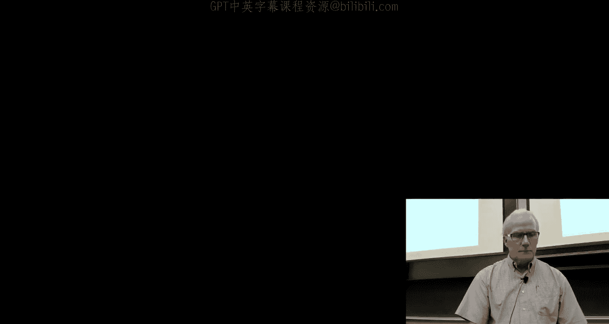

So you can think of that as a。When you write a program。

 you think about it as if you have your own private pro sort right you're not worrying about the fact that you're sharing this computer with your seven best friends or。

Or with your between your web browser， your email client and the code that you're running off for an assignment。

Those are and so it's because these computers give you this abstraction where you can write your code and write it in a way that sort of your mental model is that you have total private control over this computer。

 but somehow it's being shared between multiple processes。

 so what we say is there's a mechanism called context switching that handles it。

So a process then has two things， one is a control flow。

 meaning where in the program is it executing， and it has a state。

 has what's stored in its registers， what's stored in memory， and as you recall。

 the memory includes things like the staff， which gives you the state of all the outstanding function。

 all the procedures。So as I mentioned， the computer gives you then this illusion what's referred to as multi processing。

 which makes it appear that in your little box you have。And an arbitrary。

 an almost arbitrary number of little computers running their own program。

I mentioned 488 on a shark machine。And you'll look if you look on your own machine。

 you'll see that it will be running lots of processes。But。

So it's giving you this illusion that somehow you have all these computers stored away。

And so for example， this is showing running top the same program， but on a Mac， I think my Mac maybe。

And again， you see it's running a bunch of different programs all at once。

 and it says it has 123 processes running at this point。In this case， five of them were running。

So what's really in a classical system then？And so I'll call this traditional because real hardware is a little different nowadays。

 but conceptually， it's not that different。 So conceptually。You only had and even a big machine。

 only had one CPU。And so what would happen is with all these processes is at any given time at most one of them。

 actually exactly one of them is really running code。

 and so at that point its registers are held in the CPU and the rest of the state is held in memory。

But meanwhile， there's other processes that are not executing。

 and what's happened is the register is the sort of active part of the state that's managed by the processor。

 is saved somewhere in memory。And then the operating system can do what's called a context switch。

 which means it has to store the register somewhere。And then jump to another process。

 grab its saved register state， bring it into the CPU and execute it question。诶水色嘅成我。来。

For each process。 So what I like。I'm like， so what is like the extension handle cause like process？啊。

对。it's another process。And then another example handle。B process。differentい。That's a great question。

 and it's all part of this context switching。So the case you described。

Is imagine the program on the left is running along perfectly happy， but then some exception happens。

 either an internal thing or an external， it'll jump to the operating system and then depending on what the operating system decides to do it says。

 okay， I'm going to like。I'm going to change to a different program and so it will actually change over it will store the registers of the process it's going to leave behind and grab those of this new process and start executing it so each of those。

The cases you described， you can have an exception come in， cause it to change to one program。

 another exception come change to another， maybe go back again。Over and over again， jumping around。

 each of those is a context switch。And it typically is。DoLike 10，000 to 30，000 cock cycles。

For the operating system to manage that。But again， a gigahertz processor。10。

000 clock cycles is 10 microces， so it's not very long。My question was like。

 what if like the loop of exception takes you back to like different replace original for？Well。

 it might。There's times when that's the right thing to do。

it didn' take your back to you wouldn't go back to。ごしないです。はい、そは。No no， so it really depends。

 you know， you have to trust the operating system to do the right thing most of the time。好。😊。

If at some point it went back to this original program。

It would resume executing wherever it had been told it should resume executing it。 That might be。

 as I mentioned， to retry the。Most recent instruction。

 it might be to continue with the next instruction because like if the next external event has nothing to do with this process。

If it was to terminate altogether， then typically what would happen is the operating system would shut down this process before it moves on to another one。

So those are all possibilities。But the point is that。

The system is giving you the appearance that you're running all these programs simultaneously。

 but it's really just jumping from one to the other。嗯。Now in a modern system。

 like even a phone nowadays， this phone has four cores plus some number of graphic processing units and my phone's not even the newest one。

Most modern computers， all my ups have either two cores or four cores excuse me so what's happened now is it's become chips。

 the chips they build these on can hold so much hardware。That they found it better too。Replate。

 give you multiple cores rather than try to make one big faster computer。

It's an interesting story behind that， but it's the main point is you have actually multiple computers。

 but still you have fewer computers processing cores than you have processes to execute typically so this same action is going on of at any given time。

Only some subset of the actual processes are executed。But instead of it just being one。

 like it's dark， it will be two or four or some number like that。

About the biggest machines you typically find of traditional CPUs have 16 cores known。好。

So but let's just at least not worry about that multiCd case because it's almost more confusing than to think about the classic single chord one。

So what we'll say is we'll introduce this concept concurrency。

 meaning things that seem to be happening simultaneously。

And what we'll say is that two processes are concurrent if their flows over in time。

 so what this diagram shows is， for example， process A will run a little bit and then the system will switch over and do B。

 and then it will switch over and C， and it switch backs to A， and it switches back to C。

So what we can think of is。呃，A。Is actually then concurrent with B and B A is also concurrent with C。

 but B and C are not because B completes entirely before C begins。

And the reason why that term is important is because there's potential interactions between two processes if they're concurrent。

But if they're not concurrent， then they'll be independent of each other。So again。

 even though in this system， it can only deal with one flow at a time。

Conceptually we can think of we can sort of squash it down and say A and B sort of appear to be running at the same time as do A and C。

 but B and C do not。And as I mentioned before， this idea of context switching。

Or switching from executing one process to another is done by the colonel。But technically。

 the kernel is not itself a process， the kernel is just code that the operating system runs。

 and what sort of happens when you do a context switch is for a while the process is considered the kernel is considered to be part of the original process。

And then if it's doing a context switch， now it will start sort of firing up another process and let that one execute。

 so the operating system is running in kernel mode during these periods to cause this context switch to occur。

These， by the way， if you take the OS course， I think 410 is the number。You'll write all this code。

 you will really understand this way better than I do， in fact。

So that's essentially- and you'll hear that people talking about OS kernels and kernel code and kernel hacking and blah。

 blah， blah， and that's referring to the sort of innermost control operations by the operating system。

啊。So now we're going to start talking about。The library functions that you have access to that let you sort of generate processes and interact with processes。

And so all these are referred to as system calls。But that's a little different than that instruction I mentioned earlier called Cis call。

 a system call is just a library call to a a。A call to one of the library functions that lets you interact with the operating system。

And in general。The different system calls have different ways of telling you whether it。

The result was okay or not， in fact， it's a kind of confusing mess of them。

One thing you'll learn about in this course is that we're fairly insistent that you checked the return codes of any function to see if an error happens。

For example， you've already seen milk it will return null。If it failed。

 and we ask you that you check that。In general， there's a whole class of functions that what they'll do is they'll set a global variable called error no。

Standing for error number。 and it actually just gives a numeric value。啊。Of some error code。

 so you know you see those annoying things， error 307。And then there's another。Uunix。

 there's another library function called stirR error， which given an errorant number。

 will print out some slightly more descriptive message about what type of error this was。

But it will be something cryptic like segmentation fault。

So one thing in the book and in our presentation， we sort of。

Sidestep this issue of checking return codes， because you'll see as you do this in your code。

 the code just becomes completely littered with。Conditions， checks， exception handway。

 what should I do if this error occurs kind of code？

It gets pretty impossible to read and really hard to display on a computer screen that's the size of this screen。

So what we do is we tend to package these up with some error。

Hr that just prints some error message and exit calls exit and if you call exit with anything other than zero。

 it's considered wrote an error， you're signaling an error。And so， for example。

 if there's some function。And we'll talk about what fork kids in just a minute。

 there's some system function you want to call。And its particular way it tells you that there's something wrong is if it returns value less than zero。

 and so then we invoke this error handler。And。And in the book。

 we adopt a convention and we'll use it in the slides as well。

 that we sort of write our functions in uppercase。Our what are called wrappers。

 so a wrappper is just taking some standard code and putting a little extra code around it to handle things for you。

And so for example， we'll use a function called uppercase fork。

And it just calls the system library fork function。And if it gets an error code。

 it will do this error in exit。So one thing we're going to start venturing into is as you get more advanced in your programming。

 you'll start running programs where the correct behavior of some error condition is not to just throw up your hands and exit。

If you're writing code to handle somebody's。Heart pacemaker。And。Some error condition occurs。

 it's not okay to say segmentation fault。You're dead。

When you start writing programs like embedded systems like that or what are called。

Serverers or other function， long living programs that just have to sit there and do something no matter what。

Then that sort of well up your game you don'll have to up your game and in general。

 exiting with an error message is often not an option。

 but just for the purpose of this course and discussion just to keep things so we can honestly claim that we check return codes but we don't do much else with it。

 we'll just use this convention with these uppercase functions。So in general then。As I mentioned。

 there's this idea of a process and in UniX， the set of processes logically has a tree structure and we'll see why that is because what happens is a process is created by having one process will create a new one。

 and so the first one is called a parent and the new one is called a child。

And so you can think of these parent child process structures as forming a tree because in general。

 one process can create multiple。啊、 children。And each of these is labeled by a process ID or we'll call that a pinI。

 and so at any time there's a function you can call that will get the ID of your process。

 your own process or one of your parent processes。嗯。And in general， then a process can be in。

In different states， so one is that it's currently executing。Or it might be。嗯。

aiWaiting for some event， but it's ready to execute when the event takes place another it might be stopped。

 meaning it's or that's a case where it's waiting for something and it won't start until somehow it gets resumed or it might be terminated。

 the process might be done。There's more cases than that。

And so how does a process terminate one is that。There can be some air condition that forces it to terminate when you return from the main routine of your program。

 then that terminates the process or if you call this library function exit。

 you'll also terminate the problem。And as I mentioned， exit takess an argument。

And that's the return code。And anything other than a zero is considered an error。

Somebody that and error occurred。So you can think of exit as an interesting function in that you call it once。

 but it never returns， it never returns back to your program。

And we'll look at now other programs that have this strange behavior that。

There's not exactly a match between it getting called and it returning。

So now we're going to start on one of the more peculiar functions you'll have to deal with。

 and that's called fork。Which he saw alluded to before， so fork is a way to create a new process。

But the curious thing about the way it works is it just basically creates a clone of itself。

I think I have a picture here。Yeah。So conceptually， what happens is you have some executing program。

嗯。With its state and then that program calls fork。And what it will do is logically。

 it doesn't actually do it this way， but logically it's as if it makes a total copy。

Of its entire state。And that one is called the child， including。All the global data， all the code。

 the entire runtime stack。Any allocated data structures， all of those will be completely copied。

Make a clean copy of it。And the only difference between the and so one's called the parent and one's called the child。

And then it will。Resume executing either the parent or the child。

 but it's not fixed which one it will do。And now the child， in this case。

 I'm showing the child will run it， the only thing that distinguishes the parent from the child。

Is that they'll have different process IDs。And so the return value of fork。

The we'll get two different returns because this is a case。

 it's a function that gets called once and it returns twice。And this is where it's really weird。

They will return。Excuse me， we'll return。Back to both the parent and the child。

 and the difference is that the child will get a return code of zero。

Whereas the parent will get as a return code， the process ID of the child。otherwise。

 the two are indistinguishable。And then those two programs will start executing。

 resuming wherever the。Whatever happens after the fork call as if it were just a normal return from a normal function。

 so conceptuals like making a call to a function， but not returns twice once to the parent。

 once to the child。So let me show you some examples of this。I'm kind of frustrated。

With trying to jump between code and。Data， so what I'm going to do。Is use two different screens。

As best I can。So people who are- and this is all complicated because I'm trying to record this lecture for people who are not here。

So what I'm going to do is。

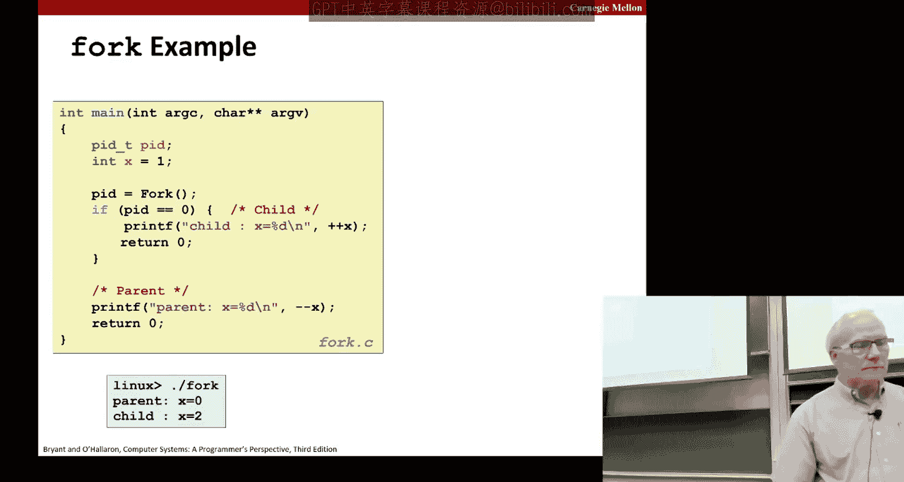

So of。

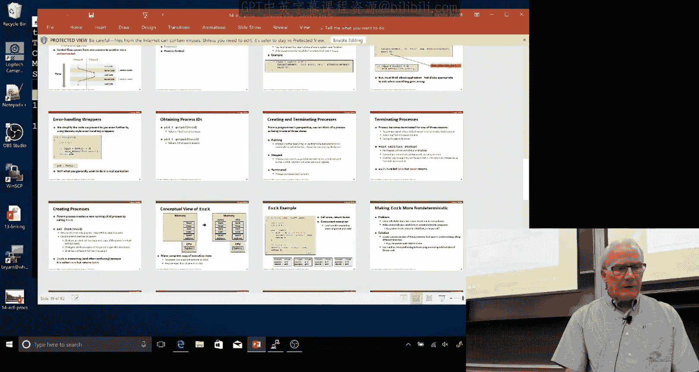

Jump between two different screens。See if this works。

And what I will do for the people who don't have。Are both screens visible。

I I'll tell you what slide number， so the slides are all online。

 they all are numbered and you can look at that。Because it's really。They set up the Google offering。

So anyways， here's the first example of a very simple function called fork。c。That。Well。

I'm not going to do this。callll嗯。Called the function fork。So it says PID equals fork。

And then it will test， is the process ID return zero or not， if it's a zero。

 that's an indication that it's in the child。And what the child will do then is just print something and return zero from Maine。

 which is equivalent to impact。And so。The parent then will not execute。That conditional。

The code inside the conditional instead will print parent。And it'll print something about bags。

 And so if we run this。啊，我不变。Is。In principle， we could get it to print either parent or child in either order。

But if we run it a whole bunch of times。We'll find that it's pretty consistent。

And I'll talk some about it， but there's nothing inherent about。

A fork that guarantees which will run next， the parent or the child。One thing to notice though。

 is it's printing x equals zero for the parent and x equals two for the child。

And that actually is a fairly important point here。So going back to the code。

You'll see that in the code， the child is incrementing the value of x。

And the parent is dectrimenting。But what's important to realize is those are actually different x's。

Because remember， I told you that the。The system makes a replica of the parents。State。

For to be the child， but after that point， they are actually now separate programs it says if you're running two different programs。

 each of which is incrementing or decrementing some value X。Those have no relation to each other。啊。

So。We'll go into more， we'll get into some more exotic cases here too。Sorry， I am。

But you're still seeing this。And so it's possible that this will。It's a possibility。

 although it's hard to create that behavior in the system that it will print the output from the child before it prints the output from the parent。

It's unpredictable and that's one of the things when we're moving into an area of what's called concurrent programming or concurrency where you can't always predict what order various events will take place in and as a programmer that makes you have to think about many different possibilities happening。

So one thing， as I mentioned， if I run this program called Fork。It's kind of a dull， I mean。

 it's not a very interesting program in the first place。

But it's really dull here and that it does the exact same thing every time。

So what I've done is create my own。A version of the Fork library where I can insert random delays。

At various places to sort of make it so these possible concurrent activities will occur in a less predictable way。

And like we discussed it the。Last lecture toward the end， running out of time， I admit。

 you can actually do what's called interpositioning where you replace the standard library for some activity with your own version of it。

 so I wrote code calledMyFork。c。Which is。嗯。I will show you all of it groups。

But it basically will randomly generate delays。And it will。

Insert random delays both for the parent and the child of a fork call。

 and so that sometimes it will force it so that sometimes the parent comes back and sometimes the child。

So to make that happen， I can use this。嗯。And it's still kind of annoying how it's so predictable。

So let's see what's going on。Did I get them。I FD preload is that， oh， it's LD preload？あ、三。

Ill be pigload， he have to say。name so you might recall from the last lecture。

That you can basically insert your own custom library。And。

Have written these functions with this sort of wrapper， and so this is vervo mode that's saying。

I created a fork and the child has Pro ID 1472272。Parents 271。

 and I'll insert a do of 31 milliseconds for the child and 80 for the parent。

 So now what I did was I sort of。Sip this race between the two so that the child would come back sooner and you see that is the case here that。

And sometimes it actually creates these funny delays that makes it so it even mixes up。

What's coming back？嗯。So that sometimes the parent comes back first and sometimes the child and it messes up the whole output。

And so one thing the only thing that actually gets shared between two processes the parent and the child is is all the open files and the standard output is an open file。

 so it means that's why they're both when they're both saying print of。

 they're actually showing up in the same place， so they're sharing they're actually the order at which printing is occurs is somewhat arbitrary as well。

But。So I turned off the vibose mode， but you'll see sometimes the parent comes first and sometimes a child。

Most of the time， the child seems to happen first， but not always。

So the point is that when you and this is one of the frustrating things as a programmer that the system might be completely predictable。

 but you as a programmer to make sure your code is correct。

 have to make sure it also works in the unpredictable case because maybe the。

The parent usually goes ahead of the child on this system。

 but it's not guaranteed it might be different on some other system。

So one of the things as a program you have to learn is to write code for these kind of where you have to anticipate these various possibilities。

嗯。So now let me just emphasize this idea of。These variables are independent。

 but this is basically the same idea I call it farex2， that it's sort of the same code。

Except that itscrement， the child is incrementing X twice。And the parent is a decrementing x twice。好。

And it's survey printing and what will happen on this one？Is。Again。

 typically one will win over the other， but the main thing to notice is the x is going down for one and it's going up for the other。

 there's no interaction of those various x's between each other because now they're running in different processes。

 they're independent of each other。Okay， let's move on to other。Programs here。

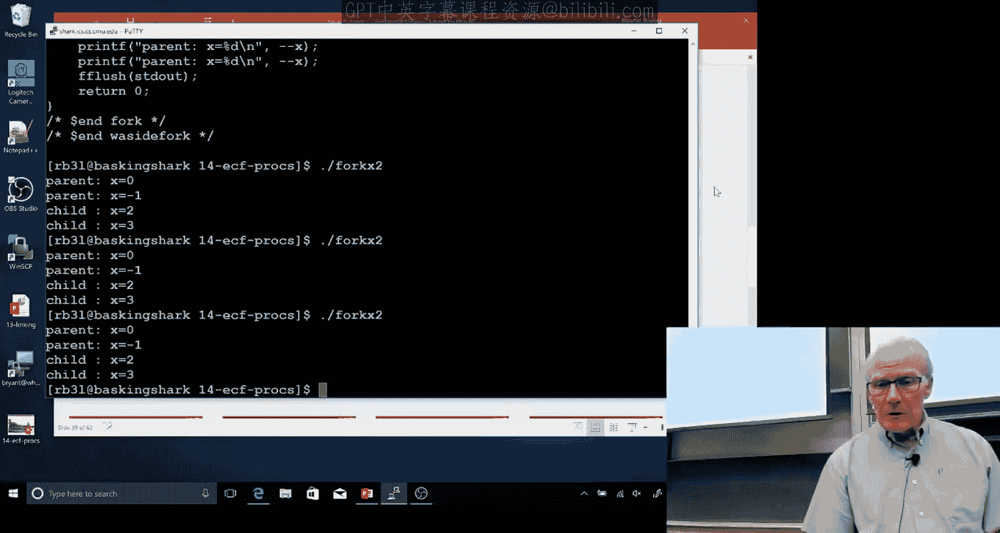

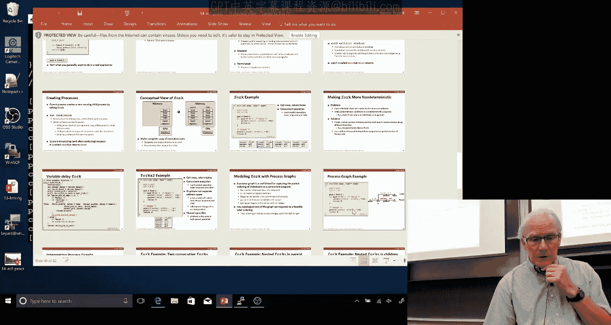

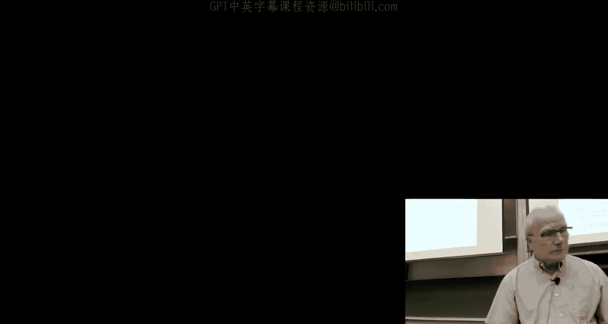

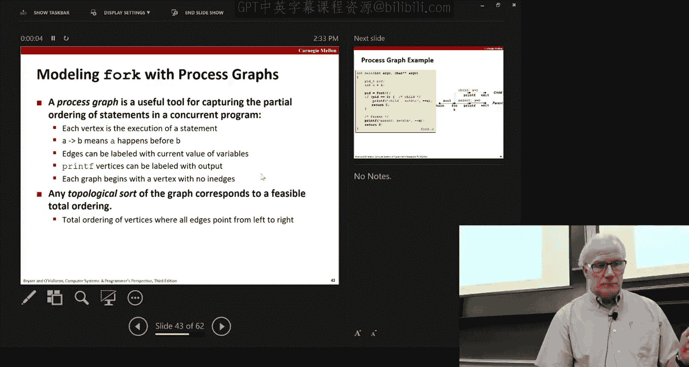

So the book uses a kind of way to visualize these processes that it calls process graphs。

 and it's a very useful way for you to be able to reason about these where there's multiple possible scenarios。

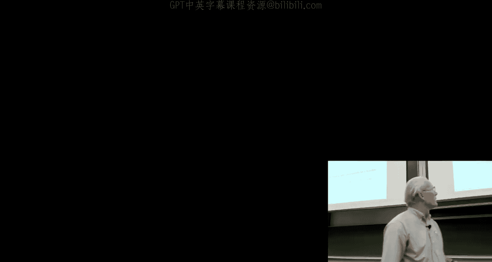

And so let me just demonstrate with a simple example。

This is the code we already have looked at that the child is printing child。

And parent is printing parent， and both of them are exited。

So the way this program works is that each of these adoptts is some point where some action occurs and it can be a little bit compressed。

 so the point is there's an initial function called mainine。And it's calling fork。

Which got a little bit。Read had formatting here。And at that point， now it splits into two flows。

 one is the parent and one is the child。And the parent will print x equals zero and exit。

 the child will print x equals2 and exit。And。The important point is what will happen then on my screen is any kind of interleaving of these two branches can happen。

And so。嗯。It's possible then for。嗯。You saw， although。

You saw cases where first the child value got printed first and then the parent and others where the parent got printed first and then the child。

So what you can think of is that these events are these activities by the program。

These dots can occur in any order from A through F。As long as you don't violate any of these。

These dependencies shown in the black lines。So for example。

 if I had something where event E happened before event F。

As shown on the lower part of the screen here， that would not be allowed。

 It's not possible to reach event F without having first executed E。

 but it is entirely possible to reach event F。Without prior having executed C， right？

So you could go A B， E F， you could go AB， C， D， or you could go A B， C， E， FD， in other words。

 as long as you sort of respect the ordering imposed by these arrows。

Then the events can happen in any。And so this this example is not very interesting。

 I mean doesn't have that many possibilities， but let's look at a few more。oddd ones。

So the next one is， we'll call it Fort2。And you see it calling for it twice。

And it doesn't have any conditionals at all in it。So。

How many times do you suppose the word buy is going to get printed here？

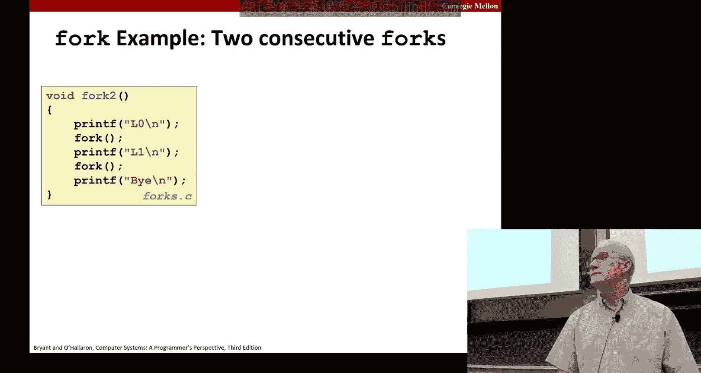

Anyone want to guess？て。Let me just check which。So that' called Fort2。You'll see what happened is。

That。Five gets printed four times。What's happened is this program is sort of like a tree。

And you'll notice also that so it's pretty L0 once， L1 twice， and by four times。

And the ordering of them。Is variable。 So especially if I do my。啊。Tip where I can change orderings。

I can get all kinds of stuff going on。Here's an example where it went L0， L1 L1， bye bye， bye， bye。

Well， there's not a lot possible， not a lot happens here， but in general。

 you can get various things happening。

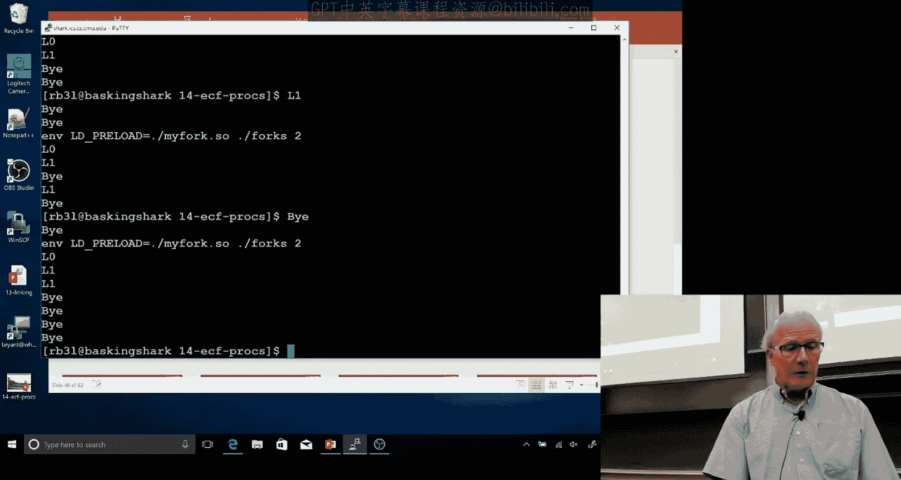

So why could that be？

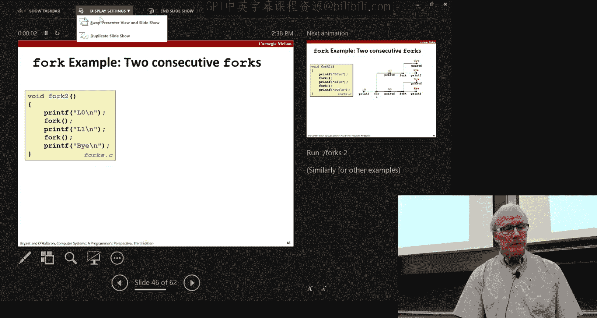

Well， like I said， you can think of this as like a tree。啊。It's shownone tilted， but L zero calls for。

And then I have a parent and a child， each of which will print L1。

So the first I printed LGO to start， I did a fork， each the parent and the child printed L1。

And then each of those formed， so now I have the parent。

 the original child and a new child and two new children。

So remember that this code without any conditionals is just going to get through and each fork returns twice。

Called once returned twice。 So each of these forkts is going to double the number of active puffs。

And so you can see that overall it has to print L0 once， L1 twice， and by four times。

But the ordering， as you've seen， can vary because this， I can do L0 L1， L1， by by by by。

 or I could jump through L0 L1。One or more buys， then do L1，1 or more buys。

 so there's quite a few possible orderings here。And one thing you can't really tell when it's printing either L1 or L or by。

 you know which one of these is it printing， they're not really purely identified。So。

But I claim that it can't print。This。Right。欧呀。Anyone see why this I've labeled in feasible is indeed not feasible。

 yes？Right you can't have a by before L1 right that all the paths that get you to a by pass through L1 so you can think of it as。

know that basically all the possible outputs you can get are by enumerating。

traversing this tree in all possible orders， but you can never jump ahead of something。

So here is a variant to that code。But you'll see it's got some conditionals。

 So the fourth9 equal to0 is a sign that it's in the parent。And so it will print L1。And then again。

 L2。And then it will print bo， so any guesses on that？How many buys it's going to print？职医生。Let's。

 let's see。

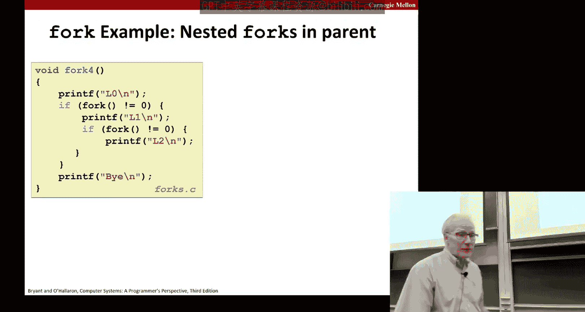

Wow， this， I don't think it's the right code， let's see。Yes。No， Fork3 is different Fork3 is like42。

 but with。Another layer， so it does have eight。 the floor is the code where we just looked at it on the slide。

 so let's see what that does。So it prints L0 L102， but it only prints by twice。な糖。Three times。

 Thank you。Yes， you're right， that makes more sense。 So yes。

 it prints by three times L001 L2 each twice。So just going at the code。

 you might be able to figure that out， but you might not， so how are you supposed to do it？

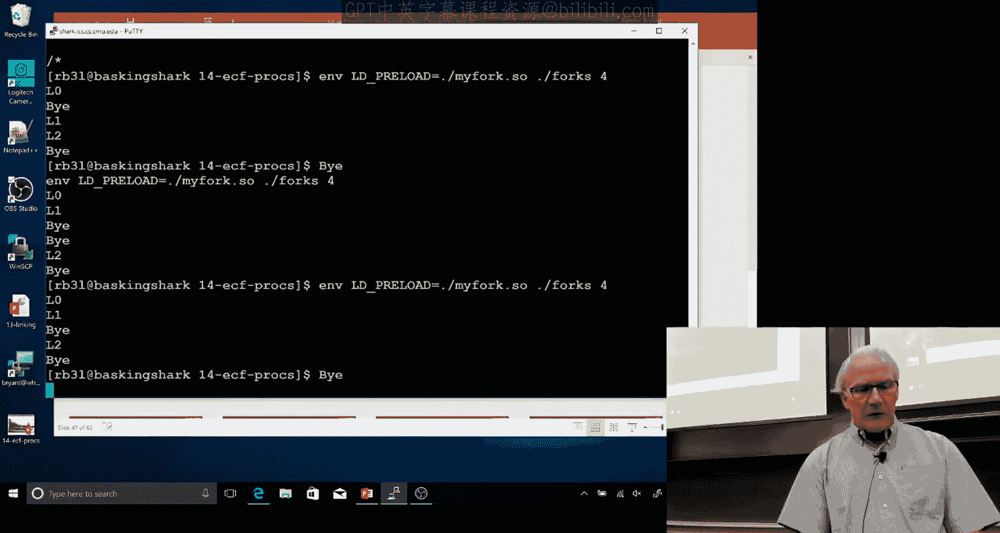

Well， that's what this notation， these process graphs really help。

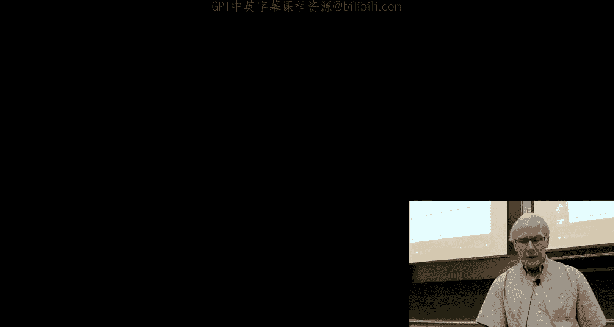

Right， that you can see that the。I call Fork。But the child here。He's going to jump。

Right down to the end。The child。Will。Have a zero value。

 so it will skip this whole outer conditional and say bye。And then the parent。We'll say L1。

And then it will do the same idea again， so overall you can see why there's three buys。

 but just an L0 and L1 and L2。And these buys considered be interspersed。

 the L0 L1 L2 have to occur in that sequence， but the buys can be interspersed in there in various different ways。

And again， you can see we can't have L2 at the end preceded by one of the buys because this buy has to follow the L2。

This is the same idea。Accepted it。Instead of the test being not equal to zero。

 it's equal to zero so any guess on that one？It's only the same thing。

 it's just you're flipping the role of parent and child。So again， it's going to print。

L0 oil 1 L2 in sequence with the buys interspersed in there。And the graph looks different。

But you'll see that it's conceptually really the same graph。

It has a sequential core with these little branches coming off。Okay， so that's the beginning of Fork。

 so let's jump into quiz mode。

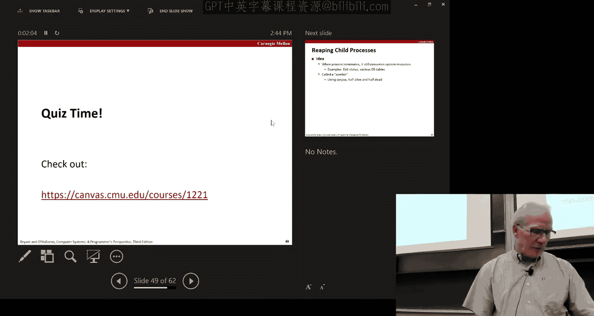

And see what we can do。Or you won't be able to answer the question about weight because we haven't covered that。

What are the cow。Yes， to the first question we haven't actually covered。

Two and three you can do that。嗯。So let's we're running out at time for the quest so we better。好，原告方。

嗯。是。So the。First problem， like I said。Its harder， we haven't talked about this function called weight。

 and we'll talk about that next lecture。嗯。This next one is a tricky problem。And in fact。

 nobody got the answer， right。And I'm not surprised。

It's definitely hard because you see this function calledF and I'm calling it on F of three。😊。

And each time this is the decrement instruction。So it willll call first two of three， then two。

 then one， and then full of zero will jump。2 x。And so you see that it's decmenting the stack pointer by 18。

 which is you know， iss 24。But you also have to remember that the call。

 the concursive calls also push a value on the stack。The return pointer。

 so they're actually also decrementing the stack pointer by eight each time。 So what happens is。

F of three。You get 24 plus four。And then two of two is 24 plus four。3。

So it should be it's called three， two， one， oh yeah。So， it's。对。No。

 I think it's actually- did anyone think it was 96？The official answer is 88。

 but I think it's 96 right Basically， you get three calls。ATo before on the stack before theinate。

So each one is 32， though， not 24， the stack pointer gets decremented， but results weight。

 so I believe you're right。So that one you have to set of trace by hand to believe that that's a pretty tricky question。

 by the way。Okay， and now people， this was a pretty simple fork example。

 as I mentioned this isn't covered in the midterm but。You can see。

There's like an infinite variety of。Exam problems we could make up about forks and what do they print or what do they not print。

 so you can trust that those will be on the final。But most of you correctly realize that it can't print done。

啊。嗯。Twice without printing Canada at some point， so most of you got that correct。

So we'll cover the rest of this material next time。

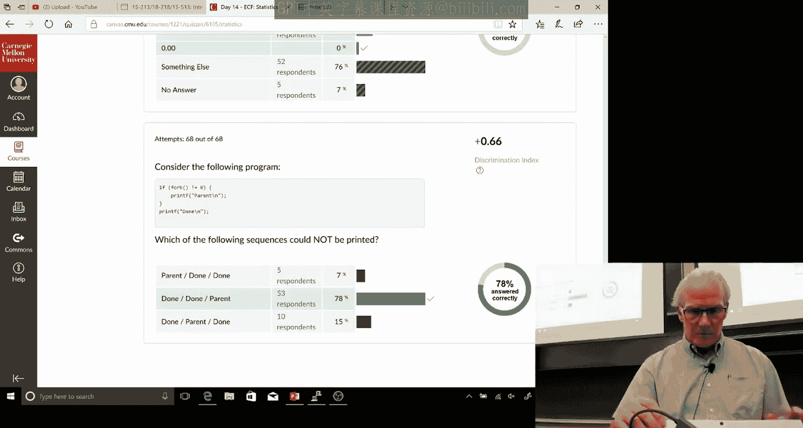

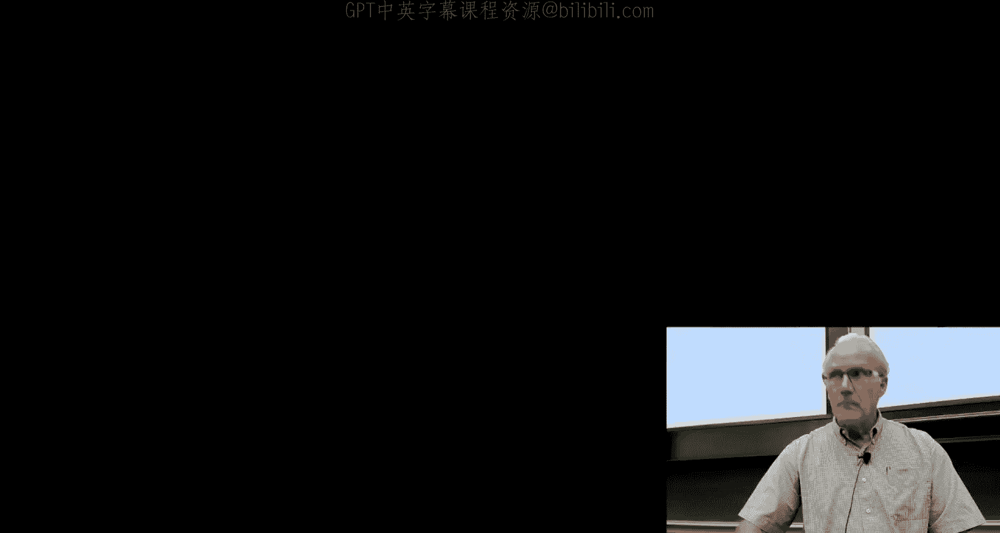