# CMU《计算机系统导论｜CMU 15-213，15-513，14-513 Introduction to Computer Systems 2017 p17 CMU 15-213⧸513 midterm review session： Stack, Cache.zh_en -BV17jcReyETC_p17-

要4年。

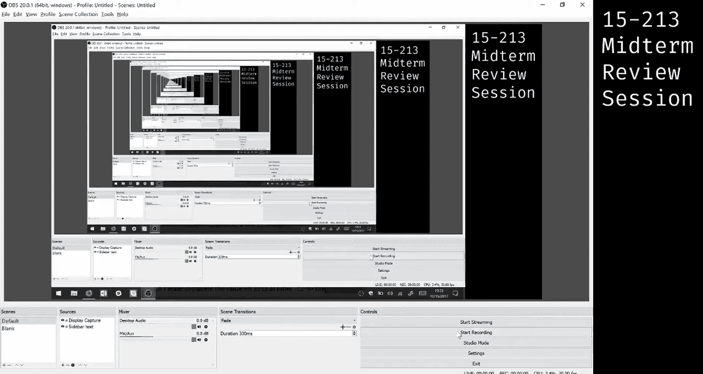

Okay， everyone。We're back in business。まし。你色的。So I guess the server can't handle that many people logged in at the same time。

 don't worry it won't actually be a problem on it when it comes to the exam day。

But for the sake of time， we're going to move on to and also to make sure that we can get a recording。

 we're going to move on to stack。This question right here should be the fourth one on the server if you still have that open。

 but if you don't then。You can go back and access this later or watch this video。

 which we will hopefully be able to post。Or just refresh your practice exam server until you get this question Yeah。

 so that works too if you have a patience to keep refreshing。Just as a clarification。

 every time you start a new practice exam， you are given one of like a couple random questions for each of the categories that we're going to be testing。

 right， the other two stack questions are extremely hard this one is actually easier than the questions that we will probably see on the exam So if you want to sort of get a gauge on how hard the stack questions are going to be。

 which have historically been the hardest questions on the exam somewhere between this one and the really。

 really hard ones on the exam， the other two is probably where it lies。This question。

Is mostly about understanding like pushing values and understanding how call and return work。

 So let's walk through this。Whenever you're given a body of assembly code on the exam。

 you probably don't want to read it right away because most of it or a lot of it might not be relevant until later parts of the question。

So。Let's skip ahead and figure out what the questions are actually trying to ask us。Alright，1， a。

 please complete the value for RP at label L2。 Okay。

 well we look at this assembly and we find label L 2， and we see that it is。😊，Right there。And it's。

 it's right after a sequence of calls， as well as a push here， to pushes there。

 we're also given that L1 has a certain value or sorry， RP has a certain value when we're at L1。

So if we know the value of RSV here。We do two pushes。And we do a bunch of calls。

We should be able to figure out what the value of RSP is there。To understand what's going on。

 it's best to probably step through this assembly line by line。First of all。

 these two don't modify the stack at， right， we're just modifying REX so we can ignore those。

The next line pushes a value onto the stack So going to draw this out here。

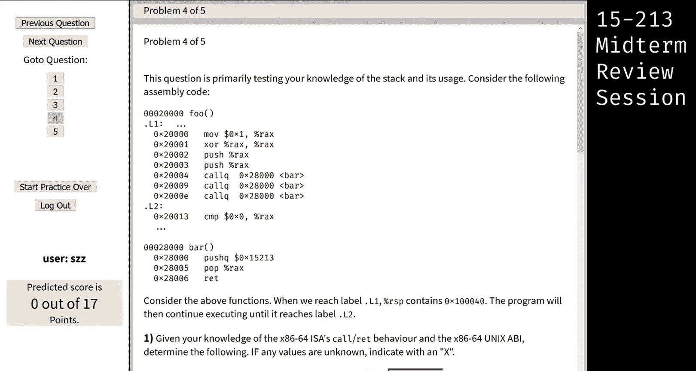

Here is。Our stack。And at this location， this is address0 x，1，0，0，0，40。That was the value at L1。

 Then we pushed RA X onto here。To figure out what the address of that location is。

 we can say R X contains is an 8 by value。 So we're gonna have to make space for it in the stack by decrementing the stack pointer by 8。

 right， So that value-8 gets us to 0 x 1，0，0，0，3，8。Remember these are heethal numbers。

 So that's why we get 38。 We can do another plus。 Okay， same thing happens。Make some space。

Remember the stack rows down， so we end up with this0，3，0。O。Now。

 what you could do at this point is you could say the call instruction will push a return address onto the stack。

 and then it'll go and run this function and it'll come back to this this function that we are here。

But what we can remember is that whenever we call a function。

 we're guaranteed that a couple of the registers that we have are going to be the same。

 In particular， RP is going to be the same after you return from a function call。 So yeah。

 what's the question Should be 100，0，2 to4。2，4。 No， I don't think so， because you decor wait so。

When you push RX， how much does it decrement the address by or the RSP address by So when you push RX。

 we need to decrement the value of RSP。By 8。 And so since this' heademal， yeah， I have to say。

 it's a easy mistake to make。 So please don't make this mistake on your exam。

 Remember when you're looking at hexadecimal versus decimmal numbers， Like。

 it's really easy to get bitten by that。 So just be careful。😊，O。So back to doing this call， right。

 when we do a call。What's going to happen is we are going to like execute some other code。

 But then once that code gives us back control， we are guaranteed that these certain registers have the same values。

 RP being one of them， we know that after all three of these calls。

 RP has the same exact value each time。 So by the time we get to L2。

 RP must have had the same value that it had before all the calls。

 So this saves you the work of tracing out each of these calls to bar right like， okay。

 we could go and tra them out， but we really don't have to and you know。

 it's probably not worth your time on the exam to do so。 So that gives us the answer。

 the value of RP at this point is 10，0，0，3，0。 Yes question。 assume there won't be no attack。 Yes。

 yes， so unless we explicitly say so， like there's no weird attacks or like you know， user input。

 just go with the assumptions that like this is a reasonably nice function unless we say otherwise。😊。

Yeah， so。Great， we've answered the first question， so let's move on to the next question。

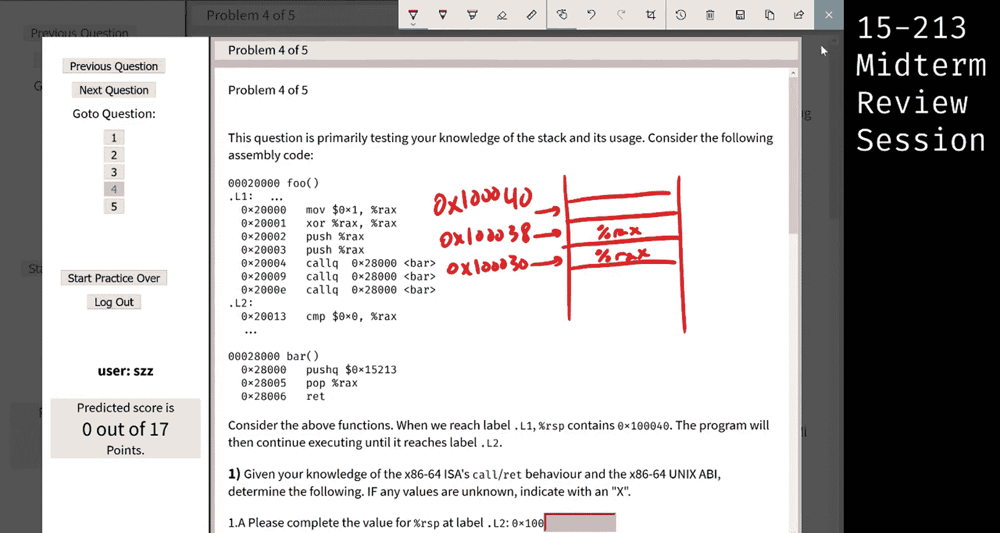

At label L2， what is the value of RAS？O。To figure this out。

 we can see there's a couple of instructions here that modify RA X。

 but since we're concerned with L2， we should sort of work backwards from there， right。At L2。

 R X should be whatever bar returns， right， because we know that RA X contains the return value after you call any functions。

 So we need to this is a hit that we should go and look at bar。 So let's go look at bar。

 If we look at bar， where R A X gets set is inside this instruction， right。

 It pops some value off of the stack。But right before that， we pushed 15 to213 onto the stack。 So。

 you know， with a little basic knowledge about how stacks work， right。

 you're gonna to get the last value you push whenever you pop something off。

 So that means Rx has the value 0 x 15 to13。 So you can see how we sort of traced backwards to get there。

 right we wanted to know the value here。 So we say， okay。

 that means we need to go look and bar And so inside bar。

 we look at the from the bottom and going up， right， If bar were longer。

 we would still want to go from the bottom， right， because that sort of tells us where R X gets set。

 So that's a useful skill to have tracing through assembly functions sort of in a backwards order。😊。

So the answer to this one will be  X15 to 13。 If you mouse over this， unfortunately。

 the answer is like very cryptic。 Like， I don't know what that's supposed to mean。

 but the answer here is supposed to be 0 15 to 13 for this one。O。And finally。

 we are actually almost at the end of the question。

What we want to do is we want to fill out a diagram that shows us all of the values on the stack like we were drawing earlier。

Except this time we actually want the values at those locations。So in order to do so。

We have to come back up here and say， we know the value of RP up here。 and that was this 0x 1，0，04，0。

 That happens to be the first place that， you know。

 we start caring about these addresses and all these addresses are decreasing。

 So we probably care about what all of this， the rest of the function does in terms of a stack。

 So the only way forward from here is just， you know。

 working through the the assembly and filling out this diagram as we go along。

 So I'm actually going to draw a equivalent diagram right here。

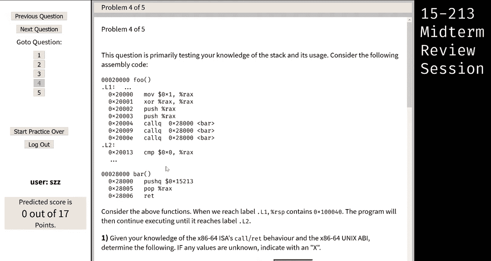

And I'll just abbreviate this location as。0 x，4，0， then3，8，3，0， then 2，8，2，0，1，8，1，0。

 We'll go from there。 And if we need more space， we can fill it in。Great。

 this might be something you might want to do on your scrap paper on the exam。

 right because scrolling back and forth gets a little annoying and you'll have to change these values as you go along。

O。First of all， the if we want to figure out what's at。What's on the stack at this location。

 We don't really have many options for doing that， right， Like， we don't know what， you know。

 what got us here。 We don't know anything about what was executing before this little segment of code before L 1。

 Basically。 So we can pretty safely say that we have no clue what's at 0 x 4，0。

 What's currently on top of the stack。 So we'll just say there's， we don't know what's there。

 It's an X， right。The next value that gets pushed onto the stack is what we're concerned about now。

 So we'll say。That's the next value that gets pushed on the stack after L1， right。

 So we should figure out what the value of R X is by the time we execute this instruction。

 So let's work backwards。Well， right before this， we exploreore R A X with R A X。

 So this is a little sneaky a little bit of bit offs here。

 But if you exploreore one like some register with itself。Then the result is just 0， right。

 to see why this is。Here is like a bit pattern， and then we will exor it with itself。Clearly。

 all of the bits match in all of the locations。 So that means the result of the Xor is just 0，0，0，0。

 And you can extend this for any number of。bits。So。At this point。We are sure that RAX is equal to0。

Which means that the next two values you push， in fact are both going to be 0。So that's a zero。

 that's a zero。So at this point， we've reached this point of executing the program。

 Now we get a function call。 Well whenever you get a function call。

 you should be wary because that is going to manipulate the stack in some way。

 It's very implicit because when you call this function。

 some like stuff happens under the hood to push the return address of this function。

But that means that we need to take care to， you know。

 track that return address and that all that stuff。

 So this first function call will push the return address。

 which is going to be the address of the next instruction onto the stack。

The edge of the next instruction is here， so we know that 0 x20，0，0，9 gets pushed under the stackt。

Not 04， right， because if you push the same address。

 then you'd end up returning to the same place and doing the same instruction over and over again。

Okay。Now we are executing bar and bar pushes 15 to 13。Okay， well， we can add that to our diagram。

It pops that value into R X。 But what's important to remember is when we pop a value off the stack。

 it doesn't go anywhere， right， It still stays on the stack。

 So we can actually be sure that that value is still on the stack even after we pop it off。

 So we don't have to erase anything here。The next thing it does is it returns。

And the way it returns is it pops the return value off the stack。

 The return value that pops off the stack would be the one that we pushed there earlier， right。

 It's a normal program。 So we go to the next one。Okay。

 the next one's a call to bar again so we can just replace the return value that we pushed earlier。

With E。 And you can see that the same thing would happen， right， You push 15 to their chain。

 you pop it off。 You pop their return address。 We get to the next one。

 There's another called the bar。 So when we call this bar this time。

 the return address it pushes is 2，0，0，1，3。And then we push 2 13 again， and then we pop it off。

 and then we return churn。 Okay， so that means that。You know， this stuff is still on the stack。

 right？And then finally， we we've reached L2， which I believe is what the question was asking for in this case。

 So this is pretty much the diagram at this point。 We don't know what any of these values are， right。

 because none of this program ever touched them。 So we。

 we can't be sure of what what those values are at this point in time。

So these are the only values we can predict。We could have saved ourselves some time。 actually。

 we could have said， wait a minute， since each of these calls to bar must like， you know。

 end up using the same stack frame below who stack frame， we can just say。

 let's just you know run bar once and see what happens because it's going to overwrite any values that were there beforehand。

This approach doesn't always work， but it usually works out if especially if you're calling the same function a couple of times。

 you can see here， the only thing that changed each time was that return address。

So try and convince yourself that that that's okay， like， you know。

 you can just reason about that last call to the bar。O。That's actually it for stack question but。

ThisAgain， I'm I'm going to emphasize this。 This is not representative of the difficulty of the stack questions on the exam。

The stack questions on the exam will be harder than this。

If you want to have more practice with the stack questions on the exam。

 then you should go back and try and like generate new practice exams that contain the harder versions of the questions。

 Now those questions will be very， very hard， but if you try and reason through those。

 maybe even like discussing with your friends and trying to reason through those。

 that might be a good way to tackle those problems。

 you will gain a deeper understanding of the stack question category on this upcoming exam。

So I just want to put that caveat out there like don't take this problem as like， oh， you know。

 everything's super easy to stack， so yeah。I think that's it for this question。

 so let's move on to the next one。

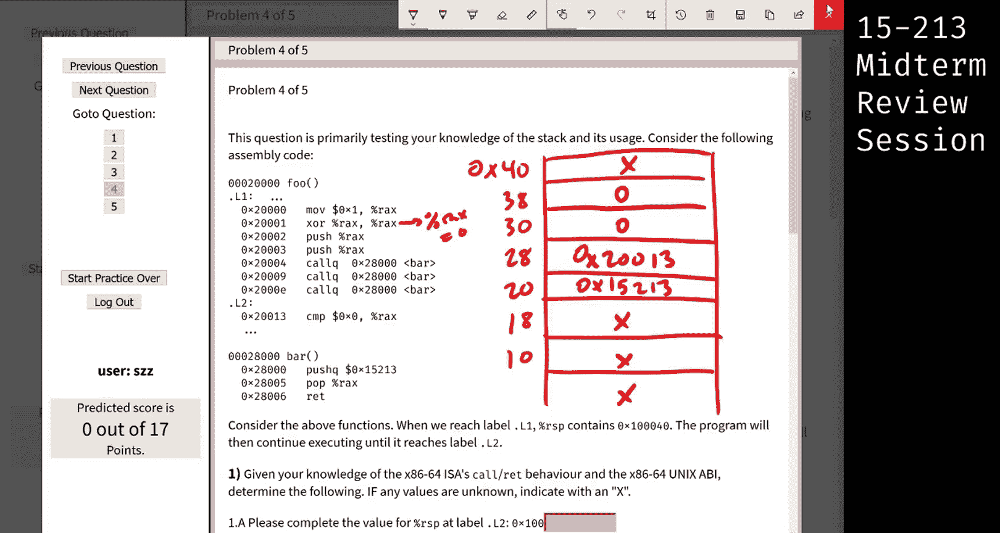

questionests。Oh， yes。Good question。 So I'm actually going to quickly redraw this diagram。

 So we put an x here and then the zeros， right。😊，And that was 0 x，4，0，3，8，3，0。 The question is。

 why do we have an X at the top。And the reason is when we began running this program。

 L1 had the value。Sorry， RP had the value。Blah， blah， blah，40。And whenever we push a new value。

 we are going to first decrement RSP to be from 40 to 38， then store the value there。If we had。

 for example， store the value first， then decrement it， then we would know what the value is at 40。

 But the way that the push instruction works is we first decrement RSP So we go down to here。

 then we store the value inside here。But that just means that we can't actually predict what the value is here because we didn't store anything there yet。

 And none of this code ever stores anything there。So it to answer the question， basically。

 it comes down the fact that push will always decrement first and then store。

 and then pop always reads first and then increments。

 So they have to be like opposite to each other in some sense。So yeah， question。

 So the pop instruction only add add the RSP by8， but not eras the。Exactly。Basically。

 we will grab whatever' is in memory。When we're popping， we're grabbing whatever RSP is playing to。

 putting it in the register that we're popping it into。Then we just increment RP by8。

 We do not touch like we don't write anything to memory whenever we pop。

 The only thing we change are the register values， right。

 we change the value of the register we're popping into， and then we change RP to be incremented by。

 You can think of return as popping into EIP。 the Yeah。

 it's address to the next instruction you should execute。 So conceptually。

 that's exactly what return is doing。 It's just another pop in some sense。

 except the value your popping ends up in in the instruction pointer。Yeah。

 and call is actually like a push， right， call pushes the， the the return address in some sense。

So that's what's going on there。Okay。If that's it， then I'm going to let the next person。

Have a chance of this。So I think we are going to do what want we doing cash， right， okay？嗯ん。

What's up， cool， so we're going to do the cash question。UIt's pretty fun， so let's do this。Alright。

 so how do I get。どしたこだけ。There we go。

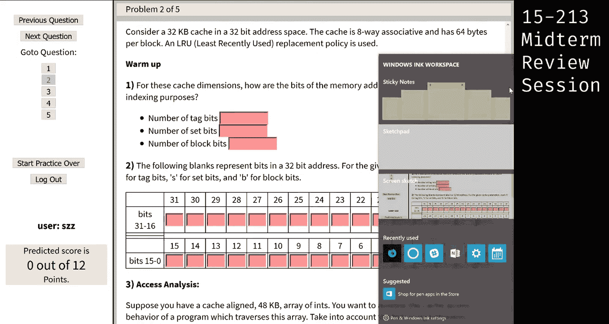

All right。So first question， so first they tell us the size of the cash and then some information about it。

And then they're asking how many tag bits， set bits and like block bits， right， So the first thing。

 like we know are cache size and we know it's8 way associative。

 So we know there's eight lines so we can write that。L equals a。We know the total size is 32。

 and we know there's 64 bytes per block。So you know， the block， 64 bytes。

And to find the last thing we don't know， which is the number of sets， we just use the cache size。

 So we know that the 32。Killowbytes。Equals the number of sets， times the number of lines。

 times the bytes per block。And so。32 is like。Two to the five and the kilobytes is like two to the 10。

And then we're trying to solve for s， we know lines is 8，2 to the three bytes is 2 to the6， 64。

And so we just need like two to the something， the number of sets。

 and if you have your powers of two table on your note sheet。

 it's really easy because now you can do。So you should all do that and this is just six。

So then we also have sets。64 sets。Cool， so now the number of block bits。

 the number of set bits and the number of tag bits isn't these capital versions of the letters。

 It's the lower case version。But since we know our powers of two， it's already really easy， right。

 The number of block bits is just the two to the little B， right， So B。Equals 2 to the little B。

So little B is 6。 So six block bits。 the number of set bits。

 we know there's the number of sets is 64 and the number of set bits is the little S。

 So two to something is 64。 It's also 6。And then there's no like。Thing for tag。

 So the way we figure out how many bits are left over for the tag is we just take the full address or the full like word size。

 So 32 bits。 and we take off the set bits and the block bits。 So it's just 32-6-6 And that is 20。

Cool， that was the whole first part of the question。嗯。Yeah， cool， so the second part。

Is really only testing that you know where the tag bits are。

 where the set bits are and where the block bits are。So if we remember， is this an eraser？Cool。

' just a racing down here。Okay， so we know there's 20 tagbits。Six set bits and six block bits。

 and we know that the order goes tag。Set。Block。So now you just get to type T 20 times。好会为 three几。

You get to type B6 times， oh， that's a B， B， B， B， B， and S six times。This is easy。う。Yeah。

 do you have a question？Oh， but it's not that。嗯。And so the the like reasoning behind tag set and then block。

 right is if we're working with something like a one way Associative cash。

 right like direct map when you sort of，Run out of the block， right。

 you increment the address past the block， then you still want your like whatever you're accessing your data to fit in the cache。

 right， so we can't put tag。 We can't reverse these。Like conceptually。

 because then it would start overriding the data， like evicting the data that was already in the cache。

 So we put it in a different set。 So it always goes， tag， set， block。

 memorize that or put it on your note sheet。

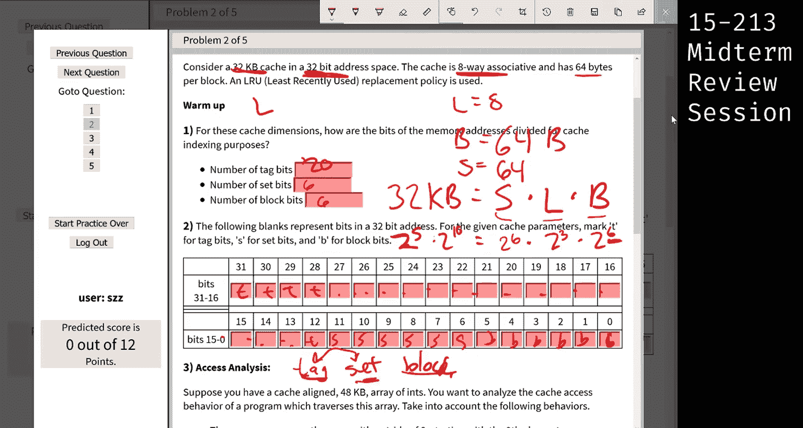

Cool。Now。We get to do some fun stuff。So。

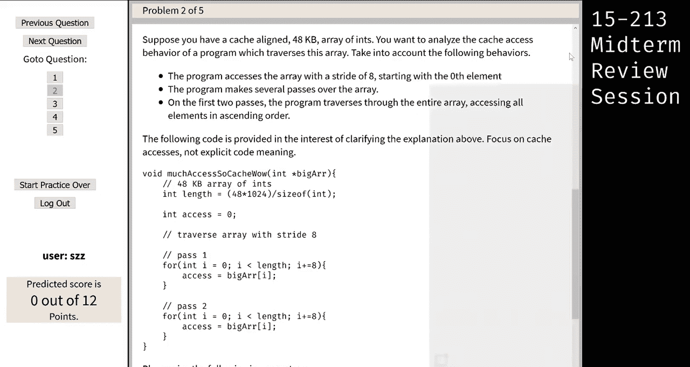

不许。Yeah。

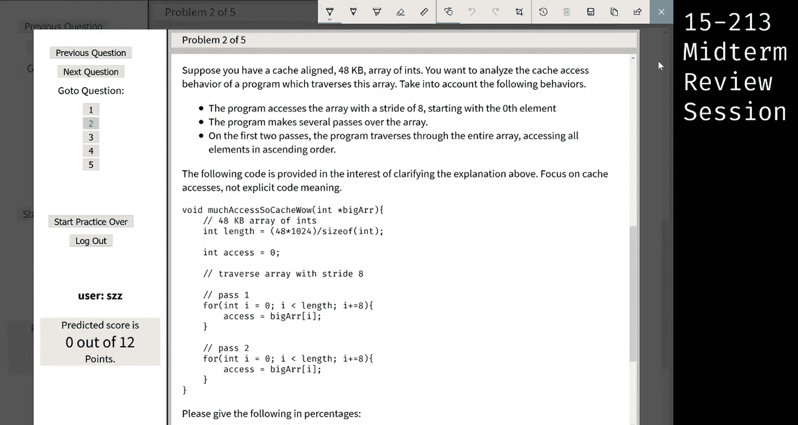

Yeah， okay， so。

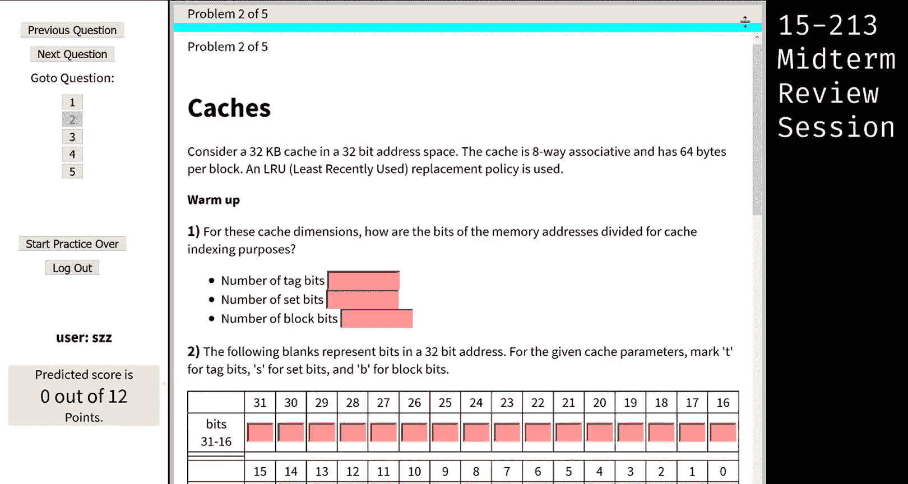

W是。So we know it's a 32 kilobyte。32 kilobyte cash， and so 32 is2 to the five。

 and then a kilobyte is2 to the 10。So that's just like bytes。

 that's the total size of cache and if you do it like that and you have your powers of two table。

 then you don't have to like divide and stuff because you don't get a calculator so it's just easier to work it out。

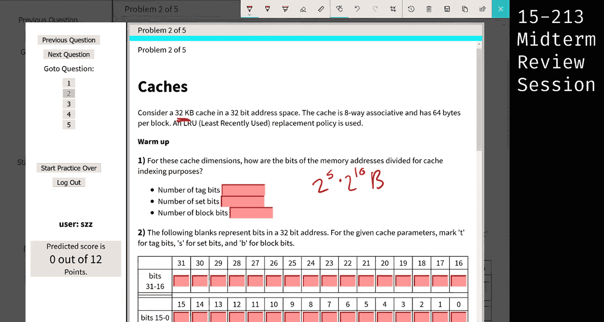

Cool。K。Sir。So the questions that we're going to have to answer are what are the mis rate on the first pass and the second pass。

 I'm just going to scroll up so we can see the whole question。

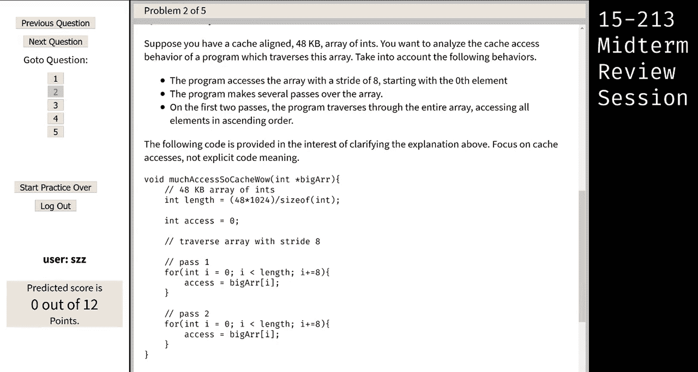

All right。Cool， so now we get this giant array of integers， 48 kilobytes。

And we're going to figure out the misrate of this little section of code and then this little section of code。

So what's going on， it's like reading like array， so big array like at zero。

And then it's going to like add eight， so it's going to be a at like eight。

And it's going to keep doing that till the end of the array。

 And so we're trying to figure out when it's missing， when it's hitting， right。

 So it's going to be useful to draw a sketch， at least of the cache。

 And so it's the same cache from before。 So we already know everything about it， right？

 There's 64 sets。So I'm not gonna write all 64。But like there's more sets。

And then we know there's eight lines。So。Like a couple lines。And then我。

There's a lot more And now we're just going to see like with our accesses so a at zero and we're going to see what happens So a at0 maps into you just set0 and line whatever we'll just assume zero because the whole array is cache aligned So we have a at zero here。

And we know the block size is 64 bytes。Right，64。Can I close this and scroll back over now。

We all keep。It's 64 bytes。So。😊，we need to like figure out what how many of these integers got mapped in like or got pulled in for free and so we can like hit right？

64 bys in a block。Does everyone remember the size of an integer？If you didn't remember。

 put it on your notehe， so four bytes。And this is like two to the six and like two to the two。

 so we get like two to the four。Two to the four。Is 16 see。

 I would need the powers of two on my note sheet anyways， so it's 16 ins。😊，Fit in a block。

And we're going like a088。Because we're adding eight right here。And right here。So。

We know this goes to like 15 because or 16 ins fit in that block。So if we miss at a0。Will hit at A8。

Does that make sense because it's already been pulled in for free。

What's the next thing we're going to try and access？Yeah， and we're going to miss。

But where does it get pulled in？Right into set one， because remember， when you exhaust the block。

 you increment the set， right so。A 16 starts here and it goes to like 31。So then like a31。I mean。

 A24。16 plus eight will be a hit。Because we've got it pulled in for free when we missed on A16。

And you could keep drawing lines， it's like 64 times。

 but it looks like at least for this first like initial part of the array。

 we're going to miss 50% of the time， right？Eventually we're going to run out of sets and so the next thing is going to go here。

 right in the next line。When that happens， we'll still put 16 ins into this block。So we'll still。

 and since we're stepping by eight， we'll still miss once and then hit once。

So that's 50% of the time。So that happens when we like go down this whole first line in the sets。

The whole second line。 And then we'll like do it a couple times， but at some point。

After we access 32 kilobytes worth of integers。We've filled the cache with our array。

But the array is 48 kilobytes， so there's like still a lot we have to look at So when we're like when we filled the cache。

 we've looked at 32 kilobytes of stuff。The next thing we look at is going to be a miss and we're going to have to evict something from the cash because it just won't fit。

So we're going to evict the least recently used thing。It said that at the top of the problem。U。

So what's least recently used up here？Yeah， the first thing we accessed。

 So this first thing is going to get is going to get evicted whenever we after like 32 kilobytes of integers。

 right？And then like in the same fashion， we're going to evict everything in this first line。

 and it will be something new。And then in the same way， we'll evict everything in the second line。

 and it will be something new。And this whole time we're missing to get the whole block in。

 so we're missing at like this multiple of eight， and then the next thing will hit at right because 16 ins fit in the block。

So at least for the first pass。All 48 kilobys were missing 50% of the time。

And we're hitting the other 50%。Does that make sense， yeah。Yeah。

 because we're only looking at the array once。A miss is the same as a miss and eviction is the same as a miss。

 right？Yeah。どさしこ。So at the very beginning of the problem， it said blocks are 64 bytes。

 I would scroll up to show you， but I would lose all this beautiful drawing。哦。Any other questions？

Okay， cool， so for the first pass。We miss 50% of the time。But we're not done。There's a second pass。

And now it gets really interesting， right， because the cache is already filled with some cool stuff。

So let's figure out what the miss is going to be this second pass through so right now with this like pseudo cash arrow thing。

The place we left off was like right here， so the least recently used thing is up here and this is the beginning。

Do you guys want me to redraw that or just keep going with this drawing？Keep going， okay。Cool， so。

We're going to do this whole array again， so we're going to access a0 again， right？

And when we access a0。Is it in the cash anymore？Right， so we're going to miss。

When we access a at eight， we just pulled it into the cache。

 we evicted something else and pulled it into the cache， so we're going to hit。

And if this is the line or the like。Set of lines that we're looking at。

 we're going to end up evicting some other part of this array wherever we left off after the first pass because it's least recently used and we're going to override it with this beginning stuff。

 the stuff that used to be over here， right？And then we're going to keep going all the way down the cache。

 evicting older stuff and filling in with this newer stuff。

And eventually we'll hit the end of the cache。And we'll start evicting in this set of lines again。

So the whole time we're missing。At one thing， and then since the block holds 16 bytes or 16 ins。

 we're hitting at the next inch。So even though this cap has already populated with stuff from our array。

 because of our access pattern， we're still missing 50% of the time on this second pass。

Does that make sense？Cool， if this array had been only 32 kilobys or less。

 then the whole array would have been pulled in， and we wouldn't have evicted the least recently used stuff in our first pass。

 So our hit rate or our miss rate， the second pass would have been0 because the whole array would have been pulled in。

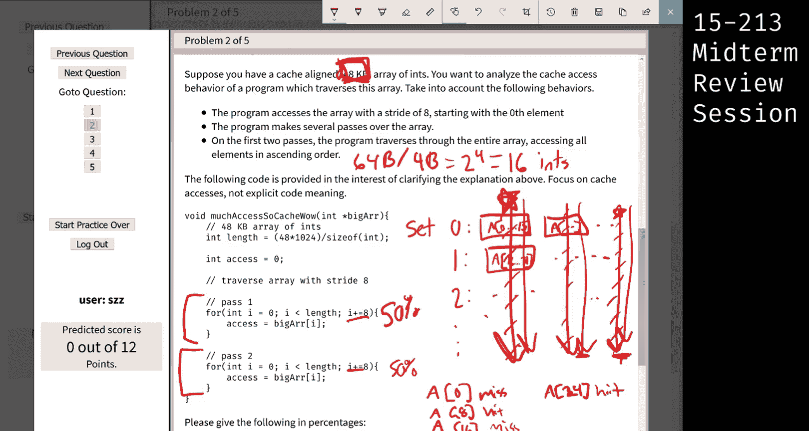

Cool。That was a cash question。 You made it。And you got the right answers the whole time too really awesome so we're going to move on to the next question before we do this we're going to take this quick two or three minute break just to make sure the recordings all right Yeah so feel free to hang around here for a little bit we'll be right back Thank you great。

😊。

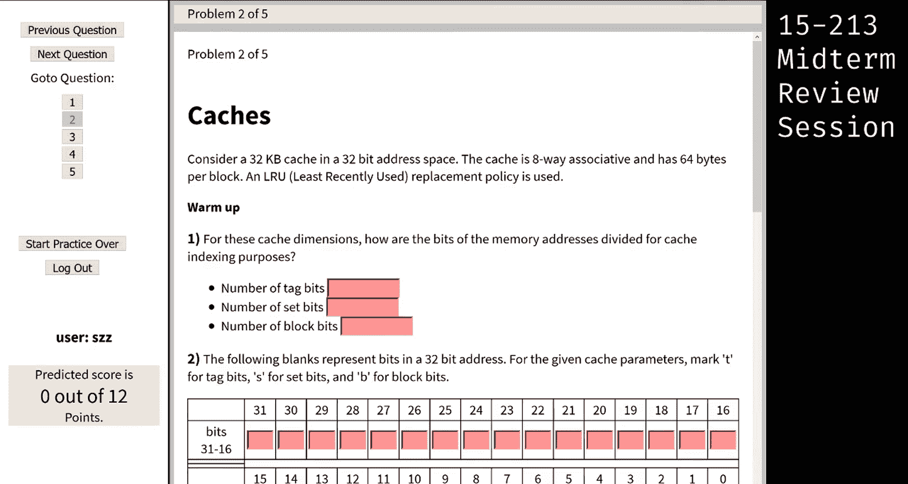

可以。あ。

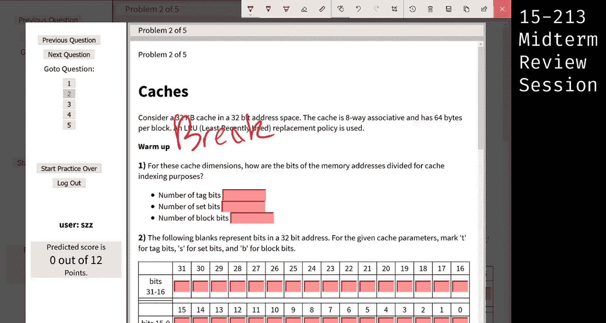

少。