# CMU《计算机系统导论｜CMU 15-213，15-513，14-513 Introduction to Computer Systems 2017 p18 CMU 15-213⧸513 midterm review session： Floating Point.zh_en -BV17jcReyETC_p18-

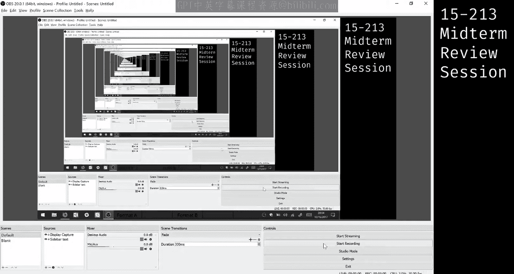

Okay。Yeah， so floating point， this is like a very typical question that you're going to see so if you don't make sure you understand this。

 this is kind of important for floating points so okay you're given。Two formats， A and B。

 and we're using the IE floating point representation that you guys saw in lecture。First。

 what you want to do is like。Look at each format very carefully and like make sure you have all the formulas for floating point in your on your note sheet so let's。

Okay， yeah， there we go all right， so let's just actually jump right in and start with the first thing so you have。

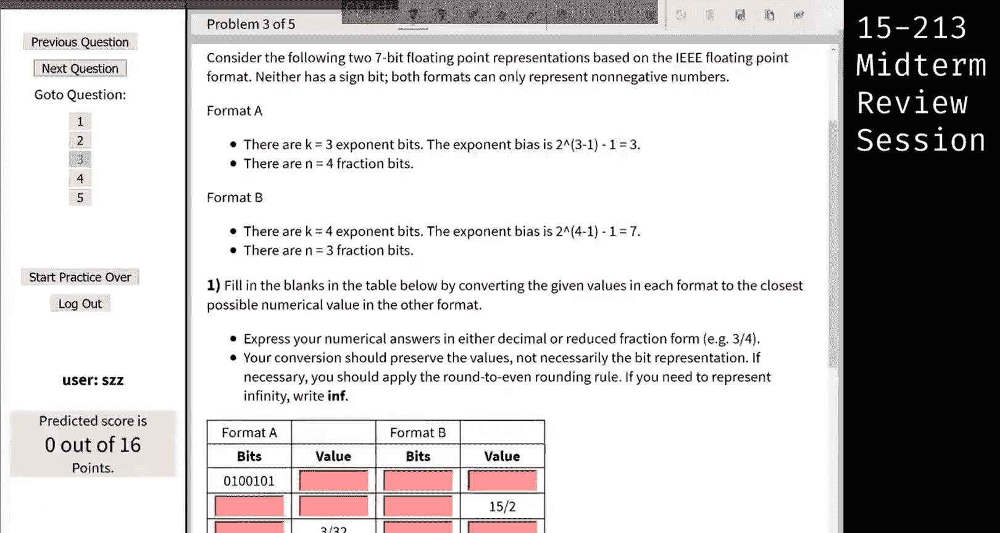

This format， and it says that I have three exponent bits in format A and four fractional bits， right。

What I'm going to do is I'm just going to divide this bit value that way， so I'm going to get for a。

I'm going to get 0，1，0 as my x and 01，01 as my frac。So to convert this into a value， right。

 remember from your formula， it's。M times2 to the power of big E。And M is。

M is one point and then your frac bits。If it's a normalized number。

 so now we see that the expent bits are non zero， so we know it's not normalized and so we're going to have that implied one in our frac。

So let's just convert this into our exponent first。So here。Ex。Minus bias equals e。

Another thing you should have on your note sheet and so you're going to get e equals we give you the bias。

 so that's three right and x plus0 and two the0，201， so2 minus3 which is going to give you negative1。

Right， cool。And then we look at these fracrack bits over here and we have。

Our integer ready value equals 1。0101 times 2 to the negative1。

And that gives you back the same thing so you can see it works out。

 but if you just want to calculate this up， you get。So zero， one half， a quarter。

 an eighth and a 16th， and when you move one down。下说。So。3。10101。And you get。A half and8。

And one over 32， so that's going to be 32， 16 plus 4 plus1， and so that's going to be 21 over 32。

Questions。All right， cool。There is a value in format A。Okay， so now one thing to note here is。

Our conversion should preserve the values and not the big pattern， and so given 21 over 32。

We want to find out what the bits that matches to in format B。So here's a little。Handy fit pattern。

Again。Right， and so now we have。Four exponent bits and three fractional bits。And so straight up。

 you can get。The last three to be a fractional bits。

 and so if I were to write this as a normalized number again， I would write 1。0101。Times2 os。

Times 2 to the negative one。And E， again， is negative one。

 So my x by this formula is going to equal E plus bias。

And that's going to be negative one plus our new bias， which is seven。And so， you get。

Positive six as your x。Cool， okay， so now I can write my positive6 as。😊，0ero one a。01，10。

 be careful with the binary numbers， and that's my new x value， right？😊，Cool， so。

And then for your frac bits， you're going to take， so notice there are four frac bits here， right。

 and we only have space for three。So here we're going to have to use rounding to even and so if is there a question？

できま。I did。 That's okay。 Alright，0，1，1，0。 There we go， okay。Yeah， so again。

 we have three frac bits available and this is four bits， so we're going to round to even。

And so we to round to even check the number before you and that's a zero right and so that's we want to round to even and that's going to be an even number so we just ignore this last one and we get010。

As a brick pattern。Questions。Okay， cool， yeah， so。And now we just have to like do this thing again and convert back to our decimal value and so。

Good。Because we got rid of the last fractional bits， that's our value now。

And so you can just convert again， and yet。So。This will become 0，10。1010， and that's a half plus。

And8， and that will give you。58s， and so the value here is 58。Questions。

So like the important point is these two valuess are going to be different depending on your format。

Cool， okay。And like， we can keep doing this and。Do the other part of the question， too。So。喂。

There's this little button a little trash me。エクス。Okay， so oh okay， I can't scroll down， that's fine。

😊，But yeah， so again， 15 by two now it's in format B and you can kind of see this is like going to be the same way。

So 15 over two， if it's easier， I like to write it in decimal， so I'm going to write it as 7。5。

 and if you convert that to binary， I'm going to get 011。1。

And then you want to write it in terms of the exponent。 So 1。111 times 2 to the power of。2， yes， yes。

 Okay， cool so。Again， you can calculate the x field by doing。

 so here's your formula again E equals x minus bias， and so x was e plus bias E here is2。

 So2 plus format B。Our bias is 7。 So 7。 And that's going to give you a 9。 And so I can。Right， my。

Bit pattern again，1，0，0，1。For the exponent。Okay， and then。

It's pretty easy now we only have three fragments， so those are going to be the next three ones。Co。

Okay。Okay。And so now you have to do the same thing， but now for format a and so again。

 our bit pattern is 111。1 can write that as 1。111 times 2 the pattern of 2 Now exp bits are again changed because our bias has changed so you're going to have E so2 plus our new bias which is。

3 over there。So three that gives you five。And so。Our bit oh， our bit value here is going be。

So we have always made good。One，01， that's a one。And then we have three fragment bits。

 we have space for four， so it's just going to be 11，10。Cool， okay。

 and then you can convert back to the decimal value using the same penologicic as before。So。

Looking at this number you're going to get。One half。 and that's going to be7。

So we can actually fit it in， so it's going to be the same thing as 15 over two。Questions。그럼。Yeah。

He's going to go。So， yeah。你那个好。So like when you write out your number。

And like so it depends on what you're given if you're just giving the bit representation。

 like in the first part， then you can just look at the exponent bits and if it's a D norm number it's going to be all zeros so that's just how we define deormalize numbers。

Dor， the x field is zero， this one， but if you're given the value。

 then you have to figure out in this notation what the capital is。And then you can look at apps X N。

 if that's0。喂你。So if you write it so regardless of how you write it。

 it's not like so this this representation is not the floating point bit representation。

 this is just how I'm representing how I represent a binary number right so even in this case when I write it like like these two numbers are equivalent right？

2 to the so 0111。1 is the same as 1。111 times 2 to the power of 2 right and so here I get2 as my capital E and so when I substitute that in into this formula I get my x as 5。

 which is non equal to 0。我来你分。그。Srup。Right， but like you're going to still get some value here。

 right， So if you read this， so then it's going to be。To the power of three。

And so you're going to get three plus three， which is going to be six。So that's still not zero。

In order for it to be a deormalized number， x has to be0。날。Or well， if it's negative。

 it's infinitefin， that's the last question。So we'll actually see an example of that for the third line。

So let me just grow it down a bit。

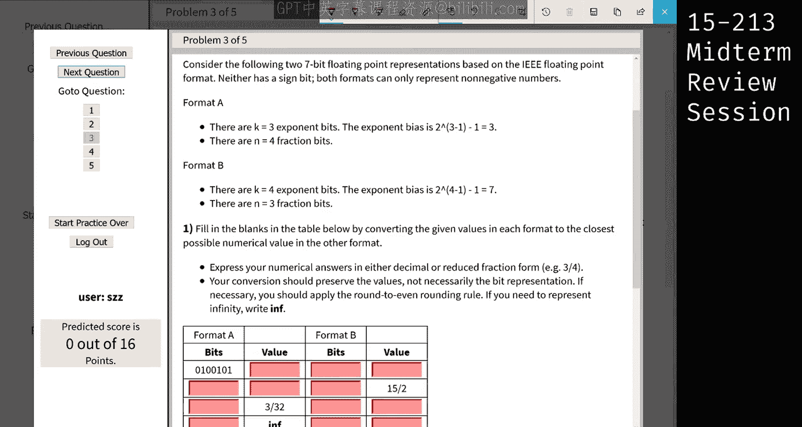

二。エックス？Okay。So。Let's go back in。Com up。

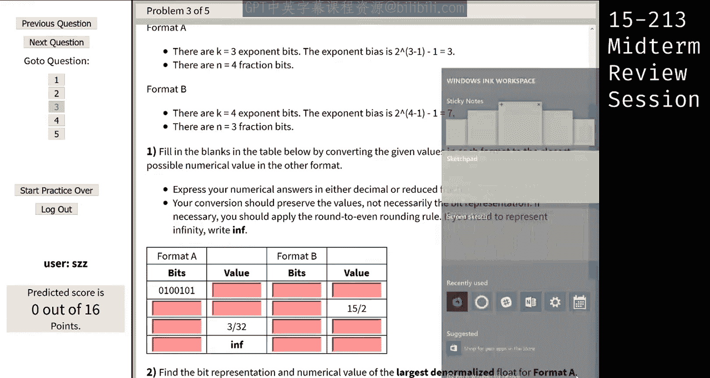

Alright， so for the third line， we actually see that we have three over 32。

And this kind of numbers do have a chance of being in in deormalized form because it's very close to 0。

 right， So how do you then figure out whether you should use normalized form or de normalizedmalized form to represent it。

 So one way to think about it is what is the smallest， normalized value that can be represented。

 So for format A， in order for it to be the smallest。Normalize value。 Our exponent has to be 0，0，1。

Right？Which is one。 And therefore， E。Would be。嗯。1 minus the bias。Will be， which would be negative to。

 right， therefore。Our 2 E would be one over two square。So one quarter。Right。

 so let's ask ourselves whether we can find something of the form  one quarter times something that the mentesa is to give us 3 over 32。

 Now， we know that normalized numbers have a leading 1 bit。😊，Right， so question we ask ourselves is。

 can we get one quarter times something to give us 3 over 32 Now， in this case。

 we know that anything multiplied by one。 something is bigger than one quarter。

 And we already know that one quarter is larger than three over 32。 So in this case。

 we know that we cannot possibly represent this in normalized form。😊，Alright。

 so let's look at how were gonna do it in denormalized form。 So for denormalize form。

We know that our exponent must be zero。And our E。It's a special case。 instead of E XP minus bias。

 we get one minus bias instead。So that would be negative too。Alright， so likewise2 over e。

 like we've seen before is one quarter， so let's find something that is one quarter times0 point something to give us3 over 32。

Alright， so in this case， we know that we can definitely find something that gives us 3 over 32。

 So we know that one quarter is。😊，エオバリトゥそイノですエ。That do。

RightSo with just some simple fraction manipulation， we know that to get this， we have to。Do ，38。

Can everyone see that？Okay。Alright， so then it gets easy， right， So we just need to represent 3。

8 in the mantia format。 So 3，8 is just gonna be a quarter plus and 8。So， Mantia is gonna be。

So the half， the half position is going to be 0。1 quarterta is 1， and1，8 is 1。Right。

 and in this case， our mentia is four fractional bits。 So we have a0 at the end。😊，Alright。

 so we can now fill it in。 So for exponent bits， we have all zeros。😊，And then for Manissa， we have 0。

 one，1，0。Okay。😊，All right。So now let's try to do the same thing with format B。 So format B。

 we want to get 3 over 32 again。 So we can do the same test。

 So what is the smallest normalized fraction normalized number that we can represent。

 So that would be when E is equals。 Sorry， when E X P is equals to 0，0，0，1。 Therefore， E would be1-7。

😊，equalコs negative 6。So we know2 e is going to be 1 over 2 to the path of 6 equals 1 over 64。

 so1 over 64。Times1 point something。Equals to 3 over 32。 Now， in this case。

 would we be able to find something that can fulfill this equation。RightIn this case， it is。

 it is possible， right， because one over 64 is smaller than 3 over 32。Right。

 so we definitely have to use normalized numbers to represent that。 right。

 So that's that also answers your question just now on how to decide。

 So when you actually write it out like that， you can easily figure it whether it's denormalized or normalizedized。

Alright， so let's try to find the normalized value for this。 I don't have enough space。 Okay。

 let me just go up here。Okay。So we have one over 64。 We want to get3 over 32。

 So we know that3 over 32 is going to be like 6。😊，6 over 64。 right， So definitely our number here。😊。

Has to be a bigger number。 Sorry， I mean， this entire fraction has to be a bigger number。

 So bigger number time something should give us 3 over 32。

 So let's see if we use one over 32 on that side。Alright， we still need a value of three over here。

We still need this to be3 to be equals 3 over 32， and we know that our mentia cannot possibly represent3。

Right， so how about one over 16。嗯。So one over extend。Can we find something to fit in here？Right。

 so one over 16 in this case， we know that one over 16 is true over 32。 So if we just multiply by 1。

5， that gives us3 over 32。Right， so now that we know that our mentisa has to form 1。5， we just。

 we know that our M must be。I mean， we get the leading one bit， right， So the M must be 1，0，0。Okay。

 so therefore in this case， it would just be our E was 0，0，0，0。1。0。0。Okay。why。嗯。Did I get it wrong。

1 point。2年。Oh yeah。Shouldll be 0，0，0，1，1，0。Okay。I think the。Just。a， I got just mixed up with。

I got this mix up the previous one， right， So this is supposed to normalized value。

 So we wanted to get one over 16。 right， So therefore， I know my E must be4。must be negative four。

So if E is negative 4。Therefore， we know that our EXP must be negative4 plus 7。Right， so it's tree。

Right， so therefore， they should be 0，0，1，1。1，0，0。All， sorry about that。Okay， the next question。

 we are trying to get infinite。 So this is actually pretty easy。 So for format a。

 we know that infinite is， it just means that all of your exponent bits are one。😊。

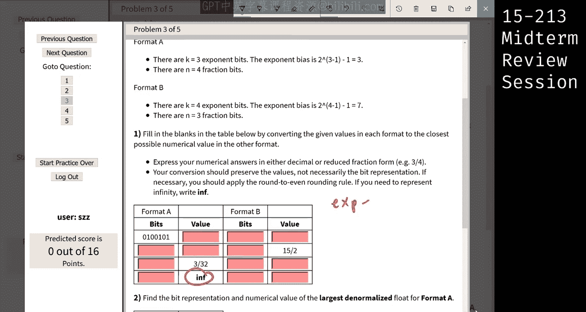

嗯。

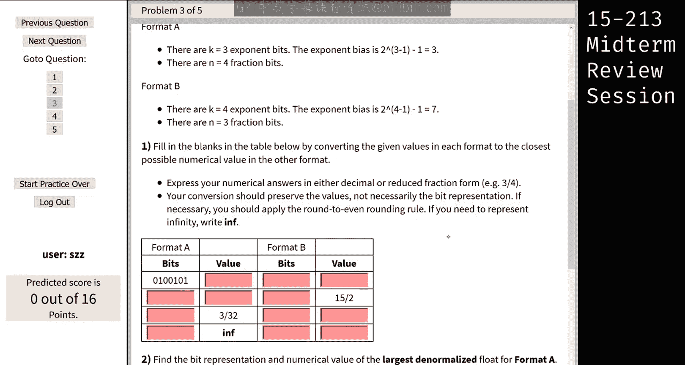

Right， we just know there are exponent bits there are all going to be ones。

And our mentisa bits is going be all zeros。Okay， so we just fill that up accordingly。

 So there are three。Exponent bits。So it's going to be 1，1，1，0，0，0，0。

 and this for this one is going to be 1，1，1，1，0，0，0。And the value in the DSL question。Yes。Okay。

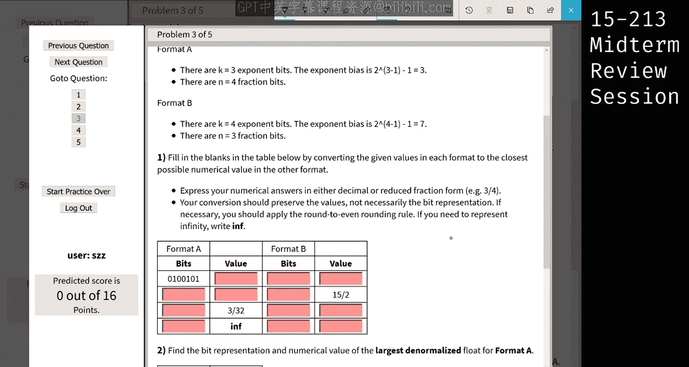

So let's move on to the next part。

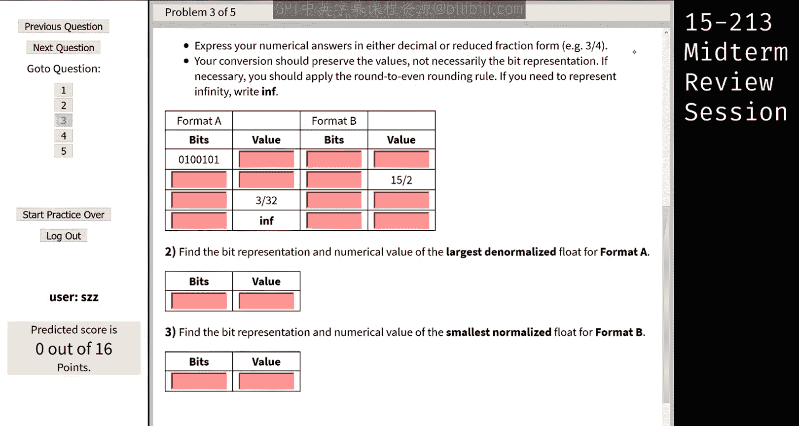

Alright， so in this case， they're trying to find the largest deormalized value I assume is similar to what we've done in the the previous part as well。

 So for format A， if you want to get the largest deormalized value。

 exponent bits should definitely be 0，0，0。😊，Right， and because we want the largest value。

 let's have our mentica to be all once， because every single bit increments that the value of the float。

 So let's just have all one。3，4， Yes， correct。 So the value of this， right。

 we're just working out the same way。 We know that for normalized numbers。

 the E is gonna be1 minus bias。 So it's negative 2。 So we know that 2 E。It's going to be one over 4。

Right so。For the me part of it， we have 1。1111。Right， so what is this equivalent to。

 This is equivalent to one plus。Oh， sorry， this should be 0。Al。

 so this should be half plus a quarter plus an8 plus a 16。And that is 8 plus4 plus2 plus one over 16。

And to get the full number， we need one quarter。Multipliied by this。And therefore。

 it's just going to be， I think the top is going to be 15 and the bottom is going to be 64。All right。

 so this here is 15 over 64。And the bits， we have it here。All right。Any questions for this part？Okay。

So for the last time， we need the smallest， normalized float。

 So if we want the smallest normalized value， exponent must definitely be one， right。

 because any smaller than that， and we will go into the deormalized numbers。 Okay。

 and then if we wanted the small， smallest value， we know that the mentia should all be 0。😊，Okay。

 and let's figure out what is the value for this。 So in this case， E。Is equals to 1 minus。7even。

Right， so it's going to be negative 6， therefore2 e is going to be one over two to the6。1 it was 64。

And when we look at the mentia bits， mentia is just the three zeros， right， just this part。

We're going to multiply that。啊。This with all zeros， but we know that we have the leading one。

 So it's a small type 1。000， and that would just give us one over 64。Right， so this will be 0，0，0，1。

0，0，0。All right， and questions。Okay， we have one last question coming up。

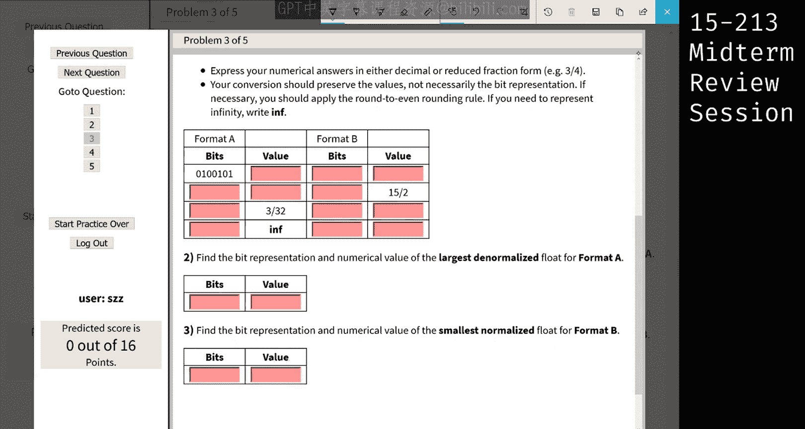

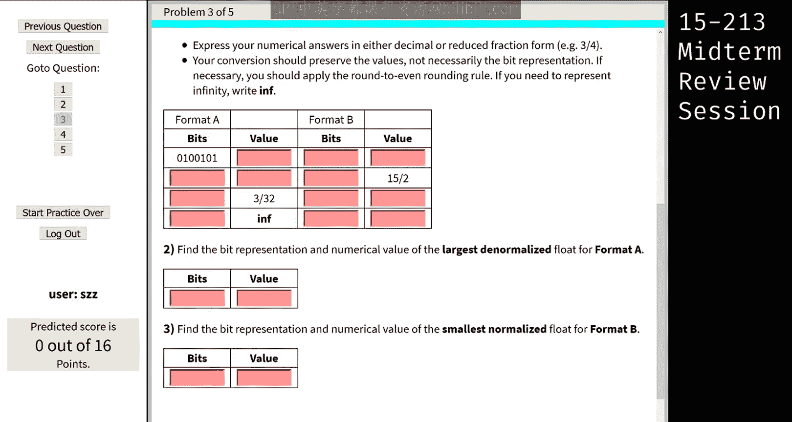

So every year students。Yeah。All right so while Stan is doing that。

 I'll keep going so every year we get students that look an assembly and ask us， oh。

 I don't know how to approach this， how do I solve it， can you tell me how to do it？

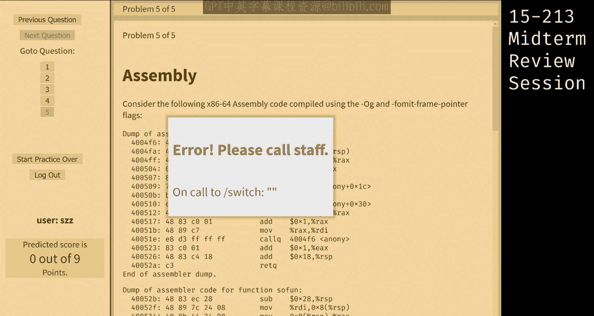