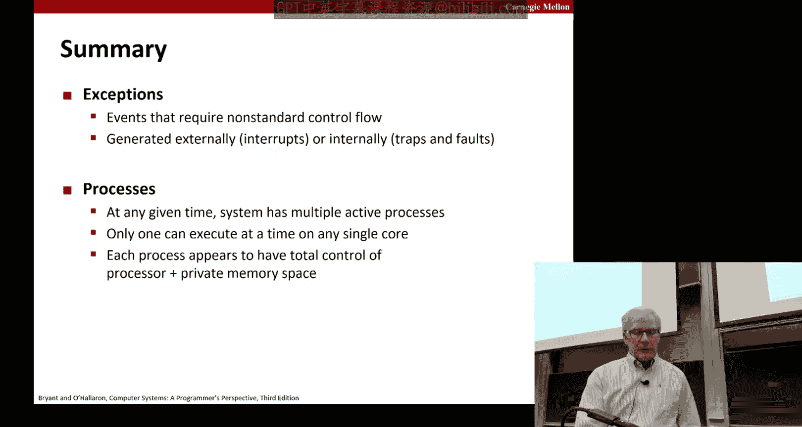
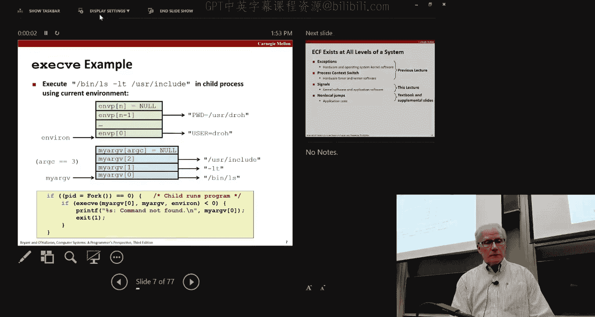

# 计算机系统导论：第20讲：异常控制流：信号与非本地跳转


在本节课中，我们将学习操作系统如何管理进程间的通信和异常处理，特别是通过“信号”这一机制。我们将探讨信号的发送、接收和处理方式，以及如何利用信号处理程序来管理进程，例如避免僵尸进程。此外，我们也会简要提及“非本地跳转”的概念。

## 进程管理与信号概述

上一节我们介绍了进程的创建（`fork`）和程序执行（`exec`）。本节中，我们来看看进程如何通过“信号”进行异步通信和处理异常事件。

信号是操作系统内核向进程传递信息的一种方式，用于通知进程发生了某个事件。例如，当你在终端按下 `Ctrl+C` 时，会向当前前台进程发送一个 `SIGINT`（中断）信号。

## 信号的发送与接收

信号可以由内核、其他进程或进程自身发送。每个信号都有一个唯一的整数标识符（如 `SIGINT` 对应 2）。进程可以“阻塞”某些信号，暂时不接收它们。

以下是发送信号的常见方式：
*   **来自内核**：例如，硬件异常（如除零错误）会触发 `SIGFPE` 信号。
*   **来自其他进程**：使用 `kill` 函数或命令。`kill` 不仅可以终止进程，还可以发送任何类型的信号。
*   **来自自身**：进程可以调用 `kill` 函数给自己发送信号。







当一个信号被发送给目标进程时，它被标记为“待处理”。内核会在目标进程从内核模式切换回用户模式时（例如，在系统调用返回或定时器中断后），检查并传递这些待处理的信号。

## 信号处理程序

进程可以为大多数信号指定一个“信号处理程序”——即当该信号到达时，内核应跳转执行的一段特定函数代码。这允许程序自定义对事件的处理方式，而不是简单地执行默认操作（如终止）。

信号处理程序是进程代码的一部分，它与主程序共享相同的地址空间和全局变量。这意味着处理程序必须小心地访问和修改全局数据。

以下是如何安装一个简单的 `SIGINT` 信号处理程序的示例代码框架：
```c
#include <signal.h>
#include <stdio.h>
#include <stdlib.h>

void sigint_handler(int sig) {
    // 自定义处理逻辑，例如打印信息后退出
    printf("Caught SIGINT! Exiting.\n");
    exit(0);
}

int main() {
    // 将 sigint_handler 函数注册为 SIGINT 信号的处理程序
    if (signal(SIGINT, sigint_handler) == SIG_ERR) {
        perror("signal error");
        exit(1);
    }

    // 主程序循环
    while(1) {
        // 程序正常执行...
    }
    return 0;
}
```

## 编写安全信号处理程序的准则

由于信号处理程序会异步中断主程序的执行，编写它们需要格外小心，以避免竞态条件和不可预测的行为。

以下是编写信号处理程序的一些重要准则：
*   **保持处理程序简单**：最好只设置一个全局标志，然后返回，让主程序周期性地检查并处理该标志。
*   **只调用异步信号安全的函数**：许多常见的库函数（如 `printf`, `malloc`）在信号处理程序中调用是不安全的。应使用手册中明确标记为“async-signal-safe”的函数。
*   **保存和恢复 `errno`**：在进入处理程序时保存全局变量 `errno` 的值，并在返回前恢复，以免干扰主程序的错误检查。
*   **使用 `volatile` 声明全局标志**：这告诉编译器不要优化掉对该变量的读写，确保主程序能看到处理程序所做的修改。
*   **使用 `sig_atomic_t` 类型**：对于仅由处理程序设置、由主程序读取的简单标志，可以声明为 `volatile sig_atomic_t` 类型，以保证其读写在现代系统上是原子的。

## 信号处理的应用：避免僵尸进程

在进程管理中，一个常见问题是“僵尸进程”——即已经终止但尚未被父进程“回收”的子进程。如果父进程长期运行（如服务器）并不断创建子进程而不回收，系统资源会被逐渐耗尽。

解决方法是让父进程为 `SIGCHLD` 信号安装一个处理程序。当子进程终止时，内核会向父进程发送 `SIGCHLD` 信号。在处理程序中，父进程可以调用 `wait` 或 `waitpid` 来回收子进程。

需要注意的关键点是：**信号不会排队**。如果多个子进程几乎同时终止，可能只产生一个 `SIGCHLD` 信号。因此，处理程序必须循环调用 `waitpid`（使用 `WNOHANG` 选项），直到没有更多已终止的子进程可回收。

以下是处理 `SIGCHLD` 以避免僵尸进程的示例代码框架：
```c
void child_handler(int sig) {
    int old_errno = errno; // 保存 errno
    pid_t pid;
    while ((pid = waitpid(-1, NULL, WNOHANG)) > 0) {
        // 成功回收一个子进程，可以记录日志等
        printf("Handler reaped child %d\n", (int)pid);
    }
    if (errno != ECHILD) { // 检查 waitpid 是否因无子进程以外的原因出错
        perror("waitpid error");
    }
    errno = old_errno; // 恢复 errno
}
```

## 阻塞信号以保护共享数据

在更复杂的程序中，主程序和信号处理程序可能共享复杂的数据结构（如作业列表）。为了防止在处理程序访问数据结构时，被另一个同类信号中断而导致数据损坏，需要在修改共享数据前“阻塞”相关信号。

这通常通过 `sigprocmask` 函数来实现。基本模式是：在修改共享数据前，阻塞所有信号（或特定信号）；修改完成后，再恢复原先的信号屏蔽字。

## 非本地跳转简介

最后，我们简要提及“非本地跳转”。这是通过 `setjmp` 和 `longjmp` 函数提供的一种用户级异常控制流机制。它允许程序立即跳转回程序中某个先前保存的位置，绕过正常的调用/返回序列。这可以用于从深层嵌套的函数调用中立即错误返回，实现一种简单的异常处理机制。其细节将在教材中进一步阐述。

## 总结


本节课中我们一起学习了异常控制流中的“信号”机制。我们了解了信号如何作为进程间异步通信和事件通知的手段，如何编写和安装信号处理程序来自定义对事件（如中断、子进程终止）的响应，并掌握了编写安全、正确信号处理程序的准则。我们还探讨了如何利用 `SIGCHLD` 信号处理来有效回收子进程，避免僵尸进程的产生，以及如何使用信号阻塞来保护共享数据的并发访问。这些概念对于理解操作系统如何管理进程交互，以及编写健壮的并发程序（如Shell）至关重要。