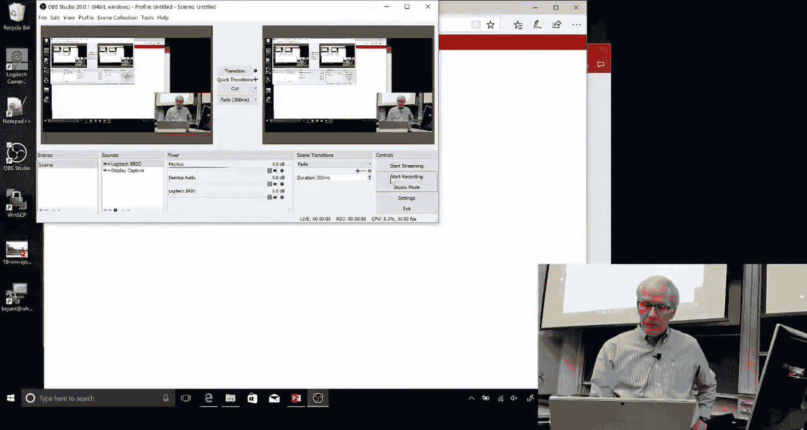
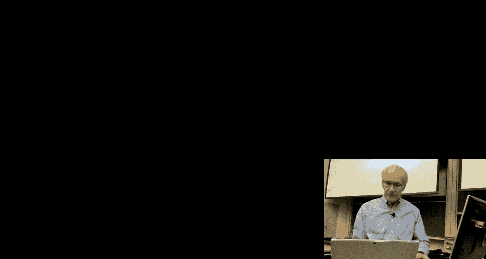
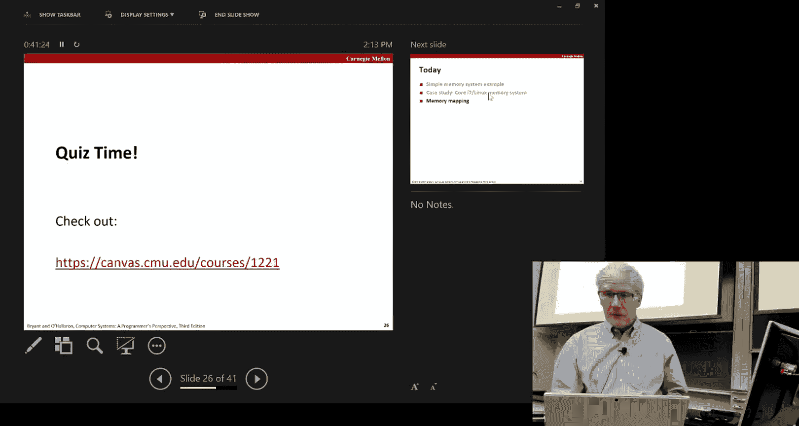
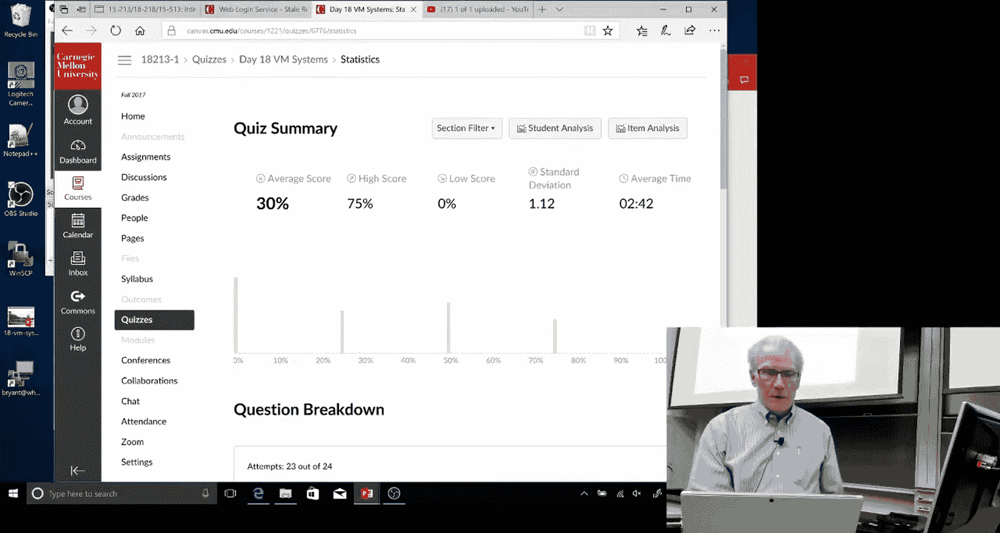
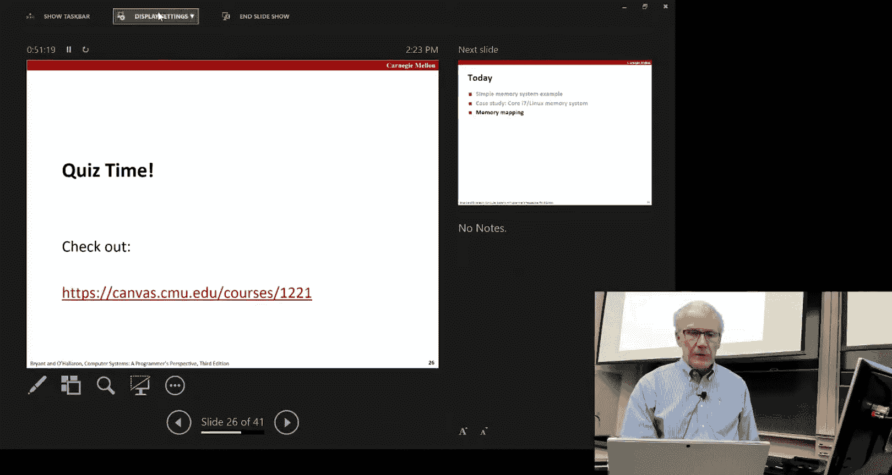
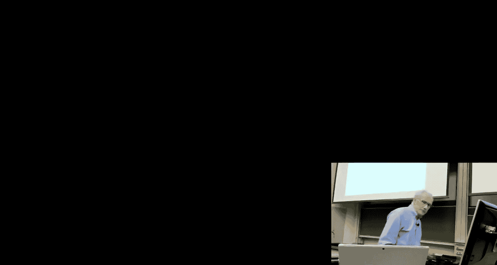
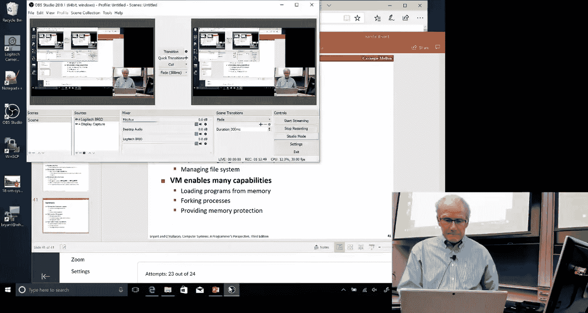

# CMU《计算机系统导论｜CMU 15-213，15-513，14-513 Introduction to Computer Systems 2017 p22 22 - Virtual Memory_ Systems -BV17jcReyETC_p22-

So today will be our。Second lecture here about virtual memory。不是。

And I think the most interesting thing。As you know。

 for some of you might end up in your life's implementing a lot of operating systems code and doing that kind of work。

Fruence， this will become a fairly large focus of that effort。For the rest of us。

 who are more application programmers。Though what you'll find is if you just kind of have some general idea of what the operating system is doing and some of the ways you can kind of tweak。

What's going on to your advantage， that's the benefit of knowing these kind of material。

So you'll recall from last time that。That the idea of virtual memory is to provide an incorrect connection from the memory that the programmer sees。

Just think of as the array of bytes and the actual physical DRA that's available to use to hold that information。

And so in general， that's represented by some type of a page table。

 which consists of page table entries and each page table entry describes for a particular block of memory。

 a page where it's located， is it in physical memory。So what's the starting address， if not。

 is it on the disk？And so this page table we have various flags， one of which a simple flag is just。

 is this particular page valid or not， meaning is it in the physical moment？And in general。

 this all works partly by we're partitioning our whole memory space。

 both the physical and the virtual into these uniform size walks or pages。

And we also talked very briefly that if you work out the numbers when you get to a moderately large address space。

 you can't possibly have page tables to represent your entire ed virtual memory。

 so what's typically done is a tree structure implemented by a hierarchy of。

Or levels of page tables where you can think of it as a tree with a branching factor equal to the number of page table entries per。

Page。And so at the top level is a single table giving sort of one page worth of。

Of page table entries， but instead of pointing directly to the。Memory of the user program。

 it's actually then pointing to additional set of page tables。

And then this keeps going possibly multiple levels。 and part of the trick here is that。

except for rare exceptions， most users have only a very sparse utilization of their total address space that they're using the region at the top for the stack。

 they're using the region at the bottom for their code and for their global data structures。

 Maloc is allocating typically from the bottom， but if you work out the numbers。

 like the machines we have with a two of the 48th。Fights worth of virtual memory。変る。

We're actually typically using a very small fraction of that。

 so the interesting thing about this tree is you only have to populate those parts of the tree for which there's actual pages in the program to represent。

So this tree can be reasonably compact packed that sort of grows at scales。

In proportion to the total used virtual memory space， as opposed to the size of virtual memory space。

The other thing we talked about last time very briefly was to make this go fast。

 you have to have some type of a caching scheme for pinch table entries。And otherwise。

 you'd end up having to go to memory over and over again to walk down this path of page tables and there was a question last time it was a really good one。

 which was， well， you know， assuming a cache is pretty fast， if a typical read takes two hits。

 one to get a page table entry and one to get the box， that doesn't seem so bad。

 but actually if you work it out with a multiplelevel page table。If you didn't have TLBs。

 you'd have to do K plus one memory references just to get one byte out of the user's code。

 memory data because you'd have to start at the root and chug them along so the idea of a TLB is it's essentially a hardware cache。

Of page table entries。So it has information there about what level in the tree it is。

 what user process is running it，But basically each of these entries is just a single page table entry。

And assuming there's a hit then。That can very quickly。嗯。

Find and actually all done within hardware can locate where a given virtual address maps to in physical memory and use that to directly return back the value without any more fooling around with page tables。

So you can see that TLB is pretty critical to making this work。By the way。

 people ask why is it called a lookaide buffer and I don't know。

 this is something from ancient history。Ancient history being the 1960s。

So you remember the general principle of set Assoative caches that typically there's a。

For a given block can map to somewhere within a fairly small set of possible。Lines in a cap。

And so if we say it's4 away set As， for example， then there's only four possible places any given block can be and you'll find that both data caches。

said Associative， but also TLBs are said associ， typically with higher degrees of associotivity。So。

And the way， if you remember from your cash simulators， of course。

 was the way we figure out where something is in a cache is we get an index。嗯。

From that the log of the number of sets。And we use that to determine。A witch set to look in。

 And then we have a tag， which is the rest of the address。

And we use that to identify which of these blocks matches the block that we're interested in。

So that same principle holds for TLBs as well as fors， for data caches。

So so far we've introduced all these different symbols or the numbers and things。

 and I'm introducing this because we're going to sort of show some very simple。

Mappings just to exercise to get you from a virtual address to a。

To an actual block of data in a data cap。So we say in general that there's capital N。啊。

bytes in the virtual address space， capital M in the physical address。

 and we assume that a page table each page is P capital P bytes。

 and then the lowercase letters are the。Lg base two of the upperppercase lettersters。

And we talk about there being for virtual addressing。

 there's a virtual page number or vague virtual page offset。

Which is the lower order by bit and the virtual page number， which is the higher order bits。

And similar， since what a remember that a TLB is a cash of。嗯。你时间。

I'm pointing to things with my finger and it's not showing up there， isn't it？I wondering。

 what has you been looking at？Okay， I'll try you with this pointer。Apologies to the video people。好。

no。No always do what you want。So the point is that the TLB remembers a cache of page table entries。

And so the page table entry， this sort of address quote。That TL B is using to determine。

To map into a cache is the virtual page number。And just like the。

Snate associate of Cas we've seen we'll use the lower bits of that virtual page number to provide an index into the TOB。

 and then the upper bits will be called the TOB tag。

So let's just do some really simple examples of sort of much smaller than real life cases。

 so let's assume we have a 14 bit address that virtual addresses。

And 12 fit physical addresses and that the page size is 64 bys。 so the offsets then。而re。Are 6。

Bits are to make up the virtual page offset because two to the6 is 64。And that's just。

Think about then that the TLV has four sets。And it。F way associate。And so you can think of the TOB。

 then there's four sets， each of which has a tag。And then if it's a valid entry， remember。

 the idea of a TOB is to map virtual page numbers， physical page numbers。If it's invalid。

 it doesn't matter what the PPN is。So let's just take an address。A hack。嗯。Z D。

And so what we'll do isll as the cos indicate， we'll use this low order two bits for the index。

So the index is 01， meaning that we're in set one。And the。What we'll find then is that the tag。

Is these other six bits， and so one thing you have to do when you do these problems is deal with X numbers。

So you can think of this as a six bits total， but when we convert this to hex。

 we look at the low order four bits and say thats a three， and then the upper two is just zero。

 so kind of you can think about adding two extra bits to there to form two hex digits。And呃。

So our tag is zero fruit。And so that as this yellow indicates。

 that's a hip that we find that tag in the TOB， it says the physical page number is 2 B D。

 which is not related to the0 D， that's just a coincide there that they're both ended D。And。

So that would then give us our physical address。Similarly， we could look， if we didn't have a TLV。

 we could look directly into the page table。And we could look up the virtual。

The page table entry for virtual page number 0 D and find that it's 2D and it's1。

 and it's pretty important in fact that the TOB entry and the page table entry be consistent with each other or you've got a problem。

So that gives us this overall。Mapping that our physical page is at 2 D。And our。

We didn't worry about the lower or six bits of the address。

 they just carry over directly from the virtual page to the physical page。

And now if we wanted to just keep this going， we could say， okay， now I've got a physical address。

But I want to get it in see where it's located in the data cap。

And let's assume that we had some low order six bits for the physical traps。

Then what we do is just like you did in your。啊。Cash labb， you'd say， well。

 the block size of the cash is four bytes， so the lower two bits are the block offset。There' is。

There's eight sets here。No I'm sorry there's 16 sets。

So there's four bits worth of cash index and the rest of it forms the cash tag。

And then we could pick those apart and again， with some work。

 find that what we're looking for is byte number one。With index A。啊。

Here that's hex A and with a tag of2 D。And so that。嗯啊。Keeps going。 and there's more examples here。

 I don't think I'm going to go through them all。 Actually， these slides are really interesting。

 I didn't make them up。 Some put in a lot of time on them。But it wanted piece of advice。

 if you want to go through them yourself， make sure you do the PowerPoint version because there's a lot of animations where there'll be one table that sort of sits on top of some previous thing that was there。

But anyways， this is an example of a。The same kind of parameters。Where there is this time the。

Virtual page number is 0 F。But we'll do the same splitting that into a TLV index of three and a TOB tag of three。

And so now we look in。哦，还 see。I was getting confused by this word physical address that shouldn't really be there right now in this part of the animation。

 so basically what we want to do is look in set number three for tag3 and we find it here with physical page 0 D in its。

And then similarly， we can take the address and。Put in the physical page number and take that address and use the cash。

To look up the cash index of。5。And a tag of。Of 0 D。And so we find that this is a direct milk cache。

And this is an example。Where the TLB misses and you have to go then to the page table。

But you can see that the。The virtual page number is0， zero here， so you look at the first entry。

 you find that it's valid and that gives you the physical page to8。

But it's totally possible for the TOB to miss。But the cash to hit。

 so that's a possibility and that shows in this example too。啊。

I don't remember how in this case it's a myth， but it could have been a hit。

So just to give you to scare you a little bit， this is an example of an exam question from。

Several years ago， back when we had used printed exams。

Well somebody writing this exam problem was a little bit funny saying that assume the system has one or more vote。

So whoever made up the slide thought that was pretty funny。

But the problem is actually a really good one。In that what it gives is a list of this is the information of what the TOV has。

The TV contents。And then there's a series of questions where you're given either a virtual address and you're supposed to give the physical address。

Or the physical address， and you're supposed to give the virtual address。

 which is sort of involves using this table to work your way backward to a virtual page now。

 so it's an interesting problem。And if we do this， you often have to be handy in hes。

But it's the same idea as before that we said theres。The pig size in this case is2 the8。Right。

 so the lower order of eight bits are the。The offset。The virtual memory is tuned to the 16th。

So there's and' a。A two way set associative with eight entries。

 that means there's four sets with two elements each， and that's what's given here。

 so it means our TOB index will again be two bits。And the TOV tag will be the remaining six。And so。

Again， we take this address 785， you'd have to write it all out in binary。

 which is actually bad notation here， should be 0 b。

And then you split that into these different pieces。And you know already what the。啊。The will order。

8 bits are gonna be。But then you use the index of1，0 or two。And a tag of1 F。

And you find this entry here。And that will correspond to physical page 9 F。

And so that gives you your physical address。And you can work your way through as these dashes show some of these will turn out to be ones where there's no valid translation。

Adress is not mapped at least via the TP。But you can in this one example。

 go from a physical address back to a virtual dose。So of course。

 the biggest mistake people make is screwing up the hex stuff。

And messing up where those bit fields are and things like that， and once you're off on that。

 you're completely sunk。So。My advice is practice。Before the final。Okay。

 so that just shows you sort of gives you this sort of very hands feel for how。

Virtual addressing works now let's look at a real system and while we're at it。

 let's look at a system that we know and love which are sort of modern X86 processors when running 64 bit load。

So a。There's a lot of caches and TOBs in a modern processor。So， for example。

The system has three levels of cash。And at the level one， there's actually two separate caches。

One hold instructions and one hold data。 And the reason for that is you want the instruction reading。

To not kind of get mixed up cash wise with the data and having it fast instruction cache is incredibly important to be able to for the machine to kind of keep reading down filling up the pipeline of instructions and keeping the whole system running fast。

So that's part of the reason why it's separated from the data gap。

And then there's an L2 cache where these two are combined。

And then there's also an L3 cache and one thing we'll see as we get into later in the term is what's called a multi corere processor。

 there's actually multiple CPUs， so like most of your laptops probably have two or four cores this phone has。

Several of course， I think， for plus several graphic processes。So the point is that these cores。

 each of them has some private cash。The L1 and L2s， but the L3 is shared by all the different cores。

 and that's useful if you have a program running where because of the scheduler makes it hop from one core to another。

It doesn't lose all the cash contents as it hops get scheduled on a different court because L3 Cor can still be。

And then over on the address translation side， you'll see there's actually two levels of TOB with a separate TOB for instruction and data。

Just like the work I'm sorry for the yeah， for the instruction data。

 just like they work for the caches themselves and there's a larger TLB that holds more of them so one thing you'll notice about TLB is that they're pretty small。

128，64。512 entries。When you think about their job is to cash。Page table entries。嗯。

Somehow 512 doesn't seem like that many， but that's enough performance wise and part of it is by making these memories very small。

 they can make them very fast。And then there's more stuff， this is the DDR3 is the type of DRAM。

It's installed。And then this quick path is the communication mechanism between the different cores。

 So one of the odd things they do is。So that's a way that the courserus can interact with the Dbra。

But what's important for us is all this stuff， for cash， mostly the TLBs today。

So this is how the addressing works in it and these numbers all kind of fit together。

 you'll see that remember that a virtual address is only 48 bits in a current X86。

 even though pointers， they've allocated 64 bits for them。The reality is that the biggest。

Systems you can buy today still only are limited to 4 acres。Only， remember。

 48 deaths is 256 terabytes， so it's a fair amount。啊。So。So anyways， and the paint sizes。

There's actually several page size that support it。In Linux， they just use 4096。Byいてさ。reに scan。

So that means that our address can be split with a 12 bit offset and a 36 bit page number。

And you think about it each。TlV entry is going to be eight bytes。And so in a 4096。By page。

 I can fit 512 of them。And 512 is two of the night。

So what they do is take this 36 bit field of virtual page number and break it into four nine chunks。

 and that becomes the how you index into this tree of page table。がペ置で。So in general。

 it's always that way that you look at。How big is the pay size， that deterrence is offset？

It determines how many。But entries， there page table entries you can fit in a single page。

 and then that defines how you want to break up the rest to the addressed into chunks。

And then in general， this will go through a TOB if we look at this。嗯。So to figure out where they got。

16 sets， 64 injuries per set Well， this is the L1 data TOV。

So these 64 entries total divided into 16 sets。So that means when it's computing the。virtualtual。

When it's indexing into the TLV， it's using the lower order of four bits to find what set to look at in the upper 32 bits is a1。

And this shows what the page table entries look like。 And these are for the levels  one through 3。

 meaning they're。Page table entries that are pointing to other pages。Page tables。

 not to the actual data itself。And you can see that they actually。

 one interesting thing is they've allocated。嗯。12，51 thats。5ifth that's 48， no。Oh。

 I'm sorry this is yes， so this is tells you where the actual。Page is located。

That it's pointing to in physical memory。And so 51 minus 12 is。Is 40。39， right？

So that have many bits。But remember it's。Always going to be in a multiple of 40，96。 So anyways。

 there's a lot of。A lot of bits there for representing that。And then there's all these one bit flag。

 So， and they aren't in a logical order。 X D is the extra bit saying whether or not you can execute this。

嗯。The code in this block。And for this case， when it's in one of these high level page tables。De。

Means sooner that it applies。Downward over the entire subte that this block。

 this page table entry is represented。And it's inverted in that sense as a disabled bit。And。

There's other bits here， we'll look at those bits， they make a little more sense when we look at the bottom level page table entry。

So the same idea， the bottom most page tabled， the one that's pointing to the actual pages of user data。

Is。Looks very similar to the upper level one。It's got this execute disabledable bit。

 it has a bit saying whether it's valid or not， that's this key bit。不清楚的吧。And that has permissions。

 it says。Is this a reader， right？Permission for this and then there's another bit remember we saw this in one of the examples last time where I wasn't sure it was the way it would work but。

And indeed， what it will say is a given page is either。啊 user。

Level or supervisor level and supervisor level。啊。A supervisor has access to any user level page as well。

But it also says what type of is itw read Norway or rewrite access to it？

The other thing that's interesting is you can even set what the write back policy is for a given page by twitgling around with its page table entry。

好。Which is pretty crazy if you think about the cache having to figure out whether it needs to evict a block and write it back as to then find the relevant page table entry for that block because it does。

Basically has to store that information away somewhere。As part of the block。

These things don't implement a true LRU， they implement a sort of pseudo LRU that the hardware provides just a one bit flag saying has this block been accessed since the last time you set this spike to zero。

 and what the operating system does that just periodically sweeps through them all and sets them all to zero。

With the idea that if it comes back in it。Set to one， it means well， it's been used fairly recently。

So it's sort of like if you think of an LRU where you only get one bit of information。

The dirty bit is the same idea as in the cache whether this particular page has been altered。And。

As I mentioned the。This address then is 40 bits， but remember in references it's。It's basically。

Gives the the physical page number。 So if you add that to。啊。12 bits。

 you actually have 52 Bs worth of physical address， which is strange。 So physical addresses。

 in some ways are bigger than。啊。Virtual address。That makes sense， and these entries， by the way。

 this is a place where this is what the Intel hardware supports。

 but the operating system is really responsible for managing most of this information。

And doing what it wants to run。So anyways， what happens is you can think of this tree。

This four layers is sort of narrowing down the region where this particular address references in the virtual address space。

Until it comes down to the actual page， and that will give you the physical page over。So like I said。

 this sums up 40 plus 12 to 52。So one of the things I sort of alluded to this last time and it's sketched out here is this very clever trick of midsizing the cache。

 the data cache。In relation to sizing setting the page size。And that's to let you。

 the point thing that the virtual page offset is 12 bits。 But if we look at the cache parameters。

 we'll see that the。The cash offset it's 64 bytes per block。And the cash index。

 the way they size the total cash size and make the associivity， it's six bits as well。

 And so that sums up to 12， which is the size of the。The H offset。

 And so what that means is that the cash can begin。Looking。

 retrieving all the basically does a parallel reading of all the elements of a single set。

Using just the。嗯。The officer。From the virtual address， and in parallel。

 the TOB fires up and tries to find the physical address。And then after that's done。

The cache will be able to then say， okay， I've just read， if it's a fourway Associative cache。

 I've just read four different possibilities and now I can in parallel with the hardware see do any of those match。

My cash tag。So it can basically do the first part of the cash flow cut in parallel with the address translation。

So now let's talk that's sort of the underlying hardware operating system stuff Now let's talk a little about how a Linux process manages the virtual address space of the process。

And so in general。The virtual address space for a process， we've already seen this lower part。

Where there's some staff。Some shared libraries。And then。Parts of the user code。

 global data structures， and any allocated memory from。And at any given time。

 then there's something called the break that。Controls how much of the address space has been allocated。

 and when now。Tries to grab more memory if its not if there isn't enough in the he yet。

 it'll make a call in the break to move the break up， and potentially in doing that。

 the break has to create more new pages and add them to the virtual address。And similarly。

 the user stack is not very big， it's usually five megabytes。

 but still it as the stack grows downward， the operating system might have to add more pages to the virtual address。

And physical address of this particular process。Now up above the addresses that the user level code goes。

Is the information that the。Operating system maintains on behalf of the。啊。Use it。

 so this is code that the kernel makes use of， but you as an application programmer aren't allowed to either read or write this data。

And so that will include the code of the kernel itself， they actually map the physical memory。

Into this address space and you'll see that it's done in a way that this is the same。啊。

For all processes， so this is sort of really a big shared region， a memory。

And also the things that are specific to the particular process， the various page tables。

 these various the stack that the operating system kernel uses it doesn't run on the regular user stack。

And various other structures that kind of keep track of the state of this process。And then overall。

 then logically， a given address space for at least the user code can be viewed as these contiguous regions。

With holes in between them。So。For the here is just showing some part of that be。

Some range of them that are the text， meaning the code。

 and these are marked as a special region because it's always read only。

 and then there'll be the global data structures that have been allocated in the program。

And as I mentioned， any ones that are dynamically allocated by mallet will be a data region。

 and then there'll be some shared libraries that。Are actually you want to share even within the processor's memory。

 all the copies of those shared libraries。So， the。Linux manage all this as a linked list。Of on。

Of what are called VM area strs， virtual memory area strs。 So each of these is an area。

 and each of them is marked them by starting at an end。

Some protection information and other types of flags。

Flalans indicating whether this block is private to this particular process or shared across processes。

 protection meaning is it readable， readable， executable。And logically。

 then these are all stored as a wing twist。So what the operating system is supposed to do that is if it is given an address and let's assume it's a miss。

 you know， the TOV miss， so it goes up to the。And then a page miss。

 so it goes up to the operating system as a page fall。

 what's it supposed to do well if it's to a region that hasn't been mapped。

It's supposed to give a segmentation fk。If you try to write to a region that's read only。

 it should give a protection exception。Which is just reported as a segmentation fault in length。

But if it's a read to a valid part， then it should just be a normal page fault and the page table。

The appropriate page should be brought into memory。So the trick is， in general。

 this linked twist twist can get fairly large。And so you don't really want the thing to step through it。

 so they actually have a tree， I believe it's a spray tree， in fact。

To alsoSo that given a particular address。virtualual address。

 it can fairly quickly identify which of these VM areastructs is relevant for that particular address。

Or find that there is none and so that should be the the segmentation fault。Okay。

 so let's do today's quiz， I think you'll find is an interesting one。

Yeah。要我一进。Oer。边が标。I just need five minutes here to talk to。

About the activities we do any see if that's okay， Okay， don take the rules。ここス。你个怎超 you。

Sorry about this。know if you love it it comes to other time。can do。Hey， folks。

For those you who don't know this is Yona Kva， perfect。

It's my Serbian answer no exactly she's head of the ECE department and she wants to talk briefly so just put your little quizzes aside Oh。

 they have a quiz No no no quiz。😊，They're all happy， they're all happy to pull the quizzes。

 I'm sorry。And this is very more hour she handles the student activities in EC the reason why we're doing this because every semester I have town hall meetings and student office hours and some of you show up and tell me how you would like to have more social activities。

 more interaction with faculty outside that the academic environment outside the classes and so on and we do a lot of these already so we thought we would come and kind of sensitize everybody to it and this is why it varies here Barry also sends weekly digests to all EC students on Monday mornings so I suggest you look at it because she summarizes all kinds of things we do and for CS students you know I'm sure that CS does similar things or if you see something you like in EC or you come visit us we're happy to have you。

So there you go， I'll just turn it over to you a couple。 Hi everybody， I'm Bar。

 like you said I do our student activities in ECE and we have a couple different things going on。

Make sure that you're aware。We have a destr the ECE initiative。

 so every other week throughout the semester。Thankshs going on， like for example。

 we have an ECE yoga。Every semester we have， during finals and midterms。

 we have wellness spaces where there's lots puzzles and granola bars and lots of lots of free food。

 for sure。We also give out distress kits every semester， we have a movie night every semester。

We have a couple different wellness workshops we actually have one coming up on funding happiness so if you get my digest。

 check your digest and you'll see where to RSVP for that and we also have faculty opportunities to interact with faculty that。

Informal and a lot of fun， so for example， a couple of our professors do game nights。

 Y and I has a puzzled night every semester。coming up in a couple of weeks。

 we have some professors who have taught our students how to play squash。

We also have an ECE faculty staff band， so if you play an instrument we're having a jam session。

Coming up in。So actually one of the 213 instructors for one semester France from Caty is the main。这样。

Yeah好。Yeah， so it's a really interesting way to get to know your faculty in an informal setting。

 so we really encourage you to read your digest and keep your eyes open。The department for。

Quirre and。Opportunities to destr and。To have a life outside of class。

And apologies if you hear at this point and once we are going around the all our core classes。

 the sophomore level classes， so you're welcome to fall asleep or continue doing your quiz CP。

But this is just so you guys can say， oh， we want more of this and we tell you we are doing it you so dishes searches。

Thanks， Ry and sorry for the interrupt Okay， continue doing your qui， by guys。的。才是的。看。这个。

So I see that。People aren't quite catching onto these problems， so let's work it out。好。

So it says that it's a 32 bit address space。And that。Pages are 4096 fights。

 so how many whats are of two is 4096？ so that will be our。还。我烦。

And then there are four bit 32 bit addresses， so how big is the page do want？他我。

Page two entry will be， remember it's got to have a physical page number and it's got to have some room for some flag。

Also it has to have the， so it will be。For advice。I guess you can maybe squeeze it into free。

 but then that gets mess。So the。呃啊。And at 32 bits， it's just like in 64 bits system we saw a page going tree is eight bytes and a 32 bit system it's4。

So that will be- so how many of those are in a page？4096。Bights， inches four。1024。

 and so how many bits is that？嗯。这个。What's 1024。right so that tells you basically what you want to do is producing this into。

Two10 bit chunks。To get at a two level。Tranation system。Where。And that gets your 32 bits。

Does that make sense？So I know you this。In some ways。

 you just saw this for the first time on a different system and we're asking you to do it care。

 so it's not。Completely a question I'd expect you to jump right in the get。

 but that's the idea of behind。So the interesting thing is。

I pulled those parameters off of a raspberry pie。So those of you know a raspberry pie costs $35 if you get the Docs model。

And the process here for it is what they call a system on a chip， and it's produced。For cell phones。

 for smartphones。Not even high end smartphones， more like a sort of low level Android phone。

Would use one of these the chips they have in her。So that just gives you a sense of。Nowadays。

 even a fairly small device。That you can buy for very cheap。Implement。

Virtual 32 bit system with virtual addressing， two level page tables。

 it supports a version of Linux and the whole thing。

 so nowadays it used to be you only saw virtual addressing。In fairly upper end processors。

 but now that's sort of migrated down to some fairly all of those stuff。

Okay， so that's。We'll finish off today then by looking at。Some of the Linux。

Ways that implement the mapping of pages into memory and how you can as a user。

 actually have access to some of that。So the idea of。啊。

The sort of relation between the pages that form your address space and logically they're stored on the disk。

Say typically， and the physical pages， the ones that happen to be resident in the memory at any given time。

 is that the virtual memory sort of maintains this correspondence between disk pages and physical pages by a process called memory mapping。

And so a given part of the memory then can be backed up by a file。

 meaning it's a real file of the file system， for example， your executable program。

Or it can be backed up by an anonymous who's sometimes called a swapping file， which is one that。

As your program runs。And it's filling up memory with whatever data structures you're creating。

Those aren't really a standard file in the file system。

 but the Linux test be able to swap those out somewhere。If it needs to evict that particular page。

And so it basically creates a region that's called。啊。

The swapping region on the disk where it's able to move pages back and forth。And these always。

Come in when the first time they're touched and allocated。

 then the operating system will zero this out。And。Then if it's been written and the process is still running。

 it has to， if it evicts it， it has to actually write that file out to the。To the desk。

So one of the things we saw before was one of the great things about virtual memories that allows the sharing of。

Of physical pages among different processes， and this is especially useful for read only pages where therere。

 for example， code that you want to share across them。So that works。

By the same general idea that the。呃。One process sort of requests a maps a particular disk file。

Into its virtual address space。And that will then create， Linux。

 we' view this as a shared object then。And map it into physical memory and now if a second process comes along and requests that same file be mapped into its address space。

 what it will do is create a instead of making a second copy of it in the physical memory。

 it will just create pointers from both processes to this same part so in other words page table entries that are both mapping to the same page but from different virtual addresses and different。

Prosses， and you'll see that actually， the two don't even have to be the exact same。

A virtualual address。But they do have to be the same。

 all the addresses are sort of everything's done in multiples of the page size。

The difference between 82 virtual addresses。Between process one and process two will always be some。

How many different the two pages are relative to each other。

But the point is that now that this can run， this shared object can run and the two programs can be accessing it。

 and you'll see since the cache is based on physical addresses。

 even if these two processes are swapping out back and forth。

That cache entry will stay valid and each side will be able to use it。

One of the other clever things that they do in operating systems。

 including Linux is use a trick called copypy on right。

 and so that's the case where you want to have a block that is private。

But it's also potentially writeable。 It's both readable and writeable。

 So what the process will do the。The operating system will do is it will mark that block in each of these page table entries。

 it will mark it as read only。But it will also keep track of the fact that this block is actually shared and it will have a reference count for how many shares there are of that block。

And now if one of these processes comes along and tries to write it。

What it will do is it will cause a O this is diagram。 so if one of these processes tries to write it。

啊。Then the page table entry will say， no， you can't do that， and so that will cause a page fault。

But now it will come up to the operating system， which can say， oh， yeah。

 But this is a page I marked as copy on right。 So what I'll do instead of。嗯。

Aborting this and causing a fault。Is I will basically make a now I will make a new copy。

 a second copy of this actual physical page。Set up a pointer to that second copy by this process and read it write。

And I'll decrement the reference count for this original block so that if there were say 10 shares。

 now， there'll only be 9 shares。 And so each of those is allowed to。

 through this copy on right trick， basically get their their own private copy of this data if they keep writing it。

And then once the final one is left， it has a reference count of one。

 and so that's effectively becomes a private copy for。So where this really comes into play。

I's with our friend Fork。Remember， the idea of fork is that。

It looks as if you have the child process you've made a total copy of the entire address space for the parent of the parent and only modified a few parts of it。

But if you think about it。On large parts of that。啊。Two processes are likely to stay the same。

 the code， for example will。And things like that， assuming I don't do an exec so rather than sort of really making a copy。

 what it will do is keep the original copy， but use this copy and write trick。

To make it so that now I will only duplicate the pages that actually get updated by one process or another as it runs。

 So it's a pretty clever trip。Does that make sense to people。

 it sort of solves the mystery of how fork works？And now we've seen this。

A function you've experienced called Exec。There's various flavors of exec。But the basic idea of it。

 if you think about it is I'm trying to take a binary executable file and somehow pull it into memory and let that program start executing。

So what happens is it uses this idea of memory mapping that you map the executable file into the memory space。

And that well， and then until the program to start executing it will cause a whole bunch of page faults initially。

As it touches new parts of the code or new data structures。

 but those pages then will just get brought in through this normal page faulting mechanism and eventually your whole program will be loaded into memory and executed。

So it does this by as it does this。It has to initially create these different this linked waste of VM areastructs。

 but the actual pages itself don't need to be brought in until they're actually requested。

One interesting thing I was just reading about is so now we've seen there's sort of several different ways that。

The operating system can detect that two pages。对。Might be good candidates for sharing。

 but we just saw it with Fork by default， everything is viewed as a candidate for sharing and tell it's not。

When I've loaded the same binary file， So if everyone's running。

 if you have 10 different people running a Python interpreter or a bash interpreter or a web browser。

 any sort of。Executable file that's pretty big and。Commonly used， well。

 the OSO needs to maintain one copy of that across the whole system。And similarly。

 if people are bringing in dynamically linking libraries like the LibB C library or ones like that。

 again， those are files that get mapped into the memory。

 and so the operating system can basically share a copy there。

 so those are all cases where the copy is sort of known in advance who the potential shares are。

But I was just reading there there's an interesting feature then put into the Linux kernel。

About 10 years， almost 10 years ago it's called kernelel Sam page mergging， where literally the OS。

Is scanning through the memory， the physical memory on a regular basis， looking for pages。

That are the same。And when it finds pages that are the same。

 it will then revert to just a single copy of that page and make it shared using the same copy and write mechanism。

So you can think of it as instead of sort of passively looking using the sharing that's sort of built in。

Known in advance， it actually is actively looking for opportunities to share。And you think about the。

The logistics of this， you have to be pretty careful， you don't want to just。

You can waste a lot of time saying， oh， these book the same， Oops， they're different， Oh。

 they're the same。 you know， that would be very inefficient。

 So you want to sort of not make this be too aggressive。And you might ask well。

 does this really happen in real life， This sounds a little bit extreme。

 you know why would my program happen to have the same data structures as your program at some given point。

 and it's not really for regular application programs。

 this is used by where it happens is when a system is running where are called virtual machines。

 a virtual machine is a case where you can essentially run different operating system types on a single machine。

 single piece of hardware， and this is very called commonly use for example， in cloud data centers。

 a place like Amazon Web services gives you a virtual machines that's your own。

 but it's hosted it's hosting actually multiple virtual machines on a single。Physical machine。

And so those are all examples of where there's a lot of common data because all the different instances of a particular what's called the guest operating system。

 will have a lot of code and data structures that are common to each other。

So this is there because I mean， they implement this because it actually is useful and they've shown that for both Windows and Linux。

In armed servers， this kind of technique is worthwhile。

So I thought it was interesting that the sharing is actually。啊。

A real thing that's so real that they actually actively look for more opportunities。

So you actually as a user programmer can make use of some of these same ideas by a function called MMAP。

 and EmMAP is this general idea of mapping some region of memory from a file and creating a mapping between a file and a region of virtual memory。

 and that can be a rely copy to bring in something into the memory system。

 it could be also be a writeriable copy that lets it actually transfer data back and forth between a file。

 say on a disk and the memory space。So the idea of MAP then is that you give it a。えい。

Proposed starting address， where。You can just set to zero if you're going to let the operating system figure out where in the virtual address space to stick it。

How big is this region？And it doesn't have to be a multiple of a page size。

 And then various flags that set information about what's the protection on this and。

sWhat type of mapping is this， is it a shared mapping a private mapping and so forth？

You give the file descriptor for the file that you're trying to map。And in。An offset into that file。

And basically， that will create a。诶呀。Correspondence in between the some subrange of the file and some of。

Some part of the virtual address space。So this example code is fairly a small example of it。

 but what it's using。What they said for is MAP where I don't care what the starting address is？

But I'm using it basically to take a file that I read from。嗯。From some file。Then I've read in。

That is passed is an argument to this main function。And I'm going to print it on standard out。

 so I'm going to do that by。Mapping this buffer。Basically， I'm going to read the file。

FromFrom the file into a buffer。And then I'm going to write that buffer out。

So the main thing this does is you see there's no need。え。

It only is writing because it's relying on MAP to actually use the page faulting mechanism to read the contents of this file。

Into memory， and then I can write that up。So that's MAP in one of its simplest forms。

So why would you want to do this， know why would a normal application program ever use something like this？

😔，Well， it's a little bit faster if you're going to read an entire file's worth of stuff rather than reading it with the regular read function。

 and the reason is if you think about it， to read a file。

 what it has to do is first allocate the pages， it's going to hold the buffer that you're filling up。

And that takes some time， and then you start reading off the disk and basically what happens as you read is it copies it from the disk into a buffer。

Managed by the operating system and then the read then copies that over to the destination you've done。

So by doing MAP， we avoid all of that， we basically just have it set up some virtual address space。

 and then Ka chunk。Using the page faulting mechanism。

 it just brings us in page by page and fills up the buffer。You can use this also。

 you can map a region of memory that you can make it read only。

 but you can also make it writeable and shared， so potentially you can set up regions in the memory of two different processes that are shared so that if you want to communicate back and forth or share some data。

 then you can。Because writeites by one will be interpreted will be seen as when the others do reads。

The problem this has is to do that in typical applications。

 you need various mechanisms to synchronize the two programs。And so you need some other way to。

To manage this， if you want to avoid total chaos。It also is a way that you can basically。

 if you have a large。Data structure stored on a file。 In other words， a database of some type。

 So it's a sort of a long term。Long lived lived a collection of data。

 and you want to be able to yank it into memory， do some updates。Push it back out。

 then Mmap is the natural way to do that。 will Mm will bring it in， you update it。

 and then when you unmap that block， it'll all just be written back to the file。So。

It's not something that。People use every day， you know， typical program reviewss every day。

 but for doing some very high performance。Memory IO type of operations it can be a useful idea。Okay。

 so this very brief pair of lectures we've done in virtual memory is just gives you some idea and some maybe appreciation for the complexity of it all too。

 that we see that involves a combination of hardware and software。

 things like the TOBS to be carefully integrated to the cache。

And that requires as soon as you have a TLV， there has to be some agreed upon standards for how big pages are。

 how big page table entries are， what their format is and so forth。

So Intel or the processor company defines certain attributes of the TLP。

It also asked Hargra to support some type of exception handw so that you can have a page fault。

And reliably， get back to where the program was executed。In fact。

 the early days of microprocessors were implemented by semiconductor companies who didn't know much about processor design。

And they kind of screwed up the exception handling so the early microprocessors couldn't implement virtual memory。

 but over time they hired some smart people from other computer companies and managed to straighten it up。

And also there's huge parts of the operating system， if you took a course like Fort1。

 you'd get into large parts of this of how do you actually manage all these tables。

 how do you implement page faults？How do you manage files and all of that stuff is of there's a lot of things there that we're only glossing over this。

But you've also seen how， then once you have this ability， how much sort of。

Value it can provide to the program。As far as。Handling some of the issues about memory protection。

 sharing of data between processes， how do you actually implement the initial execution loading of a program into memory and execution and things like that are all there handled through virtual memory。

Any questions or comments？Okay， I think we're good for you today then。

