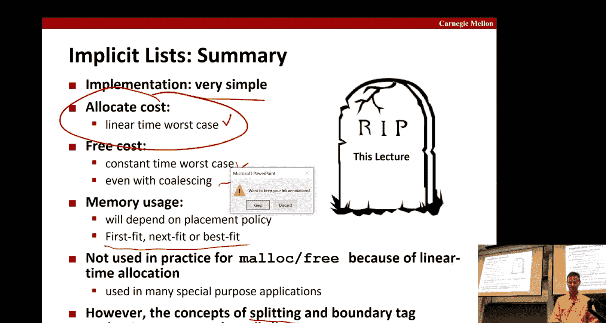

# 计算机系统导论：第23讲：动态内存分配基础 🧠


在本节课中，我们将要学习动态内存分配的基础知识。动态内存分配是程序在运行时从堆中获取虚拟内存的方式，这对于那些在编译时无法确定大小的数据结构至关重要。我们将探讨其工作原理、面临的挑战以及实现一个简单分配器所需的核心概念。

---

## 概述

动态内存分配允许程序在运行时请求和释放内存。在C语言中，这通过 `malloc` 和 `free` 等函数实现。与Java等具有垃圾回收机制的语言不同，C语言要求程序员显式地管理内存。本节课将介绍动态内存分配的基本机制、性能目标以及实现一个简单分配器（如隐式空闲链表）所需的关键技术。

---

## 内存布局回顾

为了理解动态内存分配，我们首先需要回顾进程的虚拟地址空间布局。

*   **堆**：位于读写段之上，并向高地址方向增长。动态分配的内存就来自这里。
*   **栈**：位于用户空间的高地址区域，并向低地址方向增长。
*   **内核内存**：位于用户空间之上，用户程序无法直接访问。

堆的顶部由一个名为 `brk` 的系统指针标记。分配器在堆内部维护一系列可变大小的内存块，每个块要么是**已分配的**，要么是**空闲的**。

---

## 分配器API与约束

在C语言中，我们使用显式分配器，这意味着程序员需要手动控制内存的分配和释放。

以下是核心函数：
*   `void *malloc(size_t size)`：分配至少 `size` 字节的内存块，并返回指向它的指针。如果失败则返回 `NULL`。分配的内存块保证是**16字节对齐**的。
*   `void free(void *ptr)`：释放 `ptr` 所指向的内存块。`ptr` 必须是由 `malloc` 或 `realloc` 返回的指针。
*   `void *calloc(size_t nmemb, size_t size)`：分配并清零内存，相当于 `malloc(nmemb * size)` 后加 `memset` 为零。
*   `void *realloc(void *ptr, size_t size)`：改变已分配内存块的大小。
*   `void *sbrk(int incr)`：系统调用，用于移动堆顶的 `brk` 指针，从而扩展或收缩堆空间。通常对程序员透明。

分配器必须满足以下约束：
1.  必须**立即响应**请求，不能对请求进行重新排序或缓冲。
2.  只能从**空闲内存**中进行分配。
3.  只能操作和修改**空闲内存**。
4.  **不能移动**已分配的内存块（因为程序持有指向它们的指针）。

---

## 性能目标

评估一个动态内存分配器主要有两个性能指标：

1.  **吞吐量**：单位时间内完成的请求（`malloc` 和 `free`）数量。为了高吞吐量，分配器中的例程必须非常快速。
2.  **峰值内存利用率**：衡量分配器对已申请堆空间的有效利用程度。

峰值内存利用率 `U_k` 在经历 k+1 个请求后定义为：
```
U_k = ( max_{i≤k} P_i ) / H_k
```
其中：
*   `P_i` 是第 i 个请求后，所有**仍被分配**的块的有效载荷（`payload`）总和。
*   `H_k` 是到当前时刻的**堆大小峰值**（即 `brk` 指针曾到达过的最大位置）。

高利用率意味着分配器能更有效地利用从系统获得的堆内存。

---

## 内存碎片

低内存利用率主要由两种碎片导致：

1.  **内部碎片**
    *   发生在**已分配块内部**的浪费空间。
    *   原因包括：为了满足对齐要求而进行的填充、分配器元数据开销（如头部信息）、以及分配器选择了比请求稍大的块。
    *   内部碎片的大小在分配时即可确定。

2.  **外部碎片**
    *   内存中分散着许多小的空闲块，它们的总容量足够满足一个请求，但没有一个单独的空闲块足够大。
    *   原因取决于之前请求的顺序和大小，以及分配器放置块的策略。
    *   外部碎片难以量化，因为它依赖于未来的请求模式。

---

## 实现隐式空闲链表

上一节我们介绍了碎片的概念，本节中我们来看看如何实现一个简单的分配器。我们将重点介绍**隐式空闲链表**方法。

### 知道块的大小

`free(void *ptr)` 只接收一个指针，分配器如何知道要释放多少内存？
解决方案：在分配给用户的**有效载荷之前**，分配器存储一个**头部**信息。

头部是一个字（word），至少包含：
*   **块大小**：包括有效载荷和头部本身的总大小。
*   **分配状态位**：标记该块是已分配（通常为1）还是空闲（通常为0）。

由于对齐要求（例如块地址总是8或16的倍数），块大小的最低几位总是0。我们可以利用其中一位（如最低有效位）来存储分配状态。当需要实际大小时，用掩码操作屏蔽掉状态位。

```c
// 示例：从头部 word 中提取大小和分配状态
size_t block_size = header_word & ~0x1; // 屏蔽最低位得到大小
int is_allocated = header_word & 0x1;   // 检查最低位得到状态
```

### 隐式链表结构

通过在每个块的头部存储大小，我们可以遍历所有块：
1.  从堆的起始位置开始。
2.  读取当前头部，得到当前块的大小 `size`。
3.  将当前指针增加 `size`，即可到达下一个块的头部。

这种链表之所以称为“隐式”，是因为我们并没有显式存储“下一个”块的指针，而是通过块大小计算出来的。一个特殊的**结束块**（头部大小为0，标记为已分配）用于终止遍历。

### 寻找空闲块：放置策略

当 `malloc` 请求到来时，分配器需要扫描隐式链表，寻找一个足够大的空闲块。以下是几种策略：

*   **首次适配**：从头开始搜索，选择第一个足够大的空闲块。
    *   **优点**：速度快，搜索很快停止。
    *   **缺点**：可能在链表头部留下许多小碎片，增大外部碎片。
*   **下一次适配**：从上一次搜索结束的地方开始搜索。
    *   **优点**：比首次适配更快，避免了重复扫描链表前部。
    *   **缺点**：内存利用率可能比首次适配更差。
*   **最佳适配**：搜索整个链表，选择满足请求的最小空闲块。
    *   **优点**：最大限度地减少请求后剩余的空闲部分，提高内存利用率。
    *   **缺点**：速度慢，需要遍历整个空闲链表。

### 分割空闲块

如果找到的空闲块比请求大很多，分配器通常会进行**分割**：将空闲块的一部分分配给用户，剩余部分形成一个新的、更小的空闲块。

分割操作涉及：
1.  设置已分配部分的头部（包含大小和已分配标记）。
2.  在剩余部分创建新的头部，将其标记为空闲。
3.  更新链表遍历逻辑（隐式链表中，这通过大小字段自动处理）。

### 合并空闲块：边界标记

当 `free` 被调用时，仅仅将块标记为空闲可能会产生许多小的、相邻的空闲块（外部碎片）。为了形成更大的空闲块，分配器需要**合并**相邻的空闲块。

合并需要知道相邻块的状态。一个经典的方法是 **Knuth 边界标记**：
*   在每个块的**头部和尾部**都存储大小和分配状态。
*   尾部使得我们可以通过 `当前块地址 - 尾部大小` 来找到前一个块的头部。
*   这允许我们检查并合并前一个和/或后一个块（如果它们也是空闲的）。

然而，边界标记的缺点是增加了**内部碎片**（每个块都需要额外的尾部空间）。

#### 优化的边界标记

一个优化是：**只为空闲块维护头部和尾部**。对于已分配块，我们只保留头部。
那么，如何找到前一个块并判断其状态呢？
我们可以在当前块的头部中，除了当前块的分配位，再利用一个空闲位（同样来自对齐保证）来存储**前一个块的分配状态**。

这样，在释放当前块时：
*   通过头部中的“前一块分配位”，可以立即知道前一块是否空闲。如果空闲，则可以通过前一块的尾部（它存在，因为它是空闲的）找到其大小并进行合并。
*   通过当前块的大小找到后一块的头部，检查其分配状态，决定是否合并。

这种方法减少了已分配块的开销，同时仍支持有效的合并。

---


## 分配器策略总结

实现一个分配器涉及多种策略选择：

1.  **放置策略**：首次适配、下一次适配、最佳适配。在吞吐量和碎片化之间权衡。
2.  **分割策略**：决定何时分割一个大的空闲块。过于激进的分割会增加内部碎片；过于保守则可能导致无法满足后续请求。
3.  **合并策略**：
    *   **立即合并**：在 `free` 时立即合并相邻空闲块。简化了 `free`，但可能使 `free` 变慢。
    *   **推迟合并**：直到分配失败或扫描链表时才进行合并。可以将开销转移到非关键路径上。

---

## 隐式空闲链表的评价

*   **优点**：概念简单，是实现更复杂分配器的基础教学模型。
*   **缺点**：
    *   **分配时间**：在最坏情况下是线性的（`O(n)`），需要扫描所有块。
    *   **内存利用率**：取决于放置策略，但通常不是最优。
因此，隐式空闲链表在实践中很少使用，但理解其概念对于掌握分割、合并等核心技术至关重要，这些技术是所有现代分配器的核心。

---

## 总结

本节课中我们一起学习了动态内存分配的基础知识。我们了解了堆在内存布局中的位置、分配器的API和约束条件，以及衡量分配器性能的吞吐量和内存利用率目标。我们重点探讨了内存碎片的两种类型：内部碎片和外部碎片。

随后，我们深入研究了**隐式空闲链表**这一简单分配器的实现。我们学习了如何通过头部信息管理块大小和状态，如何实现首次适配、下一次适配和最佳适配等放置策略，以及如何进行块的分割。最后，我们详细讨论了**合并**空闲块以减少外部碎片的重要性，并介绍了边界标记及其优化版本。



虽然隐式链表本身效率不高，但它为我们理解动态内存分配的核心挑战和解决方案奠定了坚实的基础。在接下来的课程中，我们将探索更高效的分配器结构，如显式空闲链表和分离空闲链表。