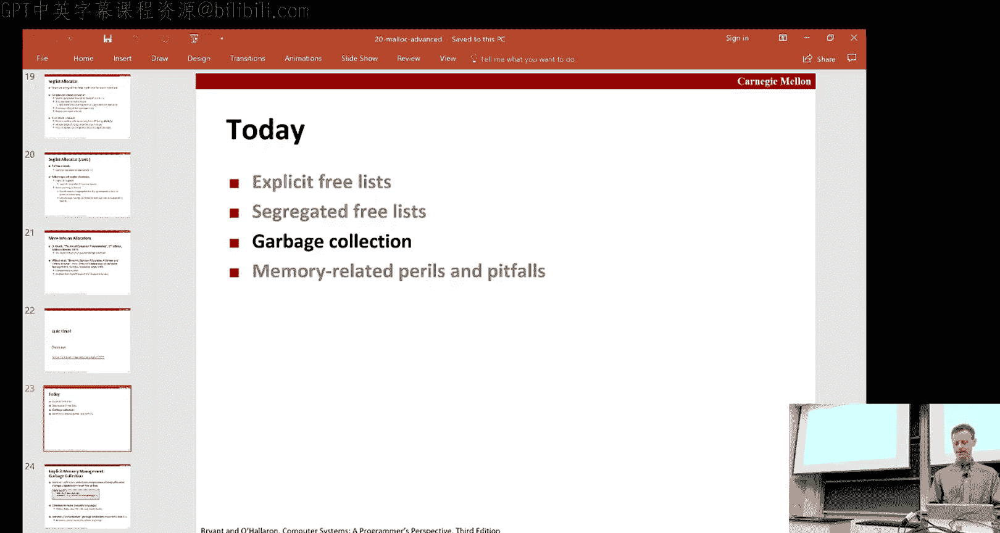
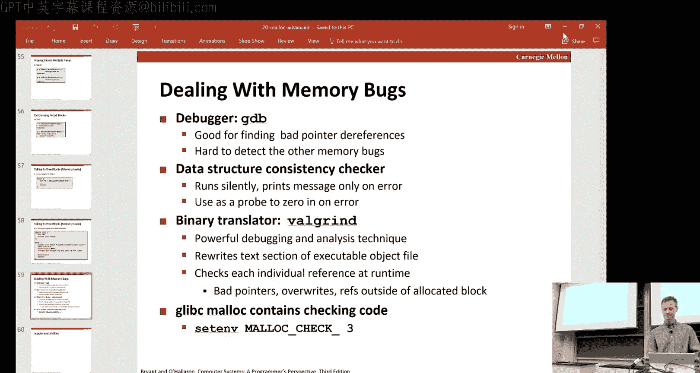

# 动态内存分配：第2讲：高级分配器与垃圾回收 🧠

在本节课中，我们将学习动态内存分配的高级主题，包括显式空闲链表、分离空闲链表以及垃圾回收的基本概念。我们还将探讨与内存相关的常见陷阱和错误。

---

## 概述 📋

上一讲我们介绍了动态内存分配的基础，特别是隐式空闲链表。我们讨论了分配器如何管理堆内存，以及分配、释放、分割和合并等基本操作。在本讲中，我们将深入探讨更高效的分配策略，并了解自动内存管理（垃圾回收）的基本原理。

---

## 显式空闲链表 📊

上一节我们介绍了隐式空闲链表，本节中我们来看看显式空闲链表。显式空闲链表通过在每个空闲块中存储前驱和后继指针，将所有空闲块组织成一个显式的双向链表。

### 数据结构

在显式空闲链表中，每个空闲块不仅包含头部信息（大小和分配位），还包含两个指针：
*   `pred`：指向前一个空闲块。
*   `succ`：指向后一个空闲块。

这使得分配器可以直接遍历空闲块，而无需检查已分配的块。

### 分配操作

当需要分配内存时，分配器在显式空闲链表中搜索合适的空闲块。如果找到的块比请求的大小大，则进行分割：一部分用于满足请求（变为已分配块），剩余部分作为一个新的、更小的空闲块留在链表中。这涉及到更新链表指针，将新空闲块正确链接。

### 释放与合并操作

释放一个块时，需要将其插入到空闲链表中。与隐式链表类似，释放时可能发生合并。以下是四种合并情况：

1.  **前后块都已分配**：只需将释放的块插入链表（例如，插入到链表头部）。
2.  **后一个块空闲**：将释放的块与后一个空闲块合并，形成一个更大的空闲块，然后将其插入链表。
3.  **前一个块空闲**：将释放的块与前一个空闲块合并，形成一个更大的空闲块，然后将其插入链表。
4.  **前后块都空闲**：将释放的块与前后两个空闲块合并，形成一个更大的空闲块，然后将其插入链表。

合并操作需要将被合并的旧空闲块从链表中“拼接”出去，然后将新合并的大块插入链表。

### 性能与权衡

与隐式链表相比，显式空闲链表的优势在于：
*   **分配更快**：搜索只遍历空闲块，而非所有块，尤其在内存使用率高时优势明显。
*   **释放稍复杂**：由于需要维护链表指针，释放（包括合并）操作比隐式链表稍复杂。
*   **内存开销**：每个空闲块需要额外的空间存储两个指针，这可能增加内部碎片。

---

## 分离空闲链表 🗂️

为了进一步提升性能，现代分配器常使用分离空闲链表。其核心思想是将空闲块按大小分类，每个大小类维护一个独立的空闲链表。

### 工作原理

分配器预先定义一系列大小类（例如，1-2字节、3字节、4字节、5-8字节、9+字节等）。当收到分配请求时：
1.  根据请求大小确定其所属的大小类。
2.  在该大小类的空闲链表中搜索合适的块。
3.  如果找到，则进行分配（可能分割）。
4.  如果当前大小类的链表中没有合适块，则向更大的大小类搜索，直到找到可用块或向操作系统申请更多堆内存（通过`sbrk`）。

释放块时，将其插入对应大小类的空闲链表，并检查合并机会。合并后产生的大块可能属于另一个大小类，需要移动到相应的链表中。

### 优势

分离空闲链表结合了多种策略的优点：
*   **近似最佳适配**：通过按大小分类，首次适配搜索在各自大小类内近似于最佳适配，减少了外部碎片。
*   **对数级搜索时间**：如果按2的幂次划分大小类，搜索时间是对数级的。
*   **减少搜索开销**：每个链表更短，搜索更快。

---

## 垃圾回收 🗑️

对于像Java这样的语言，程序员无需手动释放内存，而是由垃圾回收器自动回收不再使用的内存（垃圾）。

### 基本概念

垃圾回收器将内存视为一个有向图：
*   **节点**：堆上的每个内存块。
*   **边**：块内的指针。
*   **根节点**：指向堆内存的指针的存储位置，如寄存器、栈变量、全局变量。这些是程序访问堆的唯一起点。

如果一个堆内存块无法从任意根节点通过指针路径到达，则该块被视为垃圾，可以被安全回收。

### 标记-清扫算法

标记-清扫是一种经典的垃圾回收算法，分为两个阶段：

1.  **标记阶段**：从所有根节点开始，遍历所有可达的内存块，并标记它们（例如，设置一个标记位）。
2.  **清扫阶段**：线性扫描整个堆。对于每个块，如果它被标记，则清除标记位（为下一轮回收准备）。如果它未被标记且是已分配的，则将其释放（即，视为垃圾回收）。

### 保守式垃圾回收（针对C/C++）

C/C++语言没有严格的类型信息，指针可以伪装成整数，也可以进行指针运算。保守式垃圾回收器假设：
*   任何看起来像指针的位模式都被视为指针。
*   如果指针指向一个块的内部（而非头部），则整个块都被认为是可达的。
*   它不能移动内存块。

其正确性依赖于程序行为良好（例如，指针运算不越界访问其他无关内存块）。为了找到指针所属块的头部，可以使用平衡二叉树等数据结构，以块起始地址为键进行快速查找。

---

## 常见的内存相关陷阱与错误 ⚠️

以下是动态内存管理中常见的七类错误：

1.  **解引用错误指针**：例如，向`scanf`传递变量的值而非地址。
2.  **读取未初始化的内存**：`malloc`不初始化内存，直接使用分配的内存可能导致未定义行为。
3.  **覆盖内存**：例如，分配不足的空间（`malloc(sizeof(int))`误写为`malloc(sizeof(int*))`），导致写入越界。
4.  **缓冲区溢出**：经典错误，如使用`strcpy`时未为目标字符串分配足够的空间（忘记为终止符`\0`分配空间）。
5.  **误解指针运算**：指针加减是以指向类型的大小为单位的。
6.  **引用不存在的变量**：返回指向局部变量的指针。
7.  **内存管理错误**：
    *   **重复释放**：多次释放同一块内存。
    *   **释放错误地址**：例如，在复杂的指针操作后释放了错误的指针。
    *   **内存泄漏**：分配内存后忘记释放。
    *   **不完整的释放**：例如，只释放了链表的头节点，而未释放链表中的后续节点。

### 调试工具

*   **GDB**：用于调试，但对某些内存错误检测能力有限。
*   **Valgrind**：强大的二进制插桩工具，可以检测内存泄漏、越界访问、使用未初始化内存等多种错误，无需源代码。
*   **自定义检查器**：为特定数据结构（如堆）编写一致性检查函数。
*   **Glibc malloc 检查**：设置环境变量（如`MALLOC_CHECK_`）可以让glibc的malloc实现进行一些基本的错误检查。

---

## 总结 🎯

本节课中我们一起学习了动态内存分配的高级技术。我们从显式空闲链表开始，了解了如何通过维护显式的双向链表来提高分配效率。接着，我们探讨了分离空闲链表，这是一种通过按大小分类管理空闲块来近似实现最佳适配并提升性能的策略。然后，我们介绍了垃圾回收的基本思想，特别是标记-清扫算法，以及如何将其应用于C/C++程序的保守式垃圾回收。最后，我们回顾了动态内存编程中常见的陷阱和错误，并了解了一些用于检测和调试这些错误的工具。掌握这些概念和技术对于编写正确、高效和健壮的系统程序至关重要。