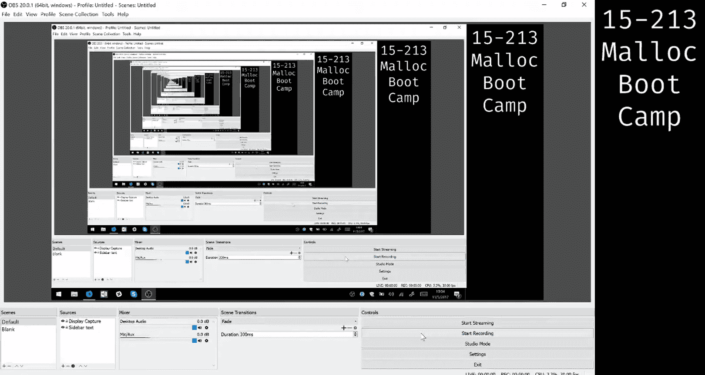
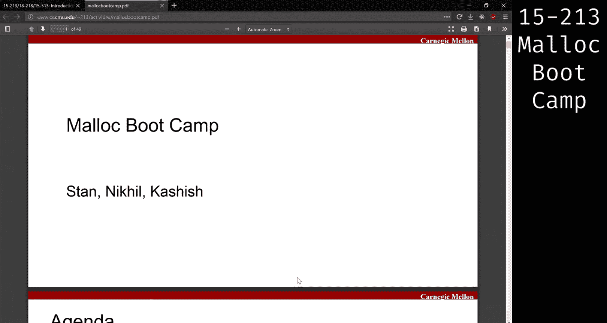
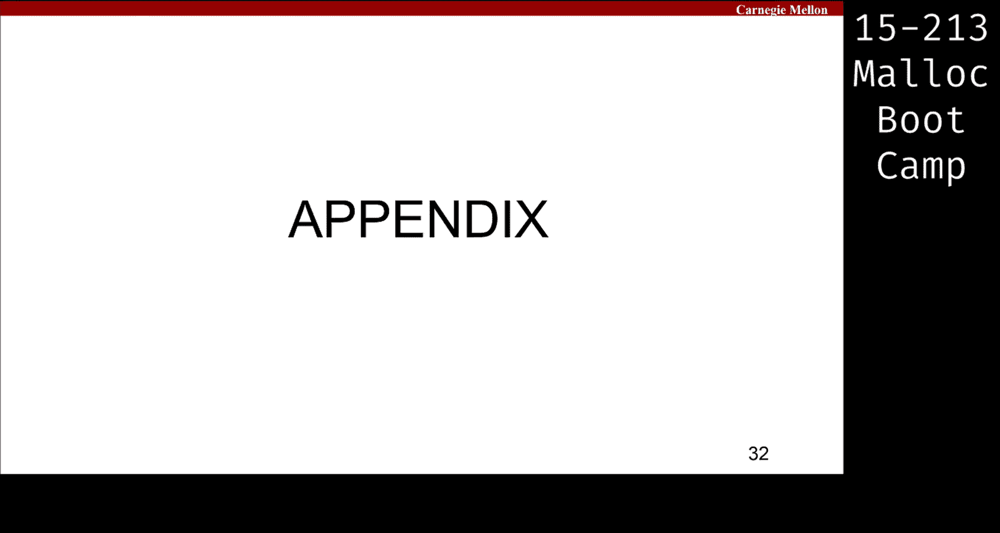

# CMU 15-213 计算机系统导论：第25讲：Malloc 实验指导

在本节课中，我们将学习如何实现一个动态内存分配器（`malloc`），涵盖核心概念、设计决策和调试技巧。我们将从基础概念开始，逐步深入到更高级的优化策略。

## 概述

动态内存分配用于在程序运行时，当所需内存大小在编译时未知的情况下申请内存。本实验要求你实现 `malloc`、`calloc`、`realloc` 和 `free` 函数。我们将讨论堆的结构、碎片化、块的分裂与合并，以及如何通过不同的数据结构和策略来提高分配器的吞吐量和内存利用率。

## 动态内存分配基础

当我们在编译时无法确定所需内存大小时，就需要使用动态内存。这涉及到 `malloc`、`calloc`、`realloc` 和 `free` 等函数调用，这些正是你需要在实验中实现的。

核心概念包括：
*   **堆（Heap）**：动态内存分配的区域。
*   **有效载荷（Payload）**：分配给用户的实际内存区域。
*   **碎片化（Fragmentation）**：分为内部碎片（块内浪费的空间）和外部碎片（堆中分散的、无法使用的空闲空间）。
*   **分裂（Splitting）**：将一个大的空闲块分割，一部分用于分配，剩余部分作为新的空闲块。
*   **合并（Coalescing）**：将相邻的空闲块合并成一个更大的空闲块。

## 堆的初始结构与扩展

在 `mm_init` 函数中，堆的初始结构包含一个**序言块（Prologue）**和一个**尾声块（Epilogue）**，它们作为堆的边界标记。所有分配和释放的块都位于这两个块之间。

当堆中没有足够大的空闲块来满足分配请求时，我们需要扩展堆。这是通过 `sbrk` 系统调用来完成的。

**关键点**：
*   整个块的大小（包括头部和脚部）必须是 **16 字节对齐**的。
*   有效载荷的大小**不必**是 16 的倍数。

扩展堆时，你需要决定每次调用 `sbrk` 请求的字节数（`chunk_size`）。这是一个重要的权衡：
*   如果 `chunk_size` 太小，你会频繁调用昂贵的 `sbrk`，降低吞吐量。
*   如果 `chunk_size` 太大，你可能申请了远多于实际分配的内存，导致内存利用率得分很低。

目前没有确定的公式来计算最优的 `chunk_size`，需要通过实验（尝试不同的值并观察评分）来找到合适的数值。

## 显式空闲链表

基线代码使用了**隐式空闲链表**，它需要遍历堆中的所有块（包括已分配块）来寻找空闲块。为了提高效率，你应该实现**显式空闲链表**。

在显式空闲链表中，我们只维护一个**空闲块**的链表。每个空闲块除了存储大小和分配状态的头部/脚部外，还需要存储指向链表中下一个和前一个空闲块的指针（`next` 和 `prev`），形成一个双向链表。

**优势**：分配时只需遍历空闲块链表，跳过了所有已分配块，显著提高了搜索速度（吞吐量）。

### 块的分裂策略

当找到一个足够大的空闲块来满足分配请求时，你需要决定是分配整个块，还是将其分裂。

**分裂规则**：除非剩余空间不足以形成一个**最小块**（包含头部、脚部、指针等元数据所需的最小空间），否则就应该分裂。如果剩余空间小于最小块大小，则分配整个块，避免产生无法使用的碎片。

### 块的合并策略

合并（Coalescing）在显式链表中的逻辑与隐式链表类似，但需要注意：你必须检查**物理上相邻**的前后块，而不是链表中逻辑相邻的（`next`/`prev`指向的）块。

合并时有四种情况需要考虑：
1.  前后块都已分配：无法合并。
2.  前一块空闲，后一块已分配：与前一块合并。
3.  前一块已分配，后一块空闲：与后一块合并。
4.  前后块都空闲：将三块合并为一个大空闲块。

合并时，除了更新合并后块的头部和脚部大小及分配位，还必须更新显式链表中的 `next` 和 `prev` 指针，以保持链表的一致性。

## 设计考量与优化

### 1. 放置策略

寻找空闲块时，你有几种策略选择：
*   **首次适配（First Fit）**：选择第一个足够大的块。**速度快**，但可能导致**外部碎片增多**。
*   **最佳适配（Best Fit）**：选择大小最接近请求的块。**内存利用率高**，但需要遍历整个空闲链表，**速度慢**。
*   **近似适配（Good Enough Fit）**：一种折中方案。例如，在查找一定数量的块后，选择一个足够好的块。这需要在吞吐量和利用率之间进行权衡，需要通过实验调整。

### 2. 空闲链表顺序

当你释放一个块并将其插入空闲链表时，需要决定插入的位置：
*   按地址顺序插入
*   按大小顺序插入
*   总是插入到链表头部

不同的插入策略会影响后续分配的效率，这也是一个可以实验优化的点。

### 3. 合并时机

你可以选择在释放块时立即合并相邻空闲块（立即合并），也可以推迟合并，例如在分配失败搜索空闲块时再进行合并。不同的时机对性能有不同影响。

## 高级优化策略（供最终提交参考）

对于检查点，你主要关注实现显式链表并提高吞吐量。对于最终提交，重点将转向大幅提高内存利用率。

### 1. 分离空闲链表

这是显式链表的一种推广。我们维护**多个**空闲链表，每个链表负责一个特定大小范围（大小类）的空闲块。

**例如**：
*   链表1：大小 1-32 字节的块
*   链表2：大小 33-64 字节的块
*   链表3：大小 65-256 字节的块
*   ...

当分配一个大小为 `size` 的块时，你只需在对应的 `size` 所在的大小类链表（以及可能更大的链表）中搜索，避免了遍历大量不相关的小块，**极大提升了搜索速度**。

**实现注意**：
*   你需要决定大小类的划分（例如2的幂次）。
*   全局变量空间有限（128字节），需合理存储多个链表的头指针。
*   合并块时，块的大小会改变，需要将其从旧的大小类链表中移除，并插入到新的大小类链表中。

### 2. 无脚部优化

在已分配的块中，脚部（Footer）可能不是必需的。脚部主要用于合并时查找前一个块的大小。但如果**前一个块是已分配的**，我们根本不需要与它合并，因此也就不需要它的脚部信息。

**优化方法**：在块的头部中用一个额外的位（例如，借用大小字段的未用位）来指示**前一个块是否空闲**。
*   如果前一个块空闲（该位为0），则可以通过当前块指针减去前一个块的脚部中存储的大小来找到前一个块起始位置，并进行合并。
*   如果前一个块已分配（该位为1），则无需任何操作。

这样，**已分配块可以省去脚部**，将节省的8字节用于有效载荷，对于分配大量小对象（如链表节点）的情况，能显著减少内部碎片，提高利用率。

### 3. 减小最小块大小

基线实现的最小块大小（如32字节）对于分配非常小的对象（如8字节）会造成严重的内部碎片。为了减少内部碎片，可以尝试减小最小块大小。

**挑战**：更小的块可能无法容纳显式链表所需的两个指针（`next` 和 `prev`）。
**可能的解决方案**：
*   对于小块，使用单链表而非双链表（牺牲删除速度）。
*   重新设计元数据，例如尝试去掉小块的脚部甚至头部（需要非常精巧的设计）。
*   接受对小块的O(N)删除操作，因为小块链表可能很短。

## 代码模块化与调试

### 代码模块化的重要性

*   **编写通用函数**：为链表操作（插入、删除）编写通用函数，而不是在每个需要的地方复制粘贴代码。这在实现分离链表时尤为重要。
*   **避免重复代码**：如果你有复制代码的冲动，应该将其重构为函数。
*   **使用常量数组**：对于大小类等配置，使用常量数组并通过循环判断，而不是一连串的 `if-else` 语句。
*   **好处**：模块化代码更易于阅读、调试和修改，能降低心智负担，让你更专注于算法逻辑。

### 使用GDB进行调试

动态内存分配的Bug常常难以定位，`printf` 在大量分配下不实用。**GDB是你最强大的调试工具**。

*   **基本命令**：`run`, `break`, `step`, `next`, `backtrace`, `frame`, `print`。
*   **条件断点**：`break ... if condition`，只在特定条件下暂停。
*   **观察点**：`watch variable` 或 `watch *address`，监控变量或内存地址的变化，当值被修改时暂停。这对于发现元数据被意外覆盖非常有用。
*   **在GDB中调用函数**：你可以在GDB中直接调用你编写的堆打印函数，而不需要重新编译程序，便于动态检查状态。

### 实现堆检查器

一个强大、全面的堆检查器（`heap checker`）可以节省你大量的调试时间。

堆检查器应详尽地验证你实现的所有不变量，它不需要高效，仅用于调试。应在开发早期就编写，并随着实现更新。

需要检查的不变量包括：

**块级别**：
*   块地址对齐（16字节）。
*   有效载荷在堆边界内。
*   头部和脚部的大小、分配位信息匹配。
*   没有两个连续的空闲块（确保合并正确）。

**链表级别**：
*   双向链表指针的一致性（从A通过`next`到B，则从B通过`prev`应能回到A）。
*   空闲链表中的块计数与堆中实际遍历得到的空闲块数一致。
*   （对于分离链表）每个空闲块都位于正确的大小类链表中。

**堆整体级别**：
*   所有块的大小之和等于通过`sbrk`申请的堆总大小。
*   序言块和尾声块位于堆的起始和末尾。

### 如何有效求助

当遇到问题寻求帮助时（如课程助教），请提供具体信息：
1.  **描述清晰**：不要只说“我的程序段错误”。说明在运行哪个测试、进行什么操作时发生错误。
2.  **提供上下文**：使用GDB的 `backtrace` 给出函数调用栈。
3.  **展示你的检查器**：说明你的堆检查器在哪个环节报告了哪个不变量被违反。这表明你已经做了深入的调试。
4.  **使用“橡皮鸭调试法”**：向他人（甚至一个玩偶）解释你的代码逻辑，往往能在解释过程中自己发现错误。

## 总结

本节课我们一起学习了 `malloc` 实验的核心内容。我们从动态内存分配的基本概念和堆结构出发，详细探讨了**显式空闲链表**的实现，包括块的分裂与合并策略。我们还分析了影响分配器性能的多种**设计考量**，如放置策略、链表顺序和合并时机。

对于追求更高性能的最终提交，我们介绍了**分离空闲链表**、**无脚部优化**和**减小最小块大小**等高级优化技术，这些能显著提升内存利用率。

最后，我们强调了**代码模块化**的重要性，并深入讲解了如何使用 **GDB** 和编写**堆检查器** 来高效调试复杂的内存分配错误。请务必尽早开始实验，留出充足时间进行迭代、测试和优化。祝你好运！