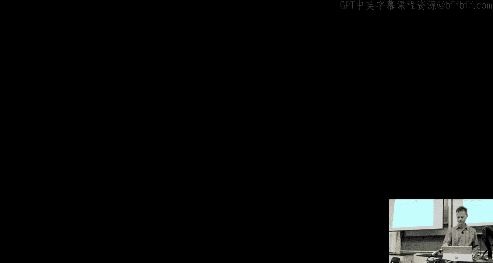
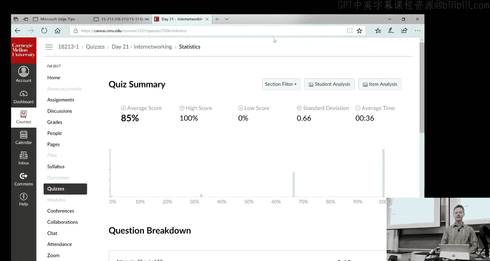
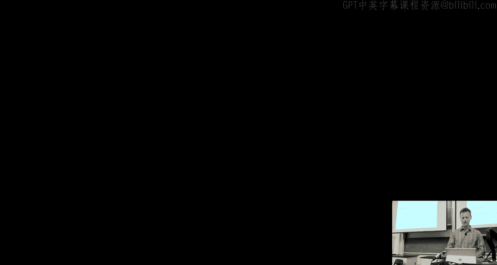
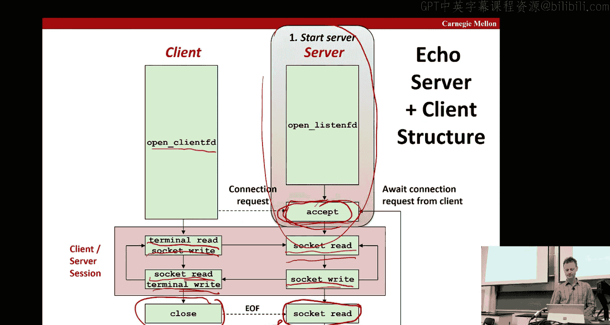

# CMU《计算机系统导论｜CMU 15-213，15-513，14-513 Introduction to Computer Systems 2017 p26 26 - Network Programming (Part I) -BV17jcReyETC_p26-

Okay， I'm glad you were all here on class some time。啊。

So today we're going to transition into talking about。That was programming。In particular。

What well be the core material that you need for the approximately。Final lab in the course。

To review for some of you， or maybe this is the first time you've thought about this。

AClient server model is the typical model for network applications。 you have some sort of server。

Process that's running。And one or more it's serving one more client hosts。There's this one here。

And the server is managing some sort of resource。And it provides a service using that resource。

 so if client sends a request， then the server handle that request and returns the response back to the client。

The server is activated by the fact that the client makes the request。

 otherwise it's a sister passive。And it says think of a vending machine。

 right until you actually put your money in and press the button。

 the vending machine just sits there doing nothing。Okay， important to note that these are processes。

 typically we think of them。a client running on one host machine and the server running on another host machine。

 but you could have multiple client processes running on the same host。

 you could have a client running the same host as the server and so forth。

So we've seen many versus of this picture of this course， just a reminder that the network piece。

I's here and it's just off the same IO bus that for instance the disc controller is。😔，Okay。

 so the path is， you know， through the。Through the Iowa Bridge， to the Iowa bus。

 to the network vector。Okay， so in terms of networks， we think of them as this hier heat。

Of boxes and buyers。And at the first level。It called at least in Microsoft Technologyology。

 although I'm not sure how widespread the name is beyond that， which known as the systemary network。

Which will span。You know， a cluster or a machine room。

I put the elastic asterisks here because another type of。Setting in which the SAN。

 the sand areviation used is in the storage jury network。Okay， that's something that a dis provider。

 sort solutions provider， storage solutions providerder。

 would have to enable a whole bunch of your computers to talk to sort of dedicated fancy storage devices。

It has the same sandN abbreviation， which is why I highly did， but for the purposes of this class。

 we're going to talk about the systemary network。Then you have which one is a local area network which can span。

 say entire campus or a building and says here Ethernet is an example。

Then you have the wider network which can span all across the country and all around the world。啊。

Okay。And then there's the notion of an internet network or an internet for short。

 which is just a interconnected set of these networks okay and in this course。

 we want to make distinction between sort of the lowercase eye internet。

Which is just the generic term for any network that connects up other， say， multiple lands。

And so forth， and the internet that we're all so familiar with， which is with a capital eye。

In this course， sort of the global IP internet。Okay。

 so let's see how he's built an in for the ground up。

 you start with an ethernet segment that's based on this hub。Okay。And you have the hosts。

 these are just the machines。These are just the different machines and they're connected through the hub by twisted pairs of wires。

 right？And the connection here is called a port。Okay。And it spans a room or Florida a building。

The EthannetEach Ethernet adapter has a unique 48 bit of address。

You may have heard of it called a Mac address。对。And then a host can send。You know， bits this way。

Packaging up something that's called a frame。And then what the hub does is it just。

Basically broadcast。 So， so it gets whatever bits it sees， whatever frames it sees。

 and it sends it along to all the hosts。So every host sees every bit。Okay， now just an aside。

 this is sort of the classic way to sort of build up from the bottom these networks。

 but for most installations today， people even't bother with hubs， they used to be have sort of。

economic advantage to having these hubs， but now bridges that we're going to talk about next switch is the routers to become cheap enough that people tend not to even bother with hubs。

So what are one of these bridges a bridge？Whi is like shown here， connects a series of hubs or。

And you can have， for instance， you know， this bridge。

Connect these hubs that are all on 100 meabbit the second length。And similarly down here。

 but between these two bridges， we actually have a faster connection for second。

And what's interesting here， we said that the hubs are kind of。you know， naive about things。

 they'll just take whatever gets sent to them and broadcast it on all the all the other hosts on the hub the bridges are a little bit smarter they figure out that you know which which hosts are reachable across which of their ports and then they're only broadcasting information where that's。

Where the host is， so for instance， if you were going to send from up here to down here from A to C。

 for instance， then it would go ahead， this bridge would go ahead and send that information along here and then would go this way。

 so you be more routed， but for instance it would not send it along this path here。Okay。

So it's a little bit smarter than just broadcasting。Okay， so for simplicity。

 often see pictures that look like this where the hubs， bridges and wires。

 are all just sort of collapsed into just a single thing that looks like a long bus。

And then a bunch of posts connected off of that。So if that's our picture of a localary network that if we take。

A couple of these guys。And hook them up， that's how we get the next level up， okay。They are routers。

 you can have routers here。All right， and these routers are， as the name implies。

 they're responsible for routing the traffic from this local area network to the southern local area network。

And the interesting thing is that these lands themselves。Can be， you know。

 completely different types right， so one may be an ethernet， like we said before， but one may be。

 you know a T1 link， right a release。By， powerful link， and so forth。And so it says， we'll see。

 it's the job of the protocol that the router is going to use to be able to do these kinds of translations between sort of what this land speaks versus what this land speaks。

 right？And then this is starting a little more and more like a picture maybe you're familiar with。

 you have a host， you know all around the world and then you have these routers in the middle。

 I mean obviously the hosts are interspersed as well。

 and then you have routes between these routers right so paths you can take between these routers。

And so in general， lowercase internet that's。What we describe is just quite connecting up。呃。you know。

 a collection of these local routers， and for instance you might find something like that within a large company they may have their own internet that's not the public internet at all。

 but it's a way of connecting up the machines inside inside say a large corporate building。Okay。

 and so if this host wants to send to this other host。

 then there's just a you know hop by hop routing process that takes place。

And what this picture is showing is that there are multiple routes between any pairs。

 which is good in case there's like congestion along one route or failure along one route。

 and so what can happen is that even between this host to this host。

 you can have some of the packets go along one route and some of the packets go along the other route。

And as a result， it's up to the overall protocol that we'll talk about in a minute to sort that all out。

 to make sure that you see the packets in the order they were sent。嗯。

So this is why I was just mentioning that if you have these incompatible lands。😔，Okay。

 the don't don'ts。You know， have the same features and the same protocols and so forth。Internally。

 then you need an overarching protocol that will allow each of these lands to speak to this protocol。

And it's just a set of rules that governs how host routers should cooperate when they transfer data。

And therefore， it sort of abstracts away or hides away or smooths away the differences between different node。

So in the next level of the tail， what do we need， we need a way to what's called name。

Something we want to send a message to okay， so that's a naming scheme。

 a need way for one host to be able to identify。Another host。

Such that they can communicate okay that's a naming scheme and then the other thing it needs is some delivery mechanism right some way to actually get packets from one host to the other from the source of the destination。

So a naming scheme is based on what's called host addresses。

 so every machine will have a host address。And。So， the thing about the host address is that uniquely identifies the host。

 okay？You can have， of course。Multiple host address for the same host。

 but you can't have a single host address。Refer to more than one house。Okay。

 that's what we mean by you to idifies you can have multiple ones mapped in the same machine。

 but you can't have the。The other we around。Okay， so delivery mechanism。

 we talk about this notion of a packet。In a packet， as you may have heard。

 theres always a header part and a payload part and the payload part is just the data and the header part is the routing information。

 so it includes things like the packet size。And the source and the destination， okay。

 what's the host address where this package is coming from and what's the host address of where it's headed？

All right， so here's a little picture we have our two lands and we have a router。

 okay very simple in this case， and so the client wants to send some data and the protocol software that's running with respect to this land says。

 okay， I'm going to put that put a packet header on it， internet packet header。

 but then for purposes within this land， I'm going to have what's called a frame header。

So that's specific to the land or there's a few families of them。

 but it can be specific to that family of lands。Okay。

 and so this this header is used to route sort of。This first half of the journey。

And that gets sent to the router and then the router has to know to these translations so it doesn't know how to convert。

From this frame header to the one that this second lane uses， so it could be very different。

All right， and then also needs know how to interpret the packet header and route the thing the right place and eventually it gets to this this land adapter who will。

呃。Return to the political software。That will strip off the packet header and the frame header and return the data or deliver the data to the host。

给你的 question手上来。キス。Why is that necessary if it's just being replaced？

Because the frame header is what's used to within the land。

 so I mentioned an earlier slide that each land communicates between the hosts like through the hubs and bridges in units of what's called frames。

 and those frames have headers and payloads。And so all that werere addinging eternally to a particular land。

You know， whatever path it has to take needs to have is the units of frames it needs to have a frameheader。

So sort of it's equivalent to the packet header within this lamp， right？

And then once you get out into the greater internet， then you need the packet of。OkayYes。

The packet header is going to contain the information needed to do sort the global routing。Right。

 so to get to so in this case， it's just the。Right。

They have very thin folks such as the packet size and the source and the destination dresses。Okay。

 the source address is needed。For identification， basically。

 so the other side knows who sent this message，D is used for routing on the way。Okay。The frame。

Header is similar。But the， the。嗯。The， you know， the sort of the。

The information is relevant to routing within this particular lane。So whatever the protocol is。For。

Putting in headers and so for instance， you can imagine that these headers here could use。

Local needs right for these hosts could have a naming convention， have their own naming convention。

For if I have a localary network and I have whatever three servers， three host machines。

And I give them names that are local to me， I just give them names。

 and then that is what these frame headers use to route locally。

 if they don't have to be globally unique names。Okay， but these guys either use the glue you yes。

So in this process， there's there time。自店。Right， so if we'd shown more hops， there'd be no need for。

I mean you can strip this frame header off as soon as you started the routing part。

 and there's a bunch of hops。boom boom and it's only when you arrived at the land here would you now。

 for instance， maybe know， you do a look up and say oh。

 what is the frame had of protocol I need for this particular land， now I'm here ready to the packet。

 and that's when you add this on。So yeah， the picture was simplified because there was basically just the one hop。

Yes。発成で。嗯。对。Good catch okay。Good， yeah， you wouldn't be happy with that network。

It's right only networking， okay。Good。So there's a number of issues that are gloss over by this simple example in additional the ones we just talked about。

 how do the routers know where to for the frames， how are the routers informed when the topology network changes？

You know， one route goes down and gives you place with another route， for instance。

 where just a rocket gets added， new rock gets added。

You know what if the different networks have different maximum frame sizes right so one says that you know my frames are tiny。

 one says my frames are big and the one' sending tries to send a big one to the one who's tiny。

And you've got to break them up and so forth， and what if a package is lost along the way？Okay。

 so all these kinds of questions are entire area of computer science。

Call computer networking and there's a whole course you can take on that to discuss this and many other issues of computer networking。

But in this course， we're just going to focus on the things that。It matter of the program。Okay。

 so as。All right， so the。So let's talk about now the uppercase internet。

And the uppercase internet we're all familiar with is based on these CCPI protocol families。

So the bottom level of that is the IP internet protocol。anybody know what that does？

So it provides this basic naming scheme that gets you from a host to a host from machine and machine。

And the capability of delivering packets， which it calls datagrams from the host to host。

 so we haven't gotten from a process process of sc from the machine machine。

And then there's two types of protocols on top of IP， one is UDP and the other is TCP。

AndTCP is the one that most us are familiar with， but UDP is used sometimes to avoid somebody the overheadheads a TCP。

 so if you want something that has higher performance。

And you're okay in your application for whatever reason， with some amount of packet loss。

 then you might go to the UDP route。Okay， so this as suppose to host to host does go process the process which is what you want right so for instance client process we talked about server process on that first slide but it is unreliable okay it's the best effort others okay it doesn't purposely try to be to Steve or anything like that。

 but it's just sort of best effort okay it's going to send you packet along its way it's going to avoid all the overheads the well of the TCP。

But if there's some congestion a packet gets dropped， then you know your'。

That's a possibility and your application is expected。Okay。

 so far more used is what's known as TCP because it basically it still does the process to process as a UDP。

 but it's reliable in the sense that if you send packets from a source of destination。

 then eventually it'll get in the TCP protocol will。

You do re issues and so forth in order to make sure that happens。

And it also has this notion of a connection， okay it's kind of like a phone call right。

 you've connected someone making a call to somebody receiving the call and you're going to send the。

ToPackets along this connection。Okay， now in UniX， as we've seen in the past。

 basically everything is mapped to a file and including。

Things over the network product over the network。Okay， so youre when we get into it in a few slides。

 you'll see it's a sort of a familiar interface as if you're just reading writing files。

 but instead you're going to be reading writing to。

Things that look like files but theyre really connections。

And it's going to use something that's called this socket interface that looks like。Okay， so。

Here's how it looks， you have a client， has some user code。

Va socket interface will make you know expressed desires things to go be read and written to the network via sockets interface。

 consistent calls that go into the kernel， the kernel is running the TCPIP protocol with。

With the server on the other end， you've got that network adapter we showed before and roing over the internet。

And so forth on this slide。Okay。So the actual TCP IP protocol that says trying to ensure this reliable delivery of these packets is basically hidden。

From the the user on the user code。Okay， so。From the reporter's point of view。

 posts are mapped using 32 B IP addresses。Okay， now you probably haven't seen them expressed very often in sort of third2bit。

Notation， you've probably seen them stress much more often in this form。

 the conventional way of writing out an IP address。

 which is basically just that two bytes at a time you write out inimal notation what the things are。

So that's why you see things that look like 128。2。20 3。179。嗯。So these IP addresses。

 some subset of them are mapped to internet domain names。

 okay this is something you're also familiar with from doing web browsing or anything right so like wwwcs。

cvedu。Is the domain name that this IP address is mapped to？Okay。

 and process on one host communicates to process another host over this connection。Okay。

 so when I talk about 32 bit IP addresses， it's the longstand protocol IPV4。Okay。

And way back in 1996， so what is that 21 years ago？

People said that's not going to be enough addresses， enough bits for addresses。

 let's come up with 128 bit。Addresses， and so they came up with IP Ver 6。

 which had other nice features as well。 But interesting thing was that the adoption has been almost nonex。

 right from 1996 to 2014。Only 4% of access to Google Services were actually using the new IPV6。Okay。

Now， in the very recent history， it looks like it's trending up and so maybe it's finally taking hold that people will switch to 128 bit。

IPV6 addresses， but for now we。We won worry about that so much。

 we'll keep in the book and the lectures the focus on IPV4 where internet IP justice are 32 statess。

But importantly， we're going to talk about how you could write your code that's protocol independent that no matter whether your proxy and your proxy lab is talking to something that's IPV4 or IPV6。

 it's going to work okay and it's basically because we'll have rapid functions that will hide。

The difference from you， so you don't have to worry about whether it's IPV4 or IPV6。All right。

 so that was the side。So these 32 bit IP addresses are stored in this structure。

Called the IP address structure。嗯。And it just contains a 32 bit unsigned address。嗯。

So one important thing， we mentioned this when we talked way back about bite orders。😔。

Most everything that you have been working with so far has been little Indian。Okay。

 but we mentioned back then and we' reminding you again that network packets are the other way around the big ending。

Okay， so the first bite is the。You know， the most significant bits of the third two bit。All right。

 good。Oh， this is just talking about the data decimation I mentioned that。You take， you take these。

Pieces like F2 and you said and the decimal number for F2 is 242。

And then there's functions that were provided， get address info and get name info that we'll talk about at the very end of this lecture。

 let's we went out of time， and then that allow you to convert between IP addresseses and dotted decimal format。

 okay you give it one and get back to the other。So you're probably familiar with thinking about how these domain addresses work as this kind of hierarchy。

 so we start with a root and then we have the dotedduu and the dotcoms and so forth under dotedduu。

 you'd have things like CMU， CMU。edduu right under CMU， you'd have maybe CS and ECE and under CS。

 you have our ICS。And then things like whale shark and all the other sharks， PDL is a CS and WWW。

 and eventually you get to a relief in this and you get the full IP address in the dotted format。

And this is also showing like Amazon。com， wwamazon。com， this is the IPHS。For Amazon。com。Okay。

 so you could talk about first level domains， second level domains， third level domainans。

Based on this kind of park。这一块始子呢。So DNS， you may have heard of， it stands for domain naming System。

Mainly you hear about it when it's not working， okay？So if you're having trouble you know。

 connecting to anything， sometimes it's because the DNS server is。

Congested or not working or whatever， and so you're not able to get the translations。啊。

So the DNS maintains the mapping between these IP addresses。And。And the names， okay。

So it's just this collection of host entries。Again。

 which are just a set of domain names and IP addresses。And it just allows you to map Trina。嗯。

So there's this function called Ens Lookup。Which allows you to。You know， specify a。嗯。You know， a。www。

 a name and get back its IP address in the datat format。Okay。

 and so we're going to look at some examples in this slide and the next slide。

The first example I want to point out is that there's always every host has a way of talking about itself。

😔，3。I mean， you could talk about。As a host， you can talk about yourself by actually knowing what your。

Domain name really is， but then if you take that code it's not portable right every time I move that code to a different machine。

 then I'd have to look up oh well what's my IP address and plug it in there so to avoid all that complication there's this magic one 127。

0。0。1。Which wherever you are on whatever machine you're on， if you express that address， it means me。

 okay I'm talking about me the machine I'm currently on。

 so that could be very useful to have that whenever you want to actually refer to yourself and when you' pour on a machine。

Andy 127。00001。啊。Okay so then there's also something called host name。

 which can determine the real domain name of the local host。Okay。

 so sort of the flip of that right so this particular snippet code was obviously run on the whale shark machine。

 which is why it's returning a whale shark。Okay， and you can go backwards so for whale shark。

I can do an asset lookup and then get his IP address。Okay， and that was the。

We we short of repeat the slide。And then you can have things like。

So that's a simple case when there's this this one to one mapping。

It turns out that you can have multiple domain names。Like here。

 we're showing CS and EECS MIT the map to the same IP address。Okay。

 now I double check that this morning and still that's still the case that if you do an essay lookup on each of those。

 you'll still get the exact images。可以。So it's possible to have that kind of thing。

You can also have the flip side， which you may be familiar with if you have a really popular site like a Twitter or Google or whatever。

It's going to have a whole slew of names。Of the main of IP addresses that all correspond。 Okay。

 and so any any service has choices， right， And that's just the way of。Increasing throughput。

 balancing load and so forth。And this is just showing that when I ran the same command twice。

In this particular case， I got the exact same four， but the order got different order。

 so no big deal。Inciful。Now there are some cases where we can have a valid domain name like our ICS domain name。

 but we don't have any IP address map to that， and so if you run an NS lookup on that it'll just return nothing。

You won't see it instead of seeing a list of addresses。Your dress pulling， bh， blah， blah。

 it would just be blank， but yes if you have。Bless slide where， two things not to say my peak。

Different。I want to tell one network， one thing。Like how do you tell something to？C。mt。

ed versus EECS。Yeah， so the notion here is that they're trying to give people multiple ways of getting to the same machine。

Okay so they're not， by it's a good point by mapping them to the same IP address。

 you're basically saying there's just this one host machine that's serving both of these。😔，Yes。

 how do these like IP addresses registered like why can't I just have like Amazon's IP address if they're like some centralized。

How are these like Yeah， yeah， there's some。If you've seen commercials or things like GoDaddy and stuff like that。

 there's these companies that that sort of run the naming system and go。

For some fee though we register。You give it a domain name。

 it looks up to see if it's already claimed。😔，It's not claimed then。

Is it like a central database for？Yeah， the the。Yeah， there is there's a repository。嗯。I mean。

 DNS will have all the mappings as well。Right。Yeah。

 I'm drawn a blank on the name for that repository， but does anyone remember？But yeah， but there is。

 yeah， so you have to。You have to negotiate， I mean， originally this was all sort of done more。

Centralized， I mean， just like there was a single entity that was in charge of doing all this domain name processing。

And then they。They decided that the government didn't want to be bothered with that anymore。

 and so they sold off the rights of private companies and private companies， know again。

 if you go to like a codady or something like that。

 you'll see that the fee they charge is really small。

 but they're using it as a way to send you a zillient advertisements and things like that and try to get you to use their services for。

Like creating web pages and you know。Administrating your websites and subwayla。

 so there's ways they make money。Beyond just the that's the real way is they make money and they just sort of。

As a hook， I'll provide a service that will allow you to register a domain name addition yes。ケさアイスー。

The Internet Corporation for assigned names。Okay， yes， good。ないんですとど。这个啊。O。That makes sense， good。

 thank you。All right， okay， so we've talked about these connections right。

 like this you know point to point like a telephone call between the client the server。

 like a telephone call， it's full duplex， you can go either direction。And。Reliable。

 that's if you're doing the TCP part of the protocol。

Then what that says is the stream of by sent by the source is eventually received。

 right there may be a number of retriries and so forth。

 things could even crash or come up and then you send it much later。

But also the notion that order is maintained， okay。

So anybody know or can think of a simple way to make sure the order is maintained？

I've got these packages that' are going along different routes。

 so not arriving in the same order they were sent。You can label the packet。With。Yeah， secret。Yeah。

 so you just said this is another thing that would go in the header right you get the sequence number so you say this is you know the 10th packet along this stream is the 11 and then at the receive end you're getting these packets and you put them in order right and that's all how you know when one was missing you see  nine。

 you see 11 you wait a while 10 didn't show up you say oh okay I better tell the source that res me 10 because never show up。

はく。Okay， so a socket。呃。Is the endpoint of connection， so for any one connection。

 you have the endpoint on each end of it。And a socket address is simply just the IP address。And。

 and was called a port。So a port is a 16 bit integer， so slightly smaller。That identifies a process。

And there's two tight supports。The well known ports。

A conventions that are set up to say if this port means something， port。

25 if I'm talking to a pick a host machine on port 25， that's because I'm sending emails about email。

That's the convention if you have 4 250， port 80s， it says in the slide， that's web service。Okay。

 and I'll show you some further examples on the next slide。

But the other type report is what's called。I felt everyone。Ephemeral report， theres a e feal report。

And that's ones that come and go okay， so like if you're a server and there's a bunch of clients coming in。

 you need a port for each of those clients。Each of the connections。

Then you can automatically assign numbers and。So the East client gets his own Okay。

 so here's a list of of some of the well known surveyase support so so like we said the。Web servers。

 the port is 80 and the services is the HCTP。Okay， email servers， speak SMTP。

 you may have seen that if you try to set up your email client over port 25 as I mentioned， SHH。

 you' probably used that a lot， that's 422 FTP is 21 and EC which is I don't know how often can you use that。

 but it's good for examples in class so that's why we highlight it， it's port7。

And if you ever want to know on your， on your Linux machine， what？

Ports are already well known and established just you know more this etc cetera services file and you'll see you'll see a list。

 there's usually you know 40 of them or something not just five。给一块试的。All right。

 so picture this slide has a lot of numbers on it， but it's actually fairly conceptually easy。

 so you've got this clientlein host address that's here。Okay。

 and then we said the connections are always host address ports， so it's just repeated here。

 the red is just repeated。Okay。And similarly， you have a server。And it has this epi。

 and then I've repeated it here and here， okay。And then this is a web server， so it's port 80。

 so you talk to it by Col Port name was 80。Okay， and this client was one of these ephemeral ports。

Okay， and it just so happens， I mean it could be arbitrary， just happens that this is 512，13。Okay。

 and so that's also why it's here。Right， so this。IPS port identifies the endpoint and same over here。

 and then if you look at the parallel them， that's a connection。

 you have a connection between this guy and this guy。Okay， so a lot of numbers on this slide。

 but it's really actually only conceptually pretty straightforward what's going on。Okay。

 so you have this client and this is its。And it's trying to reach this server okay so it says okay。

 this is the server and it so happens that I want to talk to the this server runs you know many。

 this host runs many types of servers， lot't it happens to be the web server。

 that's the one I'm interested in that's why I have this aid year。

So then that's why this gets routed to the 80。Conversely， if instead you put a seven here。

 then when it got to the operating system kernel on the server host， it'd say， oh。

 I see the seven and we were route into the process that's running the Ese。Okay。

So that's why you have to append the ports because that's the only way that colonel knows sort of which process sort of process to send。

Okay， so。嗯。So as I mentioned， we're going to use a socket interface。

 it's going to look like we're just like writing the files。

 but they're going to be for any connections and that will mean you know transfer this。

 you know read this in from the network or write this out from the network。

This convention has been in place since the early 80s as part of the original and Berkeley distribution。

That's interesting that you already contained an early version of the internet protocols。

 even though the internet was just。Sort of barely ramping up。And but not just UniX。

 all the other major operating systems also use a socket interface so they all have the same conventions。

给人的 question系上面。O。So what is the second？This endpoint of communication。

 Psyche is a file of scripture， as I mentioned。嗯。So know there's going to be a client file descriptor and a server file descriptor and again by either reading or writing to that quote unquote file。

 you're actually sending along the network， so I think I talked about this。

So the main distinction between what you've seen before in terms of regular file on O。

 reading writing to files in these sockets is that they's a slightly different convention of how these things get open。

So for five it's open apply and close， but here because we're going across different hosts and so forth。

 there's more steps involved and we will see that later in the lecture。Now。They don't don good。

Because it started so late that it's closed to。Yeah， sorry。

We got started in the class 20 late of the quizzine。Is't open。とし。Look get there。All right。

 can you see now。Yes， perfect。All right， so how do people do？Excellent， all right。

 83% near that the local host was 127。0。0。1。87% near that 80 was the。Welab service。我当中。

And 85% got the networks in the properware smallest sologs。Al right。Easy stuff， good。

The questions are easier， you guys really understand this material？

这个路不够O。All right， so we're going to run through the remaininging 13 minutes as far as we get。

Sort of the concrete example of a very simple server。Called the ECIS server。

And all the server does is you just。Takes。A client will send it a message and it will just echoate it back。

Okay。And so repeatedly， the client will。Read a line from the terminal。Send to the server。

 the server will send it back to the client and then the client will print it out。😔，Okay。

 so kind of looks funny， but what's going on here is that。And this program is called Eco clientient。

 so Eco clientient gets called。As so， okay， and that， if you look here on the server side of things。

You get print back a message that says， okay， I've been connected to a machine。

 this bamboo shark machine。And here's a port number。All right。

 and then what happened was the client typed this line is being echoed。You know on a keyboard。

And that caused 26 bytes to be sent to the receiver， because that's how long that is。Okay。

 and then the server turns around and sends it back to the client and the client。

 when it gets those exact same 26 bytes back。Print it out so this line's been echo。

Okay then it goes on to C says types this one is two。And that's the 17 bytes the server receives。

 and then it gets back to the client and prints it out。Then the client exits， okay？

Out of the program and this was fine and now we execute the program。

And the second time we get connected and we happen to get different。A different number， right？

Different port number， these the film or ones？And so then in this new one we type this one is a new connection and again the server gets there's 29 bytes and aquisite back and then it gets printed on the screen。

 this one is a new connection。All right， so that's kind of how it's going to proceed。Picctorally。

 what's going on is you have what happens to the client what happens to the server。😔。

The first command was when we opened sort of the server code。That started up the server。Okay。

And so the server got already ready to accept。Client requests。

 so it's just saying are waiting passively it's like your vending machine just waiting for someone to put coins in there。

Then the client was started up。Okay， and there's some client file of scripture that it's going to do the writing to。

And it makes a connection request， that request gets accepted by the server。

 and now there is this connection established between the two。Given this connection。

 you're in this loop where you read what's been typed to the terminal。

And then you write that to a socket。That gets sent across the network。

And there's a socket read on the server side。And then as it's just echoing all it does is it turns around and writes it right back on the socket going the other way that gets read by the socket and then you write the terminal and then you repeat。

And so that's。The equivalent of the example session we saw before。Then eventually this gets closed。

Okay that sends the end of file， sorry then when the you try to do a socket read here。

 you get there's end of file and that triggers a close。

And so that connection is closed down and you go back to a state of waiting for connections。

OkayAnd this is showing a case where there's just a single client so but in general。

 the server can have accepted a whole bunch of connections and then when you do a close you drop that one in particular one but you're still servicing the others and so forth。

Any questions in that？Okay， so now I'm going to do is。Oh， sorry， just going to client， talk a client。

So here， the only thing that's changed from here to here is that we've actually spelled out what the second read and second right are at the next level of tail。

😔，Which is that the terminal read is by F gets。And later the terminal read will be by Fputs。Okay。

 and then you remember and I have slide review， we have this the Rio package that we have with a course that allows you to write。

And then read from a buffer and write and read from a buffer。Okay。

But otherwise the exact same thing happens。谁。😊，So here's the reminder。

In Rio we had read end on the right end， in this case we're just using the right end。It you know。

Never returns so it just writes out a。Up to n bytes okay so when you know exactly how many bytes you're going to write。

Wch you typically do， but it's like you're sending it。

You've collected and then you're ready to sign something from a buffer。You know。

 the size of the buffer， and so that's why you can use the word then。When we're doing reading。

 we're doing this reading from a buffer。Okay， so it reads a text line of up to maximum bytes from the file。

Donated by this file of scriptrure and stores it in this line user buff。

And especially useful reading text lines from network sockets， which is what this whole things about。

 has the stopping additions that when you hit the max L bytes read。

 you encounter and a file or you encounter a new line okay that's why it says text lines right so every time you count a new line。

 you consider that one done。Okay， so that's sort of the review。And then based on that review。

 then we can start to figure out this code All right， so so this is the on the client side。

 So what's going on here is that your。You're going to pass it to host and the port。Okay。

 and it's going to open。A fatherscriptor。And remember we said that you needed both the host and the port to sort of uniquely identify things。

So itll open a file script based on that and give you a client FD that'll be one of those ephemeral ones。

And then what you're saying， okay， so then I need to initialize。

 I use the read initialized buffer version where I give it that descriptor and then this pointer。

 just the realo type。Okay， so then we go over this loop， I do what F gets。

 which is just going to read from the terminal。From San in。Up to a max line， putting in this buffer。

And then I do this right。Okay， I know by Pat the length of buffer。

sorry the length of the string in the buffer， and I do it to this file descripture， right？

So that's going to say right along this。Channel to the server。Then I wait for the response。

 I get this response back， and I just read it into a buffer and then I echo it the screen out to stand out。

When I term me out of this because I null， then I go ahead and close that follow scripture and exit。

Okay， so it's just showing the code that executes what the diagrams we showed were on the previous slide。

Okay。So again， it's just the code of F gets right line。Right line read line B and outputs， right？

F gets。Wite line， read line B and F。Okay， so that does this part here。On the server side。Okay。

 what do we need to do need。2。To get ready to listen。

 so we need to just open a listen file toscriptor。Okay， and so that creates us little。

We get the filescript here， and that means you're ready to accept connections。

Then I'm going to it time we skip this a little bit。

 you can look more closely at this and also in the book。

But the basic idea is that we want to be able to accept incoming connections。

So a connection comes in， it's from some client address。

And we go ahead and establishv a file of scriptripure for that point。

And then we're going to do this use this get name info function that we'll talk about probably next class that allows you do the translation basically just so you can print out this message when we said connected to host name and port。

 that part of the interface， it's not strictly necessary right it was just to make our sessions。

All right， this first。

