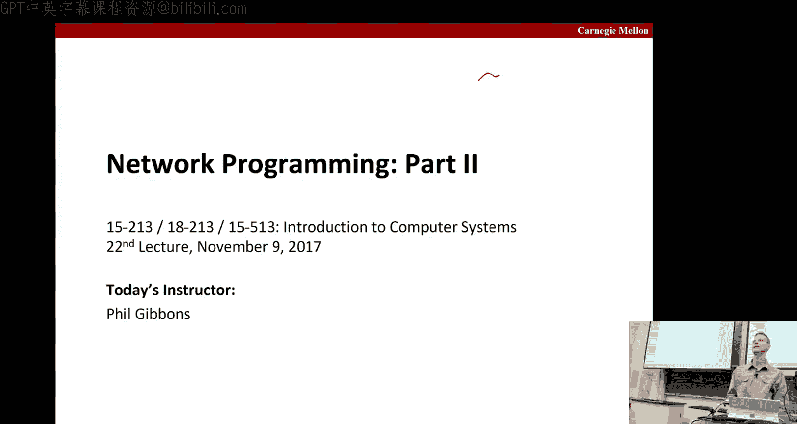
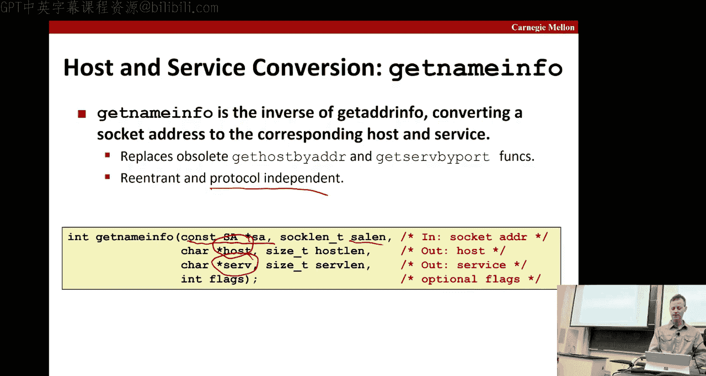
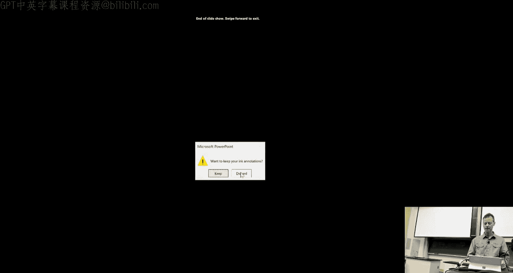
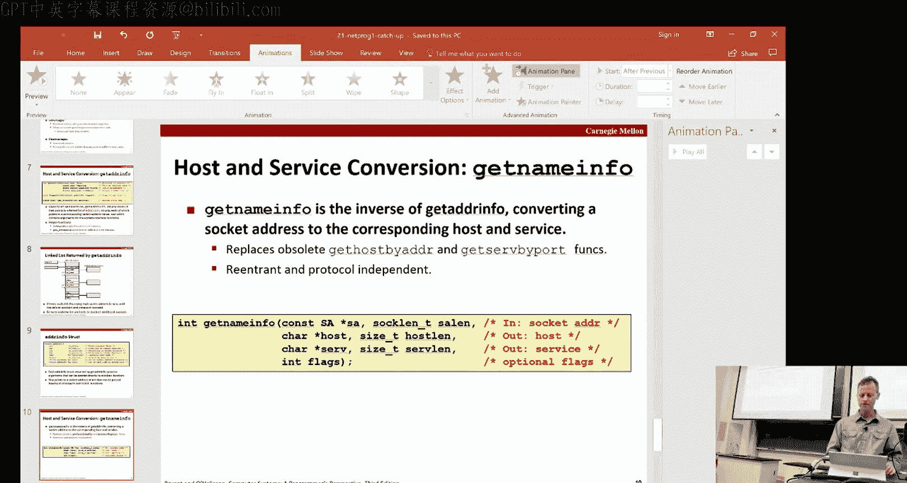
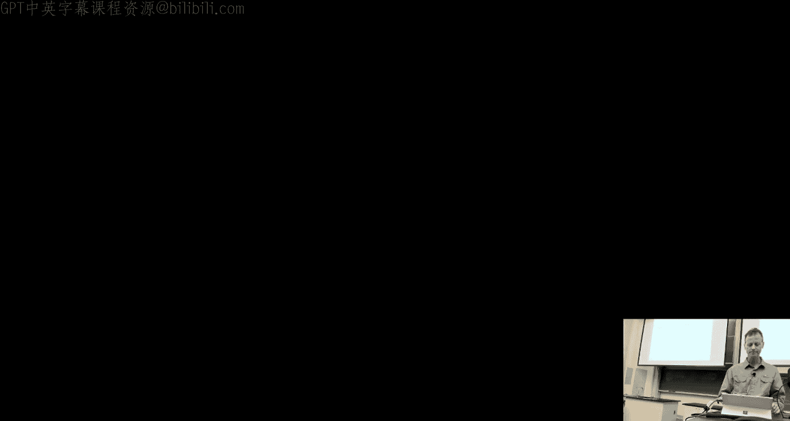
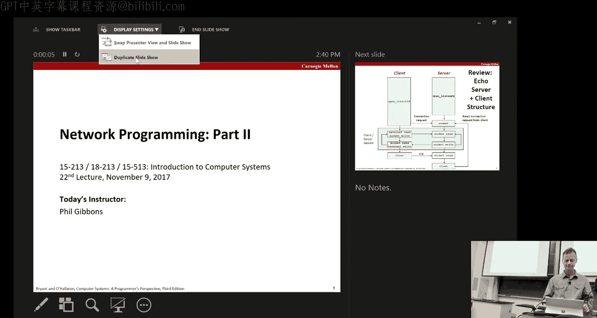
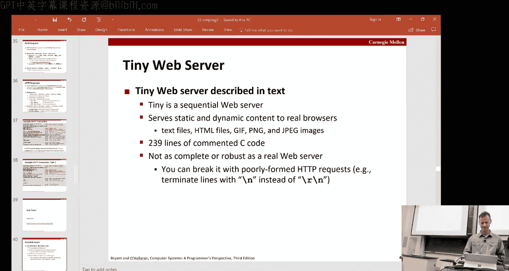
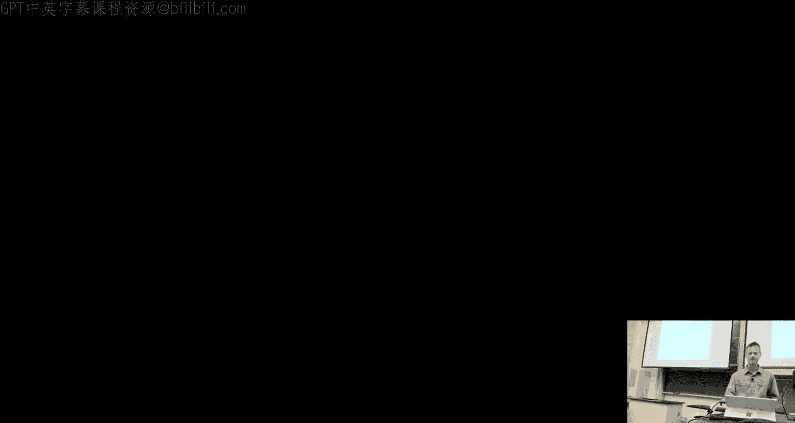
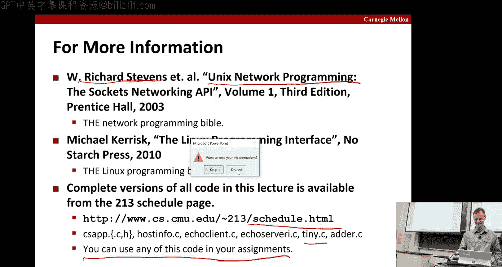

# CMU《计算机系统导论｜CMU 15-213，15-513，14-513 Introduction to Computer Systems 2017 p27 27 - Network Programming (Part II) -BV17jcReyETC_p27-

All right， why don't we get and get started， hopefully everyone havet even more。

20 minute winners update delays。So we're going to start off by finishing up the slides that we had from the last time。

嗯。

So the first thing you want to go。It's just a joke， anyway，So we talked about what sos are。

So sockets to the kernel are just the endpoints of the communication， but to an application。

 it's a file descriptor like a client。FD sort of FD in which if you read a write from that。

 you effectively get to the other side of the network。啊。

And the main distinction between these and other file descripts that you're used to is the way they're set up。

 and that's what we'll talk about today。But first， we're going to talk a little bit about what the address structure looks like for a socket。

So the idea to be very generic。And so the generic version of it is just there's this。Socket。

Address family that you fill in and basically all the other bites are family specific。Okay。

 so the generic one just has the two fields。Protocol family and address data。Okay。

 we'll use this casting invention that will type depth thisstruct to the letters's essay to name the essay。

Okay， so that's the generic but what does specific one look like， so for IPV4。

 which again is what we're going to focus on in this class。😡，嗯。If you put。If I know。

In the family field。Then that specifies as IPV4， and so that also specifies what did other fields mean。

 So there's a port field。So is the port number in this network byte order。

There's IP address in every buy order， and then since this protocol that's all the bitetes we needed。

 it's just padding after that。Okay， so to get from the generic to the specific。

 then you have to do casting for one to the other。So there's these routines。

 one that goes each direction， the first we'll talk about is get address info。

And that goes from the string name to the socket address structure for one of these structures。Okay。

 and the advantage of get address info over what it replace。

 get host by name and get served by name is that it's protocol independent。

 it's the main advantage okay， so if you use G address info then no matter what the protocol is。

 it'll do the right thing， it's also reentrantance so it can be safely used by threaded programs。

The disadvantage is thats somewhat were complex， but fortunately there's only a small number of patterns that we tend to use。

So this is what this looks like， you have the host。And the port of the service name。

And you get back a result okay， based on that， There's also these hints。

Which can help guide the search for things you're looking for。We'll not really get into those。Today。

 but if you look at some of the slides that are in the stack， they'll talk some more about the hints。

Then if we have a structure， we also have a way of freeing that information and also a convenient way to print out an error message based on an error code。

So what really happens， so when you call get Ad info。

 you actually get back a pointer to a link list that looks something like this。😔，Okay。

So in the linked list， there were one or more of these address infrastructures。

Okay that we just saw on this previous page， right？

And important thing is that it allows you to have more than one that could potentially match。

what you're looking for right so you come in give it a host of a service and it could give you choices。

 different psists。So in this particular picture， you've got three choices。

That are all just linked using these next pointers。

 and they point to these structures that I showed you before， the ones that have the actual。You know。

B ordered address， IP address and port number。So what happens you get back a client， for instance。

 well get back one of these lists。And we'll walk through the list and we'll try each one inter turn。

Okay， so I might try the first one and say， oh， can I？呃。You know。

 can I successfully create a stockck and sedally connect based on that one。

 if not I go to the second one， if not I go to the third one， and only if it fails on all of them。

 then I return to your code？Similarly， a server will do the same thing after it calls。

 get addressed info， it'll get one it's like this， and it can go one at a time until it finds one that succeeds in sort of establishing preparing for the connection。

Okay， so important thing to remember here is this linked list。

 we will get into these different socket connect sock and bind over the next few slides。啊。

So in full detail address info structure contains not just sort of a point of these structures and the links of the list。

 it also contains some arguments。That you can pass to the socket function。

OkayAnd a canonical host name。So if there's some sort canonical version of the host name。

 you can get that from there as well。So the converse of that is get name info， the inverse。

 it converts a socket address to a corresponding hosted service。And again， it's protocol independent。

So what it does is you take in a socket dress。Okay， which is here。

Just one of those points is one of those structures。And the length of it。

 and what you get back is you get back strings that indicate the host and the service。Okay。

 and then there's as of official flags， which we won't get into。

And so that's sort of the highlights of the stuff that we needed to wrap up from the last time。

Any questions on that？

Okay， you'll see it flows。

Nicely into what we're about to。Talk about today。Which is this deck。

Okay， so welcome to Thursday's lecture， all right， so the review。

 remember we had a picture like this on Tuesday where you started with a server。

Who would get started up？Perform all these tests， then you can start up a client。Okay。

 it would generate a connection request。And then once this connection was established。

 you have a series of data being exchanged。In this particular case。

 we were doing a simple echo server right so all you're doing is you're reading from the terminal。

 you're writing the socket， shoots it over here， it gets read from the socket on that end。

 and it's just echo it just immediately。Composite to the socket， the other direction。

And it's red and then echoed the term。Okay。After you've done that for a while， there's a closed。

 maybe you've controlled a seed out of it or something。And that ends up getting a end of file。

 the next time there's the soet read and that tells the server to go ahead and drop the client。Okay。

 and go back to here and await requests from a client。All right， and as I mentioned last time。

 this shows an example where they's just one client at a time， but of course these servers can take。

YouHundreds of thousands and tens of thousands of clients this time。And then just again。

 to review the， you know， in terms of IO and C， they have standard IO functions they familiar with here。

 UniX。Systems calls for things like opening and closing files。

 but what we want you to use in this course are the Rio version， the RA versions。

That handle all the on your behalf， various kinds of air checking signals and what we call short counts。

And so there are these functions here。That you use。And so when we read， depict the picture。

 then this becomes a F gets， and then you do a realo right n since you know the length of it。

This reads in a buffer and then writes it back out and so okay。

So that's what it ends up looking like when you use the realo library and the actual Uni system。

Any question so far。All right， so now we're opening these boxes， okay。

 we're going to start opening this box in this box。Okay， you can see what it actually gets done。

All right， and so you can see the steps that get done here and we're going to proceed as highlighted in lavender。

Okay， so the first step for each of the server client， again， there's no。

Particular ordering from at this point。Is this call to get address info？Okay， and again。

 it gets you generically， it gets you back just this skill。

Some family code and some family specific data。So if we want IV， we have to actually specify that。

And then where you can get something back that looks like this。Okay， and from that。

 we can get the port in the address。Okay， and so the end result of that is that we have。You know。

 this structure， that's this point into the structure that has to address the information we need。

Okay。😊，Then， and again， this。啊。So then any side can call socket。What is the socket？Call do。So here。嗯。

So this is your example on the client side， so a client calls socket that says I'm interested only in sockets that are doing IPV4。

That we want to communicate UCI before。And that。this is indicating that it's going to be the endpoint of one of these connections。

Okay， so based on these two flags， that's the domain。

 the type and protocol we're just using the default of zero。

We're able to create a get a filescriptor that's going to correspond to an appropriate socket。

 so it's going to walk through the link list， find the socket that matches and is good to go and create this file descriptor on the client side。

The server would do the same thing and get one for the server side。And。So that puts us here。

So let's call the one on the server side listen FD because eventually it's going to be listening on that filescriptor and here's the client filescriptor FD。

So that's kind of it for what the client can do at this point， the servers got the next step。

Which is bind。So Brian， you give it a socket， file ascriptor and you give it a。

One of these pointers to a soccer address thing， specific one。And。

And it sort of sets up the binding between those two， so it says before this point。

 I just created this filescriptor and I said， oh， it's going to speak IP before。

 but I didn't say who was going to talk to and what was it connected to？On mining。

 what does it correct to our mind， this does that association。Associate the server socket address。

With the socket scriptor。And again， if you use these get address info。

 then you can get the arguments you need for this call in a protocol generically。All right。

 so now we've got this， we've gotten this， but now we've got this mapping。

 we know that this file descriptor is associated with this server's socket address。

And now the next thing the server calls is something calledLi。And so this is interesting because。

Basically， the client and the。The server up at this point are fairly in terms of how their file descriptors were declared are symmetrics。

 there's no notion of who's initiating the call to who and so forth。So the listen is the one that。嗯。

That sort of turns it into something that's listening as opposed to active。Okay。

 so that's what this says here， by default， the kernel assumes that the scriptor from so function is active。

 it will be on a client's side of a connection。But the listen overrides that and says， no。

 this is actually going to be on the server side so it converts it from an active socket to what's called a listening socket they can now accept requests from clients。

And there is， as with some of the other things， there's an added parameter。

 this is a hint about the number of outstanding connection requests the criminals should queue up before starting to refuse requests。

Okay， so if your server can only handle a thousand connections at once before it。

 it just falls on the floor， then you set that to 1000。

So now we have this file of scripture and it's actually active in listening。对。😊。

So the next thing that needs to happen is that the server does this accept。Okay。

 and that you give it the listen file toscriptor。Again。

 the soet dress and the dress link and what that tells is that the。

That the server is now in a position to wait for a connection requests from the clients。Okay。

So this is a。So know it sets the service says，" okay， I'm ready。

 I'm all set up to now accept requests， and then basically nothing happens it' since they're pass listening until it actually gets the request。

Okay。And that occurs when the client acts and does this。Okay。So the Connect is again， another call。

 takes the client file descriptor， and thus the server sizing， I'm trying to connect to this server。

Okay， and attempts to establish connection with that server。And if it's successful。

 you don't get an air flag， then you know you're good to go。Okay。

And that connections characterized as we saw on Tuesday's lecture。

By both the IP address and the port， call and the port。哎。And on the server side， of course。

 that address support of that service， on the client side。

 it's still the port that matches the service port， the one you want to talk to on the server side。

But the port number is one of these federal port numbers just assigned。On the client。

And it's given a unique one of the， the。You have a unique mapping between a client process。

And a particular client host。And again， it's best to use this GAAT address info to make sure it's protocol dependent。

So here's an illustration。The server is called accept and then blocks。

 waiting for some client to show。All right， the client calls connect。And that makes this request。

And when it's successful。The server returns another file scripture that's specific to this client。

And this connection， and now the connection is established。

 so you can read and write on these two file descriptors and you will get the information packets from one side the other。

Any questions on that？So why do we have both this two types of things sort of a connective descriptor and a listening descriptor right so we had right there's two things here。

 we have this descriptor here and this descriptor here。

Well the answer is that there's just one of these guys。

And it's sort of sitting there with its job is to feel the incoming request as they go along。

Where you can have any number of these guys and their job has nothing to do with feeling a new requests that has to do with servicing connections you've already established。

So this is created once and exists for a lifetimeness server。

This one is on a per connection basis and is just only as long as it takes to service that client。

Okay。And this also allows the server to fork threads。And for child processes to handle。

Different requests。Which is kind of a heavyweight way to do itillion if you have lots and lots of clients。

 you're not going to want to for process for each one of them， but if you have only a few clients。

 then that's a way to go。Okay， so after having done all that， then we have our client。

File descriptor and our some sort of connected file descriptor。

 and they're both connected and ready to do all this intermediate stuff here。可以。

And then when eventually this gets closed， it's just this guy that is closed， right。

 not the listening guys still operate in any other client file descriptors are still operating until that client close。

对。What is that， yes。B you。I is the same sort of logic these for showing up。嗯。验什么人。All right。Okay。

 so that's at the high level of what's going on now let's look at the client。

And look at some what it actually looks like in code。Okay。So again。

 all this code is available for your use。In the usual place。

So this is the code for open to client file of scripture， so again， it covers。As shown here。

 it covers this whole range。 so we can see that the first thing it does I'd mentioned there's these hints。

It's just zeros them all out。And then does set up some of the things， right。

 so we're interested in a stockck stream using a particular。port。And。嗯。

They using a numerical port argument， and this is another hint flag that's useful。

 recommended it for connections to say it's a dress kitfiig。So given those hints。

 then you feed it the host name in the port， which are the arguments to this function。

And you get back this pointer to that linked list of things that match。Okay。

 you get a picture that looks like that。Okay， so now， as it says here。

 the client walks this list and tries to proceed from there。

So this is walking the list right you start at the head of the list you're given and you're going to walk to the next until you find something that works。

So first thing you do is you try to can create a socket de scripture to do the socket call again based on the family requested the socket type。

The protocol。嗯。If you。Again， an error， then you do a con and that you go on to the next item in this。

This list， right？If you get an error you call ps to go into that one。Otherwise。

 the second step is you try to connect。So again， you give it the file descriptor and the address。

In the length， and if you're successful， then you've done both steps and so you're good to go and so you're breaking completely out of the loop。

可以。If you fail on this step， then you close that file of scriptripure and you try again。Okay。

 on the next one list。Right。And then there's some cleanup， you free the list。

 if all the connections happen to fail， you return an air code。

 otherwise you return the one that succeeded which would be client F。喂。关系在的。All right。

 let's look at the code on the server side， this the code for open， listen filescriptor。All right。

So again， we start off by zing out all the hints and then we set up。Some of the flags。

Accept the connection on any IP address。Using a port number。

And then you do this call to address the info。To get back one of this linked lists。

 and again since this is referring to you now right so your own service。

And so what you want to do there is you want to， again， create a socket descripture。

And we're going to store it in this listen file of scripture， as we said before。

 if you fail then you go to the next one list。Otherwise。There's sort of for technical reasons。

 not that important， this is useful because the eliminate address R in use air from bind。嗯。

But getting back to the main storyline， then you try buying。And if you're successful。

 then you're good to go， otherwise you close that filescripture and try it。Okay。

So at the end of that， you'll need to do some cleanup and you free the dress again。

 if nothing was found， you return an air coat。嗯。Otherwise， okay。

 so less far we've just done socket and bind， right？So we've done this and this。

 we still have to do listen。So that way save the end here。We said we found something。

 so let's call listen。看下不。And if that fails， if the call this it fails。

 then we close it and we turn an error， otherwise we return the filescriptor。

That's successfully all good to go。可以。And both of these codes are independent of any particular version of IP。

 which is one of the reasons that we provided them we recommend to use them。

Because when you write your proxy lab， there's potential you' be talking to。Both kinds。

I P V 4 and IP P6。Okay， so any questions on that？All right。

 so we're going to use Tnet to demonstrate some things。So tellnet。

You give it a host and a poor number， and it creates a connection。WithFor that most important number。

Okay。嗯。So。し。So E server I， that was the server side of our code for the EC serverver that we went through in detail。

 last time we saw a little bit of the code here we just highlighted at high level what it does。Now。

This is going to serve as our client， is our client。And so we do a telehead into the server。Okay。

And so you will see trying to connect， this is the IP address， as you can see here， actually。

 it the IP address for whale shark。Okay， so it tries it connects it and so forth。

Then you get back here that you indeed are connected and you get this client， this ephemal port。

And then the client， know we accurately type high there。

It gets those 11 bytes and echoes them back high there， howdy， eight bytes and howdy。Okay， exit。

You quit， can actually gets closed。你给这个。可以。All right。

 so that's kind of what it looks like at the terminal。Any questions on that？Hi。

 so now that you know that level， that's up level and talk about web servers okay？你HTP。

So you're probably very familiar with a lot of this， okay， right， you've got your client browser。

 you've got some web server， you make HCTTP requests and you get back the content an HTP response。

Okay。The current version is HCTP Class 1。1 that's been in place for a while now。嗯。Okay。

 and you can read all about it， which I'm sure。It's pretty boring reading， but this URL here。Okay。

So this is remembering when we talked about IP， IP talks about data gras being delivered， TCP。

Sort of assembles us in entire streams where you preserve ensure reliability and ensure order。

 and the web content will go on top of the TCP protocol。Okay， so what is content。

 it's a sequence of bitetes and associated， what's called a mime type。

you've probably seen some of these like HTML has a mind type of text slash HTML。

 your image might have a type of image slash JPEG and so forth。Okay， and you know。

 equally good bedtime reading。You got a complete list of mine types at that URL。

That doesn't put you to sleep'。Okay， so you're probably familiar with the notion of static or dynamic content。

Static content is already pres stored in a file and files and just retrieved。

 in case that might be certain images or audio clips， HTML files and so forth。More interesting。

 and again， you'll be dealing with this in your proxy lab is dynamic content and that's content produced on the fl。

Okay， so for instance Con produced by a program executed。Buy the server on behalf of the client。And。

And the requested files are executable code， right so it's going to run some code。

And maybe that code， I don't know， deciding what a to display for you or whatever， right。

 but there's some dynamic thing that every time you go to the page it might be different。

 might look at some cookies it's got stored away and decide what does show you on the page based on I don't know what's in your shopping cart whatever。

 but it'll be done dynamically， it's not sort of the same thing every time you go there。

And all that content is managed by the server。可这块牺上来。Okay， probably all familiar with URLs。Okay。

 you may be aware that the prefexx of the URL。Is used by the client to know sort of where the server is。

 what the port is， and what the protocol is。And the server。

 once it gets there picks up on the path from there。

 so the path from there makes sense for on the server side。Okay。And。

One thing that could be slightly confusing is that although this's a pathing。

 it doesn't start from the root of a file system the default is it starts from the home directory for the requested content。

So index。umL will be a file sitting in the home directory that get you land on based on that URL。

You know that。Port and IP address。When it comes to the server and the IPS。

And so the it's okay just to have a slash。Which defaults to typically index。 HTMLt。Okay。

 you've probably seen that， maybe when you could set up your own web pages。And so forth。嗯。

So there can be a little bit of challenge at certainton if the request is static or dynamic because theres no hard and fast rules for this。

 but one nice convention is if you have a CGI bin directory and you put all the dynamic content in there。

 and that's basically what we're going to do to simplify the discussion in this class in your labs is that we'll distinguish dynamic content by having it be in CGI bin directory。

So we'll look for that in the path。かしのだ。Okay， good。HtTP requests。

The most thing you're probably used to is the get request。

 that's the one that says I'm a client I want to fetch something。

 there's also a post which is you sort of push the information the other way。

And some ones that are less common。The。Okay， so it takes a method， which is like getheter post。

Takes a URI， which is either the the。The URL。嗯。For proxy of URL suffix for servers and a version like a6P1。

1。And then there's a bunch of request headers that are a series of header name， colon。

 header data provide additional information to the c。Okay。

 and we'll go through an example in more detail in a little bit。一块系算单是。Okay。

So response is a response line。Followed by zero more response headers。

Possibly followed by content and it's important to note that there's a blank line that separates the headers from the content。

Okay。So here's what our response sign looks like， there's a version a status code of status map。

 hopefully if everything goes well， you get a status code of of 200 and that means everything's okay。

But you may be familiar from browsing of getting a 404， right which is a not found。There's also。

I think it's 401， that's permission denied and so for some of the other one you may have seen a lot。

The header， so typical kind of header is like a content type header。

 which will give one of these mind things like text/lash HTML and a content length。可快上来。All right。

 so here's an example。In the score detail， so the first thing is the client opens a connection to the server using in this case TA and you see it all gets connected。

And then the client makes a request， so it's a get request。嗯。And it's going to use this protocol。

And the host is。Seem you don't need you。And the empty line terms the headers。Okay。

 and then the server response you get back is actually an error message。You get back that， okay。

 this is the protocol， here's the tag and here's what it means， 301。Okay， moved permanent。

And then you get various headers indicating the date and the server。

And because it's moved permanently， it actually tells you the location of where the page is moved。

So what this is saying is that this default and as I mentioned to index。h。

 whereas the header the page is actually an indexed SH TML。Okay so that's why it failed。

 but it told you where to look next。Okay。But here's the headers and an emptypt line terminateates the headers。

And then you could have a bunch of content， you've got the HTML tags， so this is the HTML content。

And eventually it closes。Connection。Okay， so that was a failure， so we try again。

 and this time get requests， we actually take the new location， the corrected location。

And it comes back， okay，Okay。Any questions on that？All right， see you。Really have no questions。

You know I went so fast， it's not different。All right， can you get it now？All right。

 let's see how people did all right。So the connect function， all right， most of we got this right？

It's called by the client to establish a connection with a server。嗯。

So this was the other way around the server doesn't do the connect， the client does it connect。嗯。

What is the function thats called by aserv to wait for connection？么す。

That's listen and what's called by the server to。嗯。Sorry。

 no called by a server to wait for a connection。Is。Acept you can really to wait for a connect call。

What about this and what's called by server to associate a socket address with a socket descriptor that's fine good。

It be good。All right， what separates a header from content， it's always a blank line。

It doesn't matter whether it's static or dynamic content。は good。

Let you offer only two questions system。

Any questions on the quiz？

Okay， so now we're going to spend most of the rest of the lecture talking about the tiny web server。

That you're going to。呃。That has sort of rudimented functionality of a web server。

And you can look at the code and。It know helpp you learn， structure things and learn how things work。

It's you know， very， very little， very tiny， right only2 39 lines。And so of course。

 it's not as completely robust as a real server。There's all sorts of ways you can break it。

 it's really kind of just a toy， but it will illustrate main to the main code path through a web server。

And it will serve both static and dynamic content to real browser。Okay， so what it can do。

 or it can accept a connection from a client， it can read a request from a client via the connected socket。

It can split into method。Meers said there are three fields method U aversion。

But it's only set up to him with course， get methods。So if it's not a get。

 it'll return here whereas a real web browser would be able to handle all the different method calls that put and so forth。

If the UI contains this texting in it。Then it's assumed it's dynamic content。So of course。

 it's easy to。看了没？To mess it up， right， because it's just doing a text string。 So the fact that CGI。

Ben is part of。Because URLL will definitely confuse it。

And it will do the heavyweight thing of forking a process to execute the program。Otherwise。

 it just serves the static content。All right， so let's look at that first serving the static content。

All right， so you have。呃。There's a file descriptor and a file name and a file size。And。Okay so。

The server has to create all the headers and response and stuff。

So the first thing it does is it causes routine called get file type。

Which will take the file name and basically just look at the extension of it， right if it's you。

Dothc that'll know it's an HTML file and so forth。And it will get you the file type we can use。

And store it in there。And then， so now it starts starts to print into this buffer。

 what it needs to print in。 So remember the response always starts with the。With the protocol。

 okay this is an old one， it uses 1。0， but everything was okay。

 so it gives you 200 code and all every line has to be ended with backslash R backslash N。

Then it says， I'm going to print。You know this header server， this is the tiny web server。Connection。

Close connection length， so it gets that from the file size。

Connection type it gets it from the file type， which is computed。

And then now let's fill out that buffer， it does the realo write to that file descriptor。Okay。

 and so that's kind of all the headers。And then。It goes ahead and opens。The file， Ill read only。And。

All right， maps。嗯。Go sort of memory maps that file to the。It's connection。

 and then it does a right of that and then onme maps。

TheBetween the two so it's just a way of getting the content of the file quickly into the know conveniently into the。

Into this buffer。Okay。All right。I was about to say it forgot to have the blank line between the headers and the content。

 but you can see it's right here actually。哎，这是第呃。RN that finishes off this previous thing。

 and here's your blank line。so that's how you get that blank line that separates the head from the content。

All right， so we're dynamic content， so for instance。

 something that might or the path might be this CGI bin。And P。呃。Okay as soon as it's done content。

The server creates a child process using forRC and runs the program identified of a URL in the process that in PL。

Gets run inside that process。嗯。So when it gets run。

 there's some content that gets generated and the server captures that content。

 we'll show you in a minute how it does that。And then after' done that。

 then it's eventually going to send it back to the client。Okay。

 so some of the issues in serving dynamic content。啊。So this program may have arguments。Okay。

 how do you get the arguments to that program， does a client pass？Arance the survey。Any know history？

A just looking at your own URLs sometimes？Yes。Exactly， yeah， yeah。

 question mark and then you have a chain of arguments and values。嗯。

How does the server pass these arguments to the child。

 has the server pass other information relevant to the request of the child？

How does it capture this content coming back？m exactly back is has being produced by this program。

You may have an idea how it does that actually， what's the mechanism by which we can redirect so this program here is likely going to either spit to its contents to a file or more likely even to stand it out。

So what command have you seen that we could use to make sure that that instead gets some place to serve we can see it？

😔，That's dude two。Okay。嗯。That's that one。Okay， and there's a whole CGI common gateateway interface specification。

That deals with this？嗯。Can they often call it CGI programs。Okay， so CGI is the original standard。

 that's the one we're going to be using in this course because it's the sort of initial and the simplest。

 but there's all sorts of other faster techniques that people have used and as I mentioned this creating a process on the fly is a very heavyweight thing to do。

So much better off to do something say in a job of V or something that so you don't have to fork off an entire process just to get。

You know say the protections you want。二。Okay， so we've created a website。

 it's the most easiest website you'll ever to see， it's called a。com。

You give it two numbers and it adds importance。Okay。

No problem I'm sure know the IPO of the startup is just around the corner and I'm sure we'll get billions。

 okay， so you can already see some what's going on right we've got a CGI bin。

So the port happened to be assigned 15213， the CGI bin， so that means this is a program。

 the program is called Adder and its two arguments are 152 13， 18 to 13。Okay。So host port。

 CGI program。And let's get back。Okay。So as we mentioned， the arguments are append。

With with a question mark。Arreguments are separated by。Andmperserson。啊。Because you can't have spaces。

 you often see this percent 20 that replace the spaces in what you can say arguments you type into a form or whatever that get submitted。

And everybody said that。嗯。So how do you get from the server to the client？

So it turns out there's an environment variable called query string。

 and the server will put the arguments basically set that environment variable to be equal to。So。

So within an adder。Okay。So adder needs to get the arguments， so how does it get the arguments？

It goes to this query string。And pares it basically。So you go and you find where the ampersand is。

 you know that there's only two arguments of this， you find the single ampersand。

And you nu turn right there so that kills that。Finished off that string。

And then you copy the rest as well。Okay。So that's how you get these and then you convert them to number integers。

And that's how you get the two numbers to add。It's。We'll magically add them。

 of course and spit out the answer。All right， so this is now the question about how does the server capture the content produced by the child and we use our friend Ju2？

So this is again， serving dynamic content。嗯。So first， you generate the response。everything was okay。

Again， you're using an really old H protocol。And so you spit that out。Then you start your headers。

And you spit that out。And then you do this fork。嗯。And you set the query string to be the arguments。

Okay， that you've pulled teased out before。嗯。And then you set up。Yourre do 2。

To redirect standard out。To the file descriptor。Pick kept passed in。

And only then do you do the fork and you run the program。嗯。

With these things set up and then you weight。You wait until the child is now and then。

Great question呢。Right good。All right， here's the response body， welcome to a。com。

The Internet edition portal。And then of course， the answer is this N1， you get back plus the N2。

 you get back and then this。Okay， and you say， thanks for visiting。And then。

You put in the content link。Which you're able to calculate in the content type。

And then the actual content。And then you you're flushing。Okay。

So what's important to notice here is that it's actually the child process that knows the content type and length。

 so it must generate all this lettersters。😔，You can't unlike the the， you can't just。

Generate the header and then call the child， the child has to have it within。

The ability to generate its own。Headers because for things like the length， for instance。

Only that's not even determined often until the CGI program actually runs and you see how big it ended up being。

快驶上来。Okay， so what shows up as you're running？So again， we do this， tell that。And we get connected。

Then here's our get to our adder。In that protocol， OK， connection， close。Connected length is 117。

 and it was in HTML。And generated by the CTGI program。You get the answer is， thanks for visiting。

Connection close by foreign host。And you're done。Okay。So that's what you see at your terminal。

 but we know now all the code that gets executed in order to produce that。は。All right。

 so for more information， there's a know Richard Stevens wrote a whole series of books that are very very helpful。

 this one is a good resource for network programming。嗯。And as mentioned。

 there's complete versions of all the code in this lecture。

If you go to the schedule link and you see you know。

PowerPoint and PDF and soon there'll be video you'll also see code and you click on code and this lecture will last get you get。

To the directory world the code is， including the tiny server。

And you can use any of this code in your assignments。Can you find it helpful？

As you're getting started on the proxy lab。To have a。Access that code。Okay。All right， you know。

 I was so worried about not finishing on time because I had to catch up from the last election。

And I probably went through that way too fast， but we got done 20 minutes early。So。Enjoy。

20 more minutes to work on your me。来对。

