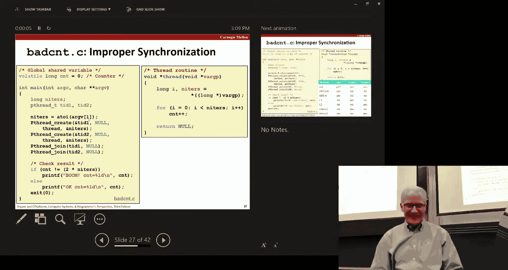
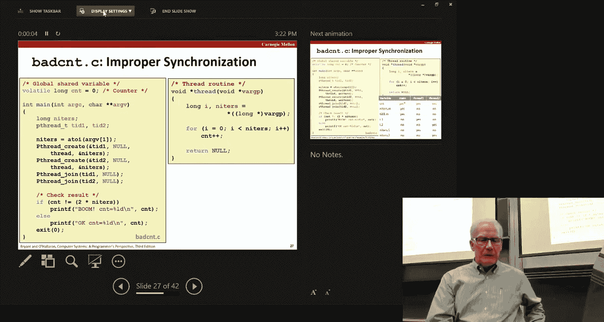
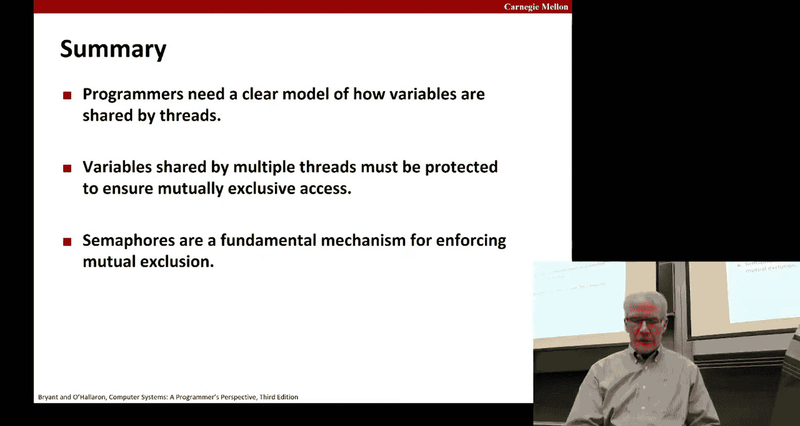

# 计算机系统导论：第29讲：同步基础 🧵


在本节课中，我们将要学习多线程编程中的核心概念——同步。我们将探讨为什么当多个线程并发执行时，程序可能无法正常工作，并介绍如何使用信号量（Semaphore）这一基本工具来协调线程，确保数据的一致性和程序的正确性。

---

## 线程与共享内存

上一节我们介绍了多线程的基本概念，本节中我们来看看线程之间如何共享数据。

一个进程的传统视图包含其虚拟内存中的所有内容（代码、全局数据、堆、栈）以及CPU寄存器等状态。在多线程模型中，每个线程拥有自己独立的寄存器集合和栈，但它们共享进程的虚拟地址空间，包括代码、全局数据和堆。

这意味着，任何线程理论上都可以通过指针访问虚拟地址空间中的任何位置，包括其他线程栈上的局部变量。因此，判断一个变量是否被“共享”，关键在于是否有多个线程引用了该变量的**同一个实例**。

以下是判断变量是否在线程间共享的规则：
*   **全局变量**：在函数外定义。所有线程共享同一个实例。
*   **局部自动变量**：在函数内定义（非`static`）。每个线程拥有自己的私有副本。
*   **局部静态变量**：在函数内用`static`关键字定义。所有调用该函数的线程共享这一个实例。

关键在于，即使变量在栈上（局部变量），如果其地址被传递给其他线程（例如通过全局指针），那么该变量实际上也被共享了。

---

## 竞态条件与不安全的执行轨迹

当多个线程共享数据并尝试修改它时，如果没有协调机制，就可能出现**竞态条件**，导致结果错误。

考虑一个简单的例子：两个线程并发地对一个全局变量`cnt`执行`cnt++`操作。在C语言层面，这看似是一个操作，但在机器指令层面，它通常分解为三个步骤：
1.  **Load (L)**：将`cnt`的值从内存加载到寄存器。
2.  **Update (U)**：递增寄存器中的值。
3.  **Store (S)**：将寄存器的值存回`cnt`所在的内存。

如果两个线程的L、U、S指令序列**交错执行**，就可能出现问题。

**错误交错示例**：
1.  线程1：L (读取`cnt=0`到寄存器R1)
2.  线程1：U (R1 = 1)
3.  线程2：L (读取`cnt=0`到寄存器R2) // **问题：线程2读取了旧值**
4.  线程1：S (将R1=1写入内存，`cnt=1`)
5.  线程2：U (R2 = 1)
6.  线程2：S (将R2=1写入内存，`cnt=1`)

最终`cnt`的值为1，而不是正确的2。导致`cnt++`这个操作并非**原子性**的。

我们可以用**进度图**来可视化这个问题。以两个线程为例，横轴和纵轴分别代表两个线程的执行进度。线程的完整执行路径（轨迹）是从左下角到右上角的一条路径。图中存在一个“不安全区”，任何穿越该区域的轨迹都会导致错误的`cnt`值。

---

## 使用信号量实现同步

为了解决竞态条件，我们需要确保一次只有一个线程能进入修改共享变量的代码区域，这个区域称为**临界区**。实现这种**互斥**访问的经典工具是**信号量**。

信号量`s`是一个非负整型变量，只能通过两个特殊的原子操作来访问：
*   **P(s)** (或`wait`): 如果`s > 0`，则将`s`减1并立即继续；如果`s == 0`，则挂起线程等待，直到`s > 0`。
*   **V(s)** (或`post`): 将`s`加1。如果有线程在`P(s)`上等待，则其中一个会被唤醒并完成其`P`操作。

其核心保证是：**`s`的值永远不会为负**。





**用信号量保护临界区**：
我们可以初始化一个信号量`mutex = 1`，并将其视为一把锁。线程在进入临界区前执行`P(mutex)`（尝试获取锁），在离开临界区后执行`V(mutex)`（释放锁）。

```c
#include <semaphore.h>
sem_t mutex; // 声明信号量
Sem_init(&mutex, 0, 1); // 初始化为1

// 线程函数
for (i = 0; i < niters; i++) {
    P(&mutex); // 获取锁
    cnt++;     // 临界区
    V(&mutex); // 释放锁
}
```

通过这种方式，我们为进度图中的“不安全区”创建了一个“禁止区”，任何执行轨迹都无法进入，从而保证了结果的正确性。




**性能注意**：互斥锁会强制部分代码串行执行，可能显著降低程序速度，但这是保证正确性所必需的代价。

**互斥锁 (Mutex)**：二进制信号量（值仅为0或1）的使用非常普遍，因此Pthreads等库提供了专门的**互斥锁**数据类型（`pthread_mutex_t`）及`lock`和`unlock`操作。其原理与二进制信号量相同，但通常有更高的优化效率。

---

## 总结

本节课中我们一起学习了多线程同步的基础知识。

1.  **理解共享**：线程间共享数据不仅限于全局变量。任何被多个线程通过指针引用的内存区域（包括其他线程的栈）都是共享的，这可能导致复杂的交互。
2.  **认识竞态条件**：当多个线程非同步地读写共享数据时，由于指令交错的随机性，会产生不可预测且通常错误的结果。`cnt++`这样的操作不是原子的。
3.  **使用信号量/互斥锁**：为了确保正确性，我们必须使用同步原语。信号量（特别是作为互斥锁使用时）提供了`P`/`V`（或`wait`/`post`）这一对原子操作，能够保证临界区的互斥访问，从而消除竞态条件。




同步是多线程编程中最核心也最具挑战性的部分之一。下一讲我们将探讨信号量的其他用途，例如用于调度共享资源的访问顺序。