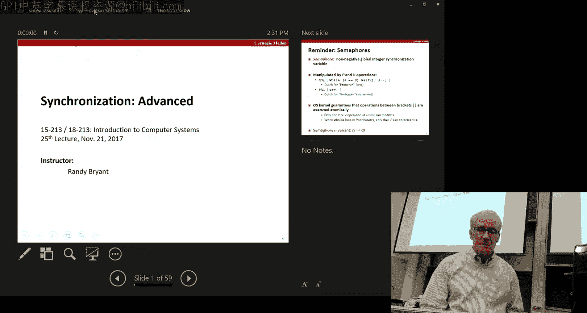
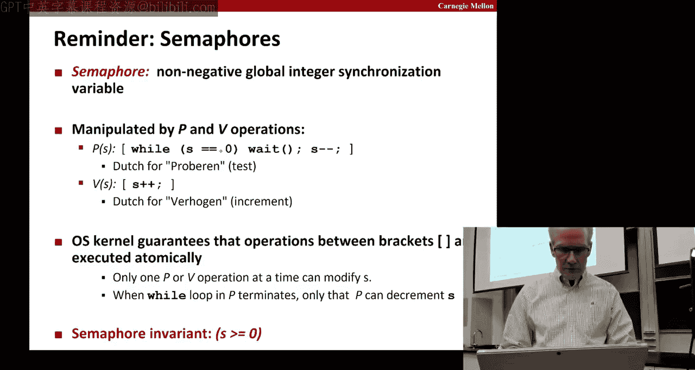
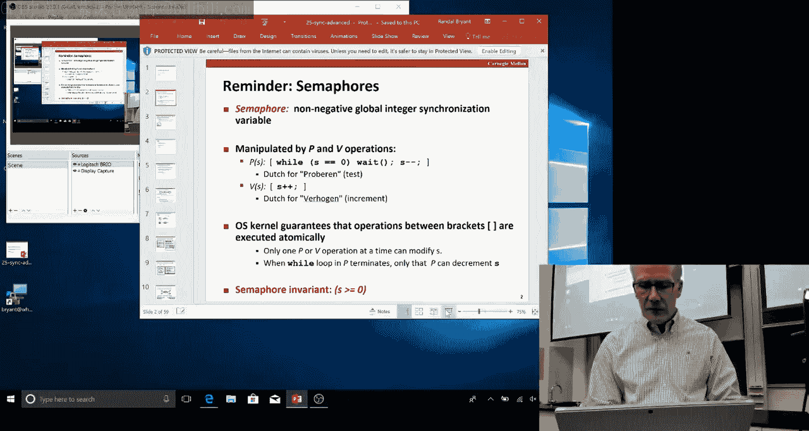
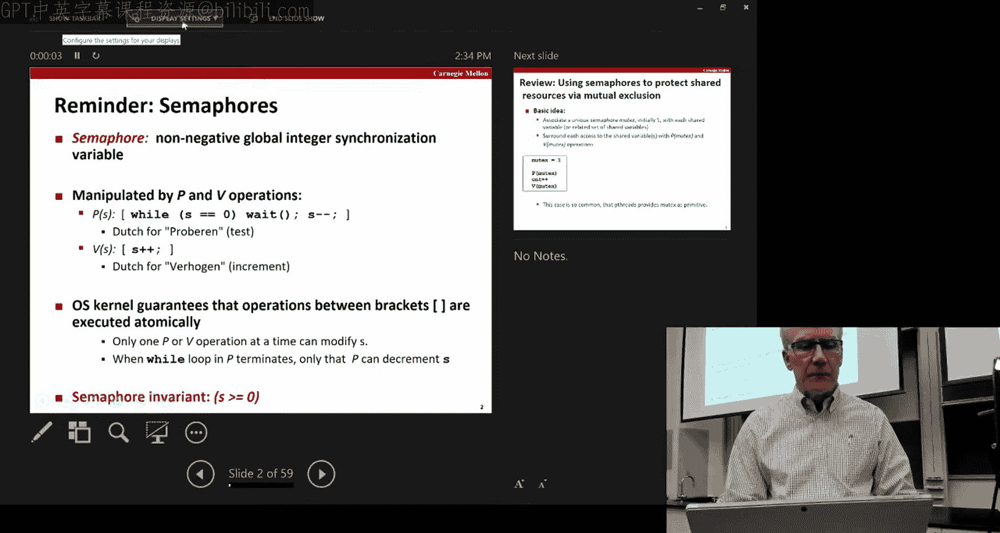
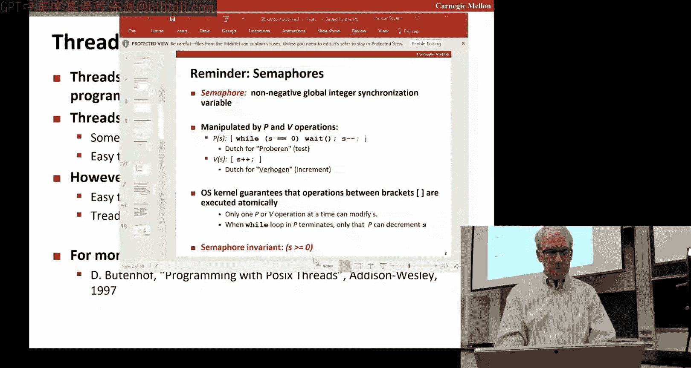

# 计算机系统导论：第30讲：高级同步技术





在本节课中，我们将继续探讨同步技术，特别是信号量的高级应用，包括生产者-消费者问题、读者-写者问题，以及线程安全等核心概念。我们将学习如何使用这些技术来协调多个线程，避免竞态条件和死锁。







## 信号量回顾

上一节我们介绍了同步的基本概念和信号量这一原语。本节中，我们来看看信号量更复杂的应用。

信号量由荷兰计算机科学家Edsgar Dijkstra提出，它是一个保证始终大于或等于零的特殊变量。对信号量有两种操作：**P**（或称为wait）和**V**（或称为signal）。

*   **P操作**：等待直到信号量值非零，然后将其减一。这个操作是原子的，意味着在检查信号量值和递减操作之间，其他线程无法介入。
*   **V操作**：将信号量值加一。这个操作同样是原子的。

之前展示的P操作代码使用了忙等待循环。在实际实现中，如果线程执行P操作时信号量为零，调度器会将该线程从核心上移出，并调度其他线程运行，从而提高效率。

信号量最基本的用途是实现**互斥**，保护**临界区**——我们不希望多个线程同时执行的代码区域，通常涉及对共享数据结构（如队列或列表）的更新。

## 生产者-消费者问题

现在，我们来看信号量的另一种经典应用：**生产者-消费者**模型。

在这个模型中，一部分代码（生产者）生成数据，另一部分代码（消费者）使用这些数据。我们需要协调它们的行为，使得消费者在生产者生成数据之前等待，有时也需要生产者等待消费者处理完数据后再填充新数据。

以下是使用两个信号量实现一个单槽缓冲区的示例：
*   `empty`：表示缓冲区是否为空（1为空，0为非空）。
*   `full`：表示缓冲区是否已满（1为满，0为非满）。

初始化时，缓冲区为空，所以`empty`初始化为1，`full`初始化为0。

**生产者线程**的伪代码逻辑如下：
```
P(empty); // 等待缓冲区为空
将数据放入缓冲区;
V(full);  // 通知缓冲区已满
```

**消费者线程**的伪代码逻辑如下：
```
P(full);  // 等待缓冲区有数据
从缓冲区取出数据;
V(empty); // 通知缓冲区为空
```

这种模式可以推广到多个生产者和消费者，以及容量为N的缓冲区。对于N槽缓冲区，我们使用三个信号量：
*   `mutex`：保护对缓冲区数据结构的访问（互斥锁）。
*   `slots`：计数可用的空槽数量，初始值为N。
*   `items`：计数缓冲区中已填充的项目数量，初始值为0。

**向N槽缓冲区插入数据的逻辑**如下：
```
P(slots);    // 等待至少有一个空槽可用
P(mutex);    // 获取互斥锁以安全访问缓冲区
将数据放入缓冲区;
V(mutex);    // 释放互斥锁
V(items);    // 通知有一个新项目可用
```

**从N槽缓冲区移除数据的逻辑**如下：
```
P(items);    // 等待至少有一个项目可用
P(mutex);    // 获取互斥锁以安全访问缓冲区
从缓冲区取出数据;
V(mutex);    // 释放互斥锁
V(slots);    // 通知有一个新空槽可用
```

**关键点**：`P(slots)`和`P(mutex)`的操作顺序至关重要。如果先获取互斥锁再等待空槽，可能导致死锁。想象生产者持有互斥锁但无空槽可用而等待，此时消费者因无法获取互斥锁而不能消费数据释放空槽。

## 读者-写者问题

接下来，我们探讨另一个经典同步问题：**读者-写者**问题。这是互斥锁的一种泛化。

考虑一个场景，例如管理航班可用座位的数据。许多“读者”可能只想查看座位情况（不修改），而“写者”则需要更新座位信息。我们希望允许多个读者同时读取，但写者必须独占访问（即，要么只有一个写者，要么有多个读者且没有写者）。

**第一类解决方案（读者优先）**：
这个方案简单，但可能导致写者饥饿（长时间等待）。它使用两个信号量：
*   `mutex`：保护读者计数`readcnt`。
*   `w`：作为读写锁，由第一个进入的读者获取，由最后一个离开的读者释放，阻止写者进入。

**读者代码逻辑**：
```
P(mutex);
readcnt++;
if (readcnt == 1) // 我是第一个读者
    P(w);         // 阻止写者
V(mutex);

执行读操作;

P(mutex);
readcnt--;
if (readcnt == 0) // 我是最后一个读者
    V(w);         // 允许写者
V(mutex);
```

**写者代码逻辑**：
```
P(w);         // 获取读写锁
执行写操作;
V(w);         // 释放读写锁
```

这个方案的问题在于，只要持续有读者到达，写者可能被无限期阻塞。

**第二类解决方案（写者优先）**：
这个方案更复杂，通过引入额外的信号量来让写者优先，防止读者饿死写者，但可能导致读者饥饿。其核心思想是，当有写者等待时，阻止新的读者进入。

还有**第三类公平解决方案**，例如使用队列（FIFO）来管理请求，确保读者和写者按照到达顺序被服务，避免任何一方饥饿。

## 竞态条件、死锁与线程安全

在并发编程中，我们必须警惕几个关键问题。

**竞态条件**是指程序的结果依赖于两个或多个事件不可预测的执行顺序。并非所有竞态都是错误，但许多会导致程序状态不一致，例如之前演示的未受保护的计数器递增操作。

**死锁**是指一组线程彼此等待对方持有的资源，导致所有线程都无法继续执行。一个典型的死锁例子是多个线程以不同的顺序获取锁。

例如，线程A先锁`lock1`再锁`lock2`，而线程B先锁`lock2`再锁`lock1`。如果执行时机不当，两者可能各自持有一把锁并等待另一把，形成死锁。

**避免死锁的黄金法则**：在所有线程中以**相同的全局顺序**获取锁。

**线程安全**是指代码可以在多线程环境中安全使用，即使多个线程并发调用它。许多旧版库函数不是线程安全的，原因包括：
1.  访问未受保护的共享全局或静态变量。
2.  返回指向静态缓冲区的指针（如旧版`inet_ntoa`函数）。

使非线程安全代码变得安全的技术包括：
*   **加锁-复制**：用互斥锁保护非安全函数，并将结果复制到线程私有内存。
*   **使用可重入版本**：可重入函数不依赖任何共享数据，仅通过参数传递状态（如`rand_r`对比`rand`）。所有可重入函数都是线程安全的，但线程安全函数不一定是可重入的（例如，通过加锁实现的线程安全函数）。

现代标准库函数（如`malloc`, `free`）通常是线程安全的，它们内部使用锁来实现。在编写或使用库函数时，需要注意其线程安全性，特别是在多线程程序中。

## 总结



本节课中我们一起学习了同步技术的高级主题。我们深入探讨了如何使用信号量解决**生产者-消费者**和**读者-写者**这两个经典并发问题，理解了不同解决方案的权衡。我们还明确了**竞态条件**和**死锁**的危害，并学习了通过按固定顺序获取锁来避免死锁。最后，我们讨论了**线程安全**的重要性，区分了线程安全函数与可重入函数，并介绍了使非线程安全代码变得安全的技术。掌握这些概念对于编写正确、高效的多线程程序至关重要。