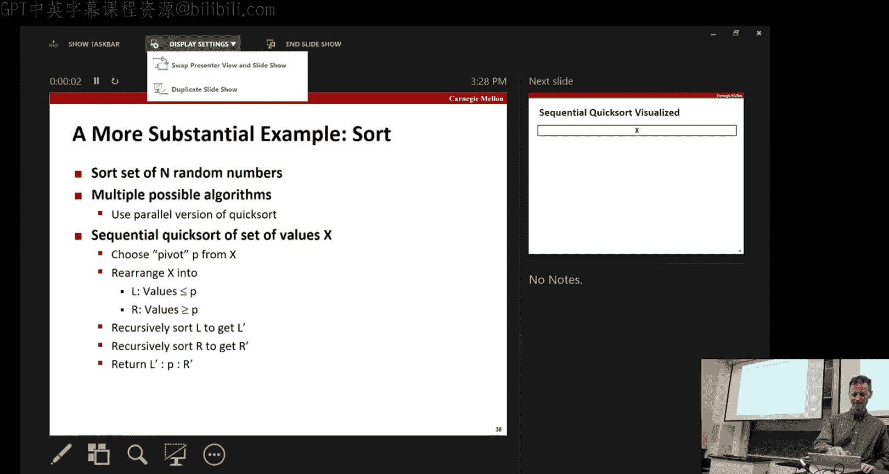
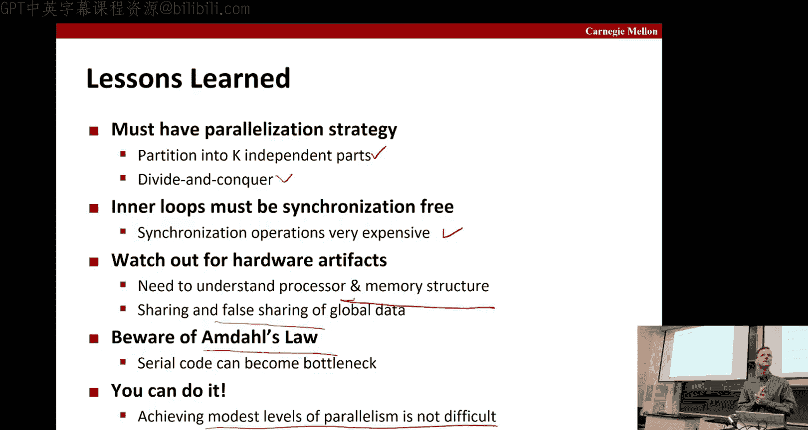

# 计算机系统导论：第31讲：线程级并行

在本节课中，我们将学习线程级并行。我们将简要回顾并行硬件架构，然后讨论多线程环境下的内存一致性模型。最后，我们将探讨如何通过在一个应用程序中使用多个线程来编程，以获得性能提升，并使用一些简单的例子来说明其中的一些问题。

## 并行硬件架构回顾

上一节我们介绍了课程概述，本节中我们来看看并行硬件的基础结构。

下图展示了一个多核处理器的简化模型。每个核心都有自己的一组寄存器、L1数据缓存和L1指令缓存。它们共享一个最后一级缓存（LLC），并连接到主内存。

```
[核心1: 寄存器 -> L1 D$ / L1 I$] \
                                    -> 共享LLC -> 主内存
[核心2: 寄存器 -> L1 D$ / L1 I$] /
```

我们还讨论过乱序处理器的结构。其核心思想是，指令不是按顺序一条条执行，而是被解码后放入一个操作队列。这个队列中的指令会在功能单元可用时被分派执行。例如，一个处理器可能有两个整数单元、一个浮点单元和一个加载/存储单元。加载/存储单元可以访问数据缓存。这种设计提高了性能，因为多个功能单元可以并行工作，并且当一条指令（如缓存未命中）被阻塞时，后续不依赖它的指令可以继续执行。硬件会跟踪所有依赖关系，以决定哪些指令可以乱序执行。

## 超线程技术

超线程是并行的一种特定形式。在典型的Intel处理器上，通常是双路超线程，如下图所示。其基本思想是，在一个物理核心上复制指令控制机制（如程序计数器和操作队列），从而模拟出两个逻辑处理器。

```
逻辑处理器A: [PC, 操作队列, 寄存器文件]
逻辑处理器B: [PC, 操作队列, 寄存器文件]
                共享功能单元和缓存
```

那么，为什么在已经有了乱序执行和多个功能单元之后，还需要超线程呢？原因在于，当一个线程因为等待I/O或发生页错误等长时间操作而停滞时，单个指令流中可能没有足够多的独立指令来保持所有功能单元忙碌。此时，切换到第二个线程可以更好地利用硬件资源。硬件设计者发现，对于大多数工作负载，双路超线程是性价比最高的选择，超过两个线程带来的收益会递减。我们的实验机器（Shark）就支持双路超线程，并且有8个物理核心。

## 内存一致性模型

现在，我们进入今天的核心话题之一：内存一致性模型。当我们有多个线程在同一个地址空间内并发地读写内存时，如果没有协调机制，结果将是一片混乱。为了给程序员提供一个可以推理的抽象模型，硬件和软件之间需要约定一个“契约”，这就是内存一致性模型。

### 不一致性的问题

假设没有缓存一致性机制（例如某些GPU的暂存内存），考虑以下场景：主内存初始值 `A=1`, `B=100`。
*   线程1执行：`A = 2; print(B);`
*   线程2执行：`B = 200; print(A);`

可能发生的情况是：线程1将A=2写入自己的缓存，线程2将B=200写入自己的缓存。由于缓存不协调，当线程2读取A时，它可能从主内存拿到旧的A=1。同样，线程1可能读到旧的B=100。因此，打印结果可能是 `1` 和 `100`，这显然不符合程序员的预期。

### 顺序一致性

顺序一致性是最直观、对程序员最友好的内存模型。它规定：**所有线程的所有内存操作看起来像是按某种顺序一个接一个地执行的，并且这个顺序与每个线程自身的程序顺序一致**。

对于上面的例子，由于每个线程内部的操作必须按程序顺序（写在前，读在后），所以可能的全局执行顺序是有限的。例如，`写A -> 写B -> 读B -> 读A` 是一个有效的顺序，结果是打印 `200` 和 `2`。而 `读B -> 读A -> 写A -> 写B` 则不是一个有效的顺序，因为它违反了线程的程序顺序。**不可能**出现两个读操作都发生在任何写操作之前的情况，因此打印出 `1` 和 `100` 在顺序一致性下是被禁止的。

内存一致性模型是硬件对软件的承诺，它限制了内存状态可能出现的混乱情况。

### 现实世界的挑战：弱一致性模型

然而，维护严格的顺序一致性会带来巨大的性能开销，因为它限制了硬件（尤其是乱序执行）和缓存系统的优化。因此，现实中的处理器（如Intel和ARM）通常提供**弱于**顺序一致性的一致性模型。

乱序执行处理器可能会为了性能而重排指令，即使缓存是协调的。例如，线程2的指令队列可能先执行 `print(A)`，再执行 `B = 200`，导致打印出旧值。

为了在弱一致性模型中强制保证特定顺序，程序员需要使用**内存屏障**（或栅栏）指令。例如，在写操作和读操作之间插入 `sfence` 指令，可以告诉硬件这两个操作的顺序必须被遵守。

```
// 线程1
A = 2;
sfence(); // 内存屏障
print(B);

// 线程2
B = 200;
sfence(); // 内存屏障
print(A);
```

在理想世界中，硬件能快速提供顺序一致性。但在现实中，为了性能，我们不得不在代码中谨慎地使用内存屏障。

## 缓存一致性协议：窥探缓存

虽然处理器可能采用弱一致性模型，但它们通常会保证缓存的一致性，即所有核心看到的内存视图最终是一致的。一种经典的方法是**窥探缓存**协议。

每个缓存行除了数据，还有一个状态标签。一个重要状态是**独占**：表示该核心拥有该缓存行的唯一、可写的副本。

1.  **写操作**：当核心1想写变量A时，它首先通过总线请求A所在缓存行的独占权。获得后，在本地缓存中修改A。
2.  **读操作**：当核心2后来想读A时，它发现本地缓存没有A（或不是有效副本），于是发送读请求到总线。
3.  **窥探与响应**：核心1的缓存控制器一直在“窥探”总线，看到对A的读请求后，意识到自己持有独占副本。于是，它将A的最新值提供给总线，并**将自己的缓存行状态从“独占”改为“共享”**。核心2收到这个值，也将A以“共享”状态存入缓存。
4.  **共享状态**：现在两个核心都以“共享”状态持有A。在共享状态下，多个核心可以同时持有该缓存行的只读副本。
5.  **再次写操作**：如果某个核心（如核心1）想再次写A，它必须重新请求独占权。这个请求会使其他核心（如核心2）中A的缓存行**失效**。核心1获得独占权后，才能进行写操作。

通过这种方式，即使缓存是分散的，系统也能保证所有核心最终看到一致的数据。当最后一个持有缓存行副本的核心需要将其驱逐出缓存时，如果它是被修改过的（处于独占或已修改状态），它必须将数据写回主内存。

**因此，要确保顺序一致性，我们需要正确的缓存一致性行为，同时也需要线程内的顺序约束（有时需要通过插入内存屏障来实现）。**

## 线程级并行编程实践

接下来，我们通过一个简单的例子来学习如何编写多线程程序以提升性能。我们的目标是并行求和：计算从0到N-1所有整数的和。

我们将创建K个线程，每个线程负责求和一段连续的子范围。如果N不能被K整除，最后剩余的部分由主线程串行处理。

### 方法一：更新全局变量（三种变体）

第一种尝试是让所有线程直接更新一个全局变量 `global_sum`。

以下是三种实现方式：
1.  **无同步**：直接累加 `global_sum += i`。
2.  **使用信号量**：在累加操作前后使用信号量进行加锁/解锁。
3.  **使用互斥锁**：使用二值信号量（即互斥锁）进行保护。

**性能结果**：
*   **无同步**：速度有提升（最高约2.86倍加速比），但得到了**错误的答案**。原因是 `global_sum += i` 不是原子操作，多个线程同时读写导致数据竞争。
*   **使用信号量/互斥锁**：得到了正确结果，但性能**极差**（从2.5秒变为约10分钟）。原因是在紧密循环中频繁调用锁操作开销巨大。

显然，让所有线程竞争更新一个共享变量不是好办法。

### 方法二：局部累加到数组

我们改进策略：每个线程将结果累加到一个**全局数组**中自己独有的位置 `psum[thread_id]`。最后，主线程再将这些部分和相加。

我们引入一个 `spacing` 参数，用于控制 `psum` 数组中各元素之间的间隔。
*   当 `spacing = 1` 时，`psum[0]`, `psum[1]`, `psum[2]`... 在内存中是连续的。
*   当 `spacing > 1` 时，例如 `spacing = 8`，每个线程的结果会被存储到相隔较远的位置。

**性能结果**：
*   `spacing = 1`（绿色曲线）：获得了正确的答案，并且有了约5倍的加速比。因为每个线程写的是独立的内存位置，没有数据竞争，所以不需要锁。
*   `spacing = 8`（红色曲线）：性能进一步提升，获得了约13倍的加速比。

**为什么 `spacing` 会影响性能？** 这引出了两个重要概念：
*   **真共享**：多个线程读写**同一个**内存位置。我们的方法二已经避免了这一点。
*   **伪共享**：多个线程频繁更新**同一个缓存行**中的**不同**变量。当 `spacing=1` 时，不同线程的 `psum` 元素很可能位于同一个64字节的缓存行中。线程0更新 `psum[0]` 会使该缓存行在其核心中处于独占状态，导致线程1更新 `psum[1]` 时发生缓存失效和 coherence miss，引发严重的“缓存乒乓”现象，损害性能。将 `spacing` 设为8（假设缓存行64字节，`psum` 为8字节），可以确保每个线程的累加器位于不同的缓存行，从而消除伪共享。

### 方法三：寄存器累加




更优的方法是让每个线程在**寄存器**中累加局部变量 `local_sum`，只在计算结束后将结果一次性写入全局数组 `psum`。这完全避免了在循环中访问共享内存。

**性能结果**（绿色曲线）：比方法二中最好的情况（`spacing=8`）还要快约2倍，获得了约7.5倍的加速比。

**性能评估注意事项**：衡量并行加速比时，应该与**最优的串行实现**进行比较，而不是与“并行代码但只运行一个线程”的情况比较。因为并行代码本身可能带有额外开销（如线程创建、管理），只有当线程数足够多时，其收益才能覆盖这些开销并体现出优势。

**本节编程实践总结**：
*   共享内存访问开销大，应尽量避免。
*   注意**真共享**（数据竞争）和**伪共享**（缓存行竞争）。
*   尽可能使用寄存器或局部变量。
*   利用局部性，提高缓存命中率。
*   公平地划分任务，妥善处理剩余部分。
*   评估性能时，与最优串行算法对比。

## 更复杂的例子：并行快速排序

现在，我们来看一个更复杂的例子：并行快速排序。快速排序本身具有分治特性，天然适合并行化。

### 串行快速排序回顾
1.  选择一个基准值。
2.  将数组划分为两部分：小于等于基准值的 `L` 和大于基准值的 `R`。
3.  递归排序 `L` 和 `R`。

### 并行化策略
并行化的思路很直接：在递归划分后，对两个子数组 `L` 和 `R` 的排序可以并行进行。
*   **任务队列**：将每个排序任务（即对一个子数组排序）视为一个独立任务，放入任务队列。
*   **线程池**：工作线程从队列中取出任务执行。
*   **递归生成任务**：如果一个任务要排序的数组大小超过阈值，它就进行划分，并创建两个新的子任务（分别排序 `L` 和 `R`）放入队列。
*   **串行基线**：当子数组大小小于某个阈值时，直接调用高效的串行排序算法（如插入排序），以避免创建过多微小任务带来的开销。

### 性能与阿姆达尔定律

即使采用了并行递归排序，其加速比仍然有限（实验中最佳为6.84倍，而机器有8核16线程）。瓶颈主要在于**划分操作本身是串行的**。在算法的顶层，第一次划分是串行的；在下一层，两个划分可以并行；再下一层，四个划分可以并行，依此类推。

这引出了**阿姆达尔定律**，它描述了并行加速比的上限：
`加速比 = 1 / ((1 - P) + P / S)`
其中：
*   `P`：可被并行化的部分所占比例。
*   `S`：并行部分的加速比。

假设快速排序中，划分部分（不可并行）占10%，排序部分（可并行）占90%。即使排序部分能获得完美的16倍加速（`S=16`），整体加速比也只有 `1 / (0.1 + 0.9/16) ≈ 5.9`。如果划分部分占比更大，瓶颈将更严重。

为了突破阿姆达尔定律的限制，必须对划分操作本身进行并行化。这可以通过更复杂的算法实现，例如：
1.  **选择多个基准值**进行桶划分。
2.  使用并行前缀和等算法进行高效的分区合并。

在更大的机器或不同的问题规模上，这些高级并行算法可以带来接近线性的加速比。

## 课程总结

本节课中我们一起学习了线程级并行的核心知识：
1.  **硬件基础**：回顾了多核、乱序执行、超线程等硬件并行支持。
2.  **内存模型**：理解了顺序一致性的理想模型，以及现实中弱一致性模型带来的挑战（需要内存屏障）。
3.  **缓存一致性**：学习了窥探缓存等协议如何保证多核缓存的数据一致性。
4.  **并行编程**：通过求和的例子，实践了如何避免数据竞争、伪共享，并利用局部性优化性能。
5.  **实际案例**：分析了并行快速排序的实现和性能瓶颈，认识了阿姆达尔定律对并行加速比的根本性限制。




关键要点：编写高效并行程序需要综合考虑算法、数据布局、硬件特性和同步开销。在当今多核普及的时代，理解这些原理对于开发高性能软件至关重要。