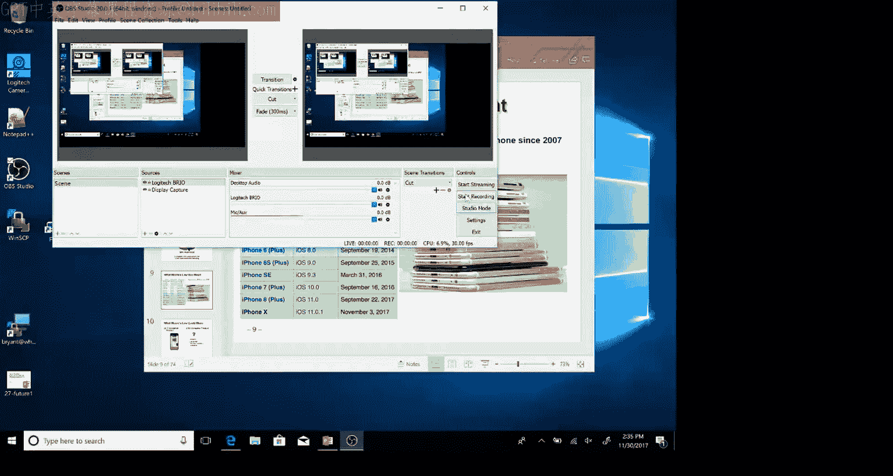
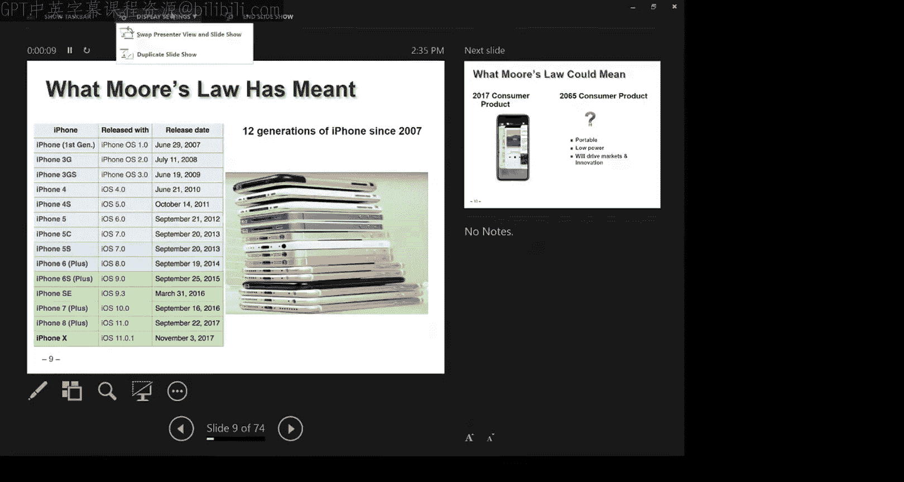
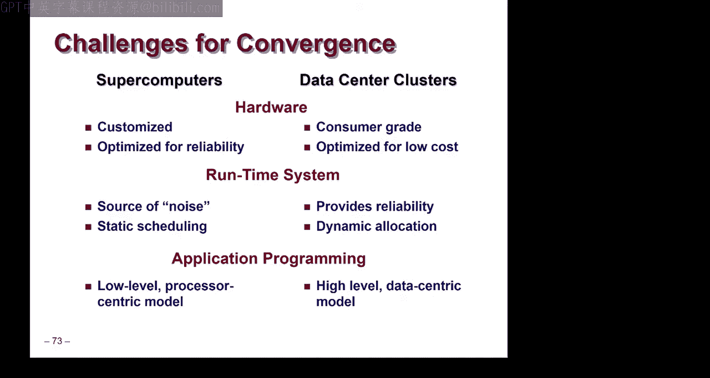
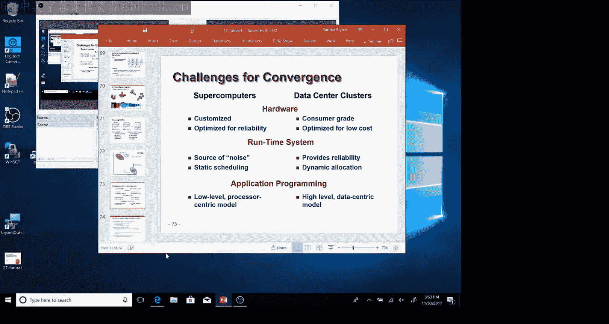

# 计算机系统导论：第32讲：计算的未来 I

在本节课中，我们将探讨计算机硬件技术的发展趋势，特别是摩尔定律的历史、现状及其面临的物理和经济极限。我们还将对比超级计算机与数据中心这两种高性能计算模式的特点与挑战。

## 摩尔定律的起源与影响

上一节我们介绍了课程即将结束的背景。本节中，我们来看看计算技术发展的一个核心驱动力：摩尔定律。

戈登·摩尔是英特尔公司的联合创始人之一。早在1965年，他在《电子学》杂志上发表文章，基于当时有限的数据点（1962年和1965年）做出了一个大胆预测。他乐观地估计，到1975年，单个芯片上能够集成的晶体管数量将达到65，000个。他最初认为晶体管数量每年会翻一番，但不久后修正为每两年翻一番。这个预测并非自然法则，而是基于技术可行性和经济成本的权衡。芯片制造商可以在一定技术极限内提高电路密度，但超越某个点后，制造成本会急剧上升。

摩尔定律的核心是：在保持单位制造成本大致不变的前提下，芯片上可容纳的晶体管数量大约每两年增加一倍。

## 摩尔定律的验证与演变

以下是自1971年首款微处理器（Intel 4004）问世以来，不同类型芯片的晶体管数量增长趋势：

*   **嵌入式系统**：如早期的计算器芯片和如今的智能手机处理器。
*   **桌面系统**：个人电脑的中央处理器。
*   **图形处理单元**：用于高性能计算的GPU。
*   **服务器**：数据中心使用的处理器。

将这些数据绘制在半对数坐标图上，可以看到一条清晰的增长趋势线。实际数据与摩尔最初的预测线基本平行，证实了晶体管数量大约每两年翻一番的规律，这一趋势已持续了50多年。

## 技术进步的规模效应

这种指数级增长带来了惊人的性能对比。1976年的Cray-1超级计算机被认为是当时的巅峰之作，重约5，000公斤，功耗115千瓦，售价900万美元，总共生产了80台。相比之下，如今的一部智能手机（如搭载A11芯片的iPhone）重量仅几百克，峰值功耗约5瓦，售价约1000美元，其主芯片集成了约43亿个晶体管。仅在发布后的首个黑色星期五，就有约900万部此类手机售出。

这种规模经济效应至关重要。巨大的销售量产生了巨额利润，这些利润又被重新投资于技术研发，从而生产出更强大的产品，进一步刺激消费，形成一个良性循环。如今，消费电子产品（如智能手机）而非小众的超级计算机，已成为驱动半导体行业前进的主要力量。

## 未来的挑战：尺寸与密度

如果我们简单地将摩尔定律的趋势外推到2065年（即自1965年起100年后），会得到约10^17个晶体管的数字。然而，仅靠二维平面缩放无法实现这一目标。

首先，芯片面积不能无限增大。如果保持当前芯片面积的增长趋势，到2065年芯片将大如几张美元钞票，这不适合便携设备。其次，更关键的是晶体管尺寸的缩小。目前最先进的制造工艺号称达到10纳米级别。如果继续按历史趋势缩小线宽，到2065年将达到243皮米的尺度，这已经小于氢原子（约74皮米）和硅原子（约500皮米）的间距，违反了物理规律。

因此，未来的增长必须寻求新的维度。

## 三维集成与新的可能性

一种可能的解决方案是三维堆叠技术。假设我们允许一个封装体积相当于三枚叠放的镍币（约5毫米高，20毫米见方），并能在其中集成10万个逻辑层（每层物理厚度约50纳米），那么要达到10^17个晶体管，所需的平面线宽约为20纳米。这虽然比当前技术小一个数量级，但至少不违背已知物理定律。

然而，三维集成面临多重严峻挑战：

1.  **制造成本**：当前芯片制造需要约60道光刻步骤。如果层数增加到百万级，沿用现有逐层光刻的方法，成本将无法承受。需要革命性的制造技术，例如类似现代3D NAND闪存的多层同步加工技术。
2.  **缺陷容忍**：当器件数量达到10^17，层数达到百万级时，保证所有层都没有缺陷几乎不可能。需要系统架构能够容忍大量故障单元。
3.  **功耗与散热**：这是最根本的挑战。便携设备功耗必须很低（例如几瓦），否则会产生无法忍受的热量。人脑功耗约15瓦，但神经元工作频率极低（约100赫兹）。未来技术可能需要在架构和材料上进行根本性革新以实现超低功耗。

## 经济与产业集中化

技术进步严重依赖巨大的资本投入。一张图表显示，有能力制造最先进芯片的公司数量已从过去的十几家减少到如今的仅四家：英特尔、三星、台积电和格罗方德。产业高度集中源于建设一座先进晶圆厂需要数百亿美元投资，只有通过海量出货（数百万乃至数十亿颗芯片）才能摊薄成本。这种集中化可能削弱市场竞争，对未来创新构成风险。

## 登纳德缩放定律的终结

除了密度缩放，另一个关键趋势是登纳德缩放定律的终结。罗伯特·登纳德在1974年提出，当晶体管尺寸按比例缩小K倍，同时工作电压也降低K倍时，芯片性能将提升K倍，而功耗保持不变。这解释了为何过去能在提升性能的同时控制功耗。

然而，大约在2004年，由于硅材料的物理限制，电压无法继续降低，登纳德缩放失效了。这导致单核处理器的主频停止增长（停留在2-4 GHz范围）。为了继续利用日益增多的晶体管，行业转向了多核架构。这不是因为人们迫切需要多核，而是因为无法让单核跑得更快。

## 高性能计算的两种范式

现在让我们转向计算的另一个前沿：高性能计算。当今最大的计算系统主要分为两类，它们的目标和架构截然不同。

**超级计算机**（如“泰坦”）专为解决最复杂的计算问题（如宇宙模拟、流体动力学、流行病传播建模）而设计。其编程模型通常是“整体同步并行”，将计算域划分为网格，分配到各个节点，循环进行“计算-通信”步骤。这种模式对负载均衡极其敏感，且编程复杂，通常需要混合使用MPI（节点间通信）、多线程（节点内CPU核心）及CUDA等（GPU编程）。

**数据中心**（如谷歌、亚马逊的云设施）则旨在服务海量用户，处理多样化的任务，核心是数据管理和提取价值。它们由大量商用硬件组成，强调可扩展性、成本效益和快速部署，而非极致的单任务性能。其编程模型（如MapReduce）更关注数据流和容错。

## 融合的趋势与挑战

目前，这两种范式呈现出融合趋势。模拟科学需要融入更多观测数据进行分析，而数据分析（特别是深度学习训练）的计算强度越来越高，越来越像超级计算任务。

然而，将两者硬件和软件体系融合面临巨大挑战。超级计算机的同步模型无法容忍数据中心硬件（如磁盘）的高延迟和易故障特性；而将超级计算机的专用编程模型移植到松散耦合的数据中心集群上也异常困难。如何构建能同时高效处理大规模模拟和海量数据分析的统一平台，是当前的重要挑战。

## 总结

本节课中我们一起学习了计算硬件的未来。我们回顾了摩尔定律的历史性成功，以及它当前在物理尺寸、功耗和经济成本方面遇到的根本性极限。未来增长可能需要依赖三维集成等新范式。我们还探讨了高性能计算领域超级计算机与数据中心两种范式的区别、各自的挑战以及它们正在融合的趋势。这些发展预示着，未来的计算技术、架构和编程方式都可能与我们今天所熟悉的截然不同。