# 计算机系统导论：第33讲：计算的未来 II 🚀

在本节课中，我们将探讨大规模机器学习（或称“大学习”）的未来，特别是其独特的计算特性，以及如何利用这些特性来构建更高效的计算系统。我们将从系统设计的角度，分析现有框架的局限性，并介绍一系列旨在加速大学习任务的新颖优化技术。

---

## 概述：大学习的独特之处 🤔

在上一节中，我们讨论了计算领域的未来趋势。本节我们将继续这一主题，重点关注近年来主导云计算和数据中心计算周期的大规模机器学习，特别是深度网络。我们将探讨这种计算有何特殊之处，使其区别于过去几十年的其他计算，以及如何利用这些特性来构建更好的计算系统。

---

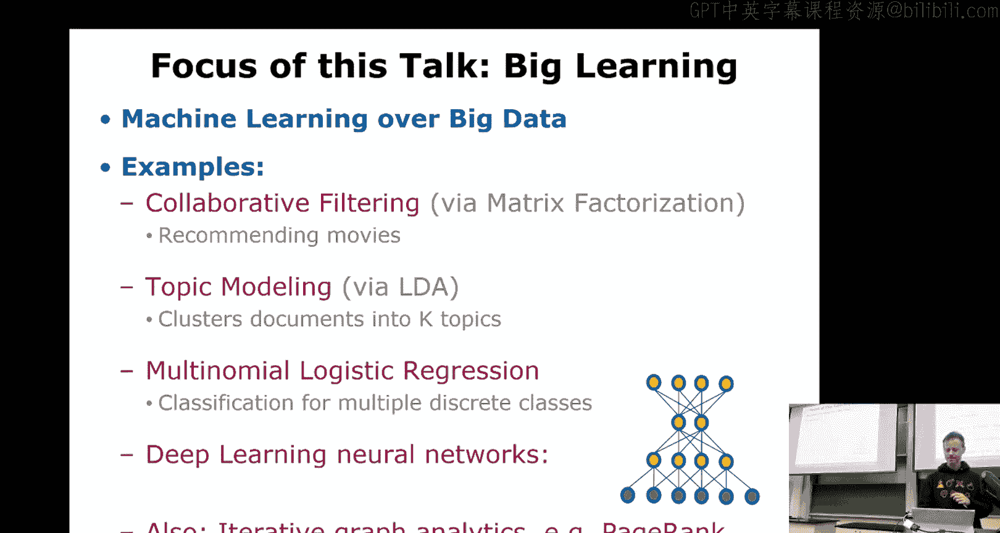

## 什么是大数据？📊

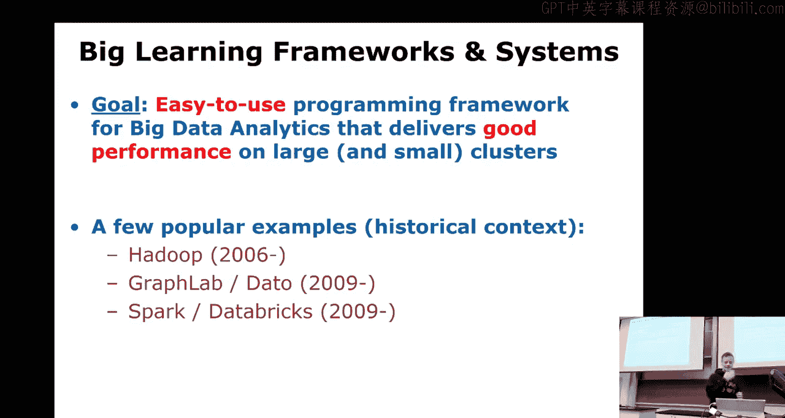

许多人过去十年都听说过“大数据”。大数据现象带来了巨大的炒作，但也蕴含着巨大的价值。然而，我们将在整个大数据领域中，专注于“对大数据进行机器学习”这一部分。

以下是一些属于这类应用的例子：
*   **推荐系统**：根据你的喜好推荐电影或书籍，这被称为协同过滤。
*   **主题建模**：将新闻文章等集合根据其中的词汇聚类成不同主题。
*   **分类问题**：通常可以建模为回归问题，特别是多类回归问题。
*   **深度网络**：如上节课讨论的卷积神经网络。
*   **其他迭代式数据分析**：如计算网页的PageRank。

我们将从计算系统的角度来看待这个主题。目标是建立一个框架，让机器学习专家能够轻松表达他们想要进行的计算，并且该框架能在大型和小型集群上都能提供良好的性能。

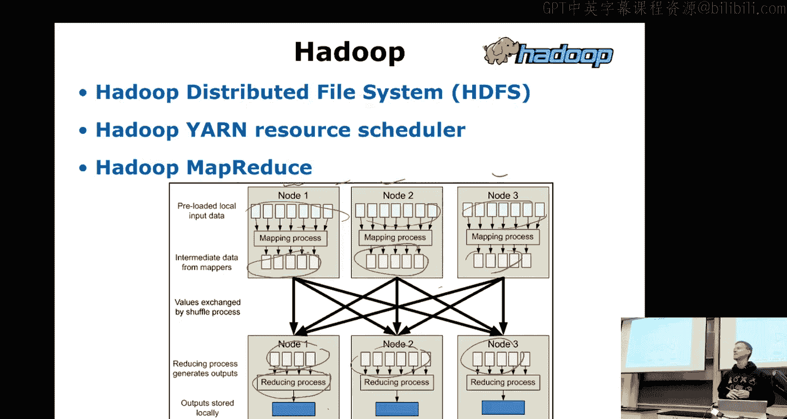

---

## 现有框架回顾 🔄

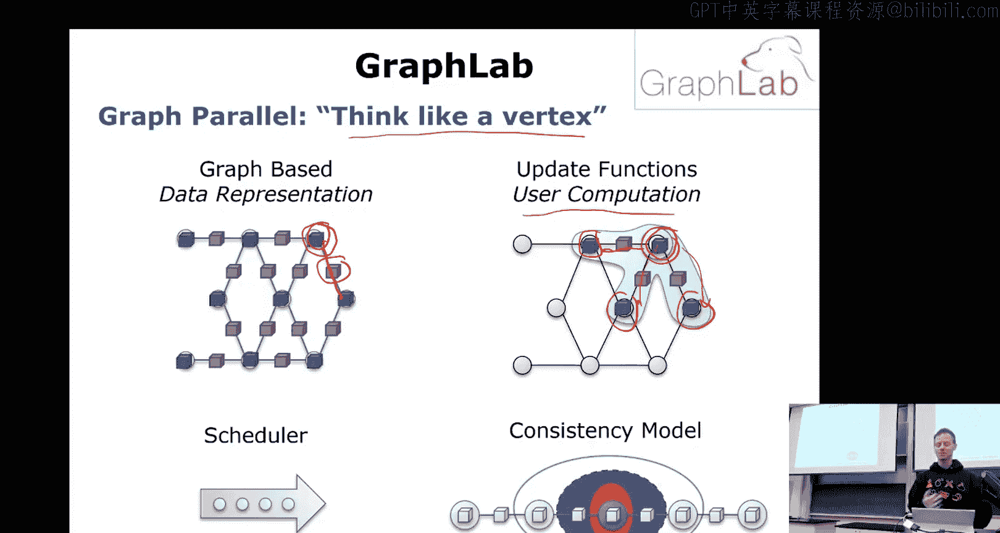

上一节我们介绍了一些现有框架。这里我们快速回顾一下，以便大家跟上进度。

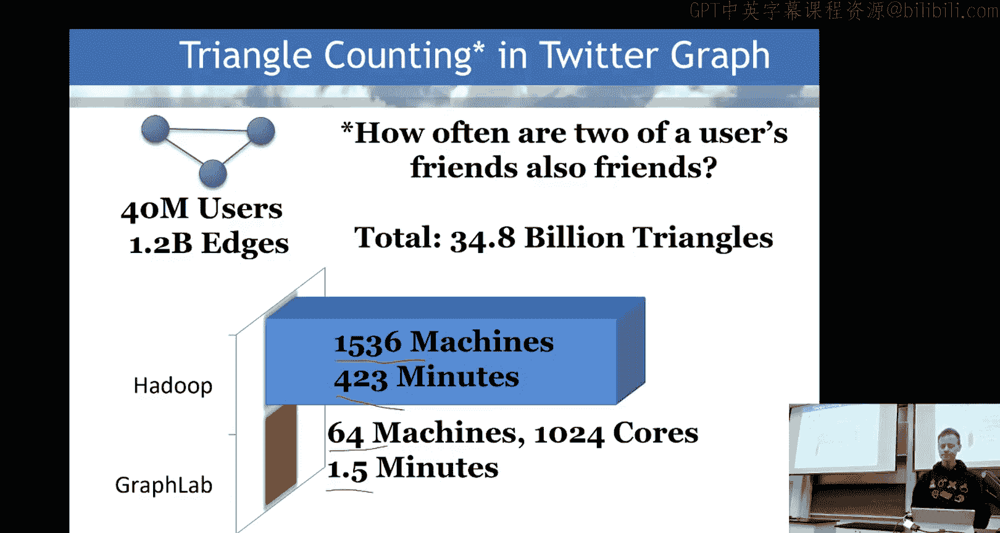

### Hadoop 🗺️

Hadoop本质上是一个分布式文件系统，附带资源调度器。它使用MapReduce计算风格，可以轻松地将大型数据计算映射到多台机器上。

以下是其工作原理：系统中有多个节点，每个节点上都有输入数据。它们首先执行用户提供的Map函数，生成中间数据。然后，所有信息进行交换，使得同类数据最终位于同一个节点上。接着，在该同类数据上执行用户提供的Reduce函数，产生最终输出。

Hadoop大约从2006年开始成为一种非常成功的方法。许多基础的大数据分析问题都可以套用这个框架。它之所以成功，主要是因为易用性，而不是因为它提供了任何合理的性能。

### GraphLab 📈

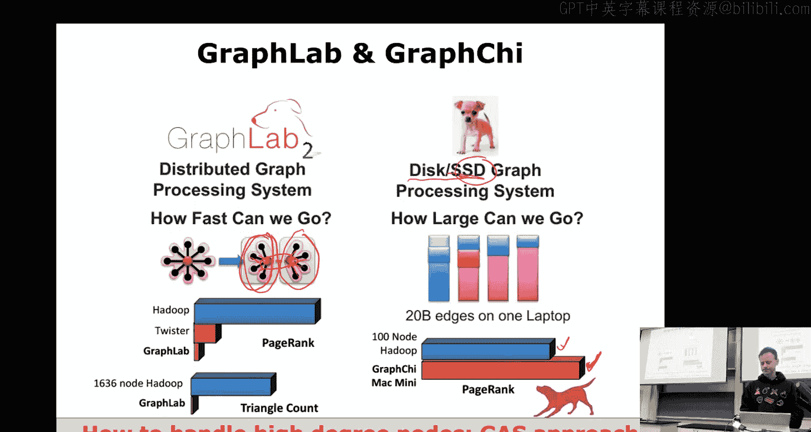

GraphLab也由Randy在上节课提到过，它出自CMU。它引入的一个概念是，将图上的计算视为在由节点和边组成的图上进行的计算。节点和边都有属性，你可以更新它们。

计算以“像顶点一样思考”的框架来表达：从一个节点的视角出发，基于其邻居节点的值以及连接边的权重进行一些计算。这种编程风格非常适合某些类型的计算，比如PageRank，你需要查看邻居页面的排名，并基于这些排名更新自己的排名。

GraphLab取得成功的关键在于，这种图并行抽象（特别是“像顶点一样思考”的抽象）对于特定风格的计算来说，比MapReduce更容易使用。另一个原因是它的性能显著更好。早期的一个三角形计数任务结果显示，在Hadoop上需要1500台机器运行7小时的任务，在GraphLab上只需64台机器运行1.5分钟。

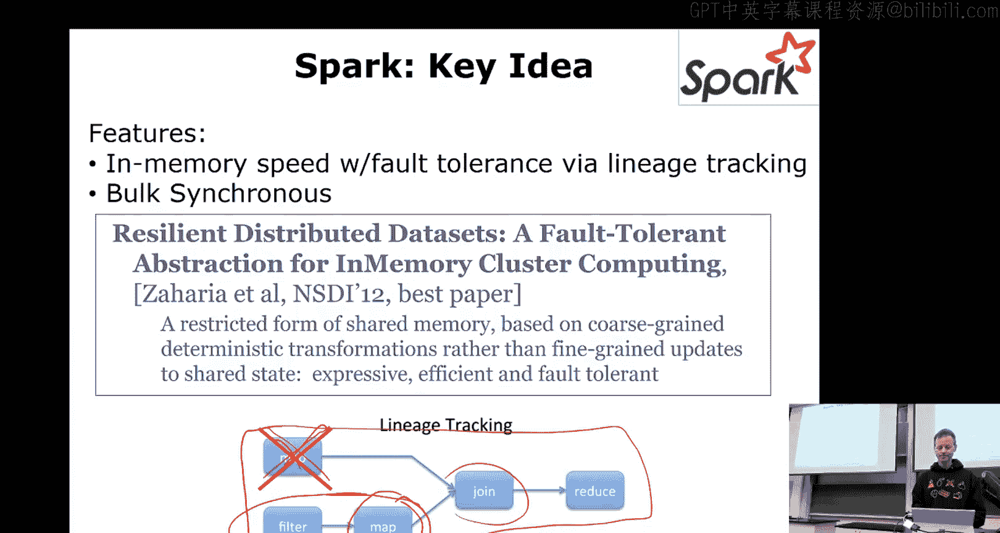

GraphLab 2.0解决了高度数顶点（如拥有大量Twitter关注者的人）的问题。它将高度数顶点分割成多个子顶点，使得整体度数降低，然后应用“收集-累积-散射”过程来处理。

GraphChi项目则探索了在单机上运行这些大数据问题。它重新设计了机器学习算法的处理方式，使其即使在需要扫描SSD时也能保持良好的性能。结果显示，在一台数据存储在SSD上的Mac mini上，其性能几乎与一个10节点的Hadoop安装相当。这使得即使在单机上也能进行快速的大学习。

### Spark ⚡

Spark的出现是为了解决Hadoop运行速度过慢的问题。Hadoop速度慢的原因之一是，它在每个Map和Reduce阶段之后都会将数据写入磁盘并从磁盘读取，这是为了在机器崩溃时确保工作不丢失。

Spark团队发现，还有其他方法可以获得持久性。他们提出，如果我们将计算限制在那些对其输入进行确定性转换的操作上（即每次对特定输入运行Map都会得到相同结果），那么我们只需跟踪操作的“谱系图”。如果某台机器崩溃，我们只需重新运行受影响的部分，而其他部分仍然完好。通过这种方式，可以实现快速恢复，并且完全在内存中操作。

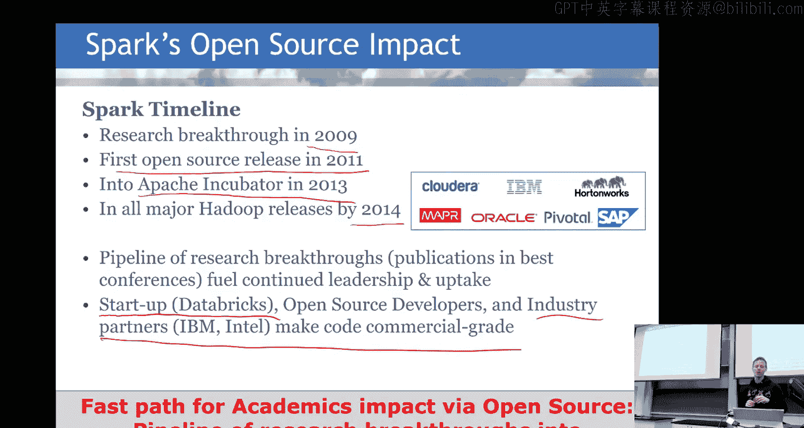

Spark项目的另一个有趣之处在于社区对其突破性进展的响应速度。他们在2009年提出研究想法，2011年发布第一个开源代码，2014年就被纳入所有主要的Hadoop发行版中。

从路线图来看，成功的关键在于：首先，要有足够显著的改进以吸引人们关注；其次，持续进行研发创新以保持领先；然后，通常会衍生出初创公司来生产高质量的代码；最后，与加入的工业伙伴合作，因为开源特性对工业伙伴有吸引力。

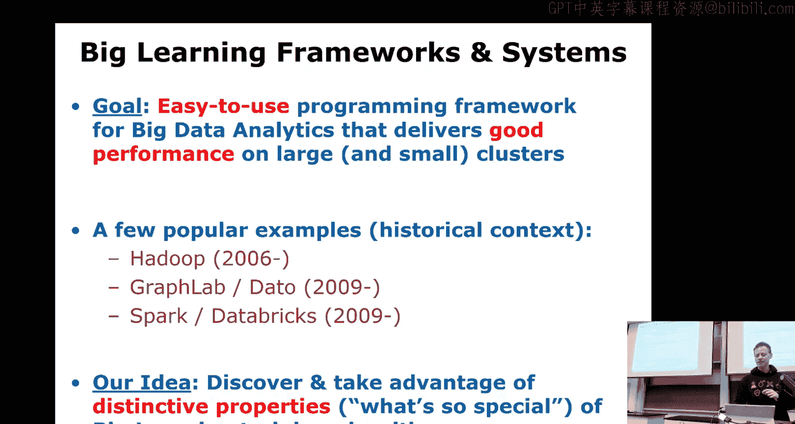

这应该对你们所有人都是一个鼓励，无论是在你们未来的职业生涯中，还是在你们的高级项目里，在计算系统和软件领域产生影响的门槛可能从未如此之低。

---

## 大学习的独特计算特性 🧠

与刚才描述的系统相比，我们决定探索这些计算任务本身的特性。我们的想法是，尝试发现大学习（特别是训练算法）有何独特之处。训练算法是那些需要运行数天、数周甚至数月的算法。那么，这些算法有什么特别之处，能让我们做出比现有方法更智能的事情呢？

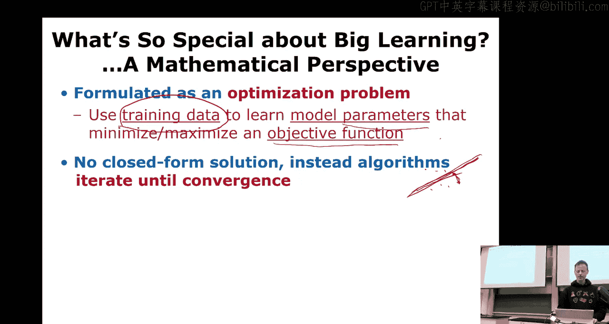

### 数学视角：模型拟合 📐

要从系统角度思考大学习的特殊性，首先需要从数学角度审视这些计算在做什么。这些计算的关键组成部分是尝试将模型拟合到某些数据上。因为如果你能将模型拟合到训练数据，那么假设当你获得真实数据或测试数据时，它也能很好地预测。

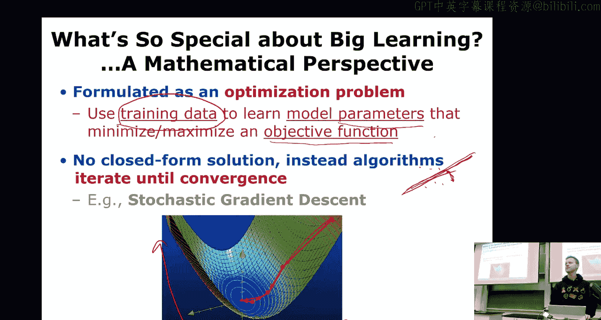

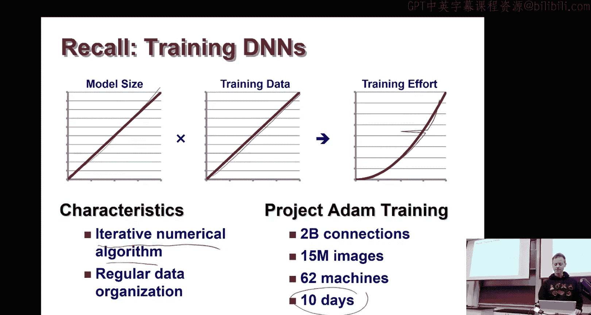

你有一堆带标签的训练数据和一个模型。模型只是一个数学表达式或方程组，其中包含参数。以最简单的线性回归为例：你有一堆点，想画一条线穿过这些点以最小化误差。模型规定它必须是一条线，而参数决定了这条线的斜率。

然后，有一个目标函数，你试图最小化或最大化它。对于线性回归，目标函数通常是最小化所有点到这条线的距离平方和。对于分类问题，你试图根据一条分类线将点分成两组，目标可能是最小化错误分类的项目数量。

与线性回归情况不同，这些问题通常没有封闭形式的解。因此，算法是迭代的：它们遍历训练数据，将其与模型进行比较，查看哪些参数可以调整，以使得模型更好地拟合训练数据。

这类问题通常使用随机梯度下降的多种变体来解决。你可以将随机梯度下降视为在参数选择上的优化函数。你从某个初始解开始，通过一系列迭代步骤向最小值移动，每一步都根据训练数据微调参数以改善拟合。

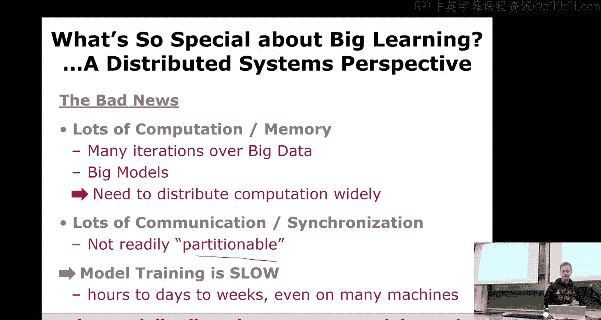

上节课的幻灯片强调了这些是迭代数值算法。如果你线性地增加模型大小，同时也线性地增加训练数据，那么训练工作量会呈二次方增长。这就是为什么这些任务可能需要10天甚至更长时间的原因之一。

---

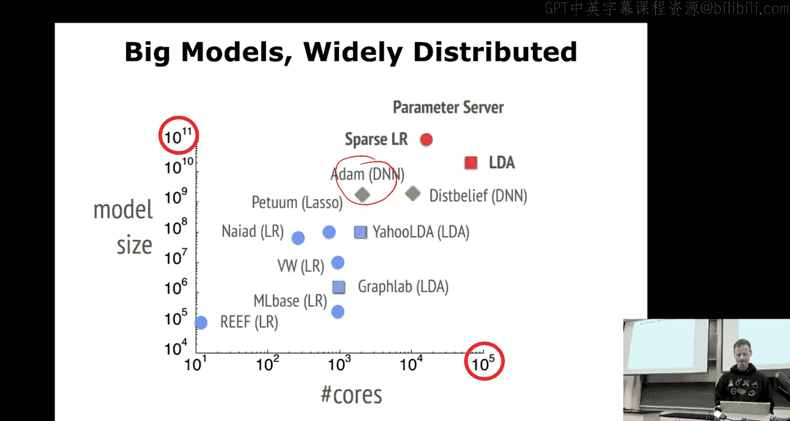

## 挑战与机遇：坏消息与好消息 ⚖️

### 坏消息：计算与通信的挑战 🐢

首先谈谈坏消息。坏消息是，需要大量的计算和内存。你需要进行多次迭代，反复遍历数据。这些模型很大，参数众多。对于这些非常大的模型，你实际上需要将它们分布到多台机器上，在云中或数据中心运行。这带来了通信和同步的成本。不同节点之间的通信成本远高于单机内核心之间的通信。

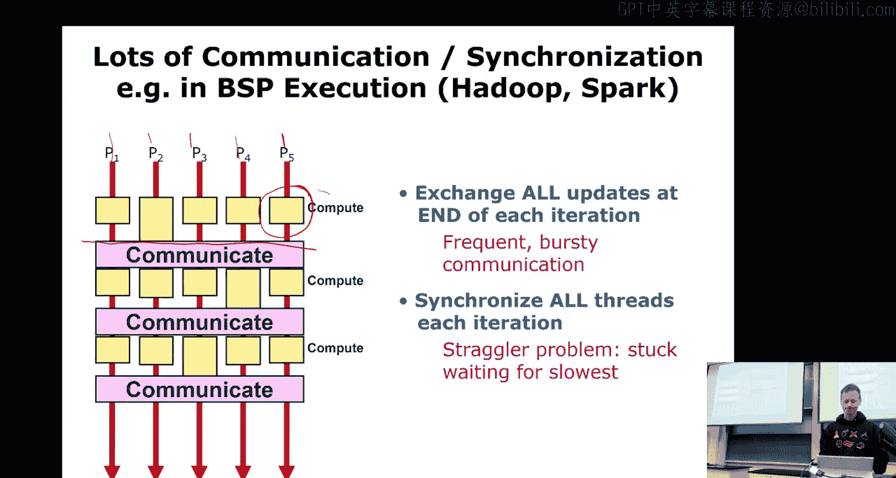

如果你必须广泛地拆分计算，而拆分后的部分又不需要相互通信，那问题还不大。但不幸的是，这些模型的工作方式导致参数之间相互影响，存在大量互联。因此，这不是一个可以完美划分的案例，对通信和同步的需求很大。

这种组合意味着训练非常缓慢，即使在多台机器上也需要数小时、数天甚至数周。这对研究人员来说，挑战即是机遇。

### 好消息：算法的固有特性 🎯

好消息在于这些训练算法的工作方式。每个工作线程（每台机器上的每个工作线程）拥有一些训练数据。它查看那部分训练数据，读取与之相关的模型参数，然后将其向期望的方向“微调”。具体来说，它提供一个增量（delta），比如给这个参数加1，或给那个参数减0.5，而不是直接指定新值应为7。

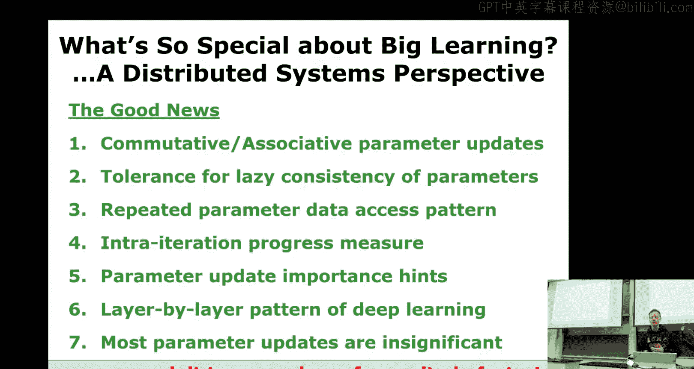

因为这些总是增量，所以更新是可交换的（忽略浮点问题，在这个场景下可以忽略，因为我们只是沿着凸函数的斜坡向下走，浮点误差不会阻止我们到达目标）。

另一个有趣的思考点是，你可以选择最直接的路径到达底部，也可以选择一条不那么直接的路径。就像滑雪下山一样，无论哪种方式你最终都会到达底部，只是来回次数不同。从系统角度来看，这意味着实际上不需要像某些大型科学模拟那样严格同步参数更新。参数更新存在对“惰性一致性”的自然容忍度。

如果我读取参数时使用的是稍旧的值，也没关系。我们还识别出了其他一些特性。关键在于，由于这些好消息，我们可以克服一些性能挑战，使整个训练过程比原本快几个数量级。

---

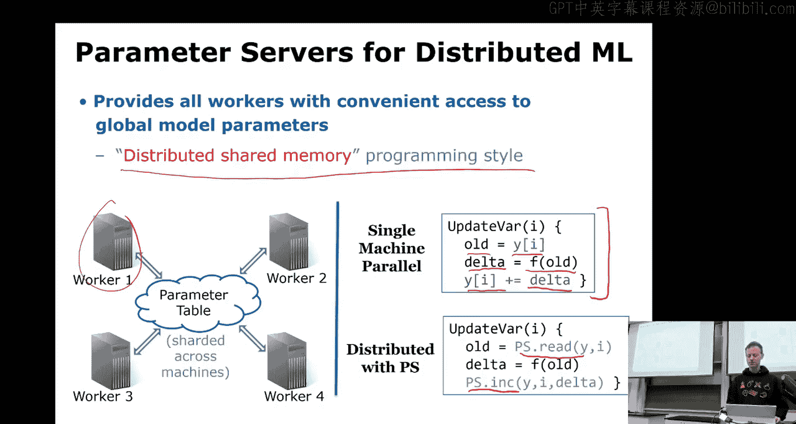

## 参数服务器：一种新的编程抽象 🖥️

在上节课和本节课中，我们都讨论了用于大规模计算的各种编程抽象和框架。我们提到了MapReduce，提到了图并行（“像顶点一样思考”），这里我们介绍一个在CMU发明的称为“参数服务器”的抽象。

参数服务器是一种分布式共享内存编程风格。在这种风格中，工作线程将参数集视为存储在某种共享内存中，允许它读取和更新。例如，如果你在单机上的代码是这样的：读取变量的旧值，应用某个函数来计算如何改变该变量，然后将增量加回变量。在参数服务器模型中，代码看起来完全一样，只是我们将这些读写操作包装成了参数服务器读取和参数递增/更新调用。

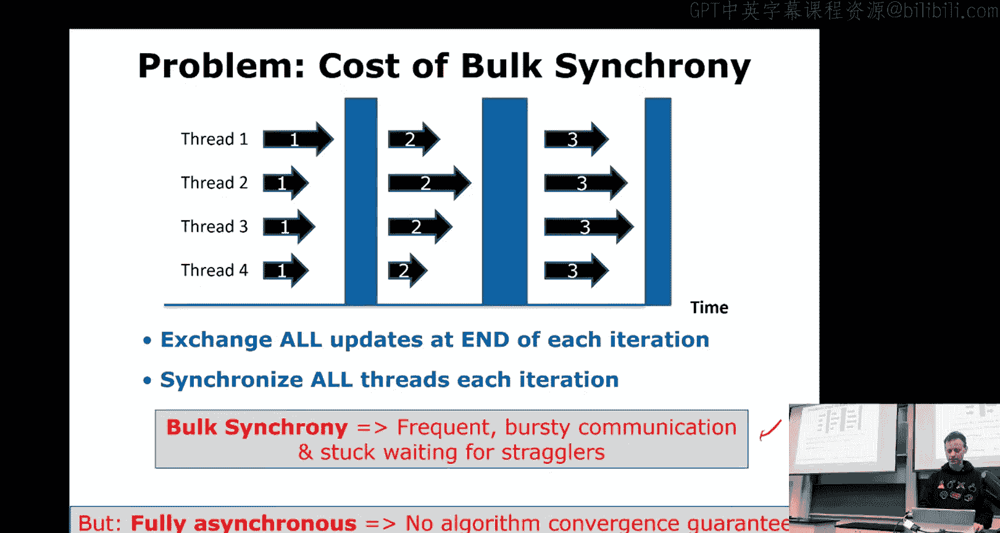

因此，即使代码跨越多个节点，其编写方式对于任何习惯在单机上编写并行代码的人来说都非常自然。更重要的是，你可以像数学公式那样编写代码，机器学习算法的步骤通常就是用数学定义的，你不需要翻译成其他格式。

### 解决同步问题：有界陈旧性 🕰️

但我们仍然不希望有这种批量同步的问题。既然我们说过不需要沿着最陡的路径下山，可以曲折前进，因此对一致性要求不那么严格。那么，一个直接的想法是：如果这是真的，为什么不干脆移除所有同步，完全异步运行呢？

这听起来是个好主意，但实际发生的情况是整个过程会发散。你不仅没有下山，反而可能冲下悬崖。在实践中，事情往往会失控，根本不收敛。此外，大多数算法都有某种收敛保证，批量同步的方法具有这个特性，但完全异步的方法没有，你无法确信算法会收敛，事实上它常常不收敛。

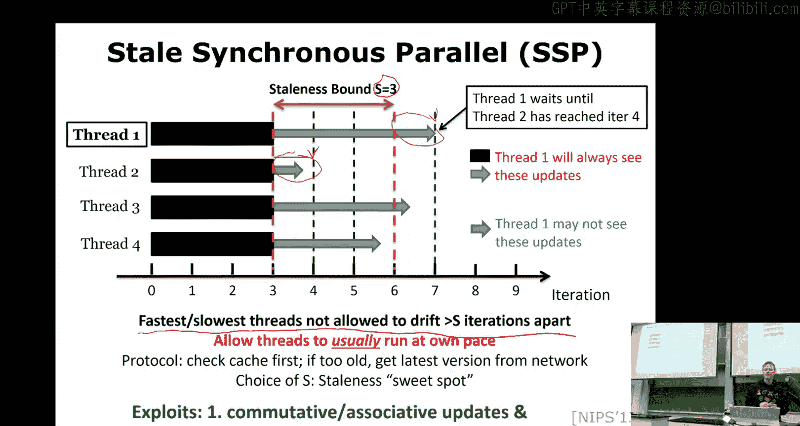

因此，我们提出了一种介于这两个极端之间的方法。我们引入了“陈旧性界限”的概念。它规定最快和最慢的线程最多只能相差S次迭代，这是可以接受的。但如果任何线程比最慢的线程领先超过S次迭代，那么这个线程就需要等待，或者去读取最新的值以赶上进度。

这样做的好处是，至少它节省了通信和同步的开销，因为你只需要每S步关心一次同步。但实际上，它比这更好。想象一场势均力敌的赛马。在整个比赛过程中，最快的马从未领先最慢的马超过一个固定距离。同样，在这种情况下，如果“赛马”始终保持紧凑，我们可能在整个计算过程中都不需要被迫等待。

协议是这样的：每个工作线程维护一个参数值的本地缓存。当它想读取一个参数时，先查看缓存。缓存条目带有迭代编号的标记。如果陈旧度（领先的迭代数）超过界限S，则认为它太旧了，需要从网络中读取最新版本；否则，可以直接使用缓存版本，无需任何协调。

选择S值是一个寻找“甜点”的过程。这既利用了更新可交换的特性，也利用了对惰性一致性的容忍度。甜点之所以出现，是因为最直接的路径（最陡下降）要求你一直同步。整个系统每一步都进展良好，但每一步都被最慢的线程拖累。所以，步数最少的路径反而是最慢的路径。

图表显示，如果采用批量同步，每次迭代都很慢。从迭代速度来看，最快的是完全异步（此时S为无穷大），迭代飞速进行，因为没有人同步；而批量同步的迭代则缓慢爬行，因为你每次都必须同步。另一方面，如果你一直同步，那么每次迭代在目标函数上的进展效果是最好的。你只需要更少的步骤就能下山，但每一步都更慢。相反，完全异步的方法（在这个例子中看起来收敛了）每次迭代的进展最小。

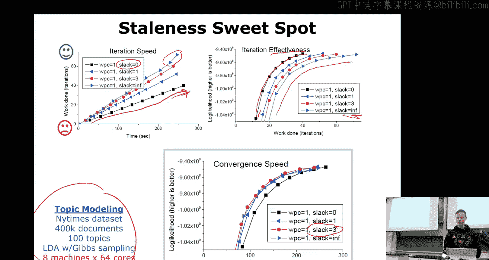

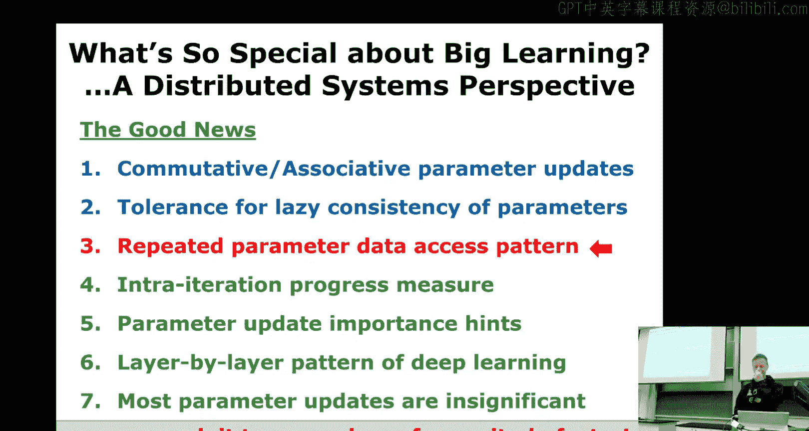

当你结合这两个竞争因素时，会发现像S=3这样的中间值能带来最佳结果。

---

## 利用可预测的访问模式 🎯

接下来我想讨论的是重复的参数数据访问模式。我将以PageRank为例来说明。

假设有三个页面，页面之间存在链接。算法非常简单：将排名初始化为一些随机值，然后重复循环直到达到某种收敛概念。对于每个从I到J的链接，读取I的排名，并用它来更新J的排名。

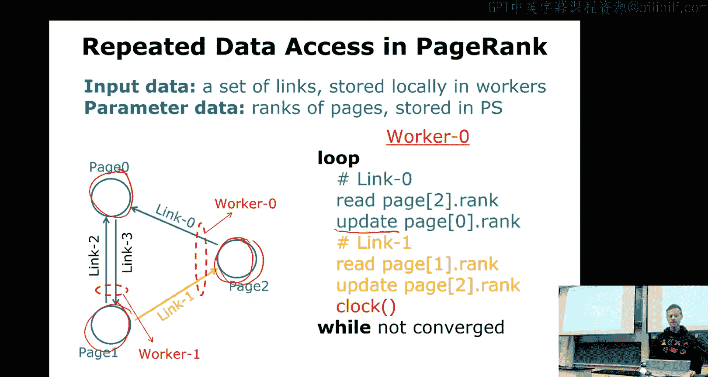

处理都是关于边或链接的。你将所有链接分配给所有工作线程。在这个简单例子中，我们有两个工作线程。工作线程0负责链接0和1。从工作线程0的角度看，循环意味着：首先处理链接0，它需要读取页面2的排名，并用它来更新页面0的排名；然后处理链接1，读取页面1的排名，更新页面2的排名。

关键是，尽管更新值取决于排名的实际值，但访问模式是不变的。每次都是读取这个，更新那个。从计算系统的角度来看，这是理想模式，因为它完全可预测。

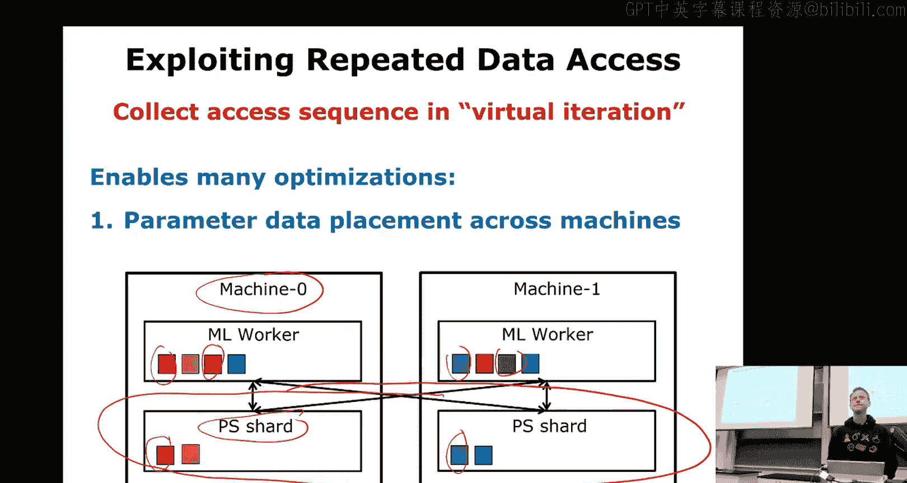

因此，我们可以利用这种完全可预测的访问模式，在系统中玩一些技巧。例如，预取：在实际需要读取值之前，提前将数据取到缓存中。你还可以决定缓存中保留什么。既然确切知道访问模式，就不必依赖LRU等启发式方法，可以在需要驱逐某些内容时做出智能决策。

### 优化数据放置 🗂️

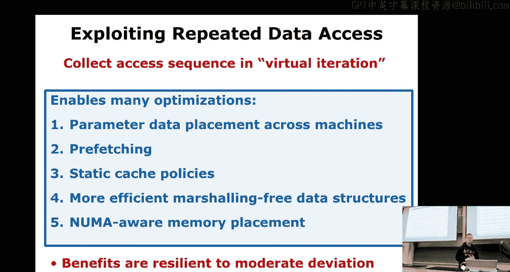

另一个技巧是跨机器的预测性数据放置。参数服务器的实现方式是将键空间（参数空间）随机分片，分布到不同的机器上（通常与工作线程在同一台机器上）。每个机器上的参数服务器分片负责存储全局参数服务器的一部分参数。

既然我们知道访问模式（例如，这个工作线程读取黄色、红色、蓝色；那个工作线程读取绿色、红色、蓝色），我们就可以进行优化：将绿色参数放在经常访问绿色的机器上，将红色参数放在经常访问红色的机器上。这样可以减少需要通过网络发送的数据量。

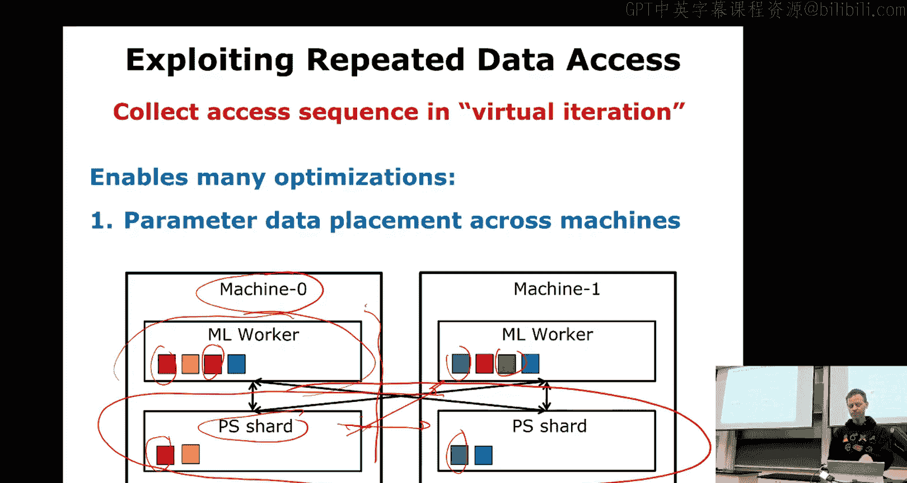

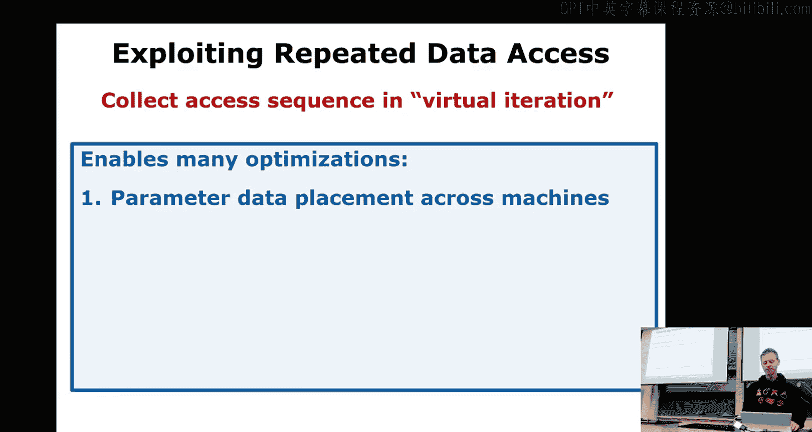

当我们实施这些优化时，获得了相当不错的加速。例如，在一个协同过滤任务（矩阵分解，推荐电影）中，我们在8台机器上运行。未优化前，训练耗时152秒；应用了所有利用访问模式知识的优化后，时间降至36秒。与GraphLab在相同任务上的507秒相比，我们有显著优势。经过99次迭代后，我们仍然保持领先。最终，这一系列优化使速度提升了4.5倍，比GraphLab快11倍。

---

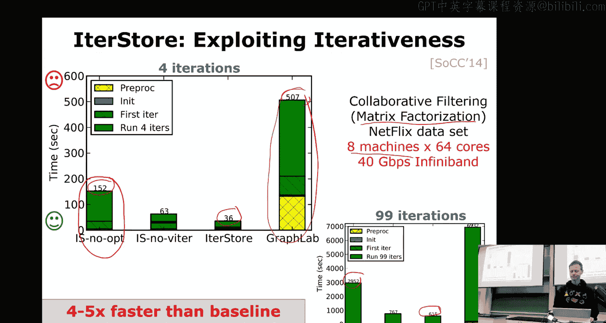

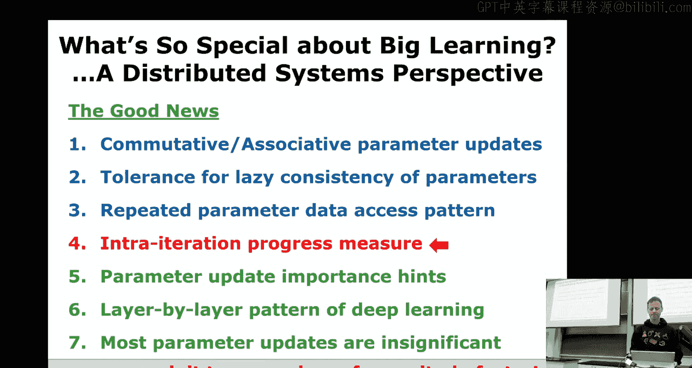

## 处理掉队者问题 🐌

接下来谈谈掉队者问题。我说过，采用有界陈旧性模型在减少同步和通信量方面是一个巨大的胜利。如果“赛马”势均力敌，你可能永远不需要停止。但如果赛马不势均力敌呢？如果10万匹马中，总有一匹落后呢？那么，即使你每S次迭代才等待一次，你仍然会被拖慢。

因此，我们提出了另一种技术来解决这个问题。最简单的做法是：如果某个工作线程运行落后，我们将其部分工作卸载给其他线程，这样它需要做的工作减少，就不会拖慢整个迭代。在Hadoop和Spark中，通常的做法是克隆：当你发现某个工作线程变慢时，你启动另一个工作线程执行完全相同的任务，如果第二个也慢了，就启动第三个，依此类推。你赌的是其他工作线程不会成为掉队者。

但问题在于，克隆打破了这些机器学习算法的一些数学假设。虽然这些计算对某些事情有很大的灵活性，但对其他类型的事情则没有容忍度。克隆技术因为这一点而无效。我们需要一种能确保没有两个副本同时运行的方法。

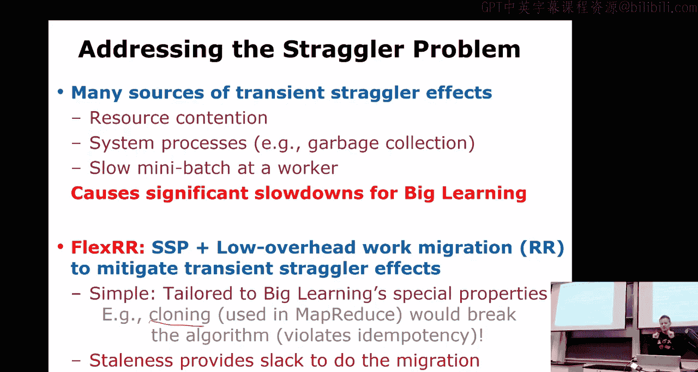

### 基于迭代进度的动态负载均衡 ⚖️

我们将利用以下特性：在一般的分布式计算中，很难知道你落后了多少，因为存在各种变化和控制流。但在这个场景中，你每次都在遍历相同的输入序列（训练数据）。遍历训练数据的进度是衡量你进展速度的一个非常好的指标。

我们的做法是：当某个工作线程完成了其训练数据的75%时，它会联系几个邻居节点，询问它们的进度。如果发现某个节点远远落后（比如只完成了40%），我们不会等到所有其他节点都完成才发现它慢，而是立即介入解决。

第二个关键是，在一般的计算中，你需要按特定顺序执行任务，不能随意将计算块交给其他工作线程。但在这个世界里，训练数据就是训练数据。工作线程可以以任何顺序处理训练数据，这无关紧要。因此，我可以轻松地识别出：“把我最后10%的训练数据给你。”然后另一个工作线程开始处理那部分。如果它完成后发现原工作线程仍然落后，可以再接手20%，依此类推。这完全是乱序处理，但没关系。

这使我们能够实现非常简单的动态负载均衡。当我们这样做时，可以看到每次迭代的时间显著减少，新方法比原始方法快大约两倍。在不同的EC2机器类型和Azure实例上都观察到了类似的结果。

---

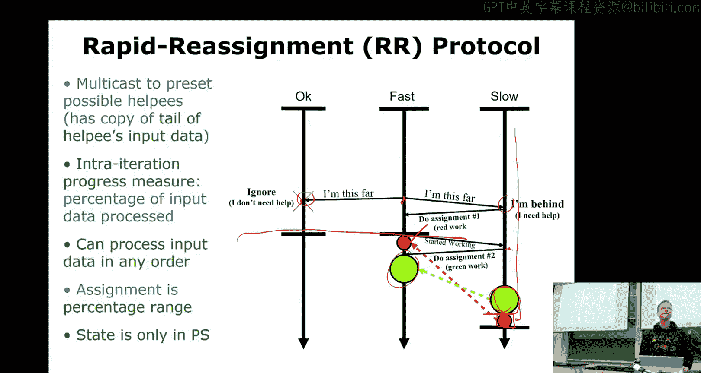

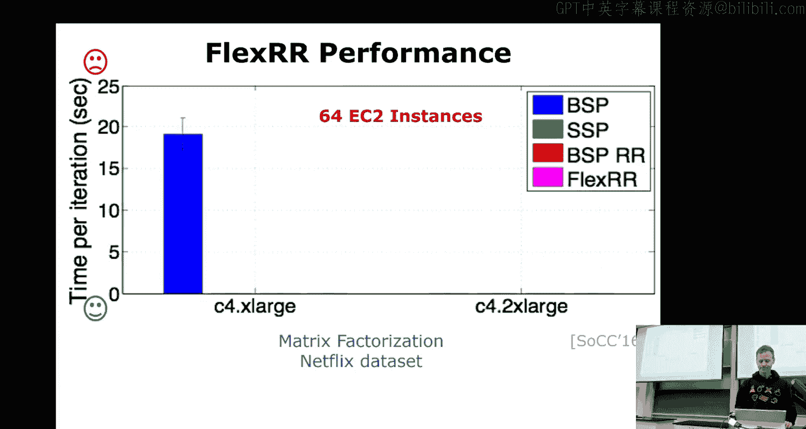

## 参数更新的重要性优先级 📈

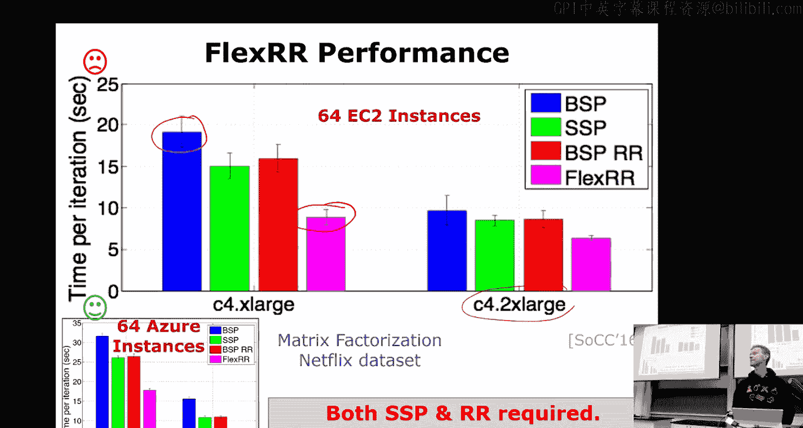

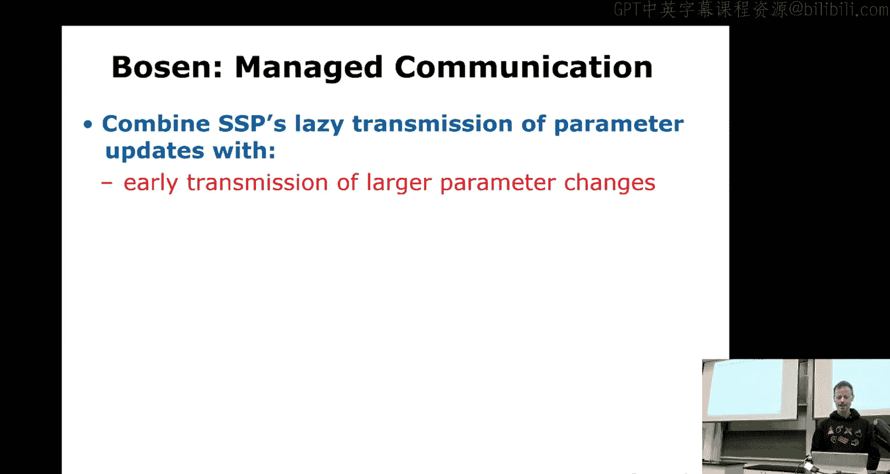

下一个特性是参数更新的重要性。我有所有这些想要通信的更新，但机器之间的网络带宽有限，是瓶颈。在一般计算中，你很难知道如何优先处理机器之间的消息集合。但在这个世界里，有一个有趣的现象：更新量的大小是重要性一个非常好的信号。

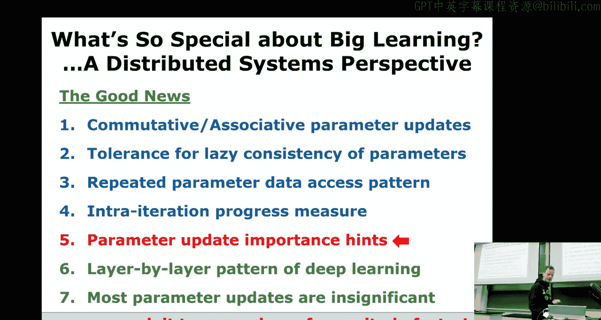

这意味着，如果我是一个工作线程，正在考虑要发送哪些更新，我应该从最大的更新开始发送。那些是最重要、需要最快传递的更新。因此，我们优先传输较大的参数变更，同时确保仍在陈旧性界限内，并且不超过带宽限制。

这样做带来了不错的改进。图表显示，采用我们开发的名为“Bosen”系统的技术（绿线），相比之前仅使用有界陈旧性的方法（红线），以及完全异步的方法（虽然最终收敛但耗时很长），性能有所提升。

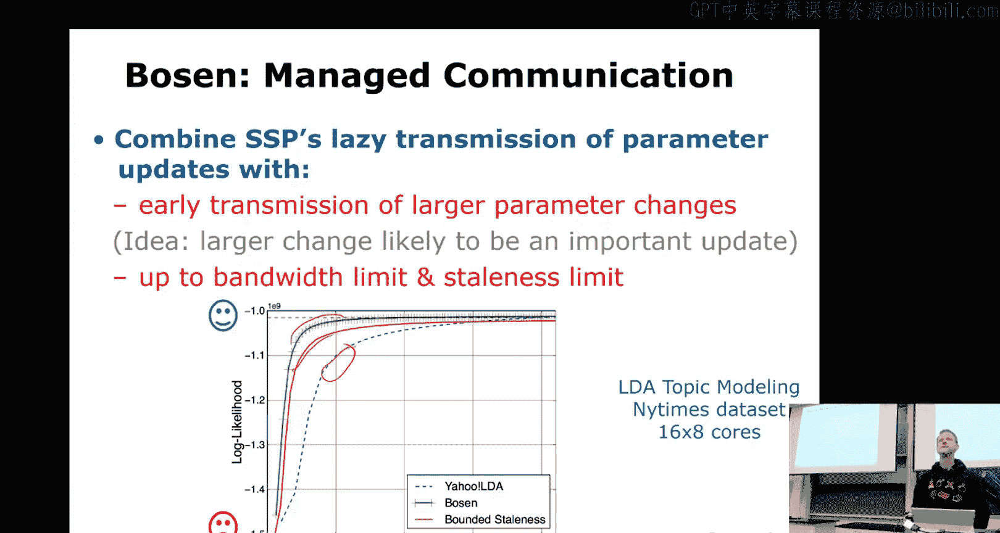

---

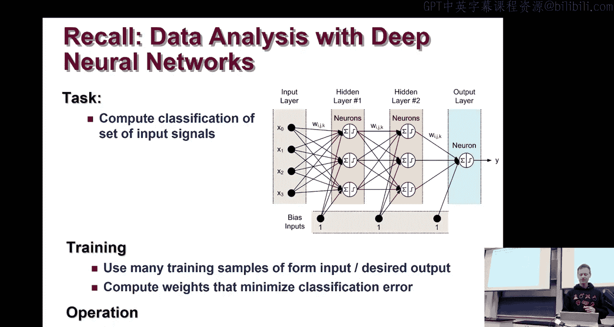

## 深度神经网络与GPU 🧠➡️🎮

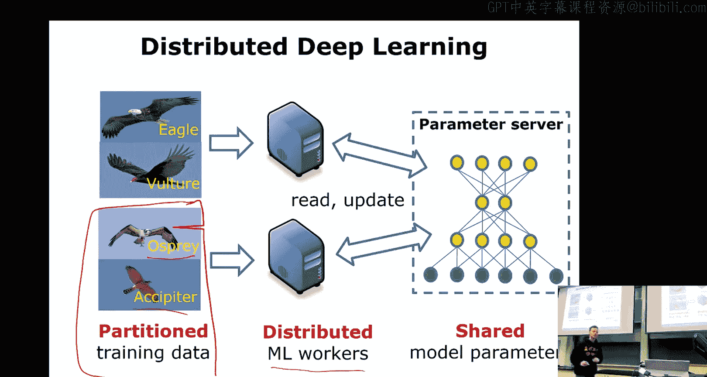

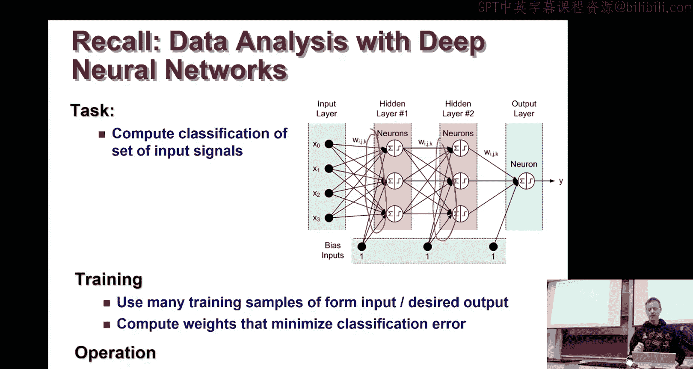

深度神经网络用于语音翻译、图像和视频中的物体识别、人脸检测等任务。和之前一样，每个工作线程获得一部分训练数据（如图像和标签）。我们有M个工作线程，以及一个网络模型。参数服务器在概念上持有这个网络。

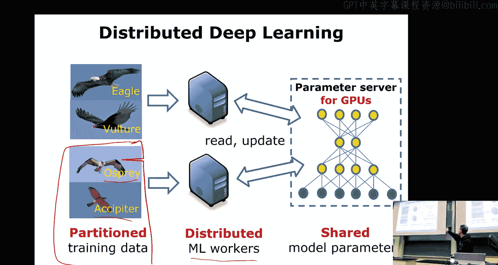

上节课提到，每一层执行的功能类似于密集矩阵乘法，因此非常适合GPU。通常这些任务在GPU上运行。现在我们希望在GPU上运行参数服务器。

在训练过程中，图像在底部，你进行前向传播，计算各层的值。关键点是，它是成对层进行的：你使用一层的输出作为下一层的输入，计算新值，一直向上传播到顶层进行分类，比较误差，然后基于这些误差将更新反向传播到这些边上的权重（即参数）。然后重复这个过程。

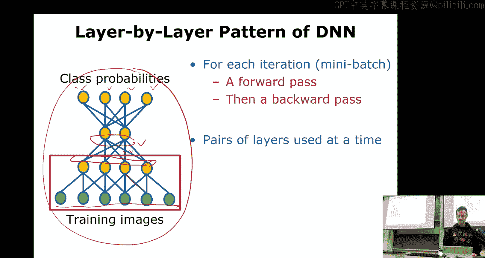

需要注意的重要一点是，它是成对层进行的，你不需要同时将模型的所有参数都放在GPU内存中。因此，我们的做法是利用GPU内存，一次只将成对的层调入调出，而模型的其余部分则存放在通常比GPU内存大得多的CPU内存中。我们在节点间运行参数服务器，获得了相当不错的结果。

当时最先进的技术是Caffe的单GPU性能，他们还没有分布式实现。我们能够在16台机器上获得接近线性的加速（13倍），虽然没有完全达到16倍，但已经非常可观。

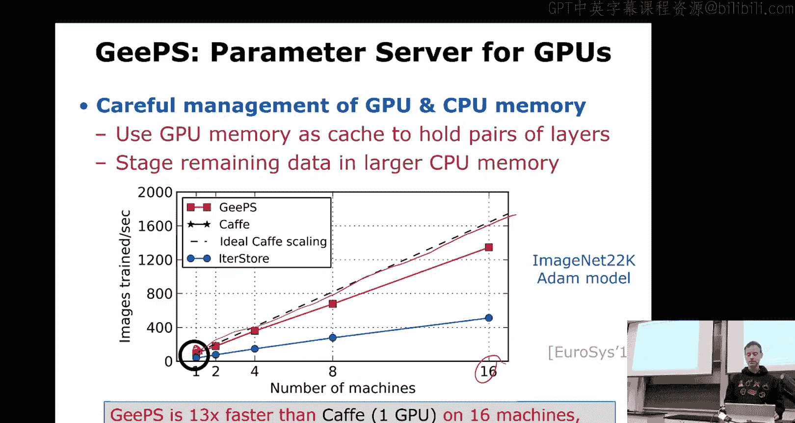

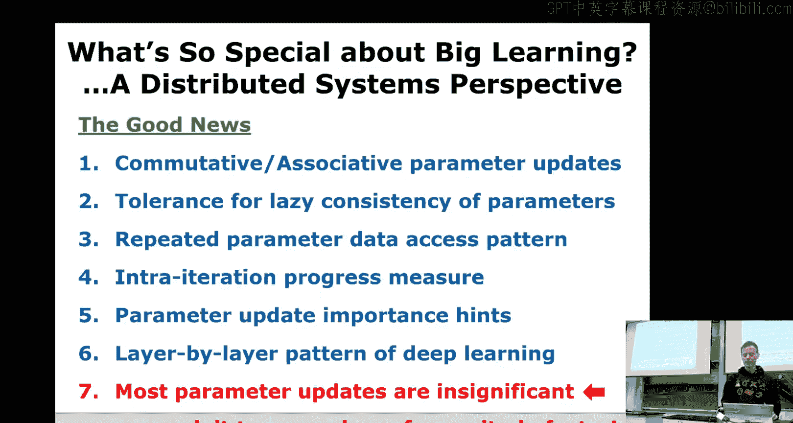

---

## 跨数据中心训练与不显著更新过滤 🌐

到目前为止，机器学习分布式深度学习训练都是在单个数据集、单个数据仓库、单个数据中心内进行的。你处理的是受控数据中心的特性。但是，数据、视频、图像等并非在数据中心生成，而是在智能手机、监控设备等世界各地生成。现有方法忽略的一步是：如何将世界各地生成的所有数据汇集到你的数据中心？

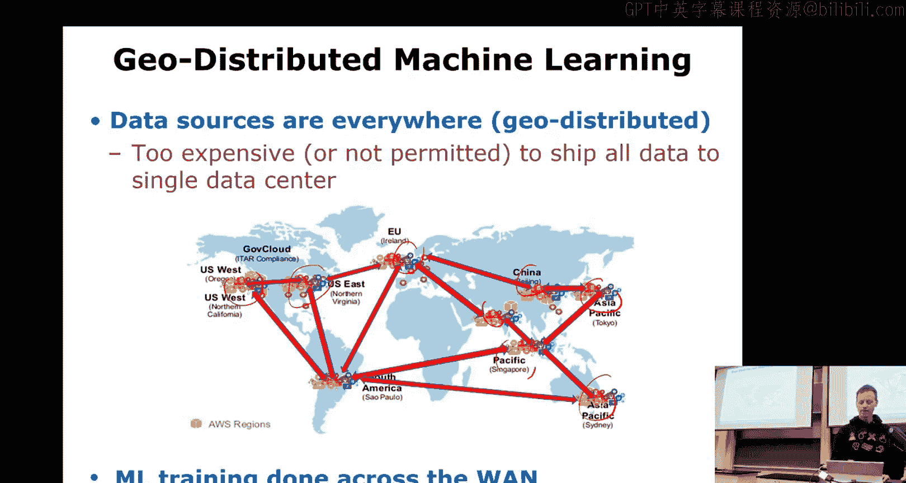

事实证明，随着视频和摄像头越来越多，这样做变得极其昂贵和缓慢。此外，由于国际隐私法规（如欧盟关于数据跨境传输的规定），通常甚至不允许将原始数据（如图像、医疗图像）发送到数据中心。

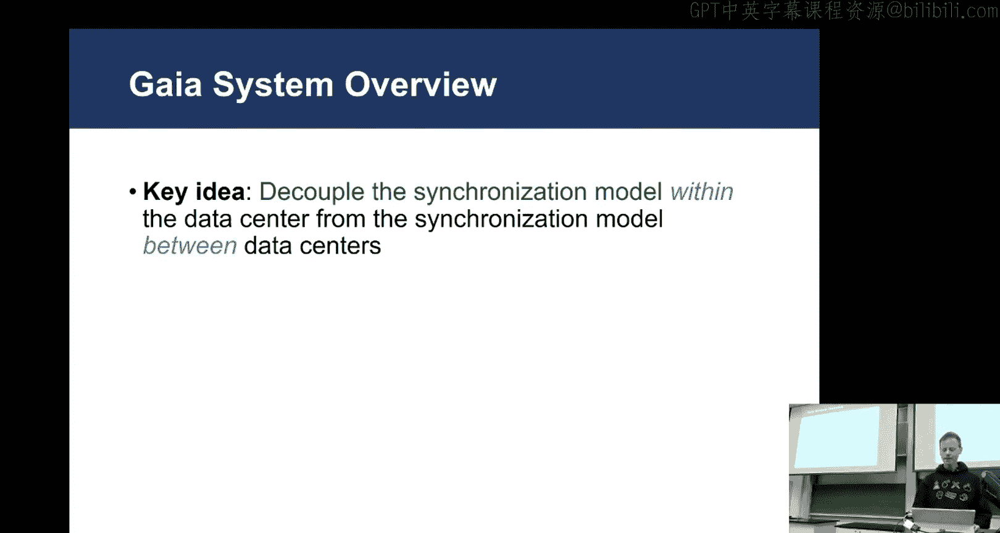

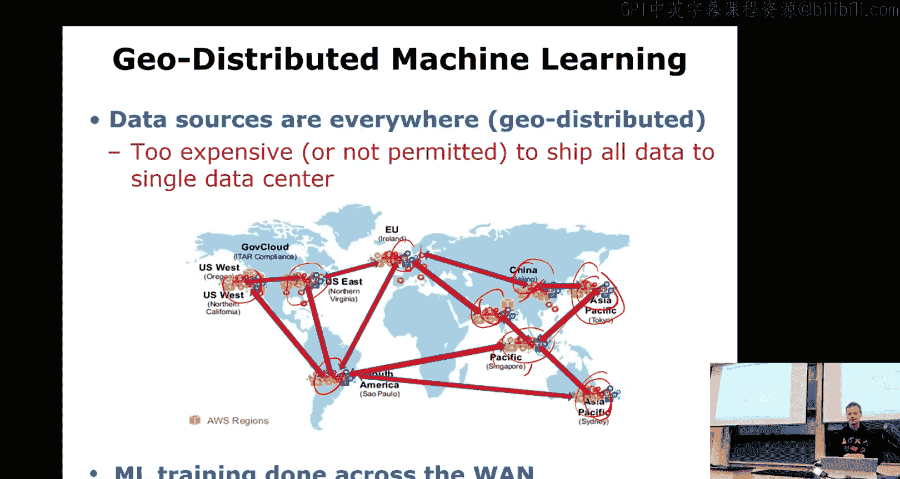

因此，你必须做的是跨广域网进行训练，而不仅仅是在数据中心内部。数据将留在原地，遍布全球。问题在于，广域网的速度极其缓慢，带宽与数据中心内部相比非常有限。即使在大型数据中心之间，带宽平均也只有数据中心内部的1/15到1/80，延迟更高，而且费用昂贵。

我们的关键想法是，在数据中心内部和跨数据中心之间使用不同的同步模型。在数据中心内部，我们像之前一样划分训练数据，运行参数服务器，使用我们讨论过的模型。但不同之处在于，我们得出的模型只是近似正确的（以一种明确定义的方式），因为我们不经常看到其他数据中心和其他数据对相同参数的更新。

关键想法是，在跨数据中心通信时，我们要更加节约。我们将利用之前提到的特性：最大的更新是最重要的。关键观察是，我们跟踪每个参数的累积增量。只有当累积增量达到参数总值的1%时，我们才发送它。任何小于1%的更新，我们都会累积，直到达到1%才发送。这就是我们所谓的“消除不显著更新”。

好消息是，事实证明，工作线程想要进行的大约97%的更新都小于1%的变化。所以，当我们运行这些参数服务器时，它们大部分时间都在通信，但说的都是“微调”。如果我们只要求它们在变化至少达到1%时才通信，那么我们可以消除95%的通信。

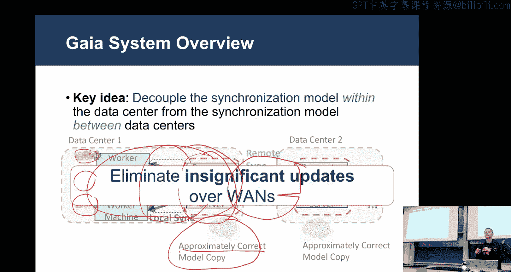

当我们这样做时，得到了如下结果：在11个EC2数据中心上跨广域网运行（蓝条）是基线。我们采用新技术后（橙条）的速度要快得多（平均快3-6倍）。我们几乎达到了仿佛在单个数据中心内运行的速度，尽管我们是在11个性能很差的数据中心上运行。我们达到了单个数据中心运行速度的40%以上。关于成本，传输数据的费用比计算本身更昂贵。通过减少数据传输，我们节省了2到8倍的成本。

---

## 利用现货实例降低成本 💰

最后要讨论的是利用现货实例。像Amazon EC2这样的数据中心提供商，如果你想要保证资源使用，需要按需付费。但他们也有一些闲置资源，可以以极低的价格（比按需价格低85-90%）提供给你，但不保证资源不会被随时收回。

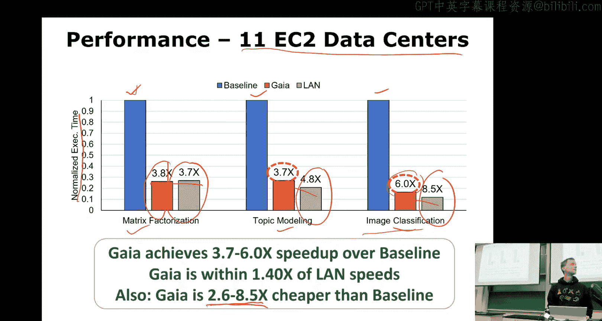

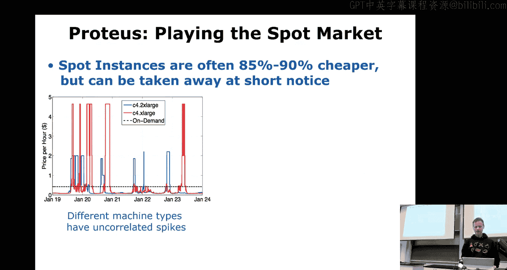

价格曲线显示，如果你想要确保机器永不消失，你需要支付按需价格。但如果你参与现货市场，你可以以低得多的价格获得资源。你出价某个价格，一旦市场价格超过你的出价，你就会被驱逐。

我们在这个名为“Icarus”的系统中，首先有一种处理机器大规模被驱逐的方法。其次，我们学习了一个模型，指导我们如何出价以实现目标：以尽可能低的价格在合理的时间内完成计算。

系统有一个特点：如果你在持有资源的第一小时内被驱逐，它是免费的。所以我们的目标和出价策略是：出一个价格，使我们能完成大部分工作，然后在接近结束时被驱逐。这样我们就能获得免费计算。通常，我们可以通过这个技巧获得大约30%的免费计算。

总体来看，我们的系统将成本从虚线降低到实线水平，运行时间也略有改善。我们通过积极竞标廉价免费资源，并采用跨机器类型多样化等标准市场策略来确保不会一次性失去所有资源。

---

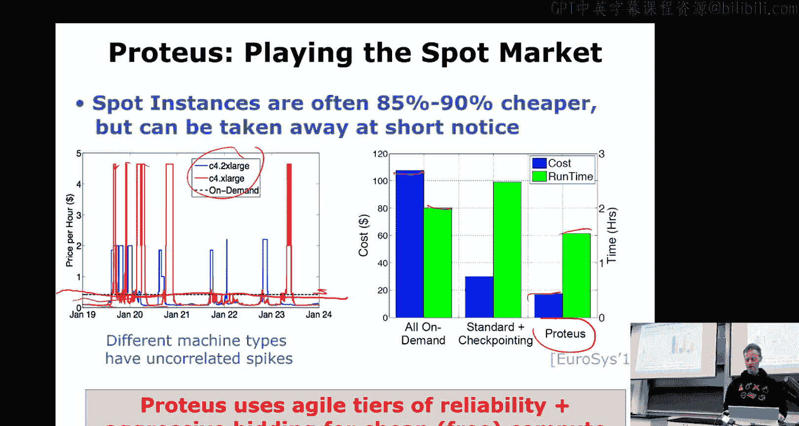

## 总结 🎓

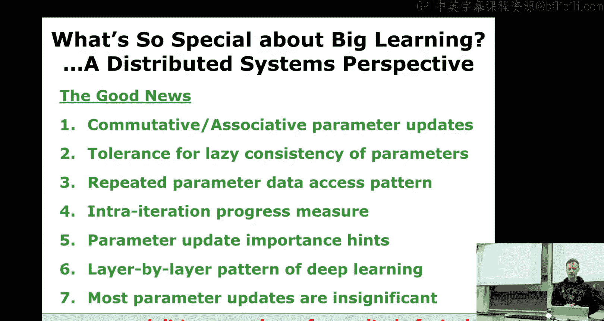

本节课中，我们一起探索了大学习的许多独特之处。从计算系统的视角，我们看到了如何在不改变机器学习算法本身的前提下，利用其固有特性（如更新可交换性、对陈旧的容忍度、可预测的访问模式、更新重要性差异等）来显著加速训练过程。我们回顾了参数服务器、有界陈旧性、动态负载均衡、优先级通信、跨数据中心优化以及成本优化等一系列技术。希望本课程对你们来说是时间的良好利用，并且相信这门课所学的知识，将对你们未来在CMU或其他任何地方学习任何计算机系统课程都有所帮助。

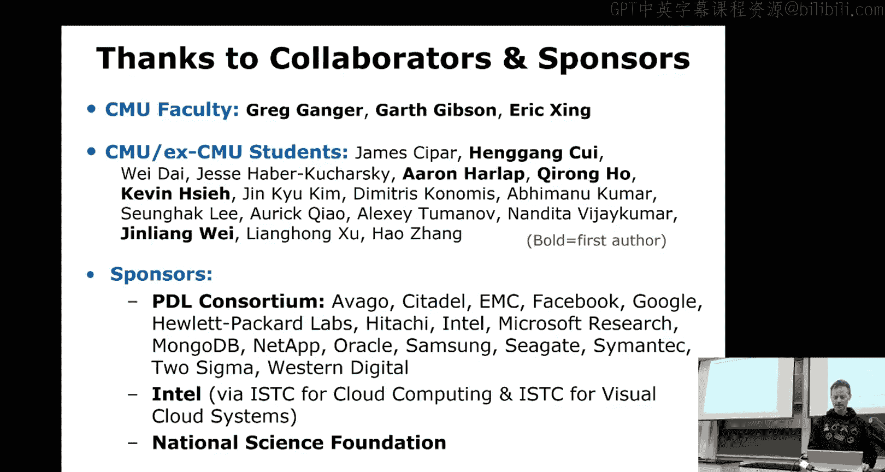

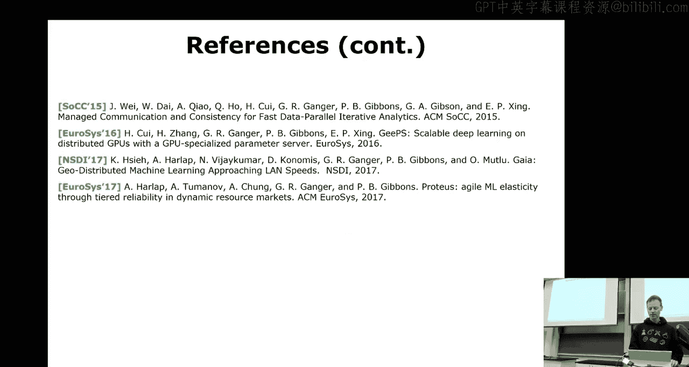

祝大家期末考试顺利，圆满完成本学期的学习！