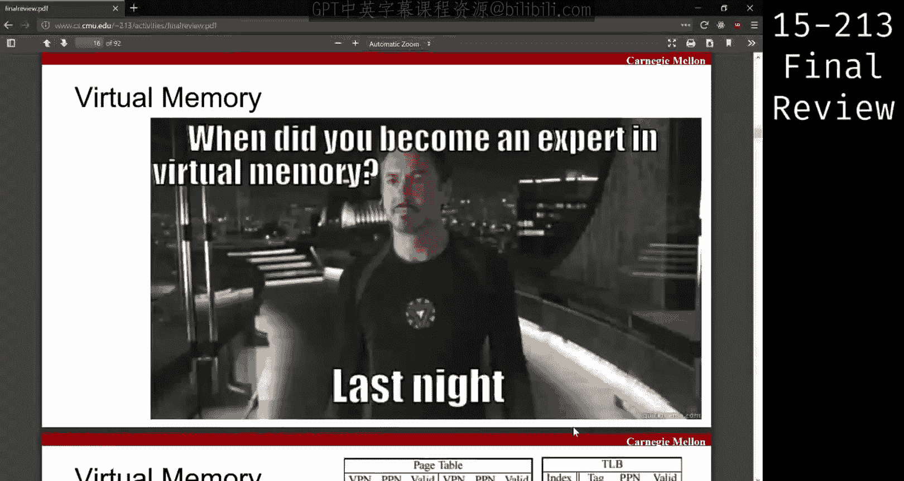
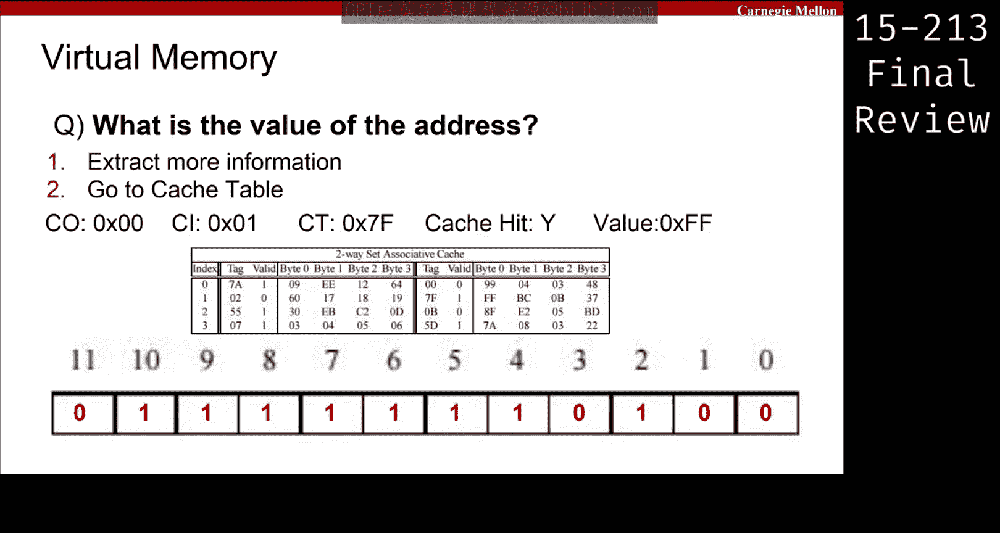
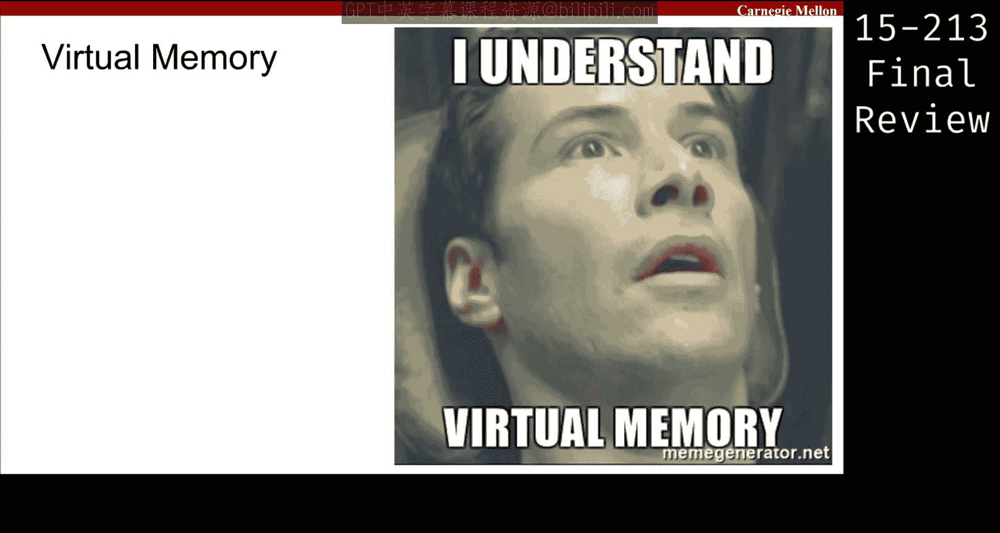
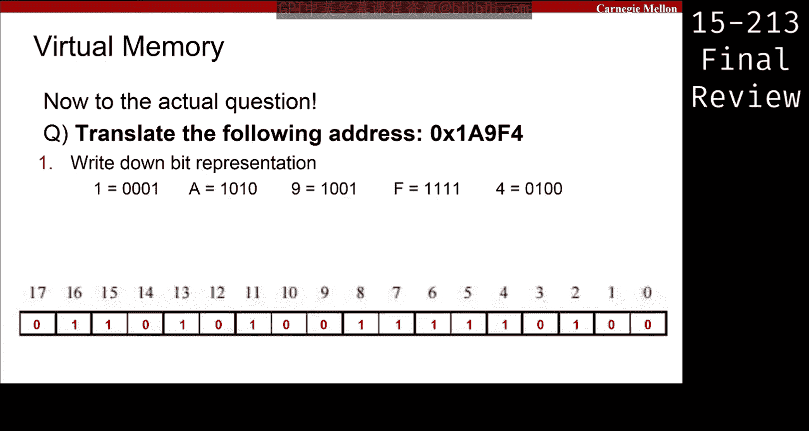

# CMU《计算机系统导论｜CMU 15-213，15-513，14-513 Introduction to Computer Systems 2017 p35 CMU 15-213⧸513 final review： Virtual Memory.zh_en -BV17jcReyETC_p35-

So like the meme says， you guys are going to be all experts at the end of today。

So every virtual memory question starts with some sort of description like this。

 it tells you how many bits your virtual addresses， how many bits your physical addresses。

 the paid size， the TLB description， and then potentially the cash description。😡。

So the two things that aren't always given are the virtual address space and the physical address space。

 or at least the number of bits represented， what they may give you is give you the total size of it and essentially all you do is log base two and you get back to the bits。

😡，Once you find the bits， you're ready to move on to the next step。

 so whenever you see a virtual memory problem on the exam， try to put it in this format。

 find the size of your virtual address， find the size of your physical address and move on from there。

You'll also be given three different tables， potentially。

 and we'll see their importance as you go along the rest of the problem。

So usually as part of a warmup， will give you some sort of labeling like this and say， okay。

 label the different parts of an address。😡，So we have four important parts that we look at first。

 we look at the VPO， the VPN， the TLBI and the TLBT。So how do we find the VPO。

 what does this offset represent？😡，Well， it represents where in the page we are。

And so how can we determine how many different bits we need to represent all the possible offsets？

Well， we go back， we look at the paid size。It's 512 bytes right。

 so how many bits do we need to represent 512 different offsets？So nine bits， right。

 two to the power of nine is5，12， so we need all those nine bits to represent this space。So next。

So next we'll be looking for the VPN Well， we know the two parts of the address of the VPO and then the VPN。

 so we found the VPO so everything else must be the VPN。So now are we done here。

 are we done labeling this address？No right so we have something called the TLB which is essentially a cache just for addressing。

 so we need to break this down some more so which part of this address do we break down into the TLBI and the TLBT。

饭。Do we break down the offset or the number？The VPN right so the VPN is the next part we'll be worrying about right now。

So。With the VPM， it'll have two parts， right， the index and the tag。

How do we know how many bits we need for the index？Well。

 how many different indices do we have to represent？We see here there are two possible indices。

So that's it， we just need one bit for that。So that's going to be the last one， here。

 just based on this table here that says your TLB looks like this。

And TLB has how many other entries in there， but how many ever different lines with two different indices。

So then everything else is the tag。So what does this remind you of what part from the midterm？

Cash is right， it's the exact same procedures that you did for cash that you'll now be doing with the addresses。

 Nothing is different except for maybe the numbers will plug it。

So now we have this and the entire goal of this problem is to go from a virtual address to a physical address。

 and maybe eventually to some data。So let's label our physical address， so we have our PPO， our PPN。

 the cash offset， the cash index and the cash tag。So what is the PPO？Someone speak up。Same asExactly。

 so it's 100% identical， so you don't even have to think just copy it over without changing anything。

Well， then we know， okay， PPN is everything else， so that's these three bits。So now we have our cash。

Offset our cash index and our cash tech。How do we find out what those correspond to？Well。

 go back to Datalab and not datalab， sorry， from Caching， and you'll see here。

This is what our cache looks like。So we have four indices。And each set has four bytes of data。

So if we have four bytes of data in one entry， how many different bits do we need to represent that？

2。If we have four sets， how many indices do we need to represent that， sorry。

 how many bits do we need to represent all those indices？2。And then the tag is everything else。

So two bits for the offset。Two bits for the index bits。And then everything else is the tech。

So this is 80% of the way there if you have this， all it is is now looking up entries in that giant table。

😡，So let's look at this， let's translate this address。So first write down the bit representation。

 right， you really can't do anything with entire bits， especially if you're different fields。

 you're offset and your part number。😡，Our page numbers sorry，t part aren't multiples of four。😡。

And please do write down the hex to binary conversion， it's going to be a stressful exam。

 you don't want to make one tiny mistake where you think F is all zeros or something like that。

 so just have that written so it's one less thing to worry about。So now let's extract information。

So what is the VPN， Well， we've already labeled it before so。We'll just convert that back to hex。

 so it's D4。What is our index， well it's last bit， so it's zero？Our tag is everything else。

So now let's look at it in the table。😡，At index zero。Do we see a tag D4？Oh sorry，6 a。Yeah。

 it's right here， I don't know if you can see this， but。Never run， I can't write on it。

 but there you go， Ty right there。So once we have that。So is it valid。

 So just because an entry is there in the cache in the TLB cache doesn't mean it's always valid and usable。

No， you look at the vel bit in this case the v is one， so we're good to go。

 so it means that it was a hit， which means that it's not a page fault and we have the PPN。

 which is three。Now we put it all together， so we have three from our translation and our lookup。

We have the same offset from before our VPO。And this is our new number。Our new address。So normally。

 if this were a pure translation problem， would be done right here。But there's an extra step to it。

 right， they want to know what is the value at this address here。Well。

 to do that with looking at an actual cap。So let's break it down like we did before。

 so we know our cash offset is two bits， so 00， our cash index is two more bits， so01。

 our cash tag is everything else。So looking in this table at an index of zero， sorry， index of one。

Do we see a valid belly？Yeah， we see， oh well actually no， we don't。There's a zero there。

And the next one is7Fs， sorry， and so that is belt。So we actually can use this。

So it's a hit and the value there is FF， right because we have a cache offset of zero。

 which means we take that zero by in that cache。And that's it， that's your entire transition problem。

So therere really only seven or so steps。And they essentially all boil down to。

 take this big address you hep， break it down into these smaller pieces。

Look up different tables using different pieces and then put together all the pieces again in a new way。

And so hopefully this is you now。And hopefully you'll get 100 on the virtual memory question tomorrow。

 yeah。

🎼我是。So you' in set one right here。えつた。So we know that the cash offset is zero zero。

Which means we take the zeroth bite in this cashlight。Yeah。Do you look at work like this？

It's an interesting question， I suppose you kind of do but。

that would really only matter if you're looking at more than one byte right。

 so it depends on if you're asking you how many bytes。

 like if they ask you what are the two bytes at this address？

Then you would have to worry about whether there's， but in this case we one bite in general。

 the question will be very explicit about what it wants what was the difference between the first part and the second part and different。

So this first part was translating from a virtual address to a physical address。

So this is all pretend pointers。And then here is when we're actually getting to the data。

 so the data is indexed via the physical address， not the virtual address。Yeah。

 to explain why you broke down the physical address and the tag and the index and the offset Okay。

 so my confusion is that when you broke down the virtual address you would only like the tag and the offset or no tag in the index were in the VPN but that's not the case for physical address No physical address is everything Oh well the tag and the index are still in。

The different place right so here we have our cache offset so when we convert to a physical address。

 we really don't care about the page offsets anymore we just treat it as one giant address。

And we need we just pretend it's completely a new problem and here we see， okay。

 our cache if we were to address this， if we're going to look at this address and we search up our cache。

Our cache has four different offsets we can represent。

 so it means this address only needs to encode four different offsets。

 so we really only need two bits to represent all that so that's why we just take the bottom two bits。

Afterwards， we have four different sets that adders can be a part of。

And so we just need two more bits for that， and then everything else remains the same。

 so think back to the cash stuff that you did for the midterm。

 it's exactly that once you get a fiscal address。Thank you。Any other questions？

If it's not in your page table。😡，So if we were going to let's say we had a tail being missed。

 so let's say this address that we were looking at here。What was the address were looking at， so6 a。

 let's say that ball bit was set to zero。Then we have to go to the page table。And we look up 68。Well。

 68 isn't listed here， so as far as you are concerned， it's a pageable。😡。

Now it may be in a different representation of this patient， this patient shape only goes up to1 f。

But because you don't know what else comes after it， you can just consider it past fault。

But something to note for this problem is that actually it is still considered not a page fault because it's still in the TLB。

 so don't go and look at the page table first， like you still have to go check it in the TLB before you make assumptions about whether it's page fault or not。

Be careful about that。Yeah，I't theory supposed to be coher？Yes。

 but let's say the page table has many different pages， right。

 and so we're not showing you every single page。So just because so it's wrong for the TLB to say it's valid and then this page that we show you to say that invalid valid。

😡，But other than that， you can assume everything else is clear。

Y wait so a page fault occurs when TlB missed and it's not in the page that we show。Yeah。

 so does it really matter if it's bad or not？Well， if it's valid。

 that means it can't be a page fault mean。There's no。If it's in the page， yes， right。

 so invalid in the TLB doesn it guarantee a page fault？😡。

So the side of the process that we didn't go over here is the part where you have a TLB Miss right because like this problem had a TLB hit but there are problems on the old finals that have problems that do have a TLB miss so you can think about what you might do there right we give you this page table so that you can go look it up in case there's a TLB miss right so that's the next step。

All right， if there are no more questions， we'll move on to。

Proces is an I， I think。