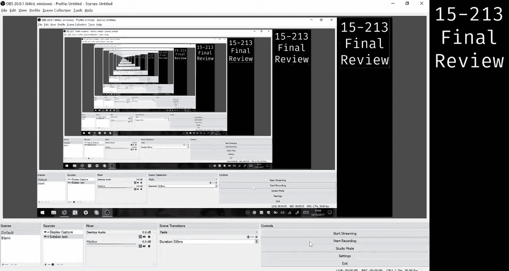
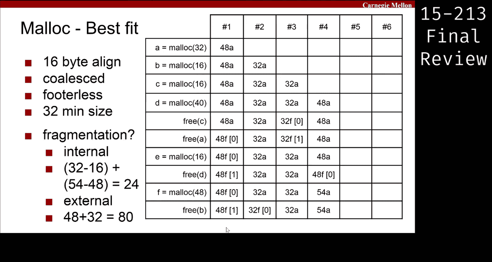

# CMU《计算机系统导论｜CMU 15-213，15-513，14-513 Introduction to Computer Systems 2017 p37 CMU 15-213⧸513 final review： Malloc.zh_en -BV17jcReyETC_p37-

You receive them。Cool， so it's the return of everyone's favorite lab， Malick La。Yeah。

 I don't know what's up with my voice， but we'll just roll with it。

This is the stuff you need to know about Malik so you have to know the fine fit algorithms yeah。

 so if you don't get the meme then you don't know Malik and you should probably review so so first fit。

 next fit， best fit， good enough fit we don't worry about extending the heap and then you need to remember like fragmentation。

 internal and external。And then sort of like the way we organize free walks。

 so implicit explicit lists and thencycllistists。And we'll walk through a problem now。

So we have a little bit of like a trace here in this table。

 and we're told that we're dealing with 16 by line Malik， we when we free a block。

 we coalesce it immediately。Allocated blocks don't have footers， so we did the footer list。

And we have a 32 by minimum block size， so we're going to go through the trace and we're going to write in like the blocks all the way down in this whole chart。

So the first time we for we asked Malck for something of size 32。We have to add a header onto that。

 right？So that becomes 40 bytes， there's no footer because it's footerless。And。So we have 40。

 it's not 16 by aligned。So we round up to 48 right， so we allocate a block of size 48。

 so we just noted that with the size and then a for allocated。

And so that's like the beginning section of code in your Maic implementation， the roundup。

 and the ad it was like on one line。And so now we're going to keep doing this。So okay， well， os。

It's time for a 16 like size payload block， right？We add a header that makes it 24 that really sucks because we didn't do many blocks so we can't like make a small block so we have to go to the min block size of 32 right。

 so we round up to 32 and like we allocate that block。For C， we do the same thing， another 32 block。

For D we add a header just the header that makes it 48 and that's already 16 by a line so we get a 48 size block and then cool stuff starts happening so we free C so what block was C it was the second 32 block that we allocated so the thing in column3 so if we free that block。

If we free that block， we just note it with 32 free and I'm putting this like zero thing here so that we know it's the first thing on the free list we're doing first fit so if there's multiple things on the free list it might matter later so it's the first thing on free list。

We're going to free a， which is the 48 block in column1。

 so we free that and that becomes the new first thing。And the 32 block。

 block C becomes the second thing in the free list。And then we allocate something of size 16。And so。

We need to first determine what's the size we're looking for。We add a header on that's 24。

 right it's less than than block size， so we round up。So we're looking for 32 bytes。嗯。

And we're using first fit， so if we look at the first thing on the free list。

 does it fit Y does 48 bytes is bigger than 32， so we pick that block。

And now we have to determine if we're going to split the block or leave it as it is。

Can we split this block Yeah no we can't， so if we were to split it the new free block that we would create。

Would be too small， it would be undermin block size， so we're not going to split it。

 It was that if condition in your place function so we don't split it。

 we give the whole block to this like small 16 allocation and now the 32 block is the first free block we freeze D。

 which is that 48 in column number4。And we immediately coalesce。

 so the 32 and 48 joined to be a big block of 80。We allocate 48， can we get 48 bytes out of that 80？

So remember that okay， so we might be able to get 48 bytes。

 but we need a header on this 48 byte block， so that's 54。

 54 is not a multiple of 16 so we have to round up right to 64 64 bytes we can get from 80 but we can't get another block left over。

So we have to allocate the whole block。And then we free this like B from the 16 allocation in row two or column two。

And then we're like left with this， so obviously whoever wrote this code didn't free everything they allocated so they did it wrong。

But this is like a cool place to like ask some questions， right？Let's talk about fragmentation。

How much internal fragmentation is。In this heap in this Malic implementation。

 when we're at this last state， so we just free B。And so I guess a better question is what is internal fragmentation and what are we like what counts towards that？

No volunteers tonight， all right， so internal fragmentation is what we lose to like headers and the like extra padding that we need to round things up to maintain alignment or men block size。

So to calculate internal fragmentation， we only have to look at things that are already allocated so this 48。

And it's 80。In both of these cases， we can see the allocation it corresponded with。

 so this 48 was this 32 from the very beginning， so we can do 48 minus 32。I lied， it's right here。

 it's 16， it's even worse so we can do 48 minus 16。

And that's how much like extra padding and stuff we've wasted on that block。And then this 80 block。

 we can come up here and we can do like 80 minus the 48 bytes that are actually allocated to or actually asked for to figure out how much fragmentation is there。

Cool， so if you add the numbers， you get 64 that lake sucks。

 there's only two blocks on the heap and both of them are like smaller than that。

 but what about external fragmentation？The way we drew this heap makes it really easy。

So external fragmentation is。Anything that is like between the blocks， so space where we could have。

 if we knew the trace ahead of time， we could have rearranged these blocks so that all the allocated blocks were next to each other at the end。

So how much space did we lose because we didn't know that yet， 32 Yeah，3 exactly， it's just 32。Cool。

So that was first fit。Yeah， wait。 So when you read C。This one right here。

 so your first element was 32 on the three loads。喂。And then in the second part， is your spectacle？

Yeah， so in this we were just putting the whenever we free。

 we just put it at the front of the free list so would that be something that we did yeah。

 it would have been specified here， there's just not enough room。Yeah。So knowledge。

Every time we need let more。And doing the leftverse space， counter as。So。Yeah。

 so what was going on in this crazy implementation is like your brain is really big if you always extend heaps。

 so we were just extending heap like exactly the right amount so that at the end。

 like there was no extra free space， but yes， normally you have a big free block here， right？

To probably also specify the extent equal falses。Yeah。

 I thought external fragmentation was when you had like multiple free blocks that were separated by allocated blocks and then you couldn't。

I think that's one bigger block that reality。Sort of the same thing maybe。

 but so because I don't see like a problem with like one free blocks being 2 two allocated blocks So the problem here is like。

If we could if we knew this trace ahead of time， we could like move these allocated blocks to be next to each other and then we wouldn't need any of the trailing like free space。

 right？呃。If those blocks are right next to each other。

 your he is smaller than right now and that's better right at least in terms of malic like what we want right we want to use as little memory as possible but we learned scrub just like another issue with external fragmentation I guess。

呃，可。Like yeah definitely related， I think the definition is like wasted space between blocks。

 but as a consequence， you cant get the young nature。Yes， see Mal's the best lab Yeah。

 go ahead is this space from like your last。alocated or free like I guess last allocated block until the end of your main deeper whatever is that space still external fragmentation So you mean if we had drawn in the prologue and epilogue here。

 like the space from the end of this block to the epilogue yeah so。Yes。

 it would be counted as like external fragmentation if there's a block there。Yeah。Yeah。Just to it。

 I'm not so any free space on the he is excellent。Any any like free block？

Or any free space in general， like all of that So okay。

 so anything that wasn't like explicitly asked for like this Mal 48， those 48 bytes。

 anything that's not that is some sort of fragmentation。

If it's within a block and we lost it because of like look keeping or rounding up， that's internal。

 otherwise it's external， so if it's like between blocks or outside of blocks， that's external。

But there shouldn't be any memory outside of blocks。But yeah。Yes。还有就。As for。どうだというそういう。so。

Like in real life or like in in Maick lab。Wait， what was what was it。その。Yeah。多人。Yeah。So okay， yeah。

 if you free it and like that was the only thing you allocated， then you could like shrink the heap。

 but we don't do that in Malik La， like it was hard enough， wouldn't you agree right yeah？Yeah。

So what we talk about。Only be at a given point in time， but。😊，Yeah， overall。No。

 it has to be at like a point time。Yeah。I'm still confused about why through again this line right here。

 yeah let's whoa。Go back。So。So in the step before we had like 80 was the only free block。

 so the options were like use it or extend the heatap。

The 48 needs a header right so 48 is what we're going to give them， it needs a header。

 which is size 88 bytes。 so if we add 8 to 48 that's 54。U。56， right？

56 if we 56 is not a multiple of 16， neither is 54， by the way。

 so we have to round it up right to the next multiple of 16， which is 64。

So we're looking for like a total of 64 bytes。And when we look through the free list we see this thing of size 80 and we're like sure we'll take it so we see if we can split it。

 we can't split it because 80 minus 64 is not at least 32， so wed have to take the whole block。Yeah。

 so like if the question said it was like tiny block or something then it would like the question would be a little different。

Depends on what you're given the Yes， definitely。Yeah， but know didn' do that it wasn't mentioned。

Cryptic。ね。Cool。So that was first bit， but first bit wasn't like great right。

 you probably know that so let's try something else， let's try best fit。嗯。If you're clever。

You'll notice nothing is going to change until we have multiple things in the free list right。

 so we can come all the way up to this step and just fill in with everything from the first fit。

So boom， there you go now things are different so in first fit。We just took the first block。

But now we can like take the best fitting block。 So what's the size we're looking for again。

 it's 16 plus a header， which is size 8。We round that up because it's not in block size。

 So it's now 32。 and we're going to find like the best fitting block， the thing that makes that like。

extra padding or whatever that we're going to steal from the block zero or as close to zero as possible。

 and this 32 block looks like pretty good right， so we take it and allocate it。Now we free D。

 which is this block in column four， so we free that。And we put it at the beginning of the free list。

 it doesn't really matter much now that we're using best fit， but to keep it consistent。

 now we look to allocate 48 bytes。So 48 plus the header of size8 is 56。It be6， right。

 not a multiple of 16， we round up to 64。So we need a block of size 64。

It doesn't look like there is a block of size 64 unless my eyes are really bad。

 so we have to extend the heat。UHow much do we have to extend the heat by though。

 because we already have 48 free bites at the end？So if we're looking for something of size 64。

We already have 48。Just do the math 16， so we extend the heap by like the minimal amount possible just in this implementation。

And we get a new 64 block at the end。So we do that。That's wrong。やめ。I'll fix that， but that's wrong。

 that's 64。 can't you see the six？Anyways。And then we free block B like before in column two。

 and we do that。Cool。So now we're going to talk about fragmentation again。

So there's things wrong down here， I guess， a lot of stuff。嗯。Yeah。

 we'll talk about fragmentation though， and it's good the fragmentation it'll be close enough。

Let's talk internal fragmentation， we just look at the allocated blocks so what block was this。

 it was like a request for size 16 and we gave it 32 in total。

 so 32 minus- 16 plus this is 64 right you see the six。Minus the 48。

I bet you it's going to say 54 here， it's going to be 64。So that's wrong， I'll fix it。

But let's talk external fragmentation， how much external fragmentation is in this heap after this freeze。

Okay。So externals like external to the allocated blocks， right？Yeah， yeah， which should be one。

 but yes。Yeah。Cool， so that was like a flavor of Malik style questions you'll be asked if you were unfamiliar with that you should like read the write up or read the code that you turned in for Malik Lab。

Very cool。But you see how changing your fit pattern from first to best didn't actually make things better。

So you see a question that's like， oh， is best fit always better than first fit if it says the word always is romance。

All right， let're move on。

