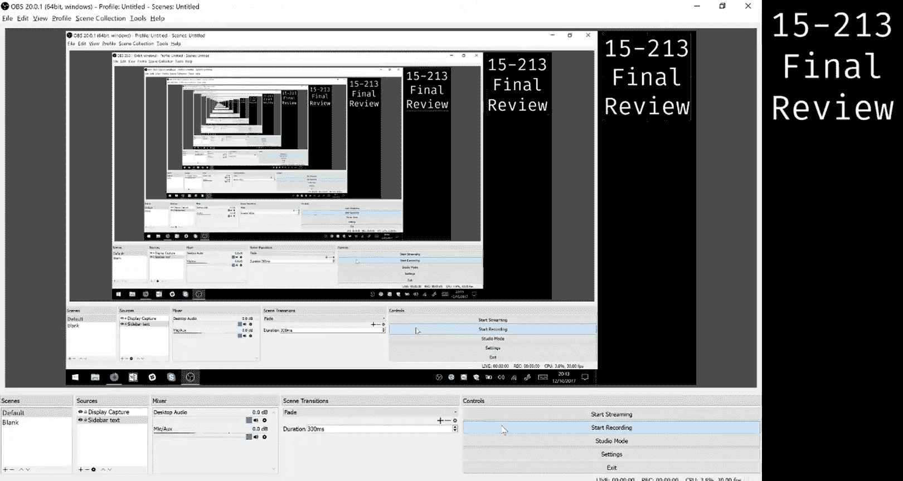
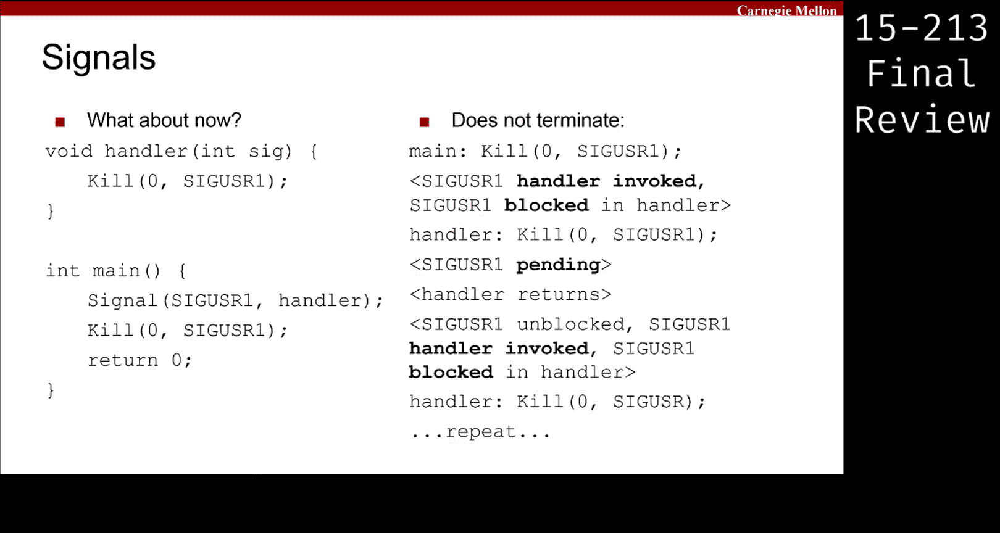
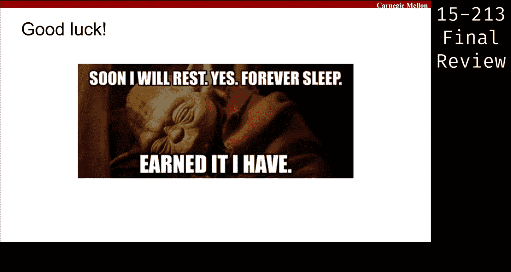
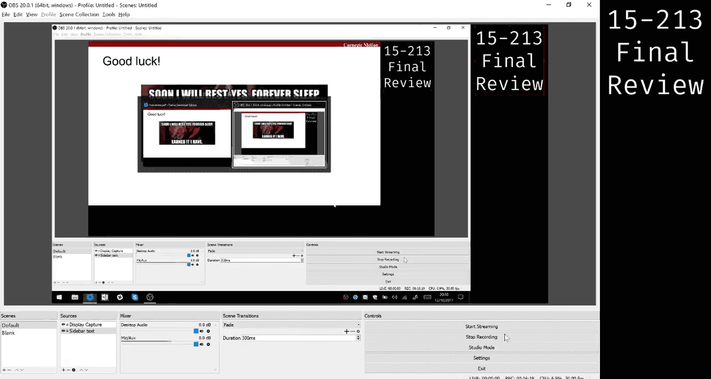

# CMU《计算机系统导论｜CMU 15-213，15-513，14-513 Introduction to Computer Systems 2017 p38 CMU 15-213⧸513 final review： Signals.zh_en -BV17jcReyETC_p38-

All right。So。First off， we're going to talk about signals signals is actually I think pretty high up in the pole right yeah it was pretty high up there and that's for a good reason because signals are unfortunately quite difficult as I hope everyone in this room found out during a She lab。

😊，But what I want to warn is that the things that I'm about to talk about are actually not everything there is to know about signal because that would take on like several lectures worth the material。

 so you should go back and review those lectures， review the recitations。

 there are good examples in there like we go over the examples in those cases。

 especially the ones who recitation like the ones that we did for the exam review from last week。

 the last recitation just because we think that they are very illustrative right？😊。

There's a lot of confusion that always happens about signals and you know when our signals generated and when they' the handled and what is blocking mean that sort of thing。

 but we are going to go over what I think is a pretty good example that represents at least how our signals generated and things we have to just watch out about。

Just also as a reminder because we're reaching the end of the recession。

You should always solve questions on your own before looking at the answer whenever you're preparing for these exams。

 right So it's really easy to like when you're if you're just looking at the solutions as you like look at an exam to convince yourself。

 oh， I could have gotten that right， Like that's like a super easy thing to do is just something that everyone does。

 But unfortunately， that doesn't actually help you remember the material。

 So this is just a reminder to make sure that you do the question first before you look at the answer。

 even if you get stuck， even if you can't get all the way。

 at least try to do the question yourself and actually write something down。

 like that also really helps with remembering things。 yeah， I know it's painful。

 but like we all have to do this。 it really helps remembering on the day of the exam。

 That's also why we ask you to write your cheat sheets out by hand。

 although not everyone wants to do that。 So at least like preparing your own cheat sheet helps a lot。

 So yeah， okay， cool。😊，So let's get started， here's a short code snippet。

Basically this is trying to ask what actually happens when you handle a signal。

 what happens to the main control flow， so signals another name for signals is exceptional control flow that doesn't mean it's better or anything。

 it just means it happens at a sort of like a synchronous point in time。

 when an exception occurs when it's handled， that's what we're trying to deal with here。

So just to quickly explain this code if you're not familiar， although hopefully you are。

 what this function does is for this signal， it registers this as the handler to call when you handle the signal。

嗯。If you are not familiar with any of those terms I just said。

 or at least even one of the terms I just said， you should go back and review， okay。

 this function sends a signal the one specified here to this process。

Now zero is a special case because people are lazy and they often want to send signals to their own process when you say zero here。

 it doesn't mean send it to process ID number 0， it means send it to your own process。

 so this just means send a signal to yourself okay。

There is a special thing to know about sending signals to yourself that is not true about sending signals to other processes。

So if it turns out that when you send the signal， when a signal is generated and the target of the signal is the same process as the person who sent the signal。

The signal must be handled before this function returns。You may think that's kind of obvious， right。

 and you may wonder why that isn't the case for sending signals to other processes beside yourself。

And that's just something that the specification allows for and it turns out to provide a lot more flexibility to signals。

 but it's something that is a special case in this instance and is generally speaking。

 not something you can guarantee before this thing returned All right。

 so be very careful about the most common mistake is assuming that when you send the signal it's always handled in this case。

 it is true in most cases it's not okay， yes question because you're sending the signal to yourself or like to a signal。

😊，It is part of the specification of this particular function that before it returns。

 it handles the signals that it generates for itself if it's sending it to itself。

Be careful about other functions。 So actually， in general。

 this is really the only one that can typically generate function generate signals。

 There are a few other ones we don't usually talk about。 So just know for this one。

 that's this is a special case。 So yeah， so you could send the signal to another process。

 and it could terminate before return before it。Yeah， so imagine this were not this process。

 imagine I sent it to a child process， for example， but when when kill returns in my parent。

 I have no guarantees about whether or not it was handled in the child yet。However， in this case。

 we do have a guarantee， and that is the fundamental difference between sending a signal to yourself versus sending a signal to a different process。

So that's the third time I've said， it's because it's an important one to remember。

 it's something that is easy to miss， so just be careful about that。So with all that being said。

 let's actually try and figure out what this code does before I take any more questions。

The main control flow， the normal control flow inside this code is going through here。

 But when we know like I just said， because we're sending a signal to our。

 it must be handled before this returns。 What does handling the signal entail。

 It means invoking this function， right So we call this function and we have to finish handling the signal before Ki can return or anything like that So we have to like finish running this function but obviously we can't finish running this function。

 So what happens。😊，Everyone， yeah is like you know you're stuck there right。

 you're stuck inside this wall loop， so this program does not terminate， right？So again。

 the specification for kill says that signal sent to itself must be handled before kill returns。

 and I guess I should have put on the slide。 and I'm gonna to say it again。

 this is not generally true when you're sending signals to other processes。

 Okay so just want to say that so many times because everyone always gets confused about it including T is actually like we had a big discussion about this I think last semester and it was like very enlightening Yes some other process Does it require that before your kill you handle all No not at all。

 So the question is like are you guaranteed to handle signals when you switch into your own process。

 the answer is no， you do not have to handle signals when you get switched back into there are very few cases where you can guarantee signals are actually handled and we'll talk about in the next question。

😊，Okay。So let's look at a slightly different example。 Actually the code looks almost the same。

 so I just want to point out the change that was made is that instead of looping in a while one here。

 the handler actually sends a signal。To the same process right。

 So it's sending a signal to the process it's running in right so this process that we're talking about here。

嗯。And the question is still like， does this code terminate， right？

This one is a lot more subtle than the previous one。 So the other one we were like， oh。

 it's pretty obvious that the handler doesn't terminate。 in this one。

 we have to try and convince ourselves what exactly is going on when we handle the signal， right， so。

Just like the four when we call kill。We do have to go and like call this handler before kill returns。

 So we we can't have like exited the program is a main idea， right， So if kill returns。

 the program like exits right and you're done Great。

 But because we are sending a signal to our own process， we have to go and handle it， right。

 So we have to go and handle it here， right。We call this handler， and we call kill。

 and the instinct is， oh， well we're sending Sig user1 to our own process。

 So before this kill returns， we have to go handle it， right。Unfortunately。

 that's not all there is to the story。And this is why it's incredibly subtle， right。

 it turns out that when you handle signals， at least if they're set up in this way。

 which they typically will be in your exam questions。When you handle a signal。

 when you enter the handler， the signal that you are handling gets blocked。Now。

 none of that showed up in this code。 right I didn't talk about blocking signals。

 There's no code here that involves blocking signals。

 which is why it's probably something you want to write down or something to remember。

 any time you are handling a signal， you will have that signal be blocked unless you unblock it explicitly yourself。

 right， And I don't unblock anything here。 So when this kill is executing， Sig user1 is blocked。

So now we have a different question， what happens if I generate a signal and send it off to a process。

 but that process has that signal blocked， right？What do we call that state， does anyone know？

Pending， right， So the word we use to describe that situation where we have a signal。

 but it hasn't been handled yet。 And one of the reasons why it could might not be handled is this pending。

 Another reason why it wouldn't be handled is because we just haven't gone around to it yet。

 all of that is grouped under this label of pending right So if a signal has become pending right。

It's just like marked is pending in a mask somewhere。 And eventually we'll get around handling it。

 In this case， we cannot handle it until that signal gets unblocked， right。

 So that's a special property of blocking。 Blocking prevents you from handling signals。

 It doesn't prevent you from。Make having signals become pending， right。

 so like obviously will' become pending in this case， like we just said， but。

It will not be handled right away， so that means that this hill actually does return。

 that comes back to the handler， and then the handler returns。

So when the handler returns what happens is like somewhere inside the kernel that's dealing with all this stuff for like calling the handler while you're in the middle of your main code right that's the whole like exception handling part。

 you have to remember that because all this stuff is very exceptional， the kernel。

 the operating system is the person is doing all of it for you and once this thing returns back to the operating system and it has to sort of like do an intermediate step of like doing some setup before you're ready to come back here right？

When it's doing that setup， what it does for you is it unlockblocks signals。Now。

 when you unblock signals in general， this is another one of those things that you should know and maybe write down。

 when you unblock signals and you have at least one signal pending。

At least one signal will be handled before you finish like once you unblock the signal。

That's very careful wording I said there that's because that's the only thing you're actually guaranteed。

 So I'll say it again when you unblock signals and you have at least one signal that has now become like handelable。

 right， it's now unblocked and it was also pending beforehand。

You will handle at least one of those signals。You know， once it's become unlockblocked。

 you are not guaranteed that all of the pending ones are handled。

 you are not guaranteed that like you'll sit around waiting for more single to come in or anything like that。

 it's just that at the moment you do the like， you know。

 unblocking and then you check do you have anything that you can now handle。

 you may handle one of them。There's no guarantee about which one is handled that nothing like that。

 Thankly， this is easier right， because like there's only one signal here。 So therefore。

 when you unblock it， you have to handle that one signal， right。

 And so now we will come back and we will run the handler again。 And hopefully everyone can see now。

 you're gonna send the signal。's going be pending again。 You're gonna return unblock。

 handle it again， send the signal。 And this loop forever。 So I'm just gonna put up this slide here。

 This is the main idea behind why this code will actually also execute forever。😊，Question。

 you have multiple signals of one type pending， Good question。 Yes。

 so this is a fundamental question， right， Like because if you could have more than one pending at a time。

 then there's sort of a queuing thing going on， signalss cannot be cud。

Of the same type at least right So the way to picture this is that you have a bit mask right where each bit inside the bit mask represents whether or not you have a signal pending。

 Now， clearly that means you can only have one right for each one of the bits right So that means that you can only ever have a signal pending if you if a signal's already pending and someone sends you the same signal again then it just stays pending right So yeah。

😊，Yes， so if the question only shows like a part of a function。

 can we assume that like no signals for like or creating before we actually call like that oh。

 you're saying like if this is like the only code we show you and then theres things before it。Oh。

 you're saying like when we enter a piece of code， what can we assume about the signals？

So I don't think we're ever that vague， like I don't think we will and if it is the case。

 then we will tell you explicitly because if it weren't the case。

 either the problem doesn't depend on it or like you know that's a little too vague for the question to actually ask right so if we depend on that behavior about what signals are pending and when then we will make it very clear that that's the case。

Yes， question。So if you have a signal pending yeah yeah so the question is whether or not the signal is pending when you are calling a handler in some sense right and the answer is the signal is no longer pending once you're already inside the handler so yeah so once we start handling a signal the signal is no longer considered pending actually you can sort of work this out from the definition of pending signals which are pending are signals which have been generated but not handled yet I suppose this's a little vague because like the handler is maybe not done yet but we can be sure that before this handler is even called in some sense the flag gets set to not pending anymore yeah question。

I why killed in the。Returned。he said depending and not。Yeah， yeah。

 so the kill sets the signal to pending because the signal is blocked at that point。

But kill only okay， I guess this is my fault for not being clear about this。

 and this is the problem with like signals， right you have to be very clear about what's blocked and when。

This whole guarantee about kill not returning。until the signal is actually handled only applies if the signal could actually have been handled when you called kill。

 Thank you for that clarification， that's very important right。

 because in this case right you would actually sit there forever inside kill because the signal is blocked and you sent the signal right so I should be clear again I'm gonna to state that condition again kill will guarantee to you that if you are sending a signal to the current process。

 the process that invoked kill and the signals not blocked。😊，嗯。That before， you。

 you return from kill， that signal gets handled。The the thing I added there was that。

 you know the signal has to be not blocked， right。 So if it is blocked。

 then you just market as pending and kill returns because you can't handle it right now， Right。

 So so' the guarantee about blocking signal that you don't handle the signal。Okay。

As you can see signals are confusing this is not all there is to signals that like we didn't even talk about sending signals between processes and that's like even more confusing maybe so that's why we really stress that you go and like do some problems about this it's historically been the hardest category at least if we measure it based on score so just be careful about it also obviously all the other topics are important too as a reminder all the questions on the exam are weighted the exact same amount even if after you submit the exam and you see the weight the numbers they're different like there are seven questions on the exam and they are each worth one seventhth of the grade。

😊，SoI also just want to clear that up。

That's really all we have right on time too， so thanks for coming and I guess we'll stick around for a little bit if you ask questions。

 One last thing before we leave， we'll be setting out T evaluations and course evaluations。

 This is their own not SS。 so please fill out this too。

