# P01：课程概述 🖥️

在本节课中，我们将学习CMU 15-213/15-513/14-513《计算机系统导论》课程的核心内容、课程目标、学术诚信政策以及课程的基本安排。本课程旨在帮助你理解计算机系统底层的工作原理，为后续高级课程和实际编程工作打下坚实基础。

## 课程简介与目标

欢迎来到2017年秋季学期的15-213课程，以及18-213和15-513课程。这门课程有三个不同的编号，研究生版本（513）和本科生版本（213）之间略有差异，但总体上我们将其作为一个大型的、统一的课程来运行。

这门课程被称为“计算机系统导论”，其核心理念是，许多同学之前接触计算机的方式可能比较抽象，例如使用Python或其他高级语言编程，距离机器的实际运行（如比特位的设置、字节的存储位置、网络数据包的传输等）较远。本课程的目的就是引导你开始理解计算机内部的实际运作机制。

即使这是你一生中唯一一门系统课程，你也能从中获得非常有用的知识，这些知识可以应用于你的工作或进一步的学习。你将更深入地理解系统，知道当程序出现异常时如何排查和修复代码。对于那些将继续学习其他课程（如计算机网络、编译器、操作系统、分布式系统、计算机图形学、嵌入式系统、计算机体系结构等）的同学来说，这门课程是一个关键的入门点。多年来，这些高级课程都建立在假设你已经掌握了本课程内容的基础上。

## 课程核心主题与示例

在理想世界中，我们或许不需要了解所有这些底层细节，程序应该按照预期运行。但现实是，事情并不总是按计划进行。如果你想修复错误、确保系统安全或添加新功能，就必须理解系统的工作原理。计算机科学和所有工程学科一样，都建立在原则性抽象之上。这些抽象在大多数情况下有效，但并非总是成立。本课程将探索程序员通常使用的抽象与硬件、系统软件底层实际运行之间的边界。

以下是本课程将涵盖的几个核心主题示例：

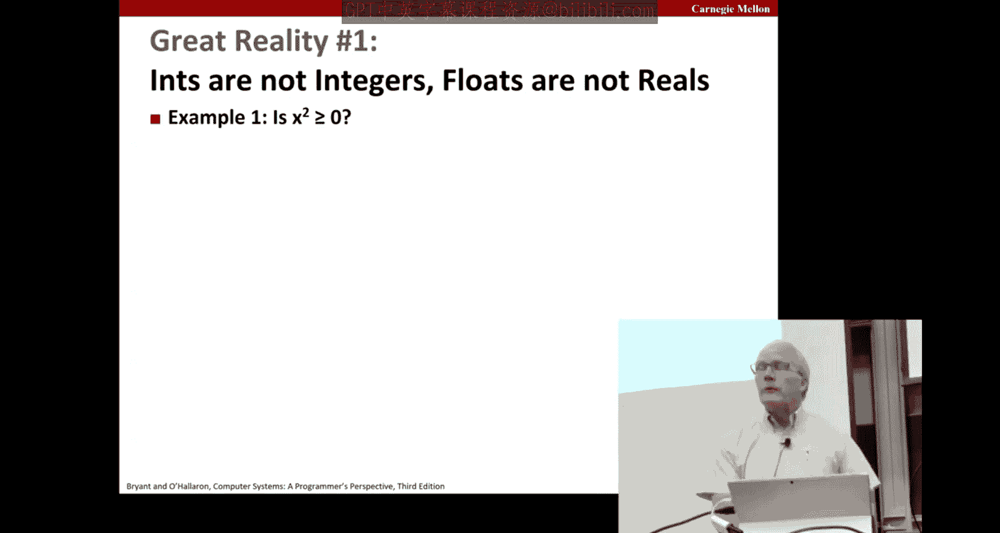

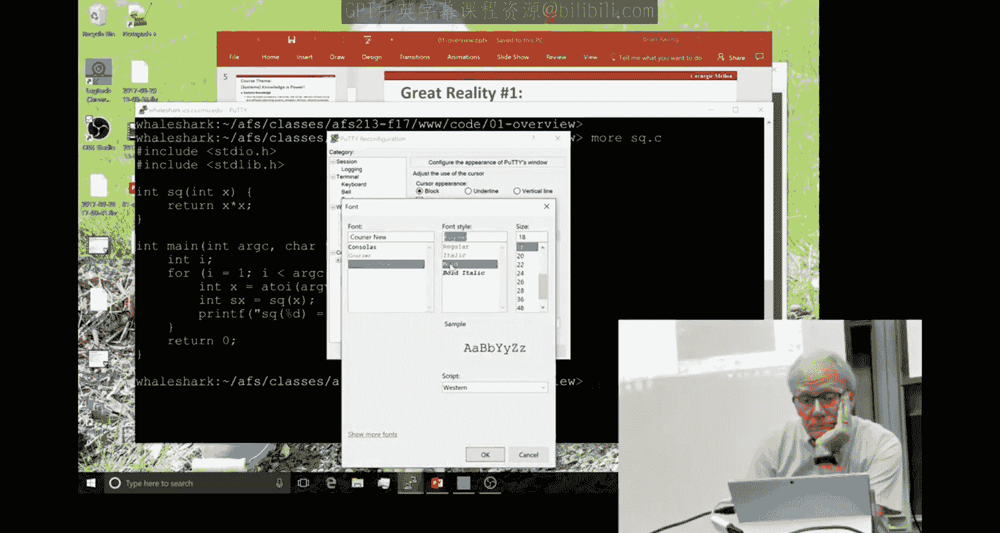

### 整数（int）并非数学整数

在C语言中声明一个`int`类型变量时，它并不完全等同于数学上的整数。例如，根据代数知识，一个数的平方应该总是大于或等于零。让我们测试一下这个假设。

我写了一个非常简单的程序 `sq.c`，它计算 `x * x`。当我们用 40,000 运行时，结果是 1,600,000,000，符合预期。但当我们用 50,000 运行时，结果却是 -1,794,967,296。这看起来不像任何数的平方，它是负数，而且没有零。这是因为在这台使用32位字长的Linux机器上，所有`int`类型的数字都用32位表示。50,000的平方太大，无法用这种表示法容纳，导致了溢出，从而改变了位模式。

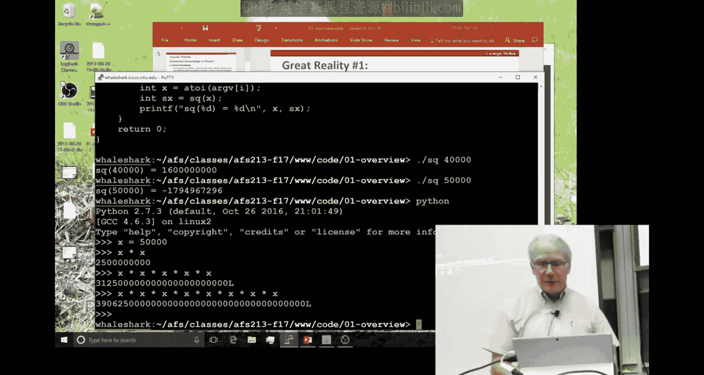

**代码示例：**
```c
// sq.c
int square(int x) {
    return x * x;
}
```

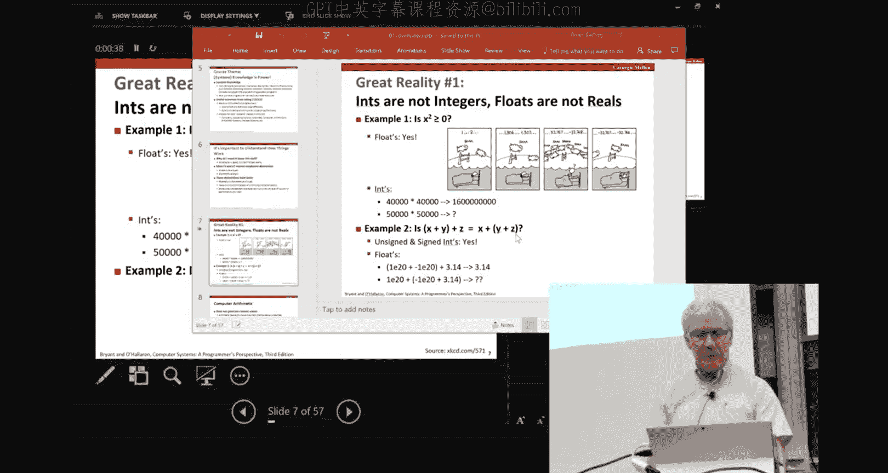

这可能导致严重问题，例如在控制火箭时，如果期望计算50,000的平方却得到一个负值，后果不堪设想。事实上，历史上确实发生过因数值溢出导致火箭失控的例子。Python等语言通过使用可变长度的数字表示方式避免了这个问题，但C语言没有。理解不同语言如何处理数字表示是成为高效系统程序员的重要部分。

### 浮点数的非结合性

对于浮点数，持续对一个数平方，结果总是正数。但算术的结合律在浮点数中并不总是成立。结合律是指对于加法和乘法，可以改变括号的位置而最终结果不变。

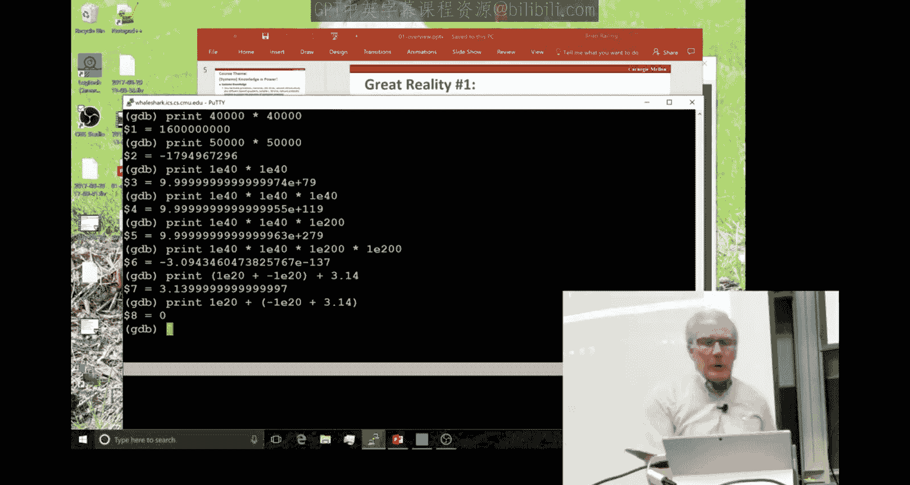

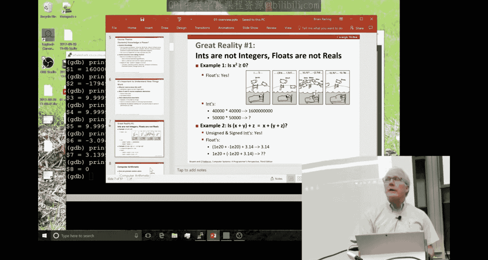

例如，使用课程中将熟悉的GDB调试器内置的解释器进行计算。计算 `(1e20 + -1e20) + 3.14` 得到 3.14（尽管3.14被显示为3.13...）。但如果改变括号顺序为 `1e20 + (-1e20 + 3.14)`，结果却是0。原因在于，在科学记数法中只保留小数点后一定位数，1e20这个巨大的数使得3.14在求和时被“淹没”了，右边的和计算结果就是-1e20，再加上1e20就得到了0。

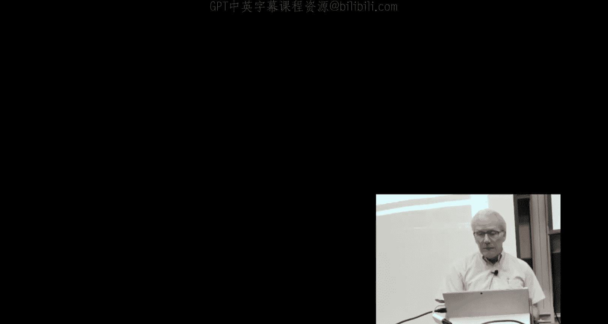

浮点数可以处理更大的数值范围，但其代价是精度有限，可能导致有效信息的丢失。如果不理解这一点，在进行数值计算时可能会遇到麻烦。本课程将花相当多的时间学习数字表示及其实际格式和属性，因为这是计算机科学许多领域的基石。几年前，计算机图形学课程将本课程设为先修课，就是希望学生能理解浮点数运算。

### 内存访问与程序错误

另一个重要部分是理解程序如何使用大量内存。现代计算机提供了可以访问海量内存的抽象，但物理内存是有限的，并且具有层次结构（从处理器芯片内到外部芯片，再到磁盘驱动器）。操作系统和硬件协同工作，让你感觉像是在访问大量内存，但这会根据你的内存访问模式带来不同的性能特征。

在C或C++等语言中，引用内存的方式可能导致严重且难以调试的错误。以下是一个简单的结构体示例：

**代码示例：**
```c
struct {
    int a[2];
    double d;
} struct_t;

double fun(int i) {
    volatile struct_t s;
    s.d = 3.14;
    s.a[i] = 1073741824; // 可能越界写入
    return s.d;
}
```

这个函数将`double d`设置为3.14，然后向数组`a`的任意位置`i`写入一个数。在Java等语言中，只允许引用`a[0]`或`a[1]`，但C语言没有数组边界检查，它会允许引用`a[39]`，从而在内存中存储一个与正常情况无关的数。

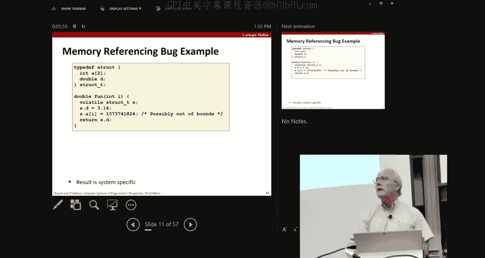

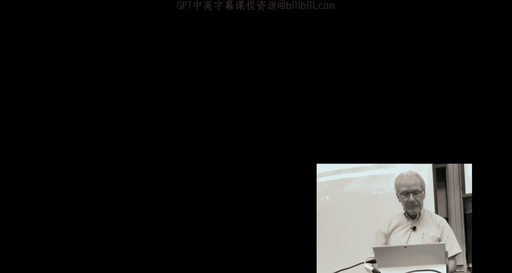

运行这个程序会发现，当`i`为0或1时，返回3.14。当`i`为2时，返回值不再是3.14。当`i`为3时，3.14变成了2。当`i`为4时，程序崩溃，因为系统检测到这是无效的内存访问。在其他情况下，这种错误可能不会立即导致崩溃，程序可能运行数分钟、数小时甚至数周后才出现严重错误，且难以定位错误注入点。

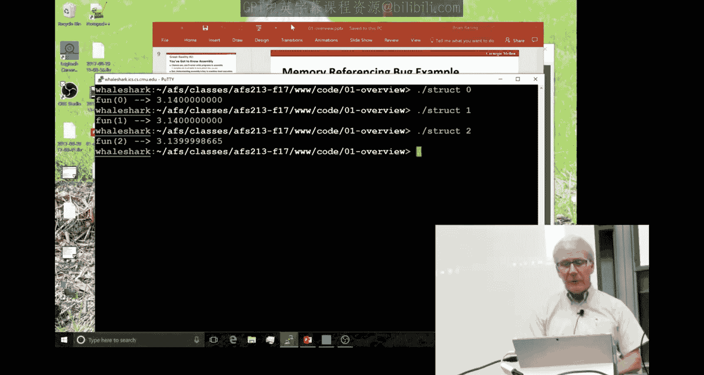

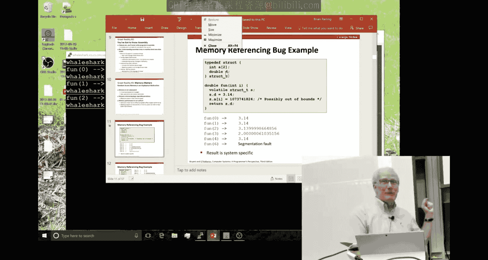

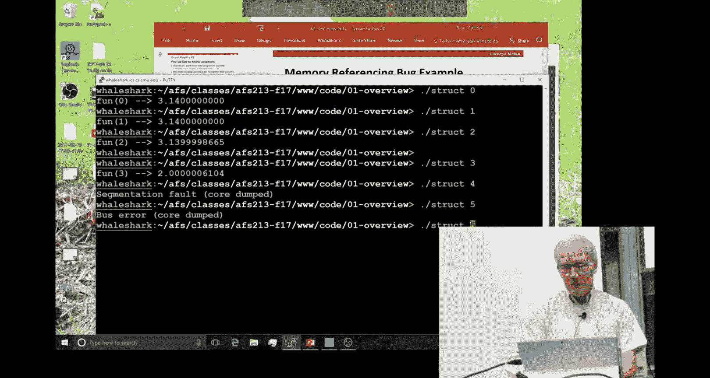

理解内存布局、数据结构如何排列，至少能让这些现象变得可理解。这是使用C/C++编程的现实之一，很多人因此选择其他语言。但现实是，世界上有大量代码是用C/C++编写的，这是其特性之一。本课程将帮助你理解这些底层机制。

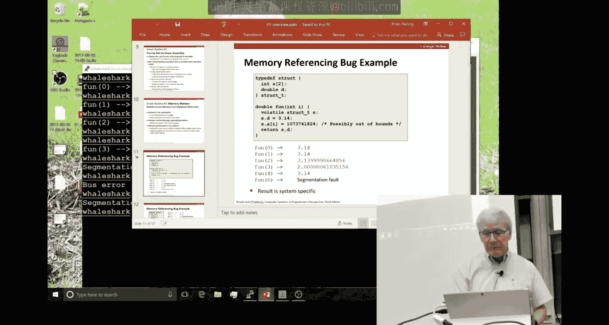

### 程序性能与内存层次结构

本课程还将关注程序性能，从多个层面进行分析。像15-122这样的课程中，你学习了大O表示法和渐近复杂度的概念。但很多时候，性能问题不仅仅是算法复杂度的问题。例如，运行视频编码器时，如果帧率只能达到15帧/秒而非30帧/秒，这就不是渐近复杂度问题，而是需要让代码运行速度翻倍。工程世界中，常数因子也常常很重要。如果你足够理解程序执行过程，通常可以找到优化性能的空间。

内存系统和性能的结合可以通过以下两个函数来体现，它们执行完全相同的操作：将一个2048x2048的源数组复制到目标数组。

**代码示例：**
```c
// 行优先复制
void copyij(int src[2048][2048], int dst[2048][2048]) {
    int i, j;
    for (i = 0; i < 2048; i++)
        for (j = 0; j < 2048; j++)
            dst[i][j] = src[i][j];
}

// 列优先复制
void copyji(int src[2048][2048], int dst[2048][2048]) {
    int i, j;
    for (j = 0; j < 2048; j++)
        for (i = 0; i < 2048; i++)
            dst[i][j] = src[i][j];
}
```

两个程序的唯一区别是内层循环的顺序：一个是按行遍历，一个是按列遍历。逻辑结果完全相同。但在实际机器上运行，性能差异可能高达20倍，行优先方式要快得多。这是内存层次结构的一个例子：行优先访问更符合内存层次结构对访问模式的预期，而列优先访问则打乱了这种模式。教材封面的图片就解释了为什么行优先优于列优先。我们将理解这种现象，并称之为“内存山”。

### 网络与系统视角

除了编写操作数字或访问内存的小程序，计算机系统还有许多其他有趣的部分，特别是计算机通过网络相互通信。这涉及许多复杂的层次、标准、协议、硬件和软件。我们不会深入探讨，你需要学习网络或分布式系统课程才能真正掌握。但本课程会给你一个起点，让你更好地理解计算机在使用无线网络或浏览器获取网页时发生了什么。

本课程与大多数系统课程（包括你将在此之后学习的高级课程）的不同之处在于，大多数系统课程围绕如何构建系统来设计。例如，在CMU的操作系统课程中，你会花大量时间编写操作系统的核心代码；在编译器课程中，编写编译器；在计算机体系结构课程中，设计微处理器。这些都是非常有趣的实践。

但我们认为这不是入门的最佳方式。我们喜欢以程序员为中心的方式来介绍系统。本课程中，“程序员”主要指C程序员。你将学习如何编写代码来运用、利用和与系统的不同部分交互，以及如何变得更高效、更出色。这为你提供了一个视角，当你之后学习操作系统课程时，他们已经教你如何编写信号处理程序，而你已经从本课程中了解了信号处理程序是什么及其在应用程序中的用途和价值。

我们主要关注应用程序代码。这将为你提供一个起点，当你进入更高级的系统编程和系统设计时，你会理解你要实现的目标。这种用户视角或程序员视角非常适合入门，也符合我们的目标：即使你不再学习其他系统课程，也能从本课程中学到有用的东西。因为实际上，去设计缓存内存的公司工作的人非常少。设计微处理器、缓存内存、实现操作系统的人只占使用这些技术（在不同复杂程度上）的总人数的一小部分。

因此，我们更倾向于为你更广泛的编程生涯做准备。我们所涵盖的许多材料，历史上人们往往是在工作中、从朋友那里、通过摸索、听说或在互联网上阅读而学到的。我们试图做的是将其系统化并集中在一个地方，这样即使你没有强烈的自学欲望，也可以通过我们来学习。

## 学术诚信政策 ⚖️

现在，我想谈谈本课程中一个不那么愉快的部分：学术诚信问题。学术诚信是一个广义的术语，涵盖各种形式的作弊和剽窃。我知道你们在其他课程和地方已经听过很多关于这方面的内容。但这在计算机科学中尤其是一个问题，因为有许多工具和技术使得以不正当方式获取信息变得非常容易和诱人。

这对本课程和其他课程来说一直是一个严重的问题，我们非常重视。部分原因在于，我们作为教师感到有特殊的义务：如果你从这门课程进入操作系统等后续课程，我们希望确保你真正掌握了这些材料，而后续课程的教师也期望你已经掌握。如果你通过不正当手段完成，很可能并没有真正掌握，这会成为问题。

这不仅关乎个人诚信，也关乎我们对学生的责任。处理学术诚信问题也是我们工作中最不愉快的部分之一。总的来说，教学大纲中对允许和不允许的行为有相当深入的讨论，我建议你仔细阅读。

一般来说，本课程的所有作业（共8个实验）都需要独立完成。你可以使用教科书、课程网页上的信息，可以与助教或教师讨论，但不应以任何重要方式相互协作完成作业。现实是，网络上有很多资料可能绕过我们课程的学习目标。这本教科书在全球320所学校使用，一些实验虽然我们进行了调整，但与教科书中的实验并非完全相同，但网络上仍有许多隐藏的地方可能有与你的作业相关的材料。

因此，这可能很容易诱人，有时甚至感觉有必要使用这些信息，但我们真的希望避免这种情况。总的来说，以不正当方式从他人或网络获取信息是不允许的。另一方面，我们也不希望你向本课程或未来版本课程的学生提供信息。你现在和将来都有义务不泄露与本课程实验相关的信息。

你应该意识到，如果你查看大学的学术诚信政策，其中一条是“无追诉时效限制”。这意味着，即使你通过了这门课程，没有被发现有不端行为，并获得了不错的成绩，你并非完全安全。如果我们发现过去有未经授权的行为，我们可以追溯，通过程序更改你的成绩，甚至可能撤销你的学位。这听起来可能有点吓人，但这是真的。我们也确实这样做过。

GitHub存在一个特殊问题。很多学生喜欢使用Git，这是一个进行版本控制的好方法。但GitHub上，你的账户可能当前是私有的，但一段时间后会变为公开，因此你可能会无意中留下一些材料，这实际上相当于向未来的学生泄露信息。

### 什么不是作弊？

那么，什么不是作弊呢？我在这里交替使用“作弊”和“剽窃”这两个术语。
*   如果其他学生在代码编译或调试器使用等系统层面遇到问题，与他们合作是可以的。
*   讨论非常高级的设计问题也可以，但人们常常误解“高级设计”的含义。高级设计意味着一般性的讨论，例如“我发现按行访问数组比按列访问更好”。如果你需要在白板上写下伪代码来解释，那就不再是高级了，伪代码也是代码。
*   当然，你可以使用教科书网页、课程网页等提供的代码。

教学大纲对此有相当详细的说明。

### 检测与后果

我们非常擅长追踪这些行为。我可能和你们一样擅长使用网络搜索。如果我们发现爱荷华州某个学生的代码副本，我们很可能已经找到了那份代码并保存了副本。我们还保存了这门课程历史上每一份提交的作业。我们运行称为“作弊检查器”的程序，它们将所有曾经创建的作业汇集在一起，然后加入你的代码进行分析比较。这些程序不会被更改注释、变量名或缩进等方式愚弄，它会返回匹配结果。其中一些匹配是偶然的，但另一些在我们看来会非常可疑，这时我们就会开始更仔细地审查。

实际上，要欺骗这些程序相当困难。一旦发生这种情况，我们几个人会开始更仔细地审查代码。如果可疑，我们会叫你开会，这可能是一次非常不愉快的会议。作为后果，我们的最低处罚总是该作业扣100%，这比根本没交任何东西还要糟糕。但当我们认为存在情有可原的情况，或者你诚实承认时，会有其他处理方式。事实上，默认情况是，我们给予该作业不及格，并记录在你的永久记录中。

所有这些都会被大学标记为AIV（学术诚信违规）。大学的规定是：一次AIV，希望你吸取教训；两次AIV，你将被带到由教师和其他学生组成的委员会面前进行解释，他们可以施加处罚。我们作为教师可以施加的最高处罚是课程不及格，但委员会可以施加开除学籍的处罚，而且他们确实这样做过。我参加过几次针对第二次违规学生的听证会，他们被开除了。

举个例子，两年前，我们有大约20名学生（约占课程学生总数的5%）因此未能通过课程，其中至少有一名随后被大学开除。几年前，我们发现许多人在一个实验中的实现代码来源相同，于是追溯了几年的提交记录，在许多人的作业中找到了同一来源。我们通过一个涉及多位教授和大学学生事务院长的程序，实际上对11名已经修完课程的学生（其中一些已经从CMU毕业）进行了处罚、重新评分并分配了新成绩。我们真的非常认真地对待“无追诉时效限制”这一点。

我个人想说，我不喜欢做这些，甚至不喜欢谈论这些。我觉得花时间查看某人的作业，试图弄清楚它是否是GitHub上另一份代码的副本，花时间与学生交谈，听他们闪烁其词直到最终承认，经历整个过程，这非常痛苦。这对我来说在情感上实际上非常困难，对学生来说则更加困难。

我知道在座的所有人都没有在课程中作弊的意图。但问题是，当截止日期临近，而你还没有完成作业，并且你知道网上有一份副本时，诱惑太大了，你可能会越界，明知不对但还是做了。这种情况确实会发生。但后果真的非常、非常严重。

### 关于误报

关于误报的问题很好。MOSS（一种代码相似性检测工具）会产生很多匹配。确实有很多误报。也有过几次，我们与学生开会，他们给出了一些解释，然后就没有后续了。但你必须意识到，我们作为教师不需要你的供认就可以施加后果。我们可以说：“我认为你作弊了，我要给你这个处罚。你有权申诉。”如果你确实被冤枉了，申诉是件好事，我们尽量避免误判。但我们不是法官或陪审团，我们不需要“排除合理怀疑”的证据。我们可以说：“我相信这是我认为的情况。”你可以申诉。我本人没有遇到过需要申诉的情况，但确实有一些学生来开会并给出了解释，那样也没问题。

### 场景示例

让我们看几个例子：
*   如果你搜索“213 bomb lab”，实际上会出现一些有趣的YouTube视频。我看过那些视频。我们大致知道上面有什么，但你不应该那样做，这显然是在试图获取信息来完成作业，不是技术信息，而是有助于你找到解决方案的东西。
*   一般来说，提供代码是相当明显的行为，给文件也是。但如前所述，在白板上写伪代码也是信息共享。
*   另一方面，如果你需要关于某些库函数或特定程序的参考资料，那是可以的。与助教讨论总是可以的，我们有很多办公时间。

为了节省时间，我跳过一些场景，但我建议你查看教学大纲中的一些典型场景，这些是我经常遇到的情况。正如我所说，截止日期临近，你必须提交作业，但代码不工作，你在GitHub上找到某个地方学生写的或多或少能工作的代码，复制一份，尝试修改，然后提交。我们会发现这些情况，然后进行我描述过的会议。

更多场景：
*   Alice正在做一个实验，但代码不工作。Bob坐在她旁边，他已经完成了。Bob旁边是Charlie，Charlie做得不太好。Charlie起身休息，Bob打印出自己的代码放在Charlie的椅子上。谁作弊了？Bob。Charlie显然此时不知情。但后来Charlie发现了这份副本，看了看，复制了一个函数并进行了修改。那么Charlie也作弊了。
*   Bob和Alice坐在一起，一起检查她的代码，找出问题。谁作弊了？Bob和Charlie都算，他们在协作。
*   Charlie看着Bob留下的屏幕，看到了内容。谁作弊了？显然是Charlie。Bob当然也不应该让屏幕无人看管，但在这个世界上，你对隐私有一定期望，不必锁住所有东西或设置密码。但总的来说，Bob把屏幕留在那里不好。
*   Alice在使用GDB设置断点时遇到麻烦，Bob向她展示。这没问题，是可以的。
*   Joy去找助教寻求帮助。这没问题。

### 版本控制与Git

我们从上个春季学期开始做一件事，因为很多学生使用GitHub作为代码仓库。事实上，我自己也是GitHub的粉丝，但GitHub最好的是Git，而不是Hub。Git是一个通用的版本控制程序，只要你能找到支持Git的服务器，就可以使用它，不一定非得使用商业版的GitHub。ECE运行了一个Git服务器，我们真的强烈建议你使用那个，而不是GitHub。

这里有点“胡萝卜加大棒”的意思：一方面，使用版本控制是一个好习惯。当你修改程序时，希望能够恢复，如果你做了某个更改后发现是个坏主意，可以回到之前的状态。你可以创建不同的分支，不必担心电脑崩溃丢失文件等。你可以记录你的更改，这些都是Git或任何版本服务器的特性，但Git尤其出色。我们希望你们使用这个的另一个原因是，这实际上可以成为你在这个实验中付出努力的记录，如果我们开始询问，这可能非常重要。

去年春季和夏季都发生过多次这样的情况：学生被叫来开会，因为我们觉得他们的代码有些可疑。一些学生实际上有相当完整的Git工作记录，可以证明他们一直在持续努力，因此被免除了任何不当行为。但另一些学生突然说：“哦，我没保存任何东西”，或者说“我保存了一堆东西，但突然发生了巨大的变化”，看起来像是导入了新代码。

你可以把Git看作是你的记录，我们可以查看。我们可以查看你在这门课程ECE服务器上的代码的Git日志作为记录。因此，我们真的希望你们使用它，既是为了作为程序员自身的利益，也是作为一种可以证明这确实是你自己一直在编写的代码的记录。

## 课程安排与后勤 📅

本课程有三位教师。对于本科生，我们有讲座和复习课。我们将引入从去年夏季开始使用的Canvas（新的Blackboard系统）。它具有进行课堂小测验的功能，这不是在纸上写然后传递的那种测验，而是几个选择题。这对教师来说非常有用，可以实时了解班级的理解程度，并动态调整教学。如果你上过使用答题器的课，概念类似，只是你将使用笔记本电脑或智能手机参与。

我们不会真的给这些小测验评分，但最终在评分时，如果某个学生处于临界情况（例如在两个字母等级之间），我们看到他们积极参与的记录（作为他们参与课程程度的指标）可能会影响成绩。这不是一个具体的数值。如果你缺课，不用担心，我们有视频，网上有很多材料，我们不会以任何正式方式考勤，但你的参与可能对你的成绩有益，当然也能让你更好地学习材料。

### 教材与资源

教材请购买第三版，不要买其他版本，也不要买国际版，它们真的搞砸了。中文版还可以，我们很了解译者。我们还强烈推荐你购买Kernighan和Ritchie写的C语言书。Ritchie是贝尔实验室C语言的创始人之一。这本书真的很旧，有点过时，因为C语言已经发展，但它仍然是最好的书，因为它不仅讲语言本身，还提供了一些非常好的小程序示例来展示风格和编程思路，比我们见过的任何其他书都好。

本课程将有8个实验（以前是7个）。实验是这门课程的主要部分，也是你学习的主要方式。你们可能已经从朋友那里听说了。有两次考试，都使用在线考试系统进行，没有纸质试卷。课程网页上有很多资源。我们使用Piazza进行学生提问和发布许多通知，所以你应该在Piazza上关注。默认情况下，你的帖子对教师是私有的，我们建议你保持这样。如果某个问题反复出现，并且值得全班知道，我们可能会以适当的方式将你的私人帖子转为公开，但一般来说，这是一种你可以联系到我们或任何20位助教的私人方式。

另一方面，不要在Piazza上发布代码，不是因为我们不喜欢代码，而是这不是正确的方式。我们使用Autolab提交作业，所以如果你需要代码帮助，应该提交到Autolab，然后告诉我们，这样我们可以去Autolab获取并查看你的代码，而不是处理大文件。对于所有作业，你可以随意提交多次，没有任何处罚。尽早并经常提交，这是计算机的一大优点。

### 特殊机器与支持

我们有一些为本课程保留的特殊机器，称为Shark机器。本课程的大部分工作你可以在任何Linux机器（甚至一些非Linux机器）上完成。但评分系统Autolab实际上运行在计算设施维护的一组Linux服务器上。我们有这些非常特定的Shark机器，我们确保软件配置正确并能正常运行。所以如果有疑问，请使用这些机器进行你的工作。

关于作业提交策略：确保你最后提交的内容是你希望被评分的，因为那是我们实际评分的唯一内容。

### 宽限日与评分政策

我们有一些政策：我们有“宽限日”让你处理日程安排。在整个学期中，每个作业都有截止日期，你总共可以累积5个“宽限日”。有些作业允许最多2天，有些不允许，有些允许1天，具体安排都在课程表中。我们希望你们在时间紧迫时使用这些宽限日，例如你有多个课程、需要去参加求职面试、周末必须回家给祖母过生日等。这样我们就不必在这个规模的班级中处理每一个特殊情况。

如果你用完了宽限日（这些是自动分配的，你无法控制将宽限日用于哪些作业，一旦作业迟交就开始消耗宽限日），我们通常还会为作业提供最多总共3天的迟交时间，但会有递增的扣分处罚。因此，我们期望这能处理几乎所有人们可能无法按时完成作业的情况。如果你的生活中发生了非常严重的事情，影响的不只是这门课，而是你所有课程的参与，那么你需要去找你的课程顾问。顾问可以联系我们，基本上制定一个重新跟上进度的计划。

这门课（或任何课程）的一个困难之处在于，课程有很强的惯性。一旦你开始落后，真的很难再赶上，你会感到沮丧，然后进一步落后。我的主要建议是：第一，除非真的需要，否则不要使用宽限日，尽量把它们留到课程最后几个最重要的作业。第二，你永远不知道会发生什么可能阻止你按时完成事情，所以尽量保持进度，在整个课程中跟上节奏。

### 课堂行为与评分构成

一般来说，在课堂上使用笔记本电脑是可以的，但我们不希望你做其他事情，希望你做有成效的工作，而不是上Facebook。课程成绩一半是考试，一半是实验。实验有不同的分值，你可以在作业页面上看到不同作业的分数分布。我们倾向于按标准评分量表评分，不进行分数调整。我们通常会有相当多的A和B，如果你展示了对材料的掌握，我们很乐意给你好成绩。如前所述，如果学生处于临界状态，并且有某些情况支持，我们有时会提高他们的成绩。

我想提一下，今天有一个新的实验（Lab 0）发布，你可以从课程页面获取。如果你在昨天中午之前注册了这门课程，应该都已经有了Autolab账户。这个新实验叫“Web Ze”，是一个C编程小练习。如果你做过任何C编程，或者上过15-122，这应该是一个非常简单的练习，我们希望如此。但我们发现，有些进入课程的学生要么C语言较弱，要么有些生疏，或者由于某些原因没怎么做过C编程，他们发现自己卡住了。问题在于，问题不是发生在前几个实验，而是在课程进行大约一个月后，当你必须开始编写更重要的程序时。Lab 0是我们新的尝试，旨在帮助你进行评估。它在你的总成绩中只占2分，应该只需要大约一小时完成。你可以马上开始做，截止日期是一周后。其他实验是我们在这门课程中沿用了一段时间的，尽管我们不断以各种方式调整和改进它们。

实验是这门课程的重要组成部分，我相信如果你和以前上过这门课的人聊过，这是他们记忆最深的。动手实践是学习材料的好方法。我们使用一个叫“Project Zone”的系统分发实验的讲义。这个系统会随着时间慢慢揭示讲义内容，只有当你回答完之前看到的问题，到达最后时，你才会得到一个小密码（一组数字和字母），然后你将其作为提交的一部分，这样才能提交到Autolab。我们这样做是因为我们经常在Piazza上收到问题，而我们的回答是“请仔细阅读讲义”。这是一种更强烈地鼓励你在开始作业前仔细阅读讲义的方式。

### 启动营与Git服务器

最后我想说的是，本周一（虽然是假期）晚上7点在Raid礼堂将有一个“启动营”，由助教们主持，内容是关于熟悉Linux和Git。这对很多人来说不是强制性的，但如果你对使用Linux、命令行工具、Git有点生疏，他们会涵盖很多内容，所以我建议你把它列入日程。此外，我们将有一个Git服务器。

## 总结

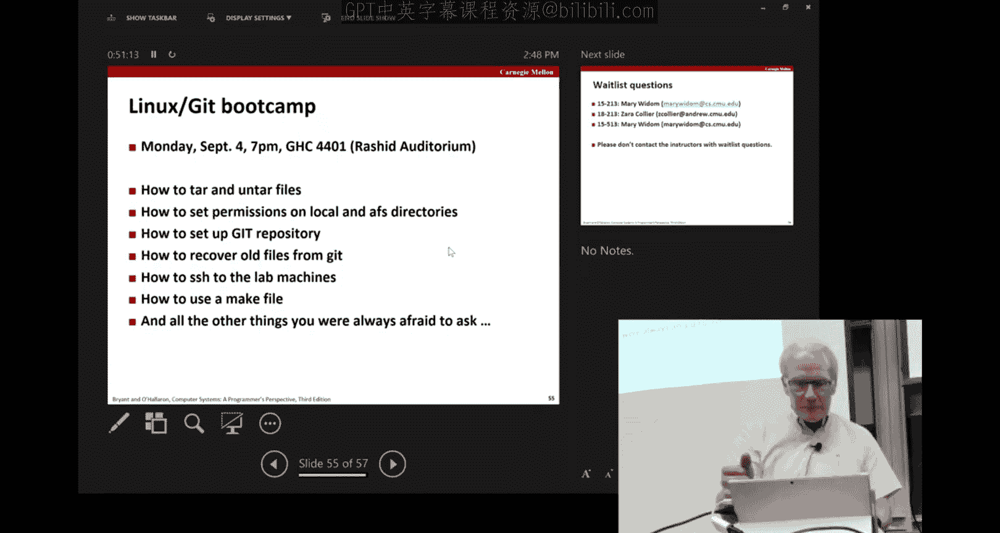

本节课我们一起学习了CMU《计算机系统导论》课程的全貌。我们了解了课程旨在弥合高级编程抽象与底层系统硬件之间的鸿沟，通过具体示例（如整数溢出、浮点数精度、内存访问错误和性能优化）展示了理解系统底层的重要性。我们深入探讨了严肃的学术诚信政策及其严重后果，并熟悉了课程的基本安排、资源和使用工具（如Git版本控制）。本课程将通过讲座、实验和你的积极参与，为你打开计算机系统世界的大门，为未来的学习和职业生涯奠定坚实的基础。