# 02：位、字节与整数 I

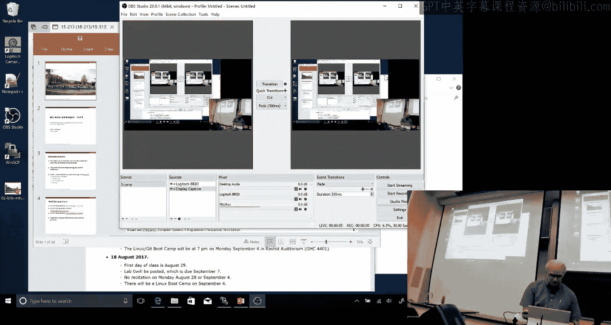

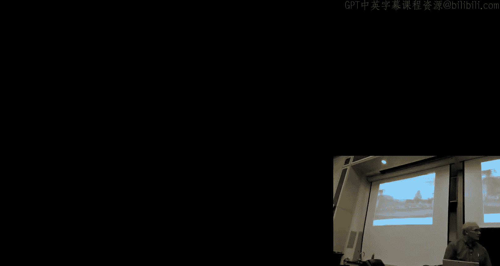

在本节课中，我们将开始学习计算机系统的基础——位、字节与整数。我们将探讨信息在计算机中如何以二进制形式表示，以及如何通过不同的解释赋予这些比特串不同的含义。这是理解后续所有计算机系统概念的核心基础。

## 课程公告与安排

上一讲我们介绍了课程概述和一些后勤信息，本节中我们来看看一些具体的课程安排。

*   下周一（劳动节）没有课，因此也没有习题课。
*   我们将在周一晚上7点安排一个可选的“Linux 训练营”，内容涵盖Linux命令行、代码运行、文件编辑、Git使用等基础操作。
*   课程网站上发布了名为“Web Zero”的新实验，这是一个C语言编程入门练习，旨在评估你是否具备课程所需的最低编程背景。该实验不适用任何宽限期政策。
*   关于课程候补名单的问题，请直接联系CS或ECE的课程管理员，而非授课教师。

## 信息的二进制表示

我们生活在一个比特无处不在的时代。但你是否想过，为什么计算机使用二进制（0和1）？这并非唯一的方式（例如早期的ENIAC计算机就使用十进制），但从系统设计的角度看，二进制有几个关键优势：它能更好地处理电路中的噪声和不确定性，并能稳定地存储信息。

更重要的是，**比特本身没有内在含义**。一个比特串可以代表一个数字、一个字符串、一个浮点数或一段代码。是我们赋予这些比特的**解释方式**决定了它们的含义。这个抽象概念将在本课程中反复出现。

例如，数字 `15213` 可以用二进制比特串表示。我们也可以将其视为一个带二进制小数点的浮点数，例如 `15213.0` 可以表示为 `1.1101101101101`（二进制）乘以 `2^13`。

## 十六进制表示法

直接书写长串的二进制数字非常繁琐。通常，我们会将比特每4位一组，用单个十六进制数字表示。

以下是十六进制表示法的规则：
*   使用前缀 `0x` 或 `0X` 表示十六进制数。
*   使用数字 `0-9` 和字母 `a-f`（或 `A-F`）表示0到15的值。

例如，二进制数 `0011 1011 0110 1101` 可以分组转换为十六进制：`0011` 是 `3`，`1011` 是 `B`，`0110` 是 `6`，`1101` 是 `D`，因此其十六进制表示为 `0x3B6D`。掌握二进制与十六进制之间的快速转换是一项在本课程中非常有用的技能。

## 字长与数据大小

当我们讨论机器时，常会听到“32位”或“64位”这样的术语。但需要注意的是，**这些定义并不绝对**。它实际上是由操作系统、编译器生成的代码以及硬件本身共同决定的。例如，现代的Intel处理器可以支持64位操作，也可以运行在向后兼容的32位模式下。

在C语言中，基本数据类型的大小也与此相关。在32位和64位模式下，像 `int` 这样的类型通常保持4字节不变，但 `long` 类型和指针（`*`）的大小会从4字节变为8字节。64位地址提供了远大于4GB（约2^32字节）的寻址范围，这是现代计算机需要更多内存的必然结果。

## 布尔代数与位运算

信息论的奠基人香农在其著名的硕士论文中，将乔治·布尔提出的布尔代数（用于命题逻辑）与数字电路设计联系起来。在布尔代数中，我们将 `0` 视为“假”，将 `1` 视为“真”。

以下是基本的布尔运算：
*   **与（&）**：`A & B`，当且仅当A和B都为真时结果为真。
*   **或（|）**：`A | B`，当A或B至少一个为真时结果为真。
*   **非（~）**：`~A`，取反。
*   **异或（^）**：`A ^ B`，当A或B其中一个为真（但不同时为真）时结果为真。

我们可以将这些运算从单个比特推广到**位向量**（即比特串，如32位或64位字）。运算是按位进行的，即对每一位独立应用上述规则。

位运算的一个实际应用是表示和操作**集合**。对于一个最多有32个元素的集合，我们可以用一个32位的位向量来表示，某一位为1表示对应元素在集合中。此时：
*   **与（&）** 操作对应集合的**交集**。
*   **或（|）** 操作对应集合的**并集**。
*   **异或（^）** 操作对应集合的**对称差**。

这种表示方法在系统编程中非常实用，例如用于管理网络连接的状态集合。位向量中值为1的位常被称为“掩码（mask）”，用于筛选出感兴趣的位。

在C语言中，我们使用 `&`、`|`、`~`、`^` 这些符号进行位级运算。但务必注意，它们与逻辑运算符 `&&`、`||`、`!` **完全不同**。逻辑运算符将任何非零值视为“真”，结果只产生 `0` 或 `1`，并且具有短路求值特性。例如，表达式 `p && *p` 在 `p` 为空指针（0）时是安全的，因为 `&&` 发现左侧为假后会直接停止求值，不会解引用 `p`。

## 移位运算

移位运算包括左移和右移。

*   **左移（<<）**：`x << k` 将 `x` 的位向左移动 `k` 位，右侧空位补0，左侧移出的位丢弃。
*   **右移**：有两种类型。
    *   **逻辑右移（>>> in some languages）**：`x >> k`（对于无符号数）将位向右移动 `k` 位，左侧空位补0，右侧移出的位丢弃。
    *   **算术右移**：`x >> k`（对于有符号数）将位向右移动 `k` 位，但左侧空位用**最高位（符号位）的副本**填充，右侧移出的位丢弃。

算术右移对于有符号数非常有用，它可以实现**除以2的幂**的运算（向零舍入）。在C语言中，对有符号数使用 `>>` 通常是算术右移，但对无符号数使用 `>>` 是逻辑右移，但这取决于编译器和机器。此外，C语言标准未定义负移位或过大移位的行为，这属于“未定义行为”，不同平台可能产生不同结果。

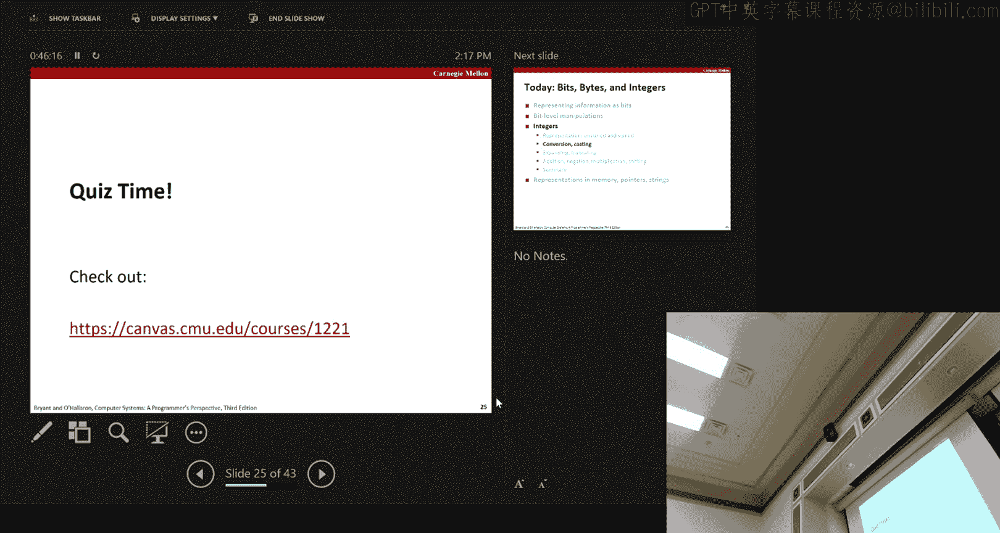

## 整数表示：无符号与有符号

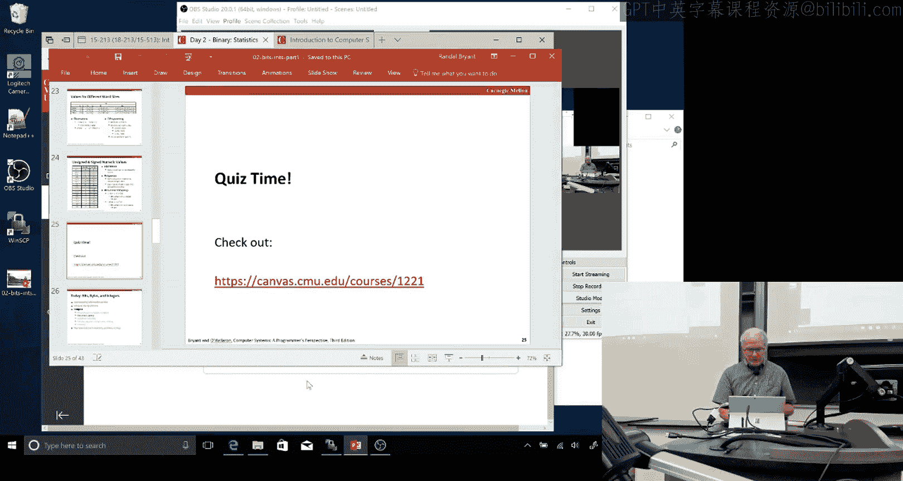

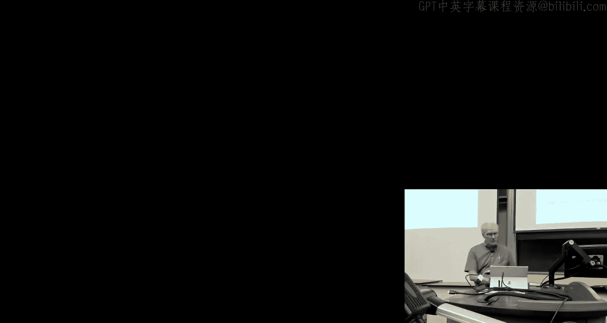

在计算机中，我们主要使用两类整数：**无符号数**和**有符号数**。

*   **无符号数（Unsigned）**：所有位都用于表示非负值。对于一个w位的无符号数，其值范围为 **0 到 2^w - 1**。
*   **有符号数（Signed）**：最常用的是**二进制补码（Two‘s Complement）**表示法。最高位（符号位）权重为 **-2^(w-1)**，其余位权重为正的2的幂。对于一个w位的补码数，其值范围为 **-2^(w-1) 到 2^(w-1) - 1**。

例如，对于4位表示：
*   无符号范围：0 (0000) 到 15 (1111)。
*   补码范围：-8 (1000) 到 7 (0111)。

注意，补码的范围是**不对称的**，负数的绝对值范围比正数大1（因为需要表示0）。同时，全1的比特串在无符号表示中是最大值（2^w - 1），在补码表示中则是 -1。

## 类型转换与符号扩展

在C语言中，有符号数和无符号数之间的转换非常常见，但规则可能出人意料。

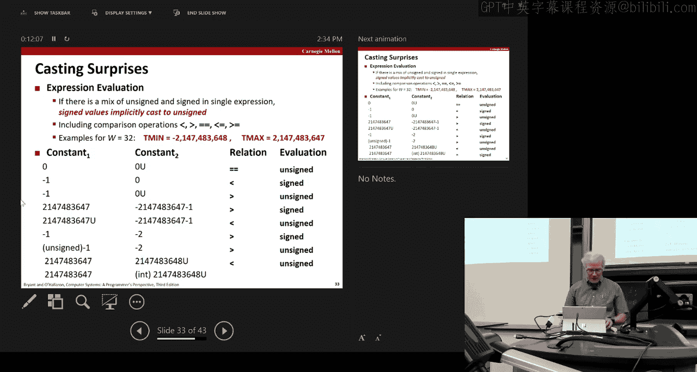

**关键规则是：有符号数与无符号数之间的转换，比特模式保持不变，只是解释这些比特的方式改变了。**

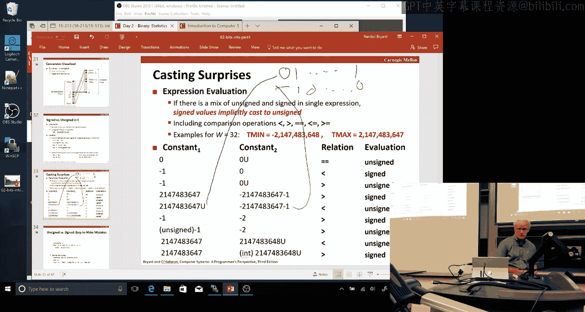

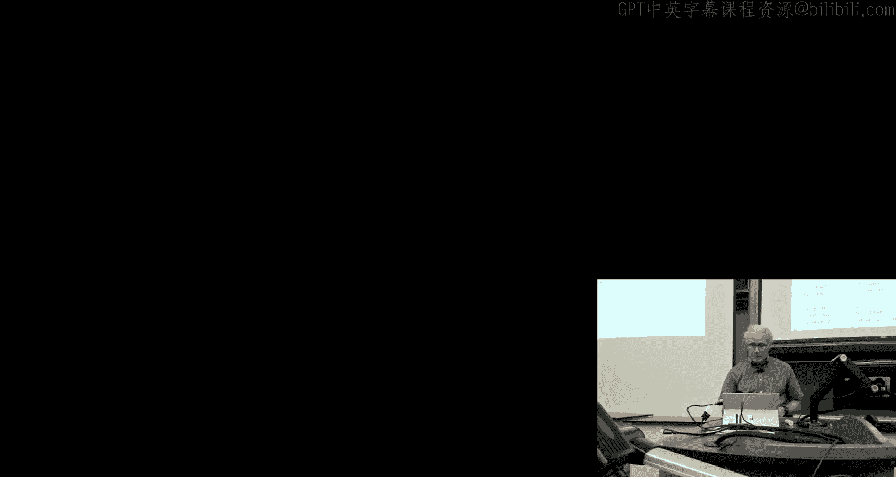

例如，`int` 类型的 `-1`（比特模式为全1）转换为 `unsigned int` 后，会被解释为一个很大的正数（2^w - 1）。反之亦然。

这种转换经常**隐式**发生。例如，当一个运算中同时出现有符号和无符号操作数时，C语言会**将有符号数隐式转换为无符号数**，然后进行运算。这同样适用于比较操作（`<`, `>`, `==` 等）。

这可能导致一些反直觉的结果，例如：
*   `-1 > 0U` 的结果是 **1（真）**，因为 `-1` 被转换为无符号数后变成了一个很大的正数。
*   `2147483647 > -2147483647-1` 的结果是 **1（真）**（正数大于负数）。
*   `2147483647U > -2147483647-1` 的结果是 **0（假）**，因为后者被转换为无符号数后变成了一个更大的正数。

这种隐式转换是程序中难以察觉的Bug来源。一个经典的例子是使用无符号数作为循环变量进行倒计时，循环条件 `i >= 0` 将永远为真，导致无限循环或内存访问错误。

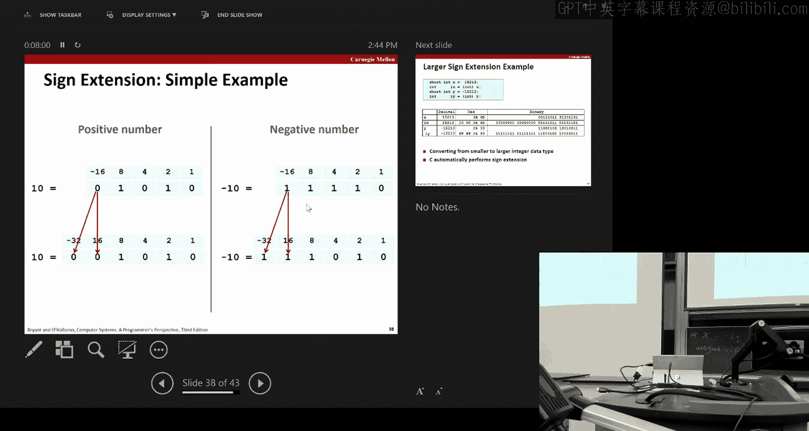

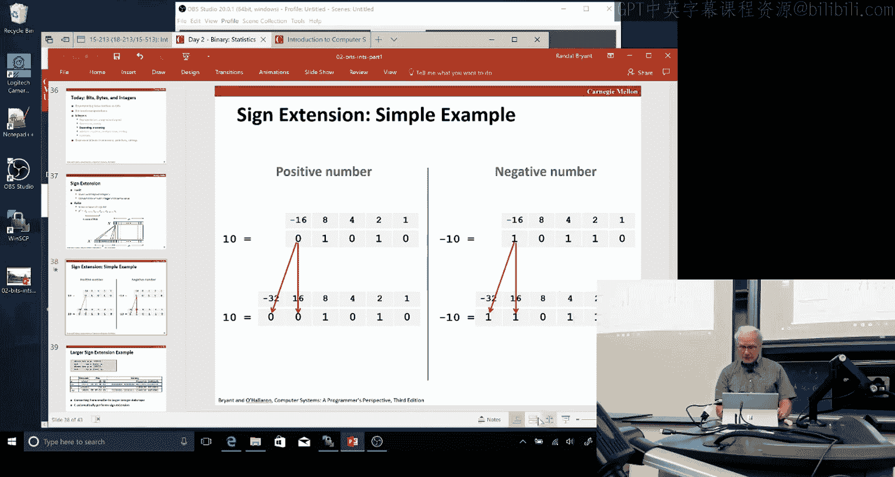

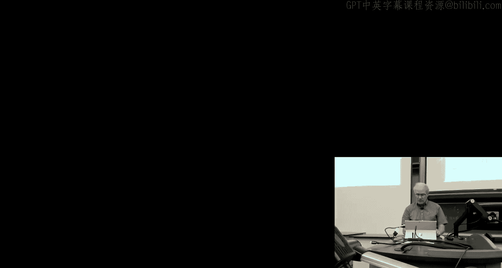

## 扩展与截断

当我们需要在不同大小的整数表示之间转换时，需要进行扩展或截断。

*   **扩展（小转大）**：
    *   **无符号数**：进行**零扩展**，在高位补0。
    *   **有符号数（补码）**：进行**符号扩展**，在高位重复复制符号位。这可以保持数值不变。
*   **截断（大转小）**：无论有无符号，都是简单地丢弃高位多余的比特。这可能会改变数值，甚至改变符号（对于有符号数）。只有当原始值在目标类型的表示范围内时，数值才能被正确保持。

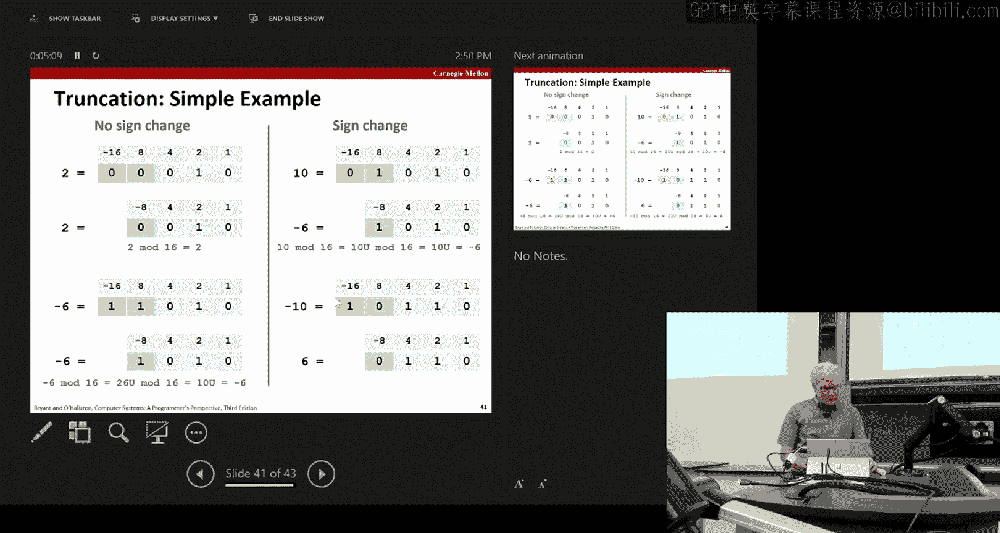

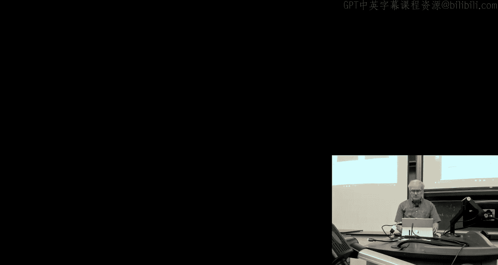

本节课中我们一起学习了计算机信息表示的基石：比特、字节与整数。我们理解了比特本身没有含义，其解释取决于上下文。我们探讨了无符号数和二进制补码有符号数的表示方法、范围及其转换规则，并学习了布尔代数、位运算和移位运算。特别需要注意的是有符号与无符号数之间隐式转换可能带来的陷阱。掌握这些概念对于理解计算机如何存储和处理数据至关重要。下一讲，我们将继续深入整数的运算。