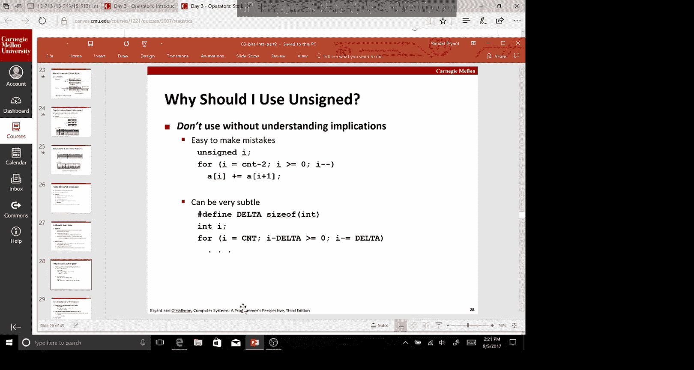
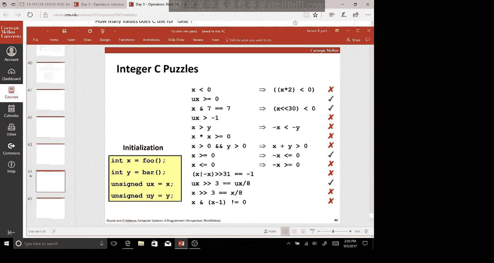

# 03：位、字节与整数 II

在本节课中，我们将继续学习整数在计算机中的表示方式，并深入探讨对它们进行的算术运算。我们将涵盖无符号数和补码数的加法、乘法、移位操作，以及字节在内存中的存储顺序。理解这些底层概念对于编写高效且正确的程序至关重要。

## 算术运算

上一节我们介绍了整数在内存中的两种基本表示方式：无符号数和补码数。本节中，我们来看看对这些表示形式进行的基本算术运算。

### 无符号加法

无符号加法遵循模运算规则。当两个W位的无符号数相加时，其和可能需要W+1位来表示。但计算机硬件会丢弃最高位的进位（即溢出位），只保留低W位作为结果。这相当于执行了模 2^W 的加法。

**公式**：对于W位无符号数 `u` 和 `v`，其和 `s = (u + v) mod 2^W`。

例如，使用8位（W=8）表示，223 + 213 = 436。但8位能表示的最大值是255，因此结果会溢出。丢弃进位后，我们得到 436 - 256 = 180。

### 补码加法

补码加法的硬件实现与无符号加法完全相同。我们同样将两个W位数相加，并丢弃任何超出W位的进位。然而，对结果的解释取决于我们将其视为补码数。

补码加法可能导致两种溢出：
*   **正溢出**：两个正数相加，结果太大，变成了负数。
*   **负溢出**：两个负数相加，结果太小（太负），变成了正数。

**核心概念**：补码加法的位级行为与无符号加法一致，但数值解释不同。

### 乘法

两个W位数相乘，其精确乘积可能需要最多2W位来表示。与加法类似，硬件通常只保留乘积的低W位，丢弃高位部分。

**重要规则**：对于补码乘法和无符号乘法，乘积的低W位是相同的。只有高位部分可能不同。因此，在大多数只关心低W位结果的场景下，可以使用同一条乘法指令。

### 乘以常数与移位

编译器经常使用移位操作来优化乘以2的幂次方的运算。将一个数左移k位，等价于将其乘以 2^k。

**代码示例**：
```c
x * 8  可以优化为  x << 3
x * 24 可以优化为 (x << 4) + (x << 3) // 因为 24 = 16 + 8
```

### 除以2的幂次方

对于无符号数，使用逻辑右移（`>>`）可以实现除以2的幂次方，结果向零舍入。

对于补码数，使用算术右移（`>>`）可以实现除以2的幂次方，但对于负数，结果是向下（向负无穷）舍入，而不是向零舍入。为了得到向零舍入的结果，编译器会在移位前对负数加上一个偏置值 `(2^k - 1)`。

## 内存中的字节表示

现在，让我们看看多个字节的数据是如何在内存中组织和访问的。

### 虚拟内存与地址空间

程序将内存视为一个巨大的字节数组，称为虚拟内存。每个运行的进程都有自己独立的虚拟地址空间，这提供了内存保护和隔离。地址的大小（例如32位或64位）决定了可寻址的内存范围。

### 字节顺序（字节序）

当一个多字节数据（如32位整数）存储在内存中时，其各个字节的排列顺序有两种主要约定：




*   **小端序**：最低有效字节存储在最低内存地址。
*   **大端序**：最高有效字节存储在最低内存地址。

x86和ARM架构（在常见操作系统下）通常使用小端序。网络协议则通常使用大端序，因此在网络编程中需要进行字节序转换。

**示例**：32位十六进制数 `0x12345678` 在内存中的存储：
*   大端序：地址增长方向 `12 34 56 78`
*   小端序：地址增长方向 `78 56 34 12`

### 字符串表示

C语言中的字符串与字节序无关。它们被表示为一个以空字符（`\0`）结尾的字节数组（ASCII或UTF-8编码），每个字符按顺序存储。

## 实用技巧与注意事项

以下是编程中与整数表示相关的一些重要技巧和易错点。

### 取负操作

对一个补码数 `x` 取负（计算 `-x`）的常见方法是：**按位取反，然后加1**。这被称为“取补加一”。

**注意特殊情况**：
*   `-0` 等于 `0`。
*   `-TMin`（最小补码数）等于 `TMin` 自身，这是一个正溢出的例子。

### 无符号数的陷阱

在C语言中，当无符号数和有符号数混合运算时，有符号数会被隐式转换为无符号数，这可能导致非直观的结果。

一个典型错误是使用无符号数作为循环计数器进行递减循环：
```c
// 错误示例：死循环
unsigned int i;
for (i = 10; i >= 0; i--) {
    // 当 i 为 0 时，i-- 会变成 UMax，永远 >= 0
}
```
**安全建议**：如果要递减计数，可以检查计数器是否小于初始值，而不是是否大于等于零。
```c
// 更安全的写法
size_t i;
for (i = count; i < count; i--) { // 当 i 为 0 后，下一次会变成很大的数，从而 i < count 为假，循环退出
    // ...
}
```

### 思考题

以下是一些检验理解的判断题（回答“总是成立”或“存在反例”）：
1.  若 `x < 0`，则 `x * 2 < 0`？ **存在反例**（`x = TMin`）。
2.  无符号数 `ux >= 0`？ **总是成立**。
3.  `ux > -1`？ **总是不成立**（`-1` 转换为无符号数是 `UMax`）。
4.  若 `x > y`，则 `-x < -y`？ **存在反例**（`y = TMin`）。
5.  `x * x >= 0`？ **存在反例**（溢出可能导致结果为负）。
6.  两个正数相加，结果是否一定为正？ **存在反例**（正溢出）。
7.  无符号数右移3位等于除以8？ **总是成立**（向零舍入）。

## 总结



本节课中我们一起学习了整数运算的底层细节。我们看到了无符号数和补码数的加法、乘法如何通过模运算和截断来实现，并理解了溢出行为。我们探讨了如何使用移位高效地进行乘除2的幂次方的运算。此外，我们还了解了数据在内存中的组织方式，特别是字节顺序（字节序）的概念，以及它在跨平台和网络编程中的重要性。最后，我们回顾了一些常见的编程陷阱和实用技巧。掌握这些关于位、字节和整数的知识，是理解计算机系统如何工作以及编写健壮代码的基石。