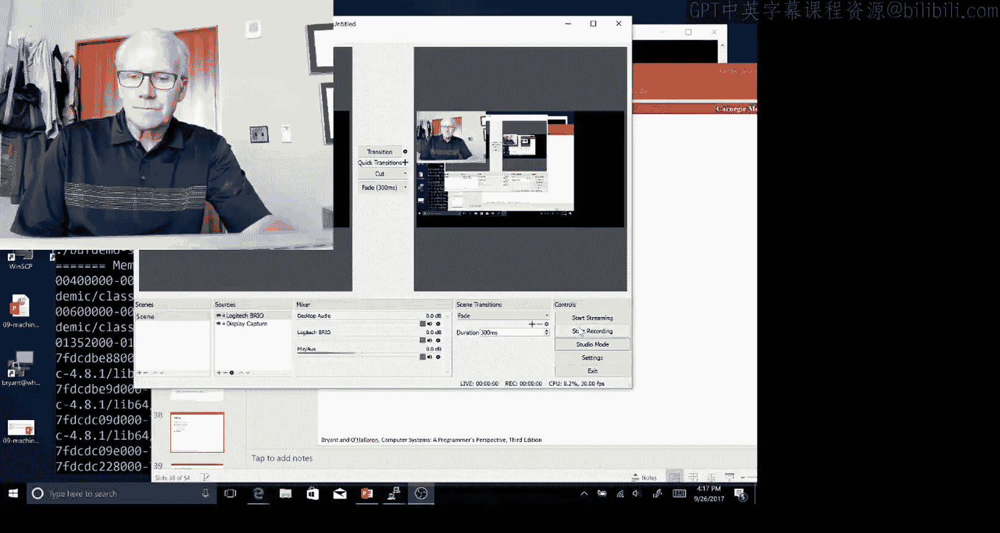
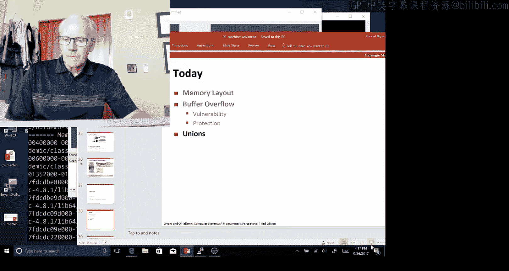
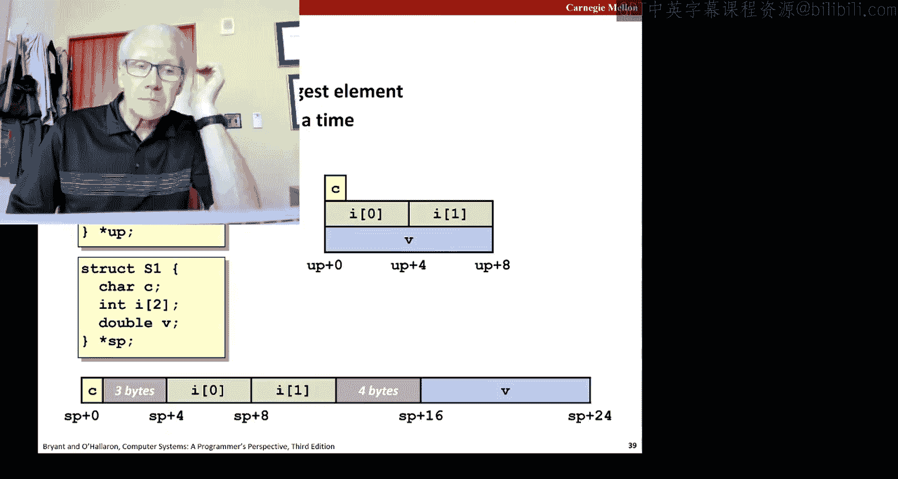
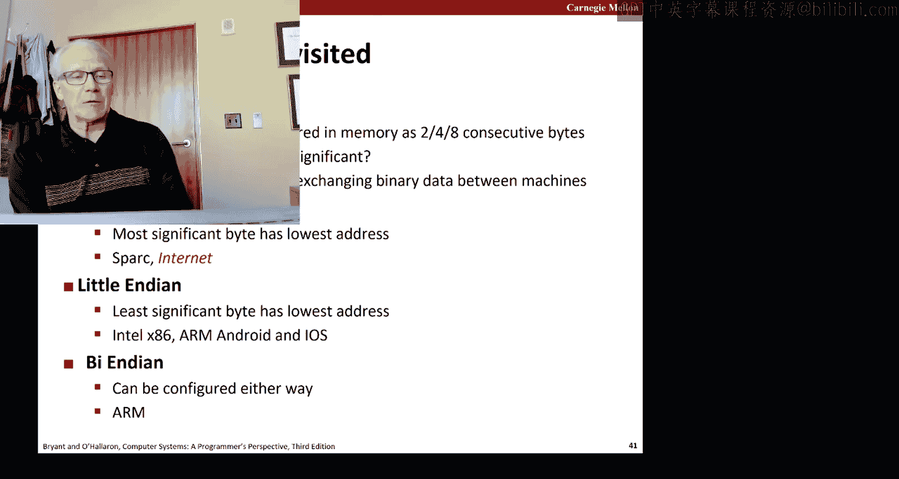
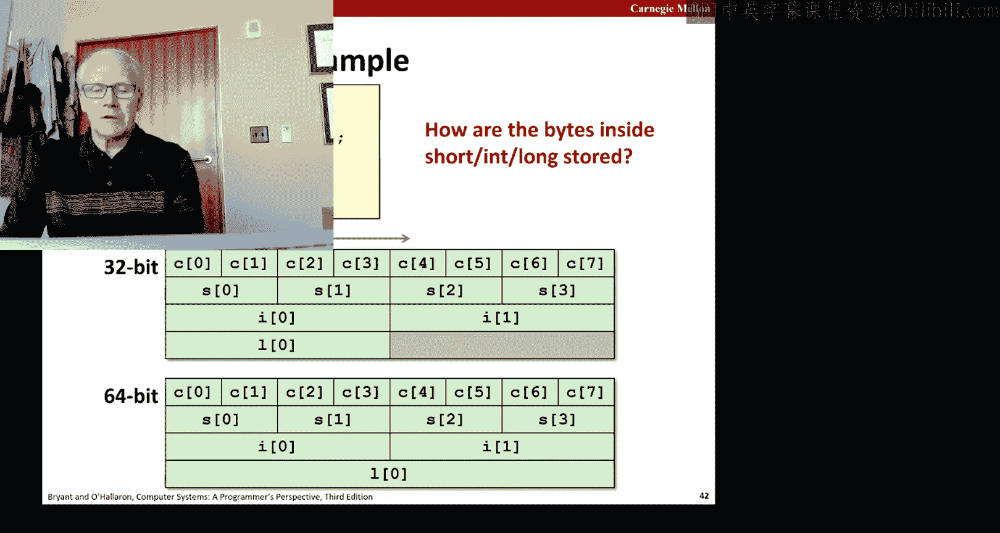
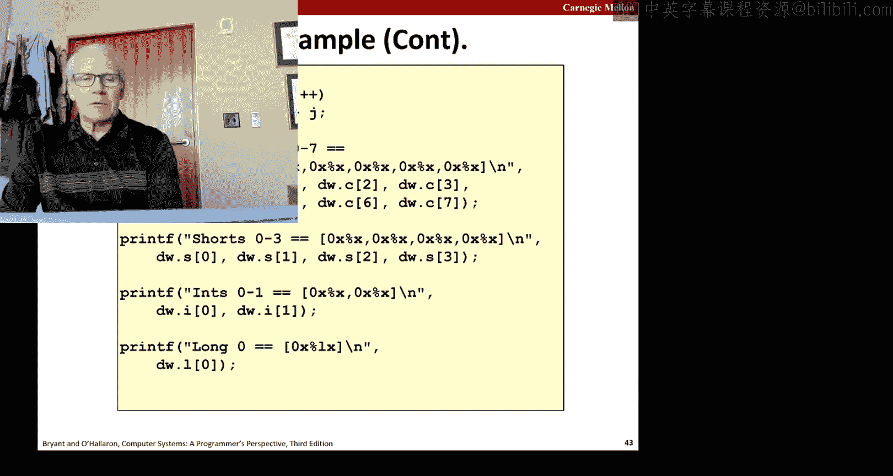
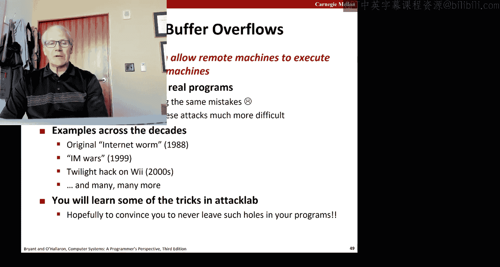
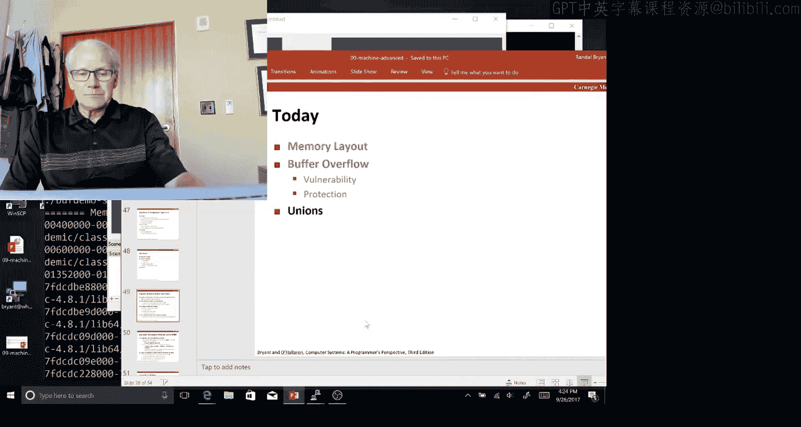

# 10：机器编程高级部分 B





## 概述

在本节课中，我们将要学习C语言中一种特殊的数据聚合方式——联合（union）。我们将了解联合与之前学过的数组和结构体有何不同，探讨其内存布局、使用场景，并通过实例理解其如何揭示字节序等底层概念。

## 联合（Union）的基本概念

上一节我们介绍了结构体，本节中我们来看看联合。在C语言中，有三种聚合数据以形成更大数据结构的方式：**数组**、**结构体**和**联合**。联合的声明语法与结构体非常相似，但其含义却截然不同。

结构体包含一系列字段，程序可以在任意时刻使用所有字段。因此，编译器必须分配足够的内存，并处理填充字节和对齐问题，以确保所有字段都可用。

联合则是一种声明方式，它表示：“在任意时刻，我只想使用这些字段中的一个。它们将分配在内存的同一区域，并且都从相同的地址开始。”每个字段的大小根据其自身类型决定。



因此，可以认为：
*   联合的总大小是其所有字段中**最大**的那个。
*   结构体的总大小是其所有字段的**总和**，加上必要的填充字节。

## 联合的用途

为什么程序需要使用联合？它听起来似乎没什么用。实际上，联合有一些巧妙的用途。

其中之一在数据实验（Data Lab）中已经出现过。回想一下，你编写了处理浮点数的函数，但将数字视为无符号整数，以便操作其各个位，然后神奇地将其转换回浮点数用于测试。实现这一功能的代码就使用了联合。

以下是 `bit2float` 函数的示例，它接收一个无符号数并创建一个具有相同位表示的浮点数：

```c
float bit2float(unsigned u) {
    union {
        unsigned u;
        float f;
    } temp;
    temp.u = u;
    return temp.f;
}
```

这与普通的类型转换不同。它的工作原理是：将一个无符号值写入联合，然后以浮点数的形式读取它。由于两者共享相同的四个字节，我们只是改变了看待这些字节的方式——从无符号整数序列变为浮点数。反向转换同样可以。

## 联合与字节序

使用联合的另一个作用是，它能让我们观察到特定机器使用的**字节序**。我们之前提到过字节序的概念，即对于多字节数据，在内存中如何排序：是**小端序**（最低有效字节在前）还是**大端序**（最高有效字节在前）。



大多数现代机器（如Intel处理器和常见的ARM系统）采用小端序。然而，在互联网传输中，多字节数据通常采用大端序。

当你在联合中使用不同数据类型的字段时，字节序以及不同机器上字长的差异，会影响你写入一个字段后读取另一个字段时，数据模式如何相互作用。



以下是一个示例，展示了不同机器和字节序下，联合行为可能产生的差异：



```c
#include <stdio.h>

int main() {
    union {
        int i;
        char c[sizeof(int)];
    } u;
    u.i = 0x12345678;

    for (int j = 0; j < sizeof(int); j++) {
        printf("%.2x ", u.c[j]);
    }
    printf("\n");
    return 0;
}
```

在小端序机器上，输出可能是 `78 56 34 12`；而在大端序机器上，输出则是 `12 34 56 78`。此外，在32位和64位机器上，`int` 类型的大小可能不同，也会影响结果。

## 复合数据类型的总结

正如所提到的，创建复合数据类型有三种方式：**数组**、**结构体**和**联合**。它们有相似之处，但在其他方面又非常不同。

以下是它们的关键点：
*   所有三种方式都涉及一块**连续的内存区域**。
*   **数组**：创建单一类型的多个副本，允许你使用整数索引访问元素 `i`。
*   **结构体**：创建一系列具有名称的字段，这些字段可以是不同的类型。
*   **联合**：在单一内存区域上**叠加**多个不同的字段，为同一块内存提供不同的解释。

这些类型都可以递归地嵌套。例如，你可以有包含联合的结构体数组，或者包含数组的联合，等等。关键在于理解每个对象都有其**大小**（总字节分配量）和**对齐**要求（起始地址必须是某个2的幂的倍数，以满足其内部所有数据的对齐要求）。

## 安全启示

课程材料中还涉及一些现实生活中的缓冲区溢出攻击示例。虽然这些例子有些过时，但缓冲区溢出至今仍然是一个安全问题。如今，最大的安全漏洞来源可能是社会工程学攻击，但技术层面的缓冲区溢出问题依然存在。业界已做了大量工作使其更难以被利用，但理解其原理仍然非常重要。

## 总结





本节课中，我们一起学习了C语言中的联合。我们了解了联合与结构体在内存布局上的根本区别，探讨了联合在数据类型位级操作和揭示字节序方面的实用价值，并回顾了数组、结构体和联合这三种复合数据类型的特点。理解这些底层概念对于编写安全、高效的代码至关重要。