# 16：输入/输出 (I/O) 🖥️

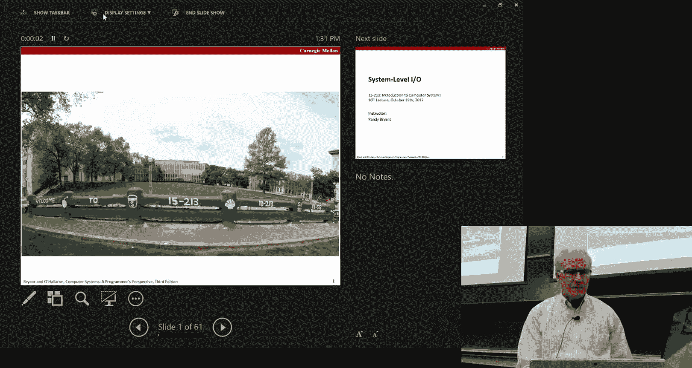


在本节课中，我们将要学习计算机系统中的输入/输出（I/O）机制。我们将从操作系统底层的Unix I/O开始，了解文件描述符、读写操作等核心概念。接着，我们会探讨更常用的标准I/O库，以及它如何通过缓冲机制提高效率。最后，我们将介绍一个专为网络编程设计的可靠I/O（RIO）包。理解这些不同层次的I/O对于后续的Shell实验和期末项目至关重要。

## Unix I/O：底层视角 🔧

Unix系统对文件有一个非常简单的抽象：文件就是一个字节序列。这个“文件”的概念不仅用于存储在磁盘上的数据，也用于I/O设备、网络连接等，为各种资源提供了一个统一的访问框架。

### 核心操作与文件描述符

在Unix I/O层面，对文件的操作非常基础，主要包括打开、关闭、读取和写入。

*   **打开文件 (`open`)**：通过指定文件路径和标志（如只读 `O_RDONLY`）来打开一个文件。成功后会返回一个**文件描述符**，这是一个小的非负整数（如3, 4, 5），作为该打开文件的标识符。每个进程启动时自动拥有三个文件描述符：0（标准输入）、1（标准输出）、2（标准错误）。
*   **关闭文件 (`close`)**：使用完毕的文件描述符需要通过 `close` 系统调用关闭。
*   **读取文件 (`read`)**：从指定的文件描述符读取数据到缓冲区。其函数原型为 `ssize_t read(int fd, void *buf, size_t count)`。它尝试读取最多 `count` 个字节，但实际返回的字节数可能小于请求值，这被称为**短计数**。
*   **写入文件 (`write`)**：将缓冲区的数据写入指定的文件描述符。其函数原型为 `ssize_t write(int fd, const void *buf, size_t count)`。同样，实际写入的字节数也可能小于请求值，发生短计数。

### 短计数的原因

短计数在I/O中很常见，原因包括：
*   **读取时遇到文件结尾 (EOF)**。
*   **从终端读取**时，用户输入的数据量少于请求量。
*   **读写网络套接字**时，数据被分割成网络数据包传输，每次读写可能只处理一个包的数据。

处理短计数通常需要编写循环，确保读取或写入完整的数据量。

### 文件共享与重定向机制

要理解进程如何共享文件以及Shell重定向（如 `>`）的工作原理，需要了解内核维护的三个关键数据结构。

1.  **描述符表**：每个进程独有，表项索引就是文件描述符（如0,1,2），每个表项指向一个**打开文件表**中的条目。
2.  **打开文件表**：系统级表格，所有进程共享。每个表项（又称文件表条目）存储了当前文件的**偏移量**（即读写位置）和**引用计数**（有多少个描述符指向它）。调用 `open` 会创建新的表项。
3.  **v-node表**：系统级表格，每个表项（v-node）存储了文件的元数据（如文件大小、权限、所有者）和指向实际数据块的指针。

**文件共享示例**：当一个进程调用 `fork()` 创建子进程时，子进程会复制父进程的描述符表，从而共享相同的打开文件表条目。这意味着父子进程共享相同的文件偏移量。

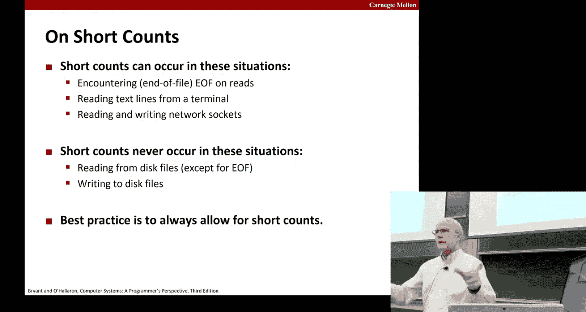

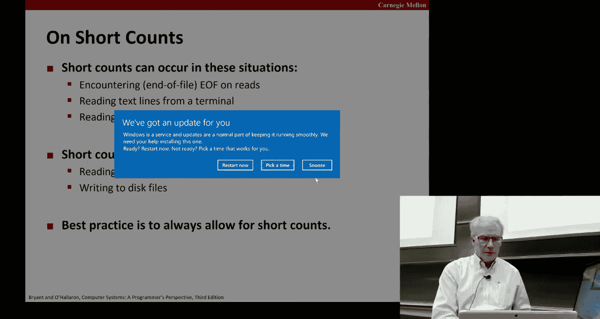

**重定向实现**：Shell使用 `dup2(int oldfd, int newfd)` 系统调用实现重定向。`dup2` 将描述符 `oldfd` 复制到 `newfd`。如果 `newfd` 已经打开，则会先关闭它。复制后，`newfd` 和 `oldfd` 指向同一个打开文件表条目，因此共享文件偏移量。例如，`dup2(fd, 1)` 会将标准输出（文件描述符1）重定向到 `fd` 所代表的文件。

上一节我们介绍了底层的Unix I/O操作和文件共享机制，本节中我们来看看建立在它之上、更为程序员所熟悉的标准I/O库。

## 标准I/O：缓冲与流 📚

标准I/O库（如 `printf`, `scanf`）为文件操作提供了更高级、更方便的接口。它将打开的文件抽象为**流**，并引入了**缓冲**机制来减少昂贵的系统调用次数。

### 缓冲机制

标准I/O在用户空间维护一个缓冲区。例如：
*   **输出时**：多次调用 `printf` 写入的字符可能先被累积在缓冲区里，直到缓冲区满、遇到换行符或显式调用 `fflush` 时，才通过一次 `write` 系统调用将整个缓冲区内容写入内核。
*   **输入时**：使用 `fgets` 或 `getchar` 读取时，库可能会一次性从内核读入一大块数据到缓冲区，然后从缓冲区中逐字符或逐行提供给程序。

这种缓冲大大提升了连续读写小量数据的效率。

### 局限性

然而，标准I/O也有其局限性：
*   **非异步信号安全**：在信号处理函数中调用 `printf` 等标准I/O函数可能导致程序死锁或数据损坏。
*   **不适用于网络套接字**：标准I/O的缓冲机制与网络套接字的特性（如短计数、双向数据流）不匹配，可能导致难以调试的问题。

我们已经了解了用于常规文件操作的标准I/O，接下来我们将探讨一个专门为网络编程等场景设计的I/O包——RIO。

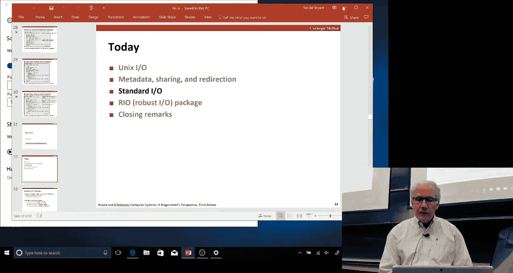

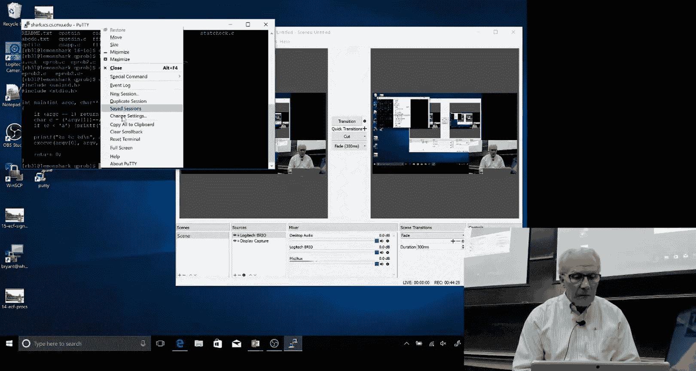

## 可靠I/O (RIO) ⚙️

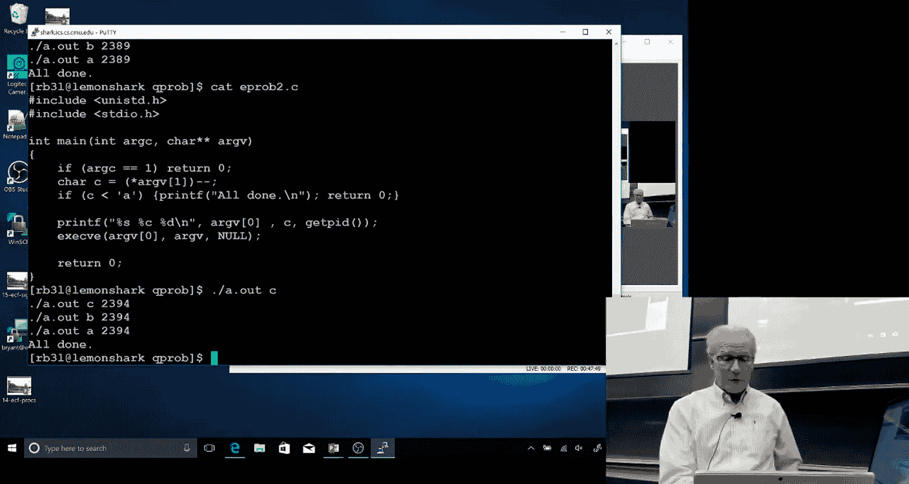

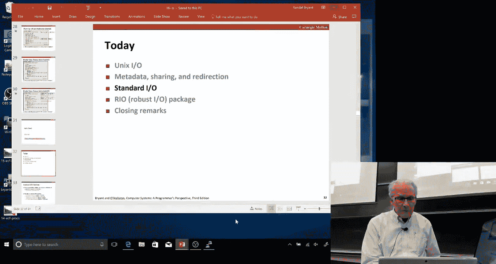


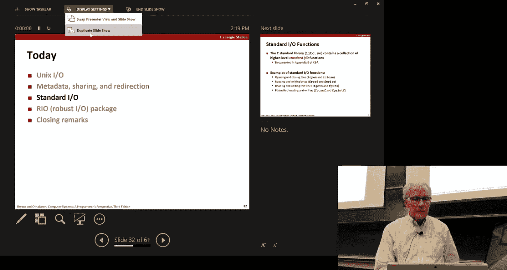

RIO（Robust I/O）是教材中提供的一个包，它在Unix I/O的基础上增加了便捷性和健壮性，特别适合网络套接字编程。它提供两类函数：
*   **无缓冲的RIO函数**：用于直接读写数据。
*   **带缓冲的RIO函数**：用于高效地读取文本行。

### RIO的核心函数

*   **`rio_readn` 和 `rio_writen`**：这两个是无缓冲函数。
    *   `rio_readn` 会在遇到短计数时自动循环读取，直到读满指定的字节数或遇到EOF。这简化了网络读取的代码。
    *   `rio_writen` 会循环写入，确保写完所有请求的字节，不会出现短计数。
*   **`rio_readlineb` 和 `rio_readnb`**：这两个是带缓冲的函数，使用同一个 `rio_t` 缓冲区结构体。
    *   `rio_readlineb` 从缓冲区中读取一个文本行（以换行符结束）。
    *   `rio_readnb` 从缓冲区中读取指定字节数的原始数据。

带缓冲的RIO函数在内部维护一个缓冲区，`rio_readlineb` 和 `rio_readnb` 可以安全地混合调用，因为它们共享同一个缓冲区状态。

### 为何使用RIO？

在期末的代理服务器项目中，你将处理HTTP协议，需要读取请求行和头部（文本行），以及可能的消息体（二进制数据，如图片）。RIO的 `rio_readlineb` 和 `rio_readnb` 完美契合这种需求。**切记**：不要使用 `strcpy`, `strlen` 等字符串函数处理二进制数据，因为它们会在遇到空字节（`\0`）时停止，而二进制数据中完全可能包含空字节。

## 信号处理补遗：安全地等待子进程 🚦

现在，让我们回到上节课未完成的信号话题，补充一个关键细节：如何安全地等待子进程结束。

在Shell中，对于后台作业，父进程不能调用 `wait` 阻塞等待，否则Shell就无法响应新的命令。解决方案是为 `SIGCHLD` 信号安装处理函数，在子进程终止时异步回收。

一个简单的处理函数如下：
```c
void sigchld_handler(int sig) {
    int olderrno = errno;
    pid_t pid;
    while ((pid = waitpid(-1, NULL, 0)) > 0) {
        // 回收子进程
        printf("Handler reaped child %d\n", (int)pid);
    }
    if (errno != ECHILD) {
        // 处理错误
        perror("waitpid error");
    }
    errno = olderrno;
}
```
注意这里使用 `while` 循环而非 `if`，是因为信号不会排队，多个子进程同时结束可能只产生一个 `SIGCHLD` 信号，需要循环 `waitpid` 回收所有已终止的子进程。

有时，主程序需要等待一个特定的子进程结束。一种**错误**的方法是先检查子进程状态，然后调用 `pause()` 等待信号。这存在**竞争条件**：检查后、`pause` 前，信号可能已经到达并处理完毕，导致 `pause` 永远阻塞。

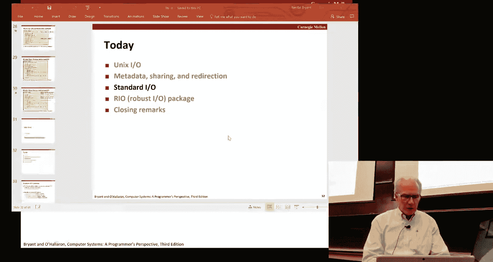

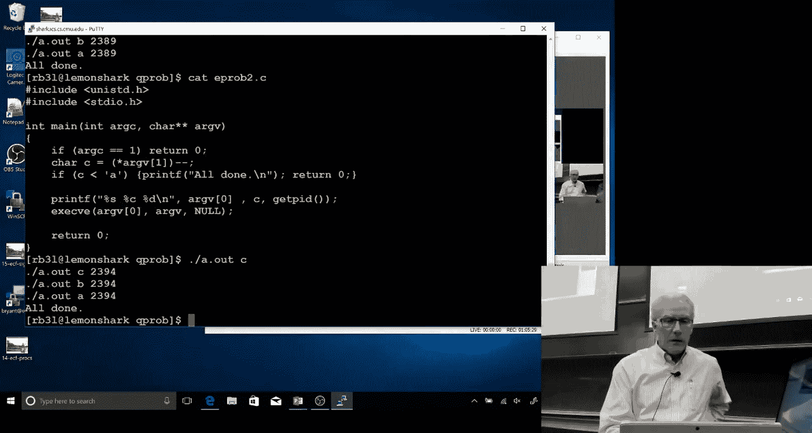

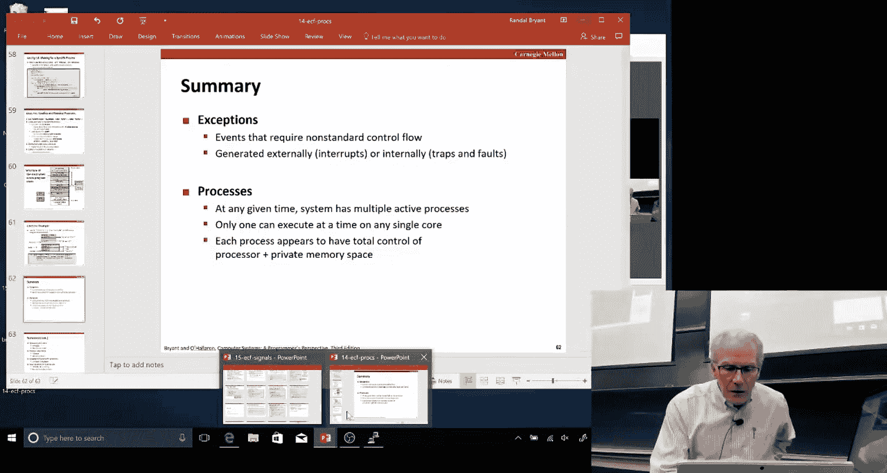

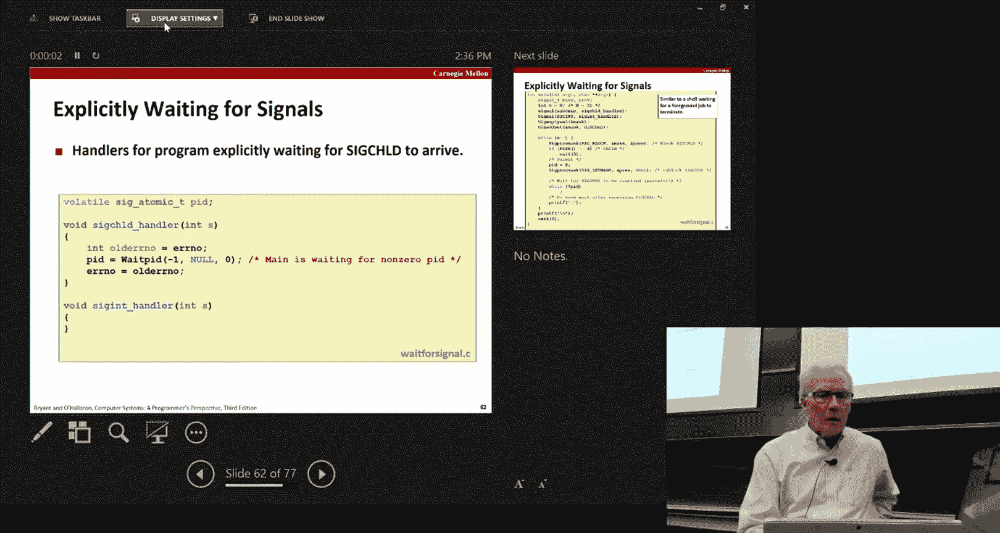


正确的做法是使用 `sigsuspend` 原子性地完成“解除信号阻塞”和“挂起进程等待信号”这两个操作：
```c
sigset_t mask, prev_mask;
Sigemptyset(&mask);
Sigaddset(&mask, SIGCHLD);

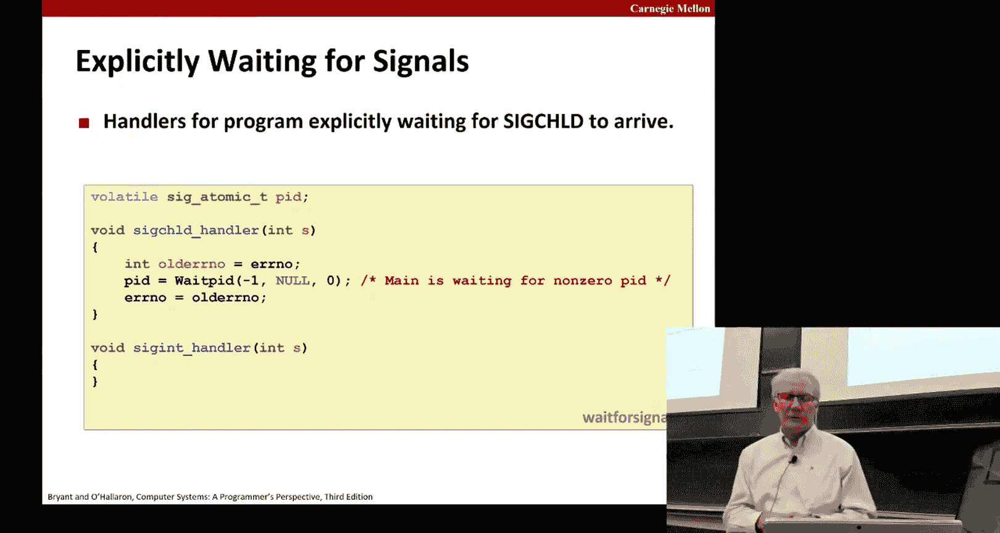

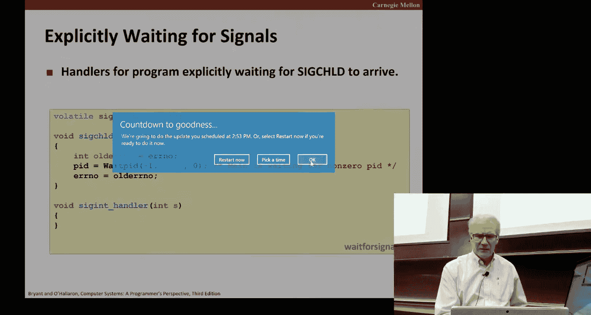

// 阻塞SIGCHLD，防止信号在处理前到达
Sigprocmask(SIG_BLOCK, &mask, &prev_mask);

// 创建子进程...

// 等待特定子进程结束
while (pid != 0) { // pid是子进程ID，回收后会被处理函数设为0
    // 临时恢复原来的信号掩码（即解除对SIGCHLD的阻塞），并挂起
    // 这是一个原子操作，消除了竞争条件
    sigsuspend(&prev_mask);
}
// 恢复原来的阻塞信号集
Sigprocmask(SIG_SETMASK, &prev_mask, NULL);
```

## 总结 📝

本节课中我们一起学习了计算机系统中I/O的多个层次。
1.  我们从最底层的**Unix I/O**开始，理解了文件描述符、打开文件表、v-node等核心概念，以及文件共享和重定向的实现原理。
2.  接着，我们探讨了**标准I/O库**，了解了其缓冲机制如何提升效率，同时也认识了它的局限性（如不适用于信号处理和网络编程）。
3.  然后，我们介绍了专为健壮性设计的**RIO包**，它提供了方便的网络读写和行读取功能，是期末项目的重要工具。
4.  最后，我们补充了上节课关于信号的知识，学习了如何使用 `sigsuspend` 安全地等待子进程，避免竞争条件。

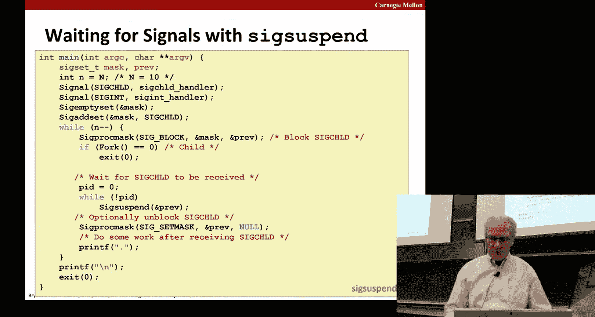

理解这些不同I/O接口的适用场景和底层机制，对于编写正确、高效的系统程序至关重要。