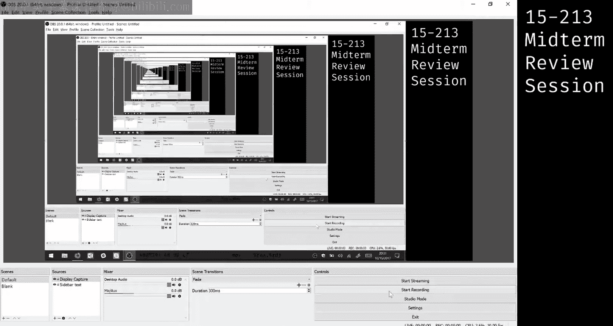
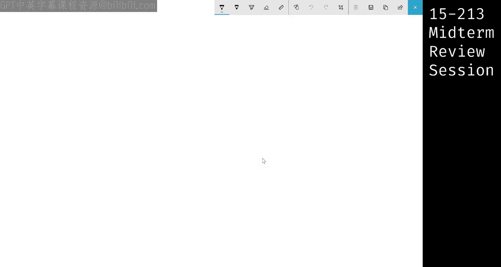
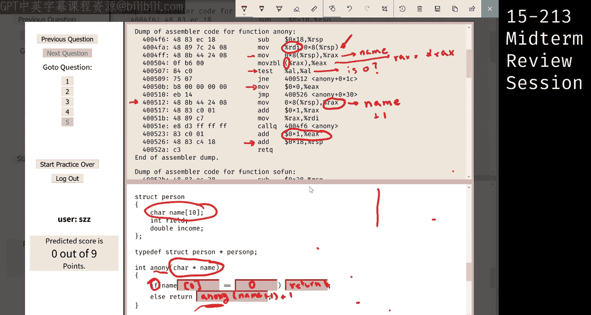
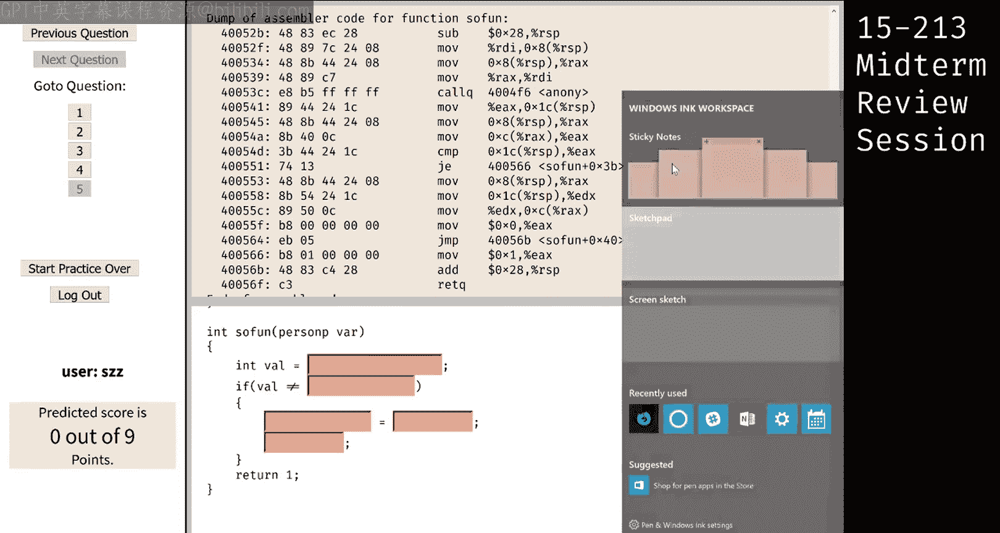
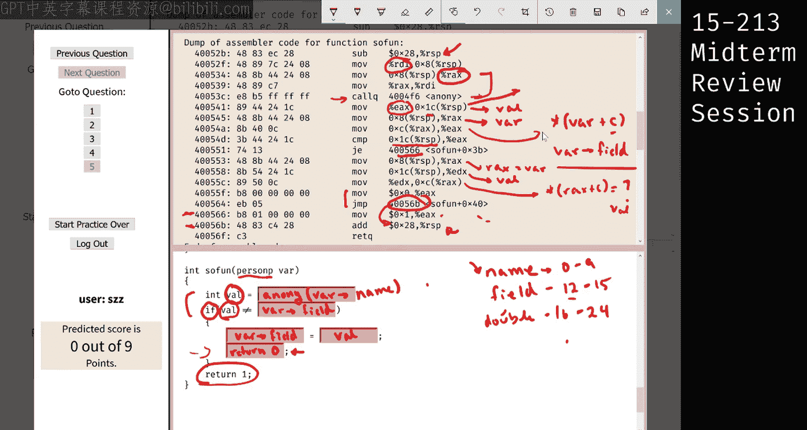

# 19：从汇编代码反推C语言结构体与递归函数 🧩

在本节课中，我们将学习如何分析一段给定的汇编代码，并从中反推出原始的C语言代码结构。我们将重点关注一个涉及结构体和递归函数的例子，通过逐步解析汇编指令来理解其对应的C语言逻辑。

## 概述

我们将分析一段汇编代码，它对应着两个C语言函数。第一个函数 `anony` 处理一个字符数组（字符串），第二个函数 `sofun` 处理一个结构体。我们的目标是理解汇编指令如何映射到高级语言的控制流、数据访问和函数调用。

---

上一节我们介绍了分析汇编代码的基本目标，本节中我们来看看具体的代码片段。

首先，我们忽略屏幕上大量的汇编代码，直接查看对应的C代码片段。我们看到这里定义了一个结构体（`struct`）。

结构体的存在意味着代码中很可能涉及内存访问操作。因此，在汇编代码中，我们应该预期会看到基于某个变量或指针的偏移量寻址。此外，代码中还有两个函数，它们很可能是相互关联的，否则不会出现在同一个问题部分。

我们预期会看到一个函数调用另一个函数，或者函数递归调用自身。

现在，让我们回到汇编代码部分。

在考试环境中，界面通常支持分屏功能，以便同时查看汇编代码和C代码。

---

上一节我们提到了两个函数，现在我们来具体分析第一个函数 `anony`。

我们首先看到函数有一个输入变量。根据x86-64调用约定，第一个整数或指针参数通过寄存器 `RDI` 传递。

在汇编代码中，我们第一次看到 `RDI` 的使用是在一条 `mov` 指令中，它将 `RDI` 的值移到了栈上的某个位置。我们无需关心具体原因，只需知道这个操作存在。紧接着的下一条指令，又将其从栈中取出，放入了寄存器 `RAX`。

现在，`RDI` 和 `RAX` 都指向同一个输入，我们称之为 `name`。

查看C代码，我们看到一个 `if` 语句。在汇编中，`if` 语句通常对应一个比较操作。在这个函数里，我们看到了 `test` 指令。

`test` 指令将其两个操作数进行按位与运算，并根据结果设置条件码（特别是零标志位ZF）。随后的 `jne`（跳转如果不相等）指令会检查零标志位。因此，`test` 指令在这里的作用是检查操作数是否为零。

`test` 指令的操作数是 `AL`。`AL` 是 `RAX` 寄存器的低8位字节。那么 `RAX` 里面是什么呢？

向上看汇编代码，最初输入 `n`（即 `name`）被放入了 `RAX`。然后有一条指令 `mov eax, (rax)`。这里的括号意味着解引用操作，相当于C语言中的 `*rax`。

我们知道 `RAX` 是一个指向 `name` 字符数组的指针。解引用这个指针，我们得到的是数组的第一个字符（即 `name[0]`）。所以，`test al, al` 实际上是在检查 `name[0]` 是否等于零（即字符串结束符 `\0`）。

如果 `name[0] == ‘\0’`（零标志位被设置），则 `jne` 跳转不会发生，程序顺序执行下一条 `mov eax, 0` 指令，然后跳转到函数末尾（地址 `0x400526`），返回0。

如果 `name[0] != ‘\0’`（零标志位未被设置），则 `jne` 跳转发生，程序跳转到地址 `0x400512` 继续执行。

---

上一节我们分析了 `if` 语句的跳转逻辑，本节中我们来看看 `else` 分支（即递归调用部分）的代码。

如果跳转发生（即 `name[0] != ‘\0’`），程序会执行以下操作：
1.  将 `name` 的地址（存储在 `RAX` 中）加1，得到 `name+1`。
2.  将结果（`name+1`）作为参数，通过 `RDI` 寄存器，递归调用函数 `anony`。
3.  函数调用返回后，返回值在 `RAX` 中。代码执行 `add eax, 1`，将返回值加1。
4.  这个加1后的结果，又作为当前函数的返回值。

因此，`anony` 函数的C代码逻辑可以推断为：如果字符串首字符是结束符，则返回0；否则，返回 `1 + anony(name+1)`。这实际上是在计算字符串的长度。

**核心概念：指针运算**
当一个指针指向字符数组（字符串）时，对指针加1（`ptr + 1`）意味着指向数组中的下一个元素。因为指针运算会根据指向类型的大小进行缩放，对于 `char*` 类型，加1就是前进一个字节。

---

上一节我们完成了第一个函数的分析，本节中我们来看第二个函数 `sofun`。

函数开头，我们看到输入参数（通过 `RDI` 传入）被存放到栈上，然后又移入 `RAX`。所以 `RAX` 现在保存了输入变量，我们称之为 `var`，其类型是 `person*`（指向结构体的指针）。

接下来，代码直接调用了函数 `anony`。那么传递给 `anony` 的参数是什么呢？是 `var` 本身。

`anony` 函数期望一个 `char*`（字符指针）类型的参数。而我们传递的 `var` 是一个 `person*` 类型。这之所以可行，是因为在C语言中，一个结构体指针的值，等于其第一个成员的内存地址。根据之前的结构体定义，第一个成员是 `name` 字符数组。因此，`anony(var)` 等价于 `anony(var->name)`。

调用 `anony` 后，返回值存储在变量 `val` 中（对应汇编中 `RSP+0x1c` 的位置）。

然后，代码执行 `mov eax, (rax+0xc)`。这里的 `0xc` 是十进制12，是结构体中 `field` 成员相对于结构体起始地址的偏移量。所以这条指令是在访问 `var->field`。

接着，代码比较 `val`（即 `anony(var->name)` 的返回值）和 `var->field` 的值。

如果两者相等（`je` 跳转），程序跳转到地址 `0x400566`，执行 `mov eax, 1`，然后返回1。

如果不相等，程序继续执行，将 `val` 的值赋给 `var->field`（即 `var->field = val`），然后返回0。

因此，`sofun` 函数的逻辑是：计算 `var->name` 的长度，如果长度等于 `var->field` 的当前值，则返回1；否则，将 `var->field` 设置为该长度值，并返回0。

---

## 总结

本节课中我们一起学习了如何系统地分析汇编代码以反推C语言程序。
1.  **定位输入与调用约定**：首先确定函数参数传入的寄存器（如 `RDI`）。
2.  **理解内存访问**：结构体访问体现为基址加偏移量的寻址模式（如 `(rax+0xc)`）。
3.  **解析控制流**：`if/else` 语句通常对应 `test/cmp` 指令后跟条件跳转指令（如 `je`, `jne`）。
4.  **识别函数调用**：`call` 指令对应函数调用，需注意参数传递和返回值（通常在 `RAX` 中）。
5.  **翻译指针运算**：对指针的加减运算（如 `name+1`）对应汇编中的地址计算，需考虑类型大小。

通过将大段汇编分解为对应高级语言概念的独立小块，我们可以逐步重建出完整的C代码逻辑。这种方法在面对复杂的逆向工程或调试任务时非常有效。