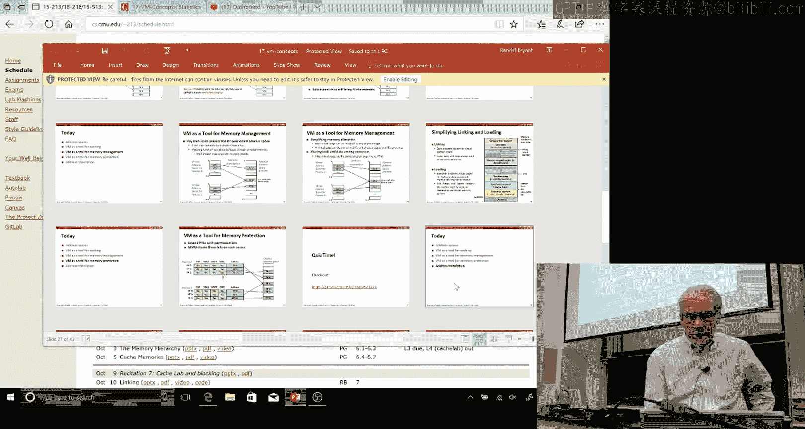
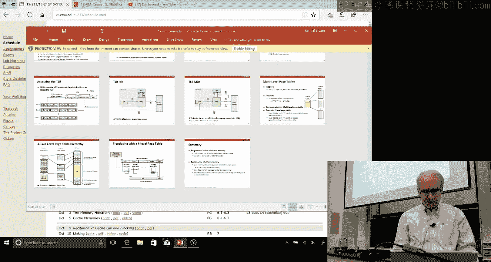

# 21：虚拟内存概念

在本节课中，我们将要学习虚拟内存的基本概念。虚拟内存是现代计算机系统中的一项核心技术，它通过硬件和操作系统的协同工作，为每个进程提供了独立且巨大的地址空间，同时管理着有限的物理内存资源。我们将探讨其作为缓存、内存管理和保护机制的多重角色。

上一节我们介绍了缓存和内存层次结构，本节中我们来看看虚拟内存如何扩展这些概念，为程序提供更大的“虚拟”地址空间。

## 虚拟内存的基本思想

在任何时刻，一台计算机都可能运行着许多进程，可能超过50个，包括监控网络流量、支持打印机和各种后台任务的守护进程，以及你正在运行的应用程序。每个进程都拥有一个独立的、范围非常大的地址空间映像。每个进程都认为自己拥有一个地址范围，但它们实际上都在共享计算机的物理内存，并且不会相互干扰或破坏对方的数据。这就是虚拟内存背后的思想：它给你一种**虚拟**的错觉，让你感觉可以访问比计算机实际物理内存更多的内存，并且你的内存与正在运行的其他进程的内存是独立的。

虚拟内存实际上涉及一系列复杂的问题，它是一个庞大的主题，跨越了系统的多个层次。处理器内置了对虚拟内存的硬件支持，而操作系统内核则负责管理其大部分功能。因此，虚拟内存是硬件和软件集成的典型例子。

## 虚拟内存的多重角色

虚拟内存是一个强大的概念，它支持多种不同的能力。

以下是虚拟内存扮演的三个主要角色：

1.  **作为缓存**：你可以将虚拟内存视为一种缓存，它使用DRAM（动态随机存取存储器）来缓存程序的实际数据，这些数据可能存储在磁盘上。典型的计算机可能有几GB到几十GB的DRAM，但虚拟地址空间（例如48位地址）可以寻址约256TB，远大于物理内存。因此，虚拟内存是一种利用DRAM缓存磁盘数据的方式。
2.  **内存管理**：它提供了一种管理方案，使得多个独立的进程可以拥有各自独立的虚拟地址空间。
3.  **提供保护**：例如，在你的进程地址空间中，栈的上方存储着各种内核数据结构。如果你试图访问它们，将会引发保护违规（如段错误），因为你无权读取（例如潜在的加密信息）或写入这些数据。操作系统内核为你管理这些受保护的页面。

## 地址空间与地址翻译

最基本的想法很简单。在一个非常原始的计算机中（现在几乎找不到了），使用的是**物理寻址**，即程序生成的地址直接就是物理内存（实际的DRAM）的索引。而**虚拟寻址**则不同，在虚拟地址和物理地址之间存在一个翻译过程，这是一种间接关系。

我们假设地址是字节的整数范围。设有 **N** 个不同的虚拟地址和 **M** 个不同的物理地址，通常 **N** 远大于 **M**。例如，48位虚拟地址空间对应约256TB，而32GB物理内存对应约35位地址。

虚拟内存的逻辑是将内存划分为**页**。页是由一定数量的字节组成的块，通常是2的幂次方。典型的页大小是4KB（4096字节，即2^12字节）。在任何时候，只有虚拟地址范围中页的一个子集会驻留在物理内存中，其他页可能根本不存在，或者存储在磁盘上。

因此，我们有**虚拟页**（VP）和**物理页**（PP）。虚拟地址空间被划分为一个个4KB的框，物理页则是虚拟页的一个子集。

## 页表

跟踪虚拟页和物理页之间映射关系的是**页表**。页表是一组条目，对应程序可能引用的每个虚拟页。每个页表条目（PTE）包含各种标志位，最基本的是**有效位**（指示该页是否在物理内存中）。如果有效，条目中还包含**物理页号**（PPN）。对于无效的页，可能有一个空指针，或者一个指向磁盘上该页位置的引用。

当程序引用某个内存字时，内存管理单元（MMU）会查找该虚拟地址对应的页表条目。如果该页在内存中，称为**命中**。如果不在内存中，则发生**页错误**，这会触发一个异常，中断正在运行的程序并调用操作系统。

操作系统随后会（假设物理内存已满）选择一个页进行**驱逐**（写回磁盘），然后将所需的页从磁盘读入内存，更新页表，最后返回到原程序并重新执行那条引发页错误的指令。这有时被称为**按需调页**。

## 局部性与工作集原理

虚拟内存之所以有效，与缓存一样，依赖于**局部性**原理：程序在任何给定时间倾向于只访问相对较小的内存区域。这被称为**工作集原理**：在任何时刻，你的程序都有一组正在活跃使用的内存页（工作集）。只要工作集的大小不超过计算机的物理内存，虚拟内存就能良好工作。如果程序频繁访问大范围地址，导致工作集过大，就会发生**颠簸**：系统花费大量时间在磁盘和内存之间交换页面，性能急剧下降。

## 内存管理与共享

虚拟内存的间接映射使得内存管理变得灵活。不同的进程可以有不同的映射关系，甚至可以共享页面。例如，共享库（如C标准库）的代码可以被多个进程共享，而不是每个进程都保存一份副本，这节省了内存。

另一个巧妙的技巧体现在 `fork` 系统调用中。`fork` 创建子进程时，并不会立即复制父进程的所有内存页，而是让父子进程共享这些页，并将它们标记为**只读**。只有当其中一个进程试图写入共享页时，才会触发一个保护异常，此时操作系统才会真正复制该页（**写时复制**），从而让两个进程拥有独立的副本。这既高效又节省内存。

## 地址翻译详解

现在让我们更详细地看看地址翻译过程。我们已经引入了数字 **N**（虚拟地址位数）、**M**（物理地址位数）和 **P**（页内偏移位数，页大小为 2^P 字节，如 4KB 页对应 P=12）。

我们将虚拟地址拆分为两部分：较低的 **P** 位称为**虚拟页偏移量**（VPO），较高的位称为**虚拟页号**（VPN）。物理地址同样拆分：较低的 **P** 位是**物理页偏移量**（PPO），它与 VPO 完全相同；较高的位是**物理页号**（PPN）。

因此，地址翻译的核心是将 **VPN** 映射到 **PPN**。页表条目就存储着这个 PPN。

基本的翻译流程如下：
1.  CPU 发出一个虚拟地址（VA）用于读/写。
2.  内存管理单元（MMU）根据 VA 中的 VPN 生成页表条目地址（PTEA）。可以想象页表是一个数组，VPN 就是索引。
3.  MMU 从内存（或缓存）中读取该 PTE。
4.  如果 PTE 有效，则将其中的 PPN 与原始的 VPO（即 PPO）组合，形成物理地址（PA）。
5.  使用这个 PA 去访问实际的内存数据。

在这个过程中，即使一切顺利（页表命中且所需数据在内存中），一次内存访问也需要**两次**内存读取：一次读 PTE，一次读实际数据。这听起来性能代价很高，页错误则代价更大。

## 加速翻译：TLB

为了解决每次内存访问都需要额外查询页表的问题，系统引入了**翻译后备缓冲器**。TLB 是 MMU 中一个小的硬件缓存，专门用于缓存最近使用过的页表条目（VPN -> PPN 的映射）。

TLB 的工作方式与硬件缓存类似。虚拟页号（VPN）被进一步拆分为**TLB索引**和**TLB标记**。当需要翻译地址时：
1.  MMU 首先用 VPN 查询 TLB。
2.  如果 TLB 命中，则立刻获得 PPN，无需访问内存中的页表。
3.  如果 TLB 不命中，则执行上述完整的页表查询流程，并将结果存入 TLB 以备后用。

TLB 的命中率通常非常高，因此它有效地隐藏了页表访问的开销。TLB 不命中可以由硬件处理，只要目标页在内存中，开销相对较小。

## 多级页表

对于巨大的地址空间（如 48 位），单一的线性页表会非常庞大（可能达到数百 GB），这不切实际。解决方案是使用**多级页表**。

多级页表将页表本身也分页，并组织成树状结构。例如，一个两级页表：
*   **第一级页表**：常驻内存。每个条目指向一个第二级页表页（或者为空，表示该地址范围未使用）。
*   **第二级页表**：可以像普通数据页一样被换入换出磁盘。每个条目指向实际的物理页。

虚拟地址被分成多个字段，每个字段作为索引进入相应级别的页表。这种结构的优点是，对于地址空间中大片未使用的区域，对应的第二级页表根本不需要分配，节省了大量空间。典型的 x86-64 系统使用四级页表来管理 48 位地址空间。

## 对程序员的透明性

作为应用程序员，你大部分时候无需关心虚拟内存的具体实现。虚拟内存为你提供了一个整洁的抽象：每个进程拥有独立的、受保护的、看似无限大的地址空间。操作系统和硬件协同工作，处理所有复杂的映射、缓存和换页细节。这种透明性使得编程更加简单和安全，避免了进程间的意外干扰。

本节课中我们一起学习了虚拟内存的核心概念。我们了解到虚拟内存通过页表机制将虚拟地址翻译为物理地址，它不仅作为物理内存的缓存，还负责进程间的内存隔离与保护，并支持共享内存等高级功能。TLB 和多级页表等优化技术使得这一强大抽象在实践中的性能开销变得可以接受。虚拟内存是现代计算系统不可或缺的基石。