# 28：并发编程 🧵


在本节课中，我们将要学习并发编程的核心概念。并发编程允许计算机同时处理多个任务，这在多核处理器和需要响应异步事件（如网络、传感器输入）的现代系统中至关重要。然而，编写正确的并发程序颇具挑战性，因为需要考虑事件发生的顺序、资源共享以及避免各种并发错误。

## 并发编程的挑战与概念

上一节我们介绍了并发编程的重要性，本节中我们来看看并发编程中常见的几种问题和核心概念。

### 竞争条件

竞争条件是指当两个或多个实体试图同时使用同一资源时，如果没有妥善处理，可能导致程序行为出错。这就像两辆车争抢同一个停车位。

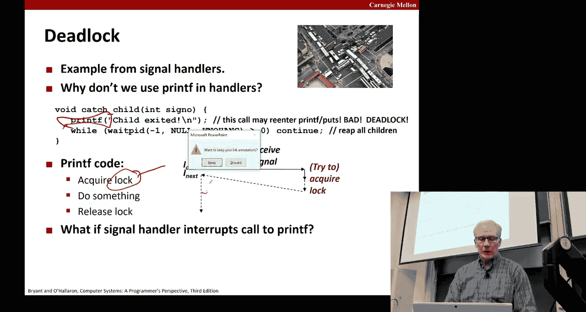

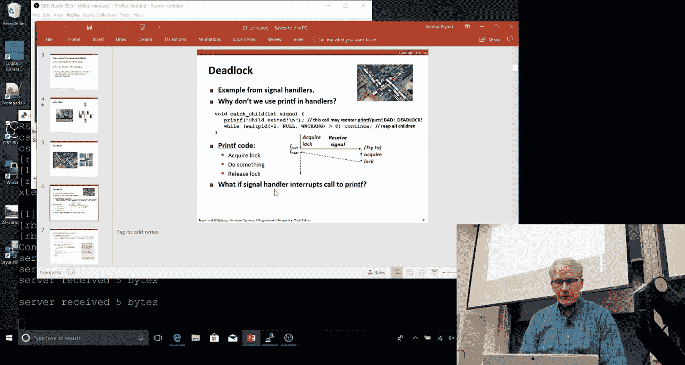


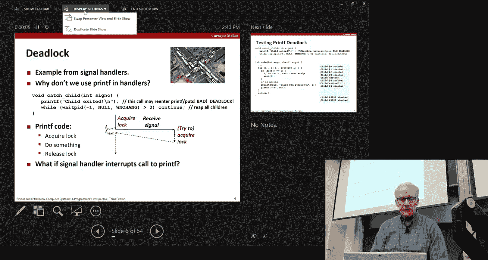

### 死锁

死锁是指两个或多个执行单元互相等待对方释放资源，导致所有单元都无法继续执行。一个典型的例子是十字路口的交通堵塞：每辆车都占用了另一辆车需要的道路空间，形成了一个循环依赖。

### 饥饿

饥饿是指某个执行单元因为优先级较低或资源分配策略问题，长时间无法获得所需资源，从而无法取得进展。例如，一条繁忙的主干道让支路上的车辆永远无法通过。

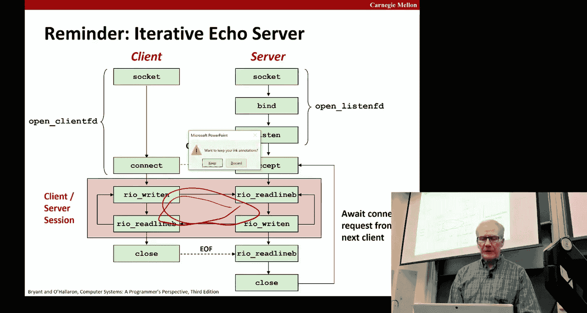

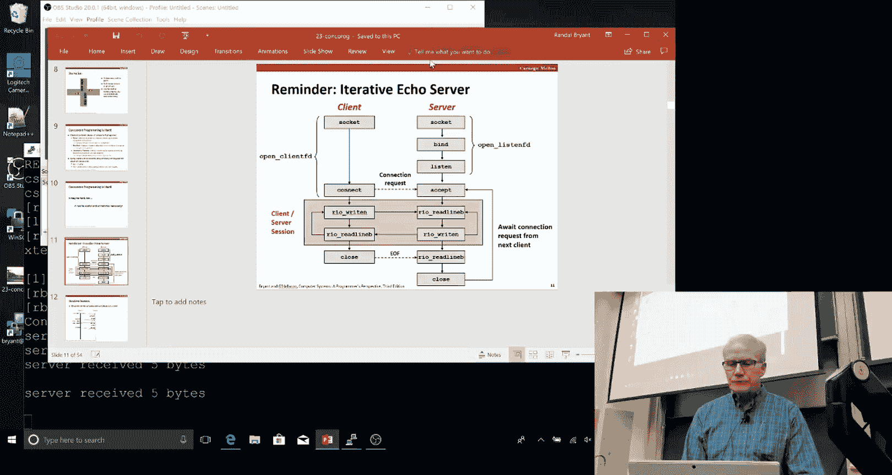

## 信号处理程序与 `printf` 的陷阱

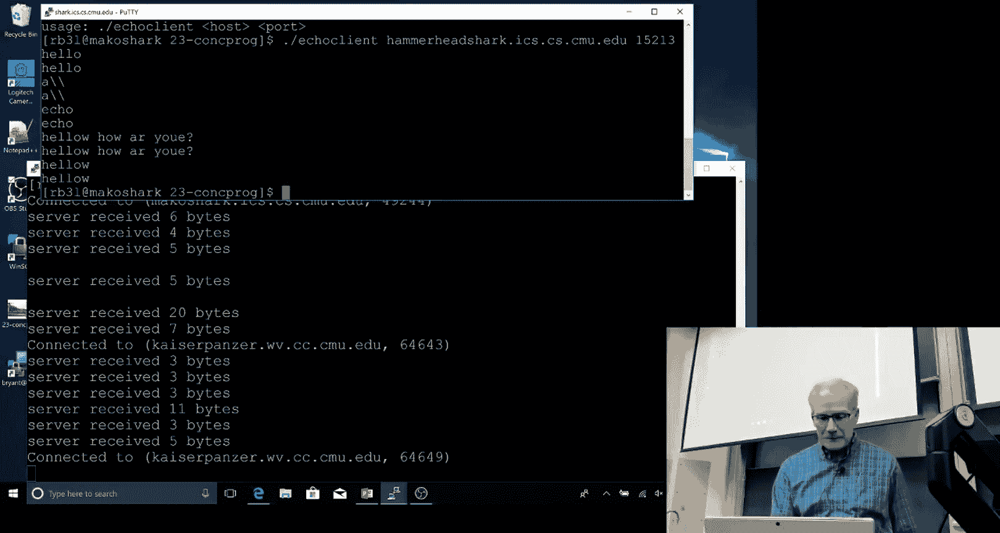

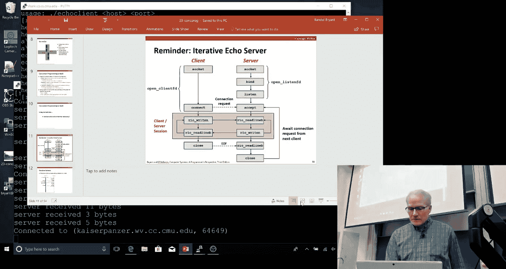

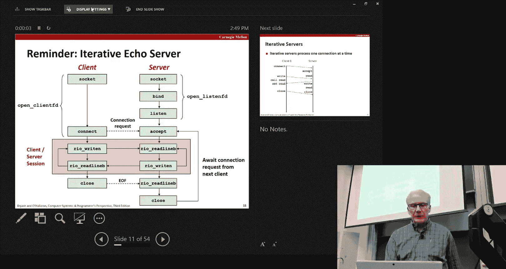


在信号处理程序中使用 `printf` 等标准I/O函数是危险的，这可能导致死锁。原因在于 `printf` 内部使用了锁来保护其共享的全局状态（例如时区管理相关的变量）。

当主程序调用 `printf` 并获取了内部锁之后，如果此时一个信号到达并触发了信号处理程序，而该处理程序也调用了 `printf`，那么它会尝试获取同一个锁。由于锁被主程序持有，信号处理程序会等待。而主程序又需要等待信号处理程序返回后才能释放锁，这就形成了一个死锁。

虽然这种死锁在测试中可能很少出现，但在高频率发送信号的极端情况下，几乎必然会发生。因此，在信号处理程序中应避免使用非异步信号安全的函数，如 `printf`。

**解决方案**：一种可行的方法是在每次调用 `printf` 前后阻塞和恢复信号，但这需要在代码中所有调用 `printf` 的地方都进行此操作，而不仅仅是在信号处理程序中。

## 迭代服务器的局限性

我们之前实现的迭代式回声服务器有一个明显的缺点：它一次只能处理一个客户端连接。当第一个客户端连接并通信时，其他客户端只能等待，直到当前连接关闭。

以下是其工作流程的简化描述：
1.  服务器在监听套接字上等待连接。
2.  客户端A发起连接，服务器接受并建立连接。
3.  服务器进入循环，处理客户端A的请求并回显。
4.  在此期间，客户端B发起连接。虽然 `connect` 调用可能返回，但其后续的 `write` 或 `read` 调用会被阻塞，因为服务器正在忙于处理客户端A。
5.  只有等到客户端A断开连接，服务器才会回到 `accept` 调用，接受客户端B的连接。

这种模型无法满足需要同时服务大量客户端的现实需求（例如谷歌服务器）。

## 实现并发服务器

为了解决迭代服务器的局限性，我们需要实现并发服务器。主要有三种方法：基于进程、基于事件和基于线程。

### 1. 基于进程的并发服务器

这种方法为每个新客户端连接创建一个新的子进程。主服务器进程只负责接受连接和创建子进程，子进程则负责处理具体的客户端通信。

**关键细节**：
*   **文件描述符管理**：`fork()` 会复制所有打开的文件描述符。因此，父进程必须关闭已交给子进程处理的连接描述符，子进程也必须关闭不需要的监听描述符，以防止文件描述符泄漏。
*   **回收子进程**：服务器必须设置 `SIGCHLD` 信号处理程序，并使用 `waitpid` 来回收已终止的子进程，避免产生大量僵尸进程。

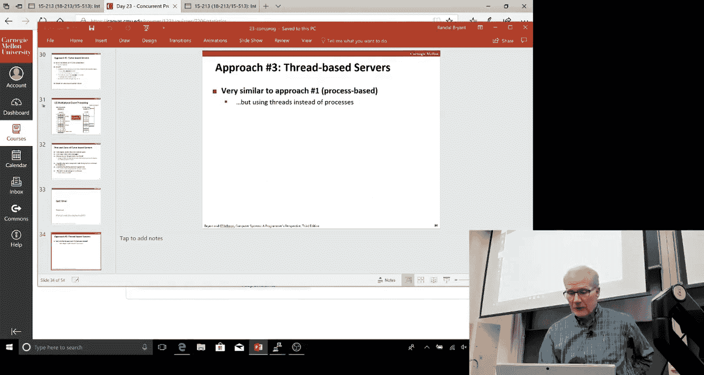

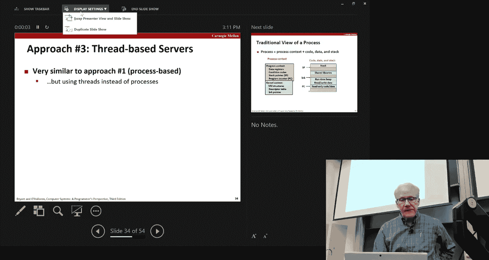

**优缺点**：
*   **优点**：模型相对简单，进程间隔离性好。
*   **缺点**：创建进程开销较大；进程间共享状态（如共享数据库）比较困难。

### 2. 基于事件的并发服务器

这种方法使用像 `select` 或 `epoll` 这样的I/O多路复用函数。服务器在一个单线程中维护一个活动文件描述符（包括监听套接字和所有连接套接字）的集合。`select` 调用会阻塞，直到集合中有一个或多个描述符准备好进行I/O操作（例如，有新的连接请求或客户端数据到达），然后服务器再顺序处理这些就绪的事件。

**优缺点**：
*   **优点**：逻辑是顺序的，易于理解和调试；资源消耗少。
*   **缺点**：代码复杂度可能较高；无法充分利用多核CPU；如果某个客户端的操作（如读取一行没有换行符的数据）发生阻塞，可能会影响整个服务器。

### 3. 基于线程的并发服务器 🧵

这是本节课的重点。线程是运行在同一个进程内的独立控制流，它们共享进程的全局数据、堆和代码，但每个线程拥有自己独立的栈和寄存器上下文。

与进程相比，线程的创建和管理开销要小得多，并且共享数据非常方便（有时过于方便，导致了新的问题）。

#### Pthreads 基础

C语言使用Pthreads库进行多线程编程。一个简单的“Hello World”线程程序如下：

```c
#include <pthread.h>
void *thread(void *vargp); // 线程例程原型

int main() {
    pthread_t tid;
    pthread_create(&tid, NULL, thread, NULL); // 创建新线程
    pthread_join(tid, NULL); // 等待指定线程终止
    return 0;
}

void *thread(void *vargp) { // 线程例程
    printf("Hello, world!\n");
    return NULL;
}
```
*   `pthread_create`: 创建一个新线程，并指定其要执行的函数（线程例程）。
*   `pthread_join`: 等待一个线程终止（类似于 `waitpid`）。

#### 线程化回声服务器

以下是线程化回声服务器的核心思路：

```c
int main() {
    while (1) {
        int connfd = Accept(listenfd, ...);
        int *connfdp = Malloc(sizeof(int)); // 关键步骤：在堆上分配内存
        *connfdp = connfd;
        pthread_create(&tid, NULL, echo_thread, connfdp); // 传递指针
    }
}

void *echo_thread(void *vargp) {
    int connfd = *((int *)vargp); // 从堆内存中取出连接描述符
    Pthread_detach(pthread_self()); // 设置为分离状态，无需被join
    Free(vargp); // 释放堆内存
    // ... 处理echo ...
    Close(connfd);
    return NULL;
}
```

**为什么需要 `Malloc`？**
这是一个关键点，用于避免**竞争条件**。如果我们将主线程栈上局部变量 `connfd` 的地址传递给新线程，考虑以下情况：
1.  主线程接受连接A，`connfd` 被设为A的描述符。
2.  主线程创建线程1，传递 `&connfd`。
3.  在线程1来得及读取 `*connfd` 之前，主循环继续，接受连接B，`connfd` 被**覆盖**为B的描述符。
4.  线程1读取 `connfd`，实际得到的是B的描述符，导致错误。

通过在堆上为每个连接描述符分配独立的内存，并将这块内存的指针传递给线程，我们确保了每个线程访问的是自己专属的数据，消除了这种数据竞争。

#### 线程模型：可连接 vs. 分离
*   **可连接线程**：创建者需要调用 `pthread_join` 来等待其结束并回收资源。否则会产生类似“僵尸线程”的资源滞留。
*   **分离线程**：系统在线程终止时自动回收其资源，创建者无需也不应调用 `join`。对于像服务器这样不关心线程返回状态的情况，使用分离线程更合适。

## 总结

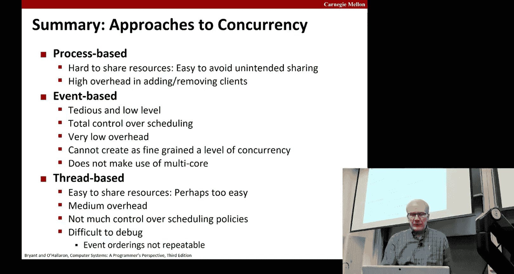


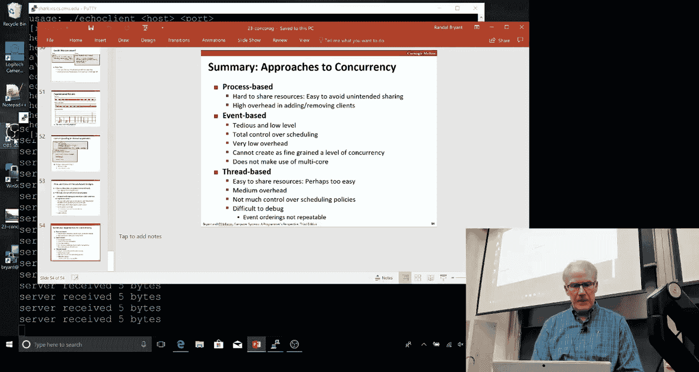

本节课中我们一起学习了并发编程的基本概念和挑战，包括竞争条件、死锁和饥饿。我们分析了迭代服务器的局限性，并探讨了三种实现并发服务器的方法：基于进程、基于事件和基于线程。我们重点深入了基于线程的方法，学习了Pthreads的基本用法，并理解了如何通过在线程间正确传递数据（如在堆上分配内存）来避免常见的竞争条件错误。线程提供了轻量级的并发执行和便捷的数据共享能力，但同时也引入了同步和正确性方面的复杂性，这是我们后续课程将继续探讨的主题。