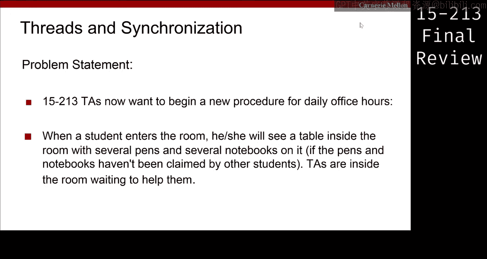
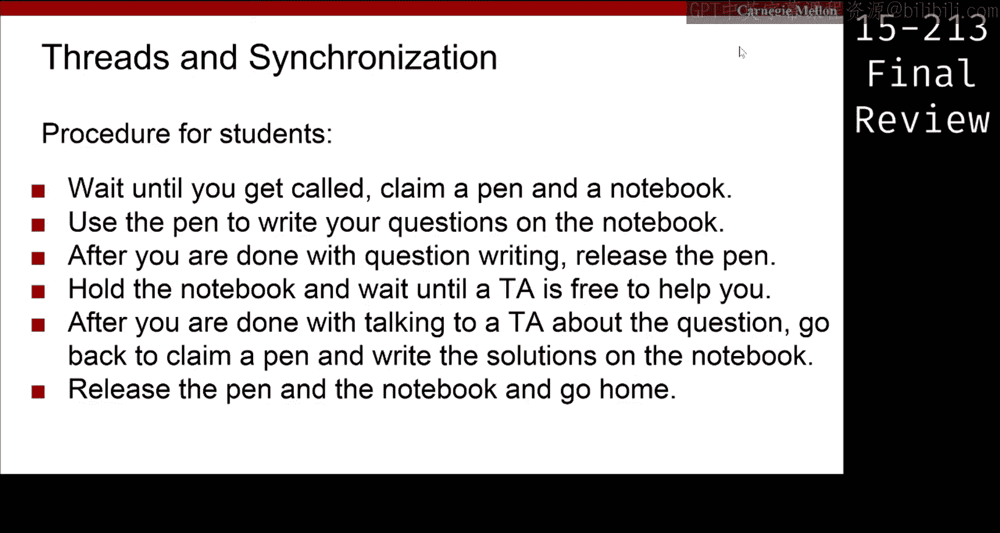
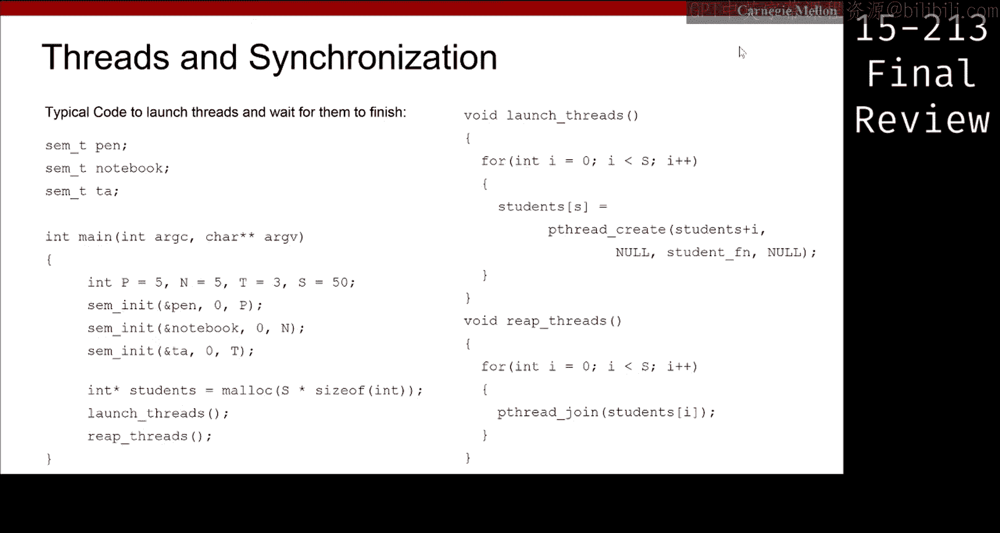
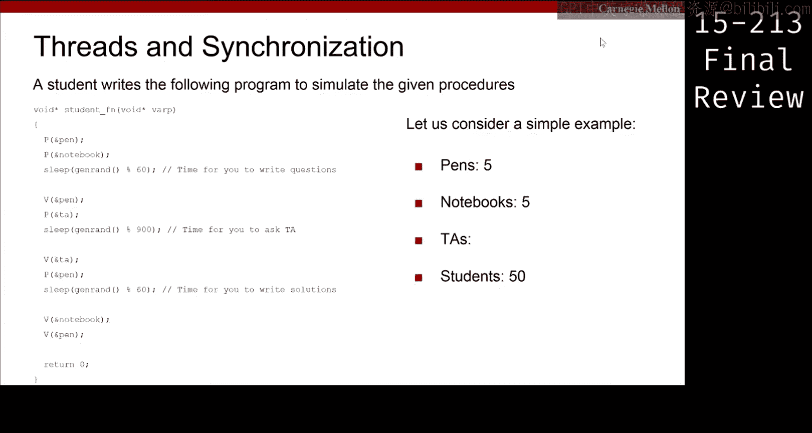
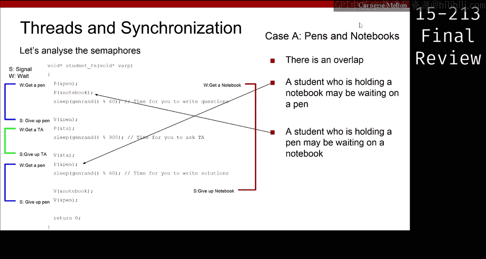
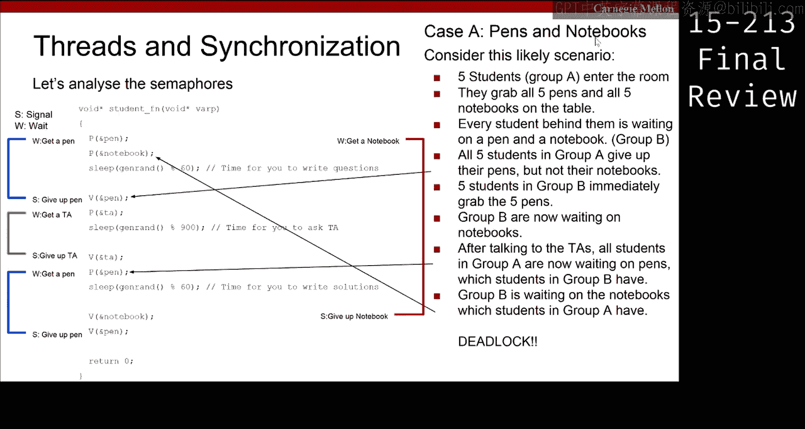
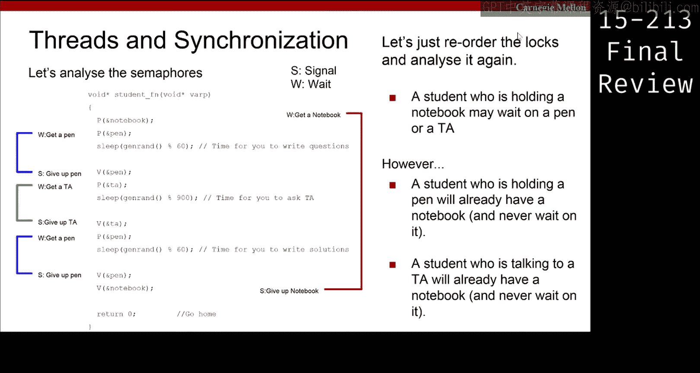

# 线程与同步：第34：线程死锁问题分析与解决 🧵



在本节课中，我们将学习一个关于线程和同步的经典问题。我们将分析一个模拟助教（TA）办公时间的场景，识别其中可能出现的死锁情况，并探讨如何通过调整资源获取顺序来避免死锁。

## 问题描述

假设有一个新的助教办公时间设置。学生进入房间后，会看到一张桌子上放着若干支笔和若干本笔记本。学生需要遵循以下流程：
1.  等待被叫到。
2.  领取一支笔和一个笔记本。
3.  用笔在笔记本上写下问题。
4.  写完问题后，释放笔。
5.  拿着笔记本，等待助教提供帮助。
6.  与助教讨论后，再次用笔在笔记本上写下解决方案。
7.  完成后，释放笔记本和笔，然后离开。

这个场景中有多种资源：笔、笔记本和助教。学生是使用这些资源的线程。我们需要设计一种使用锁的算法来管理这些资源，确保不会发生死锁。



## 初始代码与死锁现象

主函数 `main` 的职责是初始化资源并创建学生线程。其逻辑如下：
*   初始化资源：例如，5支笔，5个笔记本，3位助教，50名学生。
*   创建50个线程来代表50名学生。
*   启动这些线程并等待它们全部完成。



以下是主函数的简化表示：
```c
int main() {
    // 初始化资源：5支笔，5个笔记本，3位助教
    initialize_resources(5, 5, 3);
    // 创建50个学生线程
    for (int i = 0; i < 50; i++) {
        pthread_create(&student_threads[i], NULL, student_routine, NULL);
    }
    // 等待所有学生线程结束
    for (int i = 0; i < 50; i++) {
        pthread_join(student_threads[i], NULL);
    }
    return 0;
}
```

学生线程（即工作线程）的初始实现大部分时间运行正常，但偶尔会发生死锁。我们的核心任务是分析这个死锁的根源。

## 死锁原因分析



问题在于：死锁是由哪对资源之间的竞争引起的？
*   **A**：死锁由笔和笔记本引起。
*   **B**：死锁由笔记本和助教引起。
*   **C**：死锁由助教和笔引起。

让我们逐一分析。

上一节我们介绍了三种可能的死锁组合，本节中我们来详细分析每一种情况。

**分析选项C（助教与笔）**
观察学生线程的代码流程：先获取笔锁，释放笔锁，然后获取助教锁，释放助教锁，最后再次获取笔锁。这里的关键是，获取笔锁和获取助教锁的**操作没有重叠**。这意味着，一个正在与助教交谈的学生（持有助教锁）不可能同时又在等待笔锁；反之，一个持有笔锁的学生也不可能在等待助教锁。因此，这两者之间无法形成循环等待，不会死锁。

**分析选项B（笔记本与助教）**
代码中，获取笔记本锁和获取助教锁的操作存在重叠。一个持有笔记本的学生可能在等待助教。但是，一个正在与助教交谈的学生（持有助教锁）已经拥有了笔记本，因此**不会再去等待笔记本**。同样，这无法构成“持有并等待”的循环链，所以也不会死锁。



**分析选项A（笔与笔记本）**
这是唯一存在**重叠且可能形成循环等待**的组合。一个持有笔记本的学生可能在等待笔；同时，一个持有笔的学生也可能在等待笔记本。尽管有5支笔和5个笔记本，在极端并发情况下仍可能发生死锁。

## 死锁场景推演

为了更清晰地理解选项A，让我们推演一个具体的死锁发生场景。

假设前5名学生进入房间，他们拿走了全部5支笔和全部5个笔记本。
1.  这5名学生写完问题后，释放笔，并开始等待助教。
2.  此时，后续的5名学生进入，他们拿到了刚刚被释放的5支笔，但**他们需要等待笔记本**（因为笔记本还被前5名学生持有）。
3.  前5名学生与助教讨论完毕，需要再次拿笔来写答案。但他们发现笔已被后5名学生持有。
4.  后5名学生需要笔记本才能继续，但笔记本被前5名学生持有。
5.  于是形成僵局：前5名学生持有笔记本，等待笔；后5名学生持有笔，等待笔记本。双方互相等待，无人能继续执行，**死锁发生**。

因此，正确答案是 **A**。死锁发生在笔和笔记本资源之间。

## 解决方案：锁顺序化




既然我们找到了死锁根源，那么如何在不改变学生操作流程的前提下修复这个问题呢？

解决方案是实施**锁的顺序化**。我们规定一个全局的、一致的资源获取顺序。例如，我们要求所有线程都必须先获取笔记本锁，再获取笔锁。相应地，释放锁时则按相反顺序进行（先释放笔锁，再释放笔记本锁）。

以下是修改后的学生线程逻辑示意：
```c
void* student_routine(void* arg) {
    // 1. 先获取笔记本锁
    pthread_mutex_lock(¬ebook_lock);
    // 2. 再获取笔锁
    pthread_mutex_lock(&pen_lock);
    // ... 使用笔和笔记本写问题 ...
    pthread_mutex_unlock(&pen_lock); // 先释放笔
    // ... 等待并咨询助教 ...
    pthread_mutex_lock(&pen_lock);   // 再次获取笔（仍需遵循先笔记本后笔的顺序，但此时已持有笔记本锁）
    // ... 使用笔写答案 ...
    pthread_mutex_unlock(&pen_lock); // 释放笔
    pthread_mutex_unlock(¬ebook_lock); // 最后释放笔记本
    return NULL;
}
```

通过强制规定“先笔记本，后笔”的获取顺序，我们打破了循环等待的条件。现在，一个持有笔的学生必然已经持有了笔记本，因此不可能出现“持笔等本”的情况。虽然获取助教锁的操作与它们仍有重叠，但关键的笔-笔记本循环链已被消除。

## 核心原则与总结

本节课中我们一起学习了如何分析并解决一个经典的线程死锁问题。

**核心原则**：
1.  **死锁分析**：当代码中不同锁的获取范围存在重叠时，需要警惕可能形成的循环等待链。分析时，要检查一个线程在持有锁A时，是否会去请求锁B；同时，另一个线程在持有锁B时，是否会去请求锁A。
2.  **死锁预防**：一种有效的方法是**锁顺序化**。为所有锁定义一个全局的获取顺序（例如，锁A的优先级始终高于锁B），并要求所有线程都严格遵守这个顺序。这可以预防循环等待的发生。相应的，释放锁通常按相反顺序进行以保持代码清晰。



**总结**：
我们从一个模拟办公时间的多线程程序出发，通过逐步分析锁的获取与释放重叠区域，定位到死锁发生在笔和笔记本资源之间。通过推演具体并发场景，我们证实了死锁发生的可能性。最后，我们通过引入“先获取笔记本锁，后获取笔锁”的全局顺序，成功解决了死锁问题。掌握锁顺序化这一原则，对于编写正确、高效的多线程程序至关重要。