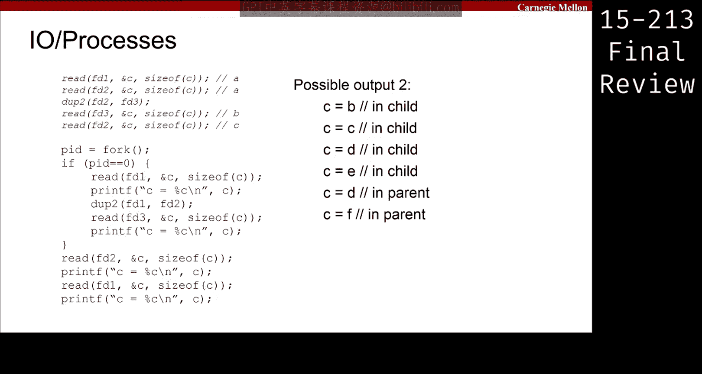

# 36：I/O与进程 🖥️


在本节课中，我们将学习I/O操作与进程管理之间的交互。核心内容包括理解文件描述符、`dup2`系统调用、文件偏移量以及`fork`创建子进程时这些概念如何表现。我们将通过一个具体的代码示例来分析这些交互行为。

---

## 文件描述符与文件偏移量 📄

上一节我们介绍了进程的基本概念，本节中我们来看看进程如何通过文件描述符进行I/O操作。

每个进程都有一个**文件描述符表**，它是一个指向**文件对象**的指针数组。文件对象存储了文件的**偏移量**等信息。文件本身则存储在磁盘上。

当我们执行`read`或`write`系统调用时，内核会：
1.  根据文件描述符（如`fd1`）在进程的文件描述符表中找到对应的文件对象。
2.  从该文件对象中读取当前的**文件偏移量**。
3.  从磁盘文件中该偏移量处读取或写入指定字节数。
4.  更新文件对象中的偏移量（增加已读/写的字节数）。

**核心公式**：`新偏移量 = 旧偏移量 + 读取/写入的字节数`

---

## 代码示例分析 🔍

现在，我们通过一个具体例子来分析I/O与进程的交互。假设有一个文本文件`foo.txt`，内容是从`a`到`z`的字母。

以下是示例代码的核心逻辑：

```c
// 打开同一个文件三次，获得三个文件描述符
fd1 = open("foo.txt", O_RDONLY);
fd2 = open("foo.txt", O_RDONLY);
fd3 = open("foo.txt", O_RDONLY);

char c;

// 从fd1读取一个字符
read(fd1, &c, 1); // c = 'a'
// 从fd2读取一个字符
read(fd2, &c, 1); // c = 'a' (独立偏移量)
// 从fd3读取一个字符
read(fd3, &c, 1); // c = 'a' (独立偏移量)

// 再次从fd2读取
read(fd2, &c, 1); // c = 'b' (fd2的偏移量前进了)
```

**关键点**：
*   每次`open`调用都会创建一个**新的文件对象**，拥有独立的文件偏移量。因此，`fd1`、`fd2`、`fd3`的初始偏移量都是0。
*   `read`操作会更新**对应文件对象**的偏移量。

---

## `fork`与文件描述符的共享 👥

当我们调用`fork()`创建子进程时，子进程会获得父进程文件描述符表的**一份副本**。这意味着父子进程的文件描述符指向**相同的文件对象**。

以下是需要理解的行为：

*   **文件偏移量共享**：由于指向同一个文件对象，父子进程中任一进程的`read`/`write`操作都会影响该对象的偏移量，从而影响另一个进程。
*   **文件描述符操作独立**：`dup2`、`close`等操作只修改**调用进程自身文件描述符表**中的指针，不影响另一个进程。

**类比**：想象父子进程各自拿着一张地图（文件描述符表）的复印件，地图上标记着宝藏（文件对象）的位置。如果他们中的一人移动了宝藏（修改了文件偏移量），另一张地图上标记的位置虽然没变，但根据标记去找时，会发现宝藏已经移动了。但如果一人把自己的地图上的标记擦掉或改标到另一个宝藏上（`dup2`或`close`），这完全不会影响另一人的地图。

---

## 结合`dup2`的复杂场景分析 🧩

`dup2(oldfd, newfd)`系统调用使`newfd`成为`oldfd`的副本，即两者指向**同一个文件对象**。之后操作`newfd`或`oldfd`效果相同。

考虑在`fork`后，父子进程执行以下操作（接续之前的代码）：

```c
pid_t pid = fork();
if (pid == 0) {
    // 子进程
    read(fd1, &c, 1); putchar(c); // 输出？受之前父进程读取影响。
    dup2(fd1, fd2); // 使fd2也指向fd1的文件对象
    read(fd3, &c, 1); putchar(c); // 输出？fd3之前通过dup2指向fd2。
} else {
    // 父进程
    // 假设父进程先执行
    read(fd2, &c, 1); putchar(c);
    read(fd2, &c, 1); putchar(c);
    read(fd1, &c, 1); putchar(c);
    wait(NULL);
}
```

分析此类问题的步骤：

1.  **绘制状态图**：为每个进程（父、子）列出其文件描述符表，标明每个描述符指向哪个文件对象，并记录每个文件对象的当前偏移量。
2.  **跟踪操作**：按代码顺序（注意并发时顺序可能任意）逐步执行`read`、`write`、`dup2`、`close`。
    *   `read`/`write`：更新**被操作文件描述符所指向的文件对象**的偏移量。
    *   `dup2(a, b)`：将进程自身描述符表中`b`的条目改为指向`a`当前所指向的文件对象。
    *   `close`：将进程自身描述符表中的对应条目置为空。
3.  **注意并发**：若无`wait`，父子进程输出可能交错。考试中通常会问“某个特定输出是否可能”。

---

## 核心要点总结 📝

本节课中我们一起学习了I/O与进程交互的核心机制：

1.  **三层抽象**：文件描述符 -> 文件对象（含偏移量）-> 磁盘文件。
2.  **`open`与偏移量**：每次`open`创建**新文件对象**，偏移量从0开始。
3.  **`fork`的行为**：子进程复制父进程的文件描述符表，因此**共享相同的文件对象**。
4.  **操作的影响**：
    *   `read`/`write`影响**文件对象**（偏移量），对所有共享该对象的进程可见。
    *   `dup2`、`close`只影响**调用进程自身的文件描述符表**。
5.  **分析方法**：通过绘制文件描述符、文件对象和偏移量的关系图，可以清晰地分析复杂的I/O与进程交互问题。



理解这些概念对于掌握系统级编程中资源的管理与共享至关重要。