# CMU《并行计算机架构与编程｜CMU 15-418 Parallel Computer Architecture and Programming sp18》 - P10：Lecture 10 - 2-5-18 - Carnegie Mellon University.zh_en - GPT中英字幕课程资源 - BV18b421J7cA

What。Back to the version of the previous of three。Discussion talking about general property。

Reformment。Where todays。Will be mostly focused on。里面 cost that。

And often you can have a great idea for how to break up a problem。A number of pieces。Very well。

It'swawamped by the cost of moving data back and forth。And that the gate。

So the lecture really will cover。啊。Working at。every parallel is like to give as a multi core processor message passing parallel isn like to get with。

A largear。systemystem that can only communicate by network connections。also。N。

A GPU is just a sort of particular flavor of that。Some attributes that are shared memory。

 especially within blocks。But other attributes are message。现在。

Explicitly move data back and forth before you can continue on your。

So these things are sort of extended at a higher level above them in particular。苦しには。

哦。So， remember that。Lture of。A week ago today。We're talking啊。Actually， it was。

Over a week ago was the last one given by Professor Mal。

 I talked about the general idea of wanting to part your computation into chunks of work that were relatively independent of each other and also that。

Provided a good load balance across the。The different processors or threats。あ。

So that's sort of the first step， you have to have some form of parallelism。In order to do Carol。

And then there's an notion of if， you can figure out in advance how to do this petitioning。

 do it statically。And that avoids any runtime overhead。

But it gets you in risk of if there's something about the application that will vary from one execution to the other。

 then static partitioning can end up being a poor choice。

 so you have to consider the possibility of a dynamic parting where you on the fly try to break up the problem。

Depending on the state of the system at that particular talk。And one thing。

 and this is good advice is。Especially you're looking right now at how to break up your rendering problem into chunks that you can do。

And in the next assignment， you'll be looking at problems where how do you break it up and one of the good pieces of advice is start simple and then add it as you need to。

 that in this business， first of all， a elaborate scheme seldom work because they have so much overhead that they。

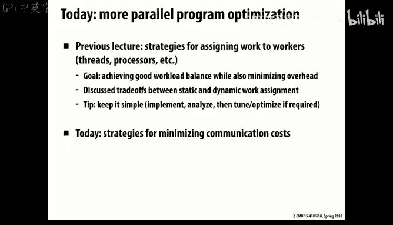

I't going give you any food performance。And so you want to start simple and it's very important to do measurements to understand where are things failing to speed up。

And therefore， attend。Pcus on those and don't sort of speculate what might have。好。

Just jump right in and see what does happen。general。This kind of a we fairly simple game structure。

raise。Of various flavorvers， we don't use anything very exotic。So today we'll talk about， okay。

 there's ways to participate。What about communication。And so as a sort of example。

 we'll go through one that was discussed right at the very beginning， very simple computation。

That's actually a sort of simplified version of what goes on in many solvers of scientific computation where you're doing finite elements。

Computation。你应该注意。We've broken up our physical object into a grid。

And what we want to do are operations where we compute the value at each green point based on the values of that current grid。

 the current value of Greenpoint and its neighbors。And that sort of model goes。It's fairly pervasive。

In computing， especially scientific computing。So in this particular example。

 we'll assume a very simple case where we want to find the average。

Of the value at the current location costs each of its4 days。

And what we'll do is we assume that the problem we're solving over is an end by M grid。

 but we've added an extra row and column。The periphery。

In order to so that the boundary values also have some reasonable。

We don't have to have special conditionals。So in general， we're。

Comput our data will be represented as an n+2 by n+2 grid。But we're doing computation over anybody。

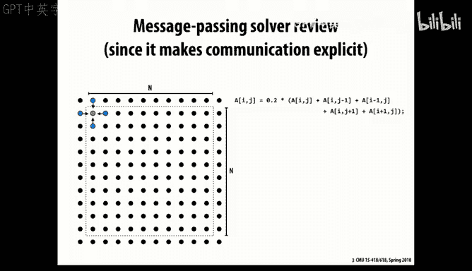

So。The obvious way you do this that is somehow petition your grid into blocks where the number of blocks equal to the number of。

Threreads or prosecutorits you havet pill。So let's just assume we divided into。rose。Where。

 and we'll assume for simplicity that the number of。啊。Freds， processors， whatever we want to call it。

We'll call it threads here is divide Stephenway， the number of。

So now just and we'll work with this as our。Simple model for。So the trick here is that。

 and imagine now that we're in a message passing world so that each of these blocks is running on a separate and independent process。

And the only way that it can get data back between processor by explicitly sending messages。

 transmitting data over some type of network。So in general。

 and typically this could be an iterative computation that we performed this sort of。

Averaging function。Over the entire grid。Then we update the state of the grid and we repeat that until we reach some sort of convergence。

So what that requires that if we look at particular thread number two here is it will need to get the values。

O啊。Of them its neighbors vote。And below it， in order to。And ofly。For off对。

Under the topmost in bottom dose， it will require receiving two sets of data and then also。

Sending out these two sets， two rowsworth of data to each of them。

So the code for is fairly straightforward。佢嘅会会往啊。Start off by allocating。Enough space for。

N plus2 columns and。The number of rows per thread plus two on rows。Well， based on our thread I。

That will tell us。That we want to receive。哦。And plus。

Two times the size of a flow bites from each of our two neighbors。And then we will。

Do the computation。So pretty straightforward communication pattern。

And so this is actually not fully working code， but pretty close to working code that does the whole trick。

So you'll see at the beginning， it starts by saying。All threads except the top one。

Will send their data above， their top row above， and all threads。

 except the last one will send their bottom row below。All threads will receive。From above。

 we'll receive the。It's top an extra row for the top and it's extra row for the bottom。

And then here' is just the loop of doing the averaging computation that just looks exactly like the serial code from before。

And then it will。And then remember， we wanted to test for convergence。

 And so the rule for that was you look at the deelta。At each grid point and take its absolute value。

And。And sum those up。Acrosscross the whole part。And so what we'll have to do in order for that convergence to be done is we'll have all the threads。

Send deltas， their error measurement， their delta measurement， the change measurement to thread0。

 and thread Ze will then have the job of receiving all these values。Suming them up。

And saying if the difference is small enough。Then I'm done。

And it will then broadcast that status of either done or not done to all the other threads。

 So we have actually two types of computation going。 One is the very straightforward。

 Everybody just gets data from their neighbors， does the blockworth of computation。

 and then another one where everyone computes their local change。Sends that to thread0。

 threadread zero is acting as a master that will collect。

 aggregate the information and then broadcast back so that it can determine when the system is converged。

So that's a pretty straightforward example of a parallel program。

 And we'll see when we look at the MPI。It's pretty easy to write these kind of programs using the MPI framework。

That makes sense to people？Okay， well， let's talk about different conventions on sending and receiving。

So the sort of most straightforward from a system implementation point of view is what's called a blocking send。

 And the idea of a blocking send it's sometimes called a rendezvous。

 meaning that both the sender and the receiver have to synchronize。

In order for the transmission to take place。 and the way that looks from a software perspective is。

 obviously， if you go to receive a message and there's nothing there， you'll have to wait。

But。With blocking send， it also means when you go to send a message。

 you block your code blocks until the receiver acknowledges the receipt。 So it's。

 it's like a handshake protocol that the sender。Wants to send， the receiver wants to receive。

 they both agree on that。They copy the， transfer the data over。 and then like。

 then they both return back to their calling functions。So from software。

 that's why it's called a walkingingson。From a software perspective or the caller perspective。

 that's what it looks like。 And you can imagine the。

 the reason why system implementers like this is that the amount of buffering is。

 is absolutely clear that you have to。At most。Some throughout your system space to hold one message's worth of data。

 And so that's good。 The the risk of a non blocking send。Is if if one of them can just start sending。

 sending， it can pile up all kinds of messages that might overflow some allocation of buffers。

If the receiver isn't running as fast as the sender。

 and even if you imagine other cases where it says， okay， well， I'll let you get ahead by， say。

 five messages。好。That gets trickier。 So this is sort of the most straightforward from an implementation point。

没天。But if the San end。Waiting for the Internet。established。Every hour。Youre things。ReYeah。

 so you're anticipating exactly。The problem with walkinging sense is you might you can get to Denlock series I think is what you're about to say。

If everyone's trying to send then nobody's receiving。Then or then nothing's going to happen。

 they're all going to happen。So but this is actually a fairly common framework because it's the easiest one to implement。

So the problem， as I think， was just observed， was this code here will actually deadlock。

If I try to do it using block sense because you'll see right at the start。Everyone， except for the。

Or basically everyone is trying to send two messages and nobody's trying to receive it。So。

So so we have a problem。 Anyone have ideas on how to deal with that。Yes。

You can have outdoor lawss to send them。Exactly， that's a great technique is odd even so that you interleave initial senders and receivers and then they all flip their roles and everything works。

 so that's the classic technique for doing it。

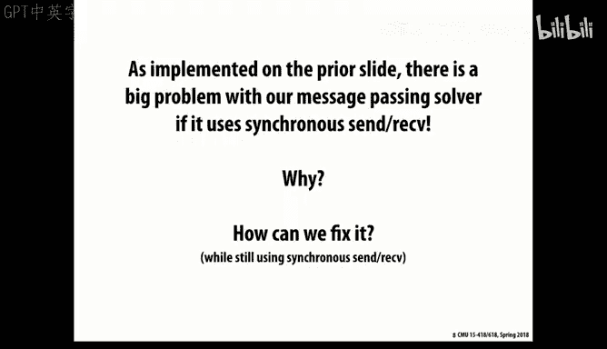

And so this is an example of exactly that convention it says if。The even row will first send。

And then receive。And the odd rows will first receive and then send。

 and then they put their rolls around。 And so everything happens that you want to happen。

 It's just that they make sure that they get that。Synchronization correct。

So that's a typical way that you implement something with Bing sense。

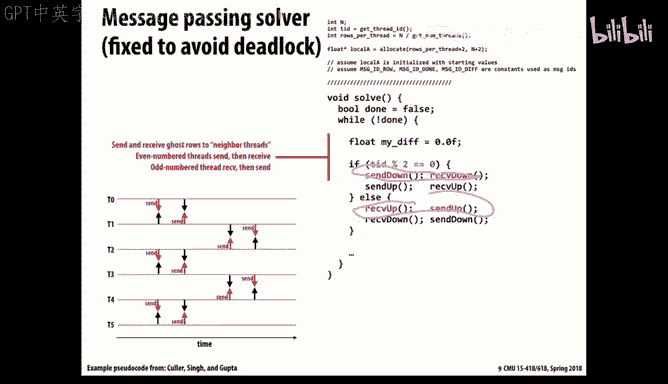

So there's another version of it that's called a non blocking scent。

And what basically happens with that is the sends immediately。

It might be useful to know at some point that the send actually occurred so that your code can avoid this problem of sort of runaway traffic。

 that it will realize that it has to restrain itself if it's getting ahead of things too much。

 You see that the problem with non blocking sends isn't just。

Is actually more systemic if your one process is sort of。Gets ahead of the other。

 say can run at a faster rate because it has a simpler job to do than the receiver then it can grow an unbounded amount of of。

Messages that it's queued up by sending。 So typically， what happens with a。

A non blocking send is you get some type of a token back。That。嗯。

Or sometimes referred to as a handle that will let the sender then query and find out did the send actually take place？

And you can even have totally asynchronous on both the sender and the receiver that the sender just sends and can determine later if the sender occurred。

 the receiver can say， oh， by the way， I want to receive something and let me know when you've gotten it and then go off and do some other type of work。

And then when it will have what's called a callback。

 it will something will get invoked when the receiver is actually ready。

 and that can be useful if you can develop an application where you can keep everyone busy。啊。

So you don't have to wait for messages to come in， you can do some other type of work。

So that's sort of the general idea then， of how do you。Do this。

 But now let's talk about sort of some of the performance parameters here。

 And so we'll do this by sort of backing away from computers and thinking about more general real world problems。

 so。Back before I moved to Pittsburgh and certainly before you moved to Pittsburgh， as you know。

 it was a dirty and smoky city。 My mother used to has told stories。She's now 91。

 so about riding on the Pennsylvania Turnpike when it first opened。

And they could see in the distance， the glow and the smoke of Pittsburgh as they rode along the turnpike。

It was not good。And now， of course， it's the hip place to be that everyone wants to be here。

We're all hipsters， suddenly we who call ourselves nerds have become hipsters and all this quote。

And partly， you know， all these people in San Francisco are realizing that their lifestyle is really not sustainable because the prices and things like that。

 By the way， I looked。 I thought this article was when 2015。 So surely rents must have gone up。

 It turns out。This one was a little bit ahead of the thing。

 the rent average rent at the time was $4894 a month。And now it's dropped to $4，600 a month。

Such a deal。 Anyways， So everyone wants to come to fix。So how are they going to do it？ Well。

 these are all Silicon Valley types。 They have plenty of money so they can just buy themselves some Laorghinis and move。

Well， let's look at the performance characteristics of that。You know。

 if you so imagine it's a 4000 kmeter drive from San Francisco to here。

 and the car only drives at 100 kilometers an hour， which is kind of ridiculous for Lamborghini， but。

That's the way it goes。 So in this system， if there's just one car and imagine there's a lot of people。

Pgines。呃。And when they come to Pittsburgh， they just park them in。Nothing happens。 So anyways。

 with this kind of one car at a time， obviously， your waittency to get from。

San Francisco to Pittsburgh is 40 hours。啊。And dear。Throughhput is one car or one person。

 these are only single occupancy cars， one person every 40 hours， right？

So there it's obvious that the wait and the throughput is just one over the wait see。

So we can increase the throughput without changing the waittency at all if we just have multiple drivers driving multiple cars。

 so if the drivers are spaced by just one kilometer that at any given time。

 we can have 4000 Lamborghinis on the highway and be delivering。The rate of one person， every。啊。

100th of an hour， right， They're riding at 100 km per hour。So 100 people per hour。

And so that's an example， a classic example of you can increase throughput。啊。

Without having to improve waittency。 And in general， in a lot of system designs。

 it's much easier to improve throughput than waittency。

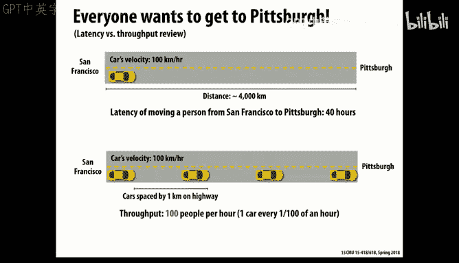

So of course we could drive faster， so if the cars drove at 150 kilometers an hour。

 then you'd increase your throughput to 150 people per hour and you'd also decrease the latency to。

Somewhat。Similarly， we could build more roads or increase。

Our capacity by just making wider roads and moving more cars as well。

 So both the first technique actually improved latency by driving fast。The second。

 just like the idea of putting multiple cars on the road。

 it improves the throughput without changing the waittency。

So in general， then， the latency， remember， is the total end to end time for one for a single operation to complete。

And we use that number all of the points。 It shows up in the time to deal with a cash flow miss。

The amount of time it takes to send a message from point A to point B。

The amount of time it takes to get a response from the piazza。

And the bandwidth is the rate at which or the throughput at which you can perform something so。

Often that's if it's a bandwidth， it's also normalized in units of like bytes instead of words or operations。

嗯。And again， in many systems， we can improve the bandwidth。 we can。

 you know in a sort of purely sequential version， the bandwidth will just be one over the wait and see。

Appropriate units， but there's other techniques we can use to improve bandwidth or throughput。

So in general， this is true with communication， that communication links have different characteristics。

Like if it's a radio channel。You can't really just。嗯。Un you have a really long distance。

 like you're communicating with mars or something， you can't really pump more bits down that。Channel。

 it's not like cars on a road， right that。Roughly speaking。

 the sender and the receiver are seeing the exact same values。嗯。So if you， that's the case。

 then the rate at which you are can process is limited by the one over the。呃，微例子。

So now that's sort of a simple version， let's go into a place where we have a more discrete set of resources then。

Then。Rote a highway is and also considered the case where it's a more heterogeneous set of resources。

 So the sort of standard example people use to illustrate this is doing the laundry。

 So imagine you have to do your clothes。

You have a washer。 It takes 45 minutes， a dryer takes 60。

 and then you have to fold it for 15 minutes。 So your total latency to do this is。Is two hours。

So if you want to increase the throughput， you could just double your resources。

 You'd have to find a friend who' is willing to fold your clothes for you。

 which is probably not very likely， but。Maybe you could work it out somehow。

 but if you did that and you also need twice as many washers and twice as many dryers so but if you did that。

 obviously you can without improving the latency at all。

 you could increase your throughput by factor2。

But with pipelining， the idea is to make use of keep as many of the resources busy at a time by moving things through stages。

 So in this case。We can。As soon as the first load of wash is done after 45 minutes。

 we can start another load。And then。That load will have to stall for 15 minutes。

Before a dryer becomes available， because the dryer takes one hour， and the washer only takes。嗯。

45 minutes， and similarly when you're folding your clothes。嗯。Well， well。

 really the washer becomes or the dryer becomes the sort of rate limiting part of this computation that we can keep。

呃。Increasing it， but in general， our throughput will be limited by the waittency of the slowest stage。

 which is one hour， and so at best we can get in this system， one load per hour out of the system。

But the good news about this is we've been able to。Well。

 we've been able to double our throughput without increasing the resources。

 The only bad news you have to spend 15 minutes every hour of folding quotes。But otherwise。

 the washer and the dryer are just sitting there so you might as well use it。

And this idea， of course。Is built into how processors who designed that they break the computation up into a number of stages and which involve first fetching an instruction。

 sort of pulling apart the instruction， figuring what to do， executing。

 doing the arithmetic operations of it， and then writing back。

 updating any memory or cache values with appropriate values。 So that's a very simple pipeline。

That would only exist in the most simplest baseline processes you could buy today。

 Mod processes are way more complicated than that， as I mentioned。

 they have a whole bunch of execution units that get scheduled dynamically。

 but it's still the same idea that you're breaking computation into a number of stages。

 and you're trying to dynamically map those stages into different resources and executed as you go。

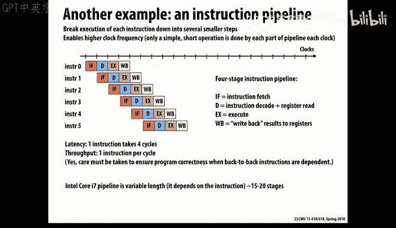

In a modern processor， it will be on the order of 15 to 20 stages。

 and each stage might take very amounts of time。 but as a result。

 they can get very high throughput out of this system。

So if we wanted to sort of do the equivalent thing with our driving。

 what we'd have to think of is breaking up our road into discrete chunks。

 you know fixed resources that could only be used by one car at a time。

 so imagine we broke up our 4000 kilometers into 4000 stages each of one kilometer and said made up a rule that said that there can only be one car on this at a time。

 actually， if you think about how trains get scheduled， it's not unlike they have to have。

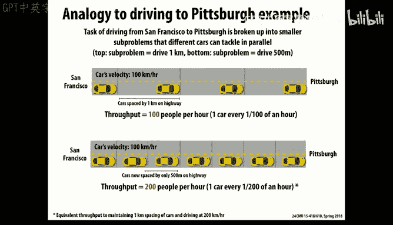

Sort of they schedule trains， hopefully， in discrete blocks。

Of track and guarantee that there's no two trains on the same block at the same time。

 especially if you're going in opposite directions。So in general， now。

 if we can sort of make our our pipeline stages finer grained without。You know， adding more overhead。

 like in this case， breaking it up into blocks that are only 500 meters wide。

 then we can double our throughput because we have more root resources to keep active。

 but we've also doubled the number of stages。So in general。

 then we can sort of come up with simple models of this。For communication。

 we'll go back to the example of communication。 So assume that in general。

When we want to communicate n bytes from one point to another， we'll have some setup time。

 some sort of overhead that takes to kind of get things set up， establish the channels。

Sort of any of that type of thing， some fixed cost。 And then there'll be a sort of per byte cost of。

Of moving that data， I'll also mention T0 would also include if you were really communicating over a long distance the speed of light from or the time it takes for white to get from point A to point B。

 which is actually nontrivibut。 it's on the order a few seconds across the country。So anyways， T 0。

 think of it as the fixed part。 And then the rest is something n over B。

 where B is the bandwidth of the channel。And that's obviously depending on how many bytes so and this is not a bad first approximation for a lot of communication models。

 and you can see one thing that encourages you is if you can group your messages into a smaller number of messages。

 each of which has more bytes， then that T0 becomes less of a problem over time。

 and this is true of almost all communication media we have that they're better at sending long messages some short ones。

2。So， if our。嗯。If， if we have to do this， by then sort of。

Doing n bytes at a time and first spending this sort of T0 time and then the N over B transmit time then。

And our effective bandwidth will be N overs。T of n， including the T0 term。

Right so it will be something that our effect of bandwidth will be reduced from。呃。

The maximum bandwidth B because of this extra cost。

And similarly， we can look at sort of environment where we have。

Sort of slow parts of the system and fast parts of the system。 And again， just like the。

 the dryer was our rate limiting part of our。Laundry example。

 usually the slower the slowest wink in a communication system will be the rate limiting part of a communication protocol。

 So in this example， it's just a little bit more elaborate that imagine we have this orange part is sort of the T 0 from before the overhead of establishing the call。

 In this case， the blue is the rate limiting link， the slowest link。

And then the gray part here is just everything else。The downstream。

 we're assuming in this example that there's a much faster wink and there's a fixed cost to the receiver。

 but we don't really need to， from a throughput point of view。

 those don't really matter because it's totally going to be dominated by the rate limiting part will be。

It's our channel。

But the good news is if we can potentially in this system， set up a pipeline。

Before we were limited， because we didn't really have enough。Discrete parts that we could pipeline。

 and so we paid this cost。

Of always having to pay the overhead over and over again。

If we can set up a pipeline in a communication system， again。

 we can bring down' say increase the bandwidth to whatever the rate limiting channels's bandwidth is。

That we we do the overhead operations， we do the downstream operations。

 and the most important part is we keep this slow part of the system busy all the time。again。

 that's a good idea to do。These are sort of concerns that you see in obviously a networking type of operation。

 but they also show up in various forms in parallel computation too。So in general， then。

 we often refer to the term cost。 So cost。 and that usually means something bad。

So the cost is sort of how much。Impact operations have on program execution time。

And that can come from many different sources。 and also we're using time。

 but you could also imagine some people are more concerned about energy consumption than time。

 or there's other resources you can imagine。啊。嗯。And so what we found was that the。嗯。

IfIf you have a system where the。You have， your total time is essentially your waitency。

Which is there's some overhead and some occupancy we're saying for the slow channel。

 and then networked away was the faster downstream channels。But that's not really a cost。

 That's a latency。 The cost is really the the part that you can't get out of。 You can't somehow。

By changing your protocol， you're stuck with it。And so we'll deduct from that。Communication time。

 any amount of time we're able to overlap this operation with some other operation。 So， for example。

 in our previous example， then our cost is really just this blue part。

Because everything else is sort of。As far as its impact on the overall。

A performance of the system isn't really affecting them。

So where does that come in， Think of a。Computing system。

 whether it's a single processor or multiple with multiple threads or multiple processors。

 is some type of hierarchy。好。At the innermost part， we have registers with very fast access。

 We have some caches that are purely local and therefore fairly fast。

But then if it's a multith multico system with deeper caches。

 we end up sharing that cache with other cores， and that will have a latency to it。

 On the other hand， it provides a mechanism for communicating between the threads。

 So it's both a useful resource， but also a call。And that partly is why we always want to maximize locality of our computation to try and keep the data we're operating on in the smallest。

 most local， fastest available part。And similarly， in a large scale system。

 you'll have memory and then potentially memory available on other processors。

The are memory that's managed by other processors and still is accessible。

 So these each give you successfully slower access to it， but more capacity to deal with。

And in some cases， then the remote might be。Not so much memory。

 but information stored on another processor that you received via message passing and again that takes way longer to do through any kind of protocol than sort of purely local access so in general。

 in all these problems were trying to do，If we can keep the data that we need as localized as possible that will help us。

 otherwise we'll pay a fairly significant cost just in moving data around。

So。One way to think about it too is in our when we measure communication。

 some of it is just because the nature of the problem we have to get we need that information to be moved around because otherwise we can't perform that computation。

 so we call that inherent communication。But other parts are there， just because。

We weren't as clever or efficient in using resources as we wanted。 Theres some artifact。

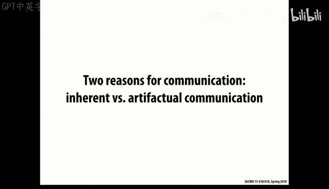

And we meaning possibly in the hardware design， the software design。

 any part of the system design where there is some sort of communication that occurred or。

But it could have been avoided in a more ideal world。So， for example。

 with our the way we partition this problem， we have this inherent need to communicate the adjacent rows between these different blocks。

We can't do the algorithm without that。好。And so one very useful And you'll hear this term quite often。

 is to look at the ratio and you're doing。How much communication are you doing relative to how much computation you're doing？

And so often， we actually flip that over and call it the arithmetic intensity。So if we flip it over。

 we say， how much sort of useful computation do we get？

Relative to the amount of data we have to communicate。And a great example you saw in assignment 1。

 and you're seeing in assignment 2 is Saxsby， right。singleing precision， A X times B。

 So you're only doing two operations。2 floatinging point operations， a multiplication addition。

 But you're having to read two source vectors and write a destination vector， so。

By whatever metric you say， you know， and depending on the exact design of your cache。

 you're sort of doing。啊。3 memory。Two arithmetic operations for every three memory operations。

And that's not very good in general processor。As you saw it。

 just can't really make full use of the computing resources unless you have a computation that has much higher arithmetic intensity than that。

And that was the purpose of showing Saxspeare as an example for you。

So let's sort of。Use that thinking about arithmetic intensity as a way to think about how should we do this parting of this grid computation problem to improve。

 to enhance。Itstic arithmetic intensity is generally good。So the way we've got it， then。

Is not terrible。In general， what we have is。If we view it on a per processor basis。

Then the number of elements we're computing is the total。

That each processor is doing is n squared over p， right？It's doing a total global n squared。

 We've evenly divided it by P processors。 So n squared over P。

And the amount we have to communicate between adjacent threads is 2 n， right， one row up。

 one row down。 So that's 2 n。 And so we compute the arithmetic intensity then。

 and it becomes proportion to n over P。So the good news is if we have a big N。

Then we get more intense。And you can think of that as you get a big value of n。

 you have many more rows。For which you don't have to do any communication at all because you're purely vocal。

And so in general， that's good。 but you can also see if we scale P。And this is typically true that。

We'll be dropping our arithmetic intensity， the more we try to parallelize this。

The less intensity we're going to have。

So here's an example of another possible。Assignment of processors。

 interweaved assignment that you see that processor one does the first row and the fourth row。

And the。Well， I guess the fifth row。And the。Night row， oops， sorry。And so forth， right。

So what would be the。嗯。What would be the amount of computation per processor then？In other words。

 let's do this arithmetic intensity computation。 What's the numerator？still end over P， right。

But what is the amount of communication per。Proor。It's basically everything， yes， and so it would be。

Well， let's see what it would be。Well， one easy way to think about it is the arithmetic intensity is a half。

 right because as you said。For every element， we're computing。

We have to communicate its value both up and down。So that's pretty terrible right， and query。

 this is a really bad idea。Can we do better， do you think， than our row based parting。In general。

 think about water drops。Surface tension wants to minimize。The area or the volume of a drop of water。

 So what do you end up with？嗯。You want to reduce the perimeter relative to the area。

So what would you end up with？嗯。Square， right， square has。对二。

So think of will we actually do better to use squares？And actually， the answer is yes， because。Again。

 the amount of work if we can， let's assume this all divides out evenly。The amount of。Of work per。

The number of elements per processor is the same， but are。

Communication becomes proportional to our perimeter。

Which in general goes as the square root of the area。 So without， know， giving you exact numbers。

 you can see that this is somehow proportional that your arithmetic intensity actually goes as n over the square root of P。

That's a good thing and over square root of P is。Often going to be a lot less than N over。

And it's a good thing in terms of scaling that as you add more processors， the。

Impact that causes will be progressively less。So啊。That that's often， actually， And this kind of。嗯。

Expands out into multiple dimensions， too， that in general。

 if you can think of ways to sort of reduce。If， communication is proportional to the perimeter and the computation is proportional to the area or the volume。

 then that's a good thing。So we call it inherent communication。

 But we see we can actually reduce the inherent。Inherit， we have to communicate。

 but we that doesn't mean we can't be clever about it。

 We can find ways to minimize even the inherent computation communication。So， artifactual。

Interesting word。Is basically all the other communication that's not inherent here。

So let's think it actually shows up all over the place in computer systems。

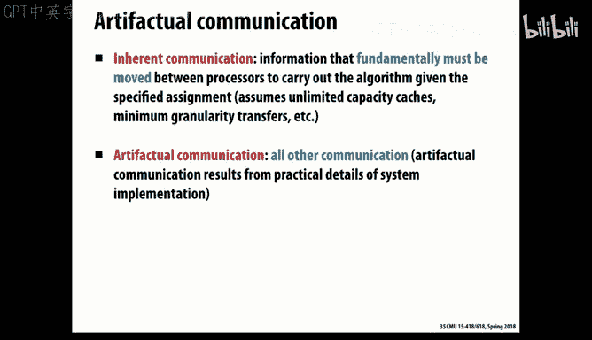

嗯。So in particular， caches have lots of sources of artifactual communication that because a cache line is some minimum size。

 even if we want to just read 1 bite out of that line， we're gonna communicate。

 if you think of the load of。From one place to another of a cash line is a form of communication。

Then where we have this artifactual communication going on。

That won't do us any good unless we happen to have locality and we're going to use other bites in that line。

好。嗯。Similarly， we saw in Saxsby that even though you're just pointing to right to the destination。

 it's going to have to read every time here it starts a new line， a new block。In the destination。

 because it doesn't know in advance that it's going to write。A whole blocks worth of values。

 And so the first right operation brings the existing data from memory into the cache。

So that then you can update that and write it out。 So that's an artifactual communication。

 you're bringing， you're communicating stuff that you're not even going to use at all。

We'll find out that。In general， there's a lot of places where you sort of don't do a good job placing your data。

 and therefore you waste efficiency on that。And similarly with something like a cash。

 the problem is that it only has a certain capacity。 And so you can sort of。

Not have enough room to store data locally。 And so you have to redo the communication over and over again。

So。We saw you recall from 213， 513。There's three different ways that a cash can miss。

 And we're going to add a fourth to that。AndI know we don't spend a lot of time in that in 213。

 but the concepts of them are pretty straightforward。A cold myth。

 you recall is the first time we ever access some data。

We're going to miss in our cache because it's never been there before。

And you typically can't really avoid that。A capacity miss is。When we have some larger computation。

 what they call the working set， the sort of collection of data over which the processor operates over some。

Longer period of time， if it's too big， then we can't keep it all in the cache。

And the other you remember was the conflict myth。Which is because of the way out of the cache。

 it uses say set associative addressing or indexing。That。

Just because basically the way the cache is implemented。

 it doesn't always choose the best possible blocks to evic。

 and so you can have cash evictions occur even though they don't really have to from a peer program point of view。

But now we're gonna add a new kind of myth。 We're gonna add a communication myth。Meaning， again。

 that at some higher level in the system， we had to。嗯。

Pay the price of extra communication that we didn't really need to。And these。All these definitions。

 by the way， when you come down， try and be very precise about it。

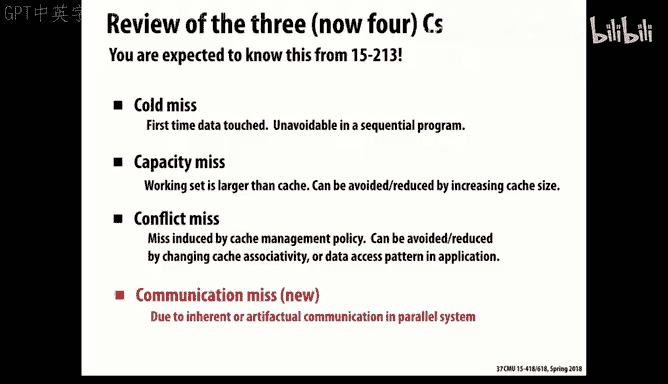

They start to overlap each other。So a typical picture you'll see。

Looks like something like this in any kind of a system。

 a cash system or potentially other types of communication systems that you have some part of your system that can operate at very high bandwidth。

But when you get。Sort of when you're working set， the data you're operating on exceed set。

 then you'll drop into some slower resource and so forth down at the bottom there's sort of the inherent communication that has to be done as well as the cold misses that you can't really avoid that。

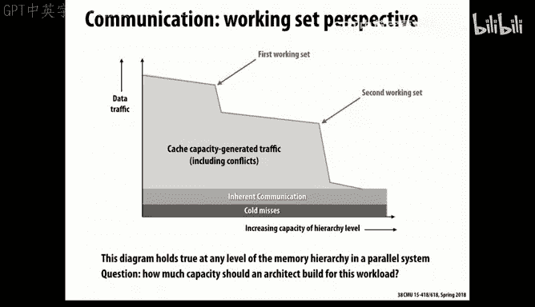

And if this picture might look familiar。嗯。All you have to do is look at this picture。

And notice that what this previous， if you take sort of a given slice through here。

And you remember in this axis here。It's not on the book， of course。Is the size， the working set。

Where。嗯。Actually， it goes this direction。This is for very small working sets then。

You can sit in the L1 cache and go very fast。As the working set gets。Larger。

 then you fall into the L2 and the L3 cache。 And finally。

 you sort of stuck in the memory is what this particular example is。So， that picture from before。

Which you'll see in a lot of places。嗯。It's just like a cross section of that memory mountain。

But as I mentioned， that sort of idea generalizes not just to caches。

 but to other types of parallel computing systems。 too。

 even you can think of message passing as sort of。Well。

 caching is where the hardware manages what gets communicated， what gets stored where。

 and message passing， it's more like you as the programmer。

 decide where to store something and when to send it。

 and similarly you've seen in Kuta has these shared memories in each block in each processor。

That you manage。By software determining whats get loaded into that shared memory。

But it's really effectively like a type of a cache。

It's just it's a software managed care。So we can see this then in and so let's just stick with caching as our example。

 you can see this often in problems and you remember。With your transpose， how you。In the cast lab。

 how you were sort of fighting this problem， too， that with our grid solver。

 let's imagine an example of。A。Our cash capacity is 24 elements。

the thing of is grid elements instead of worrying about the number of bytes。And so。

And we won't worry about the sort of sosociivity issues。 we'll just assume you can hold 24。

Elements at a time， but they have to be aligned in a blocks of four elements each。

So with our grid solver， you could imagine then if you do sort of a row major。

Computation over this grid， then。呃。As you come around to the。End of one row。

 and you begin the next row。You're stuck that you have evicted。In completing this row here。

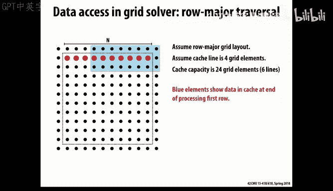

I had det。That part of the。Aray from the cache。 And so now I come back around to it。And boom。

 I exactly miss it。 So this is an example of， we're getting fairly good spatial locality。

 We do one miss， then three hits。But we're not getting very good and sort of short term temporal localities。

 okay。But because of this capacity miss， we're failing from one row to the next to take advantage of the cache at all。

So what type of miss was this？I already said it。Capaciness， the classic capacity。So， in fact， it。

 you， if you work it out， you'd be better off。To。In this example。

 this isn't necessarily the optimum strategy， but you'd be better off in your example to sort of。

Take care of the first columns worth of stuff。And get the， the row sharing between those columns。

And then come back later and do。The remaining part。

 you could do it either in row major or a column major order。

 But the point is you'd actually get better performance out of the system。

Not by just stepping through in the standard order。And this shows up a lot in variations of this。

 not just caching， but in parallel computational a lot in one of the frustrations that often to write nice abstract code。

 you want to do these things in a very data parallel way。

 you want to think about operations that say an array level。

 And if you've ever used the nuPI package in Python， it's really nice that you can just say a plus B。

 and if A and B are arrays of three dimensional arrays， it knows that what you want to do is，Add the。

The one by one elements of it right so it's a very convenient form and often similarly with Fred Blanches in Kuta。

 you know if you think of it as I get to do vector addition and then another vector edition。

 that's all nice and elegant， the problem is it really stinks from a performance point of view。

And so an example of that would be， imagine I have a function。Think of this as almost like it。

Colonel， you know， Kud a kernelel that can。Add do the pointwise addition of array elements or the pointwise multiplication of array elements。

 And now， if I wanted to compute the value of。Of。A plus B times C plus D。

 where these are all vectors or arrays。 I could just do it all by these high level calls。

 just like you do in nuy， or you could do by thread launches in in Kuta。 Well。

 the problem with this is your arithmetic intensity is rather poor。 You're having to do。

You're only getting one operation per element。Even though you're having to do three memory operations。

 two os in a store。So if you confuse the loops。If you can sort of crunch all those nice high level operations down into。

A outer loop that is then within the loop， doing all the arithmetic operations。

Then you get much better arithmetic intensity。 And so in this example。

 we're doing three arithmetic operations and five memory operations。

 So we've gone from one over 3 to 3 over 5， which isn't great， but it's better an improvement。😊。

And this will be a frustration that you face often。

In this world of high performance computing is that you'd like to have these abstract operations that you can express at a high level and implement with some nice library。

 But the reality is you have to kind of get down there and slam it all together， a fuse it。

So as you can imagine， there's been a lot of work in compiler design trying to do this fusion automatically。

 And there are some success at that in limited ways。

 and sometimes that you do some partial guidance as a programmer， you can say， you know。

fuse these loopops kind of thing。But it's not 100% reliable。 So unfortunately。

 this abstract model you'd like to be able to use often just isn't practical。

And so another way to improve arithmetic intensity， in general。

 what you're trying to do is gather together as much of the computation you need to do over some given part of the data as you can。

And。So if we consider co locate the。Computation relative to it， that's a good thing。

 And if you were here last Friday， you saw the example of the matrix multiply in Kuta。

 where the first time I did it， I made the mistake of。

The sort of novice mistake of going through the data and column major order and having really。

Not very good performance。 And then when when row major orols and boom wife was good。 So in general。

呃。If you can sort of exploit the sort of memory system design and your how you do your allocation of tasks onto resources。

 if you can sort of co-optimize those， you can get much higher arithmetic intensity。

 the memory system is delivering the bytes that you need relative to the operations you're doing。

 it's having to do a lot less work。

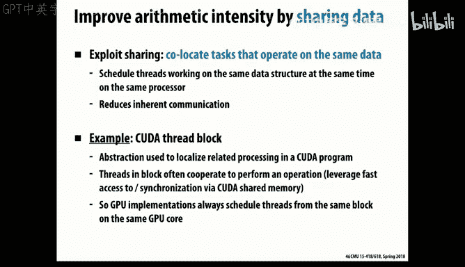

And we saw that in Kuta， too， the idea of this， you， the highest level。

 you can think of it as just this pure data parallel computing language。

But when you understand within a thread block， you have this sort of stylized。

Shared memory processor。And you can exploit the locality by fetching things into that shared memory。

 You can improve performance。 So those are all examples of trying to， in various ways。

 sort of improve arithmetic intensity by。啊。By localizing the computation as much as possible。And。

Another thing that happens is is granularity that。啊。Gnularity is in general。

 a good coarse grain means you're working in chunks of stuff in bigger blocks。

 and as we saw there's an advantage in any kind of communication that it reduces the impact of the sort of fixed cost overhead if you can get more bytes processed at a time。

But it also means that the。As your box get too big。

 you can have wasted or artifactual communication happen。 So let's look at some examples of that。

So here's a pretty interesting example。 Imagine we have， again， our cash。

Design where we have four elements per block。And assume that the。

The grid size we're working with is a multiple of four。So， the good news is。Within this array。

We'll have pretty good utilization of those cash lines。

 we'll typically make use of all four values for every cash reader loader store that we do of the cache。

But if we look at these edge pieces。Then we have sort of three force of that memory capability will be wasted。

 We have to get this right hand most element in from one line。

 and we have to get one block and the left hand most element from another block without touching the other three。

 and this happens over and over again in cache is， as you've probably seen that you can。嗯。嗯。

If you try to make bigger box sizes， then basically you end up with poor utilization of those blocks。

You can also get this sort of problem happening if you do your partitioning in a way that。

Does't respect the the memory boundaries。 And so imagine we do a multi threaded computation。

 and we do this partitioning， say， into squares。But the squares。Are not the multiple of the。Okay。The。

 the， the， the cash line size， the box size。Well， that can actually， if it's a read only。

 what we're going to go more in this course and look in more detail about high performance caches and how you do。

 you know， what it means to share it cash。So it turns out that if the data are only data。

 this situation isn't too bad， that basically you'll get a copy of that line into both。Cashs。 And。

 yes， it's， it's not ideal。 in that though'll each only in this example。

Son each of them will only make use of half the line， but at least it's only half。

What gets really nasty？I if there is right。And so one line， one processor will get this line。

 It'll write it。 And what it will do is tell the whole memory system， by the way。

Cash line is no longer valid。 if you need a copy of it， ask me and I'll give you a copy。

And you'll see that if say that happened here。Then then here。

 and we went back and forth then they basically end up fighting sort of bite by bite or word by word for this cash coin and having to do these evictions and loadings over and over again。

 and so that's a real problem。In working with cash shared cash applications。

 it's sometimes called false sharing。That it look， they're sort of paying the cost of a shared variable。

Even though。Actually， from a program software， you know， program。Point of view。

 they're not actually sharing any variables at all。 They're working on independent parts of data。

 but they。Because of the sort of artifact of the line size they end up with this fault sharing。

 It's a really bad thing。 I mean， the performance is horrendously bad when this happens。

So in general， some of these artifacts can be reduced by going of reorganizing the data。

So that it fits into the。The， the cash better。The local cache is better by。

 and this is sometimes called a four dimensional layout。

Or a blocked way out where if before we sort of。Numbered our memory addresses。

Goldway in row major order， what we do now is do them within blocks。

We do a row major order within each block。And then， we。Keep those separate。

 So now the advantage of that is。If this is a shared memory system， processor one。

Will only have to touch its local box。 We'll have to deal with the communication of the boundaries problem。

 that's an issue。 But at least for the。Sort of main part of the computation。

 It's only accessing things within essentially creating its own local address space that it's operating on。

So that can be helpful。 again， from a software perspective， this is really yucky。

 right that if you have to rewrite your code。To work on this hierarchical blocking system。

And it will vary depending on the line size of the particular cache you're working on and the number of processors。

You're assigning to it。 This's going to get pretty ugly pretty fast。 And so again。

 there's various software support systems that can automatically。

 you can basically do a permutation of your data according to different parameters that you pass it and it will help you do that automatically or you can ask the。

So that that would be good if you can avoid having to rewrite this code over and over again every time you move it from a。

Like if you went from single precision quotes to double precision quotes。

 all of a sudden your effective line size droppeds in half。It drives you nuts。

But you can see the advantage though， potentially of reorganizing how the data are laid out in memory in order to increase the localize the data。

For the particular computations being performed。

Okay。So。That， that's sort of。The basic idea that of communication costs and。

A difference between inherent artifactural communication。Let's now talk about again。

 this idea which I sort of alluded to already of contention。

 that you have a contention for resources that can add a lot of overhead to a computation。

So let's do this simple example， imagine that。嗯。Students are coming to the instructor for office hours。

 and it will take。嗯。5 minutes per student。 That would be。An interesting。Things that were really true。

 but。And then otherwise， the student is having to get from the one place to the office and potentially waiting in a line for others to complete as well。

So for the a given student， then the cost of this arrangement is 10 minutes， right。

 You got to walk someplace， and then you have to。

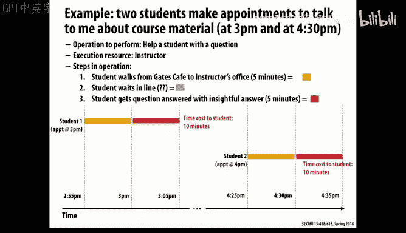

Get your answer。So potentially， we can improve the utilization of the instructor by。

Having the system pipeline as it naturally does， of course， that the students。Kind of walk there。

 They get in the line。 They wait。 And if the instructor is the rate limiting part。

 then that queue will just back up until all these can be handled。 So， you know。

 the good news is we're making good use of the instructor。The bad news is。Excuse me。The bad news is。

The students are waiting a lot， not very happy about that。

I think that happens in 213 around the time of the MalacCl， right？So the issue here of course。

 is the shared resource， the instructor， more generally the teaching assistants are the limited resource。

So that's an example of contention that。And that shows up over and over again in many types of places。

So and sometimes this is referred to in computation， is there being a hotspot in the computation。

 if there's some particular value that has to be used over and over again。

 updated over and over again， it becomes the bottleneck for the whole system。So in general。

 what we try to do in parallel computing is reduce these， eliminate hotspots， spread things out。

Avoid places where there's some contention for a single or small number of resources。

 because that will be sort of an Amdsva killer problem that as you get forced into sequential or。

Resources， then no matter how much parallel resources you have。

 you'll be limited in performance you can get。

And we saw that in a couple lectures ago when we talked about this idea of distributed work cues that you want to not have a centralized work queuee that having to do all the resource management potentially。

less that can be done really trivially。 so in general， you want to spread this out。

 we looked at various schemes for distributing work cues and having ways that they could still work from each other as a way to avoid sort of assistant workload getting very imbalanced。

But this shows up， and you'll find this in particular， in your current assignment。

 that often you have a uneven distribution。Of things you have to compute， of course。

 across the sort of problem domain you're doing。So imagine just for example。

 is you have a bunch of particles， say a million， and you want to place them on a grid。

 a four by four grid。So the end you could do computation over those elements。So first of all。

 it's a problem。Even figuring out that partition。That what we want to do then is create basically a list that says for each of these 16 cells。

Which of these particles？Why within that cell？Or。If you imagine your circle rendering， right。

 if you partition your image into blocks， then for each block， you want to know which circles。

Potentially overlap， have some contact within that region。

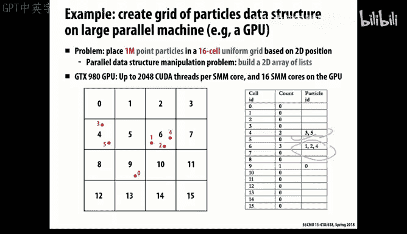

So this is a fairly common problem。And it shows up， for example。

 when we looked at the end body simulation problem or ones where you're trying to model some physical system in space。

 but it's not a homogeneous uniform distribution of the things you're looking at。So。How。

 how can we even figure out this list then， How could we come up with。

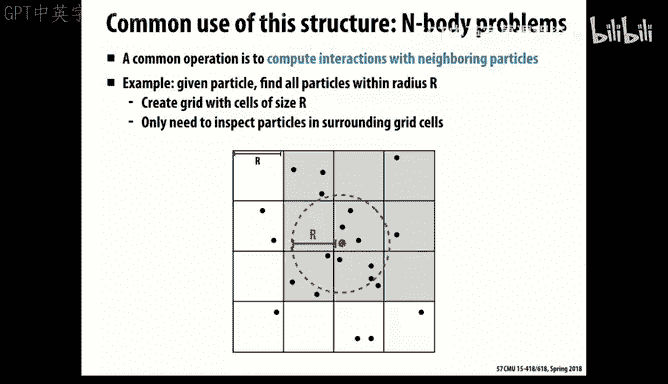

Given a bunch of particles。For each derived for each cell a list or some know shortened。

Compact notation of。呃， what。

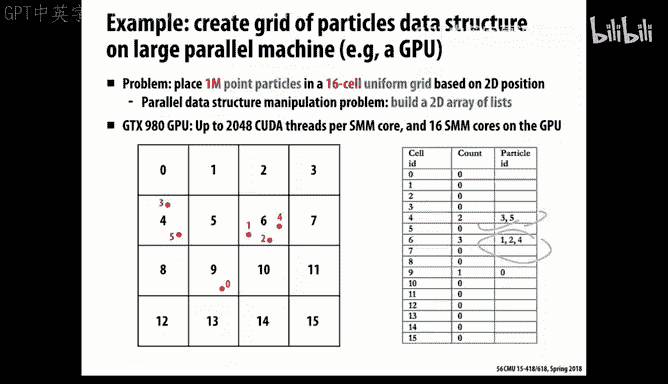

What particles lie in that cell？So one idea would be。you know。

 an obvious sequential part would be just to go over all the cells。

Maintain a list for every particle and just for every cell just dependent to the appropriate list。

Actually， that would be a smart way， this is not such a smart way。

 but it's obviously parallel way that we do sort of cell level parallelism we say。

Every cell scans through the whole set of particles。

It picks off those that are lies within that cell。So。What's wrong with that approach。Yeah。St。

Some cells that are scattered than others。Well， we're going to end up with that anyhow。

 that's going to happen because that's the output we're trying to get。

You can see this is not very evenly distributed。

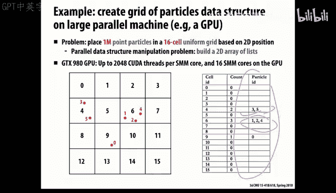

And we're just going to have to deal with that， that be some cells add more particles than others。

This one actually the balance is actually perfect。 we're doing every cell's doing the exact same amount of work。

 The problem is they're doing too much work。That were we started doing Pete。You know if they're cut。

16 times more work than the sequential implementation would do。

 And you're not going to get much speed up that way。In fact， you'll get none。Because basically。

 each of the cells iss doing。What a sequential code would。

And so that it's not only work in efficientfficient， but it's also not very parallel。16， if。

 you know， if we're like in the kuda world， we're looking for many thousand fold。

 multiple thousand fold aoloid。16 is like not really very exciting。

So another approach would be to say， okay， let's parallel wise over particles。

 We'll say for every particle。Figure out what cell you want to be in。

 and then somehow this isn't going to work in kuta very well， but somehow。

 atomically insert onto the end of a list。嗯。The value。

 and you can actually do that in Kuta by doing an atomic increment of some counter index for each cell。

 and then that becomes the position in which you insert yourself into the list。

It doesn't look like a lock， but it looks like some type of a global atomic operation to implement。

So the good news is that。From a work perspective， this is efficient。

 But the bad news is there's huge contention that。If there's only 16 cells。Then， you have。

16 hotpots you're creating and that will be， again。

 if we're looking at thousandfold parallels that will be really bad newss and in general。

 any type of atomic increment or operation is a killer。So one common way to deal with it。Is to。See。

Oh， I'm sorry。 The first one was even worse than that。 It was a single global lock。

So you're creating one hotpot， the single global lock。

And then the second technique was a little bit better。 You're creating 16 hotspots， but still。

 that's not going to really be very scalable。

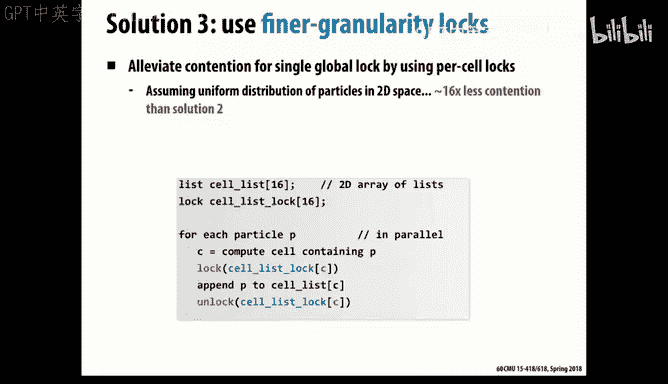

So in general， what often happens is what you want to do is sort of。Break it up。 and if possible。

 avoid any type of。Of contention by creating local copies of whatever thing you're trying to build up。

So for example， what we could do here is。嗯。If we're sort trying to do n parallelism。

N is not related to our previous problem we looked at before， what we do is create lists。

 end copies of these lists。And then basically divided so that each processor was building up。

 it took one or one inth of the set of particles and created a list。Of for each cell。

 it created its own set of lists， and then we somehow have to merge those lists together。

 but at least we've avoided this initial pass any kind of contention for resources。

 So this is a pretty common trick you'll see。And the cost of it is more memory， it。

It actually has two costs， one is more memory because we have to have enough storage to make as many local copies of whatever we're trying to compute as。

呃。We have， and also there's some cost somehow in doing this aggregate computation。

That we've already done the same work as the sequential algorithm in building these local copies。

 and now we have to somehow merge those together。So。But this is generally the。

 the kind of strategy you want to use is to find ways to take。A problem。 keep the computation。

 the communication local， and then somehow aggregate those results。And so， for example。

 you can do this and this is not unlike what。You're being able to ask to do with the the use of scans in the。

Scan part of your current assignment， and。A big fat hint， of course。

 is that might also prove useful in doing your rendering as well。That somehow， you want to。好。国会。

You start with。So imagine what we do is we。Partition。

 we partition our particles of we do data parallel over the particles。

 figure out what cell number they want。And then we invoke a library that will do an efficient sort for us。

And we sort by the grid index， and we do this in a stable sort so that we remain sorted by the particle index as our secondary sort。

And so now what this will say is。In this example， that there's two going to be two particles in cell number4 and three in cell number 6。

1 in9。And then still doing data parallel， we can find what is the starting index and what is the ending or one past the last index for each of these。

 and then somehow miraculously what we have to do is condense that all down into these。Ls， well。

 actually， you can see that if we just think of our lists that we're trying to return。

As just subranges of this list here。Then we've done our job right， that we've created。

It apparently disusing this trick of。In parallel， everybody does purely local computation。

We somehow magically do a sort。 And you see， we've already done the work we really need to do in order to get things into these lists of cellsve without any contempion of any sort。

 And so that's the kind of trick that you'll find you wanting to do in various applications of how can I avoid。

啊。Any sort of atomic operations？Creating hotpots by suit doing these more high level abstract parallel operations。

And so in general， then。I see。 we've run out of time。

 but you'll see that we've sort of gone through these different parts of cost and how you can reduce them。

 improve the performance。Okay， thanks。