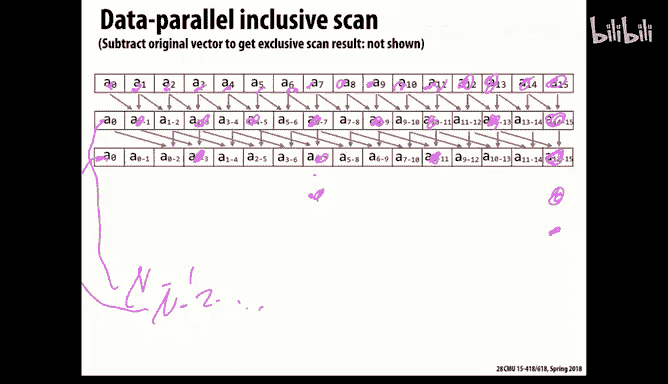
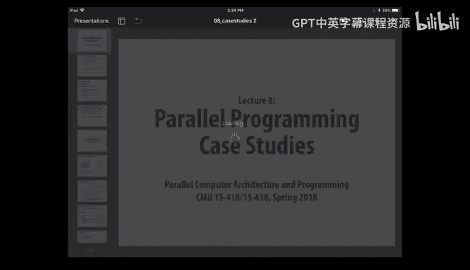
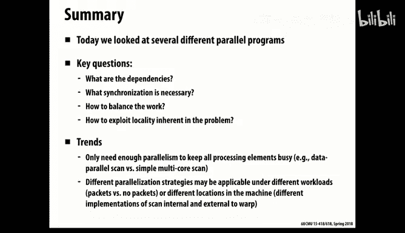

# CMU《并行计算机架构与编程｜CMU 15-418 Parallel Computer Architecture and Programming sp18》 - P11：Lecture 11 - 2-7-18 - Carnegie Mellon University.zh_en - GPT中英字幕课程资源 - BV18b421J7cA

で。这一分钟。Yeah。で。こ見。Yeah the。So。就こ。丈国。あ願。So happy serious。

So today what we're going to do is look at some representative programs。

And look at the techniques that were used in these programs too。A extract parallelism and B。

with the issues we've talked about， the main ones being making sure you have a reasonable balance across processors and also avoiding excessive costs due to communication。

So。In the sort of bigger picture of where are we in the course。Up to now。

 we've been looking at sort of。The general principles of how do you think about parallel computing and both the execution part of it and the communication part of it？

And now what we'll do is use some examples to illustrate some of these issues and how they are solved in different domains。

And then from there on， we're going to start going into issues about how do you measure and evaluate system performance？

And we'll talk in some detail about shared memory。Because it turns out the hardware design。

It be fairly important in understanding what。なか。And what type can be cost？

And then eventually we'll get to exam one。So what we're going to look at today。

 and these come out of a textbook that's listed in the course webpage。

 it's actually a 20 year old book， but it still has a lot of the principles and concepts in it。

Vll today， as they were 20 years ago things really except for the。Theres sort of emergence of GPUs。

The world of parallel computing has not changed much in 20 years in terms of concepts。It's practical。

So what we'll talk about is ocean simulation， which is a typical gridso type of problem。

 We'll look at modeling of galaxies and their evolution。

 which is a very interesting one and how do you deal with irregular spatial partitioning。

 We'll look at the scan。Like you're doing for the second part of the current assignment。

 and you'll find also can be used in the third part。And we'll generalize from scan to segmented scan。

 those of you who' taken210 have been exposed to those ideas and we'll also talk about ray tracing and graphics to。

So。What we'll look at then is how these particular problems were solved by other people。

And how they dealt with some of the issues we've talked about so far。

So we're sort of being generic about what kind of architecture we're thinking on， but in general。

 assume that we're looking at a large scale shared memory processor so that we have communication as we can do addressing across the entire memory space。

there's still it's what you call a pneumma， nonuniform memory access。

 meaning that some parts of memory you can reach more easily and quicker than others。

 and that's due to caching effects and also the way these things got physically built is to allocate some of the when you get beyond the sort of single chip multicore processor。

What you do is you individual processors are managing sections of the DRAM。

 and it's possible to request accesses across。From one to another。

 but it involves going through the DM control of another chip。 and that's， for example。

 we're going to be for your next assignment looking at cluster。Each processor is a 12 core zion。

 but physically it's actually two chips。And so half the memory you can get to more quickly than the other half。

But these ideas also generalized to a message passing a distributed address and to a little lesser extent of GPUs。

So the first is what's called the ocean simulation and the objective is to model the currents in the ocean and again。

 like a lot of these problems， we don't really have to understand much about the science behind it as much as just to have a feel for what type of computation takes place。

And so this is similar to what we've looked at before where we discretize space into a grid and we'll only be looking at one horizontal slice of the ocean。

 like say the surface of the ocean or some particular depth。

 so we'll only be thinking about it as a twodial problem for today。

And what we want to do is model parameters the state parameters， things like temperature。

 oxygen level， and all the other things that matter for oceans。

Over time and how they evolve in both time and space。

 and so what we typically do is set some small time step delta T and then keep updating the state of the system every Dlta T unit。

What are the challenges for all these simulations？Across any physical simulation is to get finer resolution。

 finer spatial distribution， you also have to shorten Delta T because deelta T basically has to be small enough that。

啊，虽然。Effects do not propagate beyond the sort of nearest neighbors for each time so。

 so I know people are involved in simulating ground movement， earthquake type of things。

And they say that every time they want to get。Iprove their spatial resolution by say a factor two。

 then they have to have 16 times more computing power both because they have to do this in three dimensions of space。

 but also in time， everything has to be that much finer。

 so these are problems that are very difficult to scale。

So this is a diagram taken from this book by Coeller and his colleagues at Berkeley。

OfDe this problem， we're just going to focus on the parts that locked in。Red， the grid solving parts。

And there're sort of slightly more involved versions of what we discussed last time that imagine at each point in space。

 you're just trying to compute the average of the values of。

Of this grid point and the four neighbors。Obviously。

 things are more interesting than just computing averages。

 but that computation is a good proxy for the type of things that are done to model the state of the system and its evolution。

And typically， you want to do this iteratively until you reach some type of convergence condition。

So just like we saw before， there's sort of two types of computation。

 one is the updating of each element， and then to determine what is the delta。

 the change from the previous step， and then aggregating that change information to some central place that can determine at what point the simulation is conver。

And what we found last time was the best way to do it。

 and it's a fairly straightforward way is to just partition space into tiles。

And the more square you can make them the better， essentially reducing the。

The area is how much computation you have to do and the perimeter is proportional to how much communication you have to do。

 and so you want to improve the arithmetic intensity so that generally means getting more of。

Things with a square or some other very tight。Radio。嗯。To minimize the perimeter relative of the area。

So and then we'll assume that there's sort of。Some type of barrier synchronization so that all the processors kind of are kept in sync with each other。

And that also is costly because it means， first of all。

 just the time required for everyone to sort of agree that it's time to stop and also it means that if there's one element that's running a little bit slower than the rest。

So called stragware。 It'll force everyone to move at that pace。

 So that's a big issue in general for this type of。And so if you think about it， you know。

 we use the term working set is a sort of vague term。

Of the amount of memory you need or the size of the data that you're operating on for some period of time。

And you'll hear that concept expressed in various ways and sort of thrown around， but of course。

The size of the working set depends on the time scale that you're talking about。 So， for example。

 in this case， sort of at the shortest time scale， I have to have access each processor SM。

Access to a grid point and its four neighbors。But if we're scanning the rows。Within this。

 there will be a。One form of a working set， and more generally。

 the set of state of all the nodes within a given part of the grid。

Given tile can be viewed as a working set， and of course。

 we know already that cache hierarchies are designed exactly to account for this fact that the working set size changes over time and so for the short term you can have very small fast captions。

And then progressively larger and slower。And you recall last time we found that。If we and this。

 I just sort of said this if we go in horizontal strips。OurOur aribetic intensity is not as good。

 the ratio。How much work is done during the computing relative to the amount of communication that we did better to block it in。

And we also。Mentioned before， if this is a global shared address space machine。

Then you actually do better too。Instead of the standard row major ordering for the entire grid。

If you do it within each tile's worth， if you do a row major within that， so that， for example。

 processor one， when it does a just read from memory。

 starting at index zero and working its way upward， it will scan through its entire set of nodes。

And same with processor two， so there won't be any sort of interleaving of the cache accent。

And so that can be a better， depending on the cache design， that can be a better access pattern。

 but of course， its the pain in the neck from a software point of view。

 it means you have to take what's naturally the sort of。

What you think of from a scientific perspective， of just one global array。

 and you have to permute all the elements in order to put it into this particular form。

But you'll see that these are some measurements taken by color and given in the book。

And what this shows with C Tim。1996 a graphics。That the strraggly stuff at the bottom is the actual computation。

 the useful part of this computing。And the black stuff at the top is the time spent exchanging data。

 and the gray stuff in the middle is the synchronization。

 mostlys just waiting for barrier sinks to complete。

And you'll see that this is across a collection of 32 different threads。

And so you see that the block layout actually greatly reduces the time and that time reduction is mostly by reducing the cost of communicating data。

And a little bit， by。Reducing the sink cost because。With the data when some parts have to wait。

Fills from other parts， and so you have nonuniform memory access。

 then it means this problem of strrs is more pronounced that some of them will get their cash accesses quickly and some more slowly。

 but because it's a barrier sink， they all have to wait for the lowestest one。

So you see that by sort improving the memory layout you。

Reduced not only the time to spent communicating， but also you can provide a more regular computationmplication pattern and avoid having to be slow for barriers things。

So some observations here is this is purely a static assignment and it works just finding this application because all the grids are basically doing。

the same thing， all the grid points， and so this tile。

 the sort of workload is evenly distributed across the tiles。And。And that this 4D blocking。

 as they call it， does definitely improve communication。This is a picture that。嗯。

It's a little hard to figure out， but basically what it's based on is looking at what speed up you get。

呃。Depending on what memory access。呃。Mechanism you set up and so you see that， of course。

 the top ideal would be an ideal speed up and we're not hitting that and the ones at the lower right are something that's based on just a really terrible allocation that doesn't。

啊。Provide any type of。Sort of ability to exploit。The locality involved and the other ones are various choices in how to do these different types of。

Allocation。And getting something。It's some spread of distributions。Anyways。

 I think this picture is a little bit more detailed than we need to look at too much today。

So but that's a fairly typical problem in some ways。

 the easiest type to parallelize is just this uniform grid where everything is。

 you have local communication， you have evenly distributed workload。

 it works actually extremely well in a distributed message passing environment as well because you can have fairly good arithmetic intense。

A more challenging problem is trying to model these galaxy simulations。

 and this is a problem in fact we have some very well known faculty in our physics department who are well known for doing exactly this type of work。

So the basic idea is that you imagine all the stars in the universe。Are gravitational objects。

And they are。attracting each other by the gravitational forces。

 and so they tend to move and form orbits and spirals and so forth based on these gravitational forces。

 and so what we want to do is model the evolution of this of say a galaxy over time based on sort of all the interactions being formed by these different stars。

And the challenge for this is that stars are not uniformly distributed across the galaxy。

 they're clustered together in various ways， and so we can't just divide space into a nice uniform grid and have every apartment be the same。

So there's a very clever data structure。Devisised for what's called the Burns Hut algorithm。

And the thing that's exploiting is， so in general， the problem with this is you have a sort of n squared problem that the gravitational force is between two masses。

 as you know， is you can compute it。It's not that hard， but if you have N of these。

Then each one is interacting with all the others。 And so in principle， you have to compute。

WhatFor a given star， what forces are acting on it from the n minus1 other stars？

And so that's expensive。At least it's symmetric， but that only saves you a factor of two。

But the observation is if some cluster stars is far enough away。Then I can abstract them。

And just represented as if it were a point mass so I can compute the center of mass of that remote cluster and sum their weight。

 their masses together and yield a fairly reasonable approximation of the impact that far away cluster。

I have on this scar of interest。And so we can exploit that。

Loality or that effect that things at a distance can be aggregated by setting up some type of representation that lets us merge together multiple bodies into these sort of modeled as a single point next。

And what that ends up with is an algorithm that roughly speaking is N log n instead of n squared。

Not in a worst case。You know， algorithmic point of view。

 but in terms of the practical results for realistic bias。

So what they do then is divide space into by doing sort of binary splitting。

 and I'm just going to show it here in two dimensions。

 obviously real world the real universe is three dimensional。

 and so this goes on at a three dimensional level too。

But what you see is in this picture is that I've keep splitting。Down finer and finer。Squares。

until I get to the point where there's only a single star in a square， that's my sort of furthest。

 those will be called mine leaves in this tree， and then you can think of those squares as forming a hierarchy represented by the tree at the right that's called a quad tree。

 meaning each node， for example， the top level node represented the entire，啊。

spaceace and then its four children represent the four quadrants and so forth。

 and so at each point you split into 2 and x and 2 and y。

 and in fact the spatial version of this is called an O tree an eightway tree。

 I'm just showing the quad tree version， but imagine that in reality you want to think of it as an Ot tree an eightway split。

不。In each of the three dimensions。And so now this provides a very nice way of encapsulating this idea that I can aggregate information into a set of regions into a more compact form as a single point masses。

 you see that so the black nodes here， the leaves of the tree are indeed single point masses。

But what you can think of as the internal nodes shown as clear。

 if I compute their center of gravity of that center of mass。Of that。Square and。The total mass of it。

 then that's a reasonable version， and I can keep propagating that upward。

And compute the center of mass of each successfullyively coser square based on the center of masses of its four or eight。

A second。So it sort of takes advantage of the nature of this。Of gravity。

 essentially in this center of mass property is that you don't have to always go all the way down to the individual。

Bod， you can use this aggregated information as you're going up。And then you can exploit that。

 Imagine that you're trying to do the computation for the star that's shown in red。

And you're concerned about what's the effect of the stars that are there over to the left。Well。

 I can， if it's far enough away。Instead of having to look at the individual stars over to the left。

 I can look at what's shown there is the part of it in green。

 which corresponds to a particular point in this tree， a internal known in this tree。And。You know。

 the degree to which how you define the rules for how far away things have to be before you。

So that so you can view it is given by some parameter that we'll call theta。So。But anyways。

 that's a set parameter based on how。How much you're willing to give up in accuracy？嗯。For efficiency。

So now what we can describe the algorithm is， first of all， we want to build the and this is shown。

As if you rebuild this tree every single time step。The time step is， again。

 similar to before is to compute all the forces on each body。And then move it a little bit。

So this version shows this idea that you'd actually rebuild this tree on every time step。

 but you can see that it's not a very costly operation， it's a fairly simple。

 you just keep puttingting space into a factor of two more and more refined meshes until you get it down to one。

questionYou don't really have to work。the tree， right， like if just a few stars move res。Yeah。

 so you could do this dynamically by saying you know。If I'm just moving。Star from point A to point B。

 it will be from across adjacent squares。And so you could presume we do that in a more straightforward way。

So yes， that certainly possible。So anyways， imagine we build this tree meaning physically do it and do this aggregation process。

 but you see that that's only。Proportal to the number of nodes in the tree。

 which will be linear in the number of bodies。So not and can be- there's an obvious source of parallel。

And then we will。Traverse the tree。 and again， for each point in the tree， we have to。

For each leaf in this tree， we have to compute the。All the gravitational forces acting on it。

 some of which will be purely local and some of which will be more distant。And so for that。No。

 we'll end up going up in the tree and traversing down some of the branches。

 some branches more deeply than others。And collecting that information and then moving。

So you can see then that for a given。好。Object then。

 especially if you think of how irregular the distribution is。

 you'll have to do more works for some than others。

 If one is sort of isolated and everything is distant。It won't have to go very far down in the tree。

 if something's in the middle of a mass of scarves。

 then you'll have to go down and do individual effects， so it's not a very even distribution of work。

And。And the communication pattern is nonuniform， but on the other hand。

 it's not too bad because we're mostly going up this tree and back down。

 so it's not like we're traversing through the whole universe， we're falling this higher。啊 and。

SoAnd then we also have this issue that if we distribute these stars over。

 do some spatial distribution over our processors。Then。

Presumably those might need to be changed if you。As the stars move？The good news is it's not。

You know these are all manageable problems。A lot of this communication will be fairly local。

Because of the locality of the tree。啊。It also stars don't move that quickly as far as their effect on the overall mesh。

So an interesting question arises。How should we assign？Work to process it。

And we'll look at two different ways。So first of all， as mentioned， it's not the case that each body。

That the workload is uniform across bodies， some require more than others。

So what we'll actually do is dynamically， while it's running。

 we'll measure come up with some measure of how much work are we having to do for each of these bodies。

 and then try to manage it in a way that will make a uniform amount of work across all the processors。

 but that doesn't mean the same number of bodies for each possible。

And that we'll exploit the fact that that's a slow enough change that we don't have to do this on every time step。

So we'll call it a semist time step， meaning that for a given time。For a while。

 we'll keep all the bodies and assignment and processes。

Fixed and then periodically we'll track how much work we're doing and then periodically say if the work code becomes too imbalanced。

 then we will redistribute them。And fortunately， that partitioning into this tree is a fairly natural way to do partitioning。

Across the processor。So look at the picture below。And you'll see that if you think of the tree being laid out。

And producing a linear ordering of all the。The the bodies， right by just doing a。

 if you just do a traversal of the tree。Then you'll enumerate in some order。

All the leaves and therefore all the bodies。And they will tend to be spatially grouped。

Because of this sort of quad tree partitioning， so the picture above shows for a particular partitioning of this tree in across processors how that corresponds to。

Grouping together。啊。How that's partitioning the space of the entire galaxy or universe into sort of regions that are not either square or rectangular。

 but they are each of them。Individually contiguous。

So you see that that sort of is an interesting way to handle this non uniformity in a way that。

Keep some amount of spatial locality in it， but also likes to you very easily know by fairly simple algorithms。

 come up with good partitionings that are reasonably uniform。It's actually it's。

Probably an NP complete problem to come up with the perfect partitioning。

 but you can imagine various sort of divide and concrete algorithms that will be fairly effective。

So in this version that this called semistatic is that for some period of time then we'll let processor one handle the ones with the horizontal stripes。

Procesitor2， the next set and so on。And now， in terms of this idea of working set， again。

 you'll see that say for the。The red node there。It needs to。

Traverse and find all the forces acting on it， so it will tend to go up the tree and down to various different depths。

 so it will traverse parts of the tree。Which might not be very localized spatially。

 but you'll see that。The total amount you're accessing is fairly limited and if you have any kind of caching going on。

 it will tend to behave well that as I go up and I access some part of the tree as I'm coming down it。

 those will tend to be grouped fairly close to each other spatially as I work my way down the tree。

 so overall once especially when you're doing the part where you're having to model a lot of interactions。

 those will tend to have fairly reasonable spatial locality。So。

So there's actually an interesting question of。Of。We'll call it cost zones as our way of managing the work assignment。

But there's still the issue of。Where we place the data in memory。As the。呃。As this。

As you know we have a choice as the stars evolve， do we keep shuffling their position in memory or do we just keep them according to some initial ordering？

So the point being that we can assign a processor。To a particular zone in this。It's tree structure。

 but that doesn't mean we necessarily have to store all the data associated with that zone in some contiguous part of member。

So one possibility is just totally randomize it and actually often。

Randomization is a good thing in that it avoids sort of unnatural。Artacts of balance。

 but of course it means that you're not exploiting any kind of locality at all。

But it turns out in this application， the caching helps here that even if you have the sort of raw data is distributed down in some completely random way because of this sort of locality effects of caching at any given time。

 you can point into the cache， the data that you need。

 and so you pay the cost to bring it into the cache， but then you get to use it。Or another。

 as I said， would be to periodically redistribute the data。

Permute the data representation in such a way to tend to bring each zone's worth of data into some continuousig part of that。

And what this。Shows is that yes， you can improve performance by。

By mapping the data to match the work。That what I'll call cost elements assignment。

 So that the data follows the。Contiguous part of memory in such a way that each Ca of zones data is in some contiguous region。

 and that's what you see on the right， and it does reduce the amount of time spent with communication。

On the other hand， you see that's not a big difference。 You go from 35 seconds down to 30。

That's nice， but it's not。That bigger deal。 So what it this shows is a purely random placement actually works pretty well here。

 and it has the advantage that you don't have to spend any time revising。

So you'll notice in the right hand figure， there's more time spent computing。

But that's because you're having to also do the computation associated with moving data around。

Deciding where you。So anyways， and this often happens that you might think you have to worry about locality。

 And it turns out not， not that big a deal。 And other times， you do have to worry about it。

 So this is the kind of idea that。You just have to be driven by measurements。

 you can't just make assumptions in advance of how things where will be the costly parts of where will'll be。

And this is a challenge， in fact， it's often difficult to deal with say combined。

Work balance issues and locality issues， you can get one or the other， but not both。

There's another way of taking a spatial distribution of objects and partitioning it that's called the orthogonal recursive bisection。

It's sort of。A variation on what we saw before is a quad tree。

 but imagine that we're going to recursedively split space in half。First in x and then and y。

 and generally after that and z， and each split， what we're going to do is take our population and divide it in half。

So we'll put the blue marker in such a way that half of the bodies are on the left and half are on the right。

And then we'll recursively subdivide each of those long rectangles。With the red bars。

 and you'll see that we're no longer holding them even we're letting each of those splits happen where it naturally occurs to divide in half。

And we'll just keep splitting down in general in this version。

 instead of splitting all the way down to single stars。Well'。

 just say split it down far enough to get it， so we have one processor's worth of work to deal with here。

And this can be。Don， not just to split the stars equally。

 but you can have a weight associated with each star of how much work you think you'll have to do to compute it so you can do a weighted split as well。

So this is a very simple idea。And often useful as a way of handling irregular distribution in space。

But notice the difference with the quad tree that or the ox treeitioning in the ox tree we are keeping that the partitioning absolutely uniform in space。

And where the variation came was how deep do we do the splitting？In this case， we are。

Keeping the making the。The partitioning be variable over space。

But we're only going to go down if you think of this as a tree down to some fixed webbble until we've divided things up into ar enough granularity for whatever we're using for computation。

So it turns out in this approach。啊。That this splitting approach is not as good。啊。

By a bit a factor to be interesting， but not unbelievable。 So it's a viable technique。

 and it works in some applications in other ones。 the quad treee splitting works better。

 And which one is better is。It depends on a lot of parameters。Both of them captured this idea。

 somehow we want to split things。But we use a fairly simple mechanism for splitting。

That we can do quickly and can be recomputed relatively easily。

So now let's talk about a scam and of course。啊。You're very aware of issues about skin， yes。

Previous like splitting method， how would you compute？But you have the barns hut you could add。

Of the tree。Does the belief be？Like proportion。The idea even in the Barnes hut was that as we're going。

 we're sort of measuring something about work， how many， for example， how many different。呃。

Computations did we have to perform。Of of other bodies。

 either individual bodies or their aggregated version。

 something that's sort of a simple to compute proxy for how much computation we're having to perform。

 And so we assume that。The system is stable enough that。

The current work is a good predictor of future work。

And so by some metric you come up with and you can do it here just as well。

 you start with some initial part。You keep track of the work， you reppartition。

 but the idea being you can use a sort of weighted method to determine what the good splitting is not just a。

You know everyone。可以。就啊。The idea of scan is actually a fairly old idea。Of。

And you'll see it actually has a lot of interesting uses and if you took 210。

 you've been introduced to scan。And the reason why we talked。Scan in 210。Is that Professor Baalck。

 who developed the course originally， his thesis PhD thesis was called。

Scans is a vector primitive or something like that。So he is a graduate student。

 sort of recognized the range of。Very useful applications in parallel computing that scan could be applied to work。

Basically， I mean， other people had developed these ideas as before。

 but he's the one that sort of recognized its full power and general reality and made it work on a variety of applications。

 so CMU has a particular fondus for skin。So the idea of scan is you have some asso of operation。

 let's take addition。And what we want to do is do the prefix scan of。Of this。

Of an array so as it shows， it can be done in two different ways。

 the inclusive one is that each element includes this the let's just use addition to avoid having to。

嗯。For simplicity will include it the sum of every element up to and including。

This position and the exclusive scan is everyone up to， but not。

And so you can actually derive one from the other fairly simple。因为呃。Exclusive scan。

Then all I have to do is a parallel addition of the original element to this scan result。

 and I'll end up with an inclusive scan。 So it's the scanning。 that's the hard part。

 not whether it's exclusive。And we'll use addition just as an example of this。

 but it turns out to be more powerful and that was part of what。Professor Barch's thesis was。So。

How can we do this in parallel？Well， they sort a most natural way。

Is a sort of a shifting technique that first what I'll do is I'll compute the sum of this element。

 this is an inclusive scan。OfThis element and the one to its left。And then I'll expand by。

 I'll double that so that I'll scan the。Of element to the。To the left。 so let me just trace it。

Let's just trace。What's happening here。And you'll see that。Here， first， we brought in。

The two adjacent values。And then here， we brought in。This value。

 which was the sum of this value in this value。And now， if we're following the right head edge。

 now we're bringing in this value， which comes back to here。Which， in turn， comes to here。

And that gets。These4。So you can see the pattern。Find way， we。Pick up this one， which comes from here。

Like， so。Which， in turn is。Here。And here。Here。And so you can see that picks up all the own。

So you can see how this technique is in the end。啊。Giving you。The sum of all the elements。

 and you'll see this pattern holds not just for the rightmost element， but for all of that。

We don't show all the arrows in the bottom。So。You recall， if you've taken 210。

 we talked to talk about work in spa， so work is the total amount of computation done overall and spa is the number of steps。

 minimum number of steps required to do it， assuming you had。

Enough apparel computationate resources that you weren't resource con。So in general， for M。

How much work am I doing in this program？How many additions am I performing？嗯。Well。

 let's just break it up。At the first level。How many additions did I do？I did n minus-1， right？

And the next level I'm doing。N minus2， and so forth。How many levels will it be is it function that？

Lob two event， right， So you see that the span。Is vgaen， and that's good。

 you can't really do better using binary addition than a tree。Right， so we've achieved that goal。

Somehow doing this， using。The most efficient we can possibly do using binary office。

On the other hand， what's the total work we've done？En login， right？

Give or take a few and whereas the sequential algorithm would be what？And right。

 we just add them across and we're done so this is。Very nice。Span wise。They're not so great workwise。

So this is this magic version， which I really do think is magic。Is implement a。Exclusive skin。啊。

And it's work efficient， meaning it's a linear amount of work。

So and I extracted this picture and put it in your write up for。

Your current assignment is because this is a kind of thing you have to start at this。For hours。

 then before you can really believe it。The way guy， maybe you're started。So it's an exclusive scan。

 So the first part of it looks pretty straightforward， right， that we have a tree。But the amount。

 you'll see that rather than doing end steps per time， we're doing progressively by a factor of two。

 less and less。Over time， so all we're really doing is building up some。啊。

Subset sums of particular parts of it。You'll see that for this final element。

We actually did do a tree。Combining all the elements for it。

 but these other positions will only have done some partial computation of the skin and will be missing other parts of it。

And so the latter part of it is then taking these partial sums and recombining them in a way that in the end。

 you'll end up with the final sum。But it does it using this kind of screwball technique of the dotted liness you're actually just doing copies。

And the solid lines are where you're doing additions， so it's sort of swapping things around。

In a way that they magically all show up in the right place at the right time。And so it's instructed。

 I won't try and do it now， but just pick some element here。And start working your way back。

And understand。嗯。Where did that come from。And remember that implicitly you're doing if not otherwise shown。

By an arrow， you're copying values down， so for example， this value here。

I will be equal to this value here。And。And just work your way back out of this and see what happens。

 and you'll find， I hope that it all works。😔，But I won try and do it today。Yes， so for example。

 here you'll see that I picked up this whole。West end Parkth。Is coming through here。

Carried down there into this sum。Anyways。So try。好。I think you'll find it for be interesting。

So let's just assume this。Is magic and it works。Now let's look at this efficiency question。

 so let's look at the upper partt first。And say， how much total work are we doing here？

So at the top level， how many additions are we doing？诶。N over two， right？How about the next？

And over four。And so forth， so what does that if you go through the whole tree。

 where does that add up to？Ps， we have。And-1。Similarly， you'll see below。

It's the same deal that we're doing。One edition first and then two， and then four。

 and so we're doubling， but eventually we'll stop when we get to the point where we have n over two。

So you'll see that we're doing。啊。Total of n work up above。And work down below。

 so our total work is roughly for too。So it's not as good as。And。

Which is what you get from a sequential algorithm， but it's within a factor too。

 so that's not so bad。What's the span then？How many levels does it take？Two login， right？

So it's an interesting， these are places that factors of two can matter for us。It's。

Twice what the original one was， but it's work efficient。 The amount of work is。

Proportal to the numbers only。So， this code。Which again looks totally mysterious。

 and it looks even worse as you've probably seen when it's written in C。

Is an exact implementation of。OfThe picture before。

 and so the best way is to look at the two and convince yourself that's true。But in particular。

这交没有。So anyways。啊。Just compare this and you'll see that especially the four alls are expressing one layer's worth of computation and it says for all because you don't really have to do these in sequence。

 they can be done in parallel。What about locality？Not so great， right？That。

Once you get beyond the nearest neighbor， you're starting to spin。

Increasingly further distance as well。So， you know， it's all well and good to imagine a。啊。

A system with N processors where N is whatever your problem size is。 But in the real world。

 you typically have fewer。 So let's think about how we could be more efficient about this。

In the case where we're somewhat processor constrained。Knowing that within a processor。

At single core， the best we can do is the sequential algorithm and it's more efficient both in work than the general parallel。

So let's just consider the very simple case of， well， what about just two processes？Well。

 what you'll see in this picture。Is if you just split the thing down in half。

How much communication do you need to do between the two processes？Just this one thing。

Right in the middle。We just need to exchange。One value in each direction。

 and that's basically what you can see it being it's the partial sum that。Of each of half。

So there's a fairly。An algorithm that's like that， but maybe a little less obvious。

 which is first do half of the scan of just using conventional scan。

A sequential scan on each of the two processors。And now the first half is done because it only depends on the first half worth of data。

The second half， we have to now add that incoming value to each of its elements。

 So what we'll do is we'll do a shift will split。The second half of the array in half。

And send half of it to the first processor and let the second processor deal with its tap。So。

If we goal is to keep even work distribution。And so now in terms of。Work。You'll see that it's 1。

5 n right because we had to do two scans。But each of them is N over2 work。

And then we had to do this addition to all the right hand elements that's and over two more。So。

 it's not as。呃。It's somewhere intermediate between the two versions three。

And this version also you'll see is very spatially local。We're only accessing contiguous elements。

And you can imagine this idea is scaling not just from1。

 but to P for some number of P that's somewhat less than n。

So here's another example of sort of making use of the fact that you've got computing resources and if you're not using them。

 they're just going to waste and that's to do a warp level scan in KutDa。

On a processor So you call workp as a group of。32 threads that are actually executed using a CD execution unit。

If you。Don't do additions in some step。With one of these work processors。Elements。

 it's not like you' you're maybe saving some energy， but you're not saving any time。

Or anything like that， because if they don't get used， then they just are idle。

So that argues that what you should be doing at the work level is basically the algorithm we showed at first。

Which is the work inefficient scan algorithm。And this code， which is honest to God Kuda code。

And it's pretty gnarly， but when you look at it， it actually makes sense is。

Exactly this version that's shown at the bottom part。So you'll see that you。

But it's written in Kuta style， so you have。For a kernel， you have each index。

That describes a position， and it's progressively just adding values from。The left。

Progressively further away。And using this conditional check to make sure that you only do it for the elements that are further to right。

And it exploits the fact that in。At least。The earlier versions of Kuda。And I'll get back to this。

 you can assume synchronous memory operation within a war。So in general。

 you remember our friend sync threads， underscore， underscore sync threads， you need to throw in if。

You have shared memory。Which this PTR data structure is。

And one warp is updating it and another wants to read it， you had to basically put a barrier sink it。

Well， up till recently， in CoUY you're guaranteed within a war， you don't have to do that。

 but they are out lock。Now， my understanding is that now they've changed that rule and there's a new construct called sink Warp。

Which to make this totally modern and up to date kuda。

 we should be putting that between each of these。呃。Statements。Because you see that， for example。I'm。

If I'm referencing element IDX。It can depend on other ones that were just updated in the previous step。

Not just the local ones fine， but the other ones。You have to have those warp synchronized。

 So in the newer version， there's this thing called sync warp。 Now our kuda。It's the only version。嗯。

8ight point o。And it doesn't have sync work。 but when we upgrade it to 9。1， we will。 So anyways。

 this is changing， but there's still the idea still holds that you can just kind of。

Make use of the process and capability of a war。And do this whole thing。So what is。

The span then of this computation。 How many steps does it take。For doing this is just doing a 32 way。

ああ、好ケ。変か？What do you say。嗯，你 성。No know。I don't want， oh， I want。XWhere x is a real number five。

We're not in the O notation yet we're in real numbers so yes five steps right so the point being it's the minimum span possible to do it and you see that this is written in a way。

That it's doing。You could have a giant array。Of。This is a， by the way， a device function。

 So this function is。啊。Executed。You can call it from a kernel to do a particular computation。

But it's just like you can imagine macro expanding this into a kernel function。

So the point is that you can call this function。On all the elements of a very large array。

And what it will do is just the。Of。Basically a 32 way scan for each 32 element block。Of of data。

Section of data。And pull together that stuff。Now， the interesting thing is we can take this as a primitive。

And combine it together to do larger skins。So here's a way to do a。In this case， a 128 waste scan。

 and this will generalize to 32 times 32 or a 1024 waist scan。

But let's just look at 128 that what we'll do is。We have an array of total length 128。

 and we use this little magic to do it in 432 32 element chunks。And now for each of those。

 we'll pick out its right most element is the total sum。

 actually it's the return value from the function。And we'll feed it into a。诶啊。Smallller of black。

Actually， we only need four way here。And use our same scan technique。

From before to do a scan into that。啊。What。And then that gives us now across what。

There is the prefix sums of each of the results。And now we can broadcast that back。To our。

Our remaining。Wps。And now each of those will simply do an element wise edition of this incoming value with each of its own value。

And so the code for it is fairly simple。So you'll see that the。And个。And this is now device code。

 so this is a kernel function。So you see that it has a pointer and。Okay wait。Now， this is still。

local方面。What it will do is say， okay， Mike。My lane。Is。

What position am I within my warp and my warp ID is which warp of my party。

 the warp being a 32 element section of this global array。

And then I'll call the scan to do the 32 wave scan， and it returns as value the。

The sum of that 32 element plot。And now I'm going to use the。Right most， lane。wo。Oh yes。

 this is pretty interesting。To pull together。All the the。

Results of the scans into a single part of memory。Which I will then use。

One warps worth of threads to do a scan on。And then so and then I will。

Let the rest of the warps then add their values。To their。

The values that got computed by that final scale。So if you look at this code and you compare it to this previous picture。

You see a match but the first I'm doing， everyone's doing a scan。32 way。

 then only warp zero is doing a 32 way scan。And then each of the remaining warps is pulling out one element in the result and then just doing an element wise addition to it。

 but it looks kind of funky because of this the style of code you write where it's all in terms of。

What each index is doing individually。But it exactly corresponds to this picture。So anyways。

That technique， then。Scals too。To larger sizes。 So if I wanted to do a million way scan。

I could fire off。嗯。而而。呃 is呃。10，000 a million being 10，024 square。

So I could fire off that number of blocks， each of which is responsible for doing a 1024 element。

Version， so this 1024 element is where you scale to。

By just doing this trick that I showed in that picture， right， 32 warps of 32。呃 governmentment。

And now， I can。recursiveively expand that and use it first to do scanning at the level of 1024 element blocks。

Agregate those down into a set of 1024 subset zones that I want to do， scan those。

 broadcast them back out to the block。And。And be done。

So you can sort of keep expanding the scale of the array that you can deal with by this sort of。

Technique of keep。And so what we're making use of here is the sort of a hierarchy of the system that we're。

啊。We're efficient， but we're also sort of looking after some of these constant factors too。

And we're doing it also， you see that the number of kernel launches here is much smaller。

 the black bars there are kernel launches， so we can launch one kernel to do。啊。

So some number of 1024。W scans。We do one kernel launch to aggregate those together。

 one kernel launch then to distribute the sums。So it can be kernel launches are costly。

 and so we're making use of getting a lot of computation done within the box as well。

And I believe that there is code that's included in the distribution of some of this that you can use。

 and it's almost inscrutable to read because it's been so optimized。

 but it will do the trick for you， it's very powerful。And just as a little bit。

It turns out this idea of a scan can be generalized as a segmented scan where we want to take account of the fact that we have。

Blocks of data that are not all of uniform size and we somehow want to operate on them in parallel。

 it turns out that if you think of the idea of a scan。

 but you have a flag that denotes the beginning each of these subranges。

And then you introduce a rule that says， basically， don't propagate。Through the flats， a scan。

 then you can use the same code as before。 and this is actually what Professor Blaock's thesis is about。

Was segmented scan itself can be defined in terms of an associative operation。

 so the same idea of using these tree structures to gather and distribute can be used for segmented computations as well as for。

For orders。And so this is a code for it and you'll see it does tricks with flags and stuff like that。

 but it's basically the same code and these red ones are just the positions of the flags。Okay。

 so our final application let's talk about ray Tracing。

 and I think I mentioned that earlier in a lecture about graphics is that the most accurate way to render an image。

Taking into account all the various features of how light bounces off。Diffuses and reflects， and is。

Refracted very different types of。Material is to basically think of working backward from your eyeball。

To how the light is coming from。 And so sort of go backward from the original light source。

Sort of work your way back， bouncing， diffusing， refracting through until you hit the original light source。

And that's then what you want to render。And。For a given point。And of course。

 it's complicated by the fact that these rays are coming from。Var different directions。

 But you sort of think of it， if you imagine。This image plane we're trying to。Generate pixels。

 and imagine we had a pinhole camera so that each of these。Pixels is defined by light coming in。

Through this pinhole and hitting it。And now we work our way backward along the direction of the white to find what objects there are。

So the way this is often done is with a data structure。Vguely liked the Barnes hut。

 like a quad tree representation， although you'll see it uses a non uniform spatial partitioner。

So in some ways， it's more like that ORB。Method， except it doesn't necessarily involve。

Sptting recursiveively in house each time。So what you try to do is somehow aggregate the data into smaller blocks。

To give you some locality now the problem you'll see is it doesn't really do us any good， you know。

 a given ray is only going to hit one， it's not like there's a center of mass computation。OhWell。

 maybe there are for a very distant scene， but you're not the cha trying to aggregate data just as a way to partition space and keep track of which ray you're trying to。

So one technique that's used for this is that to try and instead of running one wave ray at a time and tracing it all the way back is to create clusters of rays and work on them simultaneously。

So， and that's called packet ray tracing and the pseudocodes here I'll let you look at it。

 but the idea of it's fairly。Straightfor that what you try to do is say in this example。

 take eight different rays。And trace them all in parallel。

And what you do is you go down through this tree。Representation。And keep track of。

Which rays are crossing into that particular region， so for example。

 Reg C down below you see is only intersected by rays0 and1。And so in general。

 if you imagine all this a number of rays， you kind of keep going down。Until you hit something。

And we're assuming these are opaque objects。And。好。In general。

 then if you thought of this as like the equivalent of SID computation。

 you have the problem that the number of rays you're progressively falling get smaller and smaller。

And then this version， this picture assumes that we're doing a left to right depth first reversal of the。

嗯。Of this data structure。And so in particular， it will figure out that it doesn't need to trace。

R6 into B F。Does it you。Should do this。Because it previously traversed。And found an object there。

That was。I'm sorry， right in there。That was closer， and we're assuming these were okay。

So it can do at least in the sequential version， it can do some。

Cutting off of traversing the data structure once you hit something good。这当 out。

And so as you can imagine， with the interest in GPUs。

 there's been a lot of work trying to map a ray tracing onto GPD。And the problem， of course。

 is that the divergence problem that if we go deeper and deeper。

 this traversal fewer and fewer of our rays will be active。

And this gets worse if the rays are just completely random。Incoherent ray。

And that actually happens if you imagine this example I said that。Sure。

 we start falling a bunch of rays， but imagine they hit a disco ball。

a bunch of mirrors all at different angles， well all of a sudden all those rays that hit that disco ball but different facets of it zing。

 they bounce off into different parts。To be trying to find the light source。And so。

Things that begin coherently become incoherent as you're trying to model。So。That can be a problem。

You also have a problem as you go further and further away and the features become finer and finer。

 essentially this rays。Are expanding outward， and so they'll start hitting unrelated objects。

So there's work has been done basically， a periodically you regroup。

You start with a much wider than a Cdy bandwidth worth of packets。

 and you just keep shuffling them together progressively and regrouping them。And then at some point。

 you get to the point where you're just tracing。A bunch of individual rays。

 and so you you stop trying to do it as packets and just during single ones。You find other sources。

So anyways， as as shown here， there's been a fair bout of work in various tricks to make this work。

I's been fairly successful。So just to summarize them today。

 we've seen that these very different problems have very different solutions and but each of them we're trying to find some clever way of formulating a data structure that will give us a way to divide the work up。

 maintain some level of，Of workload balance and also maintain some level of locality in our communication。

 and we found very different techniques。Working in different places。

 and that's part of your challenge。You know the challenge of apparel computing is that there's a pretty big toolbox that you have to know when you can pull out scans and when that's going to be useful versus some type of partitioning like the Barnes h O tree or some other type of partition。

These ideas， you see various flavors of them and of course they're not dependent totally on the scientific domain or problem domain。

 they have more to do with their general characteristics of the problem rather than what particular problem you're trying to solve。

So。I don't do I speak yet。