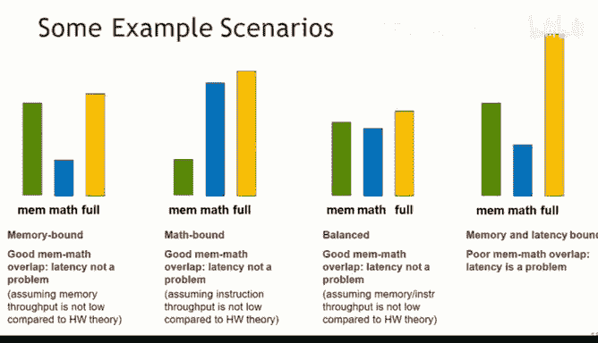
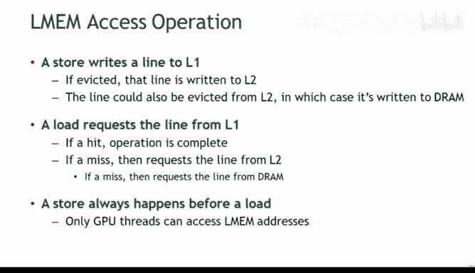
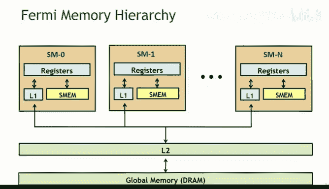
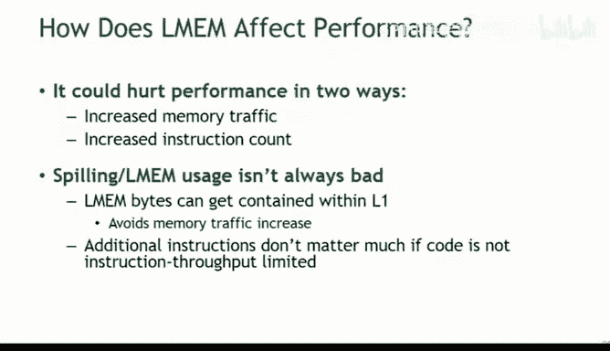
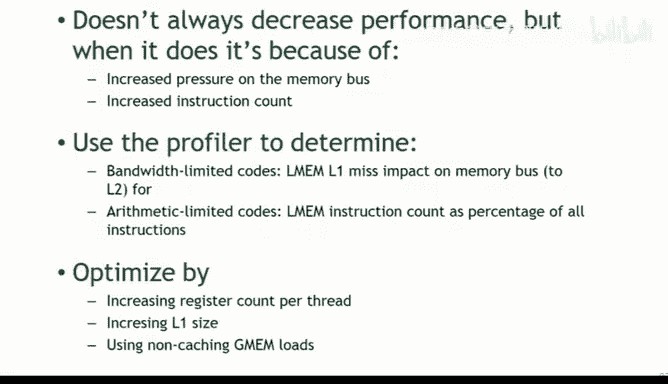

# CMU《并行计算机架构与编程｜CMU 15-418 Parallel Computer Architecture and Programming sp18》 - P12：Lecture 12 - 2-9-18 - Carnegie Mellon University.zh_en - GPT中英字幕课程资源 - BV18b421J7cA

Yeah。Okay， so let's stay focused on today， trying to avoid text messaging， instant messaging。

 emailing， all of that good stuff。So when I was first learning how to program in KUDa。

 there's this whole series of sort of webinars on the developers that video site that are really。

 really， really really good。

And so there were two of them I liked in particular that I got a lot at them。

 and I'm basically going to run through more or less what those are with you guys today。嗯。

And there's actually a whole lot more where these came from， you go to developers that video。

 if you really want to get down into the detail， they've got some pretty focused tutorials that really helped with a lot of the。

我话。So you've heard about the performance optimization process from us a lot， right， Randy， I， Todd。

 we've also sort of talked about this， right？You want to start out when you start out and have some good metrics for performance。

 understand where you want。😡，嗯。You want to understand what's limiting the performance of the kernel right if we're talking about Kuta。

 we're really talking about that kernel， we don't care a lot about what happened before it。

 we don't care a lot about what happens after it right what we care about is that kernel that executing in a massively parallel way on that GPU point。

😡，But you know， limit performance， memory， throughput， instruction， throughput。

 latency and some combination of the above。So you on the homework we had sort of the first assignment。

 we had that question five， right that said。Optimize or tell us why it doesn't make sense， right？😡。

And the big issue there was understand the problem was memory through。😡。

There was nothing you were going to do really to improve the performance of that thing by optimizing。

The instructions。That was way low in terms of instruction throughput and way high in terms of memory throughput。

 right？And so you want to understand what resources your program is using。

And I'd say in my own conversation， Id say what resources your program is using because these things can sometimes overlap and so time is an interesting metric because you can have processing going on while IO is going on so you can hide some of that memory time。

😡，And so you really want to know what resources you're using and how much of them you're using。

And that way you can understand， do you have more processor or resources that you can use or do you have more memory bandwidthm with you？

And so on。You want to address the limitsist to order the report。

If you look at things and where you are right now， I mean， you're trying to accomplish something。😡。

And ultimately something is stopping you right if you're trying to do work。

 there's something you want to do。😡，And it's taking time， right。

 it's taking time because something's not available。😡。

It's either waiting's waiting for particular resources inside the GPU or it's waiting for the memory buzzword it's waiting for something the only reason things don't happen sort of instantly is they're either being worked on or waiting for something。

😡，And so your goal is to figure out like what's it actually waiting for most of the time。😡，嗯。

You want't understand the hardware limits。If you want to understand。

 you know you want to do the analysis and figure out where the possible inefficiencies are。

 and then you were sort of want to tackle those。Sometimes once you understand what you know a big block is understanding like what's limiting me。

 oftentimes once you understand what's limiting you， right， some fairly simple techniques。

 could you put your phone down？😡，Take the Epod new year。Really。O。So。

A lot of times like once you figure out what the resource is。😡。

That you're totally swamping and that you're waiting for right it's really easy to fix and there's some very simple fix you can do to handle that Sometimes you look at it and say wow like。

GPU bound， and that's because I'm doing a lot of computation and I'm doing a lot of computation。

And that's much harder to thing to figure out， right？O。嗯。

There are three ways that you can sort of figure out。😡。

You know what the performance of your kernel is， okay。

 one way is just based upon algorithmic analysis， look at it and ask yourself。

 what do I think it's doing？😡，What are its basic operations here？😡，When I and I look at it。

Do I see a lot of memory operations， do I see a lot of computation？😡。

What is sort of my intuition about this？😡，Another thing you can do is use a profile。

Profilrs instrument the code basically。We're through with the execution。They basically encounters。

 the count things as they happen。😡，And they can give you an understanding of what performance is。Now。

 the thing about。You know， algorithmic analysis is we sort of know that that's I don't know things。

 right we know if we're simulating the execution of a program in our brains。

 trying to figure out what it's doing， that that's not a very high fidelity simulation。😡。

And it's not high fidelity for a lot of reasons， but among them are the fact that we tend to discount or not think about a lot of work that actually has to happen in a code。

 we may not think for example， that an address has to be computed in order for us to load a value。😡。

Right， things like that。When it comes to profilers。

 oftentimes we fall into the trap of thinking that profilers are sort of you know totally invalid。

 they're giving us perfect information。😡，But the reality is there's always this balance in life between how much you instrument something。

 how much visibility you have into something， and how good the information is that you get it。

 I mean you can have a full transparency GPU simulator that could give you perfect information about everything。

😡，Of course， then you'd wait a really， really， really， really， really， really。

 really long time for information。And you might not get any actual optimization done。Instead。

 profilers generally do what they can do with reasonable efficiency。

 meaning they keep various counters。😡，And in the end， it's up to us to interpret those kind。

They have simple names that tell us what they're intended to track。

 but oftentimes there are a lot of quicknotes and assumptions associated with exactly how they track up。

😡，And if we don't keep those in mind， when we actually use that information。😡。

We may not realize that we're not seeing the full picture。

And then there's code modification and code modification is actually one of the most powerful tools。

 although it's probably underutilized because it involves a lot of work on the part of the program。

C modificationification basically means that if we're trying to figure out。😡，How we're using memory。

 we modify our code in a way that's not doing in computation。😡，And then measures use of memory。

 and we're trying to figure out how it's using CPU， we modify it in a way that it's not using memory。

😡，And then we figure out what its CPU throughput is right the problem with this is that there are all sorts of weird things that happen when we try to do it。

 for example， the compiler optimizes out a bunch of code is no longer doing anything right you're no longer playing with memory like the compiler is not going to put that code in。

😡，And so actually going about code modification is can be challenging。

 but it can provide really good information is an important tool。2。So as we go about this process。

 right there are things that we want to know about the GPU and they're no different really than what we want to know about a CPUU。

 right the first assignment， like I said， especially in that question five。

 like to understand what you had to optimize， you had to know like what should my memory throughput be and what should my floating point throughput be right？

😡，And then once you did that， you could try to assess。

 am I bumping up against the memory limit or I bumping up against the processing limit？😡。

So we sort of meet those same statistics in terms of our GPUs， right。

 we need to know sort of what the theoretical memory limit is。Now remember。

 the theoretical memory limit is really that that is a best case throughput。

You're never going to see that。😡，like I told you before， in my code。

 I typically see half of a best case member load， right？If I see 50%， 60%。

 I consider myself to be happy。The NviDA presentation， when they present this slide。

 the person Nvidia said he considers like 70% or so to be the threshold。

For like fully optimizing memory。You want to know the theoretical instructions throughput。

How fast can you pump those instructions through？嗯。

It varies by the instruction type and it varies a lot by the instruction type and so you don't want to use throughput for one instruction for another instruction。

 you want to actually consult the spec you know and look at it and say okay。

 here are the operations I'm doing and here's what their throughput is and I'll have 50% of these and 50% of these and so I can expect a throughput of this。

😡，嗯。So now once you figure that out。All right， you want to based upon your own read of the code。

 for example， have a little model as to what your own。😡，I'm sorry。

 based upon your processor and your car， you want to have a mental model as to what that board's ideal CPUU。

😡，To memory ratios。Okay， how many instructions， how many， you know， per unit of time。

 how much bandwidth per unit of time， because that's what you want to do with your programs， right？😡。

If you fall below that ratio， for example， and you're using less memory per instruction per computation。

 then you're leaving memory bandwidth unused。😡，If you go in the other direction。

And you have less computation per memory unit， right。

 then you're leaving part of the floating point units unused。😡，So ideally。

 you would have a situation where the balance between CPUU and memory in your program was exactly the same as the balance of those resources on the actual board。

 CPU per memory measured as a function of time。😡，How many instructions per unittime。

 how much memory bites can I move per unittime， what's that ratio？😡，And ideally。

 that's what you're going to have in your code。Now， it's never going to line up exactly with that。

 even if you optimize fully for a lot of reasons， right？😡，You know。

 you're never going to get full use of that bandwidth， that's not even what that number means， right。

 that number means under the most。😡，Theoretical case。😡，What you could get， in other words。

 what's the width of that bus by unittime， right it's not really how much actual memory I can move because there's all sorts of contention that happens in the real world。

😡，In terms of computation， you're not going to keep all the functional units busy。

you're actually trying to accomplish some particular piece of work that's meaningful。

 not just keep the processor busy， and so in the real world， this ratio is a guide。

 it's not totally the end goal。😡，Yeah you looking for a rubabout。嗯。O。

So if we take a look at do some bit of algorithmic analysis， right。

 what we're trying to do is figure out our estimate。

OfHow much computation is going on for unit time and how many memory operations are happening？😡。

So we know in theory what that ratio is for our hardware because we've looked it up and figured it out。

 and now we want to estimate right in theory what it is for our code。😡。

And so if we take an example of a vector ad， it's going to read two， four by words。

It's going to add and then it's going to write one four by work。Okay。

So that one instruction is going to be dealing with 12 biketes。😡，Input， input， output。4our， four，4。

Okay， and then one instruction。嗯。And so the ratio here of that is much lower than the 3。

76 to1 coming off the last slide for。😡，CPU configuration。Okay。Right。

For this particular version of the board in Tesla M 2090 right， the ratio was 3。7611。

Higher ratio means instruction bound， low ratio means memory bound。那。嗯。

The profiler comes in two versions for KUa， there is a command line version and there's a goI version。

You really， really， really， really， really want to use the GuUI version。😡。

Okay and here's the reason why。Trying to use the command line version。

Approximately like trying to drive your car from under the hood。

all you have is a screwdriver in aham。It's actually possible。

But I have a feeling that before you look up， you're going to run into something。

The problem with this is that the profiler tracks all sorts of little things， right。

 basically what it is is it count a bazillion little things。😡。

And these bazillion little things are not individually， particularly meaningful。

You add a whole bunch of particularly meaningful of these tiny little things to get to something that's actually meaningful。

RightSo when you're in the command line mode， there are all of the individual counters where it's counting something from over here and something from over here and something from over here。

 and what you'll really need to do is add them together to count everything going into your L1 cache or something。

😡，All right， when you're in the command line mode， you have to recognize the right counters and put them together yourself。

😡，You can do that， the reference manual tells you about exactly what the counters are and exactly how to add them and exactly which groupings you want to understand what part of performance。

Or you can use the GuUI version and it already has done this for you。😡。

Which leaves it open to a lot less chance of human failure。Having said that。

 if you're more advanced than me， by all means， dive into the command line version。

 and maybe you can find some things to the individual counters that I can't。But really。

 you want to use the GuI version of the profiling， they are not at all equipment。

They are two different tools， and the GuUI version is the one that presents things in a meaningful way。

嗯。So。There are some counters there that are worth paying attention to。

 instructions issued is a fairly nice counter， right？😡。

For understanding what's going on in terms of computation， DRAM reads and DRAM writes。

Also pretty nice to understand。OK。嗯。There are a separate set of counters L2 cache。

 and I guess that's worth a pause。Well， okay， we'll talk about that in a minute。

 we at least stay with this for a second。If your code hits in the L2 cache a lot。

 you may want to look at the L2 counters instead of the overall DRA counters。嗯。Okay。

 so these counters only count on one processor， one SM。😡，Not one core。But one SF。

So an assumption we have to make in dealing with this。😡，Is that all of the Ss are symmetric。

In other words， we have 20 Ss， we want to take the count we have and multiply by 20。

Does that make sense。We assume that they're all handling a workload that's about the same because they're all dealing with the partition of the original job。

😡，That might not be true to any particular instance in time。😡。

But hopefully as the work gets scheduled to these Ss。😡，Over the course of our program。

 right that's going to average pretty close。So it just chooses one SM at random to call。

So I have no idea which SMA chooses， instead of saying at random， I'm going to say arbitrarily。😡。

And the reason I'm going to say that is I don't think they actually call a random number generator to ensure the distribution is random。

 I suspect there's one that's instrument。I don't know which one it is。Again。

 I think this is one of those things where maybe if you go into the command line version。

And dive into the individual variables， you can get what you want， but for a lot of reasons。

 in just in terms of how it works。I can't count for more than one。

In terms of the state variables that using the whole things。

So you're not going to be able to get a cumul account， but suppose with the command line you could。

Have it like run the program several times and each time count for a different one。

 you may be able to do that in the command line one， yes。I vaguely remember that you can。

 although don't hold me to that because I don't use the command。

I attempted to use it a couple of times and determined that it was。More effort than。

How was going to put it。嗯。But the important thing here is that an assumption you have to make。

 profilers don't give you perfect information。😡，There are some assumptions they make in order to present it to you。

 and we have to understand that this is showing us one S。嗯。

And so that needs to be multiplied out to show us what's going on across all the Ss， because that's。

 for example， the workload memory see。😡，嗯。All right。

And so we want to do you know basically we have we're using the visual profiler right。

 we're going to do the same thing we we talked about doing algorithmically right， we started out。

 we figured out you know our processor throughput and we figured out our memory throughput and divided them to get a processor to memory ratio。

😡，Right。For one instruction， how much memory can we move？

And then the next thing we did is we looked in our code。And survey says。

 did our analysis of this ratio。😡，Knowing。Okay， no ain't that our analysis is not going to be perfect because we're missing a lot。

If you really want to try to do better， you can actually disassemble it just like you can disassemble your assembly。

 like you did in 213， you can actually disassemble your video code。😡。

you can object dump it and disassemble it， and then you can actually count the basically the assembly instructions。

 and that'll give you a little better a sense because at least then you're seeing things like address computation。

They're not hidden。嗯。All right， so now we're going to take we basically and do the same thing with our profiler。

 we're going to run our profiler， it's going to give us these counts and now we're going to do some math to adjust them。

😡，Okay， now。One thing to note is that the profiler。Counts 32 bytes in terms of memory access。ok。

So incremental 132 byte access to D ramp。The warps are playing with 128 fights at a time。😡。

So as a result， you can to see it's going to be number of SMs。😡，嗯。You know，Times 32。

 times instruction issued。And so we had to multiply by that 32 bys。Right。

 to get where we're going there。So we're looking for bytes per unittime。😡。

And this is counting an increment for each group of 32 bytes， we need to multiply by 32， right？😡。

Make sense。Every time it counts one， that's 32 bytes moving。And so if we look at this computation。

 number of SMs times 32， this 32 is because it's 32 bytes for DMax。😡，Time the instruction is you。

And then our ratio to 32 bytes time D reads plus DM writes。Again。

 it's 32 bytes because that's what we're counting。And then the D we each DM write to attracting two separate variables。

 so we add them together。And this is giving us。The instructions。To memory ratio。2。So now we get 1。

49 to1。😡，那。1。49 to1 is the ratio that we got when we profile it。

What was our first Wag Wild as guess when we did an algorithmic analysis？😡。

We're looking at one to 12。So a huge difference。Right now again。

 if we'd actually taken in that high level C code and looked at it in terms of the assembly code and been able to account for。

😡，All the little details that would have been a more accurate estimate。

But it still would not been as good， probably as actually profile。😡，嗯。

The visual profiler can also report IPC instructions per clock cycle， right。

 a measure of instruction throughput。😡，All right， and gigabits per second。All right。

 so now we have another way of estimating these two things。So far we can estimate by the source code。

 our high level algorithmic analysis， estimate by looking at the assembly a more detailed algorithmic analysis。

 we can profile the memory usage。😡，And the CPU usage based upon the counters。

 how many times do we read 32 bytes and how many times do we execute instruction？😡。

And compute the ratio。Another thing we can do is look at the instruction per clockite count and look at the gigabit per second count。

 gigabyte per second count。And again， we can compare those back。To the specs for the hardware。Now。

There are some things the profiler doesn't actually do perfectly。😡，Okay， when it does the IPC。

 it assumes 32 bit floating point instructions。😡，If you're using 64 bit floating point instructions。

 it doesn't take that into account。😡，嗯。And again， the presenter of this said that in his mind， right？

😡，70% is a good utilization if you're starting to bump into the 70% limit。

 you're probably not going to get much past that even with extensive optimization。😡。

And so close is sort of approximate here。And so if we take it this way。

 the instructions for a clock cycles are not to be 0。55， the Gtspers out of a possible two。

 why do I say out of a possible two， where does that come from？The spec， that's exactly right。

So the spec for this said is that the maximum is two for the instruction that we're doing， and again。

 this is for the instruction that we're doing， and we're seeing 0。55 out of two。That's not great。

 right， that's a quarter。We're looking for 70%， 75%， something like that。

 so we can probably pump instructions through three times faster。😡，Alright。

Memory throughput is 130 gigabytes per second， thats 177 gigabytes per second。

Which of those sounds more constrained to you？25% or I don't know。13 out of 17 turns out to big。

Yeah that one， right？Whatever that is。也过这个这怎呢。73%。13 at 177。73%。Okay so memory throughput is 73%。

 that's a pretty darn good throughput， right？😡，Instructions， a little better than 25%， not so good。😡。

This thing is memory bound or processor bound。😡，Memory bound， right？

The reason we're not able to execute more instructions is because we can't feed them fast enough。

 we can't get them their data。😡，Because our memory system can't deliver it。

And there you can see it on the actual profiler screen just how that's actually presented IPC colon 0。

55， Max and IPPC is two， a chief global memory throughput of 130。83。

 peak global memory throughput rate of 177。8。That certain us。嗯。When we do algorithm analysis。

 we said this right， we do always underestimate these things。

 the algorithmic analysis assumed there was one instruction， the vector at。😡，As it turns out。

 there were 17 instructions。There was a lot that had to be done in order to compute the addresses and feed that vector app。

I told you that you could actually take a look at the assembly and you can。

 the tool is called CUOBJW。Q to objectject。And I actually have fun with that。 Yeah。

 what's the comment for the。你发咯。I think it's C proud。And as in that same bin directory。

 if you look at your you in the top of the handout。

 we have the path set there and you see it' blah blah， blah blah blah， blah， bh bla， blah blah bin。

That blah bla， bla， is like user Depot， Kuda Ado or something that's the tree where all the kuda stuff is And so anything you're looking for related to Kuda is going to be in there So the tools are going to be in the binI directory and so you can list user Depot。

 Kuda Ado V and you'll see like all the kuda tools including the profile。If you're looking you。

 include that' where you can find the header files in somewhere。Okay。

 most of these counters are reported per a single SM， not the whole GPU， except for the fact。

 haha ha that the L2 DM counters。You know， our you know， our overall。

The reason the L2 and DRAM counters are overall is because your L2 and DRAM are shared by all。

再没 sense次。There's only one memory for all of those in an SM。

 you're sharing the same memory so the counters are common。

 it doesn't care if this one reads it or this one reads it。

 it's incremented in the counter that it's been read。The counters are associated with the resource。

 not the user of the resource， so if there's one resource per user。

 it doesn't matter which way you look at。But if the resource is shared by all the core， right。

 then the resource is keep an account。嗯。There's also some other technical details。嗯。In some cases。

 there are encounters that can't be updated together。

You can get this set of counters or you can get this set of counters。

If you're using the command line version， you have to know those rules and collect them separately over multiple rights。

😡，If you're using the GuI version， it will execute multiple runs and collect the counters for you。

Again， I don't touch the command line version because there are these large targetss and I falled all of。

Every one of them。And so be warned， this is another example of the target。

 I will not cover all carpets today。嗯。O。呃，Now。Countervalues may not be exactly the same from multiple runs。

 there was actually a question about this on Piazza and Professor Bryant sort of answered it with a question。

 and it was actually related to one of our scripts that does timing。In this case。

 we have to do multiple runs for a couple of reasons。A。

 multiple runs are going to give you a better measurement of time， and B。

 we need to do multiple runs to get a full set of counters。😡，When you do multiple runs。

Things are not going to turn out exactly the same between runs because the scheduling is dynamic。

Remember that once you give the work to the GPU， the GPU dispatches that work。

 and the dispatch can be slightly different from one run to another。😡，And as a result。

 these counters may vary slightly they shouldn't vary a lot。But they may vary slightly。

And that's because of the onboard schedulecheding。So when anytime we talk about things being equal。

 we really don't mean equal， we mean close enough。Right for performance measurements。

 we shouldn't get hung up if we run the thing three times and the performance measurements are exactly the same。

 probably they not exactly the same， if you drive to work three days in a row。

 you shouldn't get upset that it takes you 15 minutes one day and 15 minutes。

 30 seconds the next day and 14 minutes， 27 seconds。

 the next day right it's taking you about 15 minutes。

And that's what we need to know for performance modeling， right？

We just need to understand about how much， and that's going to let us figure out which road to take。

We shouldn't feel like the road is moving because it took a slightly different amount of time each day。

 the road's not moving。Your code isn't changing。嗯。Now， modifying source code is extremely powerful。

 extremely powerful。😡，Extremely powerful， because now we can actually start to isolate。All right。

Because when we actually start to execute things， right， one good thing that happens is we may have。

😡，Processing going on， while memory is moving， hiding some of that memory laency。Right。

And so the memory latency is really different if we have processing memory， processing memory。

 processing memory， than if we had processing on top of memory， hiding some of that latency。

So being able to actually isolate your code and look at memory usage and look at CPU usage。

Is going to be able to show you what those two are and how they overlap。嗯。

The bottom line is what we'd like to do is get a version of our kernel that has exactly the same memory usage pattern。

 except doesn't do any computation。😡，And a version our that has exactly the same computation。

 but doesn't actually do memory stuff。😡，And at the surface， this is pretty easy to do。😡。

But then the problem is the compilers are intimate， right because once we don't move data。

 the compiler determines the data is not changing and it optimizes it out。😡。

Once we don't do computations， it's not going to bother load of the data。😡。

And so we're going to have to use some tricks to get the compiler action to play a along。😡，Now。

Take a look at this graph on the web。Okay， memory is green， math is blue。

 everything together is yellow。So this is some theoretical kernel。😡。

And that full graph is the time it takes to run normally if we're just running it。😡，ok。Now， if we。

 in theory， isolate it， so it's doing。The exact same memory operation。And everything else， you know。

 no computation， we now see this green ball。If we do exactly the same thing。

 except we leave out the computation， sorry， leave out the memory and do just the math。

 we have the blue bar。Now notice that if we stack the green bar on top of the blue bar。

 it's taller than that yellow bar。😡，Why。Because it does memory。大し。That's exactly right。

 exactly right， because in the real world we sometimes overlap memory and processing， that's good。

 that's called hiding latency。😡，Okay， now if you take a look at the far right。😡。

You see that if we take the green bar and stack it on top of the blue bar。

 it's the same sizeish as the yellow bar。😡，That means the latency is not getting hidden。😡。

Does that make sense？And then we can see things in the middle where if we look at the one on the left。

 we see that we're seeing， you know。A small amounts of memory， a lot of math。Well， unsurprisingly。

 that's a math bound process， right， that's a math bound kernel。😡。

It's beating up the GPU for computation and leaving memory by sort of a line。😡。

The one on this side the middle， green， blue， yellow， well， you can see that's pretty balanced。

It's also very overlap。Nice latency hired there。So our goal， right。

 is to be able to get this information。😡，When our program is normal， get the yellow bar。

 modify our code。😡，So it's only doing the memory operations， get the green bar， modify it again。

 so it's only doing the CPU operations and get the blue bar。😡，And if we do that， right？

We have。Outstanding， really outstanding information。As we do this。

 if our goal is to produce the memory only kernel， right？We need to do two things right。

 of course we need to modify the kernel， but we actually need to make sure that we didn't mess anything up。

😡，Because we change stuff， the compiler changes stuff， and now we're not in the same place。😡。

So if our goal is to make sure that the memory usage is the same and we've just gotten rid of the processor。

 we need to profile it whole。😡，Remove the computation and profile it whole again。😡。

And we need to make sure that the memory usage hasn't changed。

The load store count should still be the same right if the load store count is not the same。

 that means the compiler optimized out some of the loads in stores because they weren't used for computation。

😡，And now we're not getting good information because it could have optimized out loads in stores that in the real world had a big impact。

That were the ones that pushed that ratio in one direction or the other。Okay。

We could look at store only， also removing lows。We could look at math home。

Math only sort takes is really tricky because if we're not moving values。

 then the compiler just optimizes things out， right？😡，嗯。And so we to fooler is not doing that。

Here's the example of had a foodla。😡，There's this- so compilers generally analyze things on the basis of what's called the basic block。

😡，But right now， we'll just say a function。A compiler is going to optimize one function at time。

 it can't optimize path through functions because functions are called in different ways in different circumstances。

😡，So unless you inline a function， it's not going to get optimized in context。

 it's going to get optimized as now。😡，So。This slide being passed in。😡，In theory。

 different calls to this function could get fed a different flag， right？😡，Right。😊，Sure。

 and so it can't optimize that flag out。😡，Fair enough。

Now you see we have a test based upon that flat， one equal equal value times flat。😡，Well。

 if we always pass in zero。😡，One equal equals0 is always going to be zero， right？

So that code is going to have to be there。😡，Right。They can't get optimized out。

And so things like this have to be done to trick the compiler。 and so basically。

 we're going to start out。We're going to provi it， we're going to get out of load store count。

We're going to try to remove as much of whatever is we're removing， the load store counts。

 the instruction counts， and then we're going to make sure that what we want hasn't changed。

That if we're looking for instructions， that we still have the same number of instructions。

 if we're looking for memory， we still have the same number of loads in stores。😡，If not。

 we now have to play a game of what's the compiler doing？😡。

And then we look at that code and analyze it and ask like what here is not changing so the compiler can take it out。

😡，And now we're going to try to fix that。To fool the compiler is not taking it out。Now。

 if we can't figure it out， we're going to have to go to the assembly。😡。

Because the assembly is post optimization， right？😡，The compiler compiles it。

 does whatever have an optimization of doing， and then it produces the actual code。😡。

And so at that point we don't have to guess what the compiler is leaving in and what the compiler is taking out。

 it's all there， only thing we have to do is fight the resentment。😡，But as you guys know from 213。

 right， that's fairly doable yeah， so if you're trying to convert it to memory only and you're trying to reduce commutations。

 is it safe to get rid of address calculations because then you're assuming uniform memory access。

 right？So okay， your question is we want to， we want to track。

Computations so we're trying to eliminate memory the way around the way around you want to track memory。

 but so you want to get rid of calculations， right， correct So if you were to do that。

 maybe you just hammer one memory location instead of doing all these extra calculations。

 I it safe to do that because can you assume uniform memory access or would you still want to compute different addresses。

Profil memory access is that so we can' assume uniform memory access。That's not a problem。

Having said that。嗯。You know， having said that， cash effects can be a problem。

So it's not like we're in a nuer architecture， we're pulling something from a different processor。

 having said that there is a cache。嗯。And so。I'm trying to remember right now as I stand here。

That cache is not going to affect， don't hold me to this， but as I stand here。

 that cache is not going to actually affect the address computations because that's not local storage。

😡，So those are going to be invalidated on right。So I think you're actually。

 with respect to cash effects， I don't think that matters。 I think I' misspoken on that。

So now the only question， given that I'm correct about that， the only question is does you know？

Do those stores matter for our computation stream， that is to say is somehow our address computation limiting our memory through them？

And that's a different question， and you can answer that question separately。

you're going to see that when you go measure the computation isolation。

 you're going to see that your computation is the bottleneck。

 and then you can look at what percentage of that computation is addressed computation。😡。

And then determine if that actually turns out to be a bubble。I mean， normally I would guess。

 I mean hand wave， hand wave， hand wave， normally that's probably 5%， 10% ish。

 not going to be a big deal like 2% to 10%， Having said that I can imagine some situation where those addressed computations turn out to be painful。

Does I answer your question？You' sure the ba out there。因而这。嗯。Okay。

 this is a very powerful bullet point。Removing pieces of code is likely to affect Reg count。

This could increase occupancy skewing the results。That makes a lot of sense if you're intimately familiar with the architecture。

And you guys know enough to figure that one out， but I'm going to make it a little easier for you。

Digestive。嗯。So when it comes to these things， there are registers。Okay， just like you have。

 and the registers are used like you've used to in 213 and the registers are used to maintain state。

Okay， if you have， each thread needs registers。So if threads are using a lot of registers。

 the number of registers can limit the number of threads you have。

There's a fixed pool of registers and threads need them to maintain their state。

So if your threads have a high demand for registers。

Then the availability of registers can limit the number of threads you can dispatch。

Because you don't have enough hardware to maintain those variables。Does that make sense？

You looking at me like it does。I have a question if there is like？Part of the kernelel that。

Requires a lot of registers， but then the rest。The rest of the kernelel doesn't really， can you？

Can you basically schedule like？Threreads time to。Use like a big portion dynamically。

 so like drug number one uses almost like 80% of the registers。And then threatened by two pieces 80%。

three。Okay， so there's good news and bad news to you questions you'd like。

 what happens if my colonel is using a lot of registers at some point。

 less registers later on and whatever？😡，The good news is the compiler does a huge amount of analysis related to registered usage and optimization。

 so in terms of what to allocate to registers and when，It studies that very carefully。

If there aren't enough registers， it can actually spill it to basically the equivalent of stack。

 local storage。😡，So the good news is that's very carefully analyzed。

The bad news is that there's no way to overlap that dynamically because like these two kernels are executing and we can't coordinate them in some way。

Mid execution。Because they're actually on the hardware doing their thing。Does that make sense。

So good news is yes， there's a lot of work that goes into optimizing those registers。

 the bad news is it's not at runtime。So removing pieces of code is likely to affect the total register。

So that is to say， if once we start removing things。We're not using data。

We've taken it out of memory， which is what we wanted。😡。

But now we've also decreased the use of registers。Now， because we've decreased the use of registers。

 it may turn around and dispatch more threats。And now we've just messed up our analysis。

Do you see that。Because now we're not comparing the same number of threads being dispatcheding。

So we need to make sure there's the same occupancy。All right。

 so basically what we do is we play with a third parameter to our launch。Alright。嗯。

We basically forced them to use more memory。😡，Thereby maintaining your occupancy the same。😡。

So if we know our total amount of memory， when we ran this thing the first time we knew like how many threads we had。

We knew what an occupancy was。Now we run this again and we see our occupancy went through the floor。

No problem， either decrease the amount of shared memory or increase the amount of memory used by thread to bring your occupancy back to where it was。

😡，That way， the occupancy that went up because registers were met suddenly available comes back down because shared memory is not available。

😡，It's much easier to constrain shared memory than it is register usage right because like how do I make register usage what registers can be dynamically allocated because from 213 we know the general primary register。

😡，I'm pretty sure that every thread I need to use those general purpose registerars for sure， yeah。

 so what hard of registers it can be dynamically allocate so all the registers can actually be dynamically allocated。

 sort of sorry。Let's be careful about dynamic allocate。

All of the registers can be allocated at compile time。

So the use of the registers is happening at runtime。

But according to the prescription that the compiler put out。

The compiler is what's doing the loads and stores into the register。And that's the same in 213， 213。

 something does not get into a register unless you do a move。And in KUDa。

 things don't get into registers unless you do moves。Does that make sense。

 and now the compiler is what's doing the analysis of the registered usage to find the best pattern of putting things in there？

Buget you just was like， yeah， and each。Core has its own set of registers。

 each core has its own set of registers。Ohre we're going to ask a similar question。

So each core is processing one more bit of time。Yes， that's correct。Within a war。

 do we have different？Treads that are。Different instruction like different program No， no。

 no same program same different instructions in that program So each warp is executing the same kernel right。

 same kernel and。Not necessarily the same instruction， though。

Is that rightOr is it just kind sort of masking the instructions kind of that kind of？I mean。

 at one level， the model is these things happen in locksstepad at another level they don't really。

 and now we're beyond my death。😔，And I want to just go ahead and tell you that。O， so。

We're at a core executing one more， all the wars well assume the same thread and all those threads。

Are using registers according to their assembly。诶。Does each like ALU？

Have different registers or it's one big block of registers for all the ALUs in that。

It's one big block registers。Yeah， so the registers are definitely a shared resource among these threats。

Which is why that the number of threads can be registered limited。嗯。

And so basically what's going on here is once we optimize。

 we've taken out the memory usage because that's goal was to focus on processor。Sadly。

 that means the registers aren't needed anymore。So when you do the kernel launch。

 that's going to have the force the compiler to。Genrate different。

Assembly based on a number of blocks。Correct， it's not really like a function call in that ways really good end it's really。

 it's changing the way it's changing well， it's changing。It's changing the assemblies。

 the answer is yes， it's changing the assembly because it's statically built。😡。

But what it's changing is the parameter as the number of threads。

 it's allowed to dynamically dispatch。So ultimately， these things getting dispatched in hardware。

 the hardware actually handles the scheduling。😡，But the compiler parameterizes。

I was just thinking about register usage， like maybe we'll use the registers differently if it knows there's my Ie is block so at that point we're beyond my death。

But I keep bringing you back because I just can't help you there。I'm just being really。

 really honest， but what I can and what we need to know in order to understand this。

Is that threads depend upon memory and registers。And if we optimize out the loads and stores。

 the memory usage， we're not loading to a register or storing from a register。

That register now becomes available。Now the compiler thinks I have tons of register。😡。

I can have more threads。Right and now what happens is we're dispatching more threads and we're not comparing apples to oranges。

And now our performance metrics don't line up。So we have to do is force it to have the same number of threads by just。

By just requiring more memory per thread， and now we've constrained the local memory。

So we've gotten control over by a resource that we can specify。Yes， so。Comp pie。 Yes， we have。

We compile kernels into kuda code。The hardware dispatches these。Tnels。This code onto。It's。Of course。

呃，How。It's the compiler that。LK。When。Compils basically basically say， I mean。

 you and your code specify certain things， I want to have a certain number of threads per block。

 blah， bh blah blah blah， and then you have a launch that tells the scheduler basically onboard what to do。

And you parameterize that。But the scheduling is dynamic。

 the scheduling is not statically done by the compiler。

 the scheduling is done dynamically on the board， just like process scheduling is done dynamically by the operating system。

 not by the compiler。😡，Right，估计还有。You have。1。A wild program。For the。Kal。

And that kernel is being run on multiple threads。Right， how does。一起。thhread。

How do we get registers from there we as programmers don't No， I'm sorry。

 how does the you know what maybe this isnt important so the compiler has an understanding of the GPU architecture。

In the same way that your regular C compiler isn't understanding what your process were。

When your C compiler is trying to figure out when you say a plus B。

 it needs to load a value from memory into a register。

 to load another value from memory into a register， do the ad， store it into register， right？😡。

Now sometimes it's going to leave that variable and register because the next thing it's going to do is times。

You know， E or whatever， sometimes it's going to store it back to memoryate and use that register for a different purpose。

That's called Reg allocation。And that's a job a compiler has。The same thing is exactly true here。

 except for the fact that the register allocation is that the registers are shared among。

Certain instances。And so if you have more threads， the compiler has fewer registers per thread to play。

And it has to optimize for a smaller set。So if it knows optimizing to have X threads dispatched per unit of time。

 it has to use fewer registers per。是事种。If it knows you're allowing up more registers per unit of time。

 then it has more it。就 were人支不 her。So。More it allows for fewer registers。

 fewer it allows for more registers。The compiler knows that certain incidents。based on the thread ID。

 we'll use a lot less registers than others。Do analysis based on that Well， all instances。

 the challenge there is that all instances of the kernel are exactly the same。

 and so they all use the same registers。Does that make sense， they're all doing the same thing？

So they all have the same register to it like if there's an if statement and if your thread ideas。

Even oh， I see what you're saying， so the answer to that is I don't know。

What we would have to do is we'd have to compile it， disassemble it and look to see。

And look to see my belief is that the compiler would。

 if that information was available statically and within a basic block。

The compiler would be able to figure that out。If that was not the case。

 then the compiler would not be able to do that。And so since the compiler is dispatching is compiling the code。

 that basic block is not knowing which thread it is。

 I don't think it would be able to do that optimization。That's my。

 if you're asking me to guess based upon my understanding of how the pilots work。

 I don't think it'd be able to do that because that would require take one piece of your code and generate two different pieces of code。

That， somehow。The hardware would have to know which one to use。And that's not how this works。

What happens is it generates one kernel and then the hardware schedules that kernel。

The other I think about it， no， the compiler cannot do the optimization you post。

So I hope that answers your question， do you see why？你是O。爱 right。嗯。O。😊，So I mean。

 here's just an example， okay， we run through and basically we have numbers。

These numbers are exactly the same as that color chart I showed you before。😡，Memory， math。

 everything。They're just like numbers instead of colored bars， if you want colored bars。

 throw them Excel， pick your colors。😡，I sometimes do that。系冇话。Okay， instructions issued， Vul kernel。

 memory only math only。Total DM request for blah blahlah， okay。So。Obviously， when we're doing。

 if we look at this， right， something should captured your attention about in this case。

 those instructions issued。😡，10，000， 14，000， how far a apart of those， a lot are little。In some ways。

 kind of a lot， but if I'm supposed to be doing memory only and I have 1000 memory， 10。

000 instructions。😡，And I'm supposed to be doing just instructions， I say 14，000 instructions。

 what's that sort of a hint about？😡，Your feedback。还没。Yeah， so when I execute things normally。

 I have 20 million instructions。Math only 10 million。I'mSorry， only 14 million。

 memory only 10 million。Right。thing。My eyes still don't add。Okay。

 those don't out to add 20 million M。😡，These women mucking with a cold。Right。

Right because this isn't there's no one's taken a scissor and cut this out cleanly right we've cut this out as best as we could。

 which is imperfect。Does that make sense， so it's not actually a plus b equals6？

It's like a plus B plus goop， right？Is C less sum and then sum。

So those things are not going to add exactly because we were not able to separate things exactly。

 it still took some processor to load stuff in the membrane。😡。

It still took some processor to compute and address to load something in memory。And so on。Okay。

 so the instruction to by ratio is 3。21 overall。So that is that there's a good overlap between math and memory。

嗯。Okay， how do we know there's a good overlap between math and memory if I go look at those times right and I take memory memory only and I add it to math only。

 right I get 37 milliseconds。😡，That's significantly greater than 25 millisecons。

That suggests that there's  12 milliseconds of overlap。😡，Does that make sense？

That suggests about half the time memory and computation are happening at the same time。😡。

And so our memory access is hidden。That's not bad。那。嗯。This is a curious bullet point right here。

And it's worth paying attention to。How we measure memory and from where we do is critically important。

😡，If we look at our application like our code， and we see that we're moving X bytes in our code。😡。

And then we look at our profiling and we see that we're moving some y bitetes through。😡，For example。

 we think we're moving 72 gigabits per second of data。

 and this thing says we're moving 125 gigabits per second of data。

That's something that's worth our attention。Because what that means is when we want a value。This big。

 it's bringing in more stuff than we care about。😡，And so we're wasting memory throughput on things we don't need。

😡，That's a pointer that there's something that we can optimize there。

Because there's a block size that's effectivenessing this for something like that。

So when we see this and we see that we're tapped out on memory。😡。

Right we have 177 gigabytes per second of bandwidth。

 and we're using 125 of it that's pretty tapped out。😡，But yet we really only care about 72。

 there's a good chance for optimization there。😡，Because we better we can bring in just what we need。

 right？😡，We're going to have a lot more room for memory and we're going to reduce that bottleneck。

 allowing us to do more computation。嗯。So if we look at this case， the instructions per box is 1。2。

 60% of what's theoretically possible， that's ballpark for me。😡，The author of this。

 who knows way more than me， is probably better than me。His ballpark is 70%。

Nith of us are going to claim that 60% is bad。😡，So optimization should first focus on its memory through potential。

And in particular， we can focus on what it is that we're moving。

And how we can optimize the use of that memory。公开。And， more slides here， this is not the end。

 but see how we do react。O。So basically the summary here is we want to take a look at stuff in our code and come up with our own understanding of what。

😡，The you know of how many instructions we're pushing through per unit time and how many bytes we're pushing through per unit time。

 we could take a step down and look at it and assembly where we're going to see way more instructions and there's only one way that goes right when you look at the assembly you see way more instructions and then that number comes up。

😡，Okay，We can profile it。And we can see those counts， although profileing isn't perfect。

 we talked about the fact that it's catching some things on one run and some things on another run and unifying these things looking at one SMM and going from there。

 blah， blah， blah， there's a whole bunch of nuances to that。😡。

And then we can actually start adjusting our code。Which is going to give us really good information。

If we can get it adjusted。

So now I'm want to dive into this details of memory a little more。

And I'm not sure that we're going to finish this slide deck， but we're going to go as far of。嗯。

So local memory basically serves the same purpose as the stack did in 2013 when we spilled registers onto the stack in the old 32 bit architecture。

 or even in the 64 bit architecture， if you had way too many registers in use。

It's usually used when one runs out of resources and one of these processors。

 it's called local because each thread has its own private area。

 let's be really careful with that bullet point because it lies。Okay。

This is the same memory as anything else， this is the global memory。😡。

The only difference between the global memory and。And this is the cashching policy。Okay， in general。

 stuff in global memory is not cached， you write through the cache， invalid on right。😡。

Whereas local memory is cash。ok。So it's the same memory， it's just a particular use of the memory。

Okay， local memory access operations。So let's say we have a store that's writing into the O1 cache。嗯。

If something is evicted from the L1 cache， it's written to the L2 cache。😡。

Something's victims in the L2 cache， it's written to memory。ok。

The loan is requested from the level one cash， if it's a hit， we get it out of level one。

 if it's a miss， then we try to get it out of level two， if it's a miss at level two。

 we get it out of DR right this is our memory hire just like in 213。嗯。不前。

And so here store the picture。All right， here are SMs， our SMs， remember are not cores。

 we have multiple cores per SM。Those cores are sharing the same L1 cache， the same S memory。

 and then you can see that this L2 memory is across all of our。Processors， okay。

 and our global memory is across all our。

Local memory is used primarily for spilling registers。

The other thing it's used for is sort of interesting。If you're using an array。😡。

And array is something that is naturally an in memory data structure， right。

 it's base plus size times index， right？😡，So map that array to register。

The compiler has to be able to figure out the indexing in a way that it can do that。😡。

If the compiler can， it's going to use registers for if that' are available。😡，If not。

 or if the registers are not available， that's a standard Reg's village。

 it's going to put the array in memory so it can do normal array indexing on it。😡。

And now it's part of this local storage。嗯。So this local memory， this spilling and this use of arrays。

 can affect performance in two ways。They can increase memory traffic and it can increase the instruction count。

It obviously can increase memory traffic because it's a use of memory， right？Ultimately。

 if this has to be read from memory， it has to come across that bus and shares bandwidth。

Lobal memory is something that's managed by the compiler。😡。

That means the compiler is putting in instructions to do it， take this register and store it here。😡。

Take this memory。Loadered into the register。So the management of this local memory requires instructions that are going to affect our instruction count。

This is again， something you're not going to see if you look at the code itself at the top level。😡。

And as part of the complexity and model of what you look at when you start to look at the code actually in assembly。

😡，嗯。Spilling from registers into local memory is not always bad。😡。

Local memory accesses oftentimes are contained within the level one cache。

 if they're contained within the level one cache， they're still pretty fast。嗯。

These additional instructions to store something to local memory and bring it back only matter if your code is。

😡，You know， bottlenecked on instructions， if your code is bottlenecked on memory。

 then these don't matter at all。😡，So there are relatively few instructions that are oftentimes hidden by memory latency。

 and then instructions may not be the model that have。😡。

Right。So if we're trying to optimize this， we're going to check to find out what our local memory usage is。

 right unless we know we can't optimize。😡，You cannot， in any reasonable way。

 look at high level code and figure this out。😡，Okay。

 you're going to have really no way of understanding what the compiler is going to do with registers。

 looking at your scene code for a kernel。😡，Having stared at the assemblyly code。

 I can tell you good luck to you there too。If you can figure out what's going on in terms of this。

 based upon reading it， you're better than me， I cannot。😡，Okay， just。

I'm sure there's somebody who can， it ain't me。And when I can see the movement in and out of registers。

 I just sort of filtered it out and say， what is this doing and I consider myself happy？😡，嗯。

So really， if you're not going to get this by looking at the code。

 you're going to have to profile it， that's it。😡，嗯。Once we understand？

How much stuff we're moving in and out right then we're going to have to check the impact of this unperformance right in other words。

 okay great， this is how much traffic I have associated with local memory。

 what percentage of my memory traffic is that？😡，If that's a tiny fraction of your traffic。

 don't bother to optimize it， right on dull law， take the big slice of the pie， not the small one。😡。

Something any two year old can tell you。Right， what do you want， this piece or that piece，Right。

Channel you and your child here， go after the big slide。😡，嗯。So。In terms of optimizing。

 we can increase the register count， increase the level one size， or use noncching loads。

 so we'll talk about those three options in a second I just want to notice。

 I want you to notice under compiler output， you see that minus XPT XIS minus v minus Abbbey equals no。

😡，That's the magic you put in there， the goop you put in there so that you can actually。

 the profile will actually give you this。😡，What does that group mean？嗯。

The XptT XIS says to pass the rest of the options to the asmbler。😡，The minus v is verbose， I mean。

 give us all the output and the minus Abbbey tells it not to use the application binary interface。

 which is a particular stack discipline。😡，I have no idea on earth。😡。

Why you need the minus Abbbey equals no flag， I'm not going to claim I do。😡。

I'm just going to tell you that if you leave that off or make it a yes。

You're not going to get this information， the output。

 at least you're not going to get good information， the output if you make it no。

 it's going to claim the flag is going away and will soon be deprecated。😡。

I believe the flag has just changed to minus is Abby Dash。😡，Something equals no。

 so it hasn't changed much。But we're still running version eight here。

 so it's minus Abbbby equals no if you move to version9， that flag is slightly different。

 it's like minus Abbbey compile or something like that。😡，But this is what works in games。嗯。Okay。

 so if we're having too much local memory pressure， if we decide we are spilling too much。

 we obviously need right， well， we shouldn't obviously one path might be get more registers。😡，Right。

 which means fewer threats。No problem， we can pass flags to the compiler that tells us to do that。😡。

Give me will registers and then when we pass that flag in。

It'll generate less redsies and won't have a register。We can also use non caching gloves。嗯。

Noncaching loads may free up the cache for the local usage， in other words。

 if we're bringing memory in and we don't want it to be cached to make it a noncching load。

 then it's not going to take up cache face and that cache face can be used then。😡。

For our local spill。And so we're not going to go back to memory for that。O。

In terms of the profiler counters， therere a long list there counters。

 L1 local load hit L1 local miss， L1 local store， hit L1 local store MI。O。I was sorry。

去但分 o我 is your房等嘅。哦过。2。So the only trick here that we need to really care about。😡。

Is this tiny little bullet point I should have made larger。Right here。

The load mis implies a store happened first。😡，Now you guys are going to ask me why a load miss implies that the store happened first。

😡，The answer is because that's how the profiler counts them。

 it doesn't count to miss unless it was possible to have a hit。😡，Does that make sense。

Because the profile is trying to give you good information。

 it doesn't tell you there's a miss unless it was possible to have a hit。😡，As a consequence。

 if you haven't amiss， you know that there was previously a right。😡，Make sense。

 because otherwise it couldn't count the miss。So this tells us that anytime we have a miss。

 we should account for both the miss and the prior right。So we multiply that number by two。

Because we can count the misses both the read and the bright。😡，不过认。

This is a case where there's no grand philosophy at work here。

 the profiler is trying to give us useful information。

 and then we have to use it according to how it's giving it。😡，嗯。

So if we're limit on the impact of memory， we just do the same computation we've been doing and figure out like how much memory usage is do we have in total。

 how much memory usage is associated with this local memory。😡。

and that's going to tell us whether or not this is something we need to be concerned about。

 if we're concerned about it， then we're having we're memory bound。

 then we need to try to reduce the number of threads， increase the number of registers。

 do that type of thing to get better performance。We can also check to see what impacted instructions is having like。

 how many of our instructions are swapping things in and out of local memory。😡。

That really should not be a big number。😡，Great。If it is。

 that's a definite sign that we need to do something to address the local memory。

In terms of flags that we can use to increase the registers for dread， there it is， max Re count。

Or we talk about how it is that we can use launch balance to handle that。😡，No cacheching loads。

 you know the part of that that we care about there is minus LC， DLCM equals CG。Okay，C global。

嗯。We can increase- this is going to sound crazy。This is going to sound looping。

 we can increase the level one cash stock。This sounds like we're going to dive into the board and plug in more cache memory。

😡，No。This is sort of a nuance of the way these things work。

There is the shared global memory that we can divide up。And we can say this much。

Is going to be used for local storage， is going to be used for level1 cache that is to say automatically managed。

 and this much is going to be managed by the compiler。😡，And we can move where that line is。

So when we increase the size of level one cash， we're increasing the amount that's automatically managed。

😡，based upon loads and stores and decreasing the amount that the compiler is actually used。

If we decrease the size of level one cache， then there's more global memory available。😡。

So it's the same memory， we're just controlling how much is used for each purpose。

 how much is automatic and how much is not。😡，And that's one line of code。Cuda phone set Caching Fg。

 Kud a device set Caching。One does it per kernel， one does it per device。嗯。So。

Let'sSee how we're doing on time here。Got seven minutes make workout out just perfectly。O。

So if we take a look， here's a bunch of compiled time Go。😡，The stuff in red is what we care about。

 the minus XPT， XIS， minus v minus Ab equals no basically says tell me about local memory。😡。

The minus v is the reversebo that causes it to give us all the output。

 the other group turns Abbbey off and we've already determined I don't know why that's needed。😡。

I just don't， I spent about an hour Googling before classs。

 I didn't want have to tell you that and my googling skills failed me。😡，啊。In general。

 you don't want to turn Abbbby off， but to get this useful measures you just have。

You can see over here， max Reg count equals 32。😡，To be clear， this is a poison pill。😡。

We're intentionally lowering the register count in order to make this back。😡，In a minute。

 we're going to relieve that constraint and make it better。And then you can see the output。

 once we run it with this minus XBt XIS minus V equals no， this bit here used 32 registers。

 44 bytes of local memory。😡，Now we have our information。嗯。

Here we have a bunch of data in terms of the load miss， the load hit， the store mist， the store hit。

 the total number of instructions issued and the reason rights to the level2 cache。Okay no。

 this particular machine has 16 S。 this ist older， this was in older tutorials so it's older form。

All right， our hit rate is 13。95。Our hit rate， hit rate is 13。95%。Does that sound good to you？No。

 when we take took our total number of accesses there， right and divided by our hits。That's 91。

000 out of 650，000。That stinkx。O。嗯。So now when we think about the fact that we're counting these things in 32 byte chunks。

 right， and we're moving under 128 byte chunks， we multiply this by four。Okay。

And multipied by two for the same reason we had before， just like on the other slide。

 and we end up with 4。5 megabytes per second， right？

Come down to the level two cache queries and we see that we're seeing。That what's it。

53% of ourques to level two are due to our local memory usage。😡，Does that sound painful to you？

53% of our memory usage is the compiler moving things in and out of register。😡，Now。

 had this not been a poison pill situation？😡，Okay， we would have had to decrease the number of threats。

All right， 53% bad。Alright。Percentive of instructions due to local memory， 4。

6% right that's not surprising， like local memory shouldn't be using a lot of instructions and it's not。

 we're not worried about that。😡，All right， so we used the poison pill setting Max Ridge count to 32。

 that was to keep a simple example。😡，By default， it's 46 on this particular machine， okay， no。

 by the default it' 48 on this particular machine， have a look。But we artificially made a load。

So what could we do， we could increase the register count， which as we said。

 may have the side effect of reducing the number of threads because there may not be enough。😡。

So we could increase the register count decrease in the birthreads。

 we could increase the level one cash size， again， that's not hardware that's not putting in more cash that's using more of our existing memory managing it as a cache instead of direct。

😡，ok。So keeping the register set 32。Changing the cash configuration。All right。

We were able to increase the level one hit rate to 98%。😡，That improved performance。To 1。45 x。

 not bad for one line of code。没 sense系。😊，So if your local memory。

If your local memory is dominating your memory usage or anything even a significant portion of your memory usage。

 you have to look at either allowing more memory to deal with more cash to deal with that。

 to make it faster。😡，Or you have to allow more registers to decrease the pressure to do it， or both。

 those are your two tools， allow more registers for thread， decreasing the number of threads。😡。

Or allow more of your memory for caching， improving the performance or both。And so the summary is。

 you know， Reggi Vill doesn't always decrease performance。

 it only decreases performance if your' memory bandwidth。

 if you've got plenty of memory bandwidth trucks， right？It increases instruction counts。

 but probably not much if that has a significant impact on instruction count that is a shocking and B worth fixing。

😡，唔。We use the profiler to determine how much our memory usage is associated with this。

 and then we come up with a plan for fixing。😡，Increasing the register count for thread。

 increasing the level of one cash size， or trying to use noncaching loads。

 the idea behind the noncaching loads is if we don't cache loads normally that's going to leave more of our cash free for these registers。

Of course， it has a performance impact on the other side。

 so you've got to see if that's better or worse。Any question for wrap up？Have a great day， everybody。

