# CMU《并行计算机架构与编程｜CMU 15-418 Parallel Computer Architecture and Programming sp18》 - P13：Lecture 13 - 2-12-18 - Carnegie Mellon University.zh_en - GPT中英字幕课程资源 - BV18b421J7cA

The phone， the processor in it。If it operates a peak。

 it burns about five watts and you'll get a very warm leg if it's in your pocket doing that。

 so typically it's running。On the order of at most 100 to 200 millitts。And。

So a lot of the drive impact， a lot of the reason why they go through these big complex chip designs is to make things be able to run more efficiently at lower。

Rather than performing at maximum speed。嗯。And so scaling is actually a hard problem。

So remember a last time we talked about the question of binning。

 imagine that we wanted to take some problem， which is a number of particles in this case that are distributed in space and part them into bins where each bin we could use a more localized processor。

Not unlike what you're trying to do rendering your circle。

Although we're assuming these are single points and not circles， so they're only lying a single bit。

And you recall， we looked at various ways of doing that in parallel。We said that you could。

Run over all particles。And then try and figure out which cell it was located in and then theend to the lock。

To a list， but if this is a global list。With contention across all the different processors。

 then there has to be some kind of synchronization。Which is potentially very expensive。Similarly。

 if we。Wet overall grid cells。We could say for every cell。

 look at every single particle and decide which ones to put in it， and then we mentioned。

 as shown in the upper right， we could do the sort of more elaborate version。

 which is a build up a local data structure for each processor with information about the particular subset of particles it's dealing with and then somehow merge that into a global data structure that describes the whole system。

And you'll see that actually， it's an interesting case。 if you look at the upper algorithm。

 the sequential algorithm。You'll see that one and two actually， well。

 they all reduce to the sequential algorithm。If you just set p equal to one， right。

 if you set p equal to one， you don't need locks and unlocks， although if you're still calling that。

 it might have a cost。In the bottom one， if you reduce to single processor， youre。啊。

You're just running it for all the different cells。And the upper one。

 if you're running on one processor， you don't have to do all the sorting me stuff。

 you just end up with the data structure you want。So those are good， but one common mistake you see。

 and this is often done in papers by researchers who are trying to show how great they are in parallel computing is that they measure the speed up of the same code running on one processor versus the same code running on P。

啊。And often that same code， the single threaded code is not really the best code you could have written。

 Like if， if you imagine we'd kept those calls to lock and unlock in the implementation1。

Then we would have gotten just a very high overhead。Of， of that call。

 even though there's only a single， there's no contention for the walk。 It's still an expensive call。

 So if we measured its performance。As we sp it up， would， it would not be perfect speed up。

But it wouldn't be horrible， but I can bet you， I can guarantee you that if you run that in the real world and compare it to the sequential code above。

 it would be terrible because locks are expensive， especially a lock with a high degree of contention is expensive。

So my point being that really， the only honest thing is to compare。

Performance of your parallel code versus the best possible sequential code if you're ever measuring speed。

And that's a common fallacy people don't do。Another challenge is one problem， though。

 is if you just use speed up， So I take the exact same problem's called the problem。

And I run it on one processor。 I run it on P。嗯。It might be that it doesn't scale very well。

 So this is an example that Arc。Below is a real measured example of a particular。

instance of that ocean simulation， the simulating ocean currents that I described before。

And as you go up to eight processors。scalecals up quite nicely。

 but then you see at sort of peaks hitting 16， it's barely speeding up at all。

 and then actually as you go to 32， it's getting worse。And so this is a problem。

 the core problem here is the problem is too small， and as you try to scale it to larger processors。

 there's just not enough work to do per processor to keep it really occupied。And so in particular。

 take this same problem。And so and the core problem， you remember。

 this is one where we took an end by end grid。And we partitioned it into cells。

Of sortt of square shaped cells。 And so the amount of。What we call the arithmetic intensity。

 the ratio of the number of arithmetic operations。Divide by amount of communication operation。

Measured as n over root P。And。呃。So the problem is， as you increase P。

 you'll decrease the arithmetic intensity。 and it isn't a total disaster。

 It doesn't fall off linearly in P， but falls off as the root of P。 And eventually。

 that will catch up with you that you'll。You get to the point where you're not doing enough arithmetic compared to communication and therefore you're not really getting any performance gains。

 And so that's what is going on in this picture here。As it。Drops off。

 it's because that sort of root P term is dominating and you just don't have enough work to do。

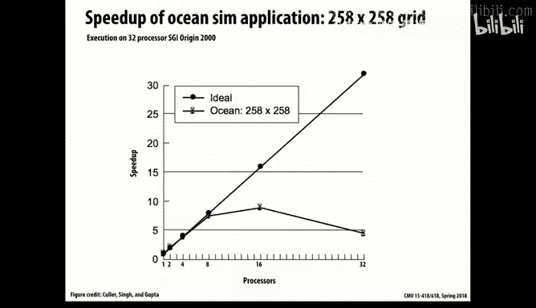

And you can measure that。 You can show that in this example by looking at how the problem would scale for larger values of。

The grid。 So the version I showed was。Just a 258 by 258 grid。And。And it's too slow， or actually。

 it's even worse。 It's 130 by 130 grid points。But if you take the larger version， the。

at the very top is when there's a 1026 by 1026 grid。 and you'll see it comes。

A very strong speed up hitting a speed up of 25 for 32 processors。

 So that's a pretty clear example of for the smaller numbers。

 especially where they're actually decreasing。

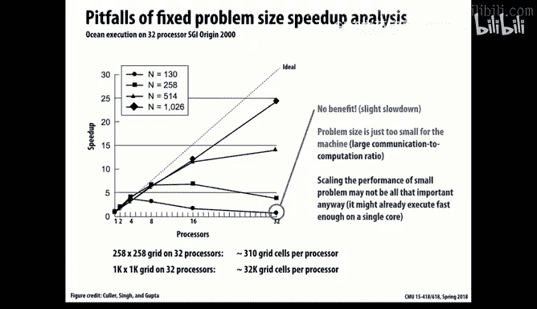

Is where the problem just isn't big enough to keep that many processors busy。

 and you're wasting more and more time on communication。

So that's one of the challenges of using speed up as a measure。

Here's another problem that's actually sort of the opposite issue。Which is， you see that the。

Performance actually increases more than linearly as the problem size increases。

 Can anyone guess why that could be。How could ever get super linear speed up in a real world problem？

嗯。This is。Simulating a grid one of these solving over a large grid。Ideas。It's a cash problem。

 So the point being as you add more processors， you add collectively that much more cash。

And in this problem， the parallelism is really nice。

 I really get to subdivide the problem and work on it。 And basically， by subdividing that problem。

 I get to the point my or my working set。The amount of data that each processor needs to access。

Has comes within the range of one of the caches。And so that's a sort of extreme example。 But again。

 it shows the problem is at the lower end。The previous one was at the upper end。

 I had too much processing power relative to the problem size。

 And here it's sort of an unfair comparison。一人呃。That I had。

The the problem was really too large to measure effectively on a single core processor。And of course。

 this is a good， this would be a good outcome for anyone trying to solve the problem。

 but just the fact that super linear speed up is a bit of an artifact。

I'll mention one other real world example where you can have super linear speedup。

 which is if you're doing some type of combinatorial search。

Looking for a solution like buoying satisfiability or something。 You can also have the case where。

Because you're basically trying more different variants in the search。

And then you're going to stop as soon as one of them is successful。

 So if you have more of those running。Chances of finding one quicker are better。

So that's also a real world example of super linear speed。So the point is that。Of。

And sort of a general point is that there's a pretty complex relationship when you say I want to scale the problem by some amount。

 even what that means is not a simple thing。啊。Because you see that the factors of we saw load balancing issues overhead arithmetic intensity。

 locality of access， all of those affect performance in various ways。

And so as you try to vary a problem or the processing， you can get very complex relationship。

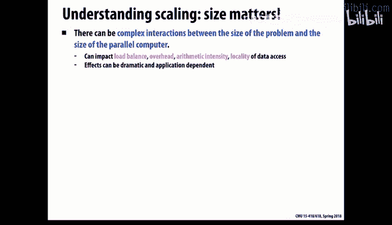

And so。As we mentioned， there's sort of a general problem that these previous examples illustrated is if you just try a fixed problem and you say。

 how much faster did it go， you can fail at either the small。

The problem is either too small or too large。In terms of measuring anything really meaningful。

And so that leads to the idea of， well， really， what we should be doing then is thinking about。

How do we scale the problem in an appropriate way that as we scale the resources。

 we're getting some reasonable comparison。And that also is not an easy problem。

 So that's part what we'll look at today。嗯。I'll mention the term scaling you'll hear all over the place in computer systems。

 and so particular hardware networking people also talk about and distributed system designers always talk about scalability。

How does their particular way of solving a problem。

 be it hardware or software or system design a scale across different problem sizes？

And that can be scaling up how do we handle larger problems， but also the issue of scaling down。

 especially in the world where you're trying to be mobile or lower power or lower cost。

 you also want some way you can in some systematic way reduce。

Your capacity reduce your hardware and make it cheaper。

 lower energy consumption and things like that。So one of the， for example。

 one of the clever things of。Of the Nvidia GPUs is that they have these S Ms。

 These S M Ms are considered here， the streaming。Multimedia something or machine。

 I forget the name of what it stands for。 but basically， the core。And。

One of the interesting things is they can kind of pop those down on chips of varying different sizes。

 And so you can buy for a couple hundred dollars， a system on a chip that has a couple of。

Of I two of these cores， plus an arm processor serves as a host。

 and it's all packaged in a little box。 It's pretty cute。

 And they use those a lot in mobile applications。 so I can auto。

Or you can build a monster like the ones we've got in the JHC machines where it's 20 of these cores and consumes a lot of power and they're fairly expensive。

 but from a design perspective， it means they can have a range of product types。

By sort of replicating this one element as many times as as warrants。

 So that would be a good example of very scalable design。

So you'll hear out there two general ways people talk about scaling of problem sizes when they're looking at parallel computing。

 And I'm going to mention these terms， even though we will use them a lot in this class。

 just because these are the terms that a lot of the world。

 especially the world of supercomputing uses。 They refer to strong versus weak scaling。

 So strong scaling is the classical。Fix the problem。 What's called the problem X。And then see。

 how much faster does it run。按呃。P processors versus one processor。 Or take the inverse of that。

 That's here， your。Speed up， right？So fixed problem varying size。

And then weak scaling is basically saying， take a problem。 But as we grow the the resources。

 let's also grow the problem size proportionately。 And how close to 1 Basically，1。

0 can we get in doing that。 How much can we。

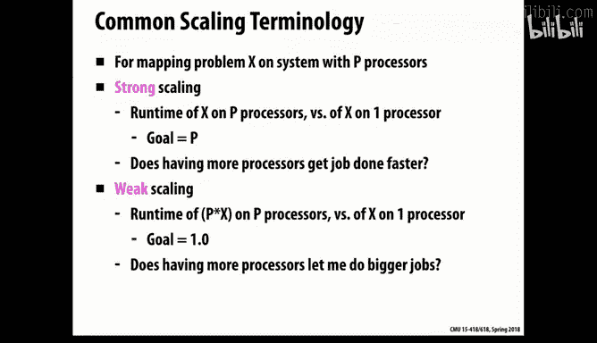

Really solve a problem that's p times larger using p times more resources。In the same。

And if you think about， that's really the a lot of real world applications。

 That's what you're trying to do when you're scaling。The， the problem is。

 it's not always obvious what it means to scale a problem。And so we'll look at that a little bit。

 some too。So we'll look into these ideas， but sort of go into a little bit more nuanced understanding of them。

So part of it is。好。Even if you look at a given problem， like at the bottom is this ocean simulation。

 which remember， we created an end by end grid， and we set our error tolerance of convergence to epsilon。

 and each time step with some number deelta t。 and we want to simulate this ocean system for T seconds。

 capital T seconds。 Those are all parameters that we can choose。

 and they somewhat interact with each other。 As I mentioned when you scale up。

The grid side when you want to。Have a more refined grid。 So you'd increase the grid size。

You also have to decrease Delta T to get the physics right。

 And so these parameters interact with each other。 The one that's somewhat independent is capital T。

That you can run it for。啊。10 years or 10 years worth of ocean currents versus 100 years。

 That's a fairly linear term in how the performance will scale。

But my point being， even once you delve into an application asking， how do I scale its problem。

Is actually a multivariate problem。 And furthermore。

 how that really turns into some measure that we of。Problem size is not so straightforward。

But we'll call that application oriented scaling。 so you know about the application and you look at the various parameters and you think about you how can we increase or decrease the problem size。

Since we're sort of more on， on the。You know， implementation end of things。

 it's more natural for us to talk about resource oriented scaling properties。

So we could say the problem we can look at。For example。

 problem constraints is meaning fix the problem。And see how the scales。

A memory constrained is saying， well， we'll go into these individually。

 But given I've got so much memory in my system， how big a problem can I solve And time is。

 given I have to get an answer within X seconds， how much what。

 how big a problem can I solve that way。 And these are all。

Valid ways of thinking about the various resource constraints in the system。

 So we'll go through examples of that。

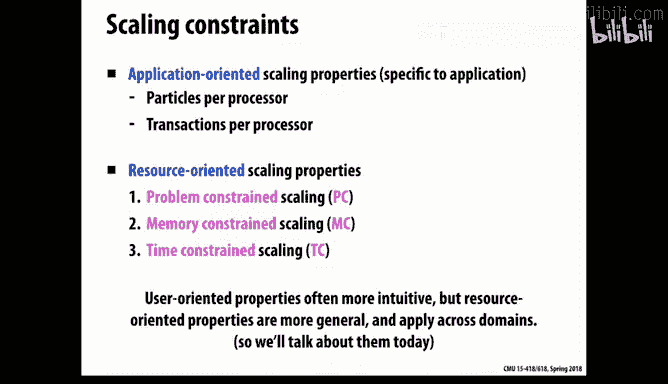

So， again， problem constraint is just classic。Speed up， what I called strong scaling。

And if you think about it， it's pretty much everything we do in this class will be strong scaling。

 We're looking at when we measure your performance of your rendering。

 you're getting measured for well you're being given absolute goals of how fast the thing has to hit some number。

 but it's a fixed problem and you're given a specific performance target。

Relative to some existing one， but。Really mostly- and you saw in assignment one。

 a lot of your measurements were speed up。So that's a pretty common way， and it makes sense。

 but I'll tell you， even when we sort of design the benchmarks for these。

 we have to kind of carefully consider。What呃。What range of problems makes sense for this。

 Because if you make the problem。For example， too small， then you won't see very good performance。

 or another thing that you get into is the sort of constants of overhead and startup costs and things。

 if the overall runtime is too short， you don't get a very reliable measure of true performance。

So most of this class， we're doing some version of problem constraint。A fixed problem。

 How fast can you solve it。

But there's a lot of real world problems where it's time constrained。

 meaning I've only got so many seconds to。To do。 And I want you to be able to sort of solve。

Come up with the best answer， the most complex solution that you can come up with during that time。

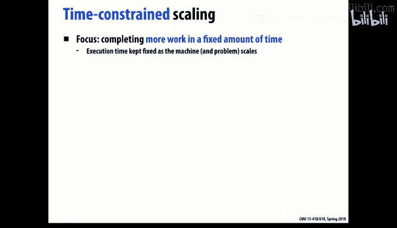

嗯。And so what we'd call the speed up then is。Would be the relative amount of work that we could get done。

In， in a fixed amount of time， right， if work is some measure of。Of progress。And the problem is。

 even work is， is not an an easy question。 if we， and we'll see examples of that that。Some problems。

 you know， they a parameter N， but the actual run time， the amount of work you have to do。

Is not just a linear function of n。And in general， it's pretty important to come up with metrics that are sort of understandable。

 that don't involve too many。Different sort of bells and whistles to them。

 Or else you'll just get confused。

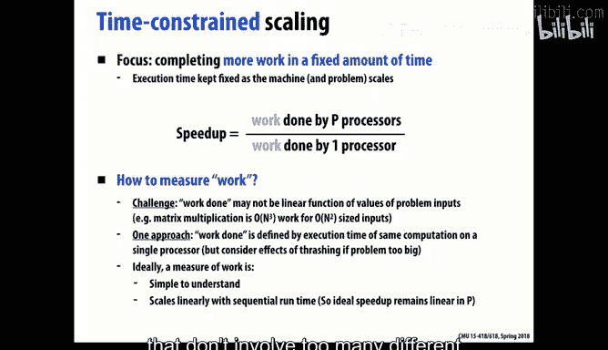

So let's look at some real world examples。 One is in video games。Or graphics in general。

 that you have a real time constraint that you have to render frames at some particular rate。

Otherwise， it looks all jerky and stilted。 So what you want is create the most realistic scene。

 the most the best looking motion， move as many characters。

 sort of have as many elements in this animated as possible， but give me a frame rate of say。

 15 or 30 frames per second。And so what the question is， then。

 how much more stuff could you do if I gave you more processing capacity to do that。

How much more interesting scenes， How much better animation could you provide me。

Another interesting example that's going to happen in the real world is right now they're building this telescope on a mountaintop in Chile。

That is going to scan the sky every night and take a lot of very high resolution images。

 So it's called a synoptic survey， meaning as opposed to classic telescope where you say。

 I want to look at this particular part of the sky and you zoom into that。

 This thing just does a total sweep。And the idea of it is it's， it's looking for events。You know。

 astronomical events that。嗯。Unless somebody looks there， they might not notice it's happening。

And so it's sort of going to scan the sky over and over again every night and look for things that are changing from one night to another。

And then they'll do some signal processing， image processing on that。

And find these sort of interesting。Things that are worth looking at。

 And then they can send to their friends who have telescopes on other mountains in other parts of the world and say。

 hey， you should look there。 There seems to be something interesting happening。

So this is a pretty classic case of。Of that processing， then is a pretty classic case of。Of time。

Base scaling， time cons scaling that。You have to turn this around in a day because the next night。

 it's going to start scanning again。And also that you want to tell your friends。

To be looking for these events that may disappear on them if they don't look quickly， you know。

Some of the funding from this， by the way， comes from people worried about asteroids。

 killer asteroids hitting the earth。 And if we could see them further off。

Could we like divert their paths？So there's a lot of places in the real world where time is the main constraint。

 And you want to do as much as you can within a fixed amount of time。

 So one is computational finance， doing online trading。 The times are measured in some cases。

 in microseconds， in other cases， in milliseconds。 But the idea is you want to do。

The most sophisticated analysis， prediction， calculations you can。

 but you have to do it within a fixed window of time or else it's useless。Websites through Siuai or。

When it's trying to build together all those Paos images。

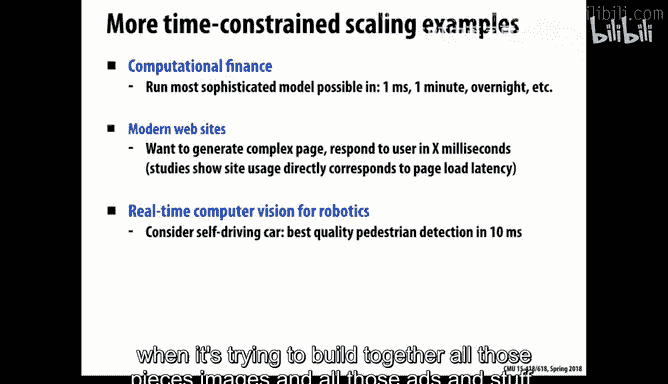

And all those ads and stuff， they at least have some sense that if。

 if you don't get your web page back。In some number of milliseconds， 100 of milliseconds。

 then you'll be unhappy。And if you think about， again， anything involving perception by robots。

That operate in the real world。 They have to。No， they're gonna hit a card before they hit it。

Or a pedestrian。There's other places and classes of problems where the issue is more memory。

 and this is especially true on really large supercomputing systems or large scale supercomputers。

Don't have disk drives in them because disk drives are too slow and unreliable。And so they want。

 they have these boxes stuffed with all kinds of processing power。

But if your problem doesn't fit within the total memory size of the system。

 you're pretty much out of luck。And part of the motivation for。

 for increasing the system size is to give you that much more Dra。

That you can handle larger problems。And so， that's。An example of， of weak scaling， basically。

 that you want to。If assuming that your total memory capacity increases in proportion to the number of processors。

That's really a bigger motivation for getting more processors than for raw speed。And of course。

 the goal is。But as I increase the number of processors， my total time will。

 will stay roughly constant， as I've said before。 So this is sort of a classic version of weak scaling。

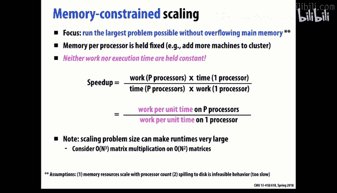

So examples that that include a lot of scientific applications。 So， for example， the。嗯。

These big simulations of。Of。Galaxies。Astronomical bodies。

 really the issue there is largely how much can I hold in memory， how big a sort of system。

 how many stars can I actually run a simulation of。

But it's also true in a lot of real world applications。 So like very complex。

 machine learning algorithms are more memory constrained than processor constrained。And for example。

 there is a in the sort of distributed systems world。A lot of the reason why they scale out a system。

Is to give it more just capacity to hold information。

So just to take Pixar as an example within that company。

 you can see various versions of scaling constraints。showinghowing up。

 even within a single organization。So， for example。

 if the core problem is that you have to render a shot and a shot in a。

Movie or video is essentially a scene from a fixed position for some amount of time and shot times I think very these days are on the order of 10 to 15 seconds。

 so pretty short and keep changing which camera angle or in which perspective it's taken from。

So a lot of the time is， okay， I've got this fixed amount of stuff I need to render。

 Render is sort of generating all the。The the pixel values for the whole image based on。

The total calculation you're trying to do of having these characters move around and then have them all。

Rendered properly so。啊。And typically， what they have is what they call render farms。 So just a room。

 multiple rooms full of computers just run day and night doing these rendering operations。

 They have the advantage of a lot of inherent parallel as to the problem。So anyways， you know。

 the task of just rendering one shot is a classic problem constraint。 If I can put it。

 map it under more processors， I can do that quicker。But。

If they're sort of trying to provide the resources for a particular artist who' is trying to sort of do design。

 often they end up more with a time constrained problem that they want to。

 theyre provide trying to provide a。A fixeded frame rate to the artist。

 but they can sort of cut corners。 They can do a sort of coarser version of the rendering or little less sophisticated rendering and do it faster。

 So often the artist would rather see a sort of quick， essentiallyly draft。Version of this animation。

 But do it in a way that matches the real time of performance。Similarly。

 if you they do a lot of simulation of physical devices。

Physical world like fluids or things like that。 And those often end up being memory constrained。

 Their problem is that they have these models that they really have to fit within the the D of their collective processes。

And then finally， at the end of all their design， they have one big pass to render the whole movie。

And。There it' sort of。嗯。Constrained by sort of all these different factors。

So my point of this is not Pixar alone， but just in general。

 it's very possible even within one sort of range of applications that you'll have different constraints under different conditions for different use cases。

So let's look at how these different ideas of the constraints show up and would affect our scaling ability on our grid solver if we have an end by end grid。

And we map it onto P processors， using this。These square boxes。

 So remember that n is the sort of linear dimension。 So the grid size N by n is n squared。

And typically， if we want to run this until we reach some convergence， it will be。

In proportional to M。 So of if you think about it， the。

 the convergence of propagating till you reach a stable。

State across the whole grid is proportional to the diameter the。

The longest path lengths in this graph。So。If we had a problem constrained scaling， then。Remember。

 and remember， we， we figured out that。If you look at on a per processor basis， we said that。啊。

The amount of computation for。One processor。One processor for one time step actually。

 is n squared over P。And the amount of communication we're doing for one time step for one processor is proportional n over a square root of P。

So if we're doing a problem constraint， meaning classic speed up。What we'd say is that the。Were。

 We have a fixed value of n。And we。What happens is we saw is that our communication to computation ratio then varies this one over the square root of P。

So the bad news of that is if we increase P。Then we will。

Make it so it becomes more and more communication dominated。

So that will limit the degree to which we can scale P。

If we looked at time constrain solving， it's actually an interesting， in other words。

 if I'm going to go from a single processor to P processors。

 but I want to now take the biggest problem I can and still solve it in the same time as before。

Then it's actually kind of tricky because let's be optimistic and assume we have linear speed up。

Then what we want to do is go from a problem size of N to problem size of K。

Where K is n times the key root of P， right because。We we'll pick up K。

 We want it to be cube root to P in both linear dimensions。

But it's also going to be cube root of P more time。

St that we're going to have to iterations we're going to have to run for。

 And so it works out that the， the value of k then should be n times the cube root of P。

And if you then push that number down， you'll see that it gives you that your communication and computation ratio in this scaling is P over the of one of the sixth root of P。

 So it actually。嗯。r of it's getting worse as you increase P， the communication。

 but not as rapidly as it did for the problem constrain。And the reason again。

 is we're scaling the problem， but we're also doing more time steps and that kind of works in our favor。

More iteration。

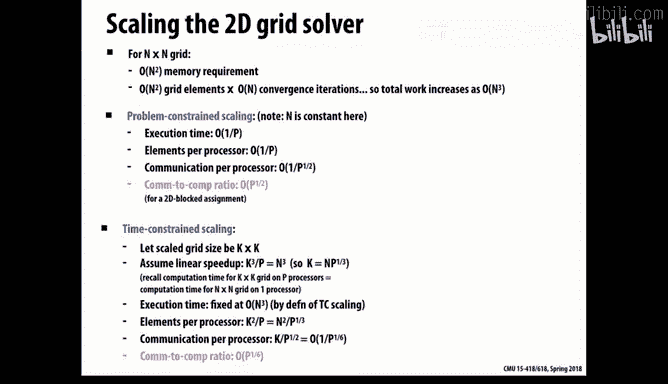

And then the other would be memory constrained。 We'd say， hey， look， now that we've got P processors。

 we have that much more memory。 And so we can pack that bigger。

 much bigger grid into our system and run it。 The total run time is going to be longer。

 but I'll be able to solve a bigger problem than I could before。😊。

Assuming the memory being the constraint。And there you'll see that the， the ratio。

 then of communication to computation stays fixed。As we increase it。

 because we're increasing the grid size。But also， run it for longer。And。啊。

But we're scaling it in a way that we're increasing the grid size and therefore the number of elements per processor in a way that's proportional to the number of processor。

And so that lets us sort of have a constant communication to computation ratio。

So the implications of this， you know， three different scenarios of what my。

 my goal is in going from one to P processors。 you see that the memory constrained will do fine。

 assuming we were good before， this will scale very nicely。 The time constrained。Is next best。

 And then the hardest one to sort of meet your scaling goals will be the problem constraint。

 It sort a classical speed of。So thiss kind of a weird way to think about problems。

 And you'll have to。Look at this slide and think about what it's really trying to say。呃，Some。

ItIt might not just jump out at here。 But the point being that。Often。

 if my goal is to solve larger problems。Like memory constrained。

 then the goals aren't as hard to achieve as far as scalability as it is if you're just trying to get pure problem constrained or pure classic speedup。

So。As I mentioned， it's a little trickier than all this because a lot of these parameters sort of interact with each other。

 The one that often varies is capital T that I can just run a simulation for longer and get if I'm trying to somehow figure out how can I reduce my problem size in a way I can sort of do benchmarking without having to run for two weeks on a big supercomputer。

So all of this， you know， the theme here is。There's no simple answer。

 if you really get into understanding what problem you're trying to solve and for whom and what your goal is。

 then you'll come up with metrics that are very specific to that task。就。

Let's go back to our original scenario that you new on the job。 You've been told to。

Make something run better， faster， more efficiently。

 How would you even measure then how you're doing。

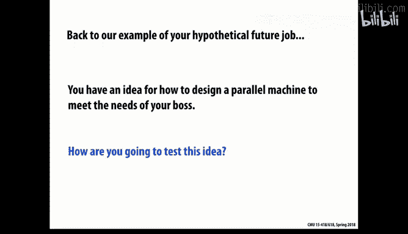

And so a lot of what we do is we write code and we run it and we see how it does。

But that's not always the answer。 If you're trying to actually build a full system。Or imagine your。

Designing a much more complex piece of software that you can't afford to implement the whole thing。

And then run it and hope that it's going to work right。

 You have to somehow figure out and make plans for what to do。Before you do it。

And so that becomes a lot harder。 So in the hardware world， what's done a lot is to run simulations。

 to do different ways of scaling your problem in a way that you can model it and execute it using typically a software based simulator。

好。And the challenge in simulation is really that。The sort of more perfect and accurate perfect assinuation is that modeling every single aspect of the system you're trying to model。

The more expensive it is， And it really won't perform very well。

 And so you have to come up with various sort of。Approxis and abstractions to make it even practical。

So one method。 and even how do you run a simulator， There's sort of two basic approaches。

 One is a trace driven simulator， where you。Create， a log for your application of。

 the sort of typical behaviors that it encounters。And then you record those as files that then you can play back on your simulated system and see how they're doing。

 So those of you took 2，13 or 513 know exactly what I'm talking about that both the cash assignment and the Malic assignment。

That you were running off of traces。 And they were based on。The cash ones were based on real life。呃。

cash。Measurements from using tools that might you。T memory behavior and the maleic ones。

 some of them were based on real life traces， and some of them were completely artificially cooked up synthetic traces。

But the， the general idea is， instead of trying to model the whole problem you're trying to solve。

 run the full application， you just create a snapshot of what the application looks like and then replay it over and over。

So what are some shortcomings of trace based modeling。Anyone want to。Speculate。

From the point of view of， of getting good reliable results。

 getting results that really reflect what you're trying to do。Yeah。

 like you are overfi the traces you have。Yes， that's。 And you're seeing that。Now。

 it's very tempting to overfi。 You're creating， you're trying to hit a score。 You realize I can。

Have the code that looks at these very special cases。 And so overfitting is a serious problem。

 And it's a general problem that how do I。Have a representative set of things。That。

It sort of represent the general parameter space。And that I don't sort of。

 since I'm iteratively going over and over again。In the ideal world。

 what you do is you basically resample that problem space for each time you do it。

You sort of create a fresh new set of examples， but you usually don't。 So that's a good one。

Think about before， you know， this would be fine for sort of the。Strong scaling。

 the problem based scaling。 But what about other， you know， other part forms of scaling that we're。

 we're looking at if you're trying to solve different problems by having a larger scale system。

Then presumably you should vary your traces as you。To， to reflect those of the larger problem。

But the problem is you might not be able to solve the larger problem yet until you get the big system。

 So that's。A problem， too。And the other happens if there's sort of a feedback in the system。

So this example， traces are fine if it's sort of an open loop model， though。

 it's assuming that the traffic will be the same。In my new system， as it is in the old system。But。

 for example， time constraints modeling。呃。I'm hoping to do more complex problems in the same amount of time。

 So the actual。A trace only represents a sort of fixed problem and not necessarily scalable。

 So all these are issues you have to look at in scaling in trace based。

 But it's a very common technique and fairly useful。

Another would be execution driven， where I have basically built into the left is a box that replicates the problem I'm trying to solve。

 And I dynamically spit up the real， the real。OfVals。

 and it can have feedback in it that the system is adapting dynamic。

Computations Im performing and therefore， producing what would end up being different traces。

 depending on what feedbacks coming。 So it has the advantage that it can do this in the loop processing。

And presumably， it could handle the case where you want to scale the problem size in various different ways。

Although then the execution time would get more problematic。

So there's some advantage to this approach， but it means that you。It can be more difficult to build。

 and it can be more expensive to run。

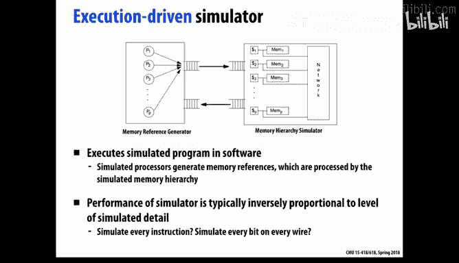

One interesting thing is you'll see that in the real world， what happens then is。

When you have a lot of different parameters， you could adjust。You know。

 think of it all the little magic numbers you could put in your system and choices。

 One possibility is just to sort of do a huge sweep of the parameter space and try out all kinds of different combinations and see where it goes。

And when you do that， you'll end up coming up with something like this figure shows。

 And a phenomenon they call the Pareto optimal curve。So the details of this don't matter so much。

 But imagine in this example， your measure what you're trying to achieve is。

AMinimum energy per operation。So you want the number to be on the low end and the Y dimension。

And you have the choice of， basically。How dense we to。Put your processing elements。

 how many to stuff into the system？In this example， per square millimeter。So in that case， sort of。

The X axis somehow measures the cost。So。Why as efficient is。Is。energy。

 so some resource I'm trying to minimize and the right is the cost that it will take to do it。

 And the point that you get is if you sort of trace the bottommost area that so a Pareto curve that tells you you really should only consider options that fall along that curve。

Because for example， if you look at this。Whatmost point。Gives you a certain。嗯。Energy per operation。

At a certain cost。And。You're not going to get any more efficient than that。

So that should be your starting point， but more specifically。

There's no point in taking one of these solutions in the interior here。

Because you could always do better。At the same cost and at lower energy by this solution that's down here。

And。And so this point here is the sort of lowest possible， most efficient design you could have。

 and this would be the one that performs the most。好。And。So there's。

 if you're willing to sort of pay the price， of the， the maximum price， this is where you'd be。

 But there's no point， for example， in， in picking anything that's above this curve。

 And so that's called the Pareto curve。 then that you get in an example where you have a lot of。

A lot of possible， you're looking for trade offs。But there are some solutions that clearly dominate are clearly superior to others。

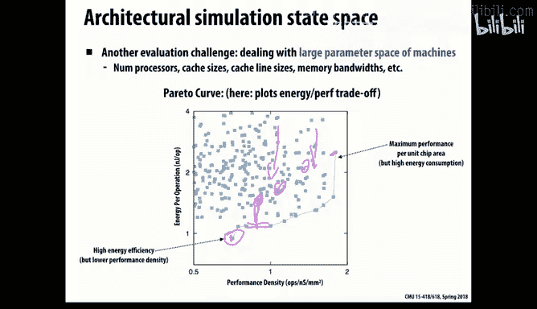

So as youve probably discovered， even when you're trying to figure out how fast the program is running and why。

A lot of the techniques you do is to measure that performance， get in the way of the program itself。

 And that makes it particularly challenging。 So， for example， if you put in。

Logging information to track events。 There's a fairly high cost to doing that。

 It can generate gigantic files。 They'll overflow your memory or disk system。

Going out to disk is a relatively expensive part。 So you'll slow down your code。

 if you build counters in。It will there's a cost to maintaining those counters。

 and we'll slow things down。And。嗯。Also， it will affect the timing if therere sort of events that were being like dynamic scheduling。

 say， where your system is adapting to the runtimes of different parts of it。

 now if I stick in performance measurement like counters and things like that。

 it don'll change what scheduling occurs and therefore the behavior of the program。So， in general。

You have to sort of trade off between those of what you're going to measure and how you're going to measure it。

And how often another thing， you'll find， as you might have already。

 is in problems where the the run time of the full thing is going to be pretty long。

 You want to figure out a way to scale it to something simpler。

And still be able to get useful information about the larger problem。

 And that's also a difficult problem。

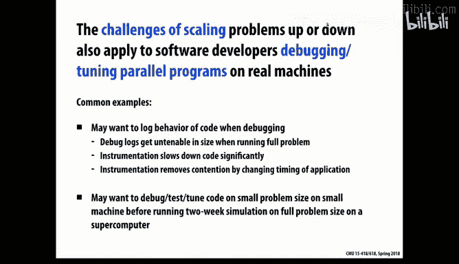

So that's often called scaling down then that we want to somehow take our larger problem we're trying to solve and scale it down to one that we can solve faster or with less resources。

 but predict in some way how that would scale to the larger one。好。And there's a lot of。

And so some of the challenges of that is typically a program。As you've already found。

 you have different phases of computation。 And if you scale the problem down。

Then the relative timing of these different phases can vary。And you can change also， as we've seen。

 some issues like the arithmetic intensity or the imbalance across loads can change as you change the scale of the problem。

And。If you have like a lot of contention or synchronization， that will get affected。If youre。

 if you scale a problem。And so forth。 So actually， finding good proxies of measurement for real applications is a very hard problem。

So。Often， as I mentioned， the easiest thing is just to reduce the overall time of。

 if you're measuring modeling a simulation， say， is just to reduce how much many time steps you're simulating for。

And that works as long as you sort of still have the represented set of behaviors within that time window。

 you're modeling that you would over a longer run。 And that may or may not be the case。

 You could imagine a simulation that starts with， you know。

 this little ball of stuff at the beginning of the universe and explodes outwards。 Then the the。

The physics that will happen toward the beginning is very different than the physics later on。

And so what often happens in those problems is they sort of create time slices that sort of represent different。

啊。Sor of phases of operation of this overall system and model the behavior measure the behavior of those different parts of it。

Another challenge is， you know， it's natural in a graphics application is to shrink the the resolution or the size of the grid or something like that。

 for example， with the rendering problem， you could just say， well， do it on smaller images。

 But you'll see a lot of the features change。 So， for example， you'll notice。In this larger version。

Have quite a few more cases of。Of just one circle in that grid。Then is the case here。

If you just look at the big blue circle as an example。And。Sorry， so it's not always that easy to。

 to just even you know shrink the resolution and say that will represent what it looks like in the larger。

So one way to do it is to do more of a craft version of it。 You take the whole set of problems。

 you just throw out all the circles that aren't in some window of it。And hope that the。

 the section that you've created your copy section is sort of statistically representative of the larger image。

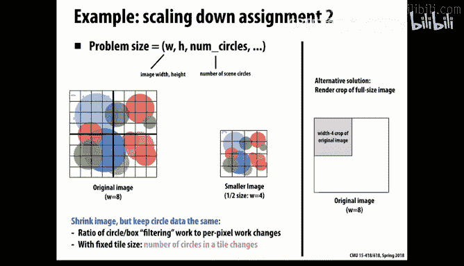

So there's often ways you can take a problem and sort of chop it into a smaller piece and solve it。

So I think the main thing we're trying to get across today is all these things are possible。

 It's just， you have to understand the nuances of it and be a little bit more careful in what you're doing。

So， here's just。嗯。A few piece of advice when you're doing something where you have some software and you're trying to make it run fast。

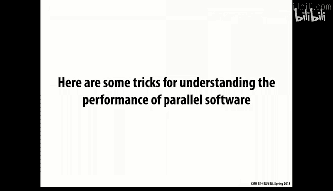

And one is， I think。That it's a good idea to start simple and then measure， and then refine。

This works， by the way， in the world we work where our problem is fixed。Our machine is fixed。

And we're just trying to make it run fast。It gets a little harder if， you know。

 it's a longer term design problem where you have to design something that will scale across many different machines。

But in general， simple is good。 and especially you'll find。

In these parallel systems that a lot of algorithms would come to know and love unsequential machines just don't work very well。

 So somebody was commenting， gee， how come I can't do hash maps on a GPU。

IIt's so easy to just call it up out of the library。 and that's well and good， but。

They just aren't very well supported。 And a lot of parallel。

 a lot of data structures just get too messy too problematic on。映顔？ParaelA couple years ago。

 one of the assignments for this class。Had people trying to design sets of things and just using basically bit vector representation of the sets。

 And I thought， oh， I can be clever。 I can use a hash table to do this and found it just。

Totally tank when I tried to scale it to more processors。

 So even data structures that we use routinely in the sequential world。May work by scaling。

 but often don't。 And you better to just stick with something simple。And then you， you measure it。

 find where your bottlenecks are。 focus on those。But you always start with a simple one first。

And so a few things to do along the way is sort of these basic questions is what are my limiting factors。

 Am I limited by bandwidth， Am I limited by。By computation， you know。Arith， arithmetic。

 am I limited by synynchronization。 Where is the core problem？And one way you can do that。

 And you've done that already a little with the Sxby example in assignment 1 is， well。

 how close to the memory limit am I。

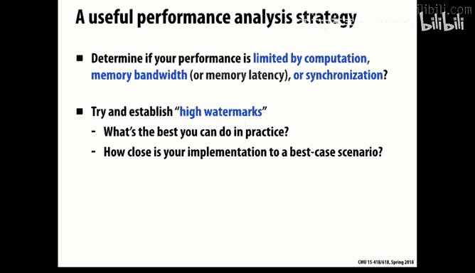

What are the。Pictures people often use in what's called the roof line model。Which is， if you take a。

Some。2。Computation。 And you have the ability to vary how much arithmetic intensity is there。

Remember the amount of arithmetic relative to the memory， the communication requirements。

 and you'll typically find。对有。Performance， it looks like this。And the reason is。

The parts to the where the sort of horizontal part， you see in the lower one。

 it's an opttron which is an AMD processor， a two core version versus a four core version。

And so what。That represents his。The diagonal line is where by increasing arithmetic intensity。

 and improving this。And that's a sign that your memory memory limited。

 bandwidth limited in that case。Because I'm getting a corresponding improvement if I'm doing more where the improvement is measured in arithmetic operations per second。

By increasing this。Arithmetic intensity。 but at some point it will。Saurate。

 you're sort of squeezing as much as you're going to get out of that particular machine。

 That's the sign that you've become。Bound by computationally bound。And you can be。

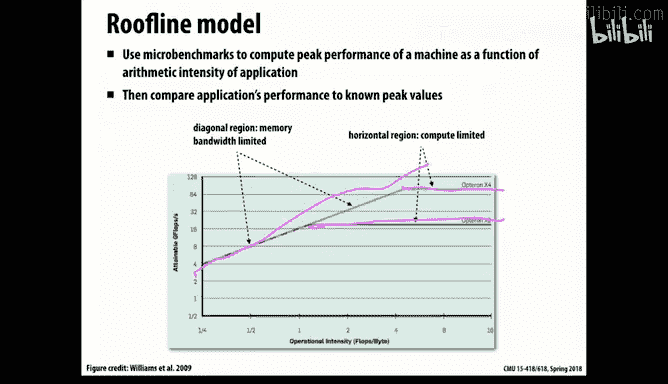

More sophisticated that you can start looking into。

Different optimizations you could make within that space to increase the。Memories。

 this upper one is sort of the speck of。What the manufacturer claims a peak memory bandwidth。

 And one thing you're guaranteed is you'll never run that fast。So you can look at， you know。

 if I put more prefeing into my code。To try and anticipate where the memory is going to be。

 or if I improve my stride。You know。Other other techniques you can do is sort of remamp your application using blocking it。

Proreve memory performance。You can sometimes push your performance out that way by various optimizations。

And that makes sense for the case where your bandwidth about。In， when you're bound by arithmetic。

You can look at various ways to push up the performance by using Cdy instructions by making better use of。

Of。Pipelining and other resources like that that might be available。

But each of those optimizations only makes sense。When you're in that particular regime。

If you memory bound， then increase going to Cdy instructions isn't going to help you。But if you're。

Githmatic bound and fancy or prefetching isn't gonna help you。So that's a useful thing to know。

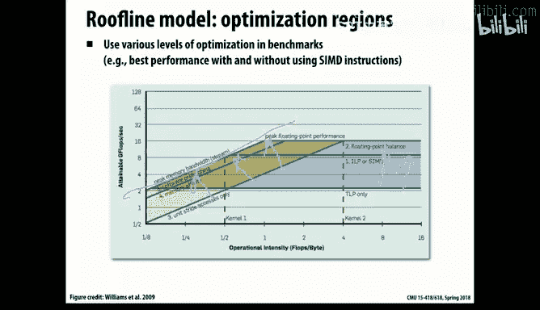

So how can you actually figure out where you are on that space？ Well。

 here's a few tricks that involve basically temporarily。Fuddging the problem you're trying to solve。

 So you're solving actually a different problem， but somehow in a way that will vary these parameters。

 So， for example， if you just add extra arithmetic instructions to your problem。

Then you can artificially。Increase your arithmetic intensity and see what effect that is。 And if you。

If you do that and don't immediately see a corresponding increase in。嗯。In the performance。In the。

Or decrease increase in execution time。 That means you're probably not sort of fully using the arithmetic resources you have available。

 One thing I'll mention， if you do this in software， you have to be really careful to make sure that。

You're not just throwing in instructions that the compiler will conveniently figure out it can optimize away and。

And many people can tell anyone who's done this。ies of that that they kept tweaking the application to make it harder and harder。

 but yet it had the exact same execution time。And this is actually a ton where it's useful to go in generate the dot S file。

Look at the inner loops。Figure out， make sure they're doing what you expect them to do and if not。

 work somewhere else。Because compilers are pretty good at figuring out what the dead code。

 code that doesn't actually implement or update this state in any way。

 and therefore it can not be optimize a way。Similarly， you can go the opposite direction。

 You can take strip out the memory instructions。Or you can strip out math so you're not really doing the real problem。

But you can increase the amount of。啊。Of。Memory， you're having to decrease the arithmetic intensity and find out if your permits and degrades。

好。That you're。You're more likely memory bound。Similarly， if you're worried about address patterns。

Or this like cash effects， you can sort of。Artificialally reduce the size of your working set in various ways and see if that gives you a performance gain。

 And that will tell you whether you're more cash dominated or not。

And another that's very useful is if you suspect you're being limited by synchronization operations。

 you can just remove all the locks。And the answers will be nonsensical。

 but it will give you a pretty good measure of what is the overhead cost I'm paying for walking。

 And that often can be very insightful。 So these are all examples of tricks you can play by basically varying the problem in ways that。

I might not be solving the one I'm trying to solve anymore。

 but it gives me a sense of where are my limits， where are I。

Bottlenecks in the system that are causing me problems。And this can be done without any fancy tools。

 right， This is just changing the code。他也没有。This can be done sort of in any context。Now。

 there are various ways of propfiling。Your code to figure out what's going on because a lot of people in this world。

 a lot of developers are concerned with this。 various tools have been developed。

So one example that this shows is。The CPU monitor on a。

Programs will basically tell you how busy the processors are。And you see， for example。

 this is for a quad corere machine with hyperfetting。What do you observe about the scheduler here。

 though？Just from looking at that picture。Like the most basic observation you can make here。嗯。Yeah。

 you see that it's not using hope prefer at all。Schedule is disabled hyper。嗯。

Another is that the modern processors have built into them performance counters。

 And the good thing about this is these can be。Operated。Essentially， no cost as far as performance。

 whereas software performance。Counters。It can have a。But。

These are available and there's libraries that let you access them and measure things like cash rates and things like that that can be extremely valuable。

I also put in a lot of。Software based counters in my code。 But I don't expect it to run very fast。

 It just gives me information back， that says。I'm spending。Having to do this much， or you can do it。

 say on a per thread basis and say I seem to have an imbalance and I'm trying to do more operations in one。

So even simple software categoriesries can be useful， but you have to do it in a way。

 recognizing that it's going to totally mess up your timing。哦。I see， I've come to the end。So anyways。

 there's various tools sort of more sophisticated or less sophisticated available。

 but a lot of it is your ingenuity and cleverness in how to use these tools。

 they're not a panacea and a lot of times you can make do with。Fairly crude ones。

 One way I found very useful。 I did it for the rendering problem that you're working on is。

You can think that your computation naturally splits into phases and you can use that cycle timer code that's included in the distribution gives you pretty good。

Low level timing at a fairly low overhead， you don't want to put it in the inner loop of your computation。

But it works pretty well to keep track of how much time am I spending for this part of it versus that part of it。

 And lets you focus in on， okay。then you end up with Camal's why if I take this part and I can drop it to zero。

Then other parts will become the bottleneck。 so you can kind of progressively do that。

 One other thing that you'll find is that as you change your algorithms and approaches and data structures。

You'll end up changing the performance of different parts of the whole program too。

 and so you kind of have to keep iterating over and over again， saying。

 well I tried these optimizations before， I set this number you how big something is based on to optimize it in a prior condition but now I've made some other changes and you might have to go back and revisit how you set those parameters so there's a lot of stuff that goes on。

 but the point is you don't have to just sort of do random guessing and trying an error to see what's happening。

 you can be more principled in driven by a real numbers in making your decisions。So with that。

 I'll call it today and let you get back to rendering。

