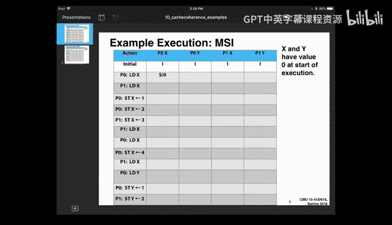
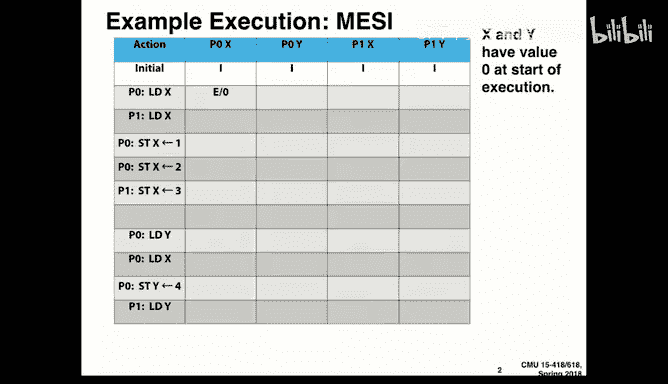
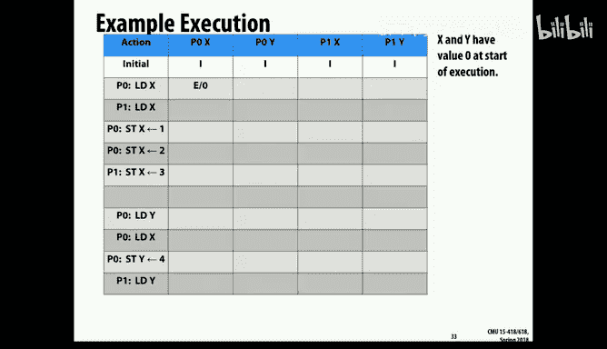
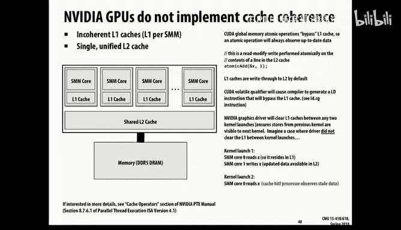

# CMU《并行计算机架构与编程｜CMU 15-418 Parallel Computer Architecture and Programming sp18》 - P14：Lecture 14 - 2-14-18 - Carnegie Mellon University.zh_en - GPT中英字幕课程资源 - BV18b421J7cA

Okay， so today we're going to move on to a new topic， which is。

So of somewhere between computer architecture and。And system design。

 But one you'll find is you're trying to write code that。Works across large scale。

Shared memory machines becomes pretty important。And that's how do you keep the if in a system with a shared memory。

 but multiple caches， how do you keep them consistent with each other？

 So that's generally known as cash coherence。And it's a big part of the design of a system and as a programmer trying to make programs run fast。

How your particular machine implements its coherence could have a fairly performance。So you know。

 the idea of cash is。That you want to be able to set up a smaller。

 fast memory that temporarily holds some subset of the main memory content。And in general。

 if I have a variable X that I've declared as being volatile in C， that means or C++。

 that means when I write， I really mean write， write to memory and not just to some register。

So let's assume that this。啊。4，4 by of memory is stored at address 1，2，3，4，5，6，0，4。

And so now if we were to assume， say， a 64 byte cash line， which is fairly typical。

Then we'd look at those low order。呃。Actually，6 B to find where is the offset of this particular。

Collection of bytes。 And we'd find it offset 4。 So we'd say it starting at Bte 4 in this 64 Bte line。

 we'd write our value。 and this is showing it in little Indian order。 So it look like 1，0，0，0。好。

So that's the sort of some of the basic parameters of the cache that you remember quite well from writing cache sulators。

So you recall there is variations in cache design about basically the some of the。好。

Conventions or policies that the cash maintains， mostly having to do with its rights。

So anyone remember what a right back cash is？嗯。Yeah， so when we write back。

 we actually just write into the cache。 And then at some later date， if we have to。

Say overwrite that cash line due to a capacity。Or we finish some。Process。

 then we forcibly write that the cache value back to memory。

 whereas right through just means every single write goes all the way through to memory and so some of the lower performer write through is a much easier thing to implement。

But obviously lower performance。 it takes the advantage， though， typically， for most data。

 there's more reads of that data than write。 And so right through is not a totally ridiculous idea。

 It just doesn't really hold up as you try to scale to larger systems。So anyways。

 if you think about the whole and right allocate versus no allocate means when I go to write a line。

 if I haven't any part of that cache line and if I haven't don't have that in the cache yet。

 I first have to read the whole thing in， just to modify those4 bys and that's what we saw with the saxby。

 why it has。4 right， four memory operations， even though you're。

 you're just doing two reads in a right， but it has to do the a third read to get the。

Previous value of the cash line in before it can do it right。So。In general， then。

 there's this whole sequence of steps that if I want to do this。

 and we haven't previously read in the value of。This。We don't have this value in cash。Then。

We'll have to figure out where should that go。 And that's the placement policy。

 And it typically is some combination of set associative mapping。

To restrict the range of possibilities and then something like LRU to pick which victim among。

The set to use。And then we'll allocate that baken by reading its current contents into memory。

We'll update the particular bitetes we're interested in， and we'll mark this。Cash line is dirty。

 meaning if， if we ever。Dirty in this case， meaning that the value in the cache is not consistent with the value in the memory。

So this is all works fine on a single processor memory。

 but it gets more interesting in a shared memory system。Where in general。

 what we want is that if one processor writes to some location X and another processor reads that location。

The the second one should see the first ones right。Otherwise， you're not really sharing anything。

 And so that's the general idea is to have a coherent memory system。

But there's a sort of question meaning， what do you mean by before。

What order are our actually rights done in and how strict do I have to be and what do I have to maintain some principles that I have to maintain。

So， and this gets more difficult。By the presence of caches， particularly right back caches。

 so that some processor can hold a state of a memory location that is more up to date than the value that's stored in main memory。

And so an example would be， if processor  one。Reads the value of x and let's say it's initially zero。

 it would now bring it into its cache。And processor 2 could also read that value X。

 and they'd both read for memory and get value 0。 So that's correct。But now。

 if Pro1 just stores its value。啊。And this is potentially even with the right through cache。

 If processor one stores a new value at x， a processor 2。

Still thinks it has a value of x stored in its cache unless we do something about it。

 And so it will think that it has value 0， and particularly if。If。So we're using a right back cash。

And in this case， processor one， again。嗯。I'm sorry， processor three encodes the value of x。

And it would read it in for memory and still have a value0。Processor  three could store x。

Say value 2。 And again， just update its own local copy。And processor， too。If it loads X。

 it still thinks it has value 0。And when processor1。Read some value Y that say。

 we force an eviction of X。Then it will write that value to memory。 But you see it's a total mess。

 the processor 2。Never saw any change to value 0 during that entire lifetime。Processor 3。啊。

Thought it had stored a value in memory， but it never gets stored and， and things like that。So query。

 this isn't really a good scenario。And， and we'll have to figure out， well。

 what are we going to do about it。 So that that's the need for cash coherence。So， first of all。

 observe that this isn't a problem， sort of an issue of synchronization。

 It's not just a matter of throwing some locks around values。 like you'd have in a。

You should a software perspective on this。嗯。Because the problem is instead that there's nothing to keep。

Make sure that。We avoid getting stale copies of data。

And so this has to be handled in hardware to have any kind of reason if caches have to perform in sort of nanosecond time scale。

 so this can't be managed using a software technique。At least not with decent performance。

So in general， then what we'd say is。That what we'd like is that the anytime we read a value at location X。

 what we should get back is the most recent value that's been written to x by any processor。啊。

And the challenge here is， again， remember， we want to do this。So that the。

The reason for having coherence， and by the way， there's systems out there that don't guarantee any kind of coherence。

But。If we want to let users think of memory as this sort of abstract thing and whether our values in cache or not doesn't really change the function computed by a program。

 it's just a speed up technique， then we should deal with it。

And so the challenges we've created by caching this sort of illusion that we have a single shared memory。

 but in reality， we have this hierarchy of memory。So it's our job as cache designers to fix it。

And this gets tricky as you go into the deeper caches you'd see in a typical system。

 this is a diagram that dates back a while， but it's actually the way most current intel processor caches are organized。

That there's some type of。Working from the processor outward。

 theres two levels of cash that are private to the particular core。啊。And vendors。

A much larger cache L3 cache， which is shared across all the cores， and then beyond that， of course。

 is the main memory， but the real action that sort of interproor action happens between the L2 and L3 caches。

 and that's where we can insert some hardware to maintain some type of coherence。

One small factoid is in the physical design of these。

 the actual El free cache is split into like sectors or banks they're called。

 and each one is sort of physically associated with one of the cores。

 but it's managed hardware wise as a single coherent unit。

So that you don't see that effect except it has some small performance。嗯。So anyways， in general。

 on a single processor， it's not trivial actually because the design of the memory systems are actually pipeline。

 there's a whole buffer， like a FIFO queue of pending store operations that it maintains。

And so even within a processor， just keeping。The memory to be consistent is nontrivial。

 basically for every load has to scan through all the pending rights and pick out the one that would be the sort of latest。

The weight in the sequence to do， so。But for this discussion。

 we'll just assume that the unit processor issues have been handled and our problem is dealing with the multiprocessor issues。

It also is a little bit tricky when there's a technique known as direct memory access。

 which is typically the way that IO works， that when I want to write to a disk，I a processor， I mean。

 not me a person。I， a processor will sort of write fill up a buffer in memory and then tell the cache controller。

 okay。You get it and it will grab it away。And conversely， if I'm trying to read from a disk。

 what I'll say is。Hey disk， I want you to read this part of the disk。

 and here is a memory location that you can store it in。 And when you're done。

 give me a call and it will basically send an interrupt signal to the It will go ahead。

 do the transaction and then send a signal to the。Processor that says， hey。

 theres there's some data available for you from the disk controllerer。

 So that's direct memory access or DM。And so even on a single CPU。

 you have the problem that you have basically two different agents that are reading and writing the memory of this single processor。

 two independent agents that are only partially synchronized。

And so you can get sort of inconsistencies there。 but this is typically handled in sort of some combination of hardware and software that。

啊。When I。I first make sure that I've forced all the data out of the cache again。

 I'm a processor and into memory so that when the cache controller when the DMA controller starts reading。

 it's reading a correct value。In some way， when I。So there' various tricks you can use to force it。

 so that can be dealt with by software because it's a fairly lengthy transaction to do the DMA transfer。

But we want this to happen on a sort of bite level。

Range at without a minimal cost in terms of performance。

For both a sequential performance and also because we're going to use shared memory as a way for different processors to communicate with each other。

 So we don't want this to be a slow and bulky operation and run it fairly quick。

The challenge is even understanding what it means to。Across。

Some number of processors trying to keep track of which one was the last one to write to particular location is not such a simple thing。

 They're not that tightly。Locked together in terms of their cocks and things like that。

So what we're going to do is relax at some。But in a way that sort of gives an illusion that this rule is being maintained。

 but not having to be quite so precise about what it means to be the last one。And。

So what we'll do is mostly make sure we preserve program order。

So this is sometimes there's a rule that's described often it's often called sequential consistency。

 meaning that and sequential consistency means a couple of things。

One is that for any given processor。啊。The ordering of its reads and writes should occur in the same order that they do in the program。

 so if processor zero writes。The value 5。 and then later reads。

It should see a5 unless there's been some other processor in the meantime that has changed that value。

So。In general， then any read by a given processor should either be from some other processor's value or the most recently written value by that process。

啊。And the other is that。So， so that's。And then what we require otherwise is that there has to be a serialization。

 so even though things can happen。In parallel at different times and different places。

 what will require is that there has to be some total order of all these operations so that we could order them on a line and across all the processors。

 they would have seen those operations occurring according to that linear progression。So呃。

That's sort of the basic idea of sequential consistency。

Ha be some way to linearly do this so that it appears as if there was sort of a global agreement on what order these memory transactions took place。

But it gets a little bit。ThatThat's not a very good operational way to think about it。

 I can't go unless I want to sort of quit somewhere a single。

Authority that sort of deciding what order these events should happen in。

Sequential consistency isn't really a viable implementation strategy。

So what we'll do instead is describe it more in terms of what we could actually implement。

And what it is is the first rule is， again， the sort of the local consistency， it says if。

If processor P reads an address， X。呃。It should get the value that was mostly recently written by P to x unless there's been some intervening right to value x by some other processor。

And then the other is that if。If one processor P1。啊。Or if P2 makes a。

 I'm going to flip around what2 says。 if P2 does it right。To x。

And then there's some sufficient amount of time where we can be vague about how much time that should be。

 Then if P1 does a read of x， it will get that value back。

 So it's sort of an eventuality that any right by one processor would eventually be read by another processor。

 if there's no other operations on x。And the other is that if there's multiple rights to a single address。

All， all processors that could observe those would see them occurring in the same order。

 So the first is sort of you can think of the first part is a。The equivalent of serialization。

On a per processor basis。And the third is really a serialization on the basis of an address ordering。

 the right orders to a specific address must appear to be in。In a consistent order。

So the first then is。Single processor operation， the third is right to your organization。

 and the other is sort of an eventual consistency， eventual notice。So。

So let's imagine a scenario where the two different。嗯。That we violate this right。

 consistent right serialization。So imagine that P1 writes a value a to x。And P2 writes value B to x。

And where P3 and P4 are in。Are both reading。Value X， they do a sequence of reads。

So if P3 returns to value first A and then B。And P4 returns to value B and then A。

 then what if you think about it， there's no way you could have serialized that entire readwrite sequence and gotten consistent results that those will violate this sort of global goal of sequential consistency。

So that's not a valid， not a desirable approach。And so that's why we introduced this right serialization。

And you'd have to， you know， basically you can prove a theorem。

 but it's not for the scope of this class that says， if I obey these three rules，Here。

 then I can guarantee this serializability of。That I wanted sequential consistency。

So as I mentioned it， you can imagine software based techniques to do it by sort of playing tricks with page faults and so forth。

 but the scale at which an operating system works is just way too long we're talking。

You know numbers。In sort of a few millisecond type time scale。

 whereas this stuff really has to operate more in the nanosecond time scale。

So what we'll look at today is the sort of simplest standard approach。

 which is known as snooping based。Cash coherency protocols。And then next lecture。

 we'll look at ones that are more scalable what they call directory based techniques。

So the main thing we'll take advantage of。Is that。嗯。

There is actually a sort of centralization on the cash， this shared cash。

Provides a sort of global entity that can monitor memory transactions and figure out what order they how to sort of move data around so it appears to be consistent but coherent。

嗯，好。And the idea， then is that。啊。We're going to add some logic to these cache controllers。

So that they will respond to requests both from the processor， but also from an interconnect。

And we'll have messages flying around this interconnect that are the caches talking to each other and keeping each other apprised of the status of lines that might be interested in。

And so that。呃，我我 actually。Pay the penalty now that therell be traffic on the interconnect。

 not just of the sort of cash to memory information， but also cash to cash communications。

And so that will limit how much we can scale this， but it's a fairly straightforward scheme and it's what's used in most multi core processors of today。

So in general， then。The cash。Really， literallyally。

 the cash controller will be receiving commands and creating commands from。From the。

That go between caches as well as dealing with actions from the processor。

So let's just start with a really simple version of it and work our way up and get more complicated as we go。

So what we'll assume is simply it's a right through cap。And for temporarily。

 we'll just suspend this issue of cash lines because they make life a little bit more complicated。

 We'll just assume that we have sort of one wordc lines。

 and so we write the entire word and we're done。 We don't have to worry about it ever again。And so。

What you can think of is。Every time then a processor does a right。

The cache is going to do a right through to the memory。And。So we'll put on this。

Interconnect is sort of a message saying， hey， I'm writing to address X。And therefore。

 any other processor that happens be holding a copy of this。A value can either。Well。

 what we'll assume in this simple version is it will say anyone else who has a copy of this。

Data should invalidate its entry。So if I have。For example。

 a scenario that's shown below if both of them do a read， a load of X。

They will bring it into their caches。And。As long as they just so you can have。

Perfect sharing between caches of readly data， of data that's only been read。

And if processor are zero， then write some other value to x。

It will send out an invalidation message to the other caches。

 and that will cause Pro one to basically mark that line as being invalid in the cache。

And so if it were to do a read。By processor1 now， it would get the value that's been written to memory。

 which is the updated value。And so you can see that's a workable protocol。

It's taking advantage of the fact that it's a right through catch。

 So all the rights are going to memory anyhow。 And all I'm having to do is is keep track of the case where。

I've got some。Value stored in the cache that would become stale if I didn't do something。

 so by sending this invalidation message， we guarantee that doesn't happen。

You can imagine an extension of this saying instead of it invalidating its value。

 it could just go ahead and read the value that's now being written and they'd have shared value。

So that's called， the first is called an invalidation based protocol， where。

The way you deal with sort of tricky situations is just to mark your entry is invalid。

And the other is update based protocol where you take advantage of the fact that this information is being sent to the memory。

 and so I might as well just go ahead and update my local copy as well。

And we'll mostly look at invalidation based protocols。

 but we'll take one peak in it update based protocol too。So first of all。

 we're going to jump into some protocols and it's important to kind of keep in mind some aspects of it。

好。One is that。Each cash controller then is responsible for managing the state of its local cache。

And the way we。We'll have messages that are going between these caches that help them sort of keep each other up to date with what needs to be done。

But they'll also be responding to the load and store requests of the processors that are associated with that cache。

The other is that as with any protocol， the idea is that all the caches sort of obey this one set of rules and if they all do that。

 then will everything will work out， but of course if you had like adversarial caches or badly designed cache controllers。

 if one of them messes up it could mess up the whole thing。And then the final is。

 when we talk about the states of these values， think of this as on a per line basis， and again。

 we'll just temporarily think of it as single word caches so we're not wearing about some of the issues about how you have to read a whole line in just to modify one part of it。

 but remember when we talk about the state of something。

 we're talking about the state of a particular line。

So we can describe that protocol that I just showed the one for right through cache in terms of a very simple state diagram。

Where there's really just two states for any on the cash， it's either valid or invalid。

This is a right to cash， so there's no such thing as a dirty line。

And what you'll see is it looks pretty much like。A standard of。Cash with a few extra parts to it。So。

 in general。First。What we're showing in our diagram is a solid arrow means a change that happens because of something by the processor。

And the dotted arrows means something happens because of a message from another cache control。And。

The other thing that we're showing with each arc is a transition and a change of state。

And what's shown on the left side is what。Event sort of cause that change。

And then the right hand side is what the controller should do as a result of that。全接。

So we'd start then just imagine a。An invalid cash line。And now if we do a read of that cash line。

 we bring it into the cash and market is valid。And we。

Do the read the bus read means actual read the value from them。And then every time we do a read。

 if we just continue to read that， then it's allowed to stay in the valid stage。It would。

Not have to generate any more traffic。Should the other caches。

 so as long as I have a readdo with a copy， I can just sit there and halfway do that。

With my own copy and not telling anyone what I'm doing。But if I do a right。Then I have to。

 it's a right through cash。 So I will do a bus right， meaning。

Actual right to memory and also telling the rest of the caches that there's been a right。好。

And but I'd say at the balance state， right I've got an update didn in college。

What you see is the blue arrow is saying if I'm holding a valid copy， but some other cash。

Does this bus ride operation， meaning it's writing。系啦。the memory。

 then I need to mark my copy as invalid。And I don't have to do anything else。又开始。

There's nothing going more to be done， it's just now if I went to either read or write that location。

We didn't have a valid of copy that's been marketed。And then the finalarrow of the bottom。啊。

I'm assuming that this is a right through cash and it's not doing a right all。

 so it's just doing a pure。啊系。Right through without actually creating my own c。

That makes sense to people then this is the first protocol it's going to get more complicated from here。

 so it's pretty important to have an idea what。But again。

 keep in mind the idea that this is done for this state diagram。

 and we'll see a lot more elaborate ones than this。

Is with respect to one particular linening the cache by one particular cash control。And so if I have。

 say， two processors working， you can see that they could both end up with valid copies。

Because they're both reading。One could be invalidor。

They're both going to be in those the year possible。O。So the problem with this， of course。

 is that right through is right through it means。We aren't really。Making fully use of the cap。

If all the right transactions have to go through the。

And especially one thing we want to think about in doing these designs is。

If there's some part of the memory that is only being used privately by a single process。

Then its performance should be。Comparable to what you get in a pure union process setting。

 it shouldn't pay a big penalty just because I happen to have this big hunk of hardware with multiple cores。

I should be getting good single support。And the other thing is for cases that are common in sharing。

 those should run fast too， so when we do these designs。

 we'll want to think through what are sort of typical use scenarios。

And think about whether one works better on。So let's move on to some type of protocol that we're worked with right back。

好。And so the idea of it is what we'll do is。Have a scheme where if we do a right。

To some location and a cache。By a processor。好。Then。We will have to figure out。

 does anyone else in the do any of the other court caches need to know about this？And for example。

 if it's a private coffee。Not being shared elsewhere。

 then potentially I could do that right without having。Special notice。But the tricky thing will be。

When some other cash。So I could end up with a dirty copy of X in the cache。

But somehow what we have to make sure is that when some other processor ties to loadX。

That instead of loading it from memory like it normally would， it will know that the value。

 the correct value is currently in the cache。In some other cache。And then ideally。

 we'd be able to do a direct cache to cache transfer of that data， and that would have the advantage。

 remember memory is fairly slow and so potentially these two caches could communicate with each other more quickly。

 then would be the case if we insisted that we first write x out to main memory and then let P1 read that value from memory that。

So what we'll say then is that that dirty bit。Of a cache instead of。

 in addition to saying that the value in the cache is more up to date than the value in memory。

It also indicate to this process assert that it has exclusive ownership of this data。

 it is the owner and can do as many rights as it likes。

 but it also has the responsibility of some other cash is going to read or write X。

Of sort of supplying the correct value and also noting what the sharing status is。

And so that's sometimes called the owner of some cat of the line memory。Think of it is。In this case。

 Alex。That there is some designated cache that has the correct value of it。

And when any other cash requires that value， it will supply。So what we're going to do is。Again。

 follow this idea of an invalidation based protocol。

 one that the way we'll manage inconsistency is invalidating the copies of that，That it。

Can become stale and wheat indirect。And so this is sometimes called snooping。

 The idea being that the。The caches are sending out。Information on this interconnect。

 often just a bus。About what transactions are occurring。

And the other caches are monitoring all this and seeing if any of them refer to lines that they're actually holding in their caches。

and therefore need to be dealt with， so snoing means that the cash controllers are kind of peeking at what transactions other caches are making in order to keep their local state consistent down。

So the sort of next step up from this one we said for is called the MSI。

 and these all their acronyms come from what are the basic states。

So what we'll say is that in addition to。The sort of standard state of clean and invalid and invalid。

What we'll do is we'll break the valid case into two parts。That it's a shared copy。好。

And that there's multiple copies of it， potentially multiple copies。

In caches and that they're all the same。And modified means that it exists in one single cache。And。

And it's。坚一 been呃。啊。Is dirty， so it's different from the memory。

In the simplest version of the shared state， we'll assume that all the shared state。

Is a clean copy of。And so locally， there'll be two things a Pro can either write read or write。

And at the bus level， we'll say there's three different transactions。That we could。

That we want to read。A copy of the line and our plan is to only read it。

The other is we want to do an exclusive read， meaning we want to read it。And we plan to modify it。

 so that would be the case where。Again， if we think of not just single word caches but。好。

64 byer whatever cash is that。In order we have to read the current value。

 but our plan is going to be to write it right away。So let's notice exclusive review。

And then another operation it can do is to say flush。The entire cache line out to memory。

So let's work through what these transactions would be like。And。Again。

 we'll follow this convention that black solidarrowros mean。Things that the processor is doing。

W Don arrows means things that the other cache responses that this controller is making in response to messages from other cache。

So let's just start doing something。So if I just wanted to do a read operation on some data。Then now。

I'll issue a bus read request。And it will。Then I'll go into the shared state shared in this case。

 even though。Actually not really shared。 the point being it's a queens copy。Unmodified copy。It's a I。

With a rely。Aority。And of course， I could keep reading that as much as I want with no extra traffic generated。

But now if I do it right。Then。Then if I， regardless of whether I had an in。

 I had no copy before or I did a。I had a readtly copy before I'm going to have to。

Tell the rest of the world that I'm making an exclusive read that I want。Full authority to。

Particular about。And。Now on locally market as being dirty， it's in this modified state。That。

Is no longer consistent with the value and name。And now， once it's in the modified state， again。

 I can read and write it as much as I want。Without any without having to tell anyone that I'm doing that。

 so this is the good news that。Again， I have this sort of unit processor capability that as long as nobody else wants to touch the value of x。

Then it looks just like a standard right back。好。And similarly。

 if I get signals from the outside world that somebody else is reading this line from the cache from the memory。

Well， if I only have it marked as a shared state， then that's fine。

 I'm just sharing it with more other costs。So there's nothing wrong with that and you'll think about it if the other processors are sort of dropping off and not maintaining this copy。

 it doesn't matter， so shared in this case doesn't mean truly shared， it means potentially shared。

But if I receive a message from some other processor。Some other cache that says this line。

 I want to be exclusive read so some other Pro wants to write to this location。

Then I have to give up my copy。So I surrender it， simply market is invalid。

 I don't actually have to do anything。Let anyone know， I just have to mark this。

And then the bigger part。Is。If。Somebody else wants to。这个瑞。啊。Then I。

I have to mark my copy now as being in a shared state that somebody else now has a copy of this。

And I'm allowed to continue reading it。But if I wanted to write it， I'd have to upgrade it to those。

By sending a signal on the bus， it says， hey， I want to write it。And also if I have a modified copy。

And I want to。Somebody else wants to write it。Then again， I'll flush meaning of。

Push that data from my cache out。The other cache that's wanting to get copies will be able to see that value as it comes by。

They loaded in their caches， but in general。Since somebody else is trying to write to it。

 I have to invalidate money。It makes sense。So。With that in mind。A question about the previous。

The the cash thats。When the flush happens， if it takes a long time。

 it does they have the responsibility to prevent the other processors from trying to do the meat while the flushes。

Even if it takes time， what happens is。The message goes out that says I'm going to start a flush。

And all the other processors will recognize that and realize that they can't move on until that's。

可退点。You can imagine that。啊。Again， you can do the direct cash to cash transfer of that data。

 so the other caches don't necessarily have to wait until the main memory gets updated。

They can start moving on with the weather。Read right。Never try。But in general， yes。

 it gets trickier the real buses are what they call。Reだ。

So what transaction means that the time when you initiate an action。啊。You can initiate it。

 other things can happen and then later。Acknowledgement that operation continues。Compreed。

 and that makes all these protocols way more different。

We're sort of doing a simple version where we just assume each transaction is atomically。

That's a good boy。So。that嗯。This is worth。running职位。See how it works。Its toys。

 but one of them has the slides and the other。Okay， so。This protocol， as I said， is the MSI protocol。

And I can't show you this state diagram at the same time。Remember in our mind what it looked like。

But what we have here is imaginemanda and I have two different memory locations， X and Y。

 and two different processors。And so really this state information is on a per line， per cash。

 per processor basis， and that's one thing I want to make sure you have。

So start that everything's invalid。And our first operation is that processor zero loads。

And we'll assume that the values were initially zero。So what we'll see then。But it has a。

Of shared copy， even though it's not really shared， of value is zero。

And then the second operation is pro one wants to load the value of x。And so again。

 it will mark that。As。A shared copy with zeros。And now。

So this is time going down and in general I will fill in every single entry we'll just assume that。

Whatever is there， just stays there and how it changes。So now if。

Procesory is zero decides that it wants to store the value1 index。

Then it will have to invalidate the copy that Pro1 has。And mark this as a modified。A version。one？

So that's sort of。You have to imagine both these processors are doing these state machines on X。

And so， one of them。咩对。Transition from shared to modified。

 and the other one did the transition from shared to invalid。And now if Pro zero wants to modify。呃。

It can do so without telling anyone there's no issue there。But now if processor 2，1， I'm sorry。

 wants to destroy the value of 3 at x。What it would have to do is invalidate this copy。

And I'm not going to actually read it so it's not a problem。

 I'm just going to jam the value three here。But in a more typical scenario。You might basically。

 if it were a read modify right， like a， say， increment operation， I might have to。

So of have supplied that copy from processor zero over to processor one。

Instead of going through meal。And now， if processor one wants to。Rax。

マチ？Let's just try and give it up today date。 Sorry about。

因 the。So let's just go with this case。I have a modified copy。えパ数は？バルファれ。発し？这が。

I actually use the blackboard。So let's just try it a little bit longer。

So it's trying to get up to date here。This one has to be invalid。Pro1 is a modified version。

Now with pro。嗯。我而家。And that's not a problem。If processor0 now wants to load X， it'll have to。

get a shared cut。And Pro one will have to market。And now， I can modify。X here。現常に。

And then I can load the copy and a bookane go to share。And now processor y。

 Pro zero decides now wants to reach the value of y。And it will do so。啊。

I'm assuming they're not competing。In the cash region。So。It'll get a shared copy of value zero。

And that will continue on。And so forth， and the point I wanted to make with that。

There's anything very interesting about why it's just that this state。

Is maintained by each cash for each line。That it has implicitly。

 if it doesn't have a line that it's invalid， but any cache that holds any line that it holds in its own cache。

s to be marked is either invalid。Shared or moderate。So that's the idea of the LI protocol。

You can look at these state diagrams and imagine sort of all these things going on。

 but it actually helps to just work through an example。

 and you'll see it's really not such a tricky thing the way it works。At least for this vertical。

 they get a lot more cover。So。

Come back to that， hopefully。

Lets go back now other。Let's go back to thinking about MSI and what it really means。

So as I mentioned， one good thing about this protocol， you can see that for a single。

Prositor execution， single core execution， that looks just like a regular cap。

There's a few times when it has to be sending information on the bus。About what it's about to do。

The cash controller， but it doesn't really consider what's held in cash。

 what's not held in cash is really the same as if it were a single cost。Single court。

And so that's good。啊。But it also means that you can end up with a lot of fighting back and forth。嗯。

Like every time I want to write。I have to upgrade my copy。

And everyone else has to invalidate their copy。And I'm not always sure whether like the first time I。

呃，The first time I do a read。And nobody else has a copy of it。Then I have to tell everybody else。

 at least for that first right， to say， hey， I don'm love to write this value。

I want you to talk to know that。So you can imagine various scenarios where you try to basically add more states to make it so you can reduce the amount of bus traffic。

And avoid some of the sort of communication overhead that way。好。But what's。

Just think about sort of what's the relation between this？Ptocol and the idea we wind as coherence。

That least we like。And。The main point to observe is that this communication is interconnect is providing the sort of serialization that we need to guarantee coherence。

That we're assuming that the interconnection， all these messages are sort of sent。

ButGloly on this interconnection and they're all received in the same order that they're sent。Again。

 typically that's implemented by some type of robot。so咧诶。

And the main trick of it is that the cache controllers are putting enough information out on this。

Bus， to make sure that all the interactions of concern are handled in a serial war。

So the idea then is that every time。I do a right。To anything that' is potentially shared by anyone else。

Then I'll issue this read exclusive request on the bus。

And the ordering of those RET exclusives will define the global ordering of the right out。

And anytime that。Very I'm doing a read。Of something that made。I have multiple copies out there。

 I'm issuing a bus request。To say， hey， I'm reading this thing， and again。

 that provides the guarantee ordering between reads and write。That you need for global consistency。

And you have to convince yourself that the things that I don't tell anyone else about that are handled vocally are cases where there's no sharing。

Taking place， and so all I need to do is guarantee it's consistent for that particular third process。

So let's add a few more states so to handle some sort of common cases。

And the very one and a fairly common extension is what they call a mezzi protocol。

We're adding one more estate。And the idea of this is。嗯。As I mentioned。If you want to。

 it's fairly common。To read something。Modify it and then want to modify。

And the way it would happen in the MSI protocol。Is that， I would。And that would be， for example。

 an increment or even the simpler example， I know in advance that I want to write to some location。

 but I have to read the whole cache line first。And so even the standard right is really a read combined with the right。

And what that requires in the MSI protocol is I start with an invalid。

And I do a transaction to get it into a shared state， which requires a bus transaction。

And then when I'm ready to do the right， which I was planning to do along。

I have to issue another bus。啊。Operation， the read X operation。

 even though I've got a copy of it and potentially nobody else even has a copy of it。

So that's sort of a waste of。Bus traffic。For something whatever I knew in advance that my plan was just to write to this location as soon as I managed to read it。

So basically， the MESI protocol。啊。Tries to avoid that by。Creating sort of a special。

Durion of a state where it says， I'm in the conflict that's known as exclusive。

Our exclusive Queen state。And what it means is。啊。I haven't modified it。

I'm guaranteed that it's the only copy of this。Wine held by any of the caches。

 so I have the right to modify it without having to make a big deal of it。

So to go through the state diagram then。We'll start。

 then we'll add this third fourth state exclusively。And a lot of this stuff stays the same as before。

If I want to read。I'll get a shared copy and I can keep reading that。If some other。

 if I have a shared copy， others can read it and it will just stay shared。If I want to do it direct。

 right？From invaliding， without any read first， I can go directly to the modified state。

If I have a shared copy and I want to write it。I will go into modified state and I'll。

I'll notify the。II'll issue a bus。Vex。Command saying。

 I'm converting this from a shared copy to an exclusive copy。

What's different now is that if I do a read。From invalid。I will and no other cash holds a copy of it。

So I'll have to make sure that。Then I'll be able to drop it directly into this exclusive queen state。

So exclusive queen means I have the only copy， but it's currently unboified。And then from that。

 I can actually read it。And as much as I want。I could read it multiple times。

 but as soon as I write it， I'll move it to a modified state the thing to notice here is。That that啊。

I didn't have to issue a bus transaction to upgrade it to my exclusive modified account。

So let's make sure that when something goes to the exclusive copy。

That they don't have to and then goes to upgrade it to modify， they don't have to tell anyone else。

So again， if I'm in a shared state and somebody issues exclusive RE， then I have to give up my copy。

If I have a modified copy of it。And。If somebodybody else doesnt bus read or a bus write。

 then I have to flush it out。Because I'm the one that holds the correct value of this data。诶。

Drop it either to share or invalid depending on which it was， So those are sort of like before。

But what's different is if somebody else， if I have this exclusive copy and somebody tries to。

Issue a read， then now I have to mark my copy as share。And if somebody。Does a exclusive read。

 Well I have to modify my copy as invalid， but notice I don't have to actually。今哋啊。Information。

On the bus， I just can quietly do that。Both of these can happen without any more traffic。

Because somebody else， my copy is exclusive， but it's also clean。

 and so the correct value is located。At least in this version before。

So that just adds a little bit more logic to it。And the purpose is just to handle this particular case。

First to read and then to write， but that's a very common case。

And so you can see why they might use this protocol。And this is a perfect call excuse。

So let's see if I can make this work。

O。So the difference this time is。啊。When I did the read。Of this first one。Then， I。

Didn't market as shared because， I have the exclusive copy of it。And。

But now if somebody other processor goes to read it。Then I have to mark my copy is share。

And then the other stuff kind of follows through， I won't do it today。

So of follows through like we saw before， let's start now with a fresh。

Version here where we can see this exclusively ticking。So啊。Processor is zero。loads the value of y。

It will have an exclusive copy of。And。Later， it might load the value of x。 We won't worry about that。

 but now it can modify。啊 it's咖。To be。Without issuing any more bus。Traffic。

 so it can go from exclusive to modifying without any further。And now if why once get a copy。

 then they'll both drop to a shared state。So it really only affects that one special case。

 but it's a fairly common special case， and so it's worth。

O。And like I said a lot of this， there's a lot more decisions in the design。

 like what who supplies the data？And。Should it come from the memory control or？

You kind of come from another cash。And in particular， if there is a。A shared copy。

If I have the exclusive copy， then it makes sense that I be possibly I'd share it with other。

But if I have I'm one of many that shares a copy， then there's no reason I would particularly think that I should be the one that。

Provides this to other caches。So but in general， you can see the desirability of being able to do things by cash to cash tracts for rather than number you。

So if we can come up with protocols， that's a good idea。

And so what you'll find is that others sort of add yet more。States。啊。

What is called the F state meaning。I have a shared copy， but I'm this sort of special。1， where if。

If somebody needs a copy， that I will supply。So the。And the other is where you call Mosie。

 meaning that。You market。And these two are very similar to each other that you mark yourself as the owner。

Of this， if you once had it as an exclusive copy and now it becomes shared。

 you still mark yourself as the owner in order to。Service other request。

And those two basically are Intel versus AMG。They're both very similar to each other。

 but that's how these two companies really do use these protocols to implement question。嗯Yeah。

The second one。did嘅。嗯。我为。Only when you have to evict it。

 like because of you to make space for some other life。So then you do a flush。 but otherwise。

 you're right if these。If all these processor are interacting over a particular。Data。

 they can just be talking back and forth。And doing all their work without ever actually doing a right to be member。

And that's good in terms of performance。So those are both， as I mentioned。

 these are invalidation based protocols。And that's actually what are implemented。

 but you can imagine another version which is called an update based protocol。

 which means that rather than having to mark my copy is invalid and then reread it。

 basically you'd sort of set up think of the community of shares。

That every time any of them does it right， all the others will get the updated copy。And。Even if it's。

So whereas's before what would happen？哦。You invalidate other copies and then they'd have to get a shared or modified copy。

 you basically keep everyone， you sort of think of this data ass being shared across this subset of the caches。

And every single right on one of them will be reflected into bus traffic that tells the others how to update it。

And you can imagine this being very useful if you had something like a global counter。

That everyone was trying to。That was being shared and you want to as quickly as possible。

 sort of get that information into the other caches so that they were all being kept up to date。

 or even better would be a flag where a bunch of them are sitting there waiting for the fight to go to one and then as soon as the proute is going to。

one， it would just broadcast to the rest of the caches and say， hey。

 you're a one now and then they could jump on that。

So there's various scenarios where you could imagine a sort of tighter coupling of the caches together。

A keeping the updates， all the apprised would be a good idea。好的。

And practices aren't actually implemented just because of the complexity of it。But one of them。

 and I won't really talk about it in detail， but it's gone over here and you can look actually there' pretty good entry in Wikipedia above this protocol was from a project that existed many years ago called the Dragon Project。

This is decades ago。A protocoltocol was devised， and I don't know if anyone。

 but this particular research group ever actually implemented。So I won't try to go through it。

 but basically it captures this idea that。You can have。Shared copies。That。Of data。

The problem with that is。it creates potentially more bus traffic kind of keeping all these updates going。

 and it might be remember that a cache just， unless something comes along to a victim line and a cache。

 it can just sit there indefinitely without the process of even caring that it's there anymore。

So potentially you're creating this bus traffic。Carefully keeping these copies all up to date that the other processors couldn't care at all。

So it's just totally wasteted。And so these simulations show。

A scenario in which they compare the invalidation based protocols to the update based protocols。

And see that in general， the update based protocols would reduce the cash miss rate。And that's good。

啊。But the problem is。对啊水。Next， we increase the amount of bus traffic。As this shows here。

 you see in each one， the right hand bars is the update and the left hand is。

And then validation based ver。C you see for least this。Two of these four benchmarks。

It sort of explodes the amount of bus traffic。啊。And only getting a small handed in the。Theminrate。

So that's part of the reason why impact practice these protocols aren't very complicated。啊。

So another trick that you get into a problem is dealing with the multilevel caches。所啊。

We talk about the。好。The cache is all being able to talk to each other。

 but there's this sort of basic problem is how does the L2 cache know what the no1 cash is doing？

AndBecause at this level， the sort of L2 caches are the ones that you're actually talking to。

So the general rule is that the L2 cache has to know enough about what's in the L1 cache to be able to sort of act on its behalf。

And the general property that you want to maintain is what's called inclusion。

Meaning anything that's in the L1 cache should also be in the L2 cache so that the L2 cache can sort of know what set of memory locations。

 cache lines， lines of memory are potentially of interest to this process。

And what you'll find is if you sort of simulate a typical LRU policy。

That might not be the case that you could get something where basically the eviction policy of the L1 cache。

Is different， becomes different， the priorities from the L2 cache so you can evict them。

If you don't take special steps， you might evict something from L2。

 even though it's still being called L1 so there has to be some other synchronization built into the cash hierarchy to make sure that。

哦。Anytime anything's going to get evicted out of L too。れな one。And that's not， like I said。

 that wouldn't be the default。So it means that all this stuff add a cost to it。

That's part of the reason why GPUs， as they're currently built， at least N many GPUs。

 do not provide cash flow。They provide the cache， what you think of as a shared memory when you're not using it as shared memory。

 actually exit the cache。啊，But呃。But they're not coherent and again。

 the argument being it's better for the software to sort of guarantee I don't do any tricky things with the memory。

And I can therefore。Provide a much lower cost， higher performance implementation because I don't need all this synchronization。

 argument。that's sort of the design trade off。GPUs。

 at least Nvi GPUs make compared to bulk conventional processor。Okay， I think that comes to the end。

