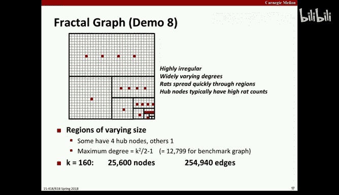
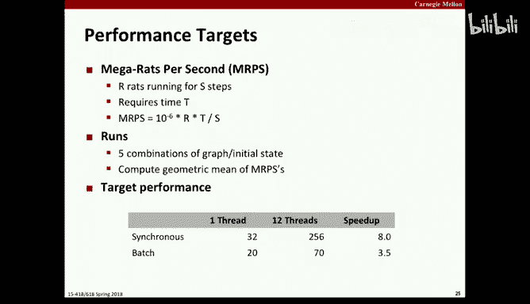
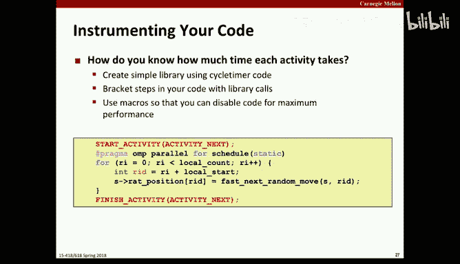
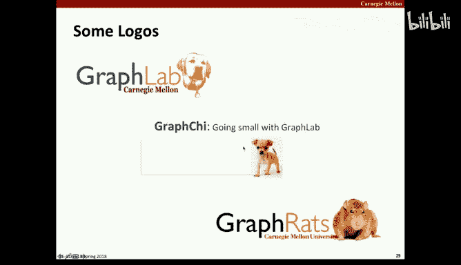
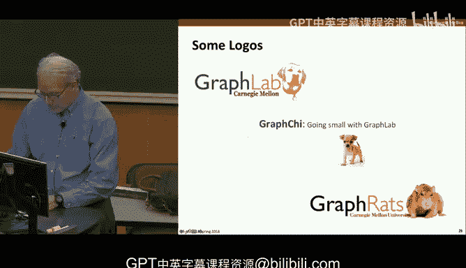

# CMU《并行计算机架构与编程｜CMU 15-418 Parallel Computer Architecture and Programming sp18》 - P15：Lecture 15 - 2-16-18 - Carnegie Mellon University.zh_en - GPT中英字幕课程资源 - BV18b421J7cA

あけろ。呢点。我你。I keep give keep it。那个月。Yeah的。教。し。大丈夫。没所。It's better。Okay。

 so today I want to introduce your assignment three that will be due you'll see in the calendar it's not due till March 7th so you might think。

 oh， I can wait till March 6th to get going on it。And some of you probably will， but。

The other thing you'll notice is there's an exam partly along the way。

 and you're probably going to want to spend some time studying for that。

 So that's the reason why it shows up as three weeks on the calendar， but figure that。

Some of that time will be occupied by studying for the exam。

 So what that really means is you should get going sooner rather than later。

This is an assignment that' sort of designed to sort of explore the types of algorithms that involve working with sparse data structures。

 graphs， sparse matrices and things， it's a completely artificial ridiculous problem that has nothing to do with anything but it generates some pretty cool graphics and it's fun to watch and like I say。

 the ideas behind it， the kind of computation you do will be much more along the range of what you want to do and sort of presents some of the challenges for parallel execution that you find in doing a lot of real worldord problems that involve sparse and irregular data structures。

So today， I'll sort of introduce what the application is。

 and some I'll show you a little bit of the code and the starter code。And talk about performance。

 So the code that you're given is fully functional， but really slow。 And you， you'll find that。

You want to speed it up both the sequential performance and the parallel performance。

And the idea of it is， in the real world。You don't。

 You're not just given a beautiful piece of sequential code and told。

 make it run fast down a parallel machine。 You sort of work these two together。 And in particular。

 some of the optimization， some of the。Design trade offs that you make in optimizing the sequential one。

Will be partly based on looking ahead to when you want to make that in parallel。

 what types of data structures and algorithms tend to scale in a parallel way as opposed to their only useful and purely sequential context。

In this case， we're going to be using multi corere processing。

 using the open MP standard for how you express parallel computation。 that will be covered。

In the recitation a week from today， well sort of go into that issue。 So， but even without that。

You can be looking at the sequential aspects of this。Well， well well ahead of， of things。

So here's the story。 Imagine you have a whole bunch of rats。

And you have a maze that is structured and will represent that maze as a graph。

 And so the simplest form of that graph is a simple grid with nearest neighbor connections in like a K by K square grid。

And so imagine that we place all the rats in the lower right hand corner。

And then we do a series of iterations。 And what each iteration is。

 is each rat chooses where to go next。 One option being to stay where it is。

 or to move to an adjacent location， the adjacency being represented by the edges in the graph。

So in this case， since they're all in the corner， they only only have two choices， three choices。

 Stay the same， go up or go down。And imagine there's some kind of reward function that defines what the preference is for each of these rats that will determine sort of in general what what their preference would be。

 And imagine that reward function is something along the lines of I don't like being in crowds。

 but also I'm a rat。 I don't like being alone either。

 So what would happen then on the next time step is that each these rats would make some choice。

 and it would be a somewhat random choice， but the weights。

By which the choice had made would be based on this reward function。 So as a result。

 some rats would move up， some rats would move to the left and some rats would stay in the same place。

 and that's the idea of is to run this kind of simulation。

 but not with just a small number of rats on a small graph。

 but to run it with a million rats on a graph with 25000 notes。

And that's really what you're doing for the assignment。

So to sort of take it into a more visual context。We can represent instead of having to keep track of each rat。

 because each of these rats has identical preferences。 So all we really need to do。

At least to visualize what's going on， not to actually run the simulation。

 We need to know each rat's position， but to visualize what's going on。

 we just kind of keep account of how many rats are in each square。

And this is a sort of text representation of it using this sort of art based on。

Priing printing characters。 but that's same idea as before we started with 320 rats。Some moved up。

 some moved to the left， and some stayed in the current location。So that's the basic idea of it。

And if we run this for longer。Then they'll sort of spread out from there and they'll move out and you'll see that they kind of get distributed across this graph。

But they still stand to even after 30 iterations generally stay clustered down to the right。

 It takes a while for them to all get out。 And the other thing is when。

 when the rats are sort of there， they're just one or two of them， they get kind of lonely。

 and so they don't really want to branch out even further。

 so that sort of limits how fast things spread。So that's doing it with this kind of。嗯。

Textual graphics is all well and good。 But first of all， it。

 it really won't work for very big graphs。 And also， it's not much fun to look at。

 So to make it a little more visually appealing。We can represent that same information with what I'll call a heat map。

And this is a standard technique for visualizing data， where you think of the。You know。

 Roy G Biv spectrum。啊。As you know， what you'd get if you heated up something in black body radiation。

 I guess。And。不的。Graphics here are very good。 You can barely see it， but like up at the top。

Are some dark， violet squares that can barely even see They look black here。But really。

 you see that's the same information that the。All black is the case where theres no rats there or a0。

And you can barely see it， but there's some very dark violet。

 That's the case where there's a single rat in that square。

And the greens and blues think of it as sort of the， the coaster you get to red and orange。

Further away from violet， the more that represents。And so we can do this that way。

So you can actually run this yourself， the。You as the instructions for the assignment say。

 you can call this from GiHub。And connect to it， and。Compile it。

 if you just run make and actually make a series of demonstrations。

And so let's go ahead and do some of those。

So the first one， I'm going to tell you what it's going to see。 Well。

 I'll do it twice just so you see it。So you see that， it's， again， with that text art。

 And you can see that it runs， ran for 20 iterations。And you can kind of see them fanning out。啊。And。

 and moving around。So， that's the。的。The， the space version。 that's demo 1。

And now from there， I'm gonna to switch to the。Ones that are based on this heat map。

Background's a little distracting， isn't its a nice mountain， but。没有。And it goes by pretty quickly。

 But you see， they all started in the lower right hand corner， and they're sort of spreading out。

 The other thing you'll notice is， it's kind of a jumble of colorss。

It looks like things are really bouncing around。 and there's no discernible regularity to the pattern there。

And that's an artifact of the particular update mode that's being used here。

 And I'll discuss that in a minute。 But just to remember that that something isn't quite right with that picture。

 And maybe we want to change how we do things。And you'll notice this is running on my laptop。

 This is just regular C code。 It's using Python， a Python program that provides actually in this case。

 everything I've shown you so far is a Python entirely。 There's a Python version of the simulator。

And the code for a C version of the simulator。But as long as you have the necessary Python libraries installed on whatever machine you're using。

 you can run it on anything。 Theres no special machine requirements。

So let's go in a little more detail about how this actually。

You how this next move computation is done。So imagine that you're a rat at some square in the middle of one of these grids。

And so you have the potential to either stay in your current location or move。Up， left， up down。

 left or right。And the way you evaluate that is you。

 you look at how many rats are there in each of these five squares。

And then there is a a reward function that you compute you being a very mathematical rat。

That's given by that formula shown below， which looks mess looks complex。

 but we can actually break it down and look at it in pieces。 But the parameters are。

 it's all based on。哎嗯。A what I'll call the load factor。Which is。

 I normalize the number of rats at each square by dividing it by the average across the entire graph。

So in the example I'm showing， assume that there was an average of 10。啊。Rats per node。

 basically just the total number of nodes divided by the total number of rats。The inverse of that。

And so that's， I'll call that the load factor for and that can be computed for each of these five places。

And then you'll see that there's a reward that's based on how close does it come to some ideal load factor。

 and what I'll say is that the ideal load factor is 1。5。

 meaning that rats kind of like to cluster in groups that are a little bit bigger than the average load across the whole graph that's actually has interesting properties as a result。

And then there's some other parameter。 I'll call alpha that's just made to kind of work， make the。

The function looked right。 But now， if we plot this。As a function of the load factor。

You'll see that it has this sort of general shape that that corresponds to what I said is there's some ideal reward of one when you're sort of the number of rats at this is about 1。

5 times the overall average。And it tapers off so that it's down to 02 for a empty square。On the left。

 and then on the right， it tapers off very gradually， sort of showing an aversion to crowds。

 but not dropping too precipitously。And that's actually an interesting property。

 because what you'll find， like， I started originally with all of them piled up in one node。

 And you can imagine some of these graphs where we'll do it with a million rats all at one place。

 So you don't want the reward。 You want some。Non zero reward value， even for these very high loads。

And so if you plot this on log scale on x。The load factor。

 you'll see that it's a very gradual reduction， and it's even sort of。1% of the maximum。

 even out as far as 100。So， let me just take a minute of why this look this function is actually。

Not just。呃。Something pulled out of the air。 Well， it is pulled out of the air。

 but it's constructed to have this general characteristic。So you'll see that on the innermost part。

 there's。L minus L star。 So it's something that will be negative if we're too small and， you know。

 less than the ideal and positive if it's greater than the ideal。

And then that will get weighted by some number and added to one because you can't take the log of a negative number or 0。

 So the log has to be something positive， but it might be something。Like for 0， if L is 0。

 you'll see that it will be 1 minus alpha and alpha is。25 or 0。5。 So it will be one half。

And then the log is there to give you that very gradual tapering off。

Property that you wanted even for very high loads to have something non zero。嗯。

And then that's squared because a log of a， of a number greater than one will be positive and a log of a number that's less than  one between 0 and 1 will be negative。

So you square that， and that gives you something that's always positive。

And then that's used to weight something that goes like one over one plus something。

 And think about the log could be as small as 0。If when you hit the。Ideal case。

And so then you'll get the reward of one。 But what you'll see is as you go either a little bit higher or a little bit lower。

 then it will be some kind of reciprocal。 So the the reward will decrease。

 So that's what that why that function is the way it is。

 It gives you the characteristics that you want。So given that。

 now that becomes then the rewards then。Become a set of weights。And so like I said， you can compute。

 for example， here， assume the average is 10。 So 81s is， is a pretty nice number。

 It's a little less than the average， but not a whole lot less。

 So that gives you a fairly high reward of 。7。The population of 300 at the top is gives you a very。嗯。

Lower reward。 It's too crowded。 And the other ones are somewhere in between。

So now imagine we take those choices and we order them。

And I just realized that this picture isn't quite right。

Because we'll always order the choice of staying in the current position as the first thing and the sequence。

 So they're not in the correct order， but the other ones will do it in row major order。

 So the blue one would come next。 the dark orange would would come next。

 the white orange would become and then the final would be the green one。

But the idea of it is that there's， and this is the standard way。 if you， how you compute a。

Make a random choice based on， on some weights associated with the different choices。

Is that you sort of imagine it in a set of intervals along a continuum。

From0 up to some maximum number。 And then you just do a uniform random number within that range between the0 and the maximum。

 And then that will indicate depending on which interval you fall within that will determine what your choice is。

 So if my random number， the total is a little over 1。5 here。 So if I generate the random number 1。

04， that would tell you move to the right。Does that make sense to people？

And this computation will be the c of core computation that gets performed。

 So it's fairly important to understand this。Although the code already does it for you。So anyways。

 you can see just right away that this is a nontrivial amount of computation to perform that。

And you have to do it。啊。Compute it for all the different possible destination locations。

 So this is where the sort of computational arithmetic intensity takes place。But like I said， the。嗯。

Except for this mistake in this picture。The way you do this random choice is， is very fixed。 And。

 in fact， one interesting property of this whole program is it's completely deterministic。

All the random number generation is handled by a set of seed values that are completely predictable。

 and the random number generation algorithm is is already built into the code。

 And so you can run it every time you run it， you'll get the exact same sequence of moves by the exact same set of rats。

And therefore， the exact same node counts。 And one the correctness checking of this code is you have to preserve that functionality exactly。

 which is kind of an interesting property。 It's a good thing。As you know。

 when you're writing a program to have predictable results。

 And so if it can be done in a way that is both scalable and completely deterministic。

 then that's a very useful thing from a software design point of view。跟。So。Now。

 there's a couple different ways you could imagine。How do you order the， the。

 the computations and the updates？ And so what I've showed you before and what gave it that kind of flashing patterns and sort of。

Was what I'll call synchronous mode。 And what that means is that。And。

For all the rats and the rats are ordered from 0 to R-1。

 but I will compute for all of them what move they would like to make。

And then I will make it for all of them。And that gives this oscillation， if you think about it。

Let me go back a little bit。Like you'll see here at the very first step。

That there are 320 rats in the corner。 And they all said， wow， it's really way too crowded here。

 I want to move。And so then they all moved， except for， you know。

 some small number that stayed behind。 But basically， what happened was now they。

 they've moved to a position where theyre。They're crowded。

 and they left a place that's now not crowded at all。 And that's what the oscillations are。

 You can actually， this actually continues on for long time periods。

 If you do this synchronous updating that you'll get kind of even as for very large graphs。

You'll get this sort of oscillation going。 These sort of checkered patterns that look kind of weird。

 And it's because of this。The synchronous update that they all kind of collectively choose something。

Based on the current state。 But then they end up in a new state where they've all made roughly similar choices。

So a sort of better way would be to do what I'll call rat order mode， meaning that rat 0。

Looks around， makes its choice and moves。 And then rat 1 does the same and so forth。

 And so each rat is sort of updating its。啊。Making its choices based on。

All the choices that have been made before。 they're all individual choices。

And that's actually a perfectly good way to do it。 But it would be really impossible to get any kind of parallelism out of that。

 So just to make life a little bit easier， we've sort of created this compromise that I'll call batch order mode。

Or batch mode， which is that you say， okay， some percent， like， let's say，2% of the rats。

 the first 2% all make their choices， and then they all move。

 And then the next 2% all make their choices and all move。 So you can see that actually。

 they're all variations of a batch order where the synchronous mode means the batch size is equal to the complete number of rats。

Red order mode is the batch size equals 1。And what I'll call batch mode is just something intermediate。

 where it happens to be set to be 2% of the total here。And you can see that in the。picturesictures。

So as I said， this is the kind of very osatory behavior you get。嗯。In synchronous mode。

And this is with rat order mode。 You'll see that it's more like it starts all red in the corner。

And then they sort of fan out。And become orange and then yellow and green as， as they spread out。And。

 and batch mode。Obviously， it won't be exactly the same， but you can't。

 You don't really discern at least。A difference in。

 in a significant way between that and red order mode。So we'll go with batch mode。And for your job。

 actually， you're gonna to。Your job will be to implement both or speed up both the synchronous and the batch mode。

The synchronous， even though we don't really， it's not very useful。 Of course。

 none of this is useful。嗯。Right， it's all just silly。 But， you know， it's's sort of defective。

 Let's just put it that way as some model of whatever it is。

But it's still way easier to make it run fast。 So we'll kind of give you a break in what you do that。

 And then you'll find that you're pounding away on batch mode， trying to make that run fast。Good。So。

So as I mentioned， you actually have two different simulators there。

 both of which are functional and both of which produce behavior identical to each other。

 One is in Python。And so far， all the demos we've been giving are in Python。

But then theres C code that implements a simulator， and it's faster than the Python。

 but it's still way too slow。So what's just， and the interesting thing is the way you。Do the visual。

 The C code doesn't have to do any fancy graphics。 It can just pipe its output。From standard。

 its standard out output is just a textual representation of the。啊。For each node。

 how many rats are at that node so it just spews out a file basically。

 and it gets piped into the Python code， can operate in what I'll call drive driven mode。

 where it's accepting this as its input and it's generating those pictures as it goes。

So just to show you some examples。嗯。What is the。Oh， that was actually the C code。

So this is the Python running， and you can see it's all a big file。

 but you can see the magic incantation that happens on the command line G run dot pi is the Python simulator。

 and you see it says minus G and it gives the name of a graph。Minus R。

 the name of a file that contains the initial rap positions。Minus U B， meaning update in batch mode。

 do it for 20 steps， visualize it with a heat map and run it with a 03 seconds per。Per frame， it。

 or at least it will slow it down if it would run faster， if it can't keep up with that。

 it doesn't do that。嗯。And demo 5。Was doing the exact same thing， but using the C code。

 which is called C run。On the same graph， the same general parameters。

 but it's piping it now into G run dot pi， operating in driven mode。

 using the heat map visualization and controlling the refresh rate at 0。3 seconds。嗯。But the。

 the real thing will be to run some bigger simulations。This is slow。

 mostly because it's running on my laptop and my laptop is not a very powerful processor。But。

 this is running。A simulation with a million rats on a graph that's 160 by 160。

 So total of 25600 nodes。And。嗯。This is actually the sped up version。

 The the version that you have at starter code is slower than this。By a lot。

 by like a factor of 20 or something like。But you see it's a lot more fun to run on these bigger graphs。

 you get more interesting pictures and stuff like that。And I'm showing you this partly because。

 you know at some point you're just trying to make this code run fast and you don't really care what it does。

 but it's worthwhile to take the time to run it as a you know and do the visualization as you speed it up。

 the thing starts running faster， just like you found with assignment too。

 that the rendering gets a lot more interesting when it runs faster。Okay， so the one requirement。

 though， is thou shall not change the behavior of this program。 So you can make it run faster。

 but it has to be exactly the same in terms of its function。

 And that includes down at this very detailed level of all the random choices that are being made。

And all the forwarding point calculations have to be done in a way that preserves your functionality。

 So that limits some of your options， potentially。And but the good news is often if there's a random number generator and you're trying to control it。

 that actually can be a serious bottleneck。On a parallel program。

 if they have like one global random number generator and and numbers have to be generated。

 say for rat 0 first and rat 1 second and so forth。

 then you've got a problem that you have this bottleneck that there's just no way you can fix it。

So the good news is this has been designed in a way that that bottleneck doesn't exist。

 Each rat carries its own seed。😊，To the random number generator and in each value。

 So each random value can be generated independently of the others。 And that's a good news。

 as far as parallelism。And there's actually code built in there， a regression tester。

Regression testing is generally means just rerunning the same test over and over again whenever you make changes。

 just to make sure you haven't broken something that used to work。

And it's a very standard practice in both software and hardware design。

 And you can imagine it's a good idea， if especially in a larger project。

And so there's a program that will do simple regression testing。

 what it's doing is comparing the Python version to the C version。

And because the Python version is slow， it actually creates when you run it。

 it creates a little cache of precomputd results。And it will reuse those if they're available so that the regression testing can be very quick。

 It will only take a few seconds for you。 So I suggest you keep doing that all the time。

Because there's nothing more frustrating than spending a lot of time tuning up some code and getting it really running and then finding that actually。

 you're getting the wrong results and。Part of the reason why it runs so fast is because it's broken。

 so。It really helps just to get in that habit。 The other thing I'll mention is the regression test only tests some smaller cases。

 And in my own experience， I found all the bugs that I created in this were detectable on very small runs。

 very small graphs， very short runs， but you shouldn't assume that's always true。

 And you might want to modify the。This file re do pi to add some more larger test just to make sure you're not getting tricked。

And once your performance is reasonable on your C code。

 the cost won't be too bad because it will cache the Python code results。

 which might take a while to run。 And so it will run at the performance of your C code。

 So my point is that you're responsible for making sure your results are correct。

Don't assume that just the tests we give you are the only ones you need to be able to pass。

Makes sense。That's just a general statement of。Of。Of。Any kind of reasonable programming assignment。

So graphs so far all we've been looking at are grid graphs。

 ones where there's just nearest neighbor connectivity and some properties of that you can think about is it means that each node has degree of it most4。

 four neighbors plus itself potentially so there's five destinations。

 and of course it's very regular and all the communication or movement is very localized。And so that。

 potentially， from both a sequential perspective and a parallelel perspective， is very good。

That you can imagine various scenarios of partitioning and things。

But just to make life a little bit more interesting。

And you'll see that the total number of edges is about just a little less than four times the number of nodes。

 The reason it isn't exactly four times is because of the ones along the boundaries。

But this is what you call a sparse graph。A spae means that potentially， you know， in a graph。

 the number of edges goes like the square of the number of nodes。

 And here it's just growing like linear in the number of nodes。 So it's a very sparse graph。

But very regular。So just to make life， and that's the one that you saw before of the demo。

A little more interesting。 We've created some more graphs that kind of。

Aren't quite so sparse and aren't quite so regular。 So one is what I'll call a tiled graph。

And as this picture shows these sort of these regions。

 and then these red dots indicate what I'll call hub nodes， and a hub node is one that's connected。

 has an edge to every other node in its region。The regions aren't。 There's nothing otherwise special。

 Oh， and this is all layered on top of the grid graphs。 So there's still grid connections。

 It's just that there's these extra connections。That make it have this tiled structure。

But keep in mind that those black lines aren't really any kind of。Brier in the graph。

 They're just designate where this each of these hubs， how far it connects to。And you。

 you'll see it gives you a pretty different behavior。

As far as the simulator。So we'll start again with all the rats in the corner。

 But what you saw was pretty quickly， the whole hub， that whole lower corner region filled up。

And then it started crossing into other regions， and then they start filling。

 So things tend to propagate sort of block by block outward。

 And the other thing you'll notice is that the hub nodes are visible there。

 with a brighter color than the the regular ones。 And the reason for that is even though they get very crowded。

Theres they have such high connectivity that。A fair number of the random choices will end up there。

 even though the， the reward function is fairly low。Right。

 so think of it that they have 99 times more potential sources for it。

 And so even that the reward function is very low for those。Just by probability。

 there'll be some number of choices like that。 And so you see this pattern continues outward of these。

Hub node， sort of picking up a lot of stuff。But still， it， it has a property that the graph is。

I's not just totally。

There's still a lot of regularity and locality to the graph。

Right so the maximum degree then would be each hub node。Is connected to D squared-1 other nodes。

 the rest of its region， where D is the size of this region。 And in the benchmark graph。The D is， is。

10。So there's 99 connections。Most of the nodes have degree 5。

 right because they've added this hub connection。But some subset of them have degree 99。

 So you're already getting some variation in it。And you'll see the total number of edges grows by about 50000。

 So it's still a very sparse graph。And you can also see as a structure that its globally has a very regular and。

 and local and。Still a fair amount of。low connectivity。Whereas within the the region， so there。

Have this variation in degree and much higher connectivity。And you notice。

 as you saw in the simulation that the hub nodes tend to pick up and have a lot of rats on them。

 and that will be significant as far as the computation codes。Okay， so that's one graph。 Now。

 it gets even more fun。😊，To have what I'll call a fractal graph。

I got sort of inspired by the manelbrote set， so the。

Idea of the fractal graph is you see that it recursively subdivides where at each level。

 you have a rectangle spanning half of this region， the area。A square giving you a quarter。

 And then the recursive part is in the lower right hand part。And then you'll see that the。

 the rectangles have four hub nodes each。 So they have even higher connectivity。好。

And so they're actually pretty interesting to watch this simulateimu if you like this kind of thing。

So， again， they're all starting in the lower right hand corner。

 But you'll see that the four hub nodes really pop out and。That， very quickly。Things fill up。

 especially for the upper rectangle， where it has these four hub nodes。 So it's very connected。

graphraph， and things tend to span outwards。 And you see up there just coming visible。

 the four hub nodes of the next region out。Coming into， to view and then slowly coming on。 This is。

 if you watch this on a screen that has better contrast， you'll see that there's。

More sort of blue violet stuff going on before that these other colors come in。

And it's kind of interesting。 if you think about the only connectivity between these regions is just crossing the。

 the set of gridner connections。Between the regions。

 So theres sort relatively low bandwidth between regions and very high bandwidth within within each of these regions。

So you see already， we've got。YouYou're seeing the four。Hub nodes at the topmost level going。

But think of about this， from a graph perspective。That。

呀。嗯。O。Think those four hub nodes at the top are connected to half the nodes in the graph。 right。

 So in my larger benchmark， that is going be。Over 12000 degree nodes。 So that's a really。Now。

 we have this huge discrepancy in terms of the， the regularity of the graph that some will have degree as most of them。

 in fact， will have a degree of  five at most。But then these hub nodes will have it。

 And depending on which。A region it's a hub for。 You'll see that it can range from fairly small up to really quite large。

And also， if you do count of how many。Total edges are there in the top half versus the bottom half。

 You'll see that it's heavily weighted toward the top because of those four hub nodes being open。

And so it increases the number of edges now up to 255，000。Or so。It's， it's higher。 But actually。

 if you think about it， it's still going to go be linear in the， if we kept growing this。

As a function of the。Overall， number of nodes， it's still gonna guarantee that the number of edges is linear in the number of。

嗯。No。Right。So anyways， you can see that this graph is very different from the rest It's very irregular。

 Why do we varying degrees。The rats， it will cause the rats to move very long distances quickly。

 though basically the whole upper half， they'll be able to just traverse in two hops to get from any part to any part of that upper half。

So so far， we've just shown I've just shown you the ones where they all start in their lower right hand corner。

 But that's not all。 We have two other initial states that we are using as benchmarks。So one is。

 I'll call it R for right corner。That you've seen already。 And the other。

 I'll call it D for diagonal， meaning that they're just uniformly distributed across the diagonal of the graph。

And then the final is you for uniform， meaning that。The ratts are even absolutely。

 evenly distributed across the graph。And I'll mention that。

This is all built into files that you read in。But the order of the rats has been purposely permuted。

 so that。嗯。They're， they're completely random。On the， the two right hand distributions。

 it doesn't really matter for the， if they're all in the same place。But for the other two。

 they're randomly distributed across the set of nodes that they're on。 And that actually is。嗯。

For example， what makes batch mode reasonably good choice that。

They're sort of randomly positioned where which ones will move in each batch。

And you have to preserve that ordering。So just to go ahead and do some demos。

So you saw the one where it was。The fractal graph all starting in the lower right hand corner。

 Now let's do。 the fractal graph all。With them all lined up on the diagonal。

And you'll see that it very quickly goes from that diagonal outward。 And you see how quickly。

The large。Regions。Things distributed because like I said， things can move out， Think of it。

 Theyre all in one place。 They all want to get out。 A lot of them choose to move through the hubs。

 And then from there， it's completely random where they go to。

 So things tend to get distributed very quickly。 And in some ways， from。

Pllel computing point of view。 That's a good thing。

 It means that things are relatively balanced in terms of， of where things are， are located。嗯。

And the other thing you'll notice on the upper part， that sort of blocky pattern。

 If you think about it， what it means is that the blue ones are places where there's relatively small number of rats。

And the green are ones where they're sort of clustering in there。

And what it says is it's because this reward function sort of wants things to be 1。

5 times higher than the average。 So instead of kind of smearing out and becoming uniform。

 they tend to clump into these clusters。And， and sort of hang together。啊。That's a preferable pattern。

 and there's no stable pattern in this either。 you'll see that it keeps changing。

And if you run it for a really long time， I've run these things for like 10000 steps。The。

 the clusters become sort of larger and and more pronounced as they run over time。And similarly。

 if you start with them just completely uniformly distributed。You'll see that they start。

Forming these clusters。This clustered behavior， this kind of bloty behavior。

And that just keeps going。 And this is for the still for the fractal graph。

 But even if you run this on a purely uniform grid graph。You'll。

 you'll get something that looks like this where it becomes these sort of patterns that over time。

 you see that the。Gen areas become greener， and the blue areas become bluer because they're。

 they're forming these clusters with fewer。嗯。With regions that are relatively empty。

So it's kind of interesting， I mean。If this kind of stuff interests you。These very simple rules。

And that particular function that you showed sort of drives。A behavior here that is。Is I mean。

 you can you can see why it's happening that way， but it's it's interesting to watch what really happens。

So you can see now over time how much it's sort of。啊。Become more and more。These these areas。

 the bluer parts become more pronounced and sharper and larger。

 and the greener parts become more clustered together as well。

And that was running for just 100 steps。Okay， so that's the sort of application and what you're trying to build。

Let's talk now about how it's implemented。And so what I'll be showing you is is what the starter code is and some of the data structures it uses。

So let's just for parameters， say that it's an end node graph with M edges。

And this picture shows if I just have a 3 by three grid。Then， the graph is represented。啊。

As a data structure that。Baase square as an entry。For all the， all the edges。

 including you can think of one way you can think about this as there' is a sort of implicit self edge on every node。

 an edge connecting itself because it can always just stay in one place。

And so this would be an array of length n plus M。Which would be too long to display here。

 So these black arrows think of this thing as just being concateated as this very long array。

And what you'll see is。Here， this each of these red boxes denotes the connectivity for one node。

 and it always starts in that what what the gray values are is。The identity， the I D。

 the number of the node for which these are the edges。 So this is。

A variation on an adjacency list representation that you've probably seen before that。

I'll just list for each node。 I'll have all of its neighbors listed first itself。

 and then the rest of them in row major order。And I'll concatenate those to form a larger。

 single global array of， of total length M plus n， the N required to do the self edges。

And everything's done in row major order。 The nodes are listed in the graph in row major order。

And the edges for each node are listed in row major order。 And also， you can think about this graph。

Is it's like it's a directed but symmetric graph。Meaning that。There's an explicit edge， for example。

 from 0 to 1。And another edge from 1 to 0。So it's like two directed edges going in opposite directions。

So when I say there's this many edges in the graph。I really mean directed edges。

So the other part of this data structure is。A list。An array of size n plus1。That lists the beginning。

En for each of the successive nodes。So node 0 starts at the beginning of this array。

Notode1 starts at position 3 in this array and so forth。 And you'll notice at the very end。

 there's a pointer to the just past the end of this array。Again， this is a fairlyway standard。

 Actually， this is a commonly used way of representing sparse matrices as well。

's called compressed spae row representation， because sparse matrix is really just a graph。So。

This is a fairly common data structure and fairly useful。 And this actually the。

Coode that you're given。Builds this data structure， as it reads in the graph。

 You don't have to change that at all。So why do you think it might be useful to have a pointer to the end of the graph。

To the the end of this list of edges。So for a given note， how do I find what its degree is。

Its it's out degree， yeah。The thing to is right。ThatNeighbor start list。Yes， very good perfect。So。

 you subtract。The， the position won over。To from the position of your own。

 And so by having this extra one at the end， you don't have to have some special case code to handle the last one。

 node number n-1。You just handle。 And so it just makes， there's nothing。

Special or mandatory about this， it just cleans up the code where otherwise you'd have to special case this thing。

And so again， this is a pretty common trick。 I learned it from the way people do math libraries for sparse matrices。

So let's look at some of the code and see how it， it works。So a couple points to notice。

 One is that you'll see a lot of code here that's declared a static in line。Static， as you know。

 means this functions is only defined within a particular file。 And in line is a。

Hint the compiler to say， if at all possible， instead of compiling is a separate function that gets called。

 just put the code directly in in line to otherwise to avoid the overhead of function calls。

Smart compilers will do this inlining automatically without you having to tell it。

 it it'll have its own rules。 But GCC is not that smarter compiler。I mean， it does inwining some。

 but if you want to kind of push it。A little harder。

 It doesn't hurt to throw in inlines in on small functions like this。

 It will actually change the code。So that's just for some， you know， little helper function。

 you should feel free to use those。Because， you know that if you declare it as in line。

 the compiler will。Stick it in there and optimize the whole code around it。

 And you'll get just as good a performance as if you'd expanded that yourself。 So this is what。

 essentially， think a minute。 Theres no cost to using helper functions。嗯。

And the other advantage of helper functions is if you compile it， you set the compiler switch to 00。

 then it it will ignore these， and it will actually have those functions。

 and you can set break points and all those things that you're used to doing。

 And so it just makes debugging easier。 So that's just a really good way to， to work things。

The other thing to notice is that all the functions here are being passed a pointer to a struct of type state T。

 And what you'll see in the code is that。There's only two global data structures。 One is the graph。

 and the other is the state， which concludes things like the positions of all the rats and the counts of every node。

 how many rats there are。And that's also generally a good coding practice。

 You've probably seen this before that rather than having global variables that are just sort of sitting there。

Hard to keep track of。 You sort of put it all into a structure。

 if you're using C plus plus into a class。That lets you then dynamically allocate it and kind of keep track of where the。

 the。The global state for your system is。And so it you know how to allocate it。

 You know how to decate it。 You can kind of keep a focus on it。

 So you'll find you're going to want to stiff more stuff into thesestructs。啊。And。

So feel free all this code。 You're free to edit and modify to your heart's content just。

You have to preserve the functionality。But I'd recommend that。

 And I' you'll see in the code that all the data structures are allocated dynamically with malloc or Cc or something like that。

 And again， that's something you should do。 This code should be able to run on little graphs。

 big graphs， everything in between。So don't assume any fixed upper bounds on how big things are。

So anyways， this thing is given the current state of the simulator and ID。

 all these things are by the way， you'll notice it's all using a rays of ints。And integers。

 instead of pointer data structures is something more exotic than that。

So it's given identity for a node， and it's being asked to compute the weight。

 and you see it's calling a function M weight， which is that reward function。I showed before。

And the code and the I I was realizing the code uses。

Terminology that's not consistent with the write up。

So it uses load factor to mean the average across the whole graph。And it calls the。With a value。嗯。

So just。One thing about this class is it will help you get used to the real world where code and documentation are usually inconsistent。

That's one inconsistency thing。 But it's just computing the count at this location。

By divided by the average across the whole graph。And applying this reward function to return the value。

 So it's a pretty straightforward computation。 I just wanted to show you some little pieces of it。

And now let's look at the actual next move computation。

And you'll see how it's making use of that neighbor graph。啊。

Using the technique that we just figured out that it's pretty easy to identify the start and end of the edges for any particular node。

That the starting position is is given by this neighbor start。

 and the end is one short of the start of the next node in the one。 So N I D plus one。

And you'll see what what this code is doing is it's computing the sum。Of the。

 the rewards or the weights of across the entire。For， for a given note。And remember that the。

 the graph data structure already includes the， the self loop。You know。

 stay in one place as the first choice in that list。

So you don't have to do anything special for that either。 So you。

 you see that it's all it's having to do is call this compute weight function for the entire。All。

 all the edges， including the self edge for this particular note。And now from that。

 we can create a a function。That actually does the next move calculation for R R。And it includes the。

 you'll see this coat here is retrieving。The seed that's associated with that particular rat。

And it's calling a a rent of。A。A floatinging point， a random number generator that generates。

A floatinging point number is between 0 and some maximum value， and it。

 it's past a pointer to the seed。 And what it does is it does some computation that both gives you a new number and it changes the value of the seed。

 So by passing a pointer to。The seed， it can use its current value and change it。

And then you'll see it's basically the same idea as before。

 except what I'm doing is I'm now going to go back through this list and stop as soon as I hit one for which I've sort of hit the right interval of where this number lies。

Within my range of possibilities。 And so as soon as I。嗯。

Hit a case where the random value I've generated is less than the sum。I've seen so far。

 Then I'll say， oh， okay， that's the next note I'm gonna move to。

And that's really basically all the computation that is going on here。 It's really pretty simple。

Because the whole model is pretty simple。But now let's think about。

 this is the code that's given to you in this st code。And you can begin to see why it's so slow。

Like just as a thought experiment。嗯。How many if this is a classic linear search， right？

 So if I had a degree D。On， on this。Edge。On average。

 how many steps would we have to take before we found the right spot in the the west。Just。

Pick a number。Is a function of D。If you're going through a linear list。

 what's the expected number of times you'll have to go till you find the thing you're looking for。

D over2， right？So， given that。For one rat。Doing this computation。

 how many times do I What's the expected number of times I'll have to actually do this reward computation。

Is it D over2？How many people think it's the over to？How many people think it's more。

How many people think it's us？How many people aren't picking？哦。呃。Let， let's look at it。 First of all。

 how many are in this function we showed you before。 Comp the sum of the weights。It's D， right， We。

 we have to first compute the sum。 We have to know， go through all the edges。Computing this。

 this cost function， this reward function。D times one for each edge， at least in this code。

 you could imagine maybe something more clever。And then we go back through that same set of values。

But do we get to make use of the ones we've already computed。No， we're。

 we're actually computing it all over again。 So you see that our average here will be three times D over 2。

You know， roughly speaking。And now suppose we did this。

 we had a batch and we had X rats that were all starting at this exact same node。 Like。

 imagine that we're a hub node with a pretty high number of rats right there。So what would the。

How many times would we be computing this weight function。This reward function。

And how does it scale with apps？It's going to you， right， We're not saving anything。

 We're just recomputing this over and over again， so。You。

 you can already see even though the node counts for this batch。 remember。

 none of the node counts change because we haven't moved any rats yet。 So for those X nodes。

 really we' be making the the same calculation of the reward functions。

And the totals will be the same。 What will be different。

Is that they'll generate different values for this floating point number。

 And so they'll reach different stopping points in this calculation。The other thing is。

 think about this for。When the degree is。12000， something。D over 2 is 6000 something。

 So it's a pretty big number that it will have to step through this。And maybe you can think of。

 of more clever ways to avoid some of that。So you can see here already。

Part of the reason why it's so slow is that it's recomputing the same stuff over and over again and not taking any advantage of sort of that a lot of the computation is really the same。

 So you can imagine various ways you stash away information。From prior computation。

 So you basically are allocating more data structures， more arrays。

For holding values so that you can reuse that computation and reducing the amount of arithmetic you're having to do。

So that's sort of the kind of things you want to do for sequential。 And， of course。

your parallel performance。Actually， what's interesting is what I found is a lot of the things I did that made it。

Improve sequentially。Decreaseed the speed up。 I could get parallel because。

It's easy because it basically was decreasing the arithmetic intensity。But still。

 the overall gain was positive because of。啊。It was enough of a savings on the sequential performance that even though the speed up was worse。

 the overall improvement was positive。It was more than one。So this is， there's some constraints。

 Then when you try to make this go parallel， that you still have to preserve this behavior that。

You have to。嗯。Run the simulation for some number of steps。The嗯。Each batch has to。Be completed。

 You have to compute all of the moves and then move them。 You know。

 you can't really predict what these random number generators are going to give you。

 So you have to kind of do that computation。 There's only so much you can change about how this computation is performed。

On the other hand， there's lots of parallelism sort of across the nodes of the graph， for example。

At any given。Bch。The reward values for all the nodes are going to be the same。

 So you could imagine parallel computation across all the nodes to do that at times。

 across all the rats， at least all the rats within the batch。

 you can do this next move computation in parallel for them。And so there's。

 there's various places where you can find parallelism in the graph。

 and it will switch depending on what you're trying to do， whether it's sort of across nodes。

 across rats or even across edges in the graph。So。The way we'll measure performance is a metric I call megats per second。

The idea being， if， I mean， it's sort of。嗯。If there's our rats。Takes time T。And you。

Oops， this formula is incorrect。

Let's fix it。So two bugs I found。

So if there's R rats， S steps， time T， then you get a rate of how many rat moves there are。

And then you scale that by a factor of 10 to the minus 6 just to put it in some reasonable range。

And so the benchmarks you'll be running on will be five different combinations of graphs and initial state。

 and they all are the same size in nodes。 they're the 160 by 160 grids。

 but you'll be given various versions of the tiled graph or the fractal graph。

 and then various ones of these three different distributions。And then it measures megats per second。

 and it averages it， but when you average a speed， you're not supposed to do just a regular arithmetic average。

 you're supposed to use what's called the geometric mean。You can look it up on Wikipedia。

 It's just a number that calculation that gets done。

And so that will come up with a sort of metric average megawatts per second for your program。

And then you're given the performance。 you're actually going to be graded on six different numbers。

3 for the synchronous mode and  three for the bat mode。

So the synchronous mode says you'll see that and these targets are based on what I was able to achieve。

 and actually one of my hopes is that somebody in this class will totally blow this out of the water and make it run way faster than I can。

 I'll be really excited if that happens。 so I have no ego involvement here that will be if you successful。

 I will feel bad about that。 I'll actually feel glad and I look forward to seeing what people are able to do。

 So this is the performance based on performance I was able to get。

 and you could see that the synchronous。It can run pretty fast， and it speeds up very nicely。

 a factor on a 12 threat core machine。 It speeds up by a factor of 8。

 And that's actually pretty good on a problem like this with these large data structures。

 with irregular graphs and stuff like that。You'll see for the batch mode through a lot of work。

 I was able to get it single threaded performance to be pretty respectable。

 but I could only get a speed of about 3。5 on the on a 12 threaded machine。

 So this is the number if if people can beat this。 I'll really be glad to see that。

 and I'm hoping that you can。Question。Oh， it's less than one。Yeah， the fractal graph it's like 0。1。

So it's really， you， you'll actually， you'll think that there's a bug in the code that's stuck in an infinite loop。

When you try and run a simulation of the fractal graph of the big fractal graph。And then of 30 years。

The sequential speed up， I recall。It's really interesting that。Tilegraph。

The starter code runs it like a couple omegats per second。But the fractal code runs at， I think。

009 Ms per second。 So the geometric mean is something less than one。So it's an over 30 x speed up。

 especially on， and my graph。 mine is relatively insensitive to which graph is running。

 So I was able to sort of avoid the。The really high costs that this one has， the starter code has。

Yeah， so your speed up will be a lot。 And the Python code's even slower。 It's really slow。

The the Python code exactly replicates this behavior。By the way。

 the original plan for this was I wasn't gonna give you any st code at all。

It's going to give you the Python code and say， you go off and implement it， implement in C。

 C plus plus， whatever you like。But then I realized， no， this is like。You。

You have to then read in the graphs and all this stuff。

 it's not really appropriate for an assignment like this。So anyways。

 those are the performance targets。 And like I said， I'm really。

 one thing I hope is that people like be able to beat it。嗯。So。Just to finish up， then。

 some advice is， you know。You can start today on improving the sequential performance。

 And if you just think， why you're doing it， you know， will this also。

Kind of keep in the back of your mind。 Eventually， I need to make this in parallel。

 So I have to think of ways that work reasonably well。 And in general。

 sort of similar to what you found。On the last assignment is things like， well。

 half maps and things actually do work in this context。

 but you don't need very fancy data structures。 So there are mostly various arrays and things like that。

And you should be fairly， you know。Very much guided by the timing measurements。

 And I'll talk in a second about how to do those measurements。

It's generally easiest to work on the synchronous to get it running fast both sequentially and in parallel。

 so that's a good one to work on。 that gives you a sort of starting point and then start working on the batchbone。

As far as machines， you can use any machine you like the GHC machines actually are pretty good。

 multi they have eight cores， as you know， and you'll find actually I was getting better performance on the GHC machines than on the machines that will be used for the actual testing。

So you can do the code development or on Unix。 Andrew or any machine you have access to。

And your own laptops for the sequential as well。The actual measurement will be done on a cluster of machines that are called wait days。

 And the reason for that is。We can guarantee you're guaranteed when you're running on it that you're the only job running on this entire Zion processor。

 and so you wont your performance will be relatively repeatable。

 you won't get sort of thrown off if some other like on the GHC machine。

 if somebody logs into that machine and fires up a job。

 all of a sudden your your multi-threaded performance can really tank because you don't it's taking over some of the cores。

 So this gives you that。Good thing。 The problem is that these。The late days。

 machines are a couple years older than the GHC machine。

 So even though they're pretty decent Xion processors of their era， they're not quite as fast as。

What you can get today。So what it means is don't take too seriously your。

 your at least your parallel performance on。Your development machines use the late days cluster and the batch processing technique that's described in the handout to keep benchmarking your your performance。

So one thing that's final piece of advice is set up some systems so that you know where you're spending your time in the code and this is in general too。

 I did this too when I was doing the rendering assignment for myself a couple years ago is that I made the use of that cycle timer code and there's a variation given to you and C instead of C++ here that。

Lets you do reasonably fine grain time measurements， not really fine grain。

 but somewhat medium grain。And basically， what I do then is I wrote a very simple library where I could designate different categories of computation being performed。

 so which I named via enumerated type。 So there was one enumerated type to represent the next move computation。

 and this is part of my actual code。And this is using how the openM works that you put these pragmas in various places and that tells it how to split it up and do it over multiple threads。

 we'll talk about that again， it's pretty cool， but the main point to notice is that there's I'm sort of labeling this region of the code is a particular type of activity of the next move computation and so every time it hits it。

 it will start a timer and it will record when it hits the end and then add it to a counter and there's different counters for different types of activities。

And it's all done with a macro that I can disable altogether so that when you're really。

 if you're worried about whether these counters are slowing you down。

 you can just shut them off completely。 So that's a pretty standard technique。

 It doesn't require a lot of sophistication to write your own library like this。

And then as a result， I could， and this is actual performance of my program running on the waitdays cluster is then I could see when I ran this program either in on a single thread or on 12。

呃。Up to 12 threads where the time goes。 and you'll see that some things stayed pretty much the same like the start reading and the graph kind of stuff。

Some of it scaled fairly nicely。And some of it actually increases because I was using set operations to kind of aggregate information And so my overall speed up here was only a little over three。

 but this gives you a sense of where should you put your priority。

 What parts are your bottlenecks both sequentially and parallel and which parts are scaling better than others in the computation and that's just tremendously useful information。

 Otherwise， you're just sort of making random choices about where's your where should your priority be for optimization。

 So this kind of thing it's not hard to do will just give you a much better window into what's happening yes。

 there are packages that can help you do this that might be more sophisticated。

 but often simple things that you have your own design on are easier to work with than trying to learn some fancy library。

Okay， so the last thing， just this logo is kind of a joke that there was a project here a few years ago。

Called Graph Lab。Where the mascot was a werador。 And so。Then a graduates。

 that was a machine learning， a program that actually became a startup company that was acquired by Apple。

And the faculty member in charge of it got recruited to University of Washington。

 But he's now actually， I believe， working for Apple。

And then he had a PhD student who took this big project and showed that you could actually do it on a single processor pretty well。

 So I called it Grraq for graph Chihuahua。

And so I thought， okay， let's go from dogs to rats。That's the deal， Okay， so。

Have a good weekend then。