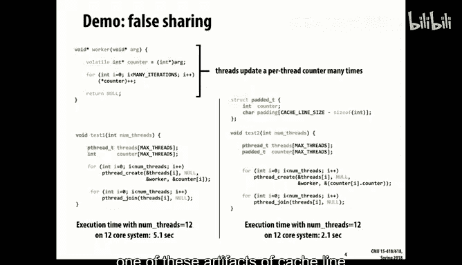
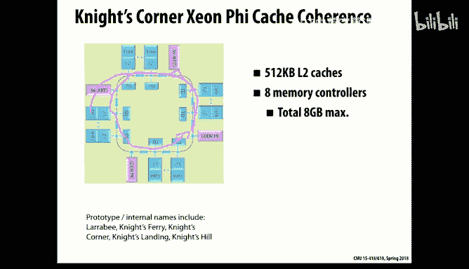
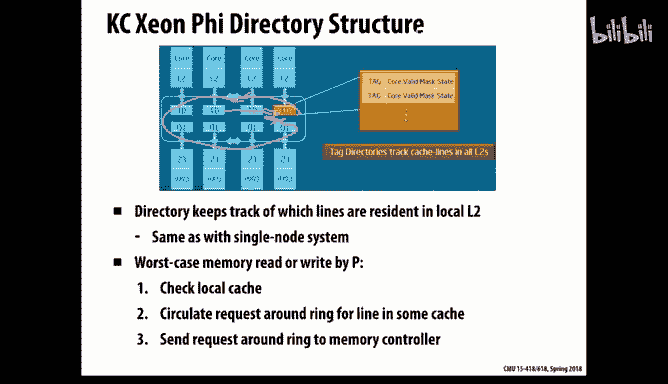
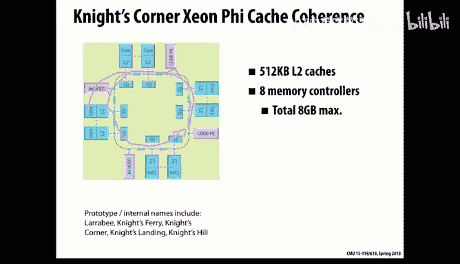

# CMU《并行计算机架构与编程｜CMU 15-418 Parallel Computer Architecture and Programming sp18》 - P16：Lecture 16 - 2-19-18 - Carnegie Mellon University.zh_en - GPT中英字幕课程资源 - BV18b421J7cA

So last Friday， we talked about stooing cash coherence protocols。

And I ran out of time or not last Friday， last Wednesday。

And I ran out of a time before telling you probably the most important thing you as a programmer need to understand about。

好。Programming systems that have any kind of shared memory， shared cash。System。

 and that is what's called fault sharing。So fault sharing is a case where。The program。You have。

Chunks of data that happen to fall within a single cache line。

 but they're being used by different processes on different cores。

And so what happens is they start fighting with each other over this data。

 they keep imagine its writeriable data， and so they're both reading and writing， say。

 individual counters。And。In principle， these are totally independent operations。

 the caches could each of their L1 caches could load up these values。

And the systems could really go to town。 But because they happen to be allocated within a single block。

That the cash system thinks that this is like having to provide。

Exclusive access to each of these values， and so they go in this protocol fight and you saw how much more overhead there is。

For keeping something rightable， there's no sharing possible。

And so the thing just goes crazy and you'll see that in real life， and so here's an example。

Imagine we this is just a P threads example。 So imagine we have some number of threads and we allocate an array of counters of that number of threads。

And then we just start incrementing those counters， each thread independently increments the counter。

And here's another version of it that says， well， I'll have an array of counters。

 but I'll actually pat each counter with a little bit of or a non little bit of memory in order to make them fall in different cache flow。

So you can think of it in this case。All the。All of them will fall into a single cash line。

 And in this case。What there will be， so be a。A counter。And then some empty space in another counter。

In some empty space， and so forth。Such this is a cash line in size say 。And so in this case。

 there's tremendous amounts of fault sharing that they're all having to fight with each other for this one line。

 and in this case， they each get their own independent lines and the memory system just maps them all into their own one caches and they are all happy。

And so you can see that in real life。嗯。On a a machine with 12 core。Probably the wait days。

 one of the wait days Zons that it takes five seconds in one case and two in another。

 And that's actually a。Pretty mild version of it， You can get much worse than it。So that's probably。

 like I said。One of these artifacts of cache line size that will catch you by surprise if you don't understand it。

 that you can write code that looks fine。 you're doing。

You have no synchronization required in this code。It looks good。

 but the thing is you're basically fighting。Or misusing the whole cache memory system in this。

So like I said， it's typical if there's some data structure like this picture shows。

 where it's a cacheline that's crossing the memory allocated for two different processes。

And that's part of the reason you remember in the previous example。

 we talked about that sort of four dimensional。Layup of memory that you'd kind of go it through it like this。

So that each processor got a contiguous range of address。

And one of the things that will do is guarantee you a default share， because each。At least at most。

 the fault sharing will come at very endpoints of this。

And that will be a fairly mild effect compared to having it on every single row。

So those are the kind of things that you really need to understand when you're。Programming on。

 on these， even if there's no synchronization involved。Make sense to people。

So that was from the last Wednesday's lecture。 I just wanted to make sure you saw that。So。

Let us move on。2。

Think else。got it。So let's move on now to。

A new type of。Of。Cash memory system that tries to overcome some of the limitations of the snooping protocol。

So what are the limitations。Well， the problem is scalability that you saw with a snooping protocol that every time some interesting operation happens within one of the caches。

 it kind of has to broadcast to all the other caches。

And that's fine as long as there's only maybe half a dozen or so， cash is all listening。

 But when you try and scale beyond that， you reach the point where there's just way too much traffic。

 essentially that the bus traffic communication becomes a central bottleneck for the whole system。

So the idea of what's called directly based coherence is to try and step up a level and provide a more sort of point to point solution。

 where the only communication is between the。The processor that holds the data and the processor that wants the data。

 I mean， that would be the ideal。And so we'll look at a few different ones of these and we'll also look in a little detail at how it's actually implemented on some of the machines that you might encounter in this court or elsewhere。

 and you'll see that like everything in the real world。

' they don't ever use the simple version of anything。

 they use kind of layers of hierarchy to make it so that the sort of small examples can run easily and then have more elaborate solutions as the system size scales。

So as I said， the last time the problem with the the bus protocols is that these local caches all have to communicate traffic if。

 if one of them。What。Access to some data。 It has to issue a request out on the bus saying I want either an exclusive read or。

A nonexus read of this。And then。If there's。One of them wants to upgrade its copy to be right only。

 It has to broadcast out and invalidate。 So basically， the problem is this。This interconnect is very。

Heavy traffic。 And in the simplest version， the the interconnect。Its really just a bus。

 And what a bus means in this context is just a shared bunch of wires。That everyone can access。

 and everyone will， if anyone places some data on it。

 then they all will will see that transaction and be able to accept it。

 So think of it as a central communication spot where all messages that are sent received。

In some more elaborate cases， what it will be is actually a little network typically a ring that can shuffle messages around in a circle between these elements。

 and so there it doesn't necessarily have to go all the way around。

 it can hop from where the source to the destination and on average you'd expect it go about halfway around。

 the advantage of a bus is more not so much latency as throughput。

 it means that there can be multiple messages traversing these rings that are going on。

 just to provide more throughput for the messages， but still you have a problem that it can get very congested。

But just imagine that interconnect just being this source where all information is being deposited and it gets very messy。

So。In typical systems， what happens is。The memory is not just a monolithic。

Block of of Ram sitting off elsewhere。 It's actually partitioned up。

 and there's a separate memory controller for each processor。

 And so part of the reason for doing that is the scalable thing that the company wants to be able to sell these things that can be sort of deployed in blocks。

And， and， you know， in chunks。 And so if you have a separate memory controller per。啊。Per block。

 then you can just kind of keep as many， you can order as many blocks as your your budget will afford。

Instead of having to physically build a separate memory thing。

 And so it's sometimes called a nuumma machine， non uniform memory access。

 because the processor can read and write its global memory more quickly than it can a global memory。

And what we'll see is actually for this presentation。

 we'll talk about a processor as if it were just a single core。

 What you'll see actually in the real world is each of these processors will in turn via a multicore processor with potentially caches。

 localized caches that communicate with each other by one of these bus protocol， snooping protocols。

 and then they globally communicate with a sort of larger cluster of them over an interconnect like this using a directorybased protocol so you'll see and we'll see some real examples where for now we'll sort of think of it as this very simple flat kind of structure but in the real world things tend to be hiarch。

And so this is sometimes car。Cash coherent Numa， meaning that we're trying to provide the programmers with an illusion of a single global。

 global shared memory。The caches are behaving as if this is all a common memory reference and reads when one writes。

 the other can read that data。嗯。So one version of this is to just sort of take the idea of the interconnect。

And make it more like a tree。The idea being that any traffic。That can be localized to the。The first。

 the top level on this interconnect， like let's say a processor。Wants to。Do a read here。

And the owner， if it's one of these protocols where there's a notion of an owner。

 is sitting there then。Readed can be satisfied just within this local bus。

But if you had one where the owner was over here and the reader was here。

 then it would have to go through。That the global。Hiererarchy， the treaty hierarchy and。

And do the request so the idea and this is a fairly common idea is you try to use a tree structure to kind of just reduce the congestion at the central part。

 but in the worst case， if you don't have a nicely partitioned workload，In terms of memory traffic。

 then the root of the tree will become the bottleneck。And this。

 you can imagine this also working well in the Nuumma setting。

 where the memory instead of being down here is actually chunked up into pieces。

And so then there's even more cases for this localization to be of benefit。

But what we're going to look at now is imagine a case where you want a flat structure where you have multiple processors。

Each being able to。AccessThe memory is partitioned across the processors。

 and we want to be able to do global cash coherent access and we'll use this idea of a directory。

So the idea is that a directory is sort of information that keeps track of。

Which processors have copies of a given block of data so that when it comes time to read it。

 you can access it from the owner。 if it comes time to invalid validate it。

 you can send invalidation messages just to the processors that have a copy of this instead of having to broaden。

So let's locate a very simple version of this。 Imagine that I have a processor and it has its chunk of the whole memory space。

And think of the memory， just like the cache is organized into blocks or we'll call them lines。

 So line is a contiguous group of。We'll say 64 bytes just for sake of discussion here of some chunk of the memory。

 and logically you can think of the memory addresses。I being divided into these 64 byte chunks。

 so I'll call those the lines of the memory。And what well do is add to this。

A directory which for every possible line in the memory， and that could be a lot of them。

It will have a set of bits and there'll be a one bit for every possible processor in the system。

Pass a bit that says the status of this， is it dirty or not？

And what that bit vector will say is which of the possible P processors have copies of this particular。

Line of data in one of their cache in their cache willll only think about single level caches。So。

 and then if you can imagine doing that， then the idea of the overall design。呃。

You can get the general idea of what you need to do so imagine， for example。

 what we'll do then is we'll define for every every 64 bytes of memory will have its home node。

 meaning which of the P different memories。Is it stored。

Where is the final destination in the memory space。

 which could be completely independent of where is this data actually being used。

 but it's where them that。Portion of the memory is on this entire system。

And then we'll use the term requesting node meaning some other processor that wants to either read or write this particular block of data。

So the simplest would be if it's a readmiss and the line is queen。

 so we're assuming here that the memory is owned by processor1 and that processor zero wants to read it。

Well， what it would do is realize it doesn't have a copy。

 look at its address and figure out that it's own by processorsor one。And it would send a message。

 which is just a read request。Say， hey， I want to read this data。

And then processor one would just respond with， okay， heres your copy。

 and would Mark in the appropriate position in this bit vector for this particular line of memory that there's the copy out there by processor。

好。It's a little bit trickier if the line is dirty， so imagine that processor zero makes this read request。

And it sends it to processor one because that's the home for this particular memory location。

And Pro1 goes， oh， well， gee。反正你在我靠。The valid copy is being held by processor 2， in this case。

So now there's various scenarios you could imagine。

But the one version of it is processor  one just responds back to Pro 0 to say， oh， sorry。

 go ask Bob for this memory。 but also it， it would mark in it。

Well actually it hasn't done it yet would just。I'm sorry this just is the zero。

So this bit here is the dirty bit， sorry you guys can't see what I'm point to。That's a dirty bit。

And now what happens is processor three would。In this version， the protocols。

 there's variations on this idea， but now processor  zero would say， hey。

 I hear you've got this memory location。 Could you give me a copy？

And processor2 could respond directly back to0。And what we'll assume in this case since we're we're going to assume this sort of property that。

嗯。The memory holds。If there's a queen copy of it。A shareable copy。

 Then the memory will hold that copy。So what will happen is processor 2。I'm sorry，3。 will also。

Respond back to。The owning。Processor and say， here's this copy。 I'm， I'm releasing it。

 It's now just a shared readable copy。 And so we'll mark this bit as clean。

 but we'll put in two shares。 We'll say it's shared by processor 0 and 2。So， thats。

You can get the general idea。 let's do a few more cases。

 so let's say that Proors 3 wants to write it。And it doesn't have a copy。嗯。

And let's say in this case， that it's cleaned。But there's two outstanding copies。

 one in processor one and one in processor two。Well， there's， again， variations you can imagine。

 One version of it is。First processor Ze says， hey， I want to write this location。

And the send that to the owning processor。 And it would respond with a list or a bit vector。

 presumably， of。Who all the shares of this data are？And in this case， since it's clean。

 it would also be able to respond with a copy of what the current data is。And then in this version。

 then processor 0 would be in charge of invalidating。

 but it could send invalid requests only to those。Processedors have copies of this。

 It doesn't have to broadcast it to the whole system。And then it now has， and you'll see that。

It waits until there is acknowledgements from。The two processors。

 so it doesn't kind of get ahead of the scheme。Just like we saw in the right invalid protocols before。

 you have to make sure that the invalidation has happened so that you don't get processor one and zero two。

Running ahead and accessing this memory location that you wanted it to be marked as in。So。

That's a general scheme there， and so processor zero would wait until it gets both acledgments before then proceeding onward。

And now the owner has marked it as dirty and held in house Su zero。Be the case。ss have。Their liness。

 Well， that's a really critical question is， and you have to convince yourself that this protocol could work。

 that you want to avoid the case where two of them。Both want to write。

 They somehow due to some race condition in this protocol。 both think that they have。

The writeable copies and make a mess of things right。

And that's why these get the details on these get pretty involved， but in this simple version of it。

 what we're assuming is。嗯。Processors zero will。Move on and tell it。

We really heard that these pro other pros have given up their copies。

And you have to make sure that in the meantime， there isn't some other process。

That's sending a request。Getting information， thinking it's going to get the copy。

 So that's a matter of sort of appropriate cues at each of these places。

 P0 cues so that things don't get ahead of themselves。Processor one is the owner。

 but doesn't have it in。Would it first catch it and then get it invalidated afterwards？

So you're saying， what if these， I think you're saying？Prossor  zero is the owner。

But it doesn't have a copy。one is the other。Not shared in health one。It was like。我来打意。

But it still impossible too。Yeah， so that would be。 we didn't go through that case。

 but that's a good example。Is。Basically， a right mist to a dirty line， right？So the case where。

It's owned somewhere else。And so Pro one can't provide the data。

So you'd have to basically add another step in this protocol that says。好。First， I'd send it。Here。

And it would come back。But it would say， oh， that's actually in processor3s cash。Or two care。

pAnd it would say it's there。 And by the way， Pro owns it。 one good thing is， if it's right。

 if it's not。Available from the home， it means it's an unchaired writeriable copy。

And so the good news for that is now we could Pro one could send out a message that says。

Give it to me。Meaning release your copy。And。And give me the value。

Processor one pen provided but half。Meory to do so well。

 processor too has the cache that might be found。Yeah。

 well you can imagine like we saw before in some of these you can speed up cases where instead going to memory。

 you find a copy that's available in somewhere else。 In this version。

 I kind of kept it simple by saying， we'll keep the cache consistent if it's a read。

A readable copy and will。Let it diverge only for the case where there's somebody with exclusive accesss。

So you can imagine an extension to this protocol that says。I want to play all those tricks。

 so I want to make it so that。I don't have to keep writing to memory， except if I really。

All those just make the protocol more complicated。And like I said， where it gets complicated， too。

 is。What they call split transactions， where you start something。

And then you can have other traffic in between before you get the response。

 So these protocols in real life get really， really hairy。

And I'm just showing you the most basic version。But those are all very good questions that you could imagine wanting to。

Sort of tweak that。So the good news about directories is that they reduce the bus traffic。

 They make it。 So it's much more point to point that if I。To say if there were 256 processors。

 but there are only one copy out there， then I could just send a validation message to that one。And。

So for the case， which is fairly common， where there's a fairly small number of shares。

 you can greatly reduce the traffic。If there's a lot of shares。

 then it's not going to really save you anything over a broadcast protocol where you're just broadcasting。

And so this is some statistics from this textbook。By Coor and his colleagues at Berkeley that took the benchmarks you've seen before and just did a distribution of how many shares are there？

YouWhat's the distribution of shares for different applications？ And of course， in what you find is。

In these cases， all of them。It's something in the。80， 90% range in these first two。

 where it's only a single copy out there。In this barn tut's not so good。

 there's 48% of them are a single share and other ones or multiple shares。

And then you'll see a distribution that。Again， they tend to skew， at least in this case。That。They。

 they drop off fairly quickly。For。Other values。And LU is even more dramatic。

I'm trying to figure out what it means to have no copies。Number of shares。At the time of。

So I believe actually， sorry I was mistaken， zero means it's a private copy。

 one means there's one other share， so at least in this case。

 and I think they were just benchmarking it for the shared global data is showing that there's one other copy out there that has to be invalidated at the time of the right。

 so like a shared buffer where you keep writing it。Over so that that's actually。

 it means there our shared data。 But this case here where there's more than one share。

Drops off a lot， except for the barns hut and the Barns hut， the problem with it。

 you remember is that tree structure， the quad tree structure。

 means that you're often having to go up and down through the roots through the sort of upper levels of this tree。

 and that So those tend to be heavily shared， although fortunately。

 a lot of that traffic is readon traffic。So you can sort of imagine if you think about typical programs。

 you can think of some access patterns and try to think about。

 well how would this scheme or any of these schemes do for those patterns。

 and we can sort of do it qualitatively， we could also try to do real benchmarking to see what happens。

But a lot of cases are what you'd call mostly read data， meaning data that。If it's written to it。

 it's relatively rare。 And so， for example， this bars hut has a lot of sharing。

 but a lot of the time is spent just going up and down this treey。

 sort of chasing pointers without actually modifying any of that data。Because you remember。

 the data are actually held down in the leaves and the tree structure is more of an organizational one of how to get to the data。

Another class would be things that migrate。 So that would be like a buffer where one processor writes to it。

Sends a signal， says hey， there's some data， and then another one would beat it。

 and so that we'll call migratory data where there's a long sequence of rights in one place and then a long sequence of reads。

So mostly read， by the way， is easy to do in any reasonable caching scheme that everyone ends up with clean copies loaded up into their L1 caches。

And getting sort of maximum benefit out of the whole memory system。 No。

 regardless of the scheme for all these schemes will work well。Migratory， you can see。

 works well for。The case that you。Do a bunch of write。

 And so it kind of moves into the local cache of the writer。

And then the other end starts reading it and it will just pick over the copies and bring it back over。

 so there might be a fair amount of traffic to sort of do the actual transfer。

 but that's a one time operation relative to the other。啊。So those are the easy cases。

 the ones that are more problematic is where there's a lot of reading and writing。好。

So one example would be something like a。Some data that's read to and written very heavily。

 What you'll see in that is。啊。It'll tend to be moving then。

 like imagine there's in different processors and they're all trying to update。

Say some collection of data， say calories or something like that。

Then what will happen is it'll keep jumping around。

The only good news is that the number of shares doesn't have a chance to build up too much。

 So in a directly fee based scheme， the number that could have a copy of it actually stays fairly small because they're all fighting each other for it。

 And before。😊，You can build up a lot of shares for it。

 it's typically moved to some other place and all the copies have been invalidated。

So that's actually not a bad scenario for a directory based protocol compared to bus one。

It meansan the amount in validation traffic will be more proportional to。

It will revolve a lot of broadcasting。Low contention locks are also not really a problem because what a lock is implemented typically is。

There is a variable that。A flag。And other processors are spinning on， meaning they keep reading it。

And waiting for it。 And then once it goes to one， then they'll see that version。

 and they'll try to grab it with some other。Synchronization built in to prevent。

This from happening in multiple places。What happens then is if the lock is held for a long time。

The flag value will get migrated into the individual caches that are spinning on this。

And they'll just be doing local reads and not a problem。

And then what will happen is the right occurs。It will invalidundate all the copies。

And the first one that's able to grab that v copy will then。So as long as that's not too heavy。

 it's not such a bad thing， the cash system actually works pretty well。

 you'll end up with a lot of shared copies of it。So the directory isn't really helping you that much if there's a lot of。

系听。But it doesn't happen that often， so it's not that big a deal。The nasty thing， as you can imagine。

 is a high contention block that you end up with a lot of them waiting。All of a sudden it changes。

 one of them grabs it， then they all spread on， a lot of them are waiting so you can get。

A fair amount of traffic because this is happening often and a fair number of shares because all the processes that are waiting for this lot are。

Will have their own copies。So。So， that that case。If there's really a lot of shares。

 then the advantage of a directory protocol over a global broadcast protocol is fairly small。U。

The biggest problem with the scenario we've defined so far is that it requires way too much memory。

Because in my version of it。I allocated。One of these directory entriesries。For every single。

64 bytes worth or whatever the number is。Where's of memory。Not of cash， but of memory。

So let's work out some numbers， let's suppose there's 226 processes。Process of sharing it。

 so how big is this fit vector？If I have 256， how many bytes is 256 bits？还是这。There's 64 bytes。

So in other words， I have as many bites of。Fit factor， has I have a data of it。

I'm pretty doubling my memory requirement， and I'm presuming there's one of these。

 not for every line in the cache。But for every。啊。Every line of memory。

So whatever my memory say it was。32 gigabyte memory。

 I'd have to also buy a 32 gigabyte memory just to hold all these directory fits。And。

I don't want it to be slow Dram。This thing has to go pretty fast。

 so it's obviously not a good scenario。To think about for。In practice。

So can anyone think of ways you might be able to reduce how much memory？In particular。

If the line is not in any cache anywhere， what would be the values in these vector？

It's all zeros right and think of the numbers in a typical system， like even a big cash。

Is 20 megabytes。That's a big cache。And memory might be。Typically today it's 32 gigabytes。

Are often more on a larger scale system， so really the amount of cash you have。

Is much less than that and so imagine instead， but if we want to have a enough directory space for the whole system。

 what's sort of the worst case scenario as far as。A distribution of memory。啊。

Of memory access patterns as far as。How many directory entries are needed？Yeah。What's that。Yes。

 exactly。You know， there was a copy of。This memory is processor zero and there's a copy that's going at Pro one in Pro two and so on and so how many processors there are each of them。

Having its whole cash。It's hold local cash filled with addresses that are owned by this particular process。

But that's still the numbers is are p times。You know the total number。嗯。

so even if we imagine this being。A 20 meabbytes。a lot， and we had say a thousand。24 processor。

That's still， well， that's a lot。We're back to our problem that we really have。

20 gigabytes of shared cash sticks， so presumably。That number doesn't really gain you much ground。

 but you could imagine scenarios like that where you basically only have enough directory entries for the data that's available in some cachestone。

Another scheme is to。啊。So one other scheme would be to just increase my mind size。And。

The other what we'll see is to increase the level' of hierarchy， so even if I have100 processors。

 I don't try to do it with a thousand0 directories put across。

I instead of use a hierarchical scheme to reduce how many are there。

 and we'll see that's what happens in real life。嗯。But we'll look at another scheme。Here， actually。

 we're just going to look at one of them。I， I deleted the other。So。One version of it is to say。

 look at my number of shares is actually pretty small。So I don't really need to allocate。

The sort of worst case scenario of trying to keep track of every single processor that might have a copy of this。

I could reduce it and say I'll allow up to five shared copies and I'll keep a list。

Of who those shares are。嗯。But if theres more than that。

 then I'll just revert to a broadcast protocol。So if you work out the numbers。

 five is not a good number， right？他。If I want to say。The addresses of five different caches。

And how much many bits would that take？In a 024 processor system。嗯。s lotグ。Thank for。

These are each 10 bits。So，5 is too many。啊，可。If you're going to do well， actually， that's up true。

 50 bits is a lot less than 10， 24 bits。That would be at least somewhat hopeful that you could imagine something because as we saw that typically。

You can see that in real work quotes， either you have。A very small number of shared copies or。

Just assume that it's infinite and that you need to tell everyone everything that's going。

 and you could still imagine reducing a huge amount of bus traffic。If you just took this common case。

And made it back。And so that's with a fallback that says I can always fall back to a broad kid。

And another scheme you could imagine。Would be a coar vector that says。好ello。I mean。

 you can imagine various different schemes， so you could say that， oh。

 and another thing is you could just artificially limit the number of shares from some data and say just like a cache。

Always says， look at if there's no room in the cache， I'm going to invict somebody。

And so you could just say， look at I've got the max number of shares。

 one you has to go and you'd send an invalidation message to presumably the least recently used or something like that copied here。

 so there's other schemes you could imagine， and that would hold also with the one I described earlier。

 which is you only have enough directory entriesries。For the cache data， you just limit that and say。

Hey， if he's too much。Data is being from this particular memory that's being spread across caches。

 I'm just going to limit that and say it's like the capacity miss not of the data itself。

 but of your ability to keep track of the way that is。

So there's various schemes you can imagine in this world for dealing least。And in general。

 then what you'll find in all system design， especially in hardware design。

 where there's a sort of cost benefit tradeoff， is you kind of figure out what the typical workloads are and make sure the cases that are easy and important。

Get handled well， and then you have some fall that mechanism for the less common ones and just let them be handled in a less efficient manner。

The risk of that， of course， is some。Unsuspecting programmer might not know where that cutoff is between things that run fast and things that don't and mysteriously。

By making some small change in the program， all of a sudden it starts performing very poorly。

That's a real life consideration and hard to actually know as a programmer unless you know the internal design here。

 what's going on。Oh， this is actually getting to what I already talked about what we're calling a Sprse directory。

So a system where you only have directories for。Data that's held in some cache somewhere it's kind of one for every。

So another kind of reduction that's desirable is to reduce how many messages get sent during these protocols。

Because messages are bad in two ways， One is their traffic。 and two。

 if there is a long sequence of them， it tends to。Increed rates。

So let's look at a few examples of where you might be able to do it in the version we talked about before。

 we had a readmiss to a dirty line。And so you see that what happened was Pro one。

It didn't really do much， it just sent back to the requester and said， hey。

 here's the information you need， now it's your job to clean up this mess。But you can imagine a。

A version where。Procesor one sort of takes the responsibility to。啊。

To to get this process this business going。 And so it would immediately send a message to the。ThePro。

 too， where this data are located。And say， hey。Give me back， give me your copy。

See is this a re or this a read？ReadGive me your copy and by the way。

 mark your own local copy this year。And then it could respond back to the original process。

Or in some scenarios， Pro two would respond to both places。

Depending on whether your goal is to minimize the number of messages or to minimize the weightency。

 because in this version， it still took two four hops。It see before it took。4 hops， total。in terms。

So anyways， you can imagine various other ways where you get different pieces of these， the owner。

 the requester and the responder sort of。Who communicates with whom on each step to try and either minimize the total number of steps？

The traffic or minimize the longest chain of steps in there， which would determine the weight。Okay。

So let's look at some real live cases here。 This is pretty much what you see in the GHC machines or the waitday machines in modern。

Intel processor。And as we said before， these all have the property that there's multiple levels of cash。

Wherere only the。The outermost level is actually shared。And as these dotted lines show。

 in terms of the physical design。The memories actually partitioned。

The memory control that is partitioned。I'm sorry， the L3 ash is partitioned。

Among the cores so that they actually。Communicate when you're accessing the L3 cache is what we've been calling the memory in our design。

 right， That's the shared part of it。The L1 and L2 caches are。Our private copies。

 and so a lot of the traffic as we saw， can just stay within these two caches。

And where things get interesting is if there's some sharing and it has to go out the cross。

And back and down。And so already compared to before this is a certain form hierarchy that it's reducing how much total traffic there are。

 And so when we talked about keeping track of who's responsible， it becomes now the。

The actual sharing of the protocol happens up at this level， and in most of these it's a simple。

It's just a ring communication and a snooping protocol。But what can happen is like the。

The late days machine。I'm not sure about the JHC machines。

 The waitday machine are what they call multi socket machines。

And what that means is that there's two physical chips， each of them is a full flight xon processor。

 just like what we saw here。好。And then those are tied together。

To provide coherence between their respective L3 caches。So and what there is is。呃。

On each side of it is something called a home agent。

And you can think of the home agent is the act on behalf of all this structure here。

And mediates all the requests， read and write requests that have to。

Cross from one side to the other because of the memory access pattern。

Hits in different parts of the address。And。They don't I don't think there's many details available。

 but it's presumably a fairly simple directory based protocol because there aren't that many sheriffs in some cases you can get up to four or maybe eight of these。

Sockets。It in。You can put them together， but the total number of shares。It isn't huge。

 so whereas before we were talking about P being。啊。

256 or 1024 logically P here is more on the order of two or four or maybe eight。And so again。

 that hierarchy can make a big difference， but it's relying。

 it only really works effectively if now my memory access patterns tend to be very localized。

 that if there's a lot of global traffic， I can still have some pretty nasty stuff going。

We mentioned last time that one property， these。Cashs have is what's called the inclusion property。

 meaning anything that's in the L1 cache。Is in the L2 camp。

And the good news about that is it means that the L2 cash。Can interact in these protocols。

Can know exactly what data when some bus traffic comes by on this interconnect here and says。

 anyone have a copy of this， it knows。And that's。Not the example in the last one showed that that's not a default behavior。

 if you can easily come up with scenarios where if you don't specifically maintain that property。

 then the L1 will and get copies that have been evicted from L2 read only copies that have been evicted from L2。

 so they have to forcibly impose that property on the catch。I was just reading， though。

 the most next generation of intel processors isn't going to have that property。

 It's going to allow this。啊。Non-inlusion property and they don't give any technical description of how they can implement it。

 but presumably that will have to be yet more logic to kind of keep track so that at this level the sort of mediation between L2 and L3。

 which is where the first sharing takes place， will do that correctly。So anyways。

 the point being here that these directory schemes do get used。

 but they only get used sort of in upper levels of the hierarchy in a way to reduce the total number of processors so that the number of bits you need in these bit vectors can shrink quite a bit。

And not be a problem。And then also you'll see that it's a cache。

That it only has enough directory entries。 It doesn't have one for every possible memory line。

 It has one for every for。Well has as many as。Yes。Similarly。

 that' it will only keep those active for the ones where there's some shared copy。

 there's some copy and some cache somewhere。Exend。嗯。There's another very different kind of。啊。

ProProcesor out there。 That's actually the weekdays processor。 There's 14 of these things。

 called Xion Phis。That are attached to the wait days processor。And the Zion phi is Intels。

Attempt to compete with Nvi。For high end computing。 And the idea that。Is to provide。

 they call this a。A many core system， meaning it has many X 86 cores on a single chip。

And provides a cash coherent。Memory interface across all of these。So the version that。

That we have access to is a little bit old， it's a couple years old。

 it was called they have various code names for these， the ones we have calledn corner machines。

And these are actually the。similar to the ones， actually they are the ones that the Chinese put together a computer called the Tianhei I。

Which for many years， was the world's fastest computing。

And now it's either the second or the third supercomputer。I think it's number two。

 and there's another one in China that's faster now。And number three is a。Oh no。

 number three is now on the lab in Switzerland and number four is one in the US。

China has sort of gotten ahead of the US in terms of just putting raw computing power into systems。

Anyways， so this is a real thing and Intels keeps refining this idea and their。

Planning the next generation of supercomputers to be used at the US will be based on some version of Z on fonts。

There was a competing one that involved IBM and NviIDdia。And。

There's sort of two different parallel competitions going on。All run by the Department energy。Just。

So the idea of it then is to have a many course， 60 or so。

That are all connected together and maintain a memory coherence across them so that sounds more like this kind of scary case where you have to imagine。

好。If you're using a directory based scheme， you'd have to have a pretty big directory。

The original processors in these。Are based on。A fairly old design。Going back。

Over 10 years and what they've done is add to them a。The Cindy vector units。

That is the next generation between， remember I told you there's AVX and then AVx2。

And instead of going to AVX3， they're going to AVX 512。5，12 is the number of fits。

In the vector register。Nobody really cares how many bits there， they're bite。

 but 512 is a more interesting。I 5，12 but。So， anyways。

They're designed so that each processor itself is actually a pretty crappy processor。

 except that it has these vector units that can handle very large depth。

So the interesting thing about this is it uses a ring communication among the processors。

And it uses that as a way to maintain cash coherence。So like we saw before。

 the memory is divided physically into different memory controllers。

I think four of them or eight of them total。And。You can take of them though as points on this ring this ring。

Is just a place where messages can circulate around and they can go between the cache controllers。

Or the memory controller。I7 that around。

So the interesting thing they do on that is they make that the basis of their memory coherence implementation too。

So the good news on this is since it's all on one chip， they can have a pretty wide bus。

 a 64 byte data bus， not 64 bits， 64 bytes。Of physical wires that are running on this chip。

That's connecting it so you can get a very high bandwidth on this ri。

And fairly low wait because it's all I to。嗯。And so the good thing about a ring is that。诶 you can。

Effectively do a broadcast by just sending a message that runs the whole way around the ring or you could do more localized ones。

 that just go as far as they need to go to reach the destination。

And this thing's actually bidirectional， so it can send messages in either direction around。

So what happens then is the protocol then looks more like one of these。

Global protocols that we saw before， the bus based protocols。

Where it can send out messages of the form。I need a copy of this or you must invalidate your copy and those messages get sent around the bus around the ring all the way if it's an invalidation。

 if it's just a request， it can go out and hopefully it's nearby and come back with a response。So。

 they get。A sort of global behavior， but hopefully some of the cases can be more local。This。

 by the way， is the first generation of these xion fundss。

So now you can imagine they discovered that， well， this doesn't really work so well。

To try and have 60 or so cores， all sending messages around this bus， even if it's a very wide bus。

It's just generating a huge traffic and it's a lot of pretty serious bottleneck and my understanding is they didn't do such a hot job in designing this really。

啊。And so their newer generation， they call Knights landing。

It's going to have a what's called a grid rather。Where you can route messages to any two places by first going。

In one direction and then in another to reach that point。 So now there's no central authority。

 There's no。Easy way to do a global invalidation message to everyone。

Because everything becomes point to point。So that requires a more complex mechanism that I actually don't know exactly how they handle it。

But presumably at some type of directory base。So it's some type of a directory based scheme。

 but there aren't many details available on how sexually implement。So。You see。

 this idea of directory coherence is a way to avoid this sort of central bottleneck。Of， of。嗯好。

I'll call a bus based protocol， though often it's some type of a ring， you know。

 a central authority where everyone has to broadcast messages。

But it comes with a cost that it's not easy to implement both in the complexity of the protocol can get pretty high and the amount of data you need to store to keep track of these can be fairly significant。

 so as you see in real life， what happens is these tend to only be implemented at sort of the upper levels of the hierarchy。

And this will make you appreciate now when you start using。

嗯。Doing assignment3。And you're basically because the data is so distributed and random。

 you'll be doing a lot of cases where you're just pumping data。All over the place。Essentially。

 imagine a completely random permutation if you're trying to。

Copy address values from a bunch of random addresses。do it。

Willll generate this huge amount of traffic here。 And so that will surely be a limiting factor in the performance。

Of programs that limits the amount of actual parallel processes。So。

You saw before on Friday I showing you I can only get speed up so like 3。5 on some of these。

 and I think it's because。It's just way too much complexity in terms of the memory performance。

Be getting a better behavior。So it raise an interesting question the ways you could try to reorganize things and arrange things add more localities。

locality makes a big difference in these。

Okay， that's all I got for today question。Of being like arguing。There even no。Yeah。

 what the problem you'll find like even in this scheme here， that's a really good question。

Like we're writing a program in OMP or MPI or P threats for that matter。And。If we could know。

Which thread， you know which core a given thread was going to map to？

We might be able to take advantage of that， we could try to place our data in a way that sort of matched。

もしま。With Pete threads， as far as I know， you have absolutely no control。

And I don't know in OP I think it。Both O PM and。对。As you can add。That that give you some control。

In general OMP， what you'll find is it tends to break up things into chunks。

And you can have some control about how the layout works。What the accesss pattern。

 you can give various hints。一好住焦嘅。It's not easy to do it and it's not totally reliable。

 so those are the kind of tricks。People always start wanting to tune up their programs they start okay。

Good question。Okay， that's it for today。