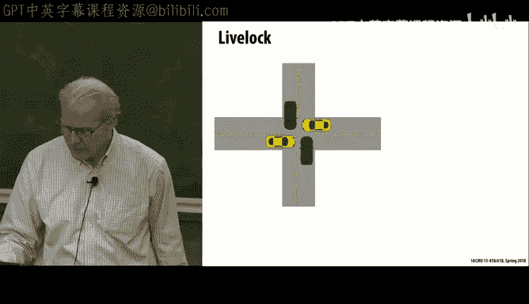
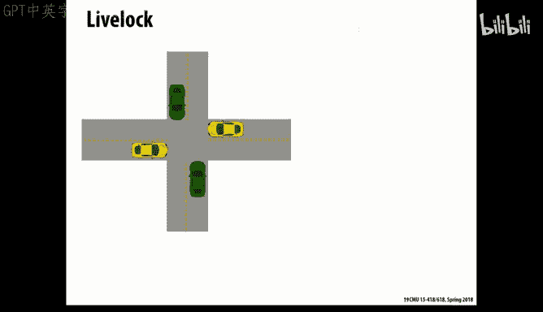
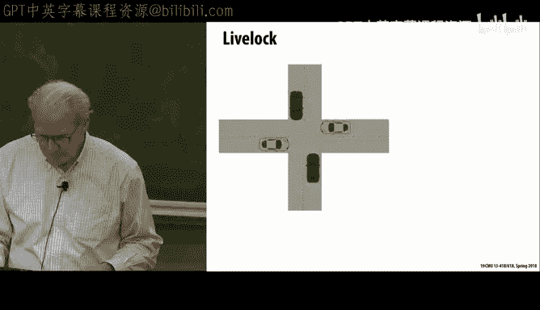
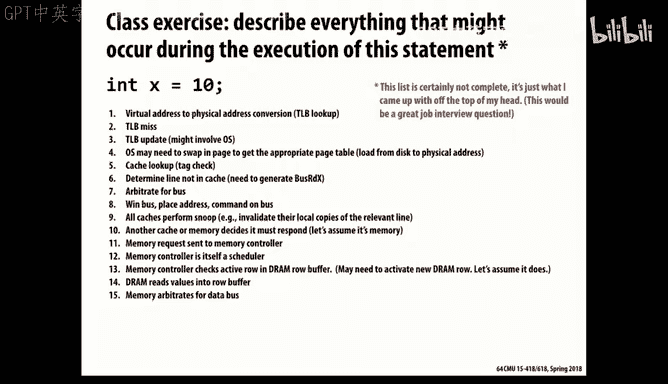

# CMU《并行计算机架构与编程｜CMU 15-418 Parallel Computer Architecture and Programming sp18》 - P17：Lecture 17 - 2-21-18 - Carnegie Mellon University.zh_en - GPT中英字幕课程资源 - BV18b421J7cA

That is。这有面。方。最多的就做。た。그 너무。そでしろ。消费。Check， check， check。Check check。Check tech。That works。

So last we've had two lectures now where we talked about the idea of catchher protocols。

First one was on bus based or centralized based and the second on directory based。

 What we'll do today is talk go into more detail on the the bus based ones。

 just to give some appreciation for some of the complexities involved in actually implementing。

I know people who do this for our living industry it is indeed these protocols are extraordinarily complex and hard to get right。

 it's an actually interesting research area on how do you verify protocols like this rather than just relying on running a bunch of simulations and it's one area where actually formal verification tools have been fairly successful。

Aly because it's impossible to do it any other way。So the main point of this is。

 and I sort of alluded to this in past several lectures is that。You know。

 you can draw these state diagrams and have a general idea。 But when it comes down to。

How do you actually make it work in practice， It's just worth appreciating。

Kind of what kind of issues are encountered and and how to deal with them。

 And it's a general issue with any system that has concurrency。

 any system that has a lot of stuff going on through independent actions of different。

Agents that there's a lot of things that can go wrong。

 And so keeping track of and having some sort of systematic approach to it is very important。嗯。So。

And these ideas aren't just for cash protocols。 This is a general issue you'll encounter as you go out in the world and you're trying to write systems。

 especially ones that involve concurrency， that you have to have some kind of general set of rules or。

That you can。Put down and have your whole team appreciate and understand what those are。

 and I'll try to highlight some of those today。So let's remember this Mezzi state diagram。

 which is sort of。The the basis for a lot of real life。Cash designs。 So you recall that the idea was。

 there's a。Working from the bottom will say that a cache line can be marked as invalid。

 meaning that it's not present in a particular cache line。 And remember， this is。

This state diagram is maintained per。Cash wine per processor， or cash。

So that there'll be other caches maybe sharing this data。

 but they'll be running their own state machines on the same chunk of data。

So the invalid state means the cache does not hold a valid copy of this one。

Shared means it has a copy， a clean copy， and it's shareable， but it's read only。

Exclusive means it has a copy and it's a clean copy。

 but it happens to know that this particular processor is the only one with a copy of this data。

And modified means it's a dirty copy it's been written to by this local cache。

It's not the same as the value held in the main memory， and so if we want to。

We might have to do something about that in all cases， And you see that the black， you recall。

 denote transactions that happen on behalf of the local processor。

The processor requests some reader write access to this data。

And the blue stuff is things that happen on behalf of the rest of the system。

 what we'll call the cache controller is the one that's listening to the traffic。

 the coherence traffic out there and making appropriate adjustments to the local state of this object in response to those cash commands。

And we said， remember， and we'll get back to this a little that in real life。

 it's not simply processors and caches anymore。 It's multilevel caches。 And the real action。Happens。

Here is where the sort of real， this cash coherency traffic takes place。

 It's some type of interconnect level that ties the the cores into a commonly shared cache。

So we'll refer to this as。C on this side。And we'll call this memory on this side。But remember。

 as this example shows， the memory might itself be a cache for some more global state。

And we talked and we'll get back to that various issues of， well。

 how can this L2 cache controller know enough about what's down in L1 cache to be able to correctly monitor and respond to the bus traffic that's going on。

 so we'll come back to that point a little bit later。In particular。

 we'll assume that there is what's known as the inclusion property。So， that。Anything that's in here。

Will be a subset。Of anything in the larger cache that。So that way， the L2 cache basically knows。

All the， the contents， the L1 cache。 And it knows not just that they're there。

 but what their state is， Are they clean or are they dirty。And that inclusion property， therefore。

 means that the L2 cash can just。Respond to and， and monitor。The， the request。

 and presumably do the right thing。It's an interesting fact that the latest intel processor。

 what's called Sky Lakeake， which I think has just started to be shipped within the last half a year or something。

 does not have this inclusion property。 They let the L1 cash get out of sync to hold things that have been evicted from L2。

 And I have no idea how they implement。The logic for that。

 but presumably that's yet another layer of complexity that's been put into their cash protocol。

And this inclusion property。There's an example， and this example was。

I ran through this a few lectures ago， too。And I'm not going to go through the point。

 but the point is that if both cash is used an LRU property。

You can imagine scenarios where there's so much activity in L1 that's not seen by the L2 cache because L1 is handling it。

 And so along comes some other block。That。That gets evicted。Out of L 2。嗯。

Even though it's very active in L1。 So the standard LRU policy does not guarantee this inclusion property。

And you can see that actually， it would be a fairly common case。

 so they have to artificially enforce this policy between the two caches and how they evict lines。

Mainly， if the L 2 decides it's got to evict something， then it would force L1 to evic it as well。嗯。

So now recall， let's keep looking at this inclusion property。 S that there's some bus traffic。

That says， I want to do an exclusive read on X。What you recall is。

 and currently that copy of x is in the the shared queen state。

So what that means is L2 has to invalidate its copy。

 but what it also means is it's going to have to tell the L1 cache to invalidate its copy。

So what that tells you is that traffic generated。Remember， this is external messages coming in。

To this cache controller can then have to percoate up into the。Coloasser levels of the cash。

To the processor。嗯。And similarly， if the imagine that the。There's a dirty bit。

Imagine this line is held in the L1 cache。And it marked as dirty。

Because this local processor has been updating it。That might not get。

 You don't want that you don't want to write through from L 1 to L 2 every time there's the right to L1 or else you're gonna have。

You all the problems of a right through cash。 So what you want is for L1 to be able to hold that。

Data and have it dirty。 So it's not even correct with an L 2。

And then there's an extra bit of state added to the L2 cache that says。呃。This。

This value is held in the cache， but it's not。 I don't have a correct copy of it。

And then what happens when the the。Sign comes from the externally that says， give me your copy。Of。

 of X， that would happen if there's going to be the read。 Then what will have to happen is that。

Excuse me。然。That information is going to come up to L2。From L 2。

 and then it will be L 1 will push it down to L2， and L2 will put the data on the bus。So again。

 you see this communication between L1 and L2 taking place because of cash coherency traffic。

But you can also imagine you want to make sure you don't do this unnecessarily that you keep each cash should be。

As。You， only have to communicate when it really has to with， with a different cache or else。

 you'll add too much traffic。And that's sort of the name of the game across。Wait。

 we want to kind of do all this。 make sure we get correct results。

 but we don't want to create a huge volume of traffic boing all over the place that will slow down the system。

So that's your overall goal。 we need to be correct， and that's an overriding concern。

 but we also need to be performance。And the performance is a combination of how much hardware is involved and the complexity of that hardware。

 because if it's too complex， then you have design bugs。 And also， how much traffic does it create。

 yes。Or like when do you set the modified button failed date？Previous。That would happen。

 That's a really good question。 is， at what point does this bit get set。

And what would have to happen is。呃。The first time that there's a right by the processor to X。Right。

It would have to。Tell L2 that this now its copy is in this modified， but still state。

But then further rights to acts don't have to generate more traffic。

So I think all these things are like states。 And you know， when do I do a state transition。

 Well the state transition occurs， the first time X gets modified to L1。Good question。

So all of these come into play the standard problems that you've probably come across question。嗯。So。

Okay。All these then encounter the standard problems that you've probably heard about or seen or maybe experienced directly in designing concurrent systems。

 so that's Delock， live walk and starvation。So。We'll go through that more concretely。

 We'll talk to about this idea of a bus and what really is a bus。

And how they're designed to support these kind of actions。嗯。呃。So let's go through this。

 So you've Delock before。 Delock is a case where there's a a set of resources that require that different agents require access to multiple versions of the multiple resources。

 And the problem being that。Each one is being held。

 and all the agents can't make any forward progress。 So this classic example here。

 you imagine the four quadrants of an intersection as being the resources。And each car has one。

 but it needs another in order to make it through the intersection。Un they're all turning right， so。

And so it's a classic deadlock that there's a circular dependency of。Of。

And the resource acquisition in such a way that no one can make forward progress。

This is you get this a lot driving around town when the buses have to make right hand turns on these narrow streets。

Well these are funny pictures too。And this is a real problem。

 We've already talked in Que some about real problems。

 So a typical scenario that's a little bit more subtle is if there's a cu。啊。

And that you're communicating through。 So normally， if the queues stay。Without getting filled。

Then it's not really a problem that， though， because that Q gives you some tolerance to sort of variability in in。

Oh。But it still has a problem。 If a queue is bounded， which。By definition， Qs have to be。

 there's the potential if both cues get filled。Then this't be able to won't be able to stick anything new in the queue。

 and therefore it can't empty out its own queue and a can't stick something new into there。

 So you get the deadlock。Again， this mutual dependency of resources。

 but it only takes place once the。When you reach the level where the queuees are actually filled。

And we also saw examples of that， you know， simpler examples。

 if everyone's trying to send and nobody's receiving， then。

Then basically nobody's answering that you can't make any forward progress。So in general。

 what the conditions are for that make Delock happen is these have to be resources where it's exclusive that each agent can hold each resource can only be held by one。

That it's a hold in weight that I'm going to hold on to the resource I've got until I have the other ones that I need。

It's no preemption。 nobody can， you know， we don't have tow trucks that will pull the cars out of the intersection and let the other cars go through。

And that there's some kind of a circular waitinging that there's a dependency cycle that occurs that prevents any of them from making progress。

 And all four of those are necessary conditions for deadlock。

 You can undo deadlocks or prevent deadlocks by。By basically taking any of these rules and taking it away。

There's another one that's a little less understood。 that's called Livelock。

 And that's more like it's not that nothing is happening。 It's it's that nothing is happening that。

I making sense。 So the example in this car scenario is they all simultaneously say back up to let other ones go through。

 but none of them do， or they all try to do it so they're synchronized too tightly that they have this kind of behavior going back and forth and so none make progress。

 So that as you can imagine， is a little less of a real- world problem because things tend to be random and avoid that where it can show up isn't that you livelock forever。

 but you get into a scenario where this is happening that it's slowing the thing down。

So one of the interesting ideas they developed in。The ethernet， the early days。

 And it shows up in a lot of protocols is what they call exponential back off。The idea is。

 in a protocol， sort of imagine this car thing instead of them all saying， zip， zip like this。

Each car backs up， and then it basically waits for some random amount of time before it tries to proceed。

 And then the chances are that。At least one of the cars will make it through the next time around without them all jumping forward an exponential actually you want to distribute this random delay exponentially and getting longer and longer so that you and you can prove various theorems about how that improves the throughput so that idea actually shows up in a lot of scheduling ideas that you randomly wait for longer than you have to just to kind of break up any cyclic osllatory behavior。

And then there's another one called starvation。 And that's a case where。

Progress is being made and things are happening， it's just that some part of the system is not making forward progress because it's always losing relative to some other one。

And。So that's usually an example of， again， in real life。

 that mostly occurs because you've designed a system that sort of has an imbalanced。Priority system。

 like if you always give priority to， you have P processors and you always give the one with lowest number priority。

Then the higher numbered ones might just lose out altogether。

 So you have to somehow create a fair system， meaning one that doesn't that the priorities are。

You know。Random or changing enough so that no one gets crowded up。

So we'll see those kind of issues show up even in this context of bus protocols。

So let's kind of keep a thing simple for the moment。 So we'll assume that initially。

 we're just going to allow each processor can only do one memory request at a time。

 has to complete that transaction before it's allowed to issue another request。

And that reduces sort of the volume of traffic and the set of possible concurrent activities。

We'll assume that it's just a simple cache。 And we actually think it's。The right back cache。

 initially， we won't worry about this multilay cache。嗯。

We'll assume that the cash can signal back to the processor to say， hey， wait。

 you need to stall while I'm dealing with this cash traffic。

And we'll assume that it's atomic that the when a message goes out on the bus。

All the there's only one message at a time， and it will do the total transaction from that needs to take place atomically。

 meaning without any other activities in between。And so what we'll assume is this idea of a bus means that' some kind of shared。

 actually physically a bunch of wires。But there's usually a bus controller that does what's called arbitration。

 meaning that。If， if a particular processor wants to communicate on the bus。

 it has to make a request。And if there's simultaneous requests from multiple processors。

The arbiter will only grant access to one of them。And it will say， okay。

 you go ahead and then the bus will do the client can do whatever it wants。

We't go into this in a little bit more detail。So let's remember even what is involved in cash management on a。

On a conventional processor， a single processor。And you remember this from Cash haven 213，5，13。

 that first， I have to figure out what set is this。啊。Memory location。

Going to make use of look at the tags and that cache to see if any of them matched the tag that would be generated by this memory location。

Assuming not。Then I have to， I'll have to put out a request on this bus。

I'll have to wait until I'm granted access to this bus because there might be multiple requests out there。

I'll send out the and。On the bus， I'll place an address and I'll say I either want to read or I want to write。

Or whatever I want to do。I have to wait until that commandment command is accepted。

 And then if it's a read， then I'll get data back from the bus。What it assumes is that a bus has。

A couple of wires， One is some control wires。Where I can say what I want to do in an address。

Which in this case would be the address of which particular memory line you know this would correspond to。

 And the data is used either in read mode or write mode to actually do the， the data transfer。And。嗯。

So what the way this is implemented then is now you'll see that for this cache。

 there's sort of logic that's operating on both sides of the design。 One is the one that's。呃。

Acting on behalf of the processor and doing the sort of standard cache things you think of。

 And then there's one that's acting on behalf of the rest of the system。

 And so this is recall snoop controller。 No relation to snoop dog。嗯。

And because snooping is this idea that these these， they're monitoring all the traffic。

Among the caches， to see if any of them refer to memory locations that are of interest to this particular cat。

Are relevant to this cash。嗯。So already， you see theres this concurrency that there's logic that has to be synchronized。

Between these two。And even you'll see that they both need access to the， the state， of at least。

Not the data so much。 Well， they ultimately the data。

 but the thing that's important is the set of tags and the states of the corresponding cash lines that are held in the cache。

And so you can see that at any given time。There's an interesting question of which。

 which side should get priority。 If， if the bus gets priority， then that means that I'm。

Potentially sort of putting the importance of cash traffic ahead of。The local processor is traffic。

 And if there's too much of that traffic。The processor isn't going to make much progress。

On the other hand， it's even worse if the processor always gets priority。

 then it means they're not responding to the cache， and either you have to， basically in doing that。

 tell the bus to stop everything because it can't correctly respond or it might miss some important traffic that has to go by。

So you can see that in the end， you really have to give the priority S to B to here。

Over the local processor。So actually， one common trick is to， to replicate the tags。

 make separate copies of the tags for the two sides。 And then， of course。

 these have to be kept synchronized with each other。 But the the observation being these tags。

 don't change that often right that。Compared to the amount of time thats spent on both sides。

Having to examine the tag state and find。What entries there are in the cache that has to be done。

 basically， for every。嗯。For every action by either the processor or the bus。

 even if it turns out that。Like on the bus side， that none of the tags match the address that's being put on the bus。

Still has to look at the tag state。 So you can see that。

Some way of Simon being able to at least look at these tags from both sides is a useful trick。

And then there's another thing that you'll see that some of these aren't just a response by one cache。

 they actually require a polling and seeing like if there's one or if there's multiple caches holding it。

呃。So let's say that one cache issues a read request， and so it puts a bus readout on the bus。

What we want to know at that point is。嗯。and it will say that if the。

If the current value is held in some other cache and it's dirty。

Then it's the job of that other cash to respond to the risk request。 But if none of them hold it。

Then it's the job of the memory to respond to this request。And similarly。

 we saw in the Mezzi protocol if， if I make a request for some memory and nobody else currently has a copy of it。

 then I get to load it into the exclusive state rather than the shared state。

 So you'll see that somehow we have to get a sense from all the caches of does anyone have a copy of this particular line currently。

And so what you can see is what we want is then a way to sort of vote。嗯。Using a logical ore。

 So imagine these are sort of some of the control wires that go out that。I put an address on the bus。

And then。The all the cache is， basically， if any of them has a， a copy of it。Then they'll pull down。

 They'll send a signal on the。Shared line。 And if one of them has a。AA dirty copy of it。 It should。

Put it out on this dirty line。And in that case， there should only be one responder。

 But the good news about or is it lets any of， if any of them has a copy。

 then you'll get that signal。 And similarly， if it shared， if any of them have a copy。

 it might be one， it might be 7， It doesn't matter。

 The logical or will just say there exists some copy of this。 thats。So you。

The new cash can has to load it into the shared state， not into the exclusive state。M。And then sui。

 if not assuming this all happens with ahawking scheme， these happen sort of asynchronously。

So what happens is that the as soon as this bus transaction starts。

All of the caches will temporarily pull up this line。啊。Or say put out a signal that says， wait。

 give me a chance to respond， and then it will lower their signals。When theyre， they're。They said。

 okay， I've got my message out， whether it's shared dirty or none of the above。

And then once this pending line goes back down again， then the next action can take place。 So again。

 this idea of using an or。On a bus is just a way for them all to collectively be able to signal information and also be able to keep track of。

 of when it's possible for them to move on to the next thing。

So the good news about this snoop pending is by if any cash has that line raised。

 then it means that the whole the system will race ahead of it。 It will let it resolve。

 know because some of these things might take more than one step to deal with。😊，And now。

 as I mentioned， there's this interesting issue that。

The data might come from memory or it might come from another cache。And so the question is。

 so and the memory， remember will take longer to respond than the cash will。

 So the basic idea here is that should it go ahead and start the response。啊。

Not knowing whether it it has the correct data in the memory or not。

And that's an interesting design decision because it creates extra memory accesses， but saves the。

 the waiting for a cache to not respond before you。

Before the memory response would then add more latency to the memory access。And what we saw， too。

 is that the right back。Traffic， meaning when you have to evict a line from cash to make room for a new line that will cause some other traffic to take place that also has to go through the whole protocol。

Through a， a flush。Operation to push it out of the。

 if it's a dirty copy in a local cache has to get flushed back out。And we're assuming it。

 it will flush out to the memory here。So one of the tricks for doing that to avoid putting that in the sort of critical path of execution is to do what's called a right buffer。

That have a， a buffer that the processor can fill up with right。Traffic。

 and then that can get emptied out later as time permits as the the bus traffic permits。

And so that shows up what you'll see in a system。You'll see it actually on both the processor side and on the cache controller side。

There's this thing called the right back buffer。Which is。呃。When the。

 the cash needs to do a write back。To memory， it will just dump it in a buffer。

 And this buffer is typically。Maybe 4 entries，10 entries or something。 It's not a huge buffer。

With all the various logic to it。 And then it will generate。The cache controller will。

 on behalf of the processor， sort of make sure that。That。Da gets eventually written out onto the bus。

 and right back。And you can see that one interesting property of a right buffer is it means that if。

I'm snooping。If there's a snoop action that says。I'm looking for a particular。Memory location。

 does Do you have a copy of it。That you have to， the logic has to look at the pending rights。

 as well as the current contents of the cache。Because this pending right is like an update to memory that logically needs to happen。

And so if I ignore it， then I could miss some important memory rights。

So for the sake of the coherence protocol， this is needed。And this is true， too。

 There's similarly a right back buffer on the intoc on the processor side。 and you have to。

 any read action has to examine the contents of this buffer to see if， if theres a pending right。

Instead of looking directly in the cache。So this is an important way to improve the throughput of the system。

But it also adds more logic to the whole design。So anyways。

In our previous presentation of these slides of these state diagrams， we acted as if。

Somehow miraculously， it makes it transition from one state to another， and it does it atomically。

 meaning that。The whole system， or at least this whole。Whatever traffic has to go out。

Whatever internal state has to change all does it in one step。

 but we can already see that it's not going to happen that the bus is itself asynchronous with various signals going back and forth。

 There's various logic going on in on the process on the bus cash controller side and so forth。

So it's tricky in the whole design to make sure that。Even though things don't happen atically。

 they happen correctly。So what's， what's。Imagine a scenario where something is goes wrong if it's not implemented properly。

If two processors are trying to write to the same location。呃。At roughly the same time。

Then what you'll see is that there sort of a race develops between which one is going to get the first writeable copy of this。

And so let's say that P1。 and we're assuming that。It's currently held by P1。啊。

I guess we're assuming that both processors have a shared copy of it， read only copy of it。

 And what they're trying to do is upgrade their copies so they can write。

And so one of them will get the。Be the first to put the bus upgrade command out on the。And the。

On the bus。And the other one will be waiting to put its bus upgrade command out on there。

But what you see now is that。嗯。啊。Now， since P11， P2 basically has to change its its action it's going to do。

 It can't simply do an upgrade anymore because it has to actually give up its copy and invalidate it。

嗯。So P2 has to you can't just have a simple cu of actions on each side because they'll actually have to change what action they want to do based on the traffic that's already taken place。

So， it's potential that。There's a need to then。Change the， the action。

 depending on what other actions have have been allowed to take place。And then there's potential for。

 So that would be a case of， of an invalid action by the protocol。

 There's also a possibility of of deadlock。 So imagine that P1 has a modified copy of some line。

And it's waiting。嗯。To put some other action on some unrelated cash going out on the bus。

But meanwhile， a request comes off the controller。That。For， for some。

For something that P1 has the copy of。So now P1 has to say， oh， wait， I'm gonna give up on。

 at least temporarily， give up on what I was really trying to do and service the request that's coming into me。

Because if not， you can imagine a circular pattern developing where they。

There's two different processors。 One， both of them are trying to。嗯。Get copies from the other one。

And so unless they'll serve the external copy， then potentially they'll both end up waiting for each other。

And you can imagine cases where things get into this oscillatory behavior that。嗯。That， if。

If they both start fighting each other to get a writeriable copy of this。

 But before any of them can actually do the right。 So they， they issue the read exclusive command。

But then before they're allowed to actually complete it， the other one gets to read exclusive。

 And so they just start fighting each other back and forth。So what you can see for that is。

If a right， it's going to take place。It has to be， at least the first right has to be allowed to occur before it will。

Re before it it has to give up its copy of the， the。This cash line。So with all that， there's sort of。

Some notion of， of， what does it mean to actually write to anything。

 Then we see that the processor can write to its local cache。呃。And so that means that from there on。

 the processor should be able to consider that right to have completed。Eventually。

 it might get pushed out to the memory system。 It might get transferred over to another cache。

 But we want this processor。To feltelt like there's。Doess it commit meaning？

The right that was supposed to happen really happened。And hopefully， remember。

 we won this sense that we'd be able to totally order all the。

The rights by the that would occur to some location。

 So that at least it appeared they happened in some consistent fashion。

So that's why there has to be this notion of a commit sometime。

That we can point to in this whole massive protocol where we say that right。Has logically happened。

 meaning it it willt。It could be overwritten by a future right。

 but not in a way that would violate the sort of consistency rules。So and so in designing。

 you need to be able to logically think， okay， this right has committed this point。

Meaning that future reads would read this newly written value and not some other value。

In last series， some other right in between。So the。

 the nice thing about the bus based protocol is the bus provides a sort of central。会。

That you can sort of。State that， oh， yes。 this is the place where this will be my sequential ordering of the。

 the rights that occur that will affect the sort of global state。 So whenever。诶。

Transaction takes place on the bus。 I'll say that that commit has occurred。

 meaningan it's the job of the rest of the system to make sure it actually carries through。Question。

Before that。スピーフル。是。At least one right。Yeah。Just this。Does the read exclusive？かめ？Exactly one， right？

If the processoror gets。这个Y该。Twice。How many of those rights？Well， you remember it。

 So this is a good question you remember the protocol that。If I have a。If。Like。

 if it's a queen right to a variable， never touch before。

Then the protocol says that it will market a transition from the invalid state to the modified state。

And you recall， I can do any number of rights。At that point， without any more bus traffic。

 if there's no other。Contention in the system for this particular location。

So the scenario I was describing was， imagine that this same。This is in P1， and this is in P2。

And they're both trying to read the same location。Right， so if。

If they both were successfully doing read Xes on the bus。Before one could actually do any right。

 it was getting grabbed away by this other one。 That would be the example of a live walk。

So basically， what it says is this saying should be able to sort of make at least one local right before it's forced to。

 to， to acknowledge a redx from somebody else。So you guarantee， but hopefully。This is only and。

In the situation where you're sort of in extreme high contention for some memory location。

Unfortunately， that's not an uncommon case because the locks， right。

 shared variables that are being used as flag and locks and things really do have extremely high contention on it。

 So you have to make sure。It might not be very efficient。

 but you have to make sure at least can make forward progress。So。Commits all rights up until next re。

Yeah， so you， you remember the redex。 Now in this state， it will be able to modify it。

 It will now be a dirty copy。And if somebody else。Once access to the copy。

 then it's going to get flushed out of here。Right， and then that will come back up again。 So。

 but the point being that。The idea is on all of these， you want to sort of design it。

You keep activity as localized as possible。But when needed， you'll change the status of something。

 put it out globally so that you can correctly implement the sort of updating of state that you want to do。

So the idea posed here is that you want this idea that。嗯。Oh。I'm trying to get this picture back。

 can' I？This picture back， that really you can think of it that this putting this redex on the bus。

What I'll call。By this particular right， meaning the right hasn't actually taken place。

 but it's guaranteed that this processor will be able to complete that right。

And update the global space。Make sure that the global state that any teacher door to that location。

Would use the value that's stored in the local cash here？Even though it's dirty。So。

That's what I mean by commit it doesn't。 It's just that the system is committed to complete this operation。

 And so logically， it's as if。It's guaranteed to happen。

And then we can also imagine scenarios where starvation occurs that there's。呃。There's a continual。

Attempt， you know， there's so much traffic on this bus that some particular request never gets。

 gets to take place。 And usually， that's like a bad system design problem。 As I mentioned the case。

 if you gave access on the bus， like the arbitration logic。

Always gave it to the lowest number of processor gave request。That would be a bad design。

And so there's a very scheme to one of them a commonly called round robin， meaning that on each step。

 imagine you give priority， but you sort of do it circularly like modular arithmetic and so at the beginning you'd say processor zero is the highest priority and the next step processor one processor two。

 and so you keep。Forcing it so that there's never any case where a repeated action will fail to take place。

So so far， we've actually looked at the simple case。

 Remember that this was a cache that had or it was。诶。The bus actions were atomic。

Meaning that it gets to put out a request and that will get completed before another one completes。好。

But already， we can see there's some interesting design issues that get involved here。

So where it gets more interesting is that buses in practice are not atomic。 They。

 they use what they call split transaction bus。And the reason for that is it's better to break things up into little finer grain activities and essentially create pipelining。

To avoid the sort of long pauses while。you're looking for response on it。

 So most modern buses are what they call split transaction buses。

And the reason is to avoid sort of dead times on the bus。 So otherwise， what would happen is。

If there's a。Command that goes out。 And you saw how you have to kind of。

 everyone gets to hold the line until。It's complete and then move on to that。

 so that's waste dead time that no useful traffic is going along。

So the idea of a split transaction is that every bus transaction involves two parts。

 There's a request and a response and。You can， the request can and the responses there can be before I get the before the。

One response takes place。 There can be other requests put out on the bus。好。

So now there's a couple issues you can imagine。 First of all， there's just。How do I keep track of。

Of the what， what request is in response to， what response is in response to what request。

 How do I kind of match those two。What if there's sort of conflicting requests that go out similar to what we saw before that。

We saw that。 there'd be a。A requestquest。 And because of that request。

 some other processor would have to change what request it makes in the future。And also。

 the problem that。That we won't get the response back before the next request comes in。

Flow control is， how can we make sure that we don't sort of fill up our buffers with requests and not be able to get the responses out？

So we'll show a sort of simple version of this， not really simple， but a simplified version of it。

So what we assume is that each processor can only make some fixed number of requests。

Before receiving responses。 So we'll build enough buffering in the system to kind of handle the worst case。

And， and then guarantee that that nothing worse than the worst case will happen。

We won't assume that responses happened in the same order as request。but we'll use the request order。

As our， our window on， what does it mean to say that these transactions have happened in some logically sequential order。

Sequentialally consistent order。And we'll also introduce another capability called a NAack。

 negative acknowledgement， which means that。嗯。It's an ability to say。Sorry， youre not。

 we won't be able to， you know， we can't satisfy this request at this time。

 You're going to have to redo it。And as long as you said， it doesn't happen too often。

 It can be a useful way to kind of get get out of situations that otherwise would be。Very。

 very tricky， like if。If there's a buffer full。Thenhan， by issuing a knack。It can say。

 just wait till I can clear out this buffer before we try。Proceeding with this。

So the trick on this is。To of。Think about the。The， the split happening between the。The command。

Logic and the address that we're putting out。 and the the response being the data that。

Is being provided back to。Either for a read request， typically。

So what we'll do in splitting it is say that the。Request。Is made on， on this。First part of the bus。

 And then at some later time。嗯。The response can come back in the form of data。

And some other control signals。And what we'll assume is that。Basically， all of the controllers。

keep track of。Of the outstanding requests that are。

They're on this bus so that they can kind of match requests and responses。

And what we'll use is we'll have some kind of way of uniquely identifying the requests。And then。

 responding back。On the。啊。With。So， so you remember。

 there are only going to be8 transactions that could be outstanding at any given time。 So if each。

Line maintains this table that gives the eight different。Possible outstanding requests。

 And then when a response comes back， it contains the three bit tag that identifies which of these eight outstanding requests this is。

 is part of。 So all the the processes will all maintain or the caches will all maintain this state。

 private copies of it， but it will be the same for everyone because they're all watching the same bus。

So now you can look at the bust。 Actually， the requests will be broken up into little。

Small little chunks of， of activity。So， the first would be。呃。

That some processor request access to this bus。And so that's a request to the bus arbiter to say。

 I need grant me access to this bus。And the arbiter then will come back with a。

The three bit tag saying， okay， you get to make a request number。X。And then， the。

And there might be multiple ones， so there'll be a response to only one of the requests。

So I haven't actually made the real request。Been given permission to make a request。And then。

The one who was granted access to the bus then will put out its address and also whether it wants to read or write that address。

Or whatever it wants to do to it。And now we'll assume that there's a period of time called the decision time where all the caches get to。

Examine their own contents and come up with the appropriate response for。And so logically。

 what we want to say is this is the point at which commit takes place that whatever the memory action that's going to happen。

 it's guaranteed to be carried out from here forward。And then。

There'll be some way that the caches all then respond back as appropriate。

 whether they have a copy of this or not。And so that's all sort of that sequence then of these five steps。

 that's what we originally thought。 That's really the request。Well， that's really the， the logical。

 actually， it's the transaction。 instead of the logical completion of one。1 bus action。

 even though we haven't passed any data at all。 So we haven't completed anything。 but logically。

 we've carried out the steps。 You'll see that at this point。You know。

 all the state transitions that have to be made locally can be done。 And so all。

 all the necessary information for this particular transaction from a control logic point of view have have happened。

And this will go on。 these sort of five phases will go on for every request that's out there。

 So I said it's a single request。But it's really broken up into these distinct phases。And meanwhile。

 there'll be a separate bus， as we mentioned， for the response for the case of a read， for example。呃。

And the， but that， that won't happen automatically right away。

 What will happen is when the data is available。And some either the memory system or another cache wants to make it available。

What it will do is it will put out the address on the response line。That says， hey。

 I've got the data for this particular transaction。This particular request。RightSo remember。

 I'll respond， not with the address of the actual memory location。

 but one of these eight possible values of which。Which bus transaction is this in response to？

And then if there could be multiple ones of these that happen simultaneously。

 so the arbiter will only grant access to one of them。And the other is。

 we'll just hold up and and do it some other time。And then the tag check in this case is。

 is the original requester。Might have to give a negative acknowledgement saying， sorry。

 I'm tied up doing something else right now。 Try it again。 And if that happens。

 then the the responder will just retry that transaction sometime later。

And only if it gets through all those steps， then the responder will put the data out onto the。

Onto the bus and the actual data transfer will take place。By the way， people。If you recall in。

Homework 1， people looked up and saw that the memory bandwidth of their memory system should be 80 GB per second。

 Is that the number。And they are surprised that they're only getting 40。And you might wonder， well。

 why do I only get half the bandwidth。I hope this picture gives you some idea of why you never。

Run at peak speed， right， all this bus traffic。Going on， all this confusion。

Just means things never the the， the 80 MBby would be if you could just blast data on the bus over and over again。

 There were no real traffic required for it。 And so that just never happens。But the。

 the idea of split transaction is。Even so you can think of it as this is logically。

All that was required for one transaction。But even when this one's going on。

There can be another transaction can start。And so that。

 that's why the split transaction is a good idea。 It kind of keeps the。

 the whole system moving along instead of having a big chunks of time when some part of the system is waiting and nothing useful is happening。

And as this picture illustrates， they don't even have to happen in the order of the request。So。

 you see。Well， well， they they happen in the order。 in that， in this case， the data。

Transfer was in the same order。As the requests were made。But。

But the point being that other requests can be going on while we're still completing before the response to prior request takes place。

And so again， there's some more details that we'd really need to work through to make this really work。

We assume that。There's this capability of。Basically sending a message it says， sorry， I'm busy。

 I can't respond。 and the the basic fallback mechanism was that we can retry either a request or a response without having to。

嗯。呃。Make the whole system stall。One of the tricks， as I mentioned。

 that's a tricky case to deal with here is。Where we talk beginning that the processor might have to change。

OfThe nature of its request based on some other request that came through earlier。

 So you could see that。嗯。Imagine that the blue and the。Yellow。

 we're trying to go through it at the same time。And only one of them wins。 Well。

 it may be that this one has to change actually， what its request is based on the request that was allowed to go ahead of it。

 So you can see that's a tricky business。And then， like I said， for flow control。

 the way this is handled is by nexts， meaning。We have some mechanism to say。

 just come back later and try， just like a phone call， you know， if the phone line's busy。

 you just try it again。So let's trace through an example， P1。Has a read miss。 And so it。嗯。啊。And。

 and that。Comes through。 And it sees that the。There's already an outstanding request。Out there。

 for reading this same location。Then you can see that P1 doesn't actually have to do anything。

 It can just sort of piggyback off of this transaction。But it has to market。は。

It'll have to somehow signal to the system。 Oh yeah。

 I'm going to need a copy of that as well so that it doesn't end up in the exclusive state。

But imagine P1 asked to do a read。And it sees there's an outstanding request to do a redex on that particular。

A location。Then， it will have to。嗯。It， it don't have to wait until this transaction is completed。

Before it can put its own request out on the bus。 So the point of this picture here is that。嗯。

Before a controller can make a new request， it has to look in the table it's got a copy of that says。

 what are all the pending requests and see if there's one that potentially conflicts with the one it wants to issue？

And you can see the value in Qs here， that。By putting in cues， you can deal with a sort of。嗯。

A variabilityability in。In traffic。Without having to wait all the time。Ks don't do any good if the。

YouThe request you're coming at a higher rate than can possibly be responded to。

 but they have a positive effect if， if they can kind of just add some stability to the system so that you're not having to wait every time。

ForFor one thing at a time。So you can imagine now with this whole business that。

This this picture illustrates all the steps that would have to take place， potentially。

For a particular， for a single。Request to take place。So it starts at this processor。W some location。

 some memory。 It's not in the L1。 So it will have to send a request down to L2。It's not an L2。

 so L2 will have to send it out on the bus。That gets picked up over here。

We'll assume the copy is dirty in another location。 So L2 will say。Well， I know that this exists。

 but I don't have， a correct copy。 So itll have to send that up to the L1。L 1 will flush it down。

We'll flush this back。Here， and then that will go there。

 And you just saw why a split transaction was useful， right that this request went onto the bus。

But the response to it had to wait。For a while。呃。Actually。

 you can see that L2 can put out the control part of the response， but not the data part。

It's got the copy， so it can signal that， but the actual data will take longer to come through because it has to get flushed out of the L1 up above。

So anyways， you can see that just making this single。Request， even。

 a read request can involve many steps。 Go through the bus， come back again。And。

You can imagine a deadlock happening。If。If both sides。We're trying to do this same thing。

The processor is trying to。Get stuff out on the bus。If。And so it puts a request out。

If the response can't come back。To the first request。嗯。

Then I could get a deadlock where both of them are trying to make requests。

 and neither of them is able to respond。So， the。And this can happen in real life。

 if you have cues between the systems that are carrying these things and requests and response that are put in the same cues。

 then you can end up with cues filled with requests and preventing a proper response because there's no room to put the response in the queue。

So。I'm trying I'm trying to respond to here。But I can't put it in this queue because the queue is full。

 and。L1 is this side is not reading it。 This is between the two caches。

Because it's trying to do something else。Is gonna hear。 So the usual way of dealing with this。

 And this is not just in this particular scenario， but in other places， too， at any time。

 there's split transactions is to have separate cues for requests and responses。

 and that will break this deadlock caused by the queuees。

 It will make sure that any response will be allowed to percoite through。嗯。

Without getting blocked by other requests。 So this happens between the caches across the bus in any place where there's a queue。

 it's generally a good idea to have a separate queuee for responses than from requests。Okay。

 so just to sort of wrap up， I hope you appreciate that。All this is， of course， and you know。

 companies do this routinely。 we get。These systems with all these cash protocols。

 and they generally work。 So obviously， it's not impossible to build these things。

 I just hope you appreciate a little more kind of all the steps that are involved in it。

So just as an exercise， let's think about what it means。Potentially， to do a right。To。

 to some location。Within the processor， then， we have to convert this from a virtual address to a physical address。

 Hopefully， that will be done by the T L B。But it might miss and have to go through a page table。

Which might involve going through the operating system。

And that might require moving some pages between the disks。

But then assuming we have a virtual address， we can look up in the cache to see whether there's a tag match。

And whether it's in the， the cache， this has all been local to the processor so far。

And then assuming we don't have a copy。We'll have to put a redex signal out on the bus。Meaning。

 first， we have to get the bus。And then we'll have to win the arbitration and put the command on the bus。

And then all the buses， all the caches are going to have to snoop。

 meaning see whether they've got the appropriate value in their own caches。

And so that request will be handled by either one of the other caches or by the memory。

And then it well， if it's a memory， then let's the。

It actually have to now make use of the memory controller。Which remember。

 I said that on modern systems， remember that partitioning。

 the memory controllers are actually split。Among the cores。

 But you can see that theres no conflict that each of them is logically independent the other because they have separate parts of the address space。

And that has to deal with the internal actions of how you actually operate a DRA。And then。

 so now the memory is the correct data available。And it will have to arbitrate for the data bus。

And win it。And then put the data on the bus。And then the requesting cash gets to pull it off the bus。

 the data bus， make all the appropriate updates， and then Mark， this is exclusive。And then。

And only then is the data actually available。To the。The processor。And that's。

 I haven't actually written it yet。 That's just。To make it so that the processor is allowed to proceed with its right。

And so that this shows you in a。Again， appreciation for all the stuff that has to take place。

 And remember。This happens on the order of 100 nanoseconds or something like that for a main。

 a right to main memory。And it makes you also appreciate the value of caches that。

Especially the unshared caches， the private caches don't have to do all this bus traffic just to get a single location。

Okay， so that will take care of things for today。