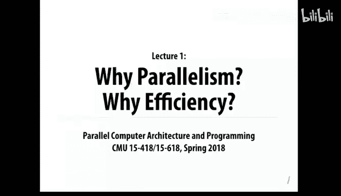
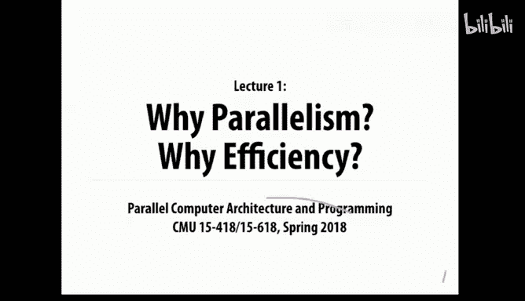
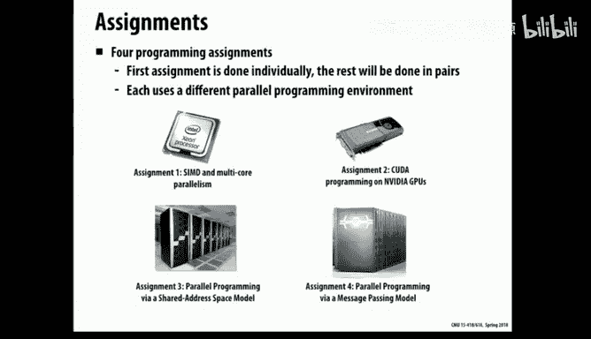
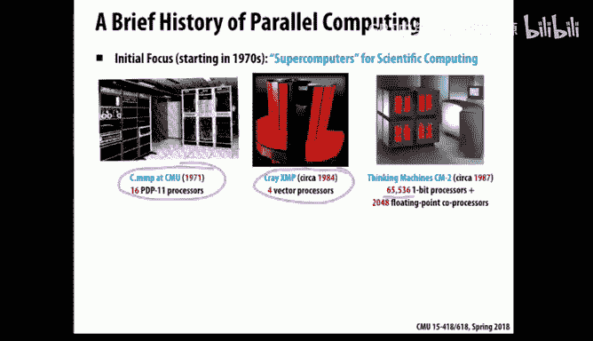
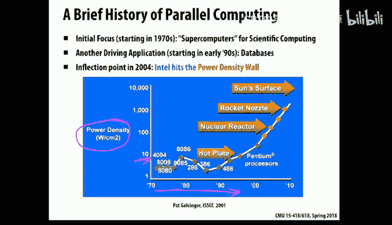
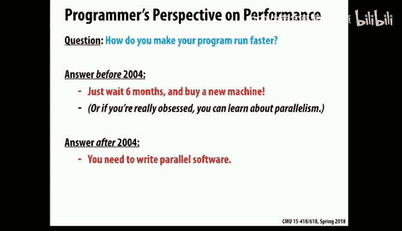
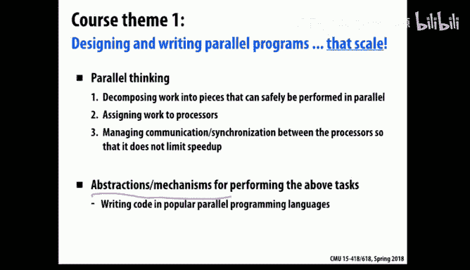
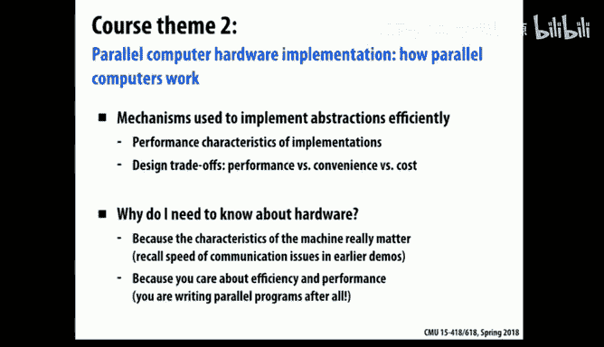

# CMU《并行计算机架构与编程｜CMU 15-418 Parallel Computer Architecture and Programming sp18》 - P1：Lecture 1 - 1-17-18 - Carnegie Mellon University.zh_en - GPT中英字幕课程资源 - BV18b421J7cA

My name is Randy Bryant， I'm one of the instructors for the course， 15， 418 or 618。

And with me today， are。

Some other people。So。This is actually my third time through this course I co taughted it before。

 but the person I co taughted it with decided he wanted to be in sunny or climate。And so。

This time I've recruited Greg Kesten， who's in the backy everybody。

Greggy is actually at the Information Networking Institute， which is。

Over on Craig Street off of Craig Street。 That's where his office is。 But he's been part of。

was here at NC for quite a few years too and then decided he wanted to be in San Diego and didn't like the weather so he's back here and today and for a good part of this month。

 Todd Mauory， who's sitting down here will be providing guest lectures。

 Todd's taught actually design created this course originally many years ago and is taught the course many times and he's sort of helping out。

 especially in the startup phase of this course。So this is a very exciting course we really dig in and do a very hands-on experience in parallel computing and I know having done this myself when I officially was an instructor of the course two years ago what I did was I did all the labs and I purposely didn't look at the solutions even though I could。

 I forced myself to really do them and I found it really hard but also that I learned a whole lot from it and it's been really useful to me in many other ways。

 so I think that's the way you'll experience it too。

So as you see， there's a lot of people in this room。And。We have a crazy wait list for this course。

 So as of last night， we had 118 students enrolled， but 172 on the wait list。

 so more waiting than enrolled。And this room， according to the fire marshal。

 can hold 144 people and no more。 And so we're not allowed to add any more students than that。

 So you do the math and you come up with 26 is how many spots now the。

One thing I'll say is those of you are registered， I hope you really want to take this course and if you're sort of thinking maybe I'm not sure if I got time or might be overbooked a little bit。

 I'd really like to。You to make that commitment。theEven though it's not the drop date is way into the future。

 if you would think of。The end of this month as being when you should really duck out of the course if you're not committed to it。

 to try and open up some more slots for students who are waiting。

Just for the benefit of the class and。We can't force you to drop though。

 but if you sort of on the fence then this would be a good opportunity and what we're going to do is use assignment one。

As our sort of gateway。So for those of you enrolled in the class。

 even though assignment one isn't due until。12 days from now。

 it's a pretty good gauge of what kind of expectations we have。

 sort of how we expect you to make use of resources。

 how kind of work we expect you to be able to do and so I'd encourage everyone to get started on that assignment and it'll be a pretty good calibration of what this course is going to be like and what our expectations are。

Those you on the wait list， here's your opportunity to shine。 We're going。

 it's already out and we're going to look at。Completed assignments by a week from tonight。

January 24th and we'll look at all the submitted assignments from that and have a pretty active session on grading and we'll take the top student top performers from that assignment and that will determine who gets off the waitlist and as well to register for the course。

And that's it。 There's no other rules about how we're going to do the wait list。

 so it's considered a very severe form of meritocracy that we don't care what your position on the wait list is。

 We don't care whether you're undergraduates or graduate students。

 we don't under care if this is your last semester at CMU。 None of those factors will be considered。

 It will be purely 100%。Based on the performance in this assignment。

That you can do the math and figure out what the rate's going to be。

And hopefully there'll be some more slots available， but those of you are。I think。Well。

 you've got a week to sort of really go crazy on this assignment and do the best you can and we'll see what happens after that。

 I can't make any promises to anyone about what standards they are， how good it has to be。

 I don't actually know。What it will take to get in， but that's the bar。So the thing is， go for it。

And like I said， there's no hidden trick， there's no special deal， there's no lobbying。

 I'm immune to deliveries of chocolate at my door or any of those things， it just won't work。

So what is this course， well as far as what you will be doing。

 you will be coming to lectures like this， but really most of your time is going to be spent working on assignments and projects。

 it's a very heavily work activity oriented type of course。

 it's learning by doing in a fairly extreme form。

So in particular， there'll be four these assignments each taking。Roughly two weeks or so。

Including the first one that's out， and the interesting thing is each of these four sort of covers some different way in which computers achieve speed up via parallelism and that's one of the interesting aspects of this course is。

Hardware manufacturers have tried to figure out many different ways of sort of squeezing more performance out of the hardware they can build and they've done it by coming up with very different types of parallelism and the course as a result is you're really doing software。

 all the courses involves writing code， but you have to understand and appreciate the hardware in order to be effective at it。

So in particular， the first one will make use of the type of parallelism that is involved in essentially all processor chip today that includes these multiple cores。

 but also the arithmetic units within the cores can do multiple instructions in parallel。

 what's called SD， single instruction， multiple data。Instructions。

 and so you'll be exploring how both of those can be exploited using a language called ISPC that was developed by some researchers at Intel and is a fairly interesting language。

The second one involves what are called GPs or graphic processing units。 So GPUs were。

 as the name suggests， a term a technology developed originally to help make graphics faster。 And。

 in fact， the main market for it was game boxes。And。

Some clever people figured out that you could sort of create specialized processors that would make graphics run way faster。

 and then some other smart people realized， hey， this technique is more generally applicable than just graphics。

 and they started to make them a little bit more general purpose。

And make them more programmable using different programming notations。

 and they become now the way that you can get some really remarkable performance out of basically a single chip is what they're implemented on。

And then assignment 3 will look at the。What's known as shared memory parallelism。

 meaning that sort of if you take the idea of a multi core and。And expand up to say。

 imagine I have a bunch of processors。And they can all execute independent programs。

 but they all have one common memory that if I do a write from one， it can be read by another。

And then the final assignment will be to do the same type of problem。

 but to do it in what's called message passing， where again you have a box with a bunch of processors。

 but they have independent， or you view them as having separate memories。

 and if they want to communicate with each other， they have to explicitly send a message from one to the other。

And so these two models are sort of， well， all of these are sort of in various forms built into many of the computers that we encounter today。

So that's a really big part of the course though and I think you'll find that you're quite busy。

 but also。If you like to program。And you like to make things run fast。 it's also a lot of fun。

The other part of the course is that a big component of the course is a final project。

 and this is a case where you get to sort of set your own ideas on what you want to do and take away with it and it counts a quarter of your grade so it's a big part and roughly speaking you should think of a project as being about twice the equivalent of two of the homework assignments。

And。These range and there's some links in these slides for what were done in the previous two terms just to give you an idea。

 but they range from something like I have an application domain that I think would benefit from running faster。

 say computer vision or graphics or molecular simulation or any of these many range of computational problems and I just like to map them onto one of those types of machines that we've looked at already and make it run faster and so that's a good type of project。

 another is while I got really interested in these locking mechanisms that we were discussed in class and I want to do some very careful experiments to compare how they do depending on the characteristics of the system and the data that you're running So those are two styles of it and then one of the interesting things about this world is that these things that we all carry in our pockets nowadays。

 have。A lot of parallel computing capability built in。

 they have multiple processors and they also have GPUs that are a little harder to program than Nvidia GPUs。

 but they can be done。 And so a lot of interesting projects have come of things that were running on people's phones or phone based Android in particular based systems。

 So there's really a wide range of possibilities there。But what I'd recommend is。啊。That you sort of。

Keep your eyes out from now until you're supposed to come up with a project for various ideas。

 What is it that you get excited by， is there something you'd like to explore more that's been touched on in the class。

 Is there something from outside of this course that you'd like to bring in as an application domain。

 So those are all good things to be thinking about。

啊。There'll be a little bit of what I'm calling quizzes， but this will be actually a teeny。

 tiny fraction of your grade。In particular， we're going to give you some take home problems that you can work on before the exams and they're more like exam prep type of stuff than anything we actually care about your answers。

 so our grading will be essentially past fail on these。

But it's just a way to get you sort of ready and thinking because as you've probably experienced in other courses。

 if you do a lot of writing code for a course， and then you step and you take an exam。

 all of a sudden the exam problems seem way different than what you've had how you've experienced during the labs。

 and so this is partly a way to kind of get you thinking about how you need to be looking at problems and getting ready for an exam。

We'll also make a little bit of use of these online quizzes， I know for me。

 I did them in 213 for the first time last fall， and I think they're a useful way to kind of kit people and actually fairly useful feedback for the instructors for sort of tracking the lecture material as it goes on。

And that will have a， again， a small factor in the grade。 But neither none of this。

 all of this will talk about the point spread。 But all of this。

 everything described to your account is a total of three out of 100 points for this course。

 So this is not the biggest part of your grade。 It's more ways to kind of keep you up and。

 and moving along with the material。So， that's。Here is the spread， so the assignments。And by the way。

 there's a syllabus on the class web page you can get to and it gives all the breakdown。

 so the four assignments count 40% yes， so could you consider thequizzes like practice exams？Yeah。

 the take home quizzes will look like practice exams。嗯。The programming assignments count 40%。

 The project counts 25。 So there together is two thirds of the。

 the grade for the course will be based on。嗯。And。You know， doing stuff。 that's really the main focus。

 We'll also do two exams。 And you can see on the class schedule when those will be。

 they'll be held in class。And again， there'll be more solving problems that sort of push the ideas and concepts of the course rather than your ability to get code working and make it run fast。

And then as I mentioned， these sort of quiz in class type of activities will count 3%。

There's also a scheme for late days。

In other words， Grace days， if you took 2，13， 5，13 that。

It's a little bit too complicated to explain here， but it's fairly well described on the web page。

 so just look at that。 but in other words， there is a system to kind of give you a little bit more flexibility in your schedule as far as turning in assignments。

And so。Right now， as of。Yesterday and today， there is a class web page。And there's a piazza。

 you don't have to actually， there anyones can sign up for an account， there's no。

 or you just basically follow that account， you don't need to do anything special to use our class piazza。

There's no textbook from the the course。 There's a few references given in the syllabus， but in fact。

OneOne of the。The features of this subject is it keeps moving along so much that the textbooks really。

 I don't know if anyone who's made a serious effort at writing a textbook on this in years。

 so the textbooks are already looking a bit dated。And so quite honestly。

 we'll use these slides in the presentation， material you can find online will be your main references for the course。

Another thing is starting with assignment too and ever after you can either work alone or you can work with one other person as a partner。

 so again you don't have to do this right away but and we don't do anything as far as matching up people or helping people get along with each other。

 that's all up to you so you might be sort of thinking about possible how you'd to whom you'd like to work with for the course。

The class it meets on Monday， Wednesday， Friday。And you'll see on the schedule though that some are designated。

 they're called recitations and obviously a room this size doesn't have a recitation where everybody's sort of interacting and things like that。

 but the idea of these will be a few targeted and they're all sort of designated related to some of the assignments to help give you some of the tools and understanding and appreciation of what the requirements are for assignments as they come along and I think we tried that last year when as last year with this course and I think the students found it fairly helpful so we'll do some form of that as well so the idea is we're not going to present new material but it will be stuff that kind of helps move you along and gets you oriented with the assignments better。

Oops， I lost a few words there。 The last two weeks， you'll see there aren't any classes。

 What we're trying to do is kind of get through the lecture material。

So that in time for you to kind of。Get your projects figured out that some of which will be based on the lecture material and also to kind of open up enough time because we know how busy students get by the end of the term and because our expectation is you'll really put quite an effort into these projects。

 and we want to make sure that you have the time to do that。

 you'll see in the schedule that there's multiple checkpoints on that project too。

 that we plan to kind of actively track your progress in that so that you don't make the mistake of delaying until the last week of classes then trying through an allner to do a project that's just not possible in a course like this。

 So we want to make the project be a big success for you and something that you remember years afterwards。

As something that was a really great experience for you。Okay。

 so the one last part I want to talk about is that sort of thing we don't like to talk about。

 which is what do we consider valid and invalid types of collaboration？And again。

 there's a web page description of this。 There's a， it's in the syllabus and。

There's nothing unusual about what we say here， but I want to emphasize that we really mean it。And。

So， in particular。This is a course where you do kind of want to talk to each other。 and really。

 that's okay if you're talking sort of high level ideas about ge。

 I'm trying to figure out if I should。Do it in parallel this way or that way， kind of questions。

AndBut we don't want you like sharing anything that would be related to the details of how you actually then arrived at your implementation code or。

 you know， performance data or， you know， helping each other。Figuring out bugs， all those things。

 just you can't we won't let you do that。 That's really not good。

 The other is there's a lot a lot of the material for this course and a lot of the resources you want are on the Web。

 companies like Intel and NviDdia have lots of web pages and data。

 and we want you to make use of that。 There's a lot of good stuff on stack overflow。

 A lot of references。And peoples blogs， the web is full of material and for all of us who do this kind of work。

 we're just pounding the web all the time trying to track down how do I do X Y or Z or what's the documentation on this and where can I find out more about that。

 so it's a really important tool and we want to fully encourage you to use it。On the other hand。

 working out there。On people's Github accounts。Are copies of assignments。

Fly formed and just that's way out of line if you're looking at anything that's sort of related to some instance of this course now or before then that's really not not allowed and you're really harming yourself a lot if you start trying to look for people's solutions because I'll tell you isll tell you from firsthand experience。

 doing this kind of stuff is frustrating it， my experience in doing the webs is。

I'd try something that I thought was really great。 It was actually slower doing it on a parallel computer than just done one。

😊，And then I'd pound and pound and pound。 I get it。 So it was the same speed。

 And then I'd pound and pound and pound。 And then it was twice as fast。 And then quick boom。

 there it goes 20 times faster。 So it's a kind of thing where you can't measure your progress in some linear form。

 It' things happen。You have a great idea， but it turns out not to work。

And then you think about another idea。 and this is the way you learn this material is by doing it。

 you can be we can guide you and help you along and try and avoid some of the dead ends or bad ideas。

 but to a large extent this is stuff you have to learn to be able to do on your own because that's the way it's going to be as you go out into the world。

So don't start looking for GitHub。Accounts。And similar。

It's I said there's Github accounts with this stuff on it， but that doesn't mean we like it。

 So in particular， we consider that。And we're being more strict about this in other courses as well。

 But if you provide this material to some future student。

 either explicitly or inadvertently because you left it on a Github account because you're trying to get a job。

And the company you were interviewing with said， we'd like to look at your code。

 Could you make it available， And you say， sure。It's on GitHub， take a look。

If this sounds like it might have actually happened， it's because it's happened many times。

And so that's a case where you are making material available to future students that we consider an academic integrity violation。

We can and we will actually go after former students when they evaluate that policy and that we've done that a little bit not for this course。

 but for other courses and we intend and we collectively meeting the faculty intend to be more strict about that now。

 so it's sort of your obligation to keep your own information in a way that won't be accessed by future students。

So that's sort of the not fun part of the course this part， but it's an important part to understand。

So I'm going to pause now and be glad to answer a few questions。

 and then after that I'm going to hand it over to Todd。

 who is actually going to talk about parallel computing。Whereas I was just talking about logistics。

Questions， yes。YouNo one's enrolled in AutoLB yet。😡，Soon。

 all the registered students will be in autoweb。In any case。

 you do not need an AutoAb account to do this assignment。If you're a registered student。

 you'll turn it in via Autoweb。If you not if you're a waitlisted student， there。

A program included in the the the。嗯。The course starter code that will copy it into a file on AFS to which you have right only access。

 So that's a long version of the short story is we've set up a way for unregistered students to do the work in this first assignment and submit it without having to make use of Autoweb。

Other questions？Yes。他包是13。P does it like the Gith。没定。does that also include the farm project？嗯。No。

 I no， no。No， that's an interesting question。 I'll make sure that's clarified， but offhand， no。

 I don't think that we expect people on the projects to be doing original projects original to them。

Yes。嗯。Somewhat， yes。Not a strict curve。 Like it's not like we have a quota that says， Oh。

 the question is， is curve class graded on a curve。The answer is。A little bit。

 meaning that and actually the whole grading is a little open ended。 Part of it is， for example。

 the assignments 3 and 4 that we're going to hand out。Have never been done before。

 And so we don't actually know what the grades are going to be like。

And so we have to be willing to adapt based on you'll be trying out some problems that we've never had students try to solve before。

On the other hand， we don't have a quota。 we don't have to say there's got to be this many A's。

 this many B's， this many C's and so forth。 So we're not a curve in the sense of we've got a target and we have to get it。

 We do it more by a little bit of a judgment call on where we think you know the standard should be toward the end of the term。

Questions。Yes， so for the first assignment。Can we got feedback for our？

How we're doing on the first assignment？So usually with AutoM and some course you can submit。

One assignment multiple times， yes。There's no auto grading。You'll know if you look at the assignment。

It gives you's really the assignment it is。An extremely small amount of writing your own code。

 You're actually just going to be editing some files and much more running， measuring and explaining。

The results of those measurements， so in this first assignment。

 we care much more about what you say than what your code looks like。

And so the larger part of this assignment， what you'll be turning in is a document。

Documenting your findings on five different problems。So there's no auto grading。On the other hand。

The parts we say， see if you can make this code run eight times faster than the serial version。Well。

 you'll know if it's running eight times faster because it will come back with these numbers。

 So you'll have a pretty good sense of how you're doing as you go。 It's not just a total black box。

say one thing related to that， which is compared to 213。

 this course is very different because in this class we'll be doing a lot of performance debugging and tuning。

SoWhat we care about is not just like in 213 for some of the labs you may have the right answer so you get the right answer you get full credit in this class we want you to get good performance but but that almost always involves trying several things that didn't actually work very well learning from why they didn't work very well and reasoning about how you're going to do it the next time and so when you write up your assignment we really care about you describing that whole process that you went through where you iteratively tried something。

 it didn't work very well， you figured out why and then you tried something else。

 so this is performance debugging and tuning is a big theme in this course and it's very different probably from any other class you've taken before。

And as a result， it's not autograding。Yeah， nothing in this close。

 but I think that's the question is good and I think what Todd said is quite useful。

So there's no way we can get feedback on。Because basically there's only like we have a week。あさを。

I know it's going to be hard and you're going to have to do stuff for which we haven't had lectures on I'm not saying this is。

An easy way to handle it， but it's how we're going to handle it。 And that's just the way it is。

 comment for a minute I think what said extremely。全然。あど地ものついて。

The course is about the journey of optimization， not simply literary is fast。

So it's not about simply having a fastest。Making mistakes are the reasonable about。

The optimization always always a process。 These systems are really complicated。

And3 few of anybody can look at a system and say， this is how we're going to do this for perfect performance the first time。

You real that doesね。You take your best estimates， you make your best estimates。

 you come up with a strategy， you try it。Performance measures the heck out of it。

 you figure out where you're spending your time， you figure out why you're spending your time at you。

業方ま。And you try pretty a good model to the heart。And then you try something else。

 having refine your understanding of what's going on the dynamics of this system。

Because it's a matter of what the hardware is doing and the dynamics of how the software execute。

And so in terms of comparative this。You to get constant feedback in this life is like you to do。

Every time you run it， you're going to get numbers back。

 they're going to tell you immediately whether you made progress or not。

So your goal is look at this and say， I think if I do this。

 I'm going to see a performance improvement of。The system comes back and tells you you have the performance a movement of why。

That performance improvement could be better than you expected or worse than you expected。

In either case， you want to understand why。If it turned out to be twice as fast as you expected。

 you don't simply want to say yes and move on， you would understand like， why was it twice？就在な。就PSやす。

对。とした问。い pointで。可一个。How are you doing？I sort of do correctness checks and。You know。

 the code we provide and。You know how you're performing， so that's good。

 I think the point you made is especially on this first assignment。

It's a little open ended what our expectations are and what the standards will be。

That's just the harsh reality of this。This situation we're in where we have a very limited number of spots for them。

喂系。とらなあていです。It be a lot of things where it's。Why it's doing it。

Just write off the welding mysteries in this。啊。Yes， stay tuned for next week's lectures。Okay。

 so hi everybody， I'm Todd Maory and as Randy said I've taught this course many times。

 it's one of my favorite courses and what I'm going to talk about now is I'm going to start off with a little bit of a oh interesting。

 this is not working anymore， that's fun。😊，All right， let's see if it wakes up。All right。

 we'll do that。Okay。So I'm going to talk a little bit about parallel processing in the past and how we got to where we are today with parallel processing because things have changed over time。

 I'm much opening up the little remote on my phone so I can control it this way。

Okay so parallel processinging is not a new thing it's been around for a number of decades and it originated because there were people who had really。

 really high needs for fast computing for example， physicists who were trying to simulate physical things where they need lots and lots of data and they need to compute solutions to differential equations over lots of time stepss and in fact many of some of these people work in government labs that have very large budgets so they need lots of performance and they have lots of money so people started building machines that were very fast using multiple processors and in fact one of the first parallel machines was built here at CMu。

 the C do MMP and I think the carcass of it is actually somewhere in Wan Hall I believe。

 but that was a machine that had a number of different had 16。Processors in it。

Then another very wellknown example in the '80s， there was a guy named Seymour Cray who designed supercomputers using vector processing。

 which we'll talk about next week， but also multiple CPUs。

 so his machines were very expensive and very fast。

 they had a relatively small number of processors but each of them was very， very fast。

And then there was a startup company out of MIT called Thinking machinesch。

 and they had a different their machines were designed very differently。

 their approach was to have lots and lots of very wimpy little processors， so for example。

 they had 65，000 single bit processors in one of their early machines。

 they were also really good at making machines with lots of blinky lights which make for nice demos and they're good in science fiction movies when people want to see the computer doing something。

😊，Okay， still not working。 That's fine。 Alright， so。

All right， so originally it was like a scientist thing， you know what。

 I can also make this thing control it， so I'll do that。Cool。All right， maybe not。Sorry。

All this technology。All right。There we go。Yeah oh well okay。

 so originally it was all about scientific computing and those people still used these machines。

 but the next thing in the evolution of this type of machine was that in the 1990s the database people figured out that parallel machines were a really good way to do transaction processing very quickly they figured out how to take all the important algorithms and data structures and databases and spread them out across multiple processors and this was really good for online transaction processing so for example。

 with the web and you know there are databases that are running the backend of websites and things like that。

 So for example， Oracle sold lots of machines。😊，That ran databases。 and so Sun Microsystems did。

 and then Oracle is a big database company and they recently bought somewhat recently bought Sun。

 So okay， so that's what was going on。 So the market the the reason why that was interesting was that databases is a bigger market than scientific computing。

 So suddenly these things were becoming more interesting as an actual business。

Okay now before I talk about how we ended up where we are today。

 the next thing I want to talk about a little bit is what was going on with just general microprocessors over time。

 so up until so this is before your time， but for many decades。

 processors were just getting exponentially faster all the time。

 so they would get say something like twice as fast every three years。

So in computers we have lots of these exponential curves， you know。

 memories get exponentially larger， disks get exponentially larger and so on。

 so this was another one of these nice exponential curves。

And what was making it get fast what was behind this Well。

 one thing that was making Proers get faster was that they had wider data paths。

 so again this is sort of ancient history at this point。

 but long ago their processorers just had operated on four bits of data at a time then they went to 8。

 1632 and 64 bits now the jump from 16 to 32 was a big deal in terms of improving performance。

 32 to 64 much less so most people can get away with 8 billion bytes of memory。

 machines didn't even have that much memory back then。

But so that was one of the things that helped a bit。

 but another thing that helped a lot was that in the 80s and 90s。

 processor designers figured out much more streamlined ways of designing pipelines so that as the instructions are flowing through the processor that could be more and more efficient。

 they made everything nice and regular， and this helped reduce the amount of time that it took to execute each instruction down from。

 say about three and a half cycles for every instruction down to something close to one cycle per instruction。

So the next step after that is they also they wanted to go beyond that point and they started having processors execute multiple instructions simultaneously。

 and this is still happening today， and the idea is that the hardware is trying to look ahead in the instruction stream and find independent instructions。

 instructions that don't depend on each other and if it finds them it may be able to issue。

 say up to four of them simultaneously， so this also helped performance， especially in the 90s。Okay。

 but really the big thing that was helping more than anything else was that clock rates were getting faster。

So the clock rate， there's a little crystal that's causing the processor to step through whatever it's doing in the hardware and the clock rates were also increasing exponentially。

 so for example， in the early 90s， processors ran at about 10 megaherz or so。

 and then through the 90s Intel had a huge marketing campaign teaching everybody that performance equals clock rate。

 so they taught Grandma at all consumers that you your 100 megahertz processor is garbage now because our new 200 megahertz processor has come out。

 so you really need to go upgrade to the new 200 mehertz pentium， whatever。So for a long time。

 clock rate was really driving performance， but then something happened。

So to give you， there was a little bit of foreshadowing of this problem。 So for example。

 Pat Gelsinger。He was the CTO of Intel before。He's currently the CEO of VMware。But anyway。

 he gave a talk at a technical conference before this big event happened， where he was talking about。

He gave this slide where hes showing people power density numbers for different intel products。

 so power density is basically on the surface of the chip。

 how many watts per square centimeter is it generating and the reason this is important is when that gets hot you have to get rid of that heat。

 otherwise things will melt。So in the early days of intel pros， you had just a handful of watts。

 so that's not really very hot at all。But then he points out that as things are improving exponentially as the clock rate goes up。

 it turns out that thermal density goes up also so for example the intel pentium it was hot enough to fry an egg it's a little tiny egg I guess but it was as hot as a hot plate so you've probably heard of things called heat sinks so there are these pieces of metal on top of a proor that help dissipate the heat from it so that wasn't too bad I mean it's getting a bit hot but looking ahead。

 he said okay clock rates are increasing exponentially。

 but as thermal density starts to continue to increase exponentially the surface of our chip is going to be as hot as the inside of a nuclear reactor that sounds hot that sounds bad and then we're going to reach the end of a rocket nozzle and then we're on our path to reach the thermal density of the surface of the sun so clearly there was something。

Might go wrong there。Something did go wrong so the big news so this is an article from the New York Times in May 17。

 2004， the dramatic event was so Intel was well aware of this problem but since they taught everybody that clock rate was equals performance so were really hoping to keep riding the clock rate curve but they had to cancel their two flagship projects because they could no longer solve the technical problem of how to cool these chips without them melting so that was a big deal and actually happened to be working at Intel at the time and so the new world after that is since we can't make clock rates any faster we have to just what you can do though is have multiple cores on a chip so the world changed overnight I know this was when you're about first grade so this is long ago but that's why today everything is about multiple cores。

Okay， so if you look at different trends here， for example， clock rate， that's this curve。

 so it was going up exponentially， but it's leveled off。

Construction level parallelism that's also leveled off。

 but one thing that has not leveled off is the number of transistors on the chip。

 so we have more and more hardware， but we just can't make the individual processors run any faster。

 so what we do is we stamp out more and more processors on the chip。Okay。

So what does this mean， probably most of you in the room are more into software and programming than hardware。

 so from a software person's perspective， why does this matter？Well。

 if you want your software to run fast in the old days， you when you were born， say for example。

 what you could do back then was if you wanted your software to run faster。

 just wait six months and buy a new machine and the hardware will just run faster and everything will just be better so that's great。

 but after 2004 the world changed and now buying a new machine unless you actually change your software to take advantage of multiple cores it won't run any faster it'll run at the same speed。

So that's why this course is important because we're going to teach you how to write parallel software。

Okay， and so you're well aware of this， but every computer today is a parallel computer ranging from high end machines all the way down to phones and watches and things like that。

So we've got lots and lots of processors today， if you look at Apple's product line。

 this ranges from say 10 cores in some of their high end machines， the new phone， the Apple X。

 I didn't update this here， but it actually has so my slightly older phone has two cores in it and the Apple X。

 sorry the iPhone X has six cores in it。

And your laptops and tablets have lots of course， so for example know Intel's processors have a number of CPUs that are just stamped out on the chip。

 so for example this is Sky Lake which has a number of CPUUs plus a GPU which itself can be used for doing lots of processing。

 we're going to talk about that in this course and you'll be doing that in assignment2 you'll be taking advantage of GPUs。

There's another fun piece of hardware that you'll also be using in this course。

 so Intel Randy talked before about how GPUs are a source of parallel compute power。

 but Intel actually what they did is they took the design of one of their older much older generation pennyium machines。

 penium processorors and they realize that thing is so simple and small that they could stamp out a lot of them on one chip。

 so there's something called the Phi which you'll be using and it has 60 some Intel cores on it。

And then we'll also talk about GPUs in this course。

 so GPUs have a very specific model for doing execution that was designed for graphics processing originally。

 and it works very well for certain things， so if it maps well to your problem it may be a very good way to get good performance and they have lots and lots of compute elements。

 so each little tiny square that you see here is a processor。

 so these things typically have thousands of compute elements on them。

Okay， and then things like phones and tablets also have multiple processors on them in those devices we're talking usually like two to six processors。

 not thousands， but they have GPUs on them also。So that's another source of parallelism and then finally for fun。

 if we look at the really high end， this is one of the fastest supercomputers in the United States today at Oak Ridge and it has 18。

00016 core processors and 18，000 GPUs so it has hundreds of thousands of processors in it so the upshot is in the world today we have lots and lots of parallel machines so how do we make use of them。

 how can we take advantage of them。Okay。So in this class。

 we're going to be talking about parallelism and parallel computing。Now， so what so okay。

 the class is about to become a lot more interactive。

 I'm going to start asking you questions and we're going to have some interactive demos in just a second here。

So this class is about parallel computing， so what is a parallel computer as opposed to a non parallel computer？

So what makes a parallel computer different？Yeah， so it has multiple computers in it now right now each of you has at least a phone and I see a bunch of laptops and things。

 so in this room we've got lots and lots of different phones and laptops so are all the computers in this room are they a parallel computer？

Well， I mean， collectively。So we have like one giant parallel computer here。So。Well。

 not necessarily maybe， so it's more than just having a bunch of processors。

 so here's one textbooky type definition of what a parallel computer is。

 so it does have we have multiple processing elements that's the obvious thing but the part that makes it interesting and challenging is that they actually need to not just exist。

 they need to cooperate， they need to work together to solve some single problem faster。

 so parallelism is about making things run faster using harnessing the power of lots of processors and that's not an easy thing to do。

 but that's the point of this course。Okay， so now what we're ready to do is do some parallel programming but so the next four or five lectures are all going to be about how issues related to parallel software but before we do that what I'm going to do today is we're going to have a couple of we're going to do a little bit of human computation。

 so for most of the remaining time we're going to be doing demos with volunteers from the audience and believe it or not we're going to actually learn a lot from doing these demos about how parallel software works。

Okay， so I need to volunteer for the first demo， and the only skill that's required is that you can add single digit numbers。

So。I need a volunteer， can someone come down here。I'm going to be asking for lots of volunteers。

 so you might want to get the volunteering out of the way early。 Great， thank you。So， hey。

And what's your name Samy Sam， what I have here。So hang on a second。 So what I'm going to do is。

I'm going to time this。So。But don't worry， there's no right or wrong。 Well。

 there's the right answer for that。 But But what I'm going to do is I want to see how long it takes。

 And what we're going to do is we're going to this will be our starting point。

 We're going to have Sam add up 16 numbers。 and we're just going to count how long that takes。

 And then we're going to start doing that in parallel。 So this is just to get a baseline number。 So。

When you're ready， you can go ahead and add those up。

 and the sixes and nines have lines underneath them。All right， go ahead。Oh， do it in your head。

 sorry sorry， I realize。嗯好。ワ sixty。That's right， okay， okay， great， okay， thank you。Okay。

 so that took 56 seconds。Okay， so that's our sequential version of this computation。

 our computation for today is adding up 16 numbers。Okay， so now let's start to do this in parallel。

 So first we're going to use， I'm going to get a different set of numbers here。

 these will all be sets of single digit numbers。Okay， so。

This time we're going to do with two processors and I want to volunteer from somewhere kind of back here。

 I need one volunteer to come to the front of the room， first of all， can somebody go on up okay。

 great。Hey， how are you。 What's your name。 Oh， nice， nice to meet you。 Okay。

 so I've got so wait a second。 I've got a set of numbers for you to add up。

 and I need another volunteer， somebody from。😊，Further up in the room。Okay， great。

How are you what's your name hey Frank so Frank， so I want you to stand here in a second when I tell you to start。

 you're going start adding them not yet and I want you to add them all up here and when you're done you can come up Now the goal is we want to know that each of you have half of the numbers I gave you both eight single digit numbers and the one thing is we want the total sum of the numbers but the only way you're allowed to communicate with each other is by writing on this piece of paper so you can't talk to each other So when you're done you can come up and write and you can write and we'll get a grand total so。

😊，Okay， so are you're ready to start， okay， right， go。这。问一点。Yep， that's right， yep， all right。

 thank you。👏All right， so。So and you guys can have a seat， thank you。 So that took 34 seconds。So。

Okay， so 34 is faster than 56， so things got faster now ideally how much faster would you like to see this computation take if you had twice as many computers working on it。

Maybe it would be twice as fast， right， so was it twice as fast？

Not quite it's a little bit slower than twice as fast and that's fairly typical for what we might see when we do parallel software and one thing that I want to point out is the number that we're going to use when we talk about things getting faster it's very confusing to say something like that got 50% faster like what does 50% faster mean or like what does 100% faster mean does that mean it disappeared entirely or does that mean it's two times faster so when we talk about performance we're always going to use this term this ratio that we'll call speed up。

And the way we calculate speed up is it's the ratio of the time that it took on one processor。

 so in our example that would be 56 divided by the amount of time it takes on multiple processors。

 in this case it was two。So we've got two。And that number is 34， so this number is。

 if anybodys a calculator， you can figure that out， but it's a little bit less than two。Okay。

 so our speed up is one point， whatever it is 8 is or something like that I think。

So what did we notice here？Okay， what were some of the sources of？Let me back up。

 let's let you think this through and I'm not just going to give you answer。

 so what were some of the reasons why。It was not quite twice as fast。

 did you see any inefficiencies when you watch this demo y？Time to run down the stairs and actually。

必须是。Exactly， so the reason why I had Frank start up there and walk down here is to make that more realistic in terms of what happens with actual processors because they are not。

 even though they're on the same chip when they want to communicate with each other。

 they have to transmit information through wires and that actually takes time so it's a bit like having to run up here。

And another thing that you may have noticed is even when Frank got up here。

 they weren't finished yet， he had to actually figure see what was on the paper and add up those numbers and get the result。

 so those are some reasons why we had a little bit of inefficiency。Okay， so that was fun。

 but now we're going to go two processors is nice， but four is even better。

 so now I need four volunteers because we're going to scale this up some more。😊。

So four people can please come down here， that would be great。Okay， that's one。Okay。

 the good news is you have to add up even fewer numbers when you do this。 So come on down， I know。

I know you were admitted to CMU， I'm sure you can handle the computational task here。Great， okay。

 that's two， all right， somebody from over here。Maybe Greg can help me draft people。All right。Okay。

 great， all right， y， there's a stairway here， thank you。Great， thanks。

So the good news is I'm not going to make any of you go stand up there。

 you can all gather around the table here。And what I'm going to do in a second is I'm give you I'm going to take the 16 numbers。

 I'm going to divide them up into piles， I'm if you spread around a little bit you each are going to get a pile in a minute。

 so it's the same type of deal where you can't talk to each other。

 you're going to add up the numbers and using that pen and paper you're going to get the grand total。

Let me hand out my piles of numbers here。好吃一点。Okay， don't start yet until I have a chance too。Okay。

I'll time this。With there。Okay， you're ready on your market set， go。口ち？太贵。Wait， I lost cow。All right。

 well let's just pretend you were just finished there。All right。

 well'll imagine that you just finish that up。 So okay， don't leave it。

 We' going well let's have a round of applause for our brave volunteers here。So okay。

 so now with four processors that took。39 seconds。Okay， well that's not four times faster than that。

 is it so okay， so what happened， What did you observe happening up here， Why did it take a while。

 Yep， there was a bottleneck Yes， there was a bottleneck。

 So specifically like what evil thing did I do to our friend in the black shirt here。😊，そ。

It dysfunctional。Yeah， do you notice anything give him many more numbers than anyone else Yeah。

 so I actually there's a total of 16 numbers， but he ended up having more than four way more than four actually so that's okay so why did I do that because actually that happens a lot in parallel software。

 which is you have work to do and it's not always easy to divide it up ahead of time evenly So one thing that can go wrong is that if the work is not balanced very well。

 some processor can be finished so you saw like the three people on the left were basically done and then they're waiting around and while they're waiting around。

 they don't have anything useful to do you have to just wait until the last one finishes before you can get to it and that was the major reason why it took that long did you notice anything else any other source of inefficiency beyond that。

来年ンしたと。Yeah， so it's not only did like before we had two people had to write something。

 but now all of you had to write things。 So， you know。

 we had to go grab the pen and then add up all those numbers。 So that's another type of bottleneck。

 So， okay， so if you can stay up here， we're gonna。We're going to do this again。

 but we're going do it with with a different ground rule here， which is that this time。

 I'm also going to give you piles of。Numbers divided up perhaps evilly again。

 but I'm going to let you work out a better way to do this。

 so maybe in particular you're not restricted to only adding up the numbers I give you initially so maybe the four of you can talk amongst yourselves for a second and think of a strategy for trying to do it a little faster this time so。

So you can't yeah， you can't talk， but you can move numbers around if you want to。

 you can now you can talk now， so think now， figure out what you might do so that it goes faster。さ。

领到同得过。白大。さ。かリとて。か。How many tries do we get it？Well， we're going to do it this one time。

 and that'll be hit。 but maybe you can coordinate a little bit at the start of this process。

 So when I say go， you're allowed to actually。Do we move stuff？But you just can't talk。

 there only 16 numbers。Okay。Okay， so are you ready， okay。

 I'm going to hand these out so don't start yet， but I'll put piles in front of you。Okay。Okay。

 so on your market set， go。Oh， got。 Okay， great。 That was。What was the answer？All right。

 so that took 24 seconds， so that was actually a lot faster。

 so so what was your strategy this time so we got to see a bit of this but for the people in the back of the room we may not have seen it so what do you do differently now？

We like to split it up into four numbers。Yep， only one person total。やep。Great， yeah。

 so was that made it a lot faster， so anyway thank you for volunteering。

 you can go back and have a seat。So。So what we saw in those two demos there was that the load imbalance real is one of the major challenges。

 there are many challenges， but one of the things that can really cause performance to suffer is if you don't have even amounts of work。

So that was so in the second try they basically rebalanced the work so that they each were adding up four numbers and then that helped a lot Now one thing is it did take a little time to do that rebalancing。

 so that was a source of additional overhead， but in this case it paid off quite a bit。

 it was significantly faster。Okay now all of you are volunteering。

 we're going to do a massively parallel computation right now。

 and what I want to know is I want to know the grand total of the number of courses that each of you is registered for in the room right now。

 hopefully those are single digit numbers。😊，Okay， so there are about 150 ish of you in the room。

 so we have to add up about 150 numbers now there are some ground rules for this。

 you can only talk to your neighbors either to your left or right or in front or behind you。

 no just sort of shouting out across the room， not probably wouldn't work so well anyway。😊。

So you're ready。 Oh， no， you're not ready。 So how are we going to do this， Any thoughts， suggestions？

😊，everyone passed down the accumulating sum down the rows in that。On the end of the road， pass。Okay。

 so maybe like add up across the room like this and then take those numbers and add them up down to the front。

 so maybe we get an answer here， any other thoughts yep？Just starting from both ends。

That's good that way you'd be adding up simultaneously in the same row。

 so maybe add from each end toward the middle and then when it reaches the middle。

 kind of go toward the front and then somebody can tell me the grand total。Okay。

 so let's see we added up。16 numbers in 56 seconds。

 So it's like a couple seconds per number with one processor。 Now we're adding up 150 numbers。

 It's about 10 times more numbers， but we've got 150 processors。 So it should be blazingly fast。

 Allright， Okay， So is everybody ready。 Okay， so you know， the algorithm。

 you're going to add toward the middle and then the middle people are going to add toward the front。

😊，Okay， okay， on your mark， get set， go。分。Thank。YeahYeah。看这。佢未呢佢。我。

How many courses you're registered for？So we're adding up how many courses you're registered for。

 right？あがと。对咩。なか。Yeah。Okay。The co。Yeah。いいすよね。hundred no no no no。です。Okay， great。 thank you。

 But that's the wrong answer。 No， I'm kidding。 I don't have a way to check that。 Okay， so that took。

😊，95 seconds。Seconds so all right， well using the same kind of ratios there。

 we would have expected a faster number than that， that's a little slow right。

 given that we had 150 processors here and each of you should be able to add up numbers like you know one every couple of seconds and we only so。

😊，In fact， we have 150 numbers， so should have taken something like three。

 four seconds to add up all those numbers， right， just based on your collective ability to add numbers together。

😊，Something like that。 So why did it take so much longer than that？This takes too much time for us。

Right， yeah， it was all entirely limited on communication， so of the 95 seconds。

 what fraction of that time were you doing anything useful？😊，Yeah。

 like almost you' doing you spend mostly you're sitting around。

 so that was a case where we're basically doing a massive reduction across the whole room and you're having to。

 it's completely limited by communication and that's what caused that to be so slow。😊，Okay。So。

All right， so actually and we're going to refer back to a couple of things we just saw in these examples in upcoming lectures as we talk about parallel software。

 but to wrap things up I'm going to talk about some of the themes in the course so one of them is we want you to learn how to write parallel programs that will scale that will run faster with more processors and you'll need to know how to divide things up evenly。

 and it turns out there are a lot of even other issues to think about that's one of them that you saw with a four-person demo but it gets even a lot more interesting than that so we'll talk about different ways of thinking about parallelism in fact as Randy said each of the assignments has a completely different abstraction for thinking about parallelism。

The next thing is about this course is that you will need to learn a bit about how parallel hardware works。

 because even if you。Really don't have any interest in hardware at all。

 it turns out that unlike just writing software on a normal sequential machine。

 when you try to make things run faster on a parallel machine。

 the details of what the hardware is doing under the covers have a very big impact on performance and so for that reason。

 you do need know some important things about what will limit performance and what will cause bottlenecks。

 even if you're not going to design hardware， that's something that you'll need to know about。

Another important theme in the class is efficiency， so the goal is not just to be fast。

 it's to be efficient， we want you to use the computational resources efficiently。

 so for example a question is if you're off at your job or summer internship and you are given this problem to run in parallel and it runs twice as fast on 10 processors is your boss going to give you a huge raise or fire you or maybe something in between。

 but would that be considered to be good or bad？So just， yep。Okay that's the right answer。スピーラってま。

Right so it may be that you just have the 10 processors no matter what。

 like if you think about a GPU on your phone， you have it there anyway。

 so if you have the resources and your software is not achieving realtime frame rate and by making it twice as fast now it is then that's a huge success that's really great but if you're renting time on Amazon web services and you're paying for 10 machines but you're getting only like a tiny bit of gain from that then maybe that's not such a good thing。

 but to the extent that you can be efficient that's important。

 it's something that's really important for hardware designers as well。

 so in particular before this big change in 2004 when everything was going to start melting if we kept increasing clock rates。

 the name of the game back then was you get a chip and just you're going to put one processor on it。

 make it as fast as you can make it so things were getting increasingly speculative and aggressive and inefficient。

It turns out just to squeeze out more and more performance。

 but today it's all about efficiency because once you start putting multiple cores on a chip。

 the area of each processor is important because if it's smaller we can fit more of them on so a really important metric these days is efficiency performance per unit area of the processor and also energy efficiency is also very important because both for mobile devices where battery life is important and in the cloud in a server warehouse power is also very important because there's only so much power they can get into the building。

😊。

Okay， so basically that's the last slide here is you single threat of performance really is not expected to get faster。

 so it's all about parallelism， this is not an easy thing to do。

 which means that the good news is once you get out of this course。

 you'll have a secret weapon compared to other people out there in the world which is you'll actually understand these issues。

 and welcome to the class， so that's it。😊。