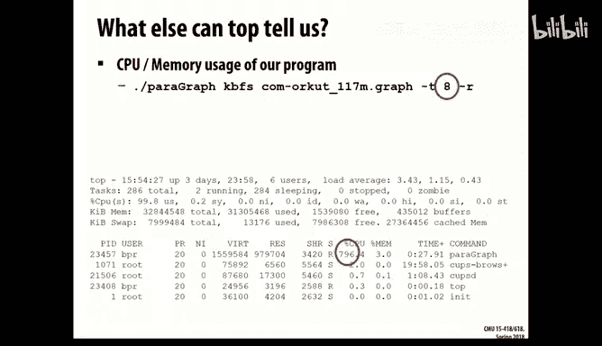
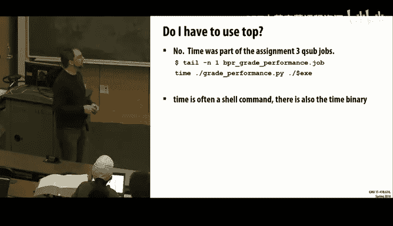
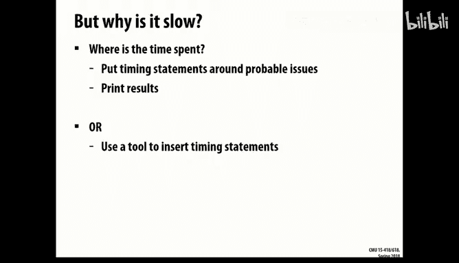
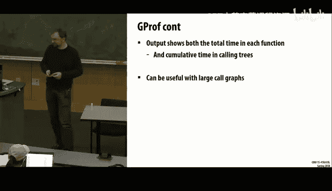
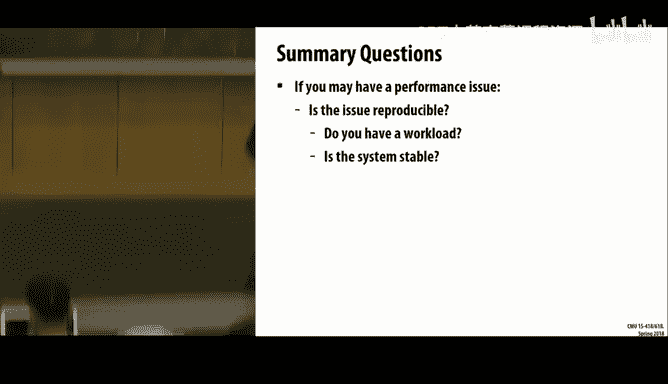
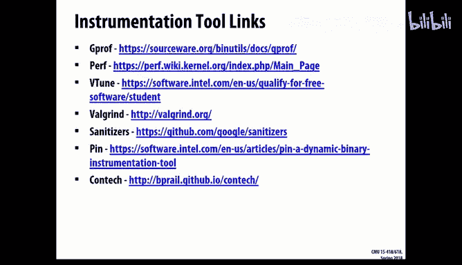

# CMU《并行计算机架构与编程｜CMU 15-418 Parallel Computer Architecture and Programming sp18》 - P21：Lecture 21 - 3-5-18 - Carnegie Mellon University.zh_en - GPT中英字幕课程资源 - BV18b421J7cA

Okay， good afternoon， everyone。I'm Professor Raing。I normally teach。

Parallel computer architecture in the fall semester。

And this is one of the particular lectures that I've written myself。

As sort of a supplement to all the rest of the content。

 And so Randy and Kesden both asked me to basically come give it rather than they'll try to figure out what my slides say。

So also is fun other news。I think。I had the very first lecture in this room。In fall of 2000。

 I was in an8，30 AM。In this room。So。It's been a long， long time since then。I'm not sure。

 I think it was calledium， even then， yeah。Chairman of Ben Eagle assigns Board Trust。Yeah。

 so it was like all new down here， you're a new freshman on campus trying to find what is this？

Finding the little secret staircase to lead you down。

 winding your way down to the auditorium to start your very first college class。

 but you all here for your very first college class。 We're in the middle of a semester。

So we're gonna actually talk about performance monitoring tools。

 And I updated my slides So they said spring， instead of fall。 And fortunately。

 I'm told that this actually is lecture 14 because I didn't update that。

 It's normally lecture 14 in the fall。😊，So I want to talk about tools。

 I want to talk about sort performance analysis of your code。

 because there's a problem that you all often have。You often walk into， say， my office hours。

 Randy's office hours， T A office hours。 You walk in and say。Oh， no。

 I can't meet the performance target。 My code is really slow。 Oh， no， My code has。

 it seems to be using lots of memory。 It got Sig killed it。On and on and on and on and on。

To some of these to some of these， when you say， what should I do next， my answer would be to you。

Use the debugger。But that only really works。 sometimes works on the S kill。

 But S kill often comes cause you use too much memory。 Thebugger isn't going to help you there。

Using memory isn't， oh， you forgot to comment out that line where you tried to allocate， you know。

64 GB。我。Okay， that， that was a clear one， but。Beyond that note。

 you're probably going to have to actually analyze your code and find what the problem is int it。

So what you do， it depends， this lecture is about answering that question。😡。

What is it depends part of this。Depending on your problem。Depending on where you're running。

 everything else， the answer is going to differ。So what is your program doing？😡，Students may also。

You have these wonderful insights， okay？You think， all right， I know what's wrong with my code。😡。

It's， it's the file system I O。 Io is slow。 Therefore。

 the reason my code is slow is I'm doing a lot of IO。And you charge boldly forward it。

 You spend 20 hours rewriting your code。And it doesn't run any faster。Well。

 you stare at your coat a little while longer and you go， oh， I know， I know I know。

I'm calling Malik too many times。 Let me rewrite my own custom allocator because， you know。

 I did that in 213。I'll implement Malik myself。 so it runs faster。 No。

 it doesn't make any difference。So you keep going through these。

 The main thing here is measurements are more valuable ins， okay。You need to measure your code。😡。

To understand really what it's doing。😡，I know you know what it's doing。 All right。

 You knew it was doing I O。 You know it's doing a lot of meics。

 You know it's doing all these different， you know， scientific calculations in there。

 It's creating lots of threads。 It's doing lock acquires and releases。

 You're really worried about false sharing。Brandch prediction， that must be the problem。

 There are all these different problems， but which one is it？Maybe it's all the above。

But to know which one it is。Youre going to need to measure it。😡，Alright， and from the measurements。

 then you can have the insights into what's going wrong in your code。And all right。

 I'm gonna to make it a bold assumption。 You're all computer scientists。I know you're not all。

 But for the moment， you're all computer scientists。 The class number starts 15。

 since it's computer science class。You're all computer scientists， and we write programs。Now。

 even better， we can write programs that analyze other programs。

And so that's what we're going to go through。 What are some of the programs have been written by the people that have come before you that help you understand what your programs are now doing。

So。Alright， my example may be increasingly out of date。 I'm not sure what is your assignment 3。

 Are you doing rats。Alright， you're doing rats。 So this lecture was originally prepared based on spring of 2016。

 at which time it was graph processing workload。 Allright，Yeah， so the rats on the graph。

But some of these slides， I'm just going to have to say。This is what happened back then。

 because every semester， we have different assignment threes。 And we take a lot of time to， you know。

 necessarily do all the measurements and try to find really cool insights。😊。

So at the time we were doing open MP P graph processing。

 we had millions to tens of millions of nodes in these graphs。And the code was written。

 It ran on the GHC machines， as well as running on the Zon Phis。

And so that's the workloads we're going to fundamentally be dealing with in this lecture。

And I'm happy to talk to you afterwards。 I'm sure your other professors are happy to talk to you about how what's in here。

 those insights and those tools relate to your actual assignments you're doing。😊，So。Again。

 my program is slow today。 here's your problem。😡，So。What else is running on that machine？

Especially if you just S Sd into a GHC machine。Boy。

 I S SHd into a shark machine a couple days ago because I'm a co 213。

I tried doing something really simple， and it took a really long time。 this is odd。

Doing make of cash La should not take a minute。😡，What else is going wrong on this machine。

 What else is running， Why don't we try running top。And so a little output， some listing。

And it's going to tell us a lot of different things about this machine。 Alright。

 about what's running on the machine， what resources are being used on this machine。So， for example。

 all right， this machine has 50 users on it。Okay， that's a little suspicious。50 people could be idle。

But the probability that， say， 50 of your classmates are all logged into the same machine or just sitting there idly。

 with them open。Just staring at their code， wanting to know what's wrong is unlikely。

 Some is probably running their code。Well， in this case， it wasn't。You， hey， look，99。9% idle。Oh， boy。

 like this machine' is basically idle。哎。And another thing that you can see here is we can look and see how much memory is free in this machine。

😊，I can see。 all right， it is about 16 gigs， total memory。And free is about 8 gigs，So if my。

 if my code is running slow and when I look at top， this is my result。It might actually be my code。

 That's actually running slow。Because while there's 50 users on the machine， otherwise。

 this machine is basically unloaded。There's not a lot going on。Instead。

 now I could be running paragraph， which was the graph workload。😡，And when I'm running this workload。

 telling it to run with eight threads。😡，Here， now I can see stuff like， I'm using almost 800% CPU。

I bring this up because。There is a never ending debate as to how to add up percentages， alright。

This machine has eight hardware threads。😡，So。When I run my code。😡。

And I use all eight hardware threads。 Am I using 100% of the CPU in the system。

Or am I using 800% because I'm using 8 CPUs 100% of the time。And even here， it won't agree。CPU usage。

99%。 CPU usage for my program，796%。So this number tells us aggregate。😡。

99% of the CPUs are in use when this program is running。 And it just happens to be， it's me。

Who's using basically 8 CPUs worth of load。So。That would be。

 that's one of those things that can often get you。 And you're going。未。😡，It says 200% CPU。

 How do I get 200% of a CPU。So understand the percentages when they talk about how much percent of CPU you're using are often per thread。

Because otherwise， it makes sense to you to say if my code was CPU bound。

 I would expect it to be using 100% CPU。And if it had two threads， I now in its CPU bound。

 it'd be 200% CPU and so forth。So。Do I have to use top？😡，I mean。

 do you have to basically log in So you have a little shell running on whatever machine you're testing on。

No， but top is one of the very quick tools that， like I said， a couple days ago。

 when a shark machine was slow， I brought up top， and I observed that one of the students at the time had multiple instances of their cache simulator。

That was in an infinite loop and using 100% CPU。So as a professor。

 I got to quickly write the email saying， did you know that you had four instances of the cache simulator using 100% CPU on this machine。

 Please kill them。This machine is unusable。So there are other tools。😡，So time is another tool。

And at the， and at the time in that semester， whenever you created your jobs and you would submit them using Q sub。

 time is already integrated in。And most students didn't even notice。 So time。

There's two versions of it here。 It could be a shell command。Or there's actually also a binary。

 And they fundamentally do the same stuff。 But one of thems cooler than the other。

So if you just type time in front of your command。It would give you some basic information， like。

How much CPU it used， how long it took to run。 And that's about it。But often。

 it's more interesting to instead use user bin time。And it will give you more detailed results。Again。

 giving you some basic insights into overall the program's execution。So I can see again， allright。

 time here for the entire duration of this program running。

 It used 600% CPU took 33 seconds to run for those six CPUus of aggregate time。😊。

Only six seconds total， because it's parallel。Go us。 We wrote our code in parallel。

 So it it didn't take as long on the wall clock。And other things like how much memory it was using。

 so。Here， we're just under a gigabyte page faults and so forth。 But these are aggregate statistics。

 Remember， when I ran top。My eight threads corresponded to 800% CPU。But time only tells me，600%。

My program has the sequential parts to it。And when we look at these nice aggregate statistics。

We get aggregate results。We get the behavior of the entire code。

 So we get the behavior of the sequential part。 We get the behavior of the parallel part。

 and we just sort of call it all together the program execution。No。But why is it slow， Alright。

 we decided our code is slow。 My code is slow。But I don't know why it is。

 We just at least agreed that I didn't write fast code。Or maybe I did， because I haven't shown you。

 you know， like what my performance target is。So what could I do well。Maybe。

Maybe you go through your code and you write printf a bunch of blas。Printf here， what the time is。

 printf here， what the time is。Let me just see timing statements。 I'll just put them in myself。哦。

If I yell at you or your professors yell at you because you use printf to debug your code。

 I'm gonna yell at you if you use printf toty your code， too。

 I'm not to say I don't do this sometimes。Sometimes it's perfectly viable to say。

 I know this one piece of code。 I needed time this piece of code specifically。

 I'll just use printf myself。

It'll work。But we don't know why the code is slow。 So the good news is。😊。

People like me and others write tools。 They write programs。Then take your programs。

 and they'll put all of those effectively printf statements into your code for you。

So now when it runs， it'll output a whole bunch of times or other data。

 And you might have a better idea。 So what does this look like。

So what I'm talking about is a program instrumentation。😡，And so program instrumentation。

 it has two flavors。Okay， and I'm going to talk about tools that work in both of these flavors。

One flavor is when you compile your code。Instrumentation is included， when it's compiled。

So anytime you run that binary， you have it with instrumentation。And the other version is。

We take the binary。 And now， when it runs， we somehow inject whatever instrumentation we need。

And there are advantages and disadvantages to both。So。Into these tools。

We're going to talk about a couple different families now。

 And these tools will come of both variations， both the compiled time and runtime instrumentation。

So for program optimization is this first set we're going to talk about。

 We're going to talk about G Prof。Per。And V2。And after those。

 we'll move into some other sets of tools。2。😡，But first， MdL's law。

If you go to talk about performance， we need to talk about Am's law。Up until now。

 you probably thought of Amel's law about parallelism。😡，Right。There is some speed up component here。

 which is P because it's the amount of parallel we apply to it。

 and it makes the overall program run faster， okay。But P， really。

 we can be talking about any component in the program。

It doesn't have to be saying we're going to make it parallel。

All that we are saying is all that I'm saying。Some portion of the program I can make faster。

 That might be me making it parallel。 It might be because I sit here for a really long time and figure out different ways to write the code。

😡，So that code runs faster。But the key thing is。Just like when we talked about with parallelism。

Whatever components of the program。😡，You're going to make faster。😡。

That's going to limit how much you can make the entire program faster。Okay。So I might have code。

 I might have， I have many different routines in my code。Some routines spend 50% of the overall time。

 Some routines spend 5% of the time。It is， therefore， advisable。

To concentrate on that 50% of the time。Because it was the 50% of the time。

Making small improvements to it will make a bigger difference to the speed up than on that 5%。

So what we want to do first， the first measurements we're trying to get now about our program is what is the hot code or what are the common cases in this code。

😡，Where are they， What are they doing， and perhaps how is that time being spent。So GProf。

Back in those days long ago， before everyone carried around laptops and smartphones when I was an undergrad。

We use GPro。We would add just a little dash PG flag into the compiler flags。Make clean。

 make all your code rebuilds。And now it's instrumented。

And it's placing these calls in every single function。 So then you just run the program。

And after the program runs， some little output file is generated。In the directory。

And you can say GProf of the program。And when you do that。

Now it's going to show you some time about that program。

So the output is going to show both the total time being spent in each function。

 as well as sort of cumulative times。 So you can watch the calling trees。

This function calls these three other functions。 Those functions call more functions。

How much time is being spent to each of those functions。And so you， as the programmer。

 can now look at this。And' think， all right。I wrote 50 functions in my program。

I could flip a 50 sided coin。And pick one of them。Or maybe I should use something like Gp。

 And it's going to say， hey， more time than any other is spent in this routine。

Perhaps I should start there。This is really useful when large calld graphs。 Remember。

 it's splitting this by function。So if you wrote your entire code。

And your code is 400 lines of code in mainine。😡，Your GPro result will not be very interesting。

So。Run the instrumented code。 And now when I say GPro and get the output。It'll tell me things like。

 allright，70% of the time is spent in this build incoming edges， building up the entire graph。

 and another 30% of the time is spent running page rank on the graph。And we can see things like。

 how many times this is being called or 18 times。Or 1。6 million times， or so forth。

And it gives us some insight。Well， now I know I'm either in the build incoming edges or page rank that matters here when my code runs。

Well， build incoming edges was the code that the instructors provided for this assignment。 You know。

 you as a student， have no say over what it's doing。

 and it doesn't matter towards your performance result。

The timing measurement is meant is just runs on page drink。

 So I can discard the build incoming edges and just worry about。The page rank time。And hopefully。

 that's enough。But if not。You switch to other tools。So this class says computer architecture。

So the architecture provides several things that can be of use to you。

 These little performance counters。The performance counters can be tied to different things。

 They be tied to cache misses or branch mis predictds the instructions per cycle， etc cetera。

 They are all a bunch of different counters。And there are various tools that are available。

That actually allow you to access these counters。Now， these counters are all privileged。

 And so these tools require root to have been installed。 And so if they're not on the machine。

 then either you need root or you need someone who has root to install them。

But what they do is provide access to the counter。I can look and I can say what counters are on the system。

And a simple thing to do might be， allright， I just want to take the statistics。

 What are all the counters that trigger when my code runs， and it'll just collect a common set。

And say， all right。有。1% of your memory aes are cache misses。 That's pretty good。

 Or you might get told， 50% of your memory aes are cache misses。

In which case you may have forgotten that， you know。

Which are we supposed to be doing row major or column major programming。

I also can take a specific record， and view that record。And as of at least last fall。

 the GHC machines actually have PEth。And so you can run your code on the GHC machines。

 use Perf with it。And I would actually tell you some things。 So let's go through further。

So stat can be a first way to start， or sometimes it's a nice way to just to collect statistics and say in this implementation of my code。

Here are its overall performance characteristics。And so。I can say specifically sets of counters。

 or it might just select a bit general set。But you need to be very specific in your pairing。

 So there's a counter that will collect how many branches are in your code。

And a separate counter is that's going to collect how many branch mis predictiondictions come from your code。

And you need the two together because you just count the number of mis predictiondictions。

I can't tell you。Well。Is that a 90% mis predictiondction rate or 1%。

 or you could say the same for caches？If I just told you your code had a million cache misses。😡。

Is that good or bad？Did it access memory a million times or did it access memory a billion times。

So you'll need the counters paired together in many cases。To actually have， again。

 get that insight from the measurement。Now， processors only actually can enable four counters。

And so if you select more than four counters in a single execution。

 it gets to do some fun multiplexing。Where periodically， it decides， allright。

 I'm done collecting this counter。 I'm going to turn it off and I'll collect another counter。

And we'll just try going through this， assuming that your code is fairly constant for what it's doing。

😡，I then aggregate them all together and pretends that it collected them the whole time。

So if I ran Perth again with the page rank。😡，I get lots of these different counters。 And itll say。

 here's how many milliseconds of time I took。Approximate using this many CPUs。Overall。

 that much time took this many cycles。 Here's how much time the front end and back into the processor was stall。

 Here's how many instructions were executed。 So therefore I'm only executing 0。

4 instructions per cycle。 Oh， that's not good。And here are my branches and branches misses。

 And it says， oh， only 2。7 of your branches were mispredict。 Okay， good。So what's the bottleneck。

 What might be missing on this。Yeah， cash。Maybe it's memory。Is my bottleneck in this code。So。

When I collect caches， now I get almost 50 million cash misses。Again， out of 200 million actual aes。

Alright，24%，24 and a half% cash miss rate。That's not good。All right。

So we know the mis predictdict rate。😡，We're good to go， right， what should we do now？

We're going to go back into our code， and we're going to stare it every time it accesses memory and try to guess if this one's actually going to be a hit or a miss。

 right。No， no， no， no。I have other tools I can still use。 So Perf has a record version。

And so of record， by default， it uses cycles。 Otherwise， I can pick any event it has and say。

 when you run。Rather than just recording the number of times this event occurs。

 Now it's set up so that every time the counter overflows。The processor has to send interrupt saying。

 by the way， counter overflowed O， S， you need to do something。And the US could just record， okay。

 that overflowed， I know this many events occurred， or now I'm going to record what the PC value was。

What instruction was running at that time？And while not perfect。Effectively what this gets us。😡。

Is a sample of when these events occur。😡，If I only collected one or two of these events。

 it might not be very good， but I have 50 million cash misses。If I collect and interrupt for every。

 you say，50000 misses， I get 1000 of these events。For when there was a cash miss。

 and they start occurring。Where there are cash misses。But， I wanted to note。

Quoting the architecture manual。Because of latency in the micro architecture between the generation of events and the generation of interrupts on overflow。

 it is sometimes difficult to generate and interrupt close to an event that caused it。Meaning。

If it tells you where something happened， it may not have been on that instruction。

It was close to where the instruction is， but it's not always perfect。

And so sometimes you get funny things like， wow。I have millions of cash misses on a line of code that doesn't access memory。

That doesn't make sense。 Clearly， it's broken。 No， no， no， no， it's not broken。

 It's just architecture。Within a few instructions， my experience has been closest within a few instructions。

 usually like one or two instructions away。And so this is one where you have to put on that hat that says you're an intelligent human。

And you have to go beyond what the computer said to get insight into where it might actually have occurred。

But if I can tell you within， say， two or three assembly instructions where the time was being spent。

That was a lot better than any tool up until now got you。So。Our cache misses the problem。 Well。

 sort of。So now based on cache misses， again，47% of the cache misses were running in this edge map routine。

 I wrote，46% of cache misses were in the build incoming edge code。And so。That's kind of useful。

And so， I can also。Dig in deeper。So I'm going from one workload to another。

Or I can go from another counter to another。 So that was cache misses。 I can also look at cycles。

Personally， almost always you should just use cycles， really。😡。

Unless you have some specific reason you want to optimize for， say， you know。

Cash activity or branch activity。 If what you care about is how quickly your code runs。

 you look at cycles。O。So now， two third of my time of my code is spent in my routine。

 And the other 25% or so is creating the graph， which is skewing the stats from before。

But I'm now reporting on the statistics， and not only am I looking at this listing。😡。

But I can select a function and say， for this function， tell me how much time is being spent。

On each instruction， remember， we're collecting cycles。So now it's saying in this routine。

How much time in this routine is being spent on each line of assembly。And remember。

 not all of these work perfectly together。 I can't jump， not high enough to tag it up here。

Guess I could pile chairs up。Again。25% of the time is being spent on the compare instruction。No， no。

 no， no。25% of the time is probably being spent on the lock compare exchange instruction just above it。

The big atomic instruction， which requires， you know， possibly shutting down the entire memory bus。

 that might be where my time is being spent here。So what is this code doing， Well， we have symbols。

 so it actually is telling you in here what this code is actually doing。And。So as a fun insight you。

 when you type things like pragma open and Peatomic。On a line。

Open N P and the compiler looked at that line and said， how can I do this efficiently。You it。

 you want it to be atomic to perform this operation。Well， I will transform this actually into a loop。

Here， jumping back up to 160。 I'm running a loop here。

That is attempting to perform this floating point addition atomically to that location and memory。

Because you don't want to have the problem where。Again。I don't want to see。Load some value。

Add some other value to it and try to store it back。That's normally what you think， oh， well。

 you know I type increment， I type plus equals， plus equals says load this value， do the a。

 store it back into memory。😡，But you told the compiler I wanted atomic。So the atomic。

 the compiler then said， all right。I can do this with a loop。

And the key thing in my loop is this lock compare exchange instruction。

Which will safely update that location in memory if nobody else has updated it。Resulting in。

 I can't have these loads and stores interleaving together。Instead。

 they're going to be one after another。😡，But it kind of gets a little expensive。

So this one instruction。Is taking over about 15% of my total execution time。Plus。

 some of these other lines， you know， I'm up to。It's 15 to 20% of my execution just on this one little atomic ad。

All right， can I improve this one， maybe， maybe not？😡，Ways it might improve。

 Now this comes to insights。 All right， 15，20% of your time is being spent on a single atomic。😡。

How can I improve this？Maybe I want them to contend on that location in memory less。😡。

Maybe I can think of ways to restructure my code。 So that one location in memory is not being updated by all of you。

😡，I can change it。 so this group over here gets to update it。

 and then this group will update it and do other things。 splitlit up the data in some way。

 Maybe I'll make multiple versions of the counter。 But now it's up to you。

 I got down to the point where， allright， if you can speed up this line。

 you get up to 20% improvement in your execution time，15% improvement。What else could we see？

All right。KBFS， another workload， doing multiple breadrenthbi searches on the graph。All right。

When I look at the cycle time。I'm up over 80% of the execution time is all in the code I wrote。😡。

Okay， I can't blame the instructors providing me， providing slow code to build the graph。

 It's all my code。So where is the time being spent？I look at this big loop of code。😡。

I have basically this operation where I'm checking to see。If I visited， sourceur and destination。

You know， if not， I get to do something。 And if so， All right， I visited。

 I don't need to do anything further with this node。And what is the time being spent？ Well。

 once again， it's not on that compare。 It's on the line line in memory just above it。

But the trick was。In this code， the trick was。The version of visited here。😡，Was a double pointer？

It looks like it's a two dimensional array， and it was implemented as pointer array of pointers。😡。

So every time I accessed it， I had to go through these two levels of indirection。

 which cost me a lot of time。So what did I do？I changed it。

 I got rid of one of the levels of indirection。And by getting rid at one of the levels of indirection。

 my code ran a lot faster。😡，Did anybody figure that one out， Well， basically。

 no one in the class did because no one。At the time， I had never given this lecture。

We didn't find it， we didn't know about it， the instructors didn't know about it。😡。

Because in this case， one of the array dimensions was very large and the other one was like four。😡。

You know what， fine，4， I don't need to allocate another pointer to space for four。

 I'll just have four elements。😡，I'll just change the way it's structured slightly。 And， wow。

 it ran a lot faster。 I had to do one less memory operation on each one of these operations。

And the way we found it was using Perth。😡，We could look into the code and see where was the time being spent。

Now， there's a lot of other stuff going on。 For example， you might have looked at this code and said。

 sync fetch and or。Well， that's another one of those locked atomic instructions。

 That one is really expensive。 That must have been where the times being spent。 Yeah。

 that took 6% of the time。In this function。Versus this， which is taking almost 70% of the time。

So again， you need to have the tools to dive down exactly as much as possible in the code to find what is expensive。

Alright， B tune is another tool。V tune is like Perth。 only it's fancier because Intel wrote it。

The problem is VTune basically requires this little free student license to actually run and use。

And so if you have that license， if you've install it and say your local machine。

Or some machine you have access to。 Now， you can actually look and say。

 I can look at some other counters。 And I can ask it to do some more analysis on my behalf。

So students would come to my office and again。I'd be trying to hint them because they hadn't looked at any of these results I'd say。

 well， do you think your code is memory bound？😡，And they'd sit there a long time。And they're like。

 well， it's doing a lot of operations。 I think it's CPU bound。 CPU is always 100%。

 so it must be CPU bound。Maybe it's memory bound because it's a lot of false sharing going on。Maybe。

Again。Just。Insights， but we didn't have an understanding。 where was it。So with V tune。

 create a project。With that project， now I'm going to say， I want to memory access analysis。

 Tell me some things about this。So it runs one of these graph work loads and says。

 are you memory bound？ Well，50% of the time， you're yeah， waiting on memory。I mean。

 is it memory bound， Sure， that was over half。And we can see other things like， it's memory bound。

And of that 50%， you know，30% of total execution time was waiting on Ram。

We're really doing bad locality。Not surprising if you have multi millionillion node graphs。

That really just doesn't have good locality。But。You need the data and then perhaps know that。

And so it would give a nice little plot。 And it would say， here's your plot。

Here's how much execution you're doing to D RamM。And we could actually look and see， all right。

 here's graph initialization。 Now， how did I figure it out， Because when I。

 when I hover over any one of these， it will actually show me where the time is being spent at each of these time slices。

 And I could see， oh， all of these are build incoming edge routines。😊，Oh。

 now we've switched to my code doing KBFS。And so on this graph input， say it was a smaller graph。

 So the iterations weren't that long。On another graph， wow， I have a lot of these iterations。

 and you can watch each one of these iterations creates a big D Ram spike。😊。

All the threats just start and start hammering memory for a little while。

 And then they calm back down。O。Another tool， another family of tools。

You may have encountered some of these。 These are really more towards debugging。

Which are still understanding and having insight into what your code is doing。So， bowgri。Yeah。

 almost not a day goes by in 213 that you write to a student。

 Have you run bowgri and looked at and fixed all of the bugs it reported。 And the student says， no。

 I didn't。And then they come back an hour later say， yes， I did。 Now my code works。 Thank you。

 Prosor。So what was Valalgin doing， It's pretty heavyweight。

It creates a shadow of all the values in the program。Any anytime you access memory。

 you really go through its shadow copy。That intercepts。

 and it verifies that you really should be allowed to access that memory。

 and you didn't just create a pointer that was secretly in the middle of Algine's address space。

Or something else。And unfortunately， it requires serializing threads。

 So when you're running really parallel code， that doesn't work well。

 And it already comes with a 4 x overhead。 So you really aren't getting performance measurements with it either。

But boy， does it have some useful tools like Mimch。And so now， again。

 this is what you may have done in 2，13 and what you should do regularly in your code and other classes。

 too， running Bgriide。Occasionally， sure it's a 10 or 20 x overhead。 But when it finishes。

 it tells you， yep， I lost 112 bys in my implementation。I may have lost another7 MBby。

And I probably haven't lost the 2。6 GB。But fortunately speaking， I didn't have any errorss。

I already fixed them before I was going to show you these results。

There are other tools like address sanitizer。 This for GCC and LVM。

You can say and it will do something very similar to what Valg did。But rather than algriin。

 which is being applied to the binary address sanitizer is being a compiler tool。

So when you build it， adding in the dash F sanitized address。Now when it runs。You get told。

 reports like。Hey， there's some heat buffer overflow。In paragraph， oh， shoot， that's mine。

I needed to get an error result。You know， I'm accessing memory。 I shouldn't。 So I get this report。

Telling me that a thread read some size at some location， and that's improper。So again。

 very similar to Algriine， I'm getting the results here。

But a big difference is this code ran in parallel， and it only was a 2 x overhead。

 not the 10 or 20 that Valgraine was。But either way， it's still giving me insights into the code。

And it's really up to you。And what your particular need is。Which of these tools to use。

To understand again， what your code is doing。So what you've written in your code。Does。

What you thought。You wrote the code to do。Or。Making it run really， really fast。

And getting a good grade on the assignments， because that's important， too。So a final third。

 quick family of tools for doing some rather advanced analysis。

These are ones you really are only going to encounter， possibly for your research project。

 So that's why they're in here。So if you're thinking in some of the research project directions。

 these are things you might use。So， pin。Once long ago， almost 15 years ago。

 some computer architect PhDs basically wrote a tool that did dynamic binary instrumentation。

At a fairly low overhead。And they wrote a bunch of different sample tools and analyses to get different information in the sites out of the program running。

And Intel thought it was so cool。 they basically bought them。😊，Said， all right， we at Intel。

 we're now going to produce this tool。Which generally was for the better。

 one of the negatives was the original research project supported armM。😡，Intel is not armed。

 Therefore， the armed support has been dead for many， many years。So， but it's an architecture tool。

 And so the questions it's going to answer are ones that really architecture。You know， things like。

 what are the mix of all your instructions you executed？

Do you want to know how many times you did a move。How many times you did a lock instruction。

 here's the tool for you。Maybe you want to know what are all the different memory addresses we're accessing。

 We'll give you a nice long trace。All right， remember that code when it ran before。😡，I had。

200 million cache aes。 That means I would have to record 200 million memory aes。

 Each one's basically at 8 by in size。These traces are not for the faint of heart and not for the people with small disk quotas。

 either。So pin， basically what it is is it's a virtual machine。

It's going to as much as possible try to run the code as it is the binary， but where needed。

 it's going to have to reassemble the instructions with whatever the instrumentation you told it。

And the instrumentation comes from a pin tool。Which says when it launches， hey。

 these are the invent types， I want to instrument。Please tell me every time it does a memory operation。

I want to record the address every time I do a basic block。

 I want to know how many instructions are in that block。

Or maybe I want to record that that block executed。And so。The instrumentation。

 if you were to write a tool。Generally， we' work at one of several granularities。

 I can be instructions。 I can be basic blocks， which are just a sequence of instructions。

 or I can be a trace， which are a sequence of basic blocks。And a really simple tool might say。

 allright。I want to visit every basic block， and for each basic block。

I want to record the number of instructions in it。O。So， now。We run。And we run。

Our eight threads again。And we produce a nice output。

And we can see how many different instructions are running on each of these threads。So。

What do you think？We wanted to record the number of instructions for each basic block。

How much slower do you think this code ran？I mean， it's not much you want need to do。It's fine。

What did I tell you before？Do you have insights into this， You don't even measurements into this。

 We can make up an insight。So you might be thinking， all right， that's not too bad，2，3 x。 Well。

 in this case。This was 10 x。For PN to record this information， and this is a tool note。😡。

This is one of their example tools they give you。Their example tool to record this information was a 10 X slowdown。

Which is fine because we're recording the number of instructions to be really bad if we were trying to record time。

Your time numbers wouldn't relate to what you'd seen before。The times 10 x larger。 What happened。

So theres this and many other tools。 And so if there are very specific things you want to collect。

And do some analysis， perhaps in your project。We have the tool available。

 There are lots of these different tools。Pinen is something that's just in user mode。

 You don't need to install anything else。To make it happen。

So another version of the tool they actually wrote will do a whole cache simulator。

So you can simulate a data cache。And it will tell you what the cash hit rates are。

For loads and stores， separately。For basically your machine。

 but rather than collecting the data for your machine by using those hardware performance counters。

 it wrote it has its own simulator in it。Just like you wrote in 213。

 I'm going to keep referring back to that class。You know， we teach that class too。

But it's doing the simulation。And telling you basically， well。

 here's how much time youre spent on each of these types。

And now we actually have some other insight that we didn't have before。

Its estimation is we have more， we're more likely to have misses on loads than we are on stores。

That's something I hadn't seen before。Not for any of the other tools so far。Or。

Getting several years back now。One of the research projects that was done in in this class wanted a trace of all the memory ases because they were going to do a coherent simulator。

Why want all the memory ases。So I'm going to collect basically which thread this is。

I want to know the instruction count to give me some approximation of time in this program。

And then I need to record， was it a right？So this is recording a write。

 or maybe I'll have an equivalent one that records a read。

And get you the information about it that says， here's write， here's reads。

So now I have a trace of whatever program that I want to run。

And I can write a coherent simulator as my project and say， look。Look， Professor Bt， look。Look。

 Professor Ksten。Here's my cool project。哎。One more tool？哎。Here's ontech。

This needs a giant disclaimer that says。Written by Professor Raing。This is my work。So use LVM。

And I again， want to instrument the code。And I want to record a lot of these different things。

 And I've shown you some of the other tools and talked about some of the other tools。

 And I'm gonna to show you this one， too。 So record control flow， memory a and concurrency。

And can do it for a number of different platforms， languages， runtime and so forth。

Why does it matter？So。I， too， was a computer architect， just like the pin toolol writers。And one day。

 in my graduate studies。We said， all right， we need to write a tool to collect。

 Basically everything that the earlier pin tool had to collect。 We want to do a coherent simulation。

We need to collect all this information。And we said。

 wait hold on we need to collect some other information too。

We need to know the synchronization in this code， okay。And you sit there for a while。

 How are we going to collect this， All right， Well we could write a tool in pin。

But I was a bold cocky PhD student said， I don't trust what P does。

 I don't really know what it's doing。I don't think it runs very fast。I bet I can do better。Well。

 I can。It just took an entire PhD to do it。So。Contact， I wrote the instrumentation。

 That was my design。Instrumentation to be really good is really difficult to write。

Coming up of how to actually do what any of these tools are' doing。In detail， takes a long time。So。

I'm just going to assume a couple things。 You always want this instrumentation。

And your program is correct。Which means if your program's not correct。

 you should better run a tool like Valelgrind and fix the errors。Because if you run my code。

We get to have undefined behavior。You get to corrupt the instrumentation。And。I don't know。

 Your credit card numbers end up in Russia。So。On top of this。

 I've actually written some sample backends， basically the tools。So you can model a simple cache。

 You can detect data races， Under some of the memory usage。

 There' is a simple architecture simulator。 Some students in prior semesters have written coherent simulators on top of this。

And so the idea is， you compile the program。It now is built with the instrumentation， and it runs。

And when it runs。We get a trace。The trace becomes a task Gr。

 the TG stores all of this fun ordering stuff。So what does a task graph look like。

 They basically look like what you may have seen way back at silk。

I just have some of these nodes that run， maybe at the same time。They spawn off， and eventually。

 they sink back together。 This is basically a task graph。

But what it tells us if you want to do analysis wise。I can say things like， well。

 these calls to bar and Fo happen at the same time。I might want to treat them that way。

Even if I was only running on a single core machine and the silk scheduler actually just ranmmed one after another。

The code was meant to be concurrent in parallel。So。We'll get run now。The paragraph code。

 as we've done with all of these other tools。And so at the time， I need to update this slide。

Especially at the time， I had a 9。8 x slowdown。 Okay， but my 9。8 X slowdown gave you。

Every basic block that was executed， all the different memory addresses， all the different locks。

 all the different threads spawn and synced and so forth。Which remember。

 P took a 10 X slowdown just to tell you how many instructions were executed。

Velgrind was like a 10 or 20 x slowdown。And it was telling you， if you had。You know。

 memory access errors。But remember， these things are not for the faint of heart or the faint of disk space。

 And so they're gigabytes in size。

So。Going back and summarizing what we've covered， what you've covered in other lectures， too。

You think you have a performance issue。Does it reproduce？O。If it's not reproducing。

Or only reproducing intermittently。It's really difficult to tell you if you ever make a difference。

Or that the next time， when you collect the data about your code。

 Was it actually recording the performance issue or not。So things like， do you have a workload？

Fortunately， generally speaking in classes， we gave you inputs。 We said run with this input。

 run with this many threads。Run these configuration flags。 You have a workload， good。

Is the system stable。Did you and all of your classmates decide we're going to have a contest to see if we can actually run all of our rats on the one machine。

Maybe you should flee like rats from a sinking ship。

Go to other machines that aren't so heavily loaded and find those that are now basically idle。

 so you can collect the data on them。So。Is your workloaded full CPU？It might not be。As we saw。

 sometimes the workload isn't at a full CPU。Often， that's because it has a serial portion of its execution。

And it has serial portions。They might be worth analyzing。😡，In my examples here， the serial code。

With starter code， and wasn't actually part of the performance measurements。

But you need to be looking at that part of execution。And saying， well， if I'm not， its。Full CPU。

 Could it be that there are other users again on the machine， It's not a stable machine。

I look at top， and I say。Oh， dear。 There are a bunch of other people that are running on this machine。

They're also all running their rat simulations。And my execution time just does this。

According to some thread scheduler's whims。Or。Maybe your workload has a lot of other stuff like I O。

 And when you're waiting on I O to return， you're not using CPU。

And so perhaps then you actually could see， oh， my code only uses 5% CPU at the whole time。

 it's running。Maybe I am。 I Obound。Now。We have a stable workload。We're running on an idle machine。

It's running at high CPU usage during that time。😡，What's using the time。What might it be？

So we can look and say。What are the functions？And then to go back to it。

Don't think that just because I'm a systems person， I don't care about theory。Actually。

 care about your algorithms and your data structures， because once we get down to things。

 that it's what matters。So is your code confined to a small number of functions。

 Probably want to run Perf that's going to let you isolate down to specific instructions。

If you have giant， multi level object oriented hierarchies running through six different。Libraries。

Then it could be much better to run with GPro。Because now you again。

 you're wanting to isolate the time down as much as possible to where it's being spent。

To be getting that insight as best as possible as to where your time is being spent， What is hot。

 What is common。What's taking the cycles？And so， when you get there。Now。

 sometimes you sit back and you say， all right。What's the implementation cost of this。Once。

I have a fellow grad student came to me and said， my codes really slow。 How do I make I O fast again。

 And I said， how do you know Io's your bottleneck。 And He's like， cause I O is slow。I asked him。

 He was very reluctant。 He finally gave me his code。 He showed me how to run a workload。 And I said。

 allright， give me an hour or two， and I'll come back to you。😊，Okay。

He hadn't been through this lecture。 This lecture didn't exist then。First thing I saw。

The make file specified dash00。😀Yeah。😊，Okay， we all knew that was a bad idea。So change that flag。

 change that flag。 change that flag。 Allright， code runs 10 times faster。 Alright， we're doing well。

All right， that took me five minutes。😡，Allright， let's do some more。

So I looked at the codes some more。Okay， like 70，80% of its time is being spent in S TL map。Actually。

 it was being spent in a red black tree。 But if you know S TL map。

 it's implemented of a red black tree。And you say， okay， I have all this time being spent。 What。

 how can I optimize it， How can I change it up。Staring at it， staring at it。 Well。

 I'm doing a giant memory simulation。I'm effectively simulating virtual memory。

Why am I using a map to simulate all of virtual memory。

 I have a data structure that does a really good job of of mapping virtual memory to physical memory。

 It's called a page table。So in my other 50 minutes。

 I replaced the S TL map with a page table implementation。 And so after one hour。

 I handed the code back to the fellow grad student and said it runs 100 times faster。ふ。😊。

And suddenly， like the things he could simulate changed。YouHe's taking hours to run each experiment。

That hour suddenly became minutes or seconds。But he had never run the tools。But he knew the insight。

 My insight is， my I O is slow。 Did I ever touch I O。No。

 I didn't touch I made his code 100 times faster。 It still wasn't I O bound。

 even though I sped up the CPU by 100 x。He could have spent weeks optimizing I O。

And I've done this with other grad students， as well。Where they have， Here's my code。 And I say。

 okay。I just can't leave well enough alone。 You hand me your code。 I'm going to make it faster。

If we're doing this， this is like a common research project。So Ive run the tools。

 and it says this data structure is slow。Okay， well。Maybe I can represent it in different ways。

 I can use that theory and algorithmic knowledge。To transform into new data structures。

But it only comes once we have the measurement。That tells us where that time is being spent。So again。

 in summary。We have a reproducible， stable workload。 The machine is idle。It's using all the CPUs。

 You've stared at it and you said， oh， good。 You aren't using an O of n squared sort。

 You used in log N。 Good。 We've made an improvement there。 Yes， I've had to fix that too。

 once in someone's code。They， thought it was fine。 They thought M was 4。

 That's what they tested with， n equals 4。I was testing them if n equals 1，000。😡。

The execution time changed completely for their code。They said， oh， O， I'll change my sort algorithm。

 and it went so much better now。So what else is left， what are the other hot functions？

Can we find where the cycles are， Sometimes can you find out why there are those cycles。Okay。

Tools like PEf or even Vt are going to tell you， hey。Your time is on this line is being spent。

Because。You have cash misses。Because you have careers traffic。 because you have branch mispredts。

Because you've saturated your AUs。And different of those answers are going to give you different measures of remedy。

So。This is the giant。 If you want to follow up with any of these tools。

Here's where you can find them。And I've already sent the slides。

 and I can send the ones that now save spring of 2018。Oh， well， there you go。

So the slides will be available so you can follow up with any of these different tools。

 S me email or so forth and say， Professor Raing。How was it that I did perfect in。

 Which event should I really be looking at， What does it mean to be a stalled back in cycle anyway。

I don't remember after to look at my dissertation。So thank you。 I'm happy to take questions。😊。

Happy for Professor Bryant to take questions about the assignment or so forth。

 but otherwise we're done。哦 no。So in particular， looking forward to MPI， how do you figure out？

If you have like word quote in balance。Yeah。MPI seems hard because you have these independent processors。

 each of which can be quite k。在这す。Yeah， how do you。で長す？There are probably are tools for it。

 My knowledge and experience of MPI and for performance tuning is very， very limited。I will admit。

 I don't know very well， probably what I've done in the past for students that have had that issue is again。

 I just basically SSH into the two machines and I just fire a per for top or so forth on each of those machines or the different machines and try to look at it that way。

And this is actually one case where those print F calls might be viable。Or changing up the script。

 So when it says MPI run， run this program on all the different machines， you tell it。

 I really I want you to run is Perf of this program running。

 and then it might actually launch with Perf and it will give you the Perf statistics and information back that way。

😡，Would give you back on the。Yeah。I'm not certain on that one。

So now I have something to update my slides with。 How do I do MPI。Well。

 I think it would only give you the per fund。Process 0。

That's why I was pondering is how it does the launch when you do MPI run。

If they'll actually launch the Perth。On all the different machines with that command line。タですけ。

Information back to。Yeah。This is one that we're going to have to just log into the machine and try。

Anyone else？Anyone actually like already just typed Perf while they're sitting there with their laptop open？

So V， you have to use ICC in the US， right， no。Vune does not need ICC。Oh。So。I mean。

I've run det with by LVM instrumentation。And just gone ahead and said。

 heres a program I built with LVM with my instrumentation， BTune， tell me about it。

Just out of curiosity。I mean， Vune is just like perf in that it just takes the binary。No。

 I am not aware of the BT actually being on any machines at this time。😡，It's on my。

Get down the trade。V tune， if it is， that would be great， but no。It probably isn't。

It's free to students and free to educators。😡，I met with Intel two weeks ago。

 and at least one of the things that I got out of that meeting。

 some things that I didn't go very well in it。 But one of the things that did come out of meeting with Intel。

 Yeah， I I didn't get any free hardware， sorry。They were like。

 you should really get VTune and get like a site license or a classroom license so that anyone that has access to say the late dayss cluster can just run VTune。

哦。So what you should do right now is drop the course and sign up to take it in the fall。 No， no， no。

 no， that's。Probably not the way we want to go about solving that problem。

 So I'm sorry Bt just isn't available。 It's just on the list。To try to make it available。

 was there another question over here。Okay。So I mean。

 all my VT results were taking on my local machine in my office。Anyone else。

So my recollection with Gpro is it。It's pretty crude， it's very the granularity on it is very cool。

But it just cases the interrupt timer of。CPU and then just to says，Oh。

 where am I I actually know it's worse than that。I mean， or better， I don't know。

 GPro is actually compiler instrumentation。Pf is using the interrupt timer to tell it where it is。

GPro puts function calls around every one of your function calls to record the stack。

 record the current time。And so it actually is rather heavyweight and imposes a fairly significant slowdown to just record those times。

And you can't the time to do。But it most the main advantage it gives you is accounts。Right。

 and the other main advantage is， it's really easy to enable。Okay。😊，That's Simon three。

 which wesubmit on the white date。If run。Pty。still日。Those results should be useful to you。

Some things， some insights aren't going to translate over。😡，So if you said， oh。

 I'm going to take all my insights and run on my code when I have only one thread。

 it won't translate over to when you have 16 threads。Some things will very well。And actually， I mean。

 some of my approaches to solving。Solving things like assignment 2 and assignment 3。

 When I wrote solutions to them。For the most part， I ignored the parallel aspect to them。

There's a lot to be done with just speeding up code， even in a sequential code。

In ignoring the actual parallel aspects。Because for the most part， like your parallel code。

 the parallel code parts are all right， do I have locking。

 am I creating false sharing or other coherence misses。

 but outside of that there might be a lot of opportunity to say。

 let me figure out faster ways to compute rats。😡，Or faster ways to compute circles in Kuta or so forth。

So no， your results will carry over。 but again， every time you move to a different machine。

 some things are going to change in different ways。And the thread count is usually the big one here。

 not the power of this CPU。 It's the thread count。Because especially because late days are actually fairly old CPUs。

I think the CPU of my laptops newer。I mean， the CPU is more powerful。

But this one is a newer micro architectureitect。Are you working on a question？

I had one question I actually ran vgri on assignment three and what I noticed was with the compiler optimizations turned on a lot of the function calls actually disappeared so generally when running such profiler should be turned off compiler optimization。

No，I mean。I mean， in some degree， yes， I mean， actually if you have G profit。

 it will probably prevent it from inlining。But。So cheap up。

Is going to put the calls around the actual functions like I mean， you can sort of you could。

 there probably some like dash F， no in line or something like that。But for the most part。

The compiler is doing inlining because you told it to make it optimized code。😡。

And it goes back to the other question of， well， if I take these performance measurements on unoptimized code。

😡，Can the insights translate over， sometimes， yes。But remember， my earlier example。

 I had unopimized code。 I turned on the optimizations。 It ran 10 times faster。

Like 10 times slower can completely obscure what the bottleneck is。And in fact。

 you're going to see a lot of memory traffic in O0 code。😡。

Because every access to any variable is basically on and off the stack。😡，So。Generally speaking。

I am from a really odd sphere of programming， which says， I always compile with dash03。

And never with00。Even to debug。But I admit that is a very。Rare position to be in。So yes。

 there is times to turn it to00。Maybe for debugging。

 but not for the performance measurements or sort of analysis of things。 like you just have to。

Look at your code and say， all right。It's in this other routine。

 It's not telling me exactly where I am。 I'm going to have to do a little bit of thinking on top of it to try to track down where this is。

Maybe I'm just going to have to run it again in GDP and set breakpoint or something else to look at the stack frames。

Okay， anyone else。Yes， come to say from the entire spec that they have a technology called like smart cash。

 How will this technology influence the cash mistakes。They have smart cash。

It sounds like marketing term。Yeah， I haven't。 I don't。

 I haven't heard of that term specifically either。We lied to you a lot in 213。

 when we talked about how cash works。O。Did we tell you about a victim cash？Did you。Maybe if I spoke。

 I might have said， oh， by the way， there's a victim cash。 but for the most part， no。

 there's victim caches at the different levels。 You know， the I。

 the instructions and data are split into different caches。 You know。

 the cash replacement algorithms aren't even L R U。

LRThere are more advanced replacement techniques than LRU。We have multiple levels of the cache。

 The cache is prefeting all the time to the different levels。So， I'm， you know。

What smart cache is could be one of many， many different things。And so， yes， if I had better context。

 I might feel actually I just。And then。😊，it talk in。え在。s the ability to do I shared。H。So。So微信。

It's a problem with calling something smart， it doesn't look very smart。Yeah。O。Anyone else？

Oh good old squeaky chair。Allright， I'm still up here。 I can answer questions， but in general。

 I'm going to turn off the mic。

