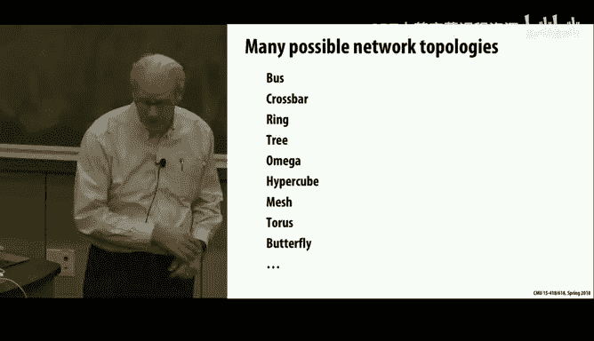

# CMU《并行计算机架构与编程｜CMU 15-418 Parallel Computer Architecture and Programming sp18》 - P22：Lecture 22 - 3-7-18 - Carnegie Mellon University.zh_en - GPT中英字幕课程资源 - BV18b421J7cA

That has actually been the subject to a lot of research， including research here。And it shows up。

One of the parts that you get into when you looking at large scale computer systems that you really don't think about much when you're at smaller scale。

There's sort of a whole area。Work， so what we're talking about are the networks that are connecting。

Computing nodes of a high performance computing system together。

 and it's a very different business you can take courses here in networking and learn all about the internet and TCP and I all that is a really interesting topic。

 but these networks are very different because they're intended to be。Tightly localized。

 extremely high performance。And。On the other hand， they don't have to worry quite as much about failures。

 or dropped connections as you do when you're working with the internet。

When people talk about networking， they can mean very different things depending on the context。

So before we've just described it as when we talk about these cash protocols。

 we just assume there's something way that these caches can talk to each other。

And what we've mentioned in general is just assume it's a bus。

But one thing to remember is that the connecting points of these we'll refer to them as nodes。

 but typically what they are are cache controllers， memory controllers and other。

Sort of parts of the system that are actually serving as kind of proxies for the processors themselves。

And but we'll just for today， just call those nodes。And as was mentioned。

Previous lecture is typically the idea of a bus。which is the simplest form of it actually is a collection of different wires。

 one is to have one set for making requests where you put an address out and another set of wires for the response。

 which returns the data。For our read operation。And。Typically。

 those are physically separate buses to avoid deadlock possibilities that。

A pile of requests come and they block potential responses that then the system gets dead off。Today。

 what we're going to do is go beyond simple buses and look at what if we had a real network of sorts in there and what could those networks look like。

 and how could we get ones that are more scalable towards big systems？And nowadays。

 this is actually an issue not just for sort of data centers like you'd see at Google or Facebook or Amazon。

 or supercomputing centers， but also actually on a single chip， the higher performance processors。

 the issue is actually within the chip they want some type of network to connect all the different nodes。

嗯。And so like。This says the idea of a network， the nodes in the network are potentially processors of memory controllers。

OrC controllers， memory controllers， IO devices。And in other cores。

 so we're not going to worry too much about exactly what we're connecting。

 we're just going to worry about how to connect them。

And there's a lot of issues in this it depends in what type of network is appropriate。

 what context depends partly on how much money you have。

 but also is what kind of scale are we talking about。

 are we only trying to connect four or eight nodes， say in a multico chip。

 are we trying to connect 10，000 nodes and a supercomputing etc cetera。

 and so you end up with very different design choices for different ports。

 also physically if you're on a single chip you can afford to have more wires and sort of fatter connections than if you're going between chips and so the designs become very different as you go up in the stack of the system design。

And a lot of issues come into play that make it actually a hard problem， one is performance。

 both latency and bandwidth。The second is somewhat energy， especially for these on chip networks。

 that energy is a major concern。And another scalability that seldom do people just want to build the one system a company doesn't make。

Just only processor systems with 1000 processors they want a way they can sell a 256 processor system a 512。

 a 1024 and so on， and they want it to be something that they can just kind of crannk out extra ones and not have to custom build the whole special network just for every value of the degree and so there's sort of a scalability issues。

 there's some basic design I can expand and replicate and have perform well or not。

So these are all fairly major issues。And as I mentioned。

 this is increasingly the case even on single chips。

 so the typical nodes that we have for the GHC machines and the late days machines。Ourre。

Multi core on a chip。Typically six。Or eight nowadays and some sort of。So that's a fairly small scale。

 and they typically use a simple ring network to do that。The Zon Phi。

 which is we have some older generation ones。That unfortunately。

 we're not going to be able to use this term unless you want to use it as one of your projects。

That are connected as part of the wait days machines， actually。 And the ones we have are 61 core。

machinesachs and the more recent generation is a 72 core。

 and so those have a network to connect them and they're actually different between the two。

There's a company called Terra that made a， and I don't know quite what their status is。

 but they came up with a design of a very simple core that they could then put 64 of them on a single chip。

And have those all。 So you've got a fairly inexpensive。呃。System。

 you could have a very high number of cores， but using fairly low。No。Bandth connectivity。

 So you had to have this very part problem for it to work well。

 And even as you've seen the what's shown on the right， the tag ray is。

A combination of a GPU and a arm processor integrated a couple arm processor integrated onto a single chip。

 and it's used commonly， for example， in automotive applications for kind of a one chip solution and you can buy them the cheaper versions of this are a couple hundred dollars you can basically have a GPU and a CPUU all combined and have a complete GPU engine all in one chip。

 but they have multiple course as a result。Almost all systems nowadays have multiple cores。

 it's just， are you talking two or four， are you talking 1000 or 10，000？

So let's look at different possibilities for the interconnect and just for terminology。

 we'll use the term node。For the endpoints of a network and like I said。

 those could be a cache controller， they could be a processor。

 it could be a memory controller or an IO device and then a switch is something well and then a link is just a point to point connection。

In this network。And what it physically means is it's typically a bundle of wires and some electronics at either end that can send messages back and forth and the actual details of what a message is is actually will get into。

 and then a switch is just a little block that can。

Connect sort of route messages through it along different。Roouts。

 depending on where it wants to go or various other concerns。

 and so actually the logic behind a switch is part of what we'll look at today。

 and that defines the routing element。So all of those are just terms that we'll make use of here。

So there's sort of a number of issues that come into play， one is so called topology。

 what is the overall graph structure of this network？

And so how are the switches and the links connected and connected to the nodes？

And from that also follows the question of routing。 If I want to get a message from。A to point B。

 what path or what is my algorithm for choosing， what path to follow as I go？

And then another issue is sort of buffering。 What does it mean to actually send a message。

 Do I have to。Move one extreme is you basically have to reserve the entire pathway through the network。

Ohole message or part of the message at a time and moving it through the network。

And flow control is a question of how do I sort of manage congestion is how do I deal with the fact that usually I'll be trying to。

Push a lot of messages through this network at a given time。So， these are。The graph is that。Ha。

That exists in the graph that doesn't have any loops in it， the longest simple path。

Is the graph diameter so example。And so you have 2 n-2 is the diameter of that graph。

And that's the worst case， and then you can also talk about average。Although in a mesh。

 the average case isn't that much different than the worst case。

Another thing that you'll see when people talk about networks is they sort of two different general flavors of implementation。

 a direct network is one where the switches and the nodes are sort of are one and the same so whatever block it is that is。

呃。The logic of the switch is built into the node itself。

And another form is an indirect network where there's really。

A whole series of switches that are distinct from the nodes completely that form a chain。

From one endpoint to the other。So that's called indirect。So some of the sort of。

Useful things to look at is。Is sort of in the worst case， if how much。呃。

Basically a measure of how much connectivity is in their network is what's called the bisection bandwidth。

 which means if I were to cut this network in half and count how many connections there are， then。

That's a bisection bandwidth。 so if you think about a mesh， for example。

If it's an end by end network， if I cut it in half。Then I'll cut through approximately N wires。

 and so you'd say that it's。There's n squared nodes。And the bisection bandwidth is N。

 So you'd say that the bisection bandwidth is the square root of。The number of notes。hi is good。

 but not great if you think about sort of a simple ring or a linear chain。

 it has a bisection bandwidth of one if you cut any wire you've disconnected the network so。

It has a very low bisection bandwidth and what the issue becomes like if you have an application like what you're working on now where there's essentially no locality at all。

 and so you just have this huge amount of traffic you're trying to get through the system。

Then if you have low bisection bandwidth， that's going to become this choke point for the traffic。

Something like。You know， if you had like a completely random。

Permutation and everyone tried to do a fetch and you look halfway across that about one quarter of them are staying in one half。

 one quarter of staying in the other half， one quarter trying to get from this side to this side and one quarter of them trying to get from this side to this side so if you had a very low bisection bandwidth。

 you'd be in big trouble for that exchange in the middle。So again， this is a question of。

 are we trying to optimize for performance where we can assume there's really a lot of locality and therefore we don't need this big bicentric bandwidth。

 or do we want to assume that there might be this totally random access patterns and we have to move a lot of traffic potentially？

And another question comes with routing and some networks are called blocking networks。

 meaning that if there's one message can potentially block the progress of another。

 and there's another class called non blocklocking networks。

 which are much more difficult to create that says that basically any message can get won't be affected by other messages。

So as an example， what network we'll look at looks like this and we'll talk about the routing scheme for it。

 this is sometimes referred to as an mega network and there's many similar variations on it we'll look at it in a minute but for example。

If I wanted to get a message from。0。To one。I trouble seeing this。I can just。

Run straight across and simply at the same time， I could route from3 to7。

And those two paths would not conflict with each other， so there's no block there。But in general。

 that's not the case with this network。嗯。If we tried to get both from one to。

To 6 and 3 to 7 at the same time， that's not possible because the two switches at the lower bottom。呃。

Would be can't we're assuming that a switch can only handle one message at a time。

Or even if the switch， even if this switch could handle。Like route two mess， one in one out。

 one in one out still this particular link is。啊。Cant handle we're assuming can't handle more than one message at a time。

 so it blocks。So in general， you can imagine that to have a non blocking network。

 you have to have more links in the system so that you have kind of redundant paths to make it possible to always allocate a path。

Another thing to think about for the network is sort of the。

As a function of how much traffic there is。How much load there is in the system。What's the latency。

 what's the time to get your message from point A to point B。

 and the general shape of it is a curve like this， meaning if there's no other messages in the system。

 then the message will kind of just zing right through without any interference。

And as you crank up and more and more messages， then it will slowly degrade and at some point it will reach saturation。

 meaning that you're still getting messages through。

 but there's so much congestion and traffic that they're actually。

Really really increasing your latency quite a bit。And each of these is sort of。嗯。

Where these curves are， they're sort of a couple different。

Sort of lower bounds that define or upper bounds that define these parameters。So， for example。

 the topology itself defines a latency to get a message across a。A grid takes so many hops minimum。

But it might be that there's you know a routing algorithm that is not always optimum for every single message。

 and so there could be an upper bound， a slightly worse a latency bound that's created by the。

The routing of。And。Finally， theres some。Amount that's given by the flow control。

 how it decides which messages to move forward and so that again will add to the latency and at that point you're at the sort of all the limitations are built in and that sort of defines what is the latency of an otherwise empty network。

In similar， on the upper end。You can look at the。呃。

The amount of traffic that can be sustained based on disappear  topology and sort of multiplying out the bandwidth of all the different links。

But。The reality is that there's。The routing algorithm， again。

 will affect decrease how much actual traffic you can you can carry and the flow control will also limit it。

 So like in everything， the restive。Various things you can define as the limit。

 but the reality is that things aren't very always。You seldom hit the ideal cases。

So let's look at some of the possible topologies that we might want to consider。

So so far， we looked at the idea of a bus and physically we draw a bus as a。As a wire。

 but if you think of it from a graph point of view， it's actually just a single node。

A bus is a switch。Of sorts that can only at one time handle one connection if we look at it as a point to point connection。

 it can only handle one。One sender。 And if we assume it's point to point， therefore， one receiver。

 hence the advantage it can also be used for broadcast very cheaply。

 But if we just think of it as a point to point connection。We draw it as a line。

 but physically it's actually just a single switch。

 so it's just a single graph node in this interconnect top。Oh，So。

The good news is it's fairly easy to build and you can kind of。

Adds a number of nodes to the bus fairly easily up to some limit。But and it has this nice。

Sor of broadcast capability that we saw useful in these。

Cash protocols where everyone can monitor that bus and see what their traffic is going on between other caches。

But obviously there's a scalability problem that you as you keep adding more connections youre。

Your bandwidth will be severely limited relative to what you might want to have。

Also physically on a chip， it's actually a fairly expensive to drive。A wire across a whole chip。

 there's a lot of capacitance there， they're pretty big fat wires。

 and so there's actually quite a bit of power used in driving signals on a bus。

So that the extreme other end of this is what's called a cross bar， which is。The。

 the real picture of it should look like this。Right that every。

Every node is connected to every other node by a direct connection。

 so there's n squared switches here。And it lets the system。

Any node you can set it up so any node can talk just one hop to any other node。

And these are actually used， one of the first parallel computers ever built was built here at CMU。

In the 1970s， it was called the CM。嗯。C M1， or let's see。Cだ。这有。

I'm trying to remember and it was actually built with a crossbar switch。

 I think that crossbar still exists somewhere in our archives。And so the good news is。

This is the best possible， it's a non blocking network。Because。Whatever connections there are。

 there's always， if you want to connect nodes I and J。

 you just make use of that particular switch in the crossbar and it's guaranteed to work。

The biggest problem， of course， is obviously a scalability problem to have n squared switches。

 connecting n nodes is a very expensive proposition。But it turns out that these are actual use。

 that this is a picture of a processor made by。嗯。Oracle。

 which is actually getting out of the hardware business。

 they bought a company called Sun Microsystems， which had been one of the very prominent。

Hardware companies and basically got acd out by。Intel and X86。Like a lot of other companies have。

So anyway， Sun was sort of well known for building high performance systems and Oracle acquired them hoping that people would spend a lot of money buying。

Expensive hardware to build database systems out。They're dropping out of that business， but anyways。

 within this chip， you'll see there's a cross bar。嗯。With。Actually。

 two different variants of this design。There's a cross bar。 and you'll see physically。

 It takes about as much area for that cross bar here。As for one of the cores。

You see that the vertical rectangles are cores。And so it's a fair amount of real estate to do it。

But on a chip， you can sort of。Iagine。The sort of well。

 connectivity you need to have to have a crossbar， you can actually build it onto a chip。So yes。

 question。What if you need to。dual route that involves two paths。

So the picture isn't really think of this as。Its basically， a complete graph。はい、ある。So if you imagine。

Physically so the pictures are quite right it looks like。

You know you have to hop along and then jump， it looks like a mesh。

 but what this really is intended to be is。A complete graph。 So there's a direct connection from。

Each node to every other node。嗯。Without any restrictions on。

So at the other end of things is a simple ring。Which lets messages sort of circle around and the advantage of that is it's very easy to expand add double the size of the ring and it's actually used in the to connect the。

The cash controllers in the。Intel prostitutes。The uptll。

 the current generation that's just come out very recently is called Skyl。 Skyl has a mesh network。

But all the previous ones just had rings to connect their cash controls。 So these really get used。

 but usually sort of on the scale of。Of four or eight elements on the ring。

And the the Zion Ps that we have in the。Wait days cluster are ring connected， which。

Is part of the reason why they're not very good performance。

But you can imagine it's a very simple design。And in fact， with the Intel。

This sort of a diagram of what it really means there's the four different。

The L3 cache is sort of physically divided into four sections。

 each of which is assigned to one core's worth of logic。And then there's a ring that connects them。

 so that the。Cash requests from。One part of the memory to another。嗯。If it's a processor here。

That wants to reference。A cash location。That's held over in a different part of the cache。

 then physically actually sends messages around this ring to do it。 And the cache protocol。

It works around that ring as well。So and they also have two other endpoints one is。

The graphics controller。They' have sort of built in GPUs in the processor。

 and then the system agent is the connection that goes to the memory and other peripheral devices。

And as this says， there's actually the rings are just like before we saw a request and response。

As being separate， so that they didn't。Set up a deadlock pattern with each other。

 This has the snooping information sort of passes a separate ring and then an acknowledgement ring takes place too。

 so there's sort of multi rings in this， but logically it's just a ring。

And then we talked before about the idea of a mesh and a mesh is attractive for things that go on a chip because。

It's physically laid out in the two dimensional surface just so I could chip it。And。The。

 the good news is that it's。Fairly simple to route。

 you know it's just like navigating through Manhattan。

 You know you're getting from point A to point B at any given point。

 you can choose to kind of if you're trying to move to the north and the east。

 you can choose to go east and then north or north and then east。 So there's many different routes。

 it turns out， though， that if you allow unconstrained routing， you typically end up with deadlocks。

 So what they do more typically is say。Everyone first has to route in one dimension and then in the other dimension。

And you could also imagine just like if there's a lot of congestion。

 say in the center that some of the messages could route around this。But none of the。

This is all done in hardware so things have to be pretty simple and pretty fast。

 so I don't know of any protocol that attempts to do。Anything fancier than just。

Moving X and then moving Y by  typeping。嗯。But again。

 it has a nice regular pattern that's easy to expand up to different sizes。And so this is what these。

Neuest， the Skylink processors from Intel have small mesh networks connecting with their cache controllers instead of a ring。

The Zion Phi， like I mentioned， the older Phis had a ring and the newer Phis have a mesh number。

And it uses this algorithm I said that you move first in one dimension then the other。

 that's a pretty common idea。One thing thats sort of awkward about a mesh is that has the edges are different than the middle and for mapping some classes of problems。

That can be awkward that what you'd rather do is sort of view this as just。

You take a larger problem and you kind of just tile it in there。But then you want to have instead of。

好。You want to be able to then just sort of have this thing fold back on itself。

And so a Taurus is actually a desirable of。Design， meaning that you want to somehow link the。

Connections around。So that you can sort of have this a more homogeneous connectivity。

 and it gives you more options of how you map problems onto it。So as this。

Picture shows it looks really awkward to have。Some very long connections and some very short connections。

 that means that they'll have different electrical capabilities， different performance latencies。

 and general that's not good in terms of performance， energy efficiency and some of those。啊。

But there's actually a clever idea。That's called a folded tous。That's interesting to look at here。

One on the left is one that I drew it's just a tous that it has the green links are the vertical connections and the red links are the。

Horizontal connections。 And you see， I've numbered it sort of the first digit is x and the second digit is y。

So it's not quite the way you normally label。If you look at the one on the right。嗯。You can。

 with some work， convince yourself that it's exactly the same connectivity。

But it hands to property that no links are particularly long。

 Basically every single link is twice as long as the unit length of before。

But no link is longer than that so that's called dilation when you basically stretch out what we've done is by dilating each length by a factor of two。

 we've made it possible so that there's no particularly wall length and it's a little bit weird。

 how the numbering goes then like here is0 zero。So to the right of it should be 1，0， as you see here。

 And then to the right of that should be 2，0。 And that's back here。And then to the right of 2，0。

Should be 30， which is here， and then 30 should connect to 00。 and so it goes back there。

 so you see that the numbering here is the same and it's the same going vertically and what's weird is that as a result you have this sort of interleaving of the。

Rs and columns from before， but logically， which is all you really care about。

 it's an identical topology to the left and right or， absolutely identical topology。

 they're just different layout outs of it。So that's sometimes referred to as a folded taus that it's a same way of embedding a taus in a two dimensional。

Surface， but avoiding long legs。A tourist， by the way， is。好。As you know。

 Taurus is logically the shape of， say a donut。And this is the same idea of that as if you took。

That thing on the left。And you rolled it like this first into a cylinder and then connected the ends of the cylinder around each other。

 you'd have a taus， and that's what the connectivityivity is。So the point being that。

And I don't know why they're not used more because what this shows is you can make a taurus for roughly the same complexity as a grid and have this sort of more uniform access topology to。

Another actually remarkably useful network is a tree。

And this thing shows on the left is sometimes referred to as an H tree。

And you can see the letter H is the reason， and the interesting thing about an H tree。

 so this thing in the middle is the root。And then it has。呃。

Two children that this isn't really drawn quite correctly。There should be。Yellow links here。

 boxes here。This is a root it has two children。Each of those has two children。

 each of those has two children and so forth。So it's a way to take a tree。

And embedded in a planer surface， which is a nice thing for chips and other places where you might actually want to build things。

That。呃。And it's a recursive design that you can sort of take this idea。And keep。

Replicating it recursiveively and get。An arbitrary size treat embedded on an a。

The only a penalty pay is that some links are longer than others。好。

But trees are actually pretty useful and there's a variant of it that it's called a fat tree and I'll show you a little more detail。

 but the idea of a fat tree is to say the problem with a tree is，In general。

 it has a very poor bisection bandwidth， if I were to cut right through the center here， vertically。

 then I'd cut the tree into two parts， only severing a single wing， so the bisection bandwidth。

Of a classic tree it's only one， and that would be a big problem for my example of trying to do an all to all permutation。

 all that traffic going through the route would be this huge bottlement。

So there's an idea of a fat tree。And I'll talk about it more in a minute that basically it says you juice up the linksn as you go up in the tree and I'll describe what it means to juice them up。

But the idea is as you do that， you provide sort of more connectivity so that now if I slice through here。

 I don't slice through just one w， but actually a bundle of linkss and you can make this。

As fat as he want。And if you see with the H tree layout。

 there sort a space in there to do that that you could add。

More kind of heavier duty connections up at this level。Then you do down at the lowest level。

 so it physically is a feasible approach as well。So let's talk about trees because they turn out to be a pretty important idea。

So imagine we wanted to route from node1 to node two。

And so obviously what we want to do is somehow get up through this point and then come back down。

 but what's the algorithm for that Well， first we have to go up and the question is where do we stop and the basic rule is you say well look at sort of you go up to the point where。

If you looked at the bit representation of the address of the sender and the receiver。

Then you want to go up to the point where they have the same the rest their。

Theres sort of least significant bits match。Right， so for example。Here to get from one to 2。

 it says we want to go up。Two positions and then above this。

There's a unique shared path to the main route that we don't need to go through so we can just go up this far。

And then going down， we simply follow the rule that right is1 and left is zero and we just do it one bit at a time。

 so to get down to two， we'd say go right and then go left。And that gives you that connection。

In similar way， if we wanted to go from3 to6。There is no common ancestor。

 so we'll have to go all the way up to the root。But now we come down and we just do 110， we go 110。

 so you see the routing of this is extremely simple。It's just based on the bits of。

OfPossibly the source address， well， the source address and the destination。But as we said。

 the problem with。Classic tree is this terrible bottleneck in the root。So the idea of a factory。

It's actually developed by Charles Weisersson， who got his PhD from CMU。

And has been on the fact to MIT ever since。啊 he。He made the observation just like I told you that up in the upper levels of the tree。

 we can sort of afford to add more links。And in fact， in this design。

 you'll see that the bisection bandwidth here。 you cut its for。 if you cut right through here。

 which is just as good as any place。 So it has a property that has a。

A bisection bandwidth that scales with the number of nodes in the system。And the routing， you'd say。

 well， now how do I do routing at a factory tree， and the interesting thing is it's basically the same rule。

 you go up and then you go down。But at points in time， you'll have choices now。

 like if I go up which of these two links do I choose。

 well actually if you think about it doesn't matter， so just flip a coin， go one way or the other。

And similarly， coming back down。Over to this side， you can choose among four different connections。

 but they all go to the same place， so just flip a coin and choose that and you're set。

So fat tree routing is no harder than tree routing and so you can see that this is actually fairly attractive。

Network design。The problem with it in terms of practical terms is that。In this classic version of it。

 I basically have to build different switches。At different for different levels of the network。

That because they have different degrees to them。And again。

 if you think about scalable sort of practical things。

That's not really great because think of how few switches。

How small the market would be for root level switches with。Say 256 connections coming in。

So the question is， could we sort of redesign this。

 implement this in a way that uses only switches in a fixed degree？And somewhat surprisingly。

 the answer is yes。And so this network here。You might not believe it。

 but it's actually just a factory。And the way to think about it is。嗯。好。Because physically。

 what this really is， is it's sort of four different trees that are sort of merged on top of each other。

And these gray boxes actually illustrate the correspondence that these four nodes at the top are equivalent to the single root node。

And each of these two on the left。Are equivalent to the。The next level downdos。And you say， wait。

 that doesn't seem possible， but actually it is if you think about it。嗯。For example。呃。

This pair here is really just the same as here。啊。Has a set of links to the two children down。

 and it provides two upward links。And now the routing algorithm is the same as before。That it says。

 as I'm moving up， I can choose。To either go， in this case， upper or to the right。

And I can just do that randomly。And similarly， going up， in this case。

 I can just make a random choice。Uppper to the right。And then coming down。

 I'm just going to follow my one bit at a time routing algorithm。

 there'll be a unique path going down， but there's any number of paths going up that I can just flip。

 make random choices and go up there。So this is actually what out there in the commercial world。

 there's one of the most popular network design is called Infinna band。

 and it's it's used in pretty much all the supercomputers nowadays。Not all of them。

 but a good more than half of them， it's also used in a lot of high performance like we have a cluster it that's shared between computer science and physics。

That they use for both graphics and scientific calculation， it has an Infin band network。

Which at the time， we bought it。It costs almost as much for the network as it did for the processor。

It's not a cheap thing compared to say standard ethernet， but it's not in feasible type。

 so these are used in a lot of high performance applications。And the interesting point of it is。

Physically， these boxes are pretty much the same as if you've ever bought an ethernet switch， right。

 it's just a block that you can plug in a bunch of ports， and it will somehow get messages。

Connected through it。By some magic process， that's essentially what these are。

 is their ethernet switches， but you repurpose soft。

 the routing software to be able to make the random choices in one direction and the directed routes in the other。

Physically， the same technology is a company called Melanox that will basically sell you an ethernet switch。

Or an Infin and band network， and it's all the same except for the software。So anyways。

 just a pretty interesting thing and usually these are marketed as fat tree networks。

But they're actually more related to a network developed by a fellow that was a researcher at Bell Telephone。

 Bellll Laboratories in the years when they're figuring out how to make big switches to connect phone calls in high traffic areas。

 and so a lot of their original ideas in networking came from there。Another sort of。

AClass of network is sort of to take the idea of a mesh。And go into multi dimensionmens。

 And so it's called a hypercu because potentially you want to go beyond just three dimensions。

So you can think of a cube， that the generalization of a cube is something that is constructed by taking two cubes of the next lower degree and connecting each of their nodes。

Pair wise， so a cube， a zero dimensional cube is a single node， a one dimensional cube。

 you take two zero dimensional node cubes， meaning two nodes and you just link them together。

A two dimensional cube we're using kind of weird terminology here is you take two one dimensional cubes。

And you just link them together and similar in three dimensions。

 which of course you're familiar with， but now you can go beyond that to connections like four dimensional and5 and so forth。

 you can go up arbitrarily on this。And it has a property that。D啊。

But you can see this four dimensional cube is done by taking two three dimensional cubes and then just creating connections between the corresponding pairs of nodes。

And the nice thing about this is again， it has a very simple routing algorithm。

 you can think of it that just like before that the bits in this address denote positions on the cube and the general rule is the connection from any pair of nodes。

Exists if they only differ by one bit in the address。Right， so if you look at。

 and basically this is a。Four dimensional cube。 so the address is4 bits。

And the basic rule is there's connectivityivity between。好。

Any two nodes if they differed by only one bit， and then there's an easy routing algorithm that just says。

 okay， if I have to get from address A to address B， I'll just do it one bit at a time。

Say from the high order or the low order or random order bits， I'll just。

Move to one of my edges so that I have one closer。In terms of how many bit matching bits there are。

 it's called the Hamming distance。Until I reached my destination。It actually。Is again。

 a design that has a fairly simple concept to it。As mentioned， there is a。

My first equity position was actually at Caltech。The 80 S。My colleagues were building this hypercube。

Based processor out of。Very old intel processors， what now would be considered pretty pathetic。

Intel processess。嗯。And there's other companies， there was actually a company called EnCe that went out of business that was building hyperperCe。

 and then there was a Intel had one too that they were trying to market and never were very successful。

This was the old story that you could come up with these great designs。

 but as long as conventional processors kept getting faster。

 nobody wanted to take the time and trouble to program a appar。But anyways。

 the problem with hypercubes is physically you can't create。

Pack more dimensions into three dimensions than exist。

So you can imagine like a four dimensional cube， I can basically。

Just put enough wires in to make it work。 But as you scale up more and more。

 you have this very dense nest of wires trying to connect things。 it doesn't lay out very well。

 So it as this nice bisection bandwidth like we saw before that I can cut through it and basically have the bisection bandwidth scales with the number of nodes。

But it has this nasty property that physically， you can't really embedded it in any kind of realizable structure beyond some limit。

 So I believe that actually， some of the。And at one generalization。

 this is sometimes called a binary。呃。NQ， it's possible to generalize this。

 so instead of just having one bit for the address。Each bit you basically have a multiple degree。So。

 that。You can not。You can have。Generalizations of this。 But so some of the。Supercomputers。

 I think once made by Cray， do use four dimensional cubes。But they have not just binary。

 they have a higher degree at each node。We've looked at this very briefly。

 this is sort of a fairly classic design。That's referred to as an omega network。 and you see that。

Of logically。We draw like this， but actually we should sort of wrap it around because the nodes on the left and the nodes on the right are the same thing。

It's just very hard to draw that than think about it。 But basically。

 what you have is an array of and nodes。And then n log n roughly， and over to log n switches。

That connect between them。And provide a pass from one node to the other。

 so it isn't the case that I have a bunch of nodes over here， a bunch of nodes over there。

 they're all one collection of nodes and I'm doing point to point around here。

But it's easiest just to draw it written like this。

And so you'll notice that this has this interesting topology that at the first level。I'm jumping。呃。呃。

Across large gaps， and then at the very end， I'm just doing a split between them。

And the reason for that is， again， sort of a routing scheme。That says。啊。

I'm just going to work from the most significant bits to the least and follow the rule that one means down and zero means up。

So if I wanted to get。To node 6， and I started at one， I'd go down， down up。

And you can see that the structure of the network is is exactly right for that。

 that these are going by jumping by。Across multiple levels here， these are only jumping。

Between two levels。No， this one is。Well， this network you see here is connecting it's taking in。嗯。

hi doesn't matter where they come in， but going out， it's either going all the way up to zero。

Were up to。Here， so there's sort of a larger。Spread here。 And， in fact， topologically。

 it's very similar to that。tree。That I showed you before that if you。Line on your side this way。

 and look at it。You can take of that fat tree。Consum degree factory is similar to if you looked at the right are the leaves and you work your way up。

So this kind of network comes in to play it in multiple places。So this is a。

There's been many variants of this idea and many papers published about it。

 I don't know if it actually is used at all。In， in practice。Yes。From one to。From  one to 0。

 you would go， well， you have no choice at this first step。 You just have to take。

Because you only have one connection here。But from there， you would go up。好。2。W up。

 up doesn't mean always up means。The more up of your two choices。So zero， you said one。

 so you have to go this way， you have no choice。But here it is。你 said啊。

So this is the upper link and this is the lower link。

So even though on the picture it's showing down it's among the due choices at Cly。喂。This is got it。

 if you think about it。What other part of computer architecture or computer science have you talked about stuff like this before。

 it's pretty cool， iss it all specialty。It's interesting that now these things get used in real systems。

So what we can see just on these collection of networks we've looked at。We see that。There is。

Both the， the sort of distinction of direct networks are indirect。

So the mesh is typically viewed as a direct network。

 meaning that associated with these switch is a node。好。The issue of blocking。

 the crossbar is the only one we've looked at that's non blocking。

There are possible ways to make the， these。Log with make。Network non walkinging。We looked at that。

The cost in terms of wires and switches。Is highest for the crossbar。

And then lowest for a mash or a ring or something like that。 it's basically does it scale。

 How does it scale relative to N where n is， in this case， the total number of processes。

 It's not just the。It's not the n by n of a mesh， it's the N， the total number of nodes。And latency。

 meaning the sort of。Either worst case or average distance of hopping。

 you'll see that a crossbar gives you constant connection。But the logarithmic ones are login N。

 and in general， the mesh network is square root of N。Proximal。Again， n is a number of node。

 It's not the。Linear dimension of the mesh。So let's look at now， okay， that's this sort of topology。

 the sort of 40，000 foot view of just if you were to physically open up the box and see it what would it look like。

 but let's get down and worry about how we actually implement things。

And so one of the really interesting questions is how do we sort of。

 what does it mean to move a message through one of these networks？And they are creating a circuit。

That the phone， basically， during that time that the phone call is taking place。

 there'd be a dedicated。Series of wires from between the two calls。And。

 and they' just be basically directly transmitting between that。

 even to the point of doing long distance calling， international calling， all that it was done。

 circuit switched。 And it used to be like， if you're trying to phone around the world。 First of all。

 cost of fortune。 and I' see you talk。 And then you hear this echo。

But just basically you're hearing this。Response from the end or the other end of the network。嗯。

But that's the way things worked， and I don't can't think of any example in computer science where circuit switching is used anymore。

So the idea of packet switching， which is what the internet's based on。

 is that you break your messages up into chunks of packets。

But we'll just think from a network point of view， a packet is a complete message。

 meaning it contains in itself。Some information about where it's going。

 possibly some information about where it's coming from， and some block of data。

 and so that's a message we'll refer to。And the idea of packet switching is that you just send things in these packet chunks。

 a typical packet size in the internet would be 1，500 bytes。嗯。And。

So if you're like streaming a video， you're breaking it up into these packets。

 But from a message point of view。It's moving these complete chunks with。Through。And nowadays。

 the phone company uses packet switching too。Now it's such an accepted idea， it's hard to believe。

 but it was actually viewed as。As a very controversial idea and its time when the internet was first being created。

But it turns out that for these kind of networks， we might want to look even below the message level。

ThatSo as I said， the complete message is sort of what the clients think about it。

 but those are typically broken into smaller packets， think of 10 or so bytes。

But at an even lower level， we might even break that into even smaller units and propagate those through。

And so they say sometimes we call it foots or flow control digits。

And that's the sort of smallest unit of flow。So typically then a packet will have。

Some header information describing where it's trying to go， how long it is。

 possibly or maybe where it's coming from and other types of information willll have what's referred to as the payload。

 which is。The data， and then it will have some type of a tale and that might contain some special code to say this is the end of a message。

 or it might contain what's called a check sum or basically some parity information so that you can check whether there's been corruption in this message as it was sent。

嗯。And again， these vary greatly from one system to another， what the details of these are。

 but it's the same basic idea。But we have to worry about the case where we're trying to send packets through a system and we're trying to get two packets through a switch that can only handle one。

 we're assuming that each link only allows one。Piece at a time。And so。

The basic options are either to buffer one of them and let the second one pass。Or to just drop it。

 that can happen in the internet if it gets too congestion， just start dropping packets。

And or else find an alternate route。So we'll just consider buffering。

 we'll assume that what has to happen is you somehow have to store that information of one packet so that the other packet can until the channel becomes available。

And so as I said， circuit switching， basically you have to reserve that hole all the links along the way and then you can just blast the packet once you have it reserved and that's great The problem is that first of all there's a big time involved in setup and also it really limits the number of connectionsvection you can sustain so it's a very heavyweight approach that I don't think is used at all anymore。

So the more traditional way， and for example， in the internet is called Sting Forward。

So sting forward， the idea is that I'll have to have enough buffering in in my each switch to hold a couple of packets。

Maybe one， maybe two， some small number of packets。

And what I'll do then is I'll send a complete packet， says st forward means you store a packet。

 you send the whole thing to the next one， and then so each packet is a。

Each w is a complete hop of the entire packet。And this is sort of this is actually。

The internet is a straightforward forward network。But you can see that the problem is that。

The latency， each hop is adding the complete cost of sending a packet from over a link to it。

 and so the latency is proportional to the number of hops。

And it requires enough buffering for that to happen。

So there's another idea that's used in these lower level networks it's referred to as cut through routing。

 and the idea is to basically use pipeline that as the packet moves instead of。

Accumulating the entire packet in one switch before you send it on to the next。

 you begin sending them through immediately。 And so you get this pipeing effect。

 So that the time to send a message from A to B is proportional to。啊。啊。

It's equal to basically the message length plus the number of hops。

Rather than the message length times the number of hops。That you pay the cost of the first hop。

But once that gets started。Then you'll just keep moving through until the whole message is through。

 So it has a。It's much better performance in that respect。啊。

So the problem with with cut through routing， though， is it potentially can block。

I've got now all three of these linkss are busy just handling this one particular packet。😔。

The good news is。I can always keep if there's。I can always， even if the head gets blocked。

I could keep moving the packet through it and basically having it slowly accumulate at the different points in the network。

 but potentially I can。I'll be using up a lot of links at any given time。

So there's an idea called wormhole routing。That basically breaks a packet up into something even。

Into these foots， so smaller units than the the packet itself。 So you see the ideas that。

I no longer even have a complete header information in each of these good old pieces。A foot。

 there'll be one foot for the header。 The payload will be a series of foots。

 and then one foot for the tail。And so there's no routing information in the payload。

 basically what I have to do is keep track of。Of。What connection I'm using。

As I'm moving parts of this packet through these foots。

And keep waiting until I see the tail that will be marked by some special flag。

 and then I can basically give it。 so you can think of it almost like circuit switching or then I'm allocating a channel。

 a logical channel， a path through some part of the network。

And using it as long as this message is active。好。And so that's actually used in。In some。

Real network designs for handway。For these networks。One problem you get， though。

 is that you can again have this。啊。Blocking， and potentially you can get deadlocks in the system if you don't think about it correctly。

 that you can have basically two messages or a series of messages that are kind of。

Create a cycle of dependencies on the buffers so that none of them can go through。

And the way that's resolved is by basically splitting the channel into what's called virtual channels and create two。

With enough buffering for each one and providing the capability to。Sort of temporary。啊。Well。

 you recall from from Delock， the rule is there has to be some resource that you're contending with creating a cyclic dependency。

 And so the idea of。Of this virtual channel is to have enough buffering in two different categories that you can avoid the contention。

 And the trick is this idea that you everyone routes first in X and then and y or vice versa。

 It means that you have one virtual channel for the。Traffic going。

Horizontally and one for the traffic going vertically。

 and by sort of doing the right rules on the routing， you can avoid deadlocks。

This work was part of the PhD thesis by a felon named Bill Doley at Caltech。

I reign as thesis committee。But it's actually been fairly this was work done in the 80s and it's still fairly important today。

So啊。We didn't really talk much about virtual channels。

 but the idea of it is similar to what we saw in bust having a separate。

Response bus from a request bus that you're logically breaking a cyclic pattern and avoiding deadlock。

 Similarlyly， there's a similar trick here that I didn't really explain very well that avoids sort of a cyclic pattern that can form with these routing rules。

So but it makes it possible to build very fast and very simple networks。好。

Very simple meaning the amount of hardware that you need in a switch is extremely small。

 not much buffering， not much logic。Compared to the internet。

 sort of what I note in the internet is a very heavyweight thing， lots of buffer。

 complex rules for its roing algorithms， all kinds of routing tables。

All kinds of management stuff here， they're just really small pieces of hardware that you can build on a chip and have entire runningut network that。

So this is still a。An ongoing research topic。Of especially now that we're looking into more ways of taking。

Putting things on chips or the next。呃。Level is to take multiple chips and stack them。Together。And。

Get make use of three dimensions， not just the two dimensions you have on a chip。

 And that gives you much more potential connectivity than you'd have just with two dimensional surfaces。

 The problem is that chip stacking is you don't have nearly the。Between two tips。

 you don't have both the latency and the power to drive the wire is much higher than it is。

On chip and so and the other problem is。If you try and pack it all into one cube of chips。

They're going to get really hot。 So power is a huge issue in trying to do anything。

 It's a big issue in three dimensions， but at least in two dimensions。

 at least with a two dimensional surface， you can basically put a big heat sink on the thing or blow a big fan across it and move a lot of heat。

 But now if I stack it all into this nice cube。 Think of that inner part of it。

 the only way it can get heat out of there is by propagating through the silicon。

Or other channels to the outside。 So it's much harder to keep that cool。

 So it dictates whole new thinking about low power design， too。So anyways， that what you see。

 the general trend has been that things started with simple buses， then they became rings。

 and now they're becoming grids。But there's been a lot of research and you know。

 on the chip level things， what industry mostly uses。

 but there's been a huge body of research going back into the 70s on these interconnection networks。

 and now as。Where scaling up our systems， these kind of ideas are becoming are being revisited。

Reevaluated new ideas for ways to make it practical， and so this comes up。

And still even within a large scale data center scale facility。

 like you'd see at Google or Facebook or Amazon。Or a supercomput center。

 You see much more complex networks going on over time because they're trying to make them。

More and more performance， so one thing I talked to poet Amazon， you know Amazon webs。AWS。

 where you can basically buy computing capacity。 They've tried to build up their。

They're networking inside their data centers to have essentially very scalable bisection bandwidth because。

They don't want to have to worry too much about if you ask for a thousand processors。

 a thousand nodes。Or even 100 nodes。Do they have to kind of put them all in one corner of the data center to make sure there's enough bandwidth between them？

That proved to be more difficult than to just。Provision the network enough so they could just randomly place it and get pretty good performance。

 So network is becoming more and more of the critical issue and。

In getting performance out of machines。Okay， that's all I got for today。

