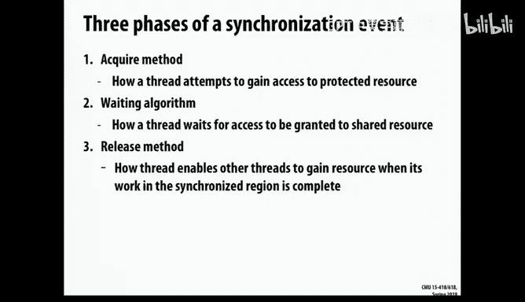
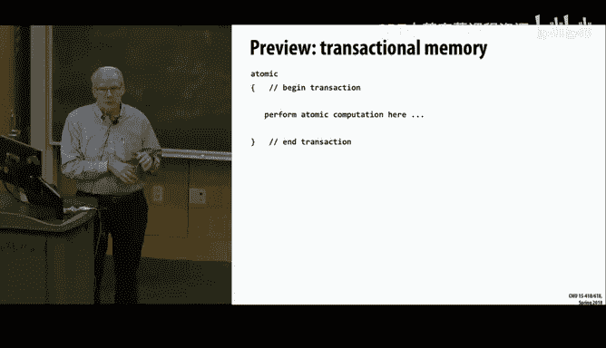

# CMU《并行计算机架构与编程｜CMU 15-418 Parallel Computer Architecture and Programming sp18》 - P23：Lecture 23 - 3-19-18 - Carnegie Mellon University.zh_en - GPT中英字幕课程资源 - BV18b421J7cA

So I hope everyone had a good spring break。 Did anyone go anyplace interesting。Where。Anyway way。

 that's interesting。I went to Doha， Qatar。Not interesting。It's， it's okay， but。

The not like a vacation。So a couple things。 And these mostly have been posted on piazza。

 So I'm only repeating what's come out either over earlier things。 So， first of all。

On the midterm grades， both the exam and the grades themselves。

 the midterm did not go particularly well。 And I count that as our fault， not yours。 In other words。

 if we hadn't prepared you for the exam， then it's not your fault that scores。 And obviously。

 we miscalibrated a bit on the questions， too。 So there is an opportunity for you to take the exam over again。

 a new version of it will be done toward the end of the course when you're in project mode and there's not a lot else going on except for the projects。

And the details of that are in the。Pazza post。 So I hope those of you who did fine on the exam。

 don't worry about it。 But those of you want another try。 I encourage you to try。

 And I can't promise you。Thatll be， you know， itll be a different exam。 So。

 but we'll try to make the problems more to the scale that's appropriate than what we're on the first exam。

So it should be no， at least a no harder exam than the first time round。

And we're not published the score， the solutions to the first exam。 We want you to more。Study it。

 work on it your own。 discuss with friends。 Feel free to make a public posts on piazza with it。

 sort of try and work through it。Instead of us sort of giving you the solution and you saying， oh。

 yeah， now I get it because my experience on those kind of problems is when you see the solution。

 then you say， oh， yeah， of course， it's obvious， but it's not always so obvious before that question。

あて。You got to choose beforehand。That's covered in the post。本。

So both the exams and the assignment twos， the grades will be released on both auto lab and grade scope。

 within the next couple days。 We just want to get the procedures。

That we're gonna follow for regrade requests kind of all put in place before I make the announcement。

 But that will come out within the next few days。Another fun thing that happened over break was I took the opportunity to really pound the snot out of the wait days machines and ran literally thousands of jobs on it。

😊，And I discovered， I tried all kinds of stuff and turned out all my previous theories about。

What was giving variations in performance were complete hocus pocus had nothing to do with anything。

But。😡，After another other sort of random ideas came up with this idea of， well。

 maybe not all the host nodes are the same， there's。Theres some number of， of different。Processors。

 and you just randomly get assigned one by the scheduler。Not quite random。Effectively random。

 And sure enough， when I started running benchmarks that would record which host was running on。

 I found a pretty significant variation in performance。😊，So this slide here shows。

A a chart where there is 100。 This is using the reference solution。For assignment 4。啊。

The sync version running all 12 processes。And what it is is that for each one， it。

 it's a recording of 100 different runs， all measured in MRP。Sored from slowest to fastest。

And what you see is that there's。8 of these kind of all clustered together。

 You can't really see the distinction between them。That are all very close and very consistent。

But you'll see that there's two of them that are just to shade faster。And there's three。

 There's actually a fourth one that are significantly slower。

 So if you had the same experience I did on assignment 3 or 4， where you were kind of trudging along。

 And then all of a sudden， wow， this must been a great idea。 I did super。

 And then the next time you'd try。 And then you'd be down in the bottom and you'd go wow。

 I must have really screwed up and it was very frustrating。

's because youre being mapped onto these different machines。

 Sometimes it was lifting you up and sometimes it was dropping you down。So， the。

And our people who who maintain that facility can't figure it out。

 They've run a bunch of diagnostics。 All the machines are fine。

But my understanding from in the hardware world is that。

There's variations in performance and from one machine to another。 And it's not uncommon。Oh。

 and I'll also mention that this doesn't really occur when you do the single thread or single process version。

 It has something to do with when we're cranking up and running the， the machine full tilt。So。

The bad news is， there's variation。 The good news is that， well。

 at least half of the machines are pretty consistent。 So this is a close up view。

Of the 8 ones that I'll call normal。And you'll see theres some variation。 But if you look。

 this is a pretty tight grouping。 Actually， if this is going from 1，25 here to 1，28。 So that's 3。

 That's really a。s of plus or minus。1。5% from， from an average。

 And that's actually pretty good in any kind of benchmarking of machines， you always have variations。

 So if you can be within a。A factor of plus or -1。 half percent。 You're actually doing pretty well。

And then there's a few outliers。 you'll see that， you know， even on these machines。

 they occasionally perform either somewhat poorly or very well。So。For now。

 there's a very ad hoc thing， which is that when you run it。When you submit your job with Q sub。

 the printed output benchmark do out。 First of all， it will say something like benchmark dash X X。

 X dash out where X X， X， X is a four digit random number。

And the reason for that is you can just queue sub the same thing。Couple times。 I know this isn't。

This sounds like a bad idea， but you can do it。Nobody is gonna stop you and submit a couple of them。

 And then it'll print。 It'll give you a warning message if， if it's not normal。

 It's say this ran on a processor that's known to be either slow or fast or it will say this is info。

 This is one that ran on a normal machine。 So what you should do is。

If you're just worried about the single process performance， don't worry about it too much。

 You'll get pretty consistent results。 But if you're doing the， the 12 process version， then。

Let the ones that ran on a normal machine beer your guide。

 And we'll make sure when we grade both assignments 3 and 4。

 that we do something similar to make sure that theres a consistency。The other thing is。

 and what we're gonna come up with a scheme that's a little better than that to make sure that you only get。

 you can make sure you get mapped on one of these eight machines。Makes sense。 So anyways。

 it kind of solved a mystery for me。And I think you'll find it more。Less frustrating， let's say， to。

 to work on it now。Oh， third thing。 Theres a set of exercises。

 So one thing I think we recognized from the midterm exam is you just haven't had enough practice on the type of problems that come on the midterm。

 And we've been giving all these lectures in class。

 but not really tying them back in any way that you are sort of actively working on the material。

 So starting today。There'll be a set of exercises。 Think of them as very short homework assignments that come out on Monday。

 due on Friday， they'll be graded past fail， three of them， each will count one point out of the。

 And if you remember in the syllabus， there were three total points for the course reserved for so-called take home exams and quizzes Well。

 these will be the three points。 There won't be any in class quizzes。

But the idea is you should take it most an hour。That sort of the rough。Number。

 and one of the first problems will look really familiar。Makes sense。 Any other any questions。Qu。Oh。

 and I'll make a final announcement。 You'll see that there's。

hi is in the schedule of lectures and things。 And I think those are fairly locked in Ive。

For two guest lecture later in the term， one is。Dave O'halen。

 who has done a lot of work in doing high performance computing for earthquake prediction。

 earthquake ground motion modeling。And has a lot of experience in that。

 And then the other is Thomas Sandholme。Whose faculty member whos done these poker champion poker playing robots。

 bots that now are better than any human。And those run on the supercomp facilities at the Pittsburgh Supercomputing Center。

 So he'll talk some about the problems and how they mapped it onto those machines。

So let's move on to today's material。So today， we're gonna talk about synchronization primitives you've seen。

 And， you know， things like semaphos and。and atomic operations and instructions like that。

 But it's pretty important。 And we've learned something about these caches。

The snooping bus protocol caches， as well as director rebates。 So you have some understanding of。

What， you know， the relative cost of different operations and the effect of it。

 And so now it's interesting to。Dive down and look at how some synchronization operations are implemented and see if how they either behave well or behave poorly on these shared memory processors。

 And this is an interesting place where you're sort of looking at the relation between hardware and low level system software and seeing how you can get。

 you have to kind of。Make those two be consistent with each other to get decent decent performance。

So let's sort of back up a little bit and do a little bit of review。 So remember that we have。

 in general， a program， a processor is trying to run many threads。And on a given machine。

 there'll be only some amount of， of actively executable threads in particular。

 and it's a little bit complicated in this era of hyper threading that and multi core。 So remember。

 there's some number of cores。And each core can maintain the execution context of。

Of possibly of one or more threads。 And so that's the hyperthing。And typically。

 the number is two on Intel processors。 but there are actually machines that support more hyperths than that。

And hyperthread， by the way， you we call is an intel name。

 It's usually called simultaneous multi threading。 It's official term。So， anyways。At any given time。

 then。The， the hardware can really only handle up to the number of execution context thread simultaneously using its own hardware scheduling resources。

On the other hand， if you look at， if you were to run a top on your machine or just do a list of what active processes there are。

 you'll typically find many more。 This is an example on， on a particular laptop。And， of course。

 the laptop， you're running a bunch of junk all the time。 You know。

 you've got your browser and Facebook and， and。Various sort of things that you use actively。

 as well as the number of things you use passively。

 things like Dropbox and other services are running processes on your machine just in the event。

 something happens that they'll have to react to。So you might have a couple hundred threads that are potentially active on your machine。

Many more than you have hardware threads that you can execute。啊。

So this at the the operating system level， then it has to decide。啊。What threads should be running。

And so it will do something along the lines of picking one particular core and one particular execution context on that core。

And signing the thread to that one。and that will involve。

Pulling out of memory from some stored state， the， the register values and the program counter for that particular thread。

 restoring it。And setting up some of the pointers to the base registers in the virtual memory as well。

And then it will let that process start running。 It will sort of signal to the hardware to start jump in and start executing that thread。

And。And， and then they will begin the execution that we normally think of running a program。

 But the point is that there's an active involvement of the operating system to get this initiative。

And remember that this idea of hyperthing is something different in that it involves。

Having two copies of complete register states on the core of the machine，2。

 or however many number it is。 So that the hardware can， on a step at a time basis。

 decide which which one of these it's going to execute。

 And it describes in this slide a little bit of a naive version that it。I think I jumped ahead。

 sorry。嗯。Sorry， I jumped ahead。It， at some sort of simplistic way。

 it will decide on a step by step basis。 which of these execution contexts to execute。

 And I say it's a little bit simplistic to say it's one at a time， because。In general。

The hardware is because of the use of。Instruction to level perel out of order execution。

 It's actually mapping both of these。Executing threads onto the hardware resources dynamically as they go。

 And so you'll have some mix of instructions from these two instruction streams executing。

 and it just has little tags to keep track of which stream is which so they don't get mixed up with each other。

And so if you look at on a Uni system， the file slash slash CPUU info gives you a lot of useful information about the actual hardware you're running on。

And this is from a late days machine， which has 12 cores， but it's two way hyperthed per core。啊。So。

And it actually consists of two dual socket CPUs， but it's total of 12 hardware cores。

 each of which can do， too。 So you'll see that it lists in slash prox slash CPU info。

 It lists 24 potential processor source。But those are sort of virtual processors。

 There's really only 12 honest to God processors。 but with hyperth， it's doubled。

 And that's similarly， if you remember the default with open MP。

Was to run 24 threads on one of these nodes or 16 threads on a GHC machine。

But that's because it's sort of going up to the， the maximum allowed by hyperthing。But anyways。

 the point is those are。Those processors are， are really managed by the hardware。

 Once you schedule on to one of those 24。啊。Execution context is available。

 The hardware is handling which instructions to execute in which order。把。

Deciding which of the the potentially 24 to actively do。 That's the operating systems job。 It。

 It selects from all the many different things that might be competing for resources and maps them on。

Okay， so that's just a little bit of a refresh。So let's look at the idea of locks。And。

Let's just start with the simplest versions of them。

 So remember that synchronization really involves three different。

Thanks that we have to somehow acquire。A a lock or some other permission to make use of some protected resource。

And then， we can。

And， and potentially， then in order to do that， we might have to wait for a while。 So if。

 if we don't have the lock， if we need the lock， what happens in the meantime。And then finally。

 once we're done with whatever this critical section is， we release this lock。

 And so how does that get implemented。Well， the city most naive is called busy waiting and。

Or else sometimes a spin lock。So the general idea is you just acquire a walk because you just go in a loop that says。

While the condition that I waiting on is not true， repeat and test to begin。And then。

 the release is just。And， let's see。 And then the release is just to set that tradition condition to be true。

 So kind of trivial。And probably， you've heard that busy waiting is a bad thing to do， which is。

 in general， true， because the processor is not doing anything useful。 If it's in that loop。

 It's just essentially cycling back on itself。You probably know that。嗯。

But so that's the general concept of busy waiting。 It turns out that busy waiting isn't such a bad thing in a highly parallel system。

 performance oriented computing， where if you're not waiting for something。

 you don't have anything better to do anyhow， right， usually。

 like if you look at the problems we're working on。 We're trying to use all 12。However， many。

Prosors we have available。 And if we're not executing our application code。

 then there's really nothing useful to do。 So busy waiting has the advantage that it has very low overhead for both the waiting and for releasing locks。

But there's another version of， of waiting that says。If the condition I'm waiting for is not true。

 then。Let me sort of release control over this。 These hardware resources put me out。

Some somewhere else and bring in a different thread or process that's。Ready to execute。

 And so there's a。A different version of that。 And so， for example， when you use P threads Mutex。

And you do a lock， and it， it will wait。 It doesn't busy wait for that。

 It will typically deschedule that thread and reschedule a different thread that's ready to execute。

So like I said， those are asserted two basic ideas either。Are weighting， meaning actively processing。

 but not making any progress。Or you're blocking， meaning that that that thread gives up its control and allows another thread to get scheduled in。

And。And， in a sort of system that's shared by many users or many sort of types of processes。

 obviously。Blocking is a preferable thing， but there's a fair amount of overhead。

 Buy waiting doesn't require the operating system to be involved at all。 Totally a hardware thing。

 whereas a blocking requires some type of being put on a queue by the operating system。 So。

 and the difference in general， of anything that involves operating system， you're talking。

Multiple thousands of clock cycles， whereasas anything that's purely hardware。

 you can be talking about tens to hundreds of clock cycles。So， the actually。

The P thread actually supports spin locks or busy waiting locks， as well。

So let's look at some implementation。And all this is done in this sort of mythical assembly code that doesn't really look like X 86。

嗯。And it also has a feature that the destination is on the left， which is what most people prefer。

 but you recall。You've been trained to look at it on the right。 so just remember that。

So this first instruction says load。From memory。 And so basically， do a read of the。

 of some shared variable。 compare it to 0。 The pound 0 here means the number 0。If it's equal to 0。

 if it's non zero， then jump back to the lock。 So that's the spin or the busy weight there。

And if it's。0， then set the memory location to one。

And unlocking is just set the memory location to 0 so that another one。

 these programs that's busy waiting will see that change， grab it and。

 and update the value to one again。 So I think most， you know。

 there's a bug in some serious problems with this code。 What is it。Yeah。Yeah， it's not atomic， right。

 that some other process could jump right in here。 You've done the test， found it to be 0。

And then try to assign a one there。 In the meantime。

 something else could jump in and and think the same thing。 So you could have multiple。

Threads advancing through this walk。And it really happened in real life， becauseuse remember。

 now that you've seen cash protocols， you can appreciate that。

It's even though memory operations can be pretty fast。

 that it's a nontri effort to invalidate shared copies。Push them out。 and。And get one。

So in particular， if you think about this， if you have a bunch of processes that are doing the same code。

 all waiting for the same lock。They're all going to pull in read only copies of this lock。

 this memory location。Into their caches。 And so the spinning will go very fast and involve very little bus traffic。

But theres a real once。啊。The unlock occurs。 It'll be this giant battle across them all to try to update it。

 So it's very possible that they could。啊，是。Get this synchronization error。So， usually， most。

Pross provide some type of instruction that's designed specifically for this purpose。

 And the most classic is called a test and set instruction。

So the idea of a test and set instruction is that it。Atomically。Well。Will read a memory location。

Into some register。And if that value is 0， it'll set it to one。Theres variation into this。

 but that's sort of what a classic test and set instruction will do。

And so it has these very specific semantics that's obviously only useful know。

 for synchronization purposes。 But the main point is that it's atomic that it will do that read and the up test and write always is one uninterruptible action。

 So that read and the write are guaranteed to be locked together。 And you can tell after the fact。

By peering at register 0， whether it was successful or not。So given that， we can implement the。

The lock with a simple using this very specific instruction and then a branch。

 So we do the same busy weight。But we've now combined the read and the test， and the write。

Into a single instruction that's guaranteed to be atomic。

 So we don't have to worry about it getting interrupted。

And the unlocking still the same that you store0 the address。

So let's think about bus traffic on that。 So imagine that processor  one。Wanted to。

Acquired this walk。And a test in set instruction is implemented in the same way as a right。 It。

 it's treated as a right that it means the cache has to have exclusive copy of this particular。

Memory， a block， Ca block。And only then will write it。 So it will invalidate anyone else's copy。

 So let's assume processor  one got the。Cashline， and。Is now entering its critical section。

 And so it doesn't have to touch this memory location at all until it's ready to release the lock。

But meanwhile， in the code that we showed， you'll see that it's functionally correct。

 But performance wise， it's not very good because every time。Any of the other processors。

Wants to execute its test， this busy wait loop。 It'll set off this flood of， of cash activity。

Where it will invalidate other copies。 And the good news is that。It won't。

 It'll keep making progress。 But remember。That all these redxes are just going to discover that the。

对。The variable is still locked。 The still ont。Pro ones not going release it for a while。

 So you can basically have an arbitrary amount of。Of cash traffic。

While this processor is in its critical section。So not good。 The good news is。

None of them have enough chance to really build up a lot of copies。

 So there's not a lot of invalidation traffic。 But the。

 the bad news is there's just a lot of traffic that serving no purpose what。😔。

And so it's not till that final。啊，我。AReleaing of the lock， which involves a right。

 And so it the processor  one will have to。Get exclusive access to it so that it can do the right。

Can you notice any other problem with this as far as what happens when that first processor wants to release its lock as far as performance here。

What other， what are the other processors doing in the meantime while this one's trying to do that update。

嗯。Yeah， they're all in the same loop。 They're all physically trying to grab invalid copies。

 So this first one might be fighting with the other ones。

Just to get the chance to actually set that memory location to0。

 and that's not serving any purpose at all。So it generates a lot of coherent traffic as a result。And。

And as this says， if you look at at part 2。The only， only time that， the first， the。

Will actually hold a valid copy of the lock。 will be at the beginning and at the end。

While it it's critical section， it doesn't care。So here's some measurements done by somebody else on actual traffic that's and the resulting time delay that occurs just in that with this particular code during that transition where the。

The first processor is trying to release its lock。 and you'll see as。

And looking at it is a function of how many processors are they're sort of all trying in their busy weight loops。

 And you'll see that the growth is roughly linear。And function of the number of processes。

Because you just have that much more。Tffic， proportionately more cash traffic being generated by all the。

 the waiting processor， in addition to the。The one that actually holds it。

So there's obviously some problems here。 There's also nothing that would guarantee fairness in this。

 that there's no guarantee that。That if you have K different processes all waiting for a lock。That。

One of them。Eventually， get them。RightThey could just keep losing out in this fight over and over again。

 So this solution is neither efficient nor fair， which is kind of a losing proposition。啊。Just to。

 to sort of compare the。The test and set instruction with an actual E6 instruction。

 I've written this in the。Approved ordering of source and destination。

It's called the Comp exchange instruction。And there's some subset of X 86 instructions where you can put a single byte prefix at the beginning of the instruction that says。

 I want this done atomically。 It's called the lock prefix。That's not true for every instruction。

 but it's true for some instructions。By the way， X 86 instructions are from 1 to 15 B。

And they contain various prefixes like this one。 There's another one that says。

 I want to transition to 64 B mode。 I want to transition back to 32 B mode。It's。

 we don't really cover it in 2，13 because it's pretty awful。 But just， you can actually。

prefix at this special1 by prefix that says， do the next instruction atically。

And so the instruction called comp exchange， it's given。It's always in a destination。

And what it does is something like the test set， except it's really more of a comparing swap。

It says if the destination is matches the value and register E A X。

 E A X is a sort of special registergitry here。 and I'm giving just the 32 B version of it。

 There's equivalent 64 bit in a 16 and 8 B version。So if the destination matches E A X。

 then set the condition code， the zero flag。And also， write the source value to the destination。

Otherwise， set the 05g to 0 and。Set E A X to be the destination。

 So it's a little bit of a compare swap instruction。The point is， it's making use of。呃。嗯。

The condition code is the way it keeps a record of what the outcome of the test was。And。Also。

 register E A X is a special register in this case。Here's a question。And， and you can。

Figure out we weave it as an exercise。 But how you use that to do the equivalent of test and set busy weight style loops。

So just in general， then， what do we want out of this。

 Maybe we should have talked about this beforehand。That we want it to be fast。

 And there's sort of two cases of fast。 One is if there's a low contention lock。

 you don't want it to have to go through a lot of machinery just to get that lock。

 It should be sort of essentially no penalty to acquire。And that's not always possible。嗯。

But we also see that if it's either a bus based system or a directory based cash system， the。

 the whole amount of traffic will generate just to do these operations is， is important。

And especially， how does that scale as we go to larger and larger configurations。

How much do we actually store the， the advantage of the busy weight of this test is it really only cr a single。

 actually single bit， but typically implemented as a single word of， of data。

Or usually you want it in a separate cash coin， in fact。And then fairness， as I said， is。

 is sort of particularly tricky to really guarantee fairness that's easy to have a protocol that。

Willll starve out some process， potentially。And that can be a serious issue。

So we see that the testing set as the。It's not a complete waste。

 It's very low latency If there's no contention， right。

 The testine set is equivalent to a store instruction。And so minimal thing。

 it caused a lot of traffic。Both during the critical section and also during the exchange from one process to another。

 it doesn't scale very well。And， but it was very low storage cost。And it's not fair， so。Winds some。

 but not much。So one very simple extension to this is called test and test and set。

And it looks like a。This is something you can only appreciate once you've looked at cash protocols。

 right， that rather than just。Pounding that test and set instruction over and over again。

 what we'll do is we'll first a busy wait。Until the lock becomes。0。So， and that's in read only mode。

 So we're not attempting to do it。 And then if the lock becomes， we see that the lock is available。

 then we'll try and grab it with a test and set。And if that succeeds， then we're done。

 And if it fails， we go back to the beginning。And unlocking is the same。 So does anyone。

See why it's better to do this than the straight test in set。Yes。Good， right。

And especially you think about how， you know， with these caches， shared read onlyly copies are nice。

 exclusive。Copies are are not nice if there's a lot of traffic。 So what will happen is。啊。Once you。

 you sort of get in this mode， while this is in the critical section。

 these guys will all load up and get readon only copies of this and just keep spinning on that without causing any bus traffic whatsoever。

And then once this s。Is ready for the exchange。Well， we'll still have it。

Potentially a lot of traffic。 there'll be an invalidation。 Everybody will try to get a copy。

 They'll see that it's  zero。 They'll try to get a readable copy。 So fight each other。

 But at least weve， we've solved this problem here of during the critical section。

 There's essentially no traffic of the synchronization。So how would we grade this then， Well。

 it's just a very small amount of latency increase。

 if there is no contention because we're basically doing a read and then a write instead of a write。

But that's not a big deal。 If you think of the bus protocols。Especially if it's the Mezzi protocol。

 theres， it can sort of upgrade that copy right away if theres no contention。

And that's exactly why Mezzi exists as compared to the standard MI protocol。

But even with a standard one at worst， it will be， a read。

And then it will upgrade that to be a writeriable copy。 And so sort of two steps。

 which is a pretty small deal。We see that it's a lot less interconnect traffic。啊。

Except that there's a potential for you know， them to start fighting each other。With the， the read。

 they a bunch of them see that it's all。 and then they jump into test and set。 So it。

 it's not a predictable that everything's gonna go fine， but at least it tends to soften the。

 the blow。So it's， it's still。Very low cost in terms of storage。 just a single int。And it。But。

 it's definitely not fair。There's no guarantee of fairness。There's one little trick that。

 thats sometimes done both in the test and set。 And actually。

 it makes almost more sense than the test and test and set。Which is called back off。

And the sort of simplest version of it is every time you fail， you put in。

 you delay a little bit longer to。呃。So that you're not having everyone sort of all trying to jump in at the same time。

 And this is a particularly naive version of delay。

 The more sophisticated ways you should use some amount of randomness in there。And also。Periodically。

 reset back to no delay。 Usually， again， some random decision is made to do that so that you kind of。

And， and you can actually come up with a protocol through that that's not absolutely guaranteed to be fair。

 but in a sort of stochastic or probabilistic sense。

 it's guaranteed to be fair that everyone will eventually sort of win the， the。

 the contest of who's waiting for whom， who's waiting the longest。

And so those are the kind of techniques that get used。 This version theres a couple problems。 One is。

 if we keep doubling the delay， the delay could get really， really long。

And especially if this is done。Straight on the test and set。While I'm in the critical section。Right。

 the， the other process can be in that critical section arbitrarily long。

 And so if I keep doubling my delay， I could come up with a pretty long number。

 And so when the first process goes to release it， I still might be hanging out waiting for my delay to expire。

 So this is not a good version。 But you， you see the basic idea of， of a back off delay。嗯。

And this will definitely， it will also improve the scalability when it came time for the exchange。

 It means that particularly if youve kind of cooked these the， it means some are。

 are kind of hanging back and others are jumping in so they won't all try and jump in together。

 And so these ideas can be very effective for sort of reducing some of that contention too。

But there's other techniques。 And these now really are。

 are more operating system level techniques than everything we said before。

 you're writing just the direct code。 And it's really the。Hardware resources that are managed。

 now let's look at something that really involves the operating system thinking about it。

And so one example is a ticket lock。 It's sometimes known as the bakery algorithm named after the idea that you go to at least。

Some places now it used to be actually got a physical ticket。 Now， they're all。嗯。

Some kind of screen version of it。 But the idea is that， as you enter the。Request。

 you basically grab a number， and then the server is guaranteed to service these requests in numeric order so that you'll eventually be the first in line。

 And the good news about that is a fair system that once I've got my ticket。

 I'm guaranteed I'm going to get service at some point in time。

Assuming that nobody sort of holds the lock indefinitely。

So you can implement this pretty easily in code by。Just for， for each。You， you have。

 a shared set of variables。 One is the ticket， and the other is an indication of what's being shared。

And then as you go to acquireir， what you do is an atomic increment。啊啊。Of the now serving。

Or the next ticket， sorry。And then do， a busy waiting loop on the now serving until it。

Equals the value you want。And you see that it doesn't have to do a， a test and set here。

 The only atomic operation is to do the increment。 So that's。Sort of the same cost as a test and set。

But the， the busy waiting doesn't involve any kind of it's a pure read only operation。

 So the good news in that is。And then the unlock is just to increment the now serve counter。

 So every time there's an unlock。Everyone's going to wake up。And have to get fresh copies of the。

Of the now serving value。 But it will。啊。That they'll go back and only one of。

 they'll all get readon copies， potentially， but only one of them will actually move forward。

 So this is actually a very nicely behaved program in terms of， of how the caches work。

So we can see that in general， then there's only there's no atomic operation required to acquire the walk。

The busy waiting part of the lock。And so for every rock lock release。

 therell be sort of order of P processors To traffic on the interconnect。

 which is just the time to invalidate everybody's copy。Put out a fresh copy of， modify it。

 and let everybody acquire a new copy of it， a read only we copy。 So it actually behaves very nicely。

And you can see it's。Reason we low overhead， theres。嗯。

Though just a few operations and it's reasonably low storage， it's 2。

 just 2 in for a walk instead of one。Yeah。That probably should be done atically。

It doesn't have to be because only the one hold， it can only be one holder of the lock。Right。

There's only one holder of the lock and only one releasing it。

 So nobody else can be changing that value， except through the one who holds the lock。Question。Okay。

 thanks。So anyways， this looks pretty good。With， so it's fair。Fairly low overhead。

F nice to the cash performance。呃。Another version of this is to sort of。Have an array of walks。

An array of values， like a1 bit flag。The， the status flag。For each processor。 And typically。

 you'd want to pad these out so that they're in separate cache lines， these flags。And basically。

 each。Each and imagine you're sort of allocating these module O P。So which flag。Comes is。

 is allocated。 You get the next flag module P when you first enter it。 And so there have to be。

 first of all， this only works。 if you know exactly how many processes there are total。

And so you could get into trouble on that if it weren't known in advance。So the。

 the basic idea is that。For the lock， I will acquire。

A pointer to which particular flag is assigned to me。And then I'll just busy wait on that flag。

And meanwhile， the unlocker' job will be to。啊。To set the。The， the。

To clear the flag for the next element in it。 So basically。

 each one is sort of telling the next one to go ahead。 So it has the same effect as。

The ticket algorithm。But it's more localwise that each one is sort of notifying the next one。

 which to have。 And so the real action in terms of。Position in the queue comes during the walk phase。

 And so each one will be guaranteed that rotate through this queue。

But that each one will be guaranteed。 It's， it's spot in it。 So again。

 it's a fair protocol just involving a little bit more work。

So this is actually a wee bit better in terms of memory traffic because on the release。

 because think about it， the release。What will happen is， is the unlocker will assign。

Will clear one particular flag。 And there's only one of the processes that's that's actually busy waiting on that flag。

s， so it has a re only copy。So especially if this were a， you know， directly based cash。

 there'd just be one sharer。For that flag。 and you'd be the。

 you'd be able to just directly notify that cache。That。That it needs to be updated。

 So you could have potentially just。O of one， bus traffic。On the release。 now， on the other hand。

 this atomic ad。Can potentially require。In validating other copies of it。So。

 so that can generate more traffic。So anyways， you see that there's sort of trade offs of and typically that there's a trade off between where the work gets done in terms of the。

 the bus protocol。And then there's a final version that I won't go into much。好。Which is。啊。W。

 which is basically to create a cu of。Of waiters。 And that's actually the operating system will all often maintain that。

 But what we saw with both this array is effectively like a queue in that each。

ARequester is being assigned a position in one particular flag。And the ticket system is essentially。

 a queue。But the Q， all we have to do to keep track of this queue is to maintain two counters。

 So both the ticket lock and the base locks are very primitive versions of queues。

 And then you could imagine more elaborate versions of queues that would be appropriate again for more of an operating system type of of management where it will have various reasons。

 And there's quite a bit of overhead already to。As processes。 So that's not that big a deal。

 and not something we'd normally use in a application。Okay。

 so now what's that's the basic idea of locks。 Then interesting interplay you see is between what locking mechanism you use and how much traffic it generates on the memory system。

Let's look at barriers。Which is especially important idea when you have a lot of threads or processes。

So a very simple version of it is based on a shared counter。 And again。

 this assumes that you have a some kind of a shared memory system。 Obviously。

 if you use message passing， you have to do something different。ButThe。

 the very simple version of this says， I'll have a。Of a counter。

Which I and I I'll know in advance that there's exactly P processors that want to get through this barrier。

So， I will。Basically， keep account of how many processes have reached this barrier。

And I will not let any get through until that number。 Then basically， I in this counter to L P。

So the idea of it is the first one in。啊。We'll see that the counter is0。 It's always。

And the flag to 0。嗯。And then this flag will be the one that everybody waits for。And then I will。

 and I'm doing this with a lock。 There's a global lock。 So I will under that lock。

 I will increment the number of arrive to represent the one that's just executed this code。And once。

If the， the last one to enter。呃。see， I， I get a local copy of the number arrived。Can you see this。

You need a better pointer。So this is a local copy of the number that's arrived。

 So I can release the lock now and say， if the number that's arrived。Is equal to P。Then， I can。

Go back and reset the counter back to 0 to begin for a new barrier。And I can set this flag to one。

And everybody else and， and proceed through it。Be done with this barrier。 And meanwhile。

 all the rest of them。啊，The呃。Incremented the the number arrived。

 We're not the final incrementer of it， well。A busy wait on that flag。So this is a sort of。

First version of it。So。Unfortunately， this doesn't quite work。

 Can anyone figure out if imagine I ran a barrier。And then， so I wanted everybody to hang up here。

 And then there is some more stuff， maybe not very much stuff。 And then I threw up another barrier。

 Can anyone see how this could mess up。It's， it's not。 It's a， a little bit subtle。Yes。When love。老分。

They proceed do more stuff。Before all the others it。Yes， exactly。 So between during this。啊。

Some other some are moving on。From this barrier。But theres no guarantee。

That the other ones will have moved on。 And so now I could hit this for a second time。

I some process could hit this and begin thinking that it's it's in a new barrier while other ones。

Still haven't actually realized that the first barrier was over。

Imagine there's not a busy weight here， but say a back off， put in a， a delay， you know。

 a backing off delay in in this loop here。 And you can see pretty clearly that some of them are going to。

still be。Ving。This one moves on。Make sense。So one of the tricks in synchronization is you have to look at。

Not just。You have to think about sort of arbitrary。

 things can be arbitraryrarily fast and abitrarily slow。

 and the interactions often are for a given primitive， but between successive primitives like this。

So。嗯。So the basic idea is， what we have to do is， is do this twice。That we have。This version of it。

Kind of keeps track at two different counters。 So it it lets one of them arrive and count up and keep track of those。

 And then once it hits P， then it can start letting。Protheies exit this barrier。 And as it does that。

 it'll increment a counter called the leave counter。 And only after that again hits P。

 can the thing go back around and begin a new synchronization。So the good news is this will work。

 The bad news is it's sort of as too roughly the same cost as two of the earlier barriers to do it。嗯。

嗯。And then there's a slightwipe modification of this。 Instead of having two counters。

 you basically have one， but you keep inverting the sense of it， so。That the。Basically。

 the flag keeps switching back。Which version of it you're waiting for。And。But this actually。See。

 and each time it goes through， it basically inverts the。Am I waiting for a0。

 or am I waiting for a one。So that's a little tricky to convince yourself that's going to work。

But it actually improves the performance because before I basically， I。

 I had to go twice into two spin locks。 One was to wait to be let out and another， to let。For。

 for the final one to be right out in this case。It's only one， so it's kind of tricky to see that。

But in general， we'll see that these require。嗯。Assuming that we have some caching scheme that。

 that's fairly efficient in terms of acquiring a lock。Then it'll be。

Some number proportional P traffic per barrier。好。But this is still， if you think about it。ForIf。

 if P were a really large number， it's still gonna serialize all those lock acquisitions and releases。

 So there's still a， the serialization on the。On the operations that have to be done。 So the。

 the net time will be proportional to P， no matter what， even if everybody's sort of nicely behaved。

So you can imagine in some cases， where you have a much larger system。And this。

 this is really not a good idea。 And so if you really have a highly parallel system。

 then you probably want to think about some type of a tree。A reduction so that everybody waits。

 sort of。Are assigned a sort of tree based hierarchy， for example。

 based on the process number that lets them all wait for。Up the tree。 And potentially。

Then with a total of log n steps， does the synchronization。

Now each of these steps is probably going to take longer than the simple locks we saw before。

 so there's a constant factors there， but if it's a very large number。

 then that can be an issue and it's the similar ideas by the way hold if we're using network based protocols as well。

 MPI that usually the simplest version is everyone sends a message to process zero or some designated process and it keeps these counters。

And when it's done， got the counter， then it notifies everybody that。

They're through the barrier and it has the same issues we saw before。

 but if there's a very large number of processes and MPI jobs。

 you can easily get 100 or more processes going， then some type of a tree based reduction will make sense as well。

So so far， what we've looked at is the idea of。We sort of usually focused on the worst case scenario。

 which is when we have a lock。We have a shared resource， and there's a lot of contention。

 And our concern has been to。Make sure that doesn't cause a huge amount of traffic。啊。

Even under high contention。 But there's another big class applications where。Actually， the。

 the more likely case is that there's no contention。 Like， imagine a big database。You know。

 a really big database of。And you want to be able to acquire specific。You know。

 entries in that database say， you know， a store with a million different。Things it sell。 And so the。

 the probability of there being two shares for a particular entry in that database at a given time is extremely low。

Then what we want to optimize for is the case where the。

There are no shares that we have exclusive access。 And instead。

 what we want to do is some kind of mechanism where we just go ahead and change it。But if。

 if it turned out there was a collision there。That we， we sort of patch things up afterwards。

And so we'll look at some of that type of synchronization in later lectures for this course。

And another version of it is that we'll also look at is what's called transactional memory。

 which is quite the trendy thing these days。Which is to try and provide a sort of software solution where you can just arbitrarily specifyifies that some part of your code is is atomic。

And you have the flexibility as a programmer to sort of put her as much or as little inside of those brackets as you like。

Mh。And it's the job of the hardware to figure out sort of how best to manage that。 And typically。

 it involves sort of going ahead and performing the operations。But then， as you。

Queen it up at the end。 You recognize if， if there is some of。

Potential serialization failure that occurred and， and then take steps to correct it by sort of undoing some of it。

 So it begins to look actually much more like this type of work done in databases where they'll。

Though。What's called a database transaction where there's sort of a series of potential updates they make。

 And then there's a process they call committing， which means that all the state gets finalized as part of it。

But at any given time， it's possible to abort， meaning to just say， oh。

 I don't want to do it anyhow and just back out and retry it。

 So we'll talk in an upcoming lecture about this idea of transactional memory。

 and it's interesting that there's special instructions and capabilities have been added to processors in recent years to support these operations。

Okay， so that's all I've got for today。

