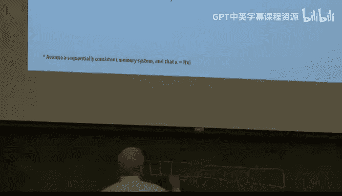
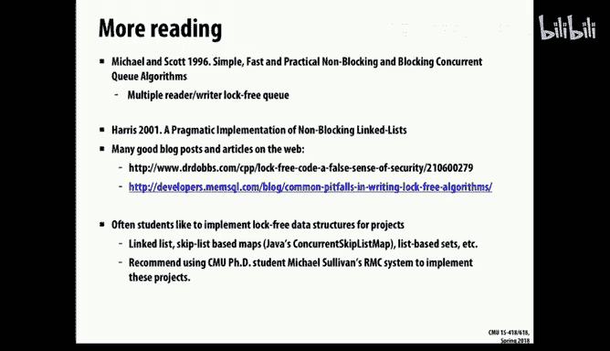

# CMU《并行计算机架构与编程｜CMU 15-418 Parallel Computer Architecture and Programming sp18》 - P24：Lecture 24 - 3-21-18 - Carnegie Mellon University.zh_en - GPT中英字幕课程资源 - BV18b421J7cA

Test test。Test test。Okay， so on to interesting stuff。 This is getting into parts of the course where。

The material is。Pretty tricky。 I'd say this， you'll look at this code here today and vaguely think you understand it。

 But then you want to go back and double check it and look。嗯。But。The this is a very current topic。

 though， of how do you implement。嗯。Shared data structures without the sort of heavy handed approach of slapping a big。

 fat lock around it。And so that raises the issue， the sort of extreme one version is to put much finer grain lock。

 So you're locking individual components of the data structure。And then the final thing is。

 can we just get rid of locks altogether and find other mechanisms to ensure that。

will have proper sharing of。And updating of shared data structures。

 So that's known as lock free programming。 And there's quite a body of work in that area。And these。

 by the way， end up being。F good topics to look at as you're starting to think about projects for this course to do a sort of careful。

Implementation and evaluation of some of these various data structures is actually a very interesting。

嗯。Clas of of applications， things to look at as part of a project。So。

Especially if you look at the sort of a P thread Muex is a very heavy duty piece of code that it requires。

Interaction with the operating system， potentially the job being suspended and put on a queue。

And then reawwoken。 So that can take tens of thousands of clock cycles to do。

And so you don't want to do that on some sort of application level data structure on a concurrent program。

 Sometimes the spin lock is the appropriate thing。 If you just want to grab something long enough to make a few updates without somebody else coming in and messing things up。

 A spin lock is a very effective way to do that。So， but in either case。

 even that's if you put a lock around a whole data structure， like， say。

 imagine a hash map or a hash table of some sort。Then， you're serializing all。

All accesses to that table。 And that could make is not a suitable data structure for parallel programming。

So， a lot of。A finer grainined version of this is to make use of atomic operations that we've seen examples of。

 and this is a list that's available in Kuta。 There's a similar list that's available directly from GCC if you look it up。

 and one of the the and there are various versions of atomically adding atomically incrementing or performing some simple arithmetic operation in an atomic fashion。

And then there's another class called compare and swap。 And those turn out to be the sort of。

Core basis of what's actually implemented by the hardware。So let's look at atomic swap。

Or it's called compare and swap。 So the idea of this is。That theres。

 it's a three argument operation where the first is an address。

The second is the value that you think is at that address。

 and the third is the value you want to store that address。And， so， and this is all done atomically。

 Mean this operation takes place as if each of these steps was done all grouped together。 So first。

 you check out what's the value at the address currently。 We'll call that old。

And if it matches the expected value， the comparison value。

 then we'll go ahead and make an update and we'll return the old value as a result。嗯。And so。

 assuming that。You prepare in advance， by design， you make sure that the vow is different from the value the expected value。

 otherwise it's kind of a useless operation。And so if when old comes back。

 if it doesn't match what you are expecting， what you past is compare。

 then you know that this operation failed。That you were not successful in。In。In。

Flipping the the value， storing your desired value Val at this address。

So as an example of a use of this， let's try and implement the。

 the minimum operation or think of min as stand in for an atomic ad。

And this sort of shows the standard pattern you'll see of using compared swap that you set up a loop。

That basically keeps trying over and over again to。

 to assign what it thinks should be a minimum value to this。A global variable。

So the global variable is stored at ADDR at the address。And。

You have a local value X that your is potentially the new minimum。

And so what you do is you grab the value of the address and compute what should be the new minimum。

As。The old value minimum X。 And I suppose。呃。At this point。It would be smart to。Not do anything。

 if the new value。Is not smaller than the old value， right， otherwise。嗯。You've got a problem here。

See what I'm saying。 If you value X is， is not smaller than。What's already the minimum。

 then this is going to be an infinite loop。Right， because you'll just be swapping old and old。

 and you'll keep seeing that it's old。 So that's a good bit of code to fix up。

That's why increment looks a little bit more promising here。So anyways。

 let's assume that new is is truly a new minimum value。 It's x。

And so what you try and do is swap that with。嗯。With the old value。 And if that。嗯。And if that。嗯。

Gives you something other than the old value。Then， you know that the。呃。That， that you。

 you weren't able to insert your desired value into this address。And so then you retry。

 And you do this。 And the assumption is that after a few tries， presumably this will go on forever。

 that you'll get the the value correct。 People see how that works。LikeI said， there's a。嗯。

It'd be smart， too。Fix this code so that it didn't loop forever。It's generally a good policy。

And you can， it's sort of an exercise。 for example。

 it's a fairly straightforward exercise to implement。

 atomic increment would look like this and actually make more sense because you don't have this potential infinite loop。

Or even a straightforward lock， basically you just assume that there's a flag at this address and you try to grab the you assume that it's one if this lock is available and zero if it's not。

 and so you keep trying to swap one into that or0 into it and see if the old value is equal to1。

 So it's a pretty straightforward exercise to implement a lock with this primitive 2。And C plus plus。

 actually， the C 11 version。Has an interesting。Ability to a template type that can make anything atomic。

And in particular， if you use this for something like an int or any of the primitive data types。The。

 the actual implementation will make use of the native。

Instructions that are designed to support the atomic operation。 So if you say。

Increment an atomic eye。 It will usually use a fetch and ad type of operation of some sort to do it。

So it if it's a more complex obviously this you can do this for any data type in C++ pretty much and if it's a big complicated data structure。

 itll just put a big lock around it， but it will try when possible or especially with some of their standard data types it will try to be clever in the data structures it uses So this is a feature a C++ that is a big advantage over programming in C because otherwise you have to and C you have to basically build your own or make calls to the special library。

And you can even do a a test for asking， is this particular。嗯。

Data type implemented using a lock free data structure。 Lock free， meaning something other than a。

You know， big fat lock around the whole thing。So how is this actually implemented。嗯。

How are something like an atomic， you know， low level atomic operation like Comp and swap implemented。

 Well， in X 86， as I showed you last time， you can put a prefix byte in front at the beginning of an of some subset of instructions。

 not arbitrary ones that just says this instruction has to be implemented atically。

 And so the there's ones for doing。Fetch and ad for compare and swap， Theres。

Instructions that will do exactly that。 And if you put this prefix by that says， do this locked。

 then it will do it in a lock in an atomic way。And what it does is it plays tricks with cash protocol。

 So imagine that this is a bus based cash protocol。And。And let's say that the what。

 what it will guarantee is that。That this value will not get evicted from the cache of the executing instruction。

Intel the， the operation， the instruction is completed。 So there's no chance of it doing a read。

And then， a。And then get that value invalidated before it can do a right。 It locks it together。

And that so it's pretty straightforward on a bus based caching system to do something like that because there's sort of this global understanding。

 and there's this sort of master of the bus that can can control exert some control over what operations may take place It's a lot more complex to implement in a directory based caching scheme where there's sort of no centralized resource that can keep track of these things。

 And so typically， there's some part of the protocol that just will make the。Willll。

 well keep a lock on it with respect to the， the home directory for that memory location and just hold that lock on there until it gets released by the executing processor。

And anyone else that attempts to do an invalidate will get a negative acknowledgement back saying。

 nope， I won't let you do this right now until it's complete。

You can imagine some tricky bugs are possible by anything that can lock a bus。 and in fact。

 there was a bug in one of the implementations of X 86。嗯。On exactly the， this locking of the。

Lock prefix that would let you。Have a locked prefix。

 If you put a locked prefix in front of an instruction that wasn't supposed to be locked。

It would lock the bus and then realize it didn't know what the heckcker was doing because it didn't know how to do this next instruction atomically。

 It would just hold that lock， and it would freeze it up。 So this was a known。

A bug for a while in in X 86 land that。Could cause a a malicious attacker to basically make a system hang up。

And。It wasn't one that you'd do with any normal， no compiler would generate this code。

 but anyone who could insert machine code into the system， which， as you know， is。

Many ways to do that was able to create this。Possiibility。

 so that's sort of typical of these challenges of dealing with all these concurrency issues， is that。

You have to think， not just what are the normal behavior。

 but what are the sort of pathological behaviors that in particular， an attacker might choose to do。

So what we'll just， But the point is that。This is done in hardware， not by some。

wholehole special design of the processor。 But by sort of making appropriate extensions of the basic cash protocol to ensure that you can do things atically。

And， but in general， so compare and swap and， and。Are suitable for dealing with sort of single word。

Ling a way to sort of make sure that some operation is performed on one word of data in an atomic manner。

 But often in in the real world， we have bigger data structures。 And you remember in 2，13，5。

13 that you had to write a proxy cache。And the simplest version was just to smack a big fat muttex around it。

 or maybe a reader writer lock around it that would do it。

 And other people tried to be trickier about it and basically do individual locking of the pages。

 the entries in that cache。 if it's a linked list。 So that's what we'd call a finer grained implementation。

And so let's a look at some of these possibilities。So as an example。

 imagine code a standard linkedist code that you have。On the left。

 you want to be able to insert into a linked list。 assume that this is an。An ordered west。And so。

The idea of that is that you'll walk along the。The w， and you。

Hit a place that's greater than the value you're trying to insert。And you will。

You've already created a new node。Code N。And you'll insert that into the west so that the。

That what's called cur will become the。The successor of nodede N。

And what was the predecessor of cur or prev will become point to n。

 So it will splice n into the width between Pv and cur in this particular notation。And similarly。

 the this is all a sequential code。 And so deleting from a linked twist。It's the same thing。

 You assume it's an ordered listist。 So you'll keep walking along。

And we'll just do a test for equality。 We will't skip the case。 So we'll just walk this list。

Actually， all the way to its end。 And if we see a matching value。

 we will spicee it out of there and free the， the list element。Okay。

 standard sort of order doing to its code。This could be done。

 You could save a little time by quitting if you reach a point where your current value is。

Is question。The value you're trying to insert。I， it's not in the list。So， the problems happened。嗯。

When you try to do this concurrently。And。So let， let's look at just。

 let's just think about nobody's trying to delete right now。

 But what if there are multiple threads that are trying to do the insertion。

And the problem is that these， these parts of the code where you're splicing it in is not done atomically。

 And it's also not linked to the， the search process of determining where to go。

 So it's entirely possible in this code。 Imagine that。One thread is trying to insert element 6。

 and the other is trying to insert element 7。So thread one gets there first。And it。

Starts to splice this in。But， meantime。Thread 2。Reaches the same point and starts to do the splicing。

 And basically， there's a race between these two over which of them actually gets to sp its element into the list。

 And so in this example， it shows that one got inserted and the other didn't。

 Imagine you can also come up with examples where。有。

I I think it was really the only two outcomes because the only shared part of this， it's being。呃。

Updated is the。The previous pointer。 So basically， there's a race here。

Of which of the two threads gets to update Pv。And you can come up with also similar problems with the deletion that。

This one's reached the point where it's ready to delete。 And meanwhile。

 there's something being inserted。 or there's two deletions taking place of adjacent element。

 So there's various problems you can get into here。

So the sort of quick and easy thing is to just throw a lock around the whole thing that says。

 as long as。Eith， either side is walking this list。 It will have a lock on that whole list。

And it won't release it until it's completed whatever operation it does。

And as this code suggests one thing that's。You have to make really sure of， is that you。

 if there's multiple return points in a code that you don't have some unlocking and others not。

So that's relatively easy type of programming。嗯。But the， the bad thing。

 as we mentioned is it means that this is now a totally serial data structure。

So let's look at some various ways we can improve on this。 And there's quite a few。嗯。呃。

And so let's assume that we've got our serial code from before and that we've built up a list that looks like this。

Then the first idea we're going to come up with is a very fine grain technique that's known as hand over hand walkinging。

 which here， here's the illustration of it。 Basically， what it means is that either the in。

 the deleteder is going， in general， keep。A lock， It will always have one lock held。

 and it will move a second lock before it releases any previous lock。So what will happen is。

I'll guarantee I hold the next a lock。Before I， and I'll grab the next one。

 before I give up that one。 So the analogy is climbing a rope， which I've never been able to do this。

 But， you know， hand over hand where you just keep grabbing up higher and， and pulling yourself up。

So that you're never， because if you ever let go of the rope， you're gonna to fall to the ground。

 right， So that's not a good thing。 So it's the same general idea that you guarantee that。

Either an inserter or a delete always has one hand on one lock held。

 And that lock has the purpose of。Of not only guaranteeing that it has unlimited access to this element。

 but also， it， it sort of serializes the order in which two different operations can occur since they always have to start from one end of the list and go down in the same order。

 It doesn't work for W linked twist。 So everyone's sort of marching down the same order。

 And so it's not possible for one thread to overtake another and start getting confused。

 So there's a sort of。A serialialization process takes place as they， they proceed down this。

It also makes sure that if I'm going to make any changes to this data structure。

 then not only am I going to block any succeeding ones from。

Sort of overtaking me or messing up my stuff。 But also， I'm going to make sure that。

Once I've got this lock， that any operation that was sort of started before me。

Has has gotten through this part of the list so that it sort of， again， has a serialization effect。嗯。

And， so， for example， if， if thread 0 wanted to delete 11。It would make sure it has a lock on 11。

 So somebody else wasn't trying to make use to this element。And it would。And meanwhile。

 another thread is coming through that that wants to delete 10。

But it won't be able to move forward because I'm holding this lock， the orange version。

And so it will basically sit there。 And it's trying to get this lock。

 but it won't succeed because it's thread once trying to acquire this lock as part of this hand over hand。

But threadread 0 hasn't released it yet。So now， thread 0 can safely delete this element。

 which requires setting the， the next pointer in this element。啊。And then proceed it。 And so again。

 it's sort of this double thing that any successor， any previous。呃。Mod， you know。

Operation that was going to occur has already gotten past element 11。

Before it's allowed to do the deletion， I wouldn't have the thread0 would not have this lock if there is somebody else making use of this information。

And so， the。嗯。So sort of it keeps this this strategy。

 it's kind of an interesting strategy that it guarantees this serialization of these global operations。

 It really only works for data structures where there's sort of some unique starting point that can keep and create this serialized effect。

And so here's some code for that kind of sort of does it。 It doesn't implement some。

 as this comment this， says here， there's some issues about inserting the。

 the very first element into the list that aren't handled properly by this code。

One other interesting， and it sort of starts to do that。 One thing。

 you'll see that there's a lock associated with the w itself。

And there's also a lock for every element。 So that's why we call it a fine grain blocking。And。The。

 the。You might ask， well， why do you need a lock for the whole data structure， Well。

 that's sort of to control the initial access to get it。

 Everyone serialized at the beginning that they will sort of enter the order in which things will move down the stream will depend on the order in which。

They acquire this top level lock。And you'll see that lock is only held。嗯。

Until I can acquire the lock for the first element of the list。 That's this idea of hand over hand。

 I'll grab the whole data structure。Ill， I'll grab the first element of this list that I'll release the whole data structure。

 Somebody else can come in behind me， but they can't pass by me。And then this loop here。

Which is the walking loop， there's sort of a loop invariant that says at the beginning of the loop。

 it's guaranteed to be holding two locks of the previous and the current one。And you'll see that。

As it goes about this loopop。That what it's doing is it's releasing。The one。

And then acquiring the next。 So therell be a moment in time when it only has one lock。

But there'll never be a moment in time when it has no ops。 And that's the main idea of it。

And it's the same general idea with deletion that it keeps this。

 this technique that it's always holding on to one lock and potentially two locks。

So this actually idea is pretty interesting。 I last year。

 I got really interested in this and implemented a bunch of stuff。It turned out to be kind of slow。

Or at least if you use it， like a P thread new text with it is definitely a bad idea because it's just way too heavy way to data structure。

 I mean， if you think about normally， linked list code just kind of rip through it。

And a P thread lock is thousands of clock cycles to do。

 but it would work reasonably well with a spin lock。

 where the amount of work that's being done within this lock， you know。

You're assuming all the threads are sort of actively doing their insertions and deletions。

 They're not just。Drabbing this lock going off for a coffee break and then coming back half an hour later。

 So if you assume that there's sort of everyone sort of actively participating in this updating this data structure。

 then something like a spin lock actually makes this a possible idea。

But this is an example of a typical project for this course。呃。Where you know。

 it sort of facing on looking at implementation， but implementing these and comparing them in in various forms。

Makes sense to people。Have you seen this before， yes。てねおめ。一ep。Well， it's only glist。

 It's not the best data structure for things。 But you could imagine， for example。

 a hash table implemented as a bucket。Where each bucket is a linked twist。

 pretty standard way to implement a hash table。 So you sort of spread out the。The contention。By。

 by the first level， hash that then makes it so that they're not。 And then these lists are typically。

10，20 elements long at most。 So you sort of decialize it that way。

 And that's a perfectly reasonable thing to do。One interesting。So。

So that that's the general idea of fine grain locking And hand over hand is just one technique in it。

 the general idea of fine grain locking is just that you have sort of a lock per element of some data structure and you have multiple ones。

 and you try to support the idea of multiple excesses going on at once。One thing that's tricky。

Compared to a big fat mutex around the whole thing is that there's a lot of places you can make bugs。

 and subtle things like that。嗯。And then the， as I mentioned， if you。

 if this is implemented using a sort of standard lock， the。

 the overhead cost is just way too high for it to be practical。

And there's a little bit extra storage costs， but。These locks。

 spin locks are are typically just an inch or something like that。 So it's not that big a deal。

But it's still considered a， you know， it's still a locking based solution。And there's an extension。

 actually， I'll put code， make it available on the website。 Last year。

 I did a full implementation of a binary search tree using。Handover hand blocking。 It was extremely。

Elegant。But not simple。Especially if you know about deletion from a binary search tree to implement。

 that's already a little bit of a tricky business and then to do hand over hand locking on it even more。

But it was working code。 and it， it did everything it's supposed to do。

 And so a binary search tree or any kind of imagine。A better thing。

 A red black tree or a sp tree or something like that that。Creates， a balanced tree data structure。

 Again， you consider of the root becomes。A theization point。

But then once things sort of get past the route， they tend to spread out and have more concurrency。

Okay， but can we just ditch this whole lock business altogether？ And there's two versions of that。

 One is。Sort of what we saw with the compare swap that theres some primitive that assumes gives you an atomic capability of some very low level activity。

 And then you build some kind of loop around that that keeps trying until it succeeds。

 So that's one version of lock free programming。The most extreme version is。

You just write your code in this magic way that you don't have to worry about race conditions。

And so let's look at a few of those。 But partly， let's think about motivation for this。Like I said。

 that。The version like fine grain locking works fine or spin locks work okay。 if。

 if everyone sort of actively participating， where you can get into trouble is if there's some reason why there'll be a long lived whole of a lock that's。

In for one reason or another， potentially even in code where what's being done within the critical section is fairly small。

 but it just happens this process gets paged out or maybe it crashes or something like that。

 and then if it crashes， then you can be in big trouble or if it gets paged out。

 it can mean that the whole access hangs up， waiting for this process to come back again。

And getting redone。So that's we'll call these walk based systems， things that。

Potentially can be delayed for a long time because of something happening by the operating system。

So what we'll call a lock free algorithm is one that that can't happen for that there's。at least。

A that that all the。All the threads are， at least some thread is always able to make progress。

And that's a little bit of a loose guarantee， because we saw with this compare swap when we use it in the loop。

We， we just keep plugging away until we succeed。 And so you could imagine a sort of。

Really serious contention issue where， where everybody loses over and over again。

 So to claim that something is。Really fully， absolutely against all malicious code and。

 and bad system design。Guarants making progress is is too strong a term。

But with very high probability。Will assume that everyone can move on and it won't be beholden to。

Some operating system issues about context switching。

So let's look at one really simple version of this， which I claim that this code will work。

I need to fix this slide that。As long as there's only a single reader and a single writer。

 they're not the same。But there is only one thread that's inserting and one thread that's deting。

And this code implements。A sort of standard circular list。嗯。

Of， of fixed size N。And what that means is that you think of it as the data wraps around from beginning to end。

And so at any time， I'll have。Let me make sure I get my notation correct。I'll have a tail。

Which is where I'm inserting elements into。And it had。

So the tail denotes where the next element should be inserted， and the head denotes the。

The oldest value in the list。 This is a fiIO Q。And so， that means it。These elements。Are valid。

And so basically， insertion means。嗯。Writing to hear。And then moving the tail over by one。

And pop removing or popping means reading this value out and then moving the head by one。

 In in either case， you do it all mod in so that it wraps around。

The one thing that you'll notice with this code is there's always a question of。

How do you detect a full versus an empty queue in this particular code。

 What it does is it sort of gives up one space。 It says that I'll never let the。The tail go。

Further than the head。And I will。 so if I reach this position here。

 even though this element isn't used because it tail points to where the next value should be inserted。

 it will declare that this Q is full。 So it really only has capacity for n -1 element。Otherwise。

 you can come up with various schemes， but then basically you need another flag that tells you whether it's empty or full because otherwise。

What is the meaning of having the head and the tail pointer equal？

You've probably seen this code before。So the interesting thing about this is， I claim that。

If there's only one reader and one writer to this， one pusher and one paupper。

 then I don't need any other synchronization here。People believe that。

Making reasonable assumptions about memory order， memory consistency and also that when I go to update a word。

 I don't update like half of it and then another half so that I can have an inconsistent word that's worth of value。

But it and it doesn't even require that this mod operation be atomic or， you know。

 some special instruction。 It just assumes that when I go to increment it。

 when I go to assign a new value to tail。Then， that。Value will be updated。

Without the ability to go between。 So any reader of the tail will see either the old value or the new value。

 It won't see some composite or some magic value in between。 So I'll call that。An atomic update。

 but it's not an atomic operation。 It doesn't have to be able to read and write atically。

 It just has to be able to write。So it makes sense to people。So why is that true well。啊。

Which if so I only have one pushing thread and one popping thread。

 Which thread is the only one that can modify the value of the tail。Push， right。And， and similarly。

 only the popper is able to。Modify the head。 So there's no sort of right， right conflict here。And。

And similarly， if I assume that any time either the sort of peaks at the。

 So think of it as that the tail is owned by the。Pusher。And the head is owned by the paupper。

But you'll see that each side has to be able to peek at the other side's value to determine whether the queue is full or empty。

But if I assume that。It's done， you know。Each time I do it， if there's some change going on。

 I'll see either see the。Most recent， you know， a previous value or a new value。

 you'll see that it never might sort of declare a queue empty when it's just been inserted or a queue full when it's。

Just had one removed。 you know there's a sort of race condition there， but that's still serializable。

 right， It's still valid to let it go either way because there's some serially consistent ordering of that。

So the point is most of the， and you've seen that before。

 that most of the race conditions that cause problems are something that involve。

Like a read and a write or two writes or two reads that can become inconsistent with each other。

 And so this， because this has a single writer。And a single of each the values。And every time I read。

 I only have to。Make sure that it's sort of a valid value， then it will work。So， and that's often。

 by the way， when you can make assumptions about limiting， especially to one。

So who makes updates to a data structure。Then you can do things without locks。Now。

 here's a really interesting one that comes from a publication that is sort of a hacker。

 a nerd's publication called Dr。 Dobbbs。Journal that I believe， went out of business， unfortunately。

It usedd to be like a real printed magazine that came in the mail。And the idea of this is， it's a。

It's the same idea of a single reader and writer， but it doesn't have the limit of how big it can grow。

啊。AndBecause it uses a linked twist。This is a really interesting idea that you'll see that the Q has three pointers。

 the standard head and tail。本来。It has a third one called the reclaim。 And the idea is that。呃。The。

 the pop。Even though it's removing things from the list will never actually delete any node data structure。

And only the pusher is allowed to both create with new。And delete。

With delete any nodes in this linked twist。So let's give a little set of examples for it。

So in general， what it is is the head is sort of a dummy element。 It doesn't actually ever get。

No values are put in it。And so it starts off as an empty listist with a single node that all three pointers point to。

And when it pushes a couple values onto this and these are， this isn't necessarily an ordered list。

 There even though this example shows them ordered。 It's， it's pushing onto the tail。So it's a queue。

And so， if it pushes。A value。 Then it will just keep adding it to the tail like we've seen before。

And the pop， all it does is it sort of marches the head。

D one position on the list without deleting the previous element。So， this reclaim is。

Kind of hangs on to the。嗯。It gives it ability to sort of keep track of what still。

In this linked west， even if it's not a valid value。And so if I pop now the first time popping 3。

And I should have put this in print。

Let me just。

I'm， I'm putting parentheses around these values。To show that。hoops。To show that they're still there。

 nobody， no overrode them， but they're no longer really part of the data。 They're。

 they're just sort of residual values。 So think of the parenthees。

 meaning things that have been removed from the west， but they're physically still。

That that that value is still sitting in the， the linked twist element because you'll see that if I just keep popping。

嗯。Then all I'll do is， is just keep marching this head pointer along。The list。And at this point。

 actually， the list is empty because remember， the head。Points to the。

the predecessor of the first valid element。But now， the pop。Is responsible。 Im， I'm sorry。

And if I tried to pop at this point， I'd say， sorry， the queue is empty。So at this point。

 I have an empty queue， but it has some nodes。But then the push code， when it comes along。

 it'll march down this wrist。But， it has。啊。The ability to， to。Delete elements as it goes。

 So it will be the one that actually flushes out these elements， and it will stop。Before。嗯。When。

 when it hits what was the old end of the list and we'll insert a value in there。

 And so the code here， it shows all that。 It's fairly straightforward code。And it only works。 again。

 It's a single me single writer solution。But the idea is， again， we have。

Pusher is the only one that can either create or delete any no data structures。

 So we don't have a conflict there。And。The pop。Is only able to change the value of the he head pointers。

 It's not allowed to change any of the internal pointers in the data structure。Excent。

So it's a cute idea。 of course， it。Again， if you tried to do this for multiple。

Either multiple writers or multiple readers that would get into trouble。Okay。

 so let's try to generalize this to something that can work for any number of threads。

 And we'll do this again。 It's a stack。What we were looking at before were P0 Qs。

 we'll just stick with a stack now， but it's the same general idea。And。

 but the scheme we' go for is more that。The the， the previous two examples had nothing that looked special。

 It just was very ordinary garden variety code， no locks， no compare atomic operations or anything。

 just standard stuff。Now， let's try more of this style。That I describe where there's basic loop。

Where you keep retrying some operation until you succeed。

And we'll try try this for both the pushing and the popping。 So it's the same idea before。Well。

 not quite the same idea。 It's a link to a data structure。Where the。

The designated stack is simply a pointer to the。The top element of it。

So very standard linked twist based stack where you push things on by inserting it the beginning of the list and you remove things again from the beginning of the list。

And so the idea of it is what we'll try to do is， and this code has a couple bugs in it。

 So don't be surprised if we have to fix it up。What will， what we'll do is we'll assume that the。

Code using this is the one that actually creates。The node the linked twist elements。

 which is not a very smart kind of programming。But that's the way it will work in this example。

So assume that when I push， I've actually already allocated a node element。 And my。

 the job is just to insert that into the beginning of the list。

And so the way it will do it is it will。Record what it。

 the push will record what it thinks is the current beginning of the list。And。Try to。

 and make that be the， the next value of， of here。 Let me draw this out。So， in other words。

I'll grab a copy of this。Which is a pointer here， and I'll create this new node N。

And make it point there。And then I've got a pointer to this。And what I'm。

 I'm going to do is basically compare and swap here。What I want to do is。Jam this value in here。

But make sure in doing that。That this pointer is the correct pointer to the。

 the old head of the west。And if something happened in between， then， then I'll。

 Ill give up and retry that until it takes place。So that's a pretty typical scenario on using a compare swap type of operations to do this。

 that I have something that。啊。I'mBaically trying to update a pointer。好。Into a data structure。

 and I'll do it in a way that makes sure that I'll know whether I。I succeeded。

And that I can depend on that old version of the pointer。And you see， it has to be done by that loop。

 because if otherwise， I had tried to just do the standard insertion。

If I tried to update this and then after that。嗯。Se this in。Then in between。

 I could have gotten some other insertion take place。喂。So。And it's the same idea with popping。Right。

 that what I want to do is。嗯。Sim we have something like this。And。And so now I'll。

I'll get a pointer to here， I'll call that new top。And what I want to do。Is jam that into here。

 into the stack， the head of the waist。But in a way that makes sure that。

That I haven't somehow either inserted a new element。Or do we did this one from the data structure？

Good， seems like it should work， doesn't it。Well。probablyably guessed， no， it doesn't。

So there's this really interesting problem that's just very tersely called the A B， A problem。

 And people who do this stuff when you say， oh， I've got this A B， A problem。

 They'll know exactly what you mean。So let's see what A VA is。And here we have A and B。

 So you can imagine it somehow involves these two elements。So let's look at。

 assume there's two threads， and they're both。Trying to operate on this stack。 And so thread 0。

Initiates this。Activity， where it。It has it， and it's trying to delete。pop。So， it。

It thinks that the old top is A and that the new top is B。And。And。

 and it just wants to make sure after it does the compare and swap that it was correct。Well。

 meanwhile， thread 1 comes along。And does actually this pop and successfully returns and actually removes an element from the list。

But now wily old thread1 comes along and maybe it inserts something。 But here's the problem。

 It decides to recycle that no old node a， remember。

 nodes are just blocks of storage with an address。 And so back it comes and puts at the front of the list。

 a recycled node。And then thread 0 finally finishes its swap。 and it says， oh， great。

 A is it still at the head of the west。 I must be O。Right， so。

 so this involved a confluence of two bad things。 One was。啊。Fred。0 was just relying on the。

 the presence of a at the beginning as an indicator of whether it was successful in its atomic swap。

And the the other bad thing is that this node got recycled。

 And you could imagine that happening because。Either thread1 had a pool of nodes that it was reusing。

 or it called free。And new。And you， like， imagine a stack based allocator that you free something and you knew it and it says。

 oh， great。 I've got this note。 It's just fresh off the pile。 Why don't you go ahead and reuse it so。

You can imagine that。scenarios where the probability of this occurring might seem extremely remote。

 but it happens。 And so it's， a real problem。Make sense。So， let's look at various ways we can try to。

Do it。 and the basic， there's two basic approaches。1 is2。keep track of。

How much stuff has gone on in the meantime。And say， hey， look。呃。In particular。

 keep an atomic counter of pops。Associated with this list， and say。I have to make sure。

 not only that。The value， the head of the list is what I was expecting。

 but that somebody didn't pop in between。 So that's one approach。And so that's what this idea has。

 is imagine we'll have associated with the stack。A嗯。A counter。 And we will autoically。Combined。

The incrementing of this counter with the。Completion of this compare swap。

 So we'll call it a double compare swap。 Imagine you could。Basically， give six arguments。

 You could give。Two addresses。2 expected values and two new values。 And it would do these。In unison。

 it would only do the changes。 It would change both values， but only if they。嗯。

Match both addresses match these expected values。And so I。

 I'll make sure you can see why those have to be linked together。

 I have to make sure that this counter only counts。啊。呃。

It counts if and only if the pop was successful。Remember， we're used to saying。

 I'll just slap a lock around this or something， but we're not allowing ourselves that luxury。

 So you have to be kind of tricky on this stuff。So that， that's one way of doing it。And you say， oh。

 great。 So now you're adding a whole new instruction， a double compare and swap。You think。

Intel is going to start creating six argument instructions for you just because you happen to want to do this。

Not likely。But。You can do it by using a wider word size and thinking of the compare and swap as a two word compare swap instead of a two separate you know a double word compare swap instead of two separate word compare swaps linked together。

 So as long as you put the pop counter，And this pointer together， which is， in fact。

 the way this would be allocated as a data structure。 If you thought of the whole stack。

As long as you do both together， then basically the standard compare and swap， but using 16 B。

Compare and swap if this is a 64 B machine。Well get you this exact effect。 You。

 you sort of stick values in the upper and lower8 by each and then do this compare and swap。

 So you can actually do this。Using the standard available operations。So in particular。

 X 86 supports a comp exchange of 16 by。Or if you're just using 32 bit pointers。

 you can do it with an8 byte。And that's exactly why they do that to give you the ability to do atomic swap。

 not just of a single value， but of of multiple values together。Okay。But we're not out of the woods。

There was another problem。嗯。That concerns this。嗯。Reference here。That嗯。I。I呃。

I got this new arrow new top by referencing the current top element。But imagine if， in the meantime。

Somebody else is deing。That element and has managed to actually do the deletion and recycle the value and。

Set it to something else。嗯嗯。Then。呃。Then this value might not be valid。So， and there's not。 remember。

 there's no。There's no locks in here。 So I can't guarantee that some element。Right， some previous。他。

Took place。 It returned top。And between the time when。I。Yeah， so I read I read the top here。

But in between here。If somebody else comes along。And is able to pop that out of there。And return it。

 and then modify it。For one reason or another。Then theres， this is not necessarily valid。

So that's a little more problematic。Of how do you avoid that？And。

So one way to do it is a technique known as hazard pointers。

 And this code Ro only gives a vague sketch of what a hazard pointer is。

 But think of a hazard pointer as a。An array of pointers， one per thread。

What it does is it allows each thread to have。A indicator of this is a node that I am。

I really don't want you to， to mess up。呃。And。So you're not allowed to either delete it or modify it。

You're allowed to read from it。 And so think of it as this is a shared。

Collction of pointers that each one will only be written to by a unique thread。

But it will potentially be read by others。And so the the basic idea then is to say。

 before I start looking at the top。I'll mark this as one that。I'm concerned about。And I will。

And now let's assumed that。Once this marker is in place， it will mean that no other thread。

 even one that successfully removes that element from the list。Here。Is able to。

To either modify it or delete it。You know， free it。And so now I'm， if you believe that， then。

This is able to safely read this value and do the compare swap and so forth。

But you'll notice in this code。 and you'll see there's various things you have to clean up in this code。

 One is， I've removed this top。And， but I've still got my hazard pointer set to it。

And that means that。I still have this reclaimed and so presumably once。This。

Particular threat is done with。With this element， then it should clear the the hazard。

But in some ways， it doesn't really matter because it it both， you know， it holds a hazard pointer。

 but it also holds the note。 So that's not really the issue。 The the issue is to convince yourself。

 and actually， this is pretty tricky。To convince yourself that there's not some other race condition of of setting this hazard flag。

 right， What guarantees that。Some other deleting thread doesn't manage to kind of。嗯。Get through here。

And。MoModify top before this thread has a chance to。啊。To， to try and grab it。 And the answer is。

 again， assume that。By the time we get through here， we've really removed that element from the。

They are。we've successfully modified the stack pointer。 So it's actually very subtle。

And now what we have to do is set up some other mechanism for reclaiming storage。

 because it means that even if I pop an element， I'm not I a thread。

 I'm not allowed to just go ahead and delete that element just because I， I don't want it anymore。

 There might be some other thread that has it marked as with its hazard pointer。And it wants to。嗯。

Hold on to that。 But， and you'll see that this loop goes on that this hazard pointer gets。

Did even see a bug in this code。I think I see about。Where should I set the hazard to know。Well。

 I guess it's okay because it will overrite each time it goes around the sop multiple times。

 it'll just keep overriding the hazard pointer， right。So。嗯嗯。Oh oh， I'm sorry。 This is the main。

Each time lot around the loop， it will。嗯。Set the hazard pointer to noll。And then grab it again。

 You could actually delete this。Because the thing will keep overriding the hazard pointer and what effectively we release it for。

 for use， yes。

Giving up。If top is null， that means it's an empty stack。At least it was an empty stick， so。We。

 we're assuming that the code should return。Returning null is its way of saying you tried to pop from an empty stack。

As opposed to， I think what you're imagining is more like a job queue where you want a block。

Until there is a job， right？で他。One of the。know。Let's see。 Let's go through that。 So， first of all。

 you'll notice that if。Top is null。 It just has a hazard pointer to null。 So it's not a big deal。

 right。Right。So， so in this exit case， it's。

It's just returning null， meaning the， the the stack is empty。嗯。But at this point。

 the hazard is null。 And so that's not going to affect anyone else。Have any impact on anyone else。

Is that what you mean。然。は好。Yeah。嗯哼。好。Yes。我本就是。他。Yeah， well， then that one failed。

 It only got through this loop because it failed the compare and swap。Right， so the one， basically。

In your scenario， both of them will grab。 They'll both set their hazard pointers to the same element。

But only ones going to win the compare swap。And the winner then will still have its hazard pointer set。

 but it also has this element。 So it sort of owns that element。And the other one will fail。

 And so it will set。The hazard pointer to null。And it will retry。O。These are really。

 when you look at this stuff。 this is exactly the way you have to work it。

 You have to think of you know， multiple scenarios going on and what if one's fast and one's slow。

 What if two come in at the same time。 So that kind of reasoning is exactly what you do。

 But you have to work through it。 And it's not a simple thing。

And didn't show the code because there has to be something else that's dealing with these hazard marked elements。

 It means that。If。Something gets returned。And it matches the hazard pointer for some other thread。

So first of all， I have to globally look through all the threads before I can delete it anything and see if any of them are marked as a hazard。

 and if it is， then I have to kind of defer that deletion。

 but I don't want to just drop it on the floor and turn this into an orphan data structure I want to somehow keep a list of things that Im I'm going to delete someday when I'm allowed to。

So it's not not， the full details of this implementation are not simple。ok。嗯。

It turns out that if you only are inserting into a blank twist。And not deleting。Let's see。

 Is this inserting。This is a case where it's a particular insertion where I'm told that I want to insert it into a particular position in the west。

嗯。If， if you're only inserting and not deleting。Then you can sometimes get away with。

 with no particular locks。嗯。Why would this work， Didn't we find that this was exactly the kind of problem before。

We saw before problems with double insertion， competing with each other。Oh， I see。 I'm sorry。Yeah。

 there is something special。 You， You do the same trick of a comparing swap。

To make sure that in the meantime， the previous element didn't get updated by some other insertion。

But the good news of this is。Again， there's this sort of comparing this loop of try and retry until you succeed。

But， that's still a much light weight。啊。Activity， then。Then what any kind of luck would be。

But deletion makes life much harder。 So insertion you can kind of do to support both insertion and deletion。

Is trickier。Remember， in this previous example， the stack。

 we're always inserting and deleting at the same point in the list。

 And so we could kind of control that with hazard pointers or various other things。

It becomes more tricky when you have arbitrary points in this list that you might want to be inserting an element。

But there are， you， you can find a fair amount of literature on， on all these。ideasdeas。

So this is one on linked twist， and there's。Another one that includes skipwi。

 which if you don't know， it's a ordered wist technique。

 but it has skips in it that let it jump ahead and create something like a tree in terms of performance of a logarithmic access to。

And here are some experimental results。By somebody where they did measurements， and they compared。

 in some case， purely lock free。Some lock free compared to fine grain。

 fine grain being like we saw before with typically hand over hand locking or a pur。

A per element type of lock。And looking at different sort of basic data structures， a PO Q。

 a double ended queue where you can insert and delete on either end。

Or a linked twist that allows operations。Inerions and deletions。Into the middle of the west。

 as well as at one end or the other。 And you see that you actually get very different。

 And so this is all high means good or high means bad and low means good。And you see。

 you get very curious effects where， under low contention。Then it's wasteful because this was a。

Findine grain blocking。Excuse me。😔，A fine grain locking， where。TheThe cost of the lock is in there。

 even with something like a spin lock。And then you hit a point compared to just putting a big mutex around the whole thing。

2。Because the cost of acquiring and releasing locks。

 say through hand overhand is much bigger than just grabbing the lock at the beginning。

 hanging onto to it until you're done。But it would reach a point when there's a lot of activity going on where it would be better because it was not serializing the entire data structure。

But then as you crank it up and you get more contention going on， then it becomes worse。

And you'll see all kinds of different things。 This was the lock free version of it。

 And you'll see that got better and better。嗯。As the number of threads increased and。

Actually performs quite well。And you see various other things in between。

 It's really pretty curious the variety of different performance results you get from this。So。

In this class， you know， most of the applications we're writing are ones where all the processes are sort of active。

 You don't。Alloccate more threads per than you have course or processes than you have course。

 So you're sort of allowed to assume that。Everything that's running is really running。

That place where you have more a very high number of threads， like say， a server application。

 a web server like your proxy proxy servers。 You can often have many more threads than you have course。

 to execute on。 and some at any given time。 some of those will be。And some will in。

 And so under those conditions， lock free is desirable so that you don't sort of have something holding on lock just temporarily get swapped out and preventing others from making progress。

And so that's really where either fine grain locking or。

 or actually where lock free data structures are particularly useful。And also。

 it's kind of interesting code。 And so these tend to make pretty good exam and homework problems。

 I can promise you you'll see something like this in the next exercise。And on exam 2。So anyways。

 we see the idea here then is to use fine green locking to avoid serializing a data structure。呃。

But first of all， it's pretty tricky code。 And second its。There's overhead of blocks。

lock free is very nice， but it tends to really only work well in places with relatively low contention so that you're not going through that。

Compar and swap test loop more than a very small， you know。

 that it's relatively unlikely you actually go through that loop at all。 It just executes right away。

 And so Lockfr works particularly well。 if you have like a really big data structure。

And the chances of any two。Threads trying to modify the same result at the same time are relatively low。

 So what you want to do is be getting the efficiency of a pure。

 simple serial execution and only guaranteeing that， if need be that you'll。

Guarante atomic operations。So here's some references that you could look at。 Also。

 it turns out if you just type into Wikipedia， something like A V A problem or lock free Q or something like that。

You， you'll find。Some fairly decent explanations and some links to other literature on it。

 So it's pretty easy， to do track this stuff down。Okay， that'll take care of us for today。

