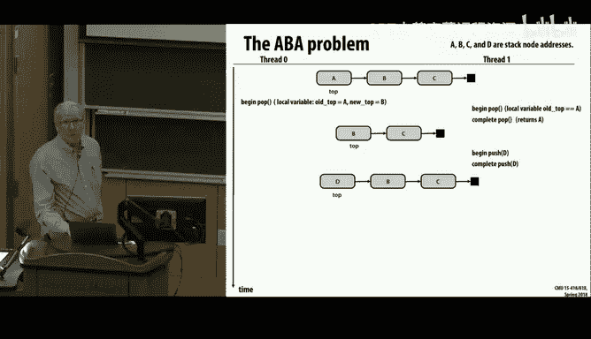
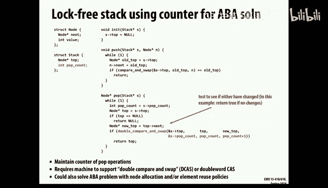
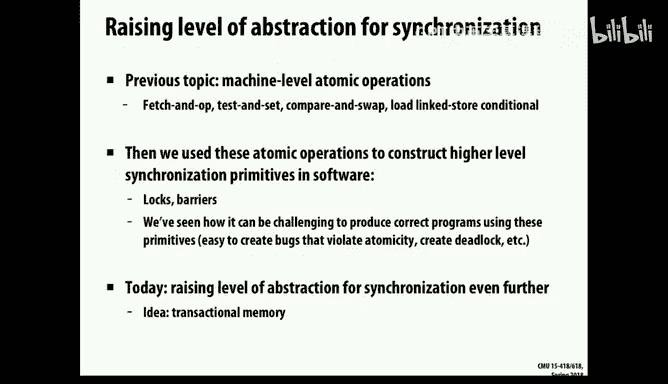
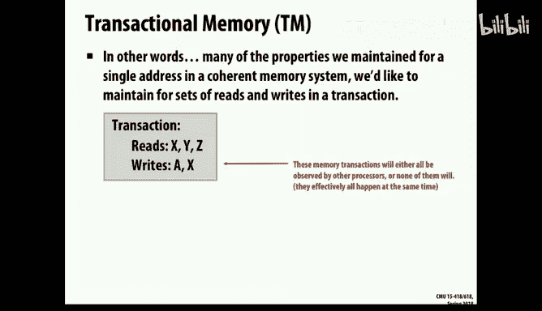
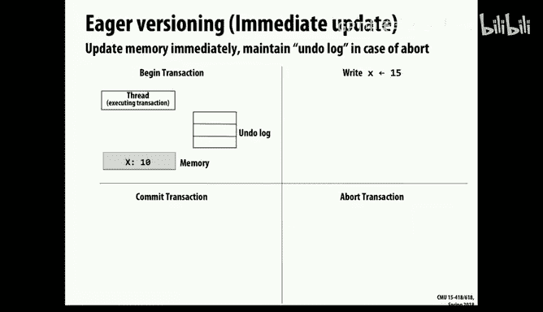

# CMU《并行计算机架构与编程｜CMU 15-418 Parallel Computer Architecture and Programming sp18》 - P25：Lecture 25 - 3-23-18 - Carnegie Mellon University.zh_en - GPT中英字幕课程资源 - BV18b421J7cA

Oh，m sorry， it's my problem。It plug in the cable。Okay， well。

 auto gradecope isn't accepting your exercises now， so if you're too late， you're too late。的嗯。

Last time we covered some。Implementation of a queue。

That didn't involve a lot pre implementation of a queue。

 And you recall that we encountered what's called the。呃。The ABA problem。Where the。

There is a potential that we might see a stale。Value。Even even with this implementation。

And so the ABA problem is one where you。嗯。You get a pointer to something。

And then when you later compare and swap and you see that same pointer， you think， oh。

 it must not have changed。But in the meantime， some other thread might have come along。

And change something about that pointer or what it's being pointed to and make it invalid。

嗯。然。And so last time we talked about this idea of adding a an extra counter。

To the data structure and using what's called a double compare swap so that you could simultaneously。

Remove this element from the list and increment this atically increment this counter and therefore determine not just did this。

Data hold from before， But also did I successfully increment the counter。

 And the idea that is to avoid this ABA problem。 And then I went on from there saying， oh， and yet。

 there was yet another problem。 But after class。W's pointed out to me that， no。

 this code's perfectly fine。 This is pretty classic implementation， and you'll see。

If you look up A BA problem， you'll see things talked about the double compare swap and so forth。

 So this is a perfectly fine implementation。 Nothing more is needed here。And just to go through it。

Let's think about possible things that could go wrong here。And so the issue is。

 imagine two different threads are trying to pop at the same time， and they both。Get into here。And。

Start this process。OfOf moving on down。 And they both get the same top value， the current top value。

 and they record the new top being top arrow next。In some order， but there is now a race。

 basically one of these is going to win this and one is going to fail the compare and swap。

 the double compare and swap。So let's just look at that。 if T1 is managed to。Get through this。And。

Starts like recycling the the element， the top， you know。

 calls free on it or reuses it for some other purpose。If that's before2 T 2 has even gotten started。

 then T 2 will see the fresh value of top。 Once compare and swap is done。

Then any future read is going to see the， the newly updated value。So that's fine。

 It'll get a different value， if。As I said， it's more the case that they're both in here and they're sort of both in a race to get this double compare swap。

Well， one of them is going to succeed and the other one's going to fail。

 And the one that fails is going to loop back around and get new stuff。

 And so even though it had potentially an invalid pointer at some time。

 It never really access that pointer。 So it doesn't matter。

 There's nothing more that needs to be done。 the main point being that this double compare swap is sort of a barrier that prevents。

2 from proceeding thinking they'd both popped off the stack。Okay， so just to wanted to clarify that。

 And so now I mentioned this idea of hazard pointers。

 you can think of hazard pointers as a different way of solving the ABA problem altogether。

It's a sort of a technique that actually gets used。

 and its main advantage is it doesn't require a double compare swap。

 You can use just a regular compare swap。 And the idea of it is。

 this is a slight change from what was presented last time that theres a sort of per thread array of these pointers。

And so each thread gets to one to list one item that it's sort of hanging onto and doesn't want anyone else to mess around with it。

And I don't provide all the code。 But the point is that。Even when this is done。

 the call is going to get some。嗯。Top value。 But as long as it's still referencing that top value。

 it should keep this hazard flag set to true。 And the general rule is。

Anytime you want to recycle a node， like to reclaim it or free it。

 you can't do it as long as it's one of the threads has it marked as its hazard point of value。

 There's a question there。Yeah， so you can think of hazard as a， you know。

 as many threads as there are， but there's only one writer to any location。

 but all of them are able to read it。So I don't go through the whole thing。

 but you can look that up if you look up hazard pointers。Youll， you'll find this idea。 And so。

 but that's just the general scheme of it。 But the point of it was last time I presented this is something you want to do。

 in addition to atomic。The counter， the。But， in fact， they're sort of separate。

Different ways to implement it。 This doesn't require special instructions。

 but it does require some way to。嗯。More acid sort of global control and kind of keeping track of that。

So hazard pointers can be useful too， when you're walking， not just at a word level like this。

 but where sort at you want to do atomic operations on entire objects。

So they're more used in sort of higher level protocols than this one。One other interesting point is。

嗯。On this pop count one。What happens if。You know， its a pop is only at 32 B in。

 So maybe after a really long sequence， it could wrap around。

 Is that going to cause any real problems here。

In particular， is there anything about this protocol that requires the counter to be in ascending values？

嗯。Right， exactly。 you just care that it's different。

And so if it wraps around as long as you don't have，2 to the 32。

Thread's all trying to vie for this at the same time。The the。

The there's really no problem here at all。 It's going to。Even if it wraps around。

 all you're car is that it's distinct。 some way of marking a unique value。

 And so sometimes they do this by shrinking it， not just to be。A full 32 B。

 but even smaller and potentially sort of jamming it into the same word as the pointer。

Because pointers are actually only 48 bits， remember？TheU bits aren't really used。

 So people play tricks to kind of stuff more stuff into a word and avoid the need for a special double care。

 They kind of get the impact of a double compare and swap。Just by the hacking。So。嗯。This。

 this idea is you'll see a fair amount number of。

Of。If you look on Wikipedia， see various implementations of this。So for today。

 want to talk about one final approach to synchronization。

Which is a bit more abstract than what we've been doing。 So so far， what we've looked at。

Is very low level primitives like compare and swap。And that are given and even supported in hardware。

And then we're building up。Various locks and other techniques。 Or as this example shows。

 we're right there at some data structure level， trying to think about。

How to do these in a lock free manner it's very。You can see it's it's tedious。 It's risky。

 You could imagine that it would work fine， and you could test it on some processor。

 and then you'd go to a different model of say， switch from X 86 to arm and all of a sudden the thing doesn't work。

 So it's。Not it's a risky business。嗯。So what we'd like to do today is say。

 can we sort of move up to a higher level of abstraction and express some sort of high level principles that we want to implement and then use some combination of compiler and hardware to make those work and have them figure out sort of what's the best way to do it in any given case？

So that's all well and good。Except that it would reduce the employment potential for systems programmers。

It doesn't seem to be a problem right now。So the idea is what's called transactions and the ideas for these come from the database community who've worked on the idea of transactions for decades。

 and the whole idea of when you go， the classic example is a bank account that if I want to transfer money from account A to account B。

I want that to be done in a way that it doesn't leave the thing in some inconsistent state。

 like the money's been taken out of account A， but failed to deposit into B。I want it to be。

 and that's the notion of animity， I want it to be done either completely or not at all。

 and if some transaction fails， I want it to be as if it never took place at all。So。嗯。

You can look at something like just even the simple operation of doing a deposit in a bank。That。

And so this isn't even a transfer， it's a peer deposit money， and I want to stick it in the account。

 but again， I want that to either。Succeed， and the count is definitely incrementalcrement or to fail。

 and I know somehow afterwards that it didn't take place。

So， once。The starting point is just to throw a big lock around that。

 and that will at least guarantee that the there's no。呃。Well， in this case。

 there's no failure possibility， so the thing will definitely happen and it won't leave some race condition caused the account to be incremented improperly。

啊。So this is one method to at least avoid the race condition on it。嗯。

But it's not really the full deal。 What I'd really like to say is something like actually that you've seen an open MP that you can just declare some block of code to be atomic。

And have the compiler， O S。Hardware， figure out how to make that happen。

And so this is sometimes an example of something that's declarative， a declarative。

Is where I just give some intention of what I want done。As opposed to a。

What you saw when I put in a lockx， I'm sort of telling it how to do it。

And so what we'd really like is and that's sometimes an imperative approach。

And so what we'd really like is this whole thing to be handled in a decorlarative manner。

 and let me convince you with some more examples of why this is particularly an area where there's so many pitfalls that having a decorlarative approach would really be a good thing。

So but in particular， in this case， declarative means I just want to do this。Atomically。

 and imperative means I'm going to do it in the following way， I'm going to set a lock。

 I'm going to do some operations and I'm going to release the lock。

So the idea of a transactional memory is to provide this sort of atomic capability for the memory system using some combination of hardware。

 software and compiler。And。Here's some features I'd like that go beyond what the sort of normal synchronization we've been looking at so far。

 One is this idea of atity。 I want it to be all or nothing。

 Either the everything in that bracket should take place。

Every single step or none of it should take place， meaning that there's。哎呀。They。

 they said a no residual thing。 I didn't， for example。Withdraw from one account， and failed to。

Deposit in another is part of a transfer。And another feature which is stronger than we've looked at too。

 is what's called isolation， meaning that while this transactions is taking place。

 if there's some other observers that have， say， read only access to the state。

 they shouldn't see any intermediate state。So if they were， to， at in any given time。Like。

 look at the bank account， They shouldn't see it as you're making the transfer that there'll be a moment in time when one account gets decremented and another account gets incremented。

 They want it to be as an external observer。Even without right access to it。

 you should see it as if all of a sudden poof。Both of those account values change together。So。

 that's called isolation。And the other is serializability， which we've talked about before。

 the idea that。I don't care the exact order in which transactions take place。

Sort of in terms of measuring it with a clock。 But I do care that they are serializable。

 that I could replay it in some sequence。And have it take place as if it had happened in a purely sequential fashion。

AndSo these are ideas， again， that arose from the database community。

 They use an acronym called acid。呃。Of which。A is atomic。 C is consistent。 I is isolation。

 and D is durability， durability， meaning。Which is implicit here that once I'm done。It should stick。

 So if I did that transfer， it shouldn't mysteriously get undone later。

 And so that's sort of an implicit one。So the general scheme of it。

 the way I'm going to implement this is sort of keep a log during the transaction。

This is one potential implementation of all the addresses that were either read or written。

And so I'll keep that information around。And that will become the read set and the right set for this transaction。

And I will make use of that information to determine whether this transaction should succeed or fail before I actually finalize it。

 what's called the commit， the commit process that sort of makes you kind of set up everything and then make the change it says。

 okay， this transaction has really occurred。

I'm going to。Stick it through as opposed to abt where you say， nope， can't do it this time。

 Sorry and send back a flag that says， I fail。So there's a sort of very simple version of this that's commonly used by a lot of machines。

 And in fact， I'm making up an exercise problem for next week that will explore this pair instructions。

C load Lied in stored conditional。And these are two different instructions They are found。

 for example， in arm processors， the ones that are in your cell phones。嗯。

That just do this on a sort of single word basis that they'll say or a cash flow basis。

 They'll read in some location in memory。That's the load linked。

 And they'll sort of set a little flag that says， okay， I'm looking at this。

And then if later theres a store conditional instruction， it will only succeed if。

 if it can detect that that particular cache line has not been modified in the meantime。

And this actually， you'll see， you can use to implement sort of all the standard primitives。

 But the idea is。It's a little like this idea of transaction that I'll only actually alter the memory if I can be sure that nobody else has come along in the meantime and made some alteration。

So it's a little like committing a transaction。 It says， I'll only do this store。

 if I'm sure nobody else has come in in between。Between my read and my write。

 and potentially altered that value。

So let's look at why， again， sort of keep at this higher level of why are we trying to do this transactional memory stuff。

And so here's an example in Java and。Most other languages。

higherigher level languages have some library functions to support hash tables or hash maps。

And the version in Java is completely thread unsafe。Or at least what's assumed is。

 maybe it's been changed since then。And。But it's a sort of standard one that it's imagine。

 it's a hash table where you have an array of buckets and each bucket is a linked twist。

 And so you first hash。The key to choose which bucket to use。

 And then it looks like a linkedist searching and insertion or deletion code for it。And so with Java。

 it's possible to just。Say that some。啊。Data structure is， is synchronized。

 And what it will do is just slap a big fat lock around that thing so that all accesses to that data structure are are held。

Exclusively， so it's the sort of totally coarse grain block on this data structure。嗯。

And you can imagine other techniques we saw last time we looked at this hand over hand walking。

 this way of managing lists with a lock per element in a way that you could do insertions and deletions。

 but have multiple threads be running concurrently on the same list and not have any problems。So。

Here's some performance results that were obtained by comparing these， the。The blue， the dark blue。

 the horizontal line are ones where you just lock the whole data structure。

And the purple are ones where you。啊。Are using a finer grain blocking， a per。啊。

A lock per linked twist element。And what you see it and so on the right is the number of processors and up is total execution time。

 And this is， imagine it's a benchmark that you want to do some large number of insertions and deletions in this map。

啊。And so。In principle， as you have more processors， you'd expect the running time to go down。

And what you see on the case of the。Course lock is the time doesn't go down in a very significant way because this single lock is serializing all the threats。

But you'll see that with the finer grain blocking it， it improves。

 and the upper one shows a performance for a hash table。Like I just described。

 and the other is some type of balanced tree。嗯。And notice there are different scales， too。

 the balance tree。Here， this is one。And this is already over one of this first line。

So you see that the two are roughly comparable。With the course grain block。

But you'll see that the fine grain G does really well here。And here it starts off， Not so great。

But when you have enough threads， it improves。 So anyone have any ideas on why。

This one works so much better than this， with the fine grain blocking。一样。Then。Well。

 imagine it's not even that fine， imagine。The tree isn't even that small。

 Imagine it's a big balanced tree， but you're onto to something there。Of of why it's kind。

Have a fairly significant overhead。Anyone else。you're in the right direction there。

Yes。や調べ。That's right。Exactly， so that's the exact point。 is that the hash table boom， you have。

However， many different ways， and those are completely independent doesn't require a lock to computer hash function。

So you can go jump right into the nway split of many independent lists， Where the tree is。

 what you're saying is that everyone has to get through that route。And through the first few levels。

 And then if it's a big enough tree， it can all spread around and be running independently。

 But theyre all sort of serializing through the root。So that's a good observation。

So what we'd like in the ideal case is to just be able to say。

Just do it autoically and you figure out how to implement this thing， okay？嗯。

And potentially do it not by just fine grain walkinging， but by doing it sort of by， well。

 let's just assume it's okay。 go ahead and do the same as a serial version。

 but check out and if something funky happens along the way that might have caused a race condition。

Then abort。 Or if there's two of them， let one go through， but abort the other one。

 So that's the idea of a transaction approach。So let's see if we can motivate that again with this tree example。

But suppose that we have a binary tree。And two different。

Threads are trying to update nodes 3 and 4 here。And so with hand over hand locking。

 just like we said。It'll work。 But while I'm trying to get down to node 3， I'm blocking。

This access threat to node 4。 And so I'm serializing them， even though they're going to touch。

Ultimately， totally different parts of the data structure。

So the idea with a transaction approach is you keep track of the read set。Of one transaction。

 And you see that I'm reading one and two。And then， I'm possibly writing。嗯。好。Noode 3。

 writing something to nodede 3。But now if I have a separate transaction for four。

 I'll see that there's no conflict， the conflicts arise because of either write， write or read。

 write conflicts， read， read is not a conflict， and so I can after the fact say as I go to commit the final transactions。

 I can say， yep， it's fine， they might have intersected the read sets， but the write sets were were。

Didn't overlap the other one's， read or write set。So that's an example where you can sort of be optimistic。

And just assume things will go， okay。But then double check at the end before you actually do the commit。

 before you do the actual update to say， let's just make sure this really was okay。

 And and that's the sort of principle behind the transaction approach。On， on the other hand， if。

 if I have some transaction and they both mod the same place or one reads a result that could have been modified by the other。

 then I'll have to。啊。Either aort both of them or let one commit and abort the other one。

 And so I I have to make that work， too。And heres some measurements that were made of a。

Implementation， this was a research project at Stanford。A few years ago， that showed that。

They got all the advantage of the hashmat。And even with this balanced tree。

 because the root no longer was such a bottleneck that they were able to achieve good performance。

Because with a binary search tree， if you're making updates。

 you may have recall that all the actual changes occur at the leaves。And so the roots。

 the upper parts of the tree aren' are are kind of a rely data structure。

It's different if you actually， if you now tried to do balance trees like sp trees or A VL trees。

Then you start doing the rotations。 and that looks like a complete mess here。

 So it's an interesting how you'd want to choose your data structures。Okay。So。

This idea of transactions， that I mentioned， is more than just a synchronization issue。

 It's also wanting to make sure we don't create sort of， y's question。How would you keep。Well。

 we have to figure that out。So either we're going either do it in software。

 hardware is some combination of the two。 I mean， that's the short version。

But you can imagine in hardware， basically we're going to keep track of cache lines and we're going to use the information that you know。

 put some little flags in our cache lines to keep track of things。So the point of this atimity， too。

 is it's more than just a synchronization issue。 It's also this idea of it's really be nice to just wet the thing。

Undo any personal update。 So as this example of bank transfer shows， you know。

 there's various things that could go wrong potentially at some intermediate step in this。

 And normally， what you'd have to do is write all kinds of code。

Either a bunch of ifs or some kind of exception handlers or something like that that you could use to sort of fix up and undo any changes before you。

Before you give up。 And so the nice thing about。What we're looking for here。

 this transactional approach is I don't have to write those handlers。 The the。

 the system just undoes things for me automatically。And then there's another issue。 again。

 the problem with the sort of classical lock based approaches。Is。

Is sort of a composability or across these locks。 So imagine I。1 and2。啊。嗯。

Do the withdraw and deposit。 So I have to lock both accounts while I do this if I had a per account lock。

And the the basic problem is you get into the classic deadlock， where if。

Simultaneously trying to transfer from x to Y and Y to X。

 You could get a case where one's holding each one's holding a lock and can't move。So， again。

 it's hard to write。Code at a low level just says， just lock this and do this in this sort of nice。

看了。Way you have to， if you're going to use traditional locks。

 you have to kind of reprogram the whole thing to think about these conditions and make sure。

 for example， you acquire locks。In some particular order， consistent order。So again。

 what I'd like to just say is just do it and don't deadlock on me while you do it。

So that's sort of the dream of transactional memory。

 and the reality of it is it's been an idea that's been kicking around for 10 plus years。

 and now it's actually implemented the current versions of the processors we have are implemented。

 maybe not the late days's processors， Intel had this and we'll describe the Intel version。But。

They came out in some early version of the Hawell processors。And they discovered a bug。

 And so they disabled it。 And then they had to wait for a couple generations later before they could even shake all the bugs because there's a lot of things go wrong in this。

So that's the dream， though， you can imagine。a pretty desirable dream。

 both from a performance perspective， from the ease of programming， from correctness issues。

 and so on and so forth。 this would be a nice thing。So there's one project。

That went to and implement this as part of open MP。 And you'll recall that Open MP does let you say。

 this is atomic。But I don't think it actually guarantees all these transaction capabilities。

 the standard， atomic and open。 It just guarantees that。Basically， synchronization there。

 It doesn't guarantee these other properties of。Desirable properties of transactions。

 But there was one project that proposed adding this sort of as a extension of open MP that they call open TM。

Transactal memory and had， for example， a primitive called Trans， meaning a。Transactal 4。

And so you could do something like this for a histogram that you could increment。

 And this would have been really useful for your rat counting， right， if you could have just said。

Increment the node count。啊。By summing up across all the rats。They their positions。

So something like that， you could do with this if if you and it were implemented well。

 you could have saved yourself some amount of。Bother it in writing that code。

So you can see the value of this。O。So again， remember that it's not the same as just simple walk and un。

 It has these other features， and it deals with avoids deadlock and some other issues that are harder to deal with with just pure walk and open walk。

呃， so。It means you have to kind of think differently in programming。

 What are the tricks that you used to use。In a thread， in a lock， unlock environment。

 no longer might hold。 So， for example， imagine this was。I have this transactional ability here。嗯。

So what if， if I。Like this current version， what we're assuming is there's a lock and an unlock of lock 1 and a lock and an unlock of lock 2。

嗯。So in this， in the code as written， is this， are these guaranteed to terminate。

It is what I've shown here。Well， when flag A gets set to true， what will happen over here。It'll exit。

 right， and flag V true。 And they're， they're operating on different locks。

 So they're not interfering with each other at all。 So yeah， it terminates it's fine。

 But what if this were done using atomic transactions。 What would happen。没。Yeah。

 this would just keep fail。 It wouldn't succeed because of this isolation feature， right that。

This one would not see the change to flag A until flag V becomes 0。And this would not see any。Change。

To flag B。Intel right， so we require each of these to be complete completed in its entirety。

 and neither of them complete in their entirety because they depend on the other。嗯。Yeah。啊。Well。

 I think what you'd see probably is just repeated aborts。 You'd put。

 usually you put a loop around the transaction。 So as long as I'm not abor and keep trying this。

 and you'd see that。But I see what you're saying。 They wouldn't even see。

 It depends on how you implement the。The isolation。呃这个 point。The point is。

This isnThis really is a place where you don't want to write code like this because it's not going to work。

Then again， why write code like that unless you have to。And of course。

 it doesn't protect programmers for themselves if they don't put the appropriate。

Granularity to their atomics， they might create something where there's an inconsistent state。

In there。 So like everything， it's always possible， to do it incorrectly。Okay， so now that we've。

Got that。 Let's talk about how to actually implement this。

 And so remember the three properties we want， atomic。Issoolated and serializable。And so here's some。

 some general ideas。 And as I mentioned， these ideas sort of ritual developed in the database world many years ago。

And they are well understood there。But databases， performance wise are way slower than what we look at。

 meaning that they kind of operate at this very coarse grain。Tang。

 and we're looking at a much lower level where it's really a tighter coupling of the hardware and the software。

So some of the things we'll want to do then is， is somehow keep track of， of any updates。We。

 we're gonna to make and either。啊。Have some way to undo those or to only do them when we're ready to commit as a way of。

 So that's called data versioning so that there's some possible way to abort a transaction。

To undo and make it appear as if no state has been changed。And why have to somehow keep track of。

 of enough， like these read write sets， enough information about them to know whether or not to。

To aort。And so， there's。啊。The initial version of these were all done purely in software。

 But now there's increasing hardware features to make this work faster。

So let's talk about data versioning。 And there's basically two approaches， which we'll call here。

 we'll call eager versus lazy。And the idea of eager。Is that。

As a change takes place。Like you assign 15 to X。 We'll actually change it。

 but we'll also start a little list what's called the undo log， which is what their old values were。

So that now when we。If we decide to abort。Well， and if we commit， we don't have to do anything。

 We just say， okay， it's fine。 If we abort， what we have to do is then go back through the under do log and reset the old values of the memory to。

To what they were before。So you see one problem with this that is isolation now is a non trivialvi task here。

 Remember， with this approach because。If some other thread actually reads X。At this point。

It will see the change value， even though later that value might get aborted。But， still。

You could just somehow prevent that from happening。 There's various ways you can turn to isolation。

Another version is what we'll call laserier。 Sometimes this is called deferred update。

 And the idea is we don't actually change anything。 We， we make a list。

 It's sort of a variation on a right buffer。 It says， here's the updates。That I would make。

 that I will make in order to commit this transaction， But I don't change anything。

 And this is good from an isolation perspective， You can see that there's no visible change until I'm ready to commit。

And thank when it comes time to commit， it goes through and and does all the updates。

And if it aborts， it just tosses that list away and no harm has been done。The。

 the trick you can see is。Committing here is more difficult there， because。

I could have some number of rights， and every one of them has to complete， or else。

I'm really informable， right。 And also I have to do this in a way。

 I have to lock out other readers to ensure isolation。

 So you kind of pay the price at one end or the other。

 And there's various issues about which is the better approach。嗯。And so we we saw， there sort of。嗯。

These two different philosophies， and partly which is better or not depends on which do you expect to happen more often。

 a commit or an abort。 And how does it handle some of these other issues， for example， isolation。

So that but you can see the basic idea there。So the other thing we have to do is this conflict detection is figuring out。

 oh， do I have to。啊。Under what conditions can I commit a transaction， When do I have to abort。

 Is there some trick I can play to。Make two transactions go through， even though they。

 they had the potential to create a conflict。And in this case， there is sort of。

Two different general approaches。What I'll call pessimistic， meaning， I'm going to assume。

Every single step of the way that something could go wrong。

 And I'm going to try to take care of that immediately。And， so let's and。

So let's look at some examples there and you'll see that it's actually fairly subtle。So basically。

 what will happen is that the transactions imagine there's some way of communicating the way this is actually implemented is leading up to is they're making use of these cash protocols to kind of track who's reading and who's writing what。

 And so it's done at a cash line level of granularity。

Let's just assume that something happens at that effect that makes it possible。So。

So that each one is sort of notified of reads and writes being made by the other。So for example。

 imagine。In the first case， the transaction zero reads a。Transaction 1 write B。Rightite C。

 So the point is that they had completely non overlapping read writeite sets。

 And so there's nothing that needs to be done special。 They can just commit as usual。

So what about a trickier case where。I do a write of a。And a read of the other one。

And I decide that it's okay to commit T0。Well， you can see that T1 here， if I were to commit it here。

Then， that's a problem。Right， because it would appear that。T0 will have this new value of a。

Before it's actually visible。You know， before it should be visible。

 So it violate the isolation requirement。But if I just kind of let this thing sit here and force it to stall a little bit。

And then， commit it later。Then， I'm okay。Right so even though these transactions sort of did a funny ordering。

It's still a valid， valid commit ordering here。So that shows you an example of you don't just have to give up if anything looks at all fishy。

 You can sort of often tweak things， to slide through。 And that's one good thing about this。

 this pessimistic approach is it has a very tight。Monitor on exactly what's going on can decide at any given time。

 stall a or abor a transaction and， and finally whether to complete it or not。

So let's look at some other examples。Same my dear， Reed。But this one does a right to A。And so。

Then I I'd have to abort， or I， I could actually instead of aborting on the spot。

 I could just attempt to restart。On this one and say， oops。嗯。I've got a new value of a。

 So my old value。It is not valid。 So let's go ahead and re try restart this。Transaction。啊。

But we're going to stall it。Untiltel transaction1 commits because it's based on the updated value of a。

 which should be visible only after T1 commits。It makes sense。

So I think the main point is you can see that。That this approach can。Work， but。

The algorithm is not terribly simple。 And so this is more the approach that's used in software based approaches。

 not in hardware based approaches。But it does have the advantage that instead of aboarding。

 you can retry， you can stall， you can take other measures to try and make it a transaction go through。

嗯。On the other hand， if you do two rights。Then。嗯。Well。

 and we try the same approach of just instead of just flat out of boarding if we just keep。Restaring。

 then you can see that this thing could get in an infinite loop of。H1 apartment Pla nearton。And so。

No progress。 And so somehow to break this conflict。

 you need some type of a back off protocol to increase the。The times are。

 or give up after some number of iterations or some other mechanism to avoid this condition。

So that's sort of one version it。 And the other approach。

 which is actually what's implemented more typical hardware， is a much simpler version of it。

 but just kind of keeps track of。Of。Of what the readr sets of the ongoing transactions are。

 and when it comes time to commit， basically make a simple decision to abort or commit a particular transaction。

And。And the committing might involve sort of locking up。

 basically hanging on to stuff so that all the steps of the commit can be completed。

So here's some examples。Again， if we start with our independent read and write sets。

 see nothing needs to be done。But an example like this， if we。

Go to commit this go to commit this transaction。 So well let it take place。

 But we'll see that there is a right to a。That took place。While this transaction was going on。

And we're not being that terribly clever about keeping track of the relative ordering of that。

 We're just assuming， oh， there some it's a1 bit flag for each。Location。

 it says A was written during this transaction， so I can't really trust it。

And so that then you debt and have to restart that。嗯。So this is an example。

 actually an interesting example where I。I write to A， but I haven't read it。

So it's only a right only。 So even as this goes to commit， it sees that there's a read。

 write conflict。 But since thread 1 is the。The writer。It， it doesn't have any problem。嗯。

Except I don't know if this should have committed， right。That doesn't seem right。

 This one should have failed to commit if there is a right before it， right。Oh， I I see。

So it happened before。本。So that's I don't see a。 I see an inconsistency here。 We。

 we actually kept track of the relative ordering of these two events。And said， oh。

 that one's okay because the read occurred before the right。 and this commit occurs before that one。

For this one， it looks to me like we said。I don't really know。Oh， I see。 I see the conflict， okay。

So this one is okay because we do keep track of the relative ordering here。

 We say that this read occurred before this right。And since I didn't actually read。

I didn't actually read it in this thread。 I only wrote it。This is O。

This one's a little bit different， it says。I did a read。 I got the new value of a。

But I shouldn't have even seen that at this point because it hadn't committed yet。

And so I might have done some further computation at this point。Based on this value of a。

 And I shouldn't even know what the new value of a is。 So I'm going to abort and restart that。

So that's the distinction between these two cases。Good， yeah。Sting。Yeah， I。

 I think this is assuming a little bit more sophisticated implementation than that。

I was incorrect correctioning what I said there。而。It's correct， It's valid。Because。

this really took place。It appears as that this read。And this was a right。 It not a read modify right。

 It was just a write alone， so。There was no conflict there。嗯。

A you claim this is an imbalance or just that it wouldn't actually go it？

嗯。So we see the right happens before the read。哦。嗯。Because I shouldn't have seen this read beforehand。

Before they commit。没。I see what you're saying。 if this one's the only stuff going on。

 then there's nothing wrong with that because it appears as if this one finishes after that one。白。

I think all of these are more exotic than what actually happens。

 I think they they keep a pretty simple set of rules on it， yes。虚的。Here's okay。Yeah。

That that's definitely a bad thing。 right， If， if I did a reday up here and a readday there。

 or if I did a reday here。And then， this one committed。Then I can't commit this one later。

So a better example would be to shift the relative ordering of these two， right？Yeah。

 I think these slides should be changed from。To do it in a different order。And like I said。

 I think this is sort of we can infer various clever implementations。

 But I think the typical implementation just keeps track of a readr set。

And doesn't try and keep relative orderings in there of events and just says。

 look at if there's any conflict， I'm going to abort。Question。注し。法月那。啊，Well。

 it would be okay because as long as this one committed afterwards。

Because even though I violated isolation。I didn't necessarily appear to violate isolation， right？嗯。

No， not even restarting。 If I just commit right here， as long as I commit in this。In this order。

T 0 before T1。 then then I can legally say it's as if the right occurred before the read。

So the point is， with isolation， you have to make it appear isolated。

 even if it wasn't actually isolated。Right。But I think a better example would be if this read。

 if we pull this one read up higher。Before the right， then。This is definitely。

 you'd have to abort this transaction。The point is that on all these， the。

 the real work happens in midtime。 They just kind of record what's going on。

And only make this decision， proceed or abort。 those are the only options。At the time of， of。

In similar way， if。You have two of them who are both doing reads and writes survey A。

Then one can be allowed to commit。And the other one would have to abort。Abort， by the way。

 I'm assuming there's a loop around this code that will， if it aborts， it'll re。Attempted again。

So that was better， in fact， than the previous version you saw where they were potentially。

each was causing the other to abort。 at least with this approach， one of them will get through。

 and then the other can take place as well。So just in general， you can see with this。

pessimistic is that it。It can turn some aborts into stalls。And it will waste。

 It won't waste as much time working on a transaction that's going to。

Fail due to something that happened early on in the transaction。

But it will require a lot more implementation trickiness。

And also has this problem that you can get in these。Conflict situations where nothing moves forward。

So the optimistic has the advantage that。嗯。That you can kind of defer all the work to the commit and use some relatively simple mechanisms that are maybe a bit。

Conservative。But are relatively easy to implement。And so what you'll see in these is if you look at the software versions。

 a lot of them are doing it at an object level。So they're protect。 And that's actually。

 from a programmer's perspective， very natural。It way object oriented programming works pretty well for transactions。

 because you can think of all the collected values and not have to worry about。Low level components。

But you don't want objects as large as a arrays here。And a lot of times， at a hardware level。

 you might think of trying to do this at a word level。

 But what's typically done is a cache line granularity， so。呃。For for hardware。

 partly because it's practical， there's already this mechanisms in the cache protocol that keeps track of and lets you monitor what's going on as far as read and write traffic on for cash fines。

And so now as a programmer or you have to sort of think about aligning your data structures and dealing with both fault sharing。

 but also。Making sure that。If you only have a cash lines's worth of shared state or you want to pack things into cash lines so that you're not trying to do this across multiple cash lines。

 more cash lines than you need。So there's been a number of。

There are a number of research projects at Stanford， MIT in Wisconsin。For hardware based ones。

 And then Intel came out with its version in， well， it tried to come out in 2013 and didn't。

2014 or 15 or something like that。And then there's an other a number of projects。

 both in industry and academia， to do various。Software based ones。 And you'll see that they。

 they come through in quite a range of， you know， lazy versus eager， optimistic versus pessimistic。

 And you'll see that some even mix and match the updating thing where they。

 they stay optimistic about reads， meaning you don't really worry about read traffic to the end。

But you track when a fight takes place。 You look pretty carefully at what's happened so that you can abort right away。

And this is still an area that's very much in flux。So as I mentioned。

 imagine that the data versioning is implemented in the caches。啊。So， and you can either。

 you can use either the optimistic or the eager or lazy。

 You can either have a right buffer or an undue buffer。 Those are your two basic choices。啊。

And then you will keep extra little flags in the with the associated with the cash lines to kind of keep track of whether it's been read or written。

And then we'll use the cash coherence protocol to kind of keep track of the readers and writers。

 So there's this understanding of readers and writers。

Another thing to assume is that when a transaction begins， you have to。

Copy of the state of all the registers。Because in order to undo it。

 we have to be able to undo any memory changes， but also。

 we have to undo any changes to register state。 So that actually becomes an issue， if you have， say。

The the whole set of registers for X 86， if it includes all the AVX registers。

 it's quite a few bits of state。Not just percent RA X and ones like that。

But you have to do something like that in order to guarantee that the。You can reset it。

So here's an example of how this might work。 And this is one that's trying to do it a cat on a word basis。

 not just on a line basis。So， first of all， you can make use of the。The state information on the。

 the， the protocol information to keep track of。Of what status is this。

 And am I possibly sharing it with others either for read or write mode。

And I can add tags that will keep track of for each word。 Has this word been read or written。

And these flags get cleared。At the beginning of the transaction。And then as the execution proceeds。

 they might get set。And then。At the end that when it comes time to commit。

 you can determine if there's been a conflict。So let's imagine what this might look like。啊。

So we'll begin。 we'll say， we'll save the register。 Itll be something that says begin transaction。

 We'll save the register state。 We'll que all these flags。 And now as we。

Do reads will set the regular cache line like that it's valid。

 but will also mark this as having been read。And。Will do the same for B。 Well。

 Mark C is being that we've written it。And now when times， you see。

 we haven't actually made any real changes。 This is just in our local cash。

 So we haven't actually committed anything here。 We've got the updates。

 but we haven't actually changed anything。 So when it comes time to。

Commit what we can do is broadcast out。That we now want to upgrade the value of x globally and push this value out。

嗯。And。And that will complete the transaction here。But if we're in the middle of partway through a transaction like this。

And we've received a signal that said， oh， A got upgraded。Meaning that somebody else broke to A。

Did a commit that that caused an update to A。 Then we'd say， oh， okay， sorry。

 this transactions not going to succeed。And so we could abort it right at this point。

And what the way we could do that is simply to go back through and mark these。Cash pits is invalid。

And so， we'd achieved this。We don't actually have to have a separate undue buffer。 We。

 we're sort of using the cache itself as if it were an undo buffer。

 We can just clear those valid flags out and。And no， they will have any impact， question。马。Yeah。

我 so you。The the basic rules are there's a lot of caveats。 If you look at the real implementations。

 they say。啊。TheyThey basically will't。 They won't work。

the certain rule of thumb of transactions is keep them simple。 Keep them short。

 Don't try and update more than， you know， a couple of places in memory on any given transaction。

 Don't use this as a way to update a whole array。But， but that's an important point。Yes question。

theoretical。い実は。对。Transaction。牌是。This is a big transaction。高温。Yeah， you could imagine that。

Let let' take good idea。And also， a boarding would require restoring the other registers。

Back to their own values。So。As I mentioned， the。Intel has this capability。

 and it it basically adds just three new instructions。Called X begin X N and x。

An begin and end are the important ones， and。嗯。It's actually a bit trickier to use that when you say begin。

 you don't just say， begin this transaction。But you also give the address of a。嗯。

Of a instruction sequence that can be used。If the。If the transaction fails。

 and the idea is it's supposed to be done in a way that you'll fall back to a more conventional lock based approach。

If you。If you don't succeed。And so because they don't want it the problem with transactions is potentially you can try and retry and just keep them failing。

 And so there has to be some way that says， okay， clearly。

 this transaction stuff isn't really working here。 Let's resort back to some more traditional way of handwi it。

Which sort of takes away the advantage of doing it in the first place。

 If it was to make my coding life easier。 I still have to write the regular code。

 I just can hopefully not have to use it。Which is。

From a debgging point of view， too。So anyways， the X begin instruction includes a fallback in case of an a。

An X end is the commitment。 An X a board as a way to force an ongoing transaction。

Some application level， you realize， for example， this is an invalid bank account。

 You can just cause the thing to abort instead of。嗯。So there's various reasons at application level。

 you might want to do that。And the point of it is that it's all done making use of the cash。

And the Intel has fairly extensive guidelines on how to use it。 And it includes things like。

 don't try to do this with a lot of memory because it's going to fail， especially， you know。

 it's a eight way associative memory。 so you can come up with a9 cache line。

Version that's going to definitely fail。And so here's and GCC， if you look it up。

 GCC basically gives you direct access to these capabilities without any much decoration on it。

 So underscore X begin， underscore X N， you have to load a special library in。

 but it will just compile the code and give you various macros and of some of the。

Conditions that the X that these instructions return。And then you， you write code。

 So it's possible to sit it without going down to assembly code to actually get access to these low level features。

And a couple years ago， actually， two years ago， some students did it as one of their projects。

Was to test out this whole transactional memory stuff and see what kind of performance was。

 how easy or hard it was to use。And it's tricky because there has to be a fallback path。

And you have to make that fallback path has special rules that you'll see in the program guidelines for what they have to be able to do。

So it's not totally it's not as convenient as you might hope it would be。And so like we said。

 this can only， it's limited and how much memory it will do also it has to keep track of not just。

It has various lists of here's the places that have been updated and so forth。 And those are。

Its all hardware。 So the basic idea of， the transactions have to touch a relatively small number of parts of memory。

And what they found was。There is a cost to it， but。

That this students found it was equivalent to doing six atomic primitives like compare and swap up to the same cache line。

But these ideas are definitely， this has been an area of very active interest and a lot of。

Be an interest in the sort of software community to have these capabilities and have them in hardware。

 just because you can see that the traditional lock based approaches have so many。

Problems that we've already discussed and the， the ability to do it at this higher level is very desirable。

哎。Good。Okay， that's how I got for today。