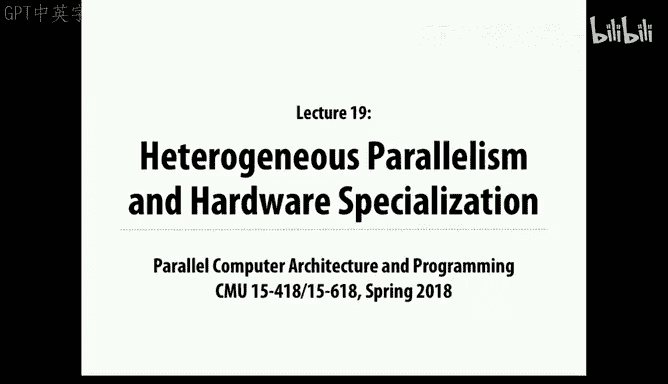
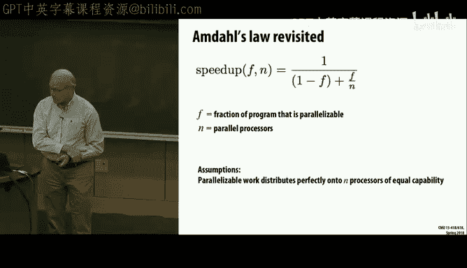
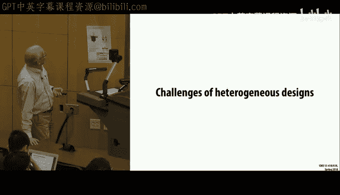

# CMU《并行计算机架构与编程｜CMU 15-418 Parallel Computer Architecture and Programming sp18》 - P26：Lecture 26 - 3-26-18 - Carnegie Mellon University.zh_en - GPT中英字幕课程资源 - BV18b421J7cA

嗯。So let's move on today。Next Wednesday， by Wednesday， there'll be announcements about the project。

And the parameters of it， some description。 and I'll talk little in the lecture tomorrow， Wednesday。

 about the project as well。So today， what we want to look at is。Is a pretty interesting topic。

 which is。The combination of。How much to use what would be the advantage of a more heterogeneous computing environment and what we'll find is that everything from cell phones to supercomputers use very mixed types of computation engines in them for different reasons and another which is also an interesting one is the benefits of mapping from pure software to something closer to hardware or actually doing hardware design for it。

 and again， that's become an issue because really the dominant concern in computers today is power。

 whether it's。The power of a supercomputer that you can't supply more than  10 MwaW to a building。

Or the power of a cell phone that if it takes too much， it uses up your battery and it。

 it gets too hot to hold in your hand or your pocket。 So a power is sort of the issue。

 whether it's the smallest computers we use or the largest computers we use。

And that makes that sort of has changed the equation that over the past 10 years。

 it's changed a lot of thinking about what's the right thing to do and what's not in computer system design。

And one thing to remember is we've already seen on some of these systems really wide varying performance。

 depending on how hard you're willing to work at it。

 So you saw in assignment  one on the manlebroat set that if you。

Pushed into making use of the SD vector units， and you pushed into the multi threading。

 You could get a lot of speed up in an application without changing hardware at all。

 It's there's typical machines have are are。Have a lot more hardware available than most programs use。

 in particular， the whole Sdi vector unit。Is。Mostly goes unused。

 except for sort of library applications that。People have spent a lot of time and effort to try。

 and speed them up。So， imagine we。Looking at different trade offs in building or buying new computers。

 And let's look at the one that imagine we have a fixed amount of chip real estate。And。Our。

 our choice is basically to use， use it real estate to make a small number of。

skinkinny cores well call them or sorry， a small number of fat cores or a large number of skinny cores。

And there's sort of an exam problem to this or one of the multiple choices you recall said if you have a choice between K processors of performance1 or one processor of performance K。

 which you would you choose， and the answer should say one processor because speed up recall。

 you almost never get ideal speed up。 So it's not an even tradeoff。

 So let's look at this question a little bit more carefully and think of some possible models of what performance you'd get sort of if for a given amount of chip real estate。

So for example， imagine。That it's not that it divides evenly。 Let's assume that the。

The fat core has performance just equal to twice。What those skinny cores are。

So you potentially have eight times more raw computing power on in the system on the right。

Then you do on the web。So what's the trade off there， And again， it's not always that simple。So。

 and of course， one way to think about this is to pull back Amdll's law。

 which is you call just a very simple observation made originally by a fellow named Jean Amdal。

 who was。One of the pioneers of， of mainframe computing many years ago。

And he simply observed that if there's some part of a program that I can speed up。

By a certain factor。I'll become more limited by the parts that I didn't speed up。

 And so let's express that in terms of fraction F。And we're speeding it up by making it go parallel。

 but you could also say the same because you make it。

 you use hardware acceleration or some miraculous algorithm or whatever technique you want to use to make it go faster。

And。In this case。啊。Though we're looking at parallel。 So we have n parallel processors。 we're saying。

 And so there is some fraction that we could make go in a time F over N。

But the remaining fraction would still go at time1 over minus F。 the part that we couldn't speed up。

 And since we're looking at performance， you take。That old time， divided by the new time。

RightAnd so the old time is if it were one， the new time would be1 minus f plus F over n。And。

 and so that's。You know， Imdsvo， you shouldn't have to look up the formula for it。

 It should be something you can just sort of drive on the spot。

 So think of T of old divided by T of new。 T of new is the fraction you don't speed up。

 stays the same。 The fraction you do speed up， speeds up by some factor。

Let's look at it in this a little bit more elaborate model where we assume。

That there is a。Some resource that we're going dedicate to doing the computation。好。And well。

 and so we'll give that in some mystical units called R。And there'll be a relative performance。

Function that says the more sort of chip I add to a processor I can put in out of order functional units。

 I can put in Sdy vector units。 I can add more branch predicts。

 I could do various things to try and make that run faster。

 So there's some function of R that says the more resources you give me the faster single core performance。

 I'll be able to give you。啊。And we'll assume that。Let's see。 We have to look at this carefully。

 We say that there's。N total the the size of the chip。Is a total of n of something。

And we'll say that。That basically， in this model， what we're saying is there's n total resources and we'll divvy them up。

Into cores， each core has size R。 So they'll be ndivided by R cores。And so just to normalize。

 it will'll say， assume the perf of one is one that this one unit of resource is one。 So。

 for example， imagine processor B， we say that this has。16 units of resource， total。

And each of them has a performance of one。喂。And for this core。

 what we say is that this has each core has four units of resource。

 And so the performance per core will be。Perfect for。And here's the same thing。 We're assuming that。

 relative to a。The single。Resource， running。In other words。

 running a program on just this one course worth。I can make the new version go。

 the part that doesn't parallelize。I will still be able to dedicate this core， which might be faster。

 You know， if it's a bigger， fatter core， I'll get some speed up there。

 And the fraction that I will speed up。I'll have。And over our cores， each having perf of our。

Makes sense。And now let's， let's just pick a function and you can pick your favorite function。

 But square root of r is actually an interesting function。 It says there's sort of。啊。

For small values of R， you're， you're kind of getting close to linear your improvement。

 but it sort of peaks off。 So by the time you hit 4。You're only getting a performance factor of， of2。

 And by the time you hit 16， you're only getting a performance improvement of 4。

 So that might be a little bit harsh， but it just shows you you can sort of imagine and maybe do a bunch of measurements or analyses or predictions to figure out what that function is。

 But it， it will， in general， be some kind of diminishing returns type of function。

So if we use that square root of R， then you see that you get these curves for。

And we'll call this a symmetric case， meaning that all the well。

 we're integrating a number of identical cores onto this chip。And over our cores。

 each with our capability。And so。What this shows is it's interesting to look at。

 This is how much improvement we get。Relative to the running on the。The little teeny single core。

 one program running out a teeny single core， so。Expending 16 times more real estate。

 what real benefit can we get out of that？And you see that， if you can have。Almost perfect。

A parallelization， like 11 of 1% ceal。 Then indeed， what you want to do is。Break this up into。

As many little cores as you can。And you'll get nearly perfect speedup out of that。

 Youll have your chip is 16 times bigger than the original one。 and you're getting 16 times。

 for that's assuming 001% cereal。 As soon as you even go to 1% cereal。

 you start to see a penalty for it。And if you go to 10% cereal， you see it best。

 You're gonna get a speed up of 6 point something。And if you're only half。啊。嗯。Parael。

Then you're only gonna get something on the order of 2。

And you see these all converged to the same point here。

 This is the point at which you have a single core of。That takes up the full chip。 So it's 16。

 R is equal to 16。 And we said it'll get 4 x of performance in the square root of the performance。

 So that's where this goes。And the interesting points are these ones where you actually have some optimum point somewhere in the middle。

 for example， with this 90% fraction it。It doesn't。 It's not that dramatic。

 but it says you actually do a little bit better to make the cores。Be sort twice as big。

As as the standard core。And this says， okay， now that was a chip that had sort of area 16 relative to my starting point。

 Now， what if I jack it up to 2，56， And it's the same general principle。

 but even more stark that the。Here's the 90%，99% parallelism。Is still giving you。

A factor of 70 or so， speed up。Out of， even though your chip area is 256 times larger。

So this mostly just emphasizes that especially when you want to scale up with any substantially high degree of parallelism that Amdal's law issues are going to really come and bite you。

Makes sense。And again， this is just a hypothetical model。 This。

 there's nothing magic about square root R。 And this these chip。

Thoughts are obviously would depend a lot on， on what your function is。 The performance function。

 But they show in general， a general principle that as long as theres some diminishing returns。

 you get out of。Making your cores bigger， there's going to be some。

 something like this that says there's a basic tradeoff between， I can make fewer flattered cores。

 but they're not going to give me much performance。 I can have a large number of small cores。

 but if the application isn't highly parallelizable， that's not going to give me much either。

So you kind of lose both ways。Okay， so that's the homogeneous case。 Now。

 one thing this brings in a question。 and it's a really good question is。我这啊。What would I。

 would I do better to have this sort of partitioning instead of making assuming that everything should be the same。

 What if I had one fat core。And then a bunch of these unit size cores。And so。啊。Well。

 will assume then that。嗯。We have。The， these three parameters。 One is the portion we're speeding up。

 N is the total size of the chip measured in， in sort of。Terms of this basic small core。

And our will be how much resource， How much will we devote to our one fat core。 And presumably。

 the idea of this is we're going to try and map the。

Sequential part onto the fat core and the parallel parts onto the skinny cores。

 and then hopefully kind of be able to get some some benefit out of that combination。And again。

 this ends up。 these are the partss we saw before。 and now you see something both more promising and also more interesting from a mathematical point of view。

That you see that， for example， the chip we showed before。Corresponds to this block， we said。

What if we had four， our， our fat core was four units。呃， size。

And you see that it will really help a lot。For the cases where the parallelism is。

 there's some parallelism there， but imperfect。Right， so。You see， for this， it made the degradation。

Compared here where it was a pretty sharp。Drop off here。

 you actually have a more graceful degradation。And this is remember。

 the case where it's  point01% ce。 So an extra small amount of serial code。

And what's more interesting is something like this dotted line， which corresponded to 99%。

 which you could imagine actually encountering。 You see that。That。

Gives you something close to ideal parallelism。Pretty far out。And even better。

 if you add this one of the。2 and a half percent serial code。

You see that it also is hanging in there。 And， and basically， all of these are giving you a more。

Graceful。Point here before you start to lose out and you lose out here because you're。

You're basically converging to the point where you just have one big fat core for the whole chip。

So this shows that some dedicating some amount of space to， sort of sequential processing。 and then。

As much as possible， Sprinkling a bunch of smaller processor that are able to do parallel processing is a good proposition here。

And again， this depend， these are very simplistic models。

 and the square root are still there and all that， but。It gives you some sense of it。

 And it's even more pronounced， if you。Went to a very large area，256 times area。嗯。You。

 you'll see that。Your sort of sweet spot here is， well。

 depending on which curve each of these has a different optimum point。Of what it would be。

 But all of them have the property that they are。The the curves is somewhat flatter， too。

So how would you actually， as an engineer， make use of this， if you were designing a product， yes。

Yes， our assumption here。 and it's an optimistic assumption。

Is that we can map all of the serial computation under the fat core and have the。

 the other cores doing stuff that's perfectly parallel。对。Previous one。Cause we lost。We engssed。好似。

Yeah， she's questioning this formula。So let's work it through。 This part is， we have our resources。

To perform the sequential part， with performance per far。嗯。Oh。This is a little bit weird。

We're also saying we will take the parallel part and we'll divide it。

Between some of it running on the fat core。And some of it running on the unit course。Right。

 so n minus R of them。These guys will all be doing the parallel work。

But this fat one will also be taking on some fraction of the parallel part。And the fraction will be。

That we will put as much on there as。The performance of it。嗯。好。

Matches and the reason for doing that is to give us nice curves so we can push it all the way to the point where。

嗯。We have。Everything mapped out of the fat core， for example。So in that extreme example。

 where n equals R。We want this term to drop off。 And basically， you get the performance of。Of the。

That core for both parts of it， right。So that that's why this， I mean， you I。

Believe this would be the optimum mapping， but you could work it out。

 But the idea is to sort of be able to show everything from the extreme of。Of。How。

 how much the total what fraction this fat core occupies。Okay， good question。Okay。

 so you see this is a challenge， though， because it's very seldom that you have a workload that is so well characterized and that you can。

Design an entire system around。嗯。Especially in the， the business of chip design now。

 it costs many millions of dollars to develop a chip。

And so the only way you can justify that from a cost is if you're gonna to sell a lot of chips。

And except for cases where you have， there just aren't。 There's no application that has。Enough。

Volume to justify a dedicated chip。 And even a cell phone。 remember。

 that's not a workload has all kinds of different workloads。

 So it's a difficult engineering trade off to take these ideas and apply them in practice。

But that's what we'll explore is how that you know。

 that that principle and how it's evolved out in the real world today。

So as this points out in the real world， you have these applications that have different characteristics。

 and they change from application to application， or even within an application。

 it will change from which phase or which part of it is doing or what the particular。

Environmental conditions or data are sort of pushing which characteristics of this application。

So some parts are easy to parallelize， and others are difficult。Some， you can。

 the Sd vector units work very nicely， but that's pretty limited。 we've seen。

Some have very predictable data access patterns， and others don't。 So all of those is you。

Have well experienced our。Ourre can be really big challenges for sort of the。The， the thing。

 the easy ways to make things run faster。So you can see this sort of general idea。

 even in current microprocessors。 So this is a die photo of Sky Lake， which is。

What is right now intel's mainline processor。嗯。One generation ahead of what we have in the newer than what we have in the GHC machine。

And you can see they're already using this general idea of。Heerogeneous cores in particular。

 the regular cores， the thing that you log into and， and run threads on。

Are some fraction of the whole chip。And this core， these cores include。A therere L1 caches。

 Theyre L2 caches。And you'll see that this thing here called the shared LLC。

 That's the last level cache。 That's actually the cache controller for the L3 cache。

 I believe that the L3 cache。嗯。Well no。I'm wondering if L3 cache。

 I guess it's integrated on the chip2。 So the point and that's not the main point。

 But the point is then they have a GPU。 it's not the kind of GPs like NviDdia makes that you can program and do things that are nongraphs。

 They're really pretty specialized to or graphic processing。

 and they're not as programmable or flexible as as the things NviIDdia makes。

 But there's still what most laptops unless you have a separate graphics accelerator are relying on。

 And you see that it's actually you know， this is the four corere variant。

 There's other chips have more core stuffed into them。

 but a big part of the chip real estate as dedicated to this graphics control。And media also means。

 you know， things like decoding of MpeG videos and other processing operations like that that again。

 people routinely make use of in computer systems。And in particular， the one advantage of。

Putting us all on one chip is that this GPU can also share this last level cache， this L 3 cache。

And so get a very high performance tight coupling into the memory system。

 That was one problem you experience with the。Nvi GPUs that we had on the gates machines。

 as you had to do the mem Kupa mem copy back and forth。 And that was a real performance killer。

Because it was relying on the bus bandwidth of an external bus as opposed to what you can put on a chip。

So what we see， though， is。You know， a typical configuration， like what we have with。gates， machines。

A little bit older processor。 but the same general idea that theres some sort of。你啊。

Modest GPU just to handle the sort of graphics type of issues on this and then some type of a bus。

 and then a very heavy duty GPU。Available that can do is very programmable and can do a wider variety of applications。

And these things， as it mentions， are very power hungry。 They we had to add more。

Cooling capability to the gates cluster build rooms when we put the GPUus in。And the good thing is。

 if you have an application that doesn't need the GPU， you just power it off。

 and that will save you a lot of power。So if you look at a typical laptop。

You'll see a couple interesting things。 One is that the circuit board is very much conforms to the the space available and has to make room for a battery。

And it looks like this one might have had a。A C D drive， as well。

But what you'll find is this is an apple， but not unlike what you'd find on other processors， too。

 is that there's。A pretty big。嗯。CPU chip that， as you saw。

 has an integrated GPU of modest performance。 And then AMD also makes GPs not as easily programmable as as the NviIDdia ones。

 but still general purpose programmable ones。And so these are all， this is a high end laptop。

 high performance laptop。 And you'll see that you're making use of exactly that split between。

A processor and a GPU。It's interesting。 NviD actually makes this interesting one chip。

Unit called the Tegra。 And these are very heavily used in embedded applications like automotive to do。

Like lane tracking for。If you have a car with smart cruise control。

So places where they have to do a lot of video processing。

 And so what it is is it's one S M's worth of。啊。嗯。Of， of。

 of GPU capability compared to the 20 that we had in the。GHC machines。

And has a total of 8 armed cores。But even those are somewhat heterogeneous that there's four of them are very low power。

 low performance cores， just for doing what you call executive function。

 the stuff that kind of just makes sure everything's running and coordinated。

 Nothing serious as far as computation。And then， for somewhat heftier。Higher performance cores。

 again， arm cores that can be used for more conventional processing。And then the， the， the GPU。

 of course， has all of its。You know， capabilities to do the work processing。So you see this。

 this hybrid， this heterogeneous， both are the GPUs versus conventional processors。

Smaller cores versus larger ones and all of that sitting on a single chip。

And part of it is they can throw in those arm cores or are almost free if you look at Chi real estate。

It's not the power。 It's not a big deal。 So those are once you've sort of paid the cost of buying a GPU。

 you can get some CPUs for free question。You， I don't know。 I assume they must。I would。

 I would think so， yeah。You can buy these。For。You know。

 on the order of $100 plus is complete units that you can plug in and start using。

 They're kind of cool。This is a。A picture of a slightly older but not so old processor that Apple uses in。

The iPhone。Think the current one is the Apple A 10。And you'll see that it also has。

A lot of stuff going on。 It has。Some number of。Multi core of CPUs。It has。Multiple GPSs。

And it also has this whole bunch of stuff that's unwabeled here that are more hardware specialized functions that we'll talk about And one of the advantages Apple has over its competitors is it has。

It acquired basically a very good chip design team。And so， they designed their own。啊。Of chips。

Including the， the CPU and the GP and all the specialized function。 And so。

That's been a big advantage for them。AndObviously， Samsung can design chips， too。 But you have to。

 that's why Samsung Apple， you know， there's a few big players。

 It's because they have these design teams that are carefully sort of co designing what should be on this chip。

Relative to what capabilities do I want to present to my customers with their cell phones。So anyways。

 and they call this even they don't even call this a processor anymore。

 They call it a S OC system on a chip。Cause it includes all kinds of。

Of general processing capabilities， but also more specialized capabilities。

And if you go up to sort of the world's gorgeous computers， one of the first。

I believe the first to really make use of this idea of。

 of heterogeneous processing was called roadrunner， built by IBM。

And delivered to Los Alamos National Webbs。 And the idea of it was that it had。A number of。哦。

Conventional looking CPU made by AM MD。 And then it had a number of these little。嗯。

What they called cell processors that were designed by IBM。

 And you could think of these cells as as sort of almost a precursor to a GPU。Very small。

 very simple processors。And。So they packed this all together。

 and that was able to push it over the one petafloap range。1，10 to the 15th。

Fing point operations per second。So。A couple things that I had a conversation with some of the people at Los Alamos who were stuck with developing the software for it。

 and they said it was an absolute nightmare because these cell processors。 you had to just。

 if you made use of them just right， they could perform well。 but if you're off a little bit。

 they were very slow。 They had issues like they had different word ordering。

 whether it was the AMD was little Indian and the cell processors were big Indian。So， you。

 just migrating software back and forth between them was fairly challenging。

 So what happened was this wasn't a total success。 It nominally gave them a fast piece of hardware but it took them a couple years for them to migrate all their important software applications over to actually take advantage of it。

 And at the time。Supercomputers were going faster and faster at a rate that said wasting a year and a half of software development to make use of a new feature was actually making you fall behind and how far you were really going。

 how， how fast you're really progressing。But that's become the norm， though， as we'll see。

If we look at the Oak Ridge Titan， which has now fallen to number 5。

It's the fastest machine in the US today。There's other ones being built that will be much faster。 So。

 and I think we've probably talked about this one before， maybe。So it's built up。

 Its actually is' interesting。 They took a machine called Jaguar。Which had。18688 optton processors。

And they stuffed it full of NviIDdia GPUs。 They added more memory。 They kind of juiced it up。

 but they basically took the same cabinets and just plugged in new boards and got a 10 X performance improvement。

 And that 10 X came out of these GPs。Because if you， have you've seen a GPU。

When used well can easily give you 100 x or more performance over a CPU。嗯。So one of the。

 the reasons that limits these machines is this。The saying draws。We'll see the number。

 The rough rule of thumb is it costs about a million dollars a year to supply a megawatt of energy of power。

If you look at the total cost of it。And so。Power power is an issue both because it's physically hard to get enough power into places and enough cooling。

 But also， it adds to your bill。 So there's sort of a limit there。

And then we've seen variations on this Zon Phi， which is。Really。

 the idea of it is supposed to be that you have a large number of， of relatively simple cores。

 each of which is a fairly conventional looking。X 86 CPU， but with with。

Double the normal count of SMD vector units。So the idea is you really have to map your application to be able to make use of CD and have a large number of these all on one chip。

So this is the chart。 I just pulled off the Internet of the rankings of the world supercomputers。

 And first of all， take all these numbers with a grain of salt of these things。

 the top 500 listist is done by running one benchmark。

And seeing how fast it goes。 And that one benchmark is to do Gaussian elimination。

 So basically inverting a。A matrix using。An algorithm that dates back 300 years。

So it doesn't reflect realistic applications。 even。

 even numeric applications use more clever algorithms。

 They typically working with sparse matrices And this is for dense matrices and all that。

 So this tends to put a lot of value on pure raw floating point capability and relatively little on。

On how programmable it is， how good a network you have connecting things。

 and the people that do these will spend literally a year or more of a whole programming team tuning and tweaking their algorithm。

 their code on this one particular benchmark to make it go as fast as they can。Yes。Yeah， why not so。

The part of it is talking to the people who do this。

 They say it's a big royal pain in the neck to have to devote all the resources to。You know， tune。

 if you're， if you're gonna to tune 10 benchmarks， that's 10 times more work you're gonna have to do。

 So partly they don't really， you know， the people who do this benchmarking。 And also。

 you have to lock down the machine。 typicallyyp， a machine of this scale doesn't get used by just one。

Application at a time。 It's being partitioned into。Dozens or more。 But to do these runs。

 they have to have complete unfettered access to the machine。 So it's partly just the logistics。

So anyways， just keep that in mind。 But currently， the two fastest in the world are in China。

And it's pretty interesting。 You'll see that So taking as our benchmark， Titan。Here at。啊。Our max is。

 how many gigapps or terraopps per second did it achieve on running this particular benchmark。

 So it's。17 or so， petaflops。And you see that these two that just。

Sid in ahead of it are just fractionally better than Titan。 So it's not big。 But this one， Tianhei。

 too。cameme out a couple years ago。And it essentially doubled Titan's performance。

 And then most recently， this one。Called Taihu light then tripled that one。

 So this is really smoking， right， to be running it。93 petedaflops。

And it's also interesting to look at the power。So， and this is in kwatt。 So you see that。

This is an older machine running at 8 MW。 Remember $9 million a year。

These more recent ones that just came in are， are doing much better on power。 And that's in general。

ThePart of the progress of chip technologies is to make the chips denser， the transistors smaller。

 you can reduce the power。 That's one of the the reasons for it。You look at。You know。

 to get Chiianhei， too， to get it to double the performance of。嗯。

Was not quite double the performance， But， you know， in order magnitude。

 they roughly double the performance of。呃 tightentan。But also slightly more than doubled the perform。

 the power。 Now， this is a big step forward， though。

 to be able to actually drop the power and get 3 X performance。嗯。As this shows。

 pretty much all of these things have either a。Some variety of a GPU or a Zon Phi in them。

And this one here， these ones from Japan， I was looking， the Zeta scalealr。Has。啊。

It's hard for me to read。 It almost goes back to that idea of the cell processor that has a Xion node。

 each node， which they call a brick。Has a Zion。Sort of fat processor and a number of smaller processors。

So it's heterogeneous。And then this one， I've， I've tried to read the descriptions of。

 and they're so vague。 I I can't really understand very well how， how it runs。Let's see1， let's see。

 Just point out a few other things。You see， infinnneand。Remember exercise， too。

 probably built by melanox。 So you see， you'll find that。Among the， the top West。

 there's a lot of them using that fat tree technology。

 whereas the areas interconnect is some type of a。哎呀。呃，Q呃。A grid connection。

And this one I'm pretty sure used melanox units。One thing that happened in Japan is the US would not let Xon Intel supply any。

The sort of next generation Xion Ps to China。 And so China went off and built their own chips。

The the point is that these world scale computers also use heterogeneous processing because they need that ability to sort of。

 and they rely on tremendous amounts of parallelism。Million， of course， these are often GPs。

 And you remember。We count each warped thread。As a separate core in that terminology。

But you can see it takes huge amounts of parallelism to， to get this。

 And if you remember our Amd's lawis charts， right。

 that means that the fraction that cereal has to be vanishingly small。There's another chart。vailable。

 which is the same thing。Except you then divide by the number of watts that the machine uses。

 So the performance is by megaflps per watt。And this is， this is from two years ago。

 But if you look today， it's not that different。 You'll see that。

These are none of these are even close to the fastest machines in the world。And they。

 but they also tend to be using GPs of some sort as well。 And that's because， again。

 you get more flops per area， more fl， even though a GPU is a lot of power。

 it also gives you a lot of floating point performance。And actually。

 the European Union has a project。Being conducted the Barcelona Supercomputing Center。

 where they're using。A combination of， of this Tegra。

 Remember the idea of a GPU with integrated arm core inside of it。As the basic processing unit。

And they also have additional arm cores available。 So arm， if you recall， is a British company。

And so they sort of went with the arm direction， instead of intel。But again， they're。

 they're they're marching along with a project in that area。So as I mentioned。

 the energy turns out to be the constraining factor at both the upper end and the lower end of computing at the upper end。

How much many million dollars a year can you pay for power。

 How much power can you get into a single spot。Data centers like would be used by Google， Facebook。

 Microsoft。Amazon are also power constrained。 They sort of size them based on。

 They typically put them like in Dale's Oregon， where they have the Columbia River and big hydroelectric dams。

And then they say， okay， we can get 60 megawatts into this part。

And how many then they size their data set accordingly。And then at the lowest end， as I said。

 the problem with mobile devices is both the battery life and the power just and the heat。And。

 and so this is an interesting way to think about for mobile devices， your sort of choices。

 depending on how much time you want to run at that power level。So at the highest level。

 it's just sort of how much。Can the wires， you know， pump that your。

 your wires that are connecting you from your power supply of the chip。

 How much power can you push into them。But you can't do that for very long because if it gets too hot。

 then the transistors will get so hot that they don't work very well。

So that limits you if you want to go stay below some level where your chips are too hot。

And then for a mobile application， if it gets too hot。

 it's going to either hurt your hand or not feel very good in your pocket。 So。

 and that you can only dissipate。 you can't pay a big heat sink on a mobile phone。

I did think once of putting like a little beanie with a cooling tower on it。

 and then water circulation。Down to your phone。 But nobody。Nobody went through that。

It' been kind of cool， you know， like this thing with a bunch of fins on it。啊。So there's heat。

 And then for running thanks for a sustained time， the problem is that。

You have so much you can run your battery for。 So a typical cell phone battery is good for 7 W hours。

 and yet people want to don't want to have to charge it more than once a day。And， of course。You know。

 a laptop， relatively speaking as a much beefier battery。

 And so these are there are issues for laptops。 If you want to fly from coast to coast。Under battery。

 but its still， they have a lot more。We weigh on on， and even to go up to an iPad。

 you have a four times bigger battery。嗯。So part of the trick， then， of migrating things into。

Hardware is to take advantage of， sort of。Reducing some of the， the huge overhead。

 If you think about running software on a general purpose processor that has to sort of fetch instructions。

 decide what to do。Do it next。 move memory， you， basically access very large caches or very large Rams。

 There's a huge amount of power spent doing that。 So this is a。A presentation given by Bill Dally。

 whos a。V， P for engineering at NviD， and also a professor at Stanford。And。

He and his student published a paper where they measured some things。 And one of them is。

 if you look at a typical program running。On a processor， you'll see that。

Quarter year power is being spent just running the clocks and kind of keeping things going。

28% is spent moving data back and forth between your memory， the processors and the caches。

42% is being spent by the。The sort of instruction， fetch， execution loop。

 the branch prediction logic and all of that。And a relatively small fraction of is doing what you'd call the useful work of your application。

And so。To the extent you can shrink these other parts down and get the machine more focused on the sort of application itself。

 the better off you are。 And it's part of the theory of a GPU is that you。Dedicate more of your。

Total processing resources， too。Processing and less to branch prediction or managing an out of order process or。

 or having these very large caches。 then the more you can。Get the。

 the more performance you'll get relative to the power。

And so this is some actual measurements they did。Comparing。For a sort of take FFT。

 which is actually an interesting application。 And that has a lot of floating point。But also。

 a somewhat tricky communication pattern on it。 So it doesn't map nicely on just something like a simple grid。

And what this is all case where。嗯。Let's see。 high is good。

So this is if you designed a special purpose chip just to perform this。And so， the number of。

The amount of performance I can get per square millimeter of tip area is optimized there。

 whereas down here is the performance on a sort of conventional intel processor。

And then these in between are what you get out of different flavors of GPU。

And this rectangular are FPGA， field programmable gateator arrays。 and excuse me。

 field programmable gateator arrays。 And I'll talk a little about the technology behind that later。

 But think of it as something that lies somewhere between pure hardware and pure software。So。

 the point being that。You get。A significant。Performance bump by mapping to GPU。

 but an even bigger one by mapping onto hardware。And then， this is。The same idea。Oh。

 this is per millimeter， and this is per jo。嗯。So relative to the energy consumption， you see， again。

 the Asic gives you。Sort of。嗯。The， the best。And。CPU gives you the worst。And then， the。GPU is better。

 And the FPGA here you see is， is definitely better in terms of energy use than。Even the GPU。

But not at the level。 It's sort of still a factor of 10 x off of。What you can get by me to hardware。

And so why do you want to do this， Well， in general。

 and this really shows up in mobile applications that。啊。There's a lot of desire to。啊。

Keep things running to be able to run things longer， to run it。

Some applications faster or a very large number that you don't need it to run any faster。

 but you want it to run longer。 And so if you can reduce the power requirement。

 then you'll reduce the。You'll be able to run that much longer。 So， for example。

 something like a phone nowadays， you can play a video playback on your phone for very long periods of time。

 And that's because it's all hardware accelerated。And and you might have heard about the Google Glass project。

 which sort of came and went pretty quickly， make everyone is predicting we'd be walking around。

 wearing glasses that were recording every moment to your life。But the the sort of killer form。

 besides effect。嗯。They looked funny。 was that they just couldn't pack enough battery into these glasses。

To have it reach the goal of being always on。 So everywhere youre going。

 every moment of your life is being recorded， just couldn't do that in that package。

Technology wasn't there。嗯。And again， if you look at this is inside of an iPad。有C的。Nowadays。

 there's usually the， the big chip。 This was a older generation。 So it was a 7 Then， as we said。

 it had some cores and some GPU and some video capabilities and a fairly good。AC。

 But there's other chips， too。 There's other chips that are managing the screen。

That are managing the accelerometers。And other sort of mechanical things that have a。

AMeical aspect to it。And。There's other chip to， to support the some of the cell phone functioning。

 too。So part of the reason for splitting it into separate chips is they can be designed separately with different performance characteristics。

So the original iPhone， for example， tried to do the tracking on a。

Had a separate digital signal processor， which is a little sort of in the spirit of a GPU。

 It's a somewhat specialized type of processing。For signal processing applications。

 And so that was better than trying to run it on a CPU。 But it also meant that nowadays。

 this stuff is all mapped purely into hardware。So back in 2010， Steve Jobs， people were criticizing。

Apple iPhones for not supporting Adobe Flash， which was at the time。

One of the most popular multimedia。Web。Engines， let's call it。

 And he had a bunch of reasons he didn't。 But one of them was power that he pointed out that。

videoideo is sort of all converged on one standard called H dot 264。

 So by building hardware to accelerate the video processing。

 they could run at much lower power than a software technique， which is what the Adobe software did。

And if you look at something like a camera， a high end digital SLR， it has inside of it。

 it some chips to do。Compression from the raw data。

 meaning the RGB of the individual pixels into JpeEG， and it can do it fast enough。 and in fact。

 this is an older one nowadays it can do it fast enough that you just hold down the button and it basically runs at video speed and it's doing JpeEG compression over and over again。

Because it hardware accelerated， whereas if you run that same software。On a laptop。

 a pure software approach， it'll take a couple seconds to do Jpeg compression。

 So even something as pedestrian as Jpeg compression， you。

 you definitely benefit from hardware acceleration。Quualcomm is one of the big manufacturers of。Of。

cellell phone processing， more the， the phone part of it。Which remember。

 people actually still make phone calls sometimes。 So what they have is a。A whole line of processors。

 they call hexagon， and they're digital signal processor。

 So they're specialized for doing the type of signal processing you'd want both as a phone and。

The also for， you know， the various Internet protocols as well， wireless protocols， Bluetooth。

 things like that。And so， again， that was。诶。Quallcomm， then on their system on a chip。

 which is a complete phone， will have a CPU， A GPU and a DSP。

 So different types of processors for different capabilities。And this is getting more and more as。

 as people are looking at these companies are trying to differentiate themselves with features。

 So if you look at the new iPhone 10， a big selling point for it isn't anything about the phone。

That nobody cares about the phone， but they care a lot about the camera。

 And one of the really interesting things you're doing now is saying。

There's a lot you can do between taking a bunch of， of lights， you know， rays coming into a lens。

 And when the viewer is gonna look at it。A lot of features you can add to that that will make it more interesting in up your sales。

 And so the whole processing is really taken off。 So one thing you've been able to do for quite a while。

Was just take a phone。And just scan it like this。 And the thing will stitch together an image that's fairly reasonable quality。

 And， And you think about， as you're doing it， you're really bouncing long and you're not moving at a steady rate。

 So there's nontrivial requirements to sort of piece together many， many images into one。啊。

Removing camera shake。Is also become completely standard。

 And if you look at the newest ones that have the like this portrait mode that can sort of blank out the entire background or blur the entire background and only show the foreground。

So。And you'll see this more and more。 There's just going to be an explosion of。

 of Q tricks people can do using image processing techniques to give you more interesting photographic capabilities。

 yes。Yeah， well， the， if you remember the， the newest iPhone 10。

 I I don't want to sell like a salesperson for Apple， but they have a。This infrared based。

technique to actually get a three dimensional map。Back from you， sort of like a lidar type of thing。

 right。So they， they can get a little bit of a depth map when you're doing a selfie on it。

 That it's the way they also do the。Authentation， instead of a thumbprint， it's a face recognition。

But whereas like some phones， you could fool it by just putting a photograph of the person in there here。

 it's actually making use of some of the three day features of your face 2。So。Again， I'm not。

Paid by Apple to say these things。 So don't take that as a product endorsement， but。

Just as an example of sort of。The way you differentiate in products is you kind of add features that people will find appealing。

 And， and now the main features have to do with， with the camera。I take the also now I've。

Like at least two cameras in there， one for Ko up and one for far away。こ経なちゃ。glad。有。

So the point is that this actually provides attention。 You can see that if you could think of。

 you know， I know H dot 264， I know Jpeg compression。

 I can just hire some people and and design a chunk of hardware that will do that very straightforward algorithms。

 But now as we're pushing also in this direction of。We want to。You know。

 add whole new features and maybe you know， do buy software upgrades and more capabilities to a phone。

 So there's the trade off of hardwiiring things too much versus and being too specialized。

Versus general purpose means slow and high power。And that's part of the reason for creating these sort of。

Sort of functional， you know， things that are kind of programmable， GPUs， DSP。

That are good for some class of applications， but not。Give you more sort of compute power。

 relatively speaking on， on some set of applications。Now。

 way off at the extreme mother end is a machine called Anton， designed by a company named D。

 E Shaw Research。 So David Shaw。Actually， the full story of him is he was a professor at Columbia。

Computer science， who had an idea for not very good idea for a very parallel machine in the 80s。

The didn't pan out， but。He also realized that， ge， if people could write software to do trading on Wall Street。

 we might be able to like， make a lot more money than those guys that SAT there shouting out orders。

So he created the first。Program trading hedge fund。

 And he's one of the wealthiest people in the world。嗯。So， yeah， I can look at him and say， well。

 he didn't。 wasn't that successful at Columbia。But， anyways。Because might contemporary， but。Anyways。

So he took some of his money and started a company called D E Shaw Research that designs a special purpose computer just for doing molecular dynamics for running simulations of molecules as they move around within a molecule or atoms within a molecule as they move around and interact with each other via the various atomic forces。

And the purpose of this is to be able to doomaally as a commercial thing。

 is to be able to do drug discovery that you basically have some。knowown。Moel of， of。

 of a virus or some bad thing。 And you have。A possible drugs。 And you want to see。

 how will that drug interact with these particular pathogens。

And the core thing is you have to be able to do this very low level molecular modeling。

And the thing he observed is they were off by a factor of like about 1000 to one in terms of running the world's fastest supercomputers to try and do a simulation that would run long enough to sort of be interesting from a biochemistry point of view was just a thousand times too slow。

Because the， these things are taking。You know， these molecular interactions。

 time measurements were on the order of。Fmto seconds。

 and you needed to be able to run simulations of things that were 10 to -15 seconds。

 and you needed to be able to run things that were phenomena that were measured in microseconds。

 you know， chemical level biochemical interactions。So what he and his。

 he hired some people to do is to build。A processor that is absolutely totally 100% specialized to this one computation。

 It's not really even programmable。 down to the point。

 I remember hearing a presentation he gave on this。He visited CMU some time ago。

Where they'd even had like a 43 B wide data path over here and a 34 B1 over there。

 depending on what precision they needed for different numeric quantities。

 So it was incredibly specialized。And so， but they actually were successful and in fact。

I think still today， theres one of these machines sitting at the Pittsburgh Supercomputing Center that really gets used for doing these molecular biological simulations。

So that， that's an example of the extreme mother end。 If you have something that， you know。

 you can just map totally to hardware and you have unlimited resources to do it with。

 then you can make a big difference。One other thing that we haven't really talked about in this course much is these are the sort of GPs that cores that you've worked with。

 Those are the programmable cores。 But there's a big chunk on a。

On a GPU that's meant for the original purpose， which is graphics。

And theyre fairly specialized units。To do the different functions of a graphics application。So。

 for example， given a。A triangle identifying which pixels overlap with that triangle is totally mapped into hardware。

 A texture mapping where you have some regular pattern， and you want to then warp it and map it。

As this shows。Into multiple dimensions and potentially over a surface。

 a complex surface is done purely in hardware。 Our tessellation。

 meaning dividing a geometric area into triangles is done in hardware。啊。Going back。The idea of FPGA。

 which I mentioned， is also a case where it's sort of programmable hardware down to a very low level。

So the basic unit in FPGA is called a lot a lookup table。

 And you can think of what it is is it's a 4 bit in。1 bit out， a logic gate。

 So it's a buoan function over four inputs。And you program a vote by giving essentially a truth table。

 so。4 inputs，2 to the fourth is 16 possible input combinations。

 So there's just a table of basically a very small SRA。That holds the。

16 Bs that define what function this particular block is computing。

And then there's other programmable blocks that are used to wire together。

 determine how this thing is wired together。 And so on the chip is actually。

AndAnd also some more like， they'll typically have some embedded memory and things on the chip， too。

 But you can think of it that you're using transistors both to compute things。

And to program things like how things are connected is all done by transistors。 And so。

a lot of the chip real estate is given over toward this programmable capability。

 but it means that you can actually pretty quickly transform it from computing one thing to computing another。

One problem with it is that。They're still pretty hard to program。

 like if you're willing to write Ver log code， do chip design， then you can map into FPJ。

 but the ability to say take a regular program written in C or Kuda or any other language you know and map it and have it map onto FPG well still has not really materialized。

But， but that's the idea that you saw how before it was somewhere between a pure software and a pure hardware solution。

Microsoft has research has this interesting project。 They call Project Catapult。

 where they're integrating FPGs。As this shows into， this is their standard。啊。

R mounted server that they use in their， their cloud network。

And so you see it has a bunch of disk drives。Regular processing board， these are Dr Rams。

This is regular CPUs。 But now they've integrated F PGs right in there。

 And those F PGs can be used for two things。 One is to accelerate what the regular processor is trying to do。

 And they've shown that a lot of the stuff they're trying to do with page rank and other。T parts of。

Of a search engine are aable。 The other part of it that's interesting， too。

 is they're looking at ways to improve the performance of the network。

And provide more programmability of that what they call software to find networking。

To make it so rather than just a sort of dumb。Poin to point connections。

 they can have more function built into the network itself。So， and this is not。

 a trivial thing for a company like Microsoft to dedicate some。

A portion of every one of its servers to an FBGI means that they're getting some benefit out of it。

So what you've seen then is this range from。A decent CPU。

All the way to an Asec 86 stands her application specific integrated circuit。

And what you see is that over here。A power wise， you get somewhere 100 to000 x。An F PGA。

 you lose about a factor of 10。And then these other somewhat specialized， but。

More programmable processor are somewhere there。 And then the conventional CPU。And of course。

 the problem with this is。Here， you can take to your old favorite C code。

 and you have to work harder and harder as you move in this direction。

So。In general， the the problem is。That。This just makes that much harder to， to maintain the program。

 you know， to maintain whatever software or functionality you're trying to do。

 that choosing how to map if you have a choice of。4 little arm processors，4 bigger arm processors。

 or a GPU。Then you're making some pretty radical choices， I mean。

 between two different arm processors that not a big deal。

 but as you've already seen to make an application that would run on a GPU is a very different experience than running it on a CPU and even a CPU it's very different if it's a shared memory parallelism versus message passing。

So it's not an easy thing to migrate your programs from between these different levels。

And you can imagine， as different systems have different relative capabilities out of these that that would make you want to try and and move them back and forth。

One other problem you'll find in these is with something like there is some pile a specialized logic the basic problem is if your performance becomes limited because you don't have quite enough texture units。

 say。Then all these nice fat。SimD execution units are going go in underutilized。

 And so youre sort of have a。啊， know that。The limiting factor is。

 is one of the smaller parts of the whole chip。 And， it's not a good balance。嗯。

So all of these sort of lead to this problem that。There's definite advantages to this heterogeneity using the right type of processing for each task。

 but it's really hard from a software point of view。And you can also think about this if。

 if you have to rewrite your software。As you migrate on along。

 that's not just the work of doing it at one time， but it means every change you make over time。

Every extension you want to make in functionality is that much more cross checking。 you have to do。

 making sure that you do all the regression testing to make sure that you haven't messed things up。

 So it， it's fairly tricky business。So another final part is another thing that's really coming to the front is realization that a big cost of computation is not the actual computation。

 but getting the data to the right place。So， again， this is some work that。

Some numbers that Bill Dley came up with。That said。

 if I just look at how much energy is expended during one integer operation。

 it's on the order of a pico jewelule。This is just to do， run it through the。You know。

 the integer arithmetic unit， not to do any instruction， fetch or memory modes or anything。

 just to run it through there。A floating point takes about 20 times more power。

But if you look at even just。Reading from a， a Sram， so。Of high speed memory。

 only a millimeter away on the same chip。It's about the same amount of energy as it takes to do a forwarding point operation。

Which is pretty interesting。 So even if you think about， it says table look up。Is。

 as energy intensive as if， if all you're doing is table look up of a single floatinging point operation。

 you're not actually saving energy。 You're losing energy。And reading something like a。哎呀。

From a D Ram， because it has to go off chip。To another tip。Move it across， takes。

Orders of magnitude times more power to do that。And so， a lot of。嗯。

And so if you work out the numbers， just doing a lot of memory reading。

Is generating over a watt of power。And when you have batteries that run for wt hours。

Then you can't do that very much， so。Energy of data movement is a big part of the picture。

So there's a few things。That come across。 One is part of the reason why this specialization is good。

Is because they don't do as much memory。 You don't have to have big caches。

 You can kind of keep the memory more concentrated where you're processing it。If you look at。And。

So part of the advantage of that is。嗯。Energy， and you'll see increasingly， Intel keeps。

Its competitors keep adding specialized instruction。

 So one of the things you're adding is support for encryption as in， as。You know。

 as a particular class of computation becomes standardized， then you can afford to。嗯。

Design it into hardware and provide it。 as long as there's sort of enough people out there wanting to use it that you can justify the real estate or the chip to do it。

And in general， to try and。Organize your algorithms to be as much as possible sort of communication friendly is a very positive thing。

 too。 And even something like data compression， it's。

Better to spend the computing power to compress the data and send it over a network or a channel or a bus to the other side and decompress it。

 as it is to just send the raw data across the trade off you can make。

 So all these sort of lend themselves to different possibilities。So anyways， to wrap it up then。

 sort of this is a very hot area that， especially as power。

Getting high performance and low power has become increasingly difficult。 and yet。

With battery operated things， we're demanding even lower power than ever。 So this is an area where。

Theres a lot of work being done and a lot of change happening over time。

 So it's a very active part of the whole system。The principles of。

 of systems today are very different than they were， say 10 years ago， partly for these issues。Okay。

 that'll do us。