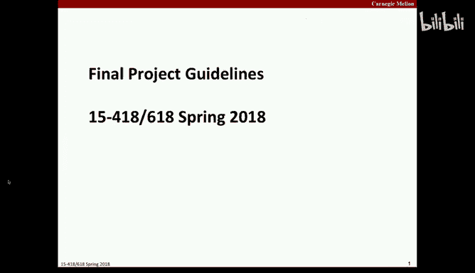
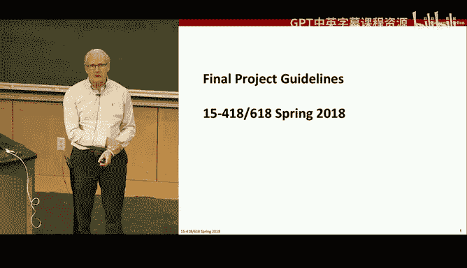
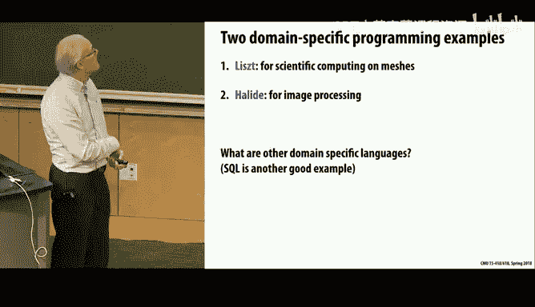
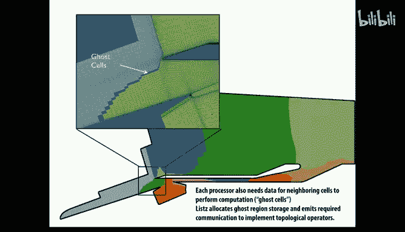
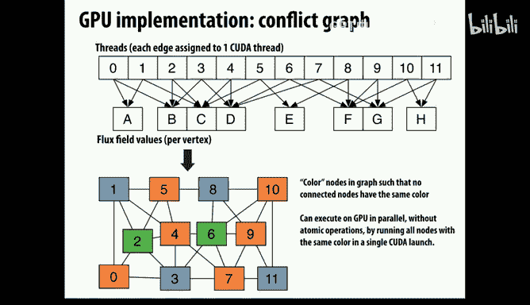

# CMU《并行计算机架构与编程｜CMU 15-418 Parallel Computer Architecture and Programming sp18》 - P27：Lecture 27 - 3-28-18 - Carnegie Mellon University.zh_en - GPT中英字幕课程资源 - BV18b421J7cA

Okay， so I wanted to start today by talking a little about your projects。

 and you'll see on the website there's a description out about some guidelines for the projects。

So what is this all about well， you think about it。

 you'll notice in the syllabus that the project counts for 25% of your grade for the course。

 so that's a pretty big chunk of it。And one way to think about it is assignment2， the renderer。

 coUa code and assignment3， your OMP code， each counted for 12%， so add those together。

 you get something on the score on the same order of what we're looking for。

 so think of it as too fairly serious assignments worth of work that we want to do and we don't measure just by total work you put in。

 but the point is this is not a small thing， this is a big chunk a quarter of your grade for the course and we expect you to make an effort comparable to that。

On the other hand， in terms of what you do， it's really up to you。

 there's a wide range of possibilities。 think about everything that's been covered in this course since the beginning across many different types of machines。

 many different programming models。Many different ways。 And also。

 you can think about many different applications that might have be an interest to you。

 And what we really want you to do is find something that gets you excited。

And makes you really want to put in the effort to sort of dig as deep as you can within the time constraints。

And so this is a case where we really encourage you to look around and think。

And things that you'd really like to study and understand more deeply。So that said。Between now。

 which is the 28th。And May 8， which is when the final exam slot for this course is scheduled from 1 to 4 pm。

 but we're not actually giving a final exam， what it will be as a poster session for you to all come and give little presentations in poster form about your projects and so that's sort of the culmination of the projects and today's the start of it but between now and then you have a lot of due dates and the reason we're doing this is to kind of keep things on a pretty tight track that you're continuously making progress and this is our way of dealing with the fact that you have a very open endeded task ahead of you。

And you have a lot of other time constraints going on between now and the end of the term。

 and we want we don't want you to try and sort of wait for two days before the thing is due and go into all nighter mode。

 which you'll surely fail doing。 So instead we want you to do is sort of keep continuous progress between now and May 8。

So some of these due dates， and I'll talk about a little bit are checkpoints。

 meaning you just submit a brief report describing what you're up to。

 another is a proposal where you give a pretty detailed account of what you plan to do。

The seventh is an actual report that you submit。 And then， as I mentioned， the eighth will be the。

 the poster session。So your big job between now and。嗯。

over a week from now is to figure out what you want to do。What's the topic of your project？

And in general， having looked at this over the past several years and you'll see there's links actually。

 to pages prepared for the， the projects from previous terms。 so you can even look。There。

 and some of the links are dead because they were to now defununk GitHub accounts。

 but some of them are still live， and you can also look at the titles and get a flavor of what's been done before。

And I'd say they generally fall into three categories。

 The first category is there's some really cool application that you'd like to that you're interested in for personal reasons。

 professional reasons or whatever。 And you just would like to see。

 what would it take to make this run well on a parallel machine。

 And there's a vast topic range there。 you could do computer vision， computational photography，呃。

Common tutorial search。Anything that sort of think of all the many things that have high computational requirements and for which there's a value in and potential for exploiting parallelism。

So that's a great area because it's one that gets you excited。

 and it's really fun to work on gut you sort of extend beyond just this course and combine it with other things of interest。

 The one piece of warning I'll have for that style of project is you can get bogged down just。😊。

On the application itself， what we really care about in this course is the parallel part of it。

 We don't care so much about the application。 So I've seen examples where students are presenting their project。

 and basically all they're able to do is get a serial version of the application going。And we go。

 yeah， so why are we supposed to grade this thing？Because they didn't manage to get very far in the parallel part。

 And so you can imagine if there's a big hump， like a big learning curve for you to understand the domain。

There's a lot of code that needs to be written to kind of even just do the application level stuff。

Whatever it is that sort of prevents you from focusing mostly on the parallel computing part is a problem。

 So application。Based ones are great， but just be careful and really think in those terms。

Another would be sort of more focusing on some aspect of systems。

 and this again is pretty wide range of categories。

 You can think about like we were looking earlier this week at various transactional memory and synchronization primitives and things like that and doing sort of comparative studies。

 exploring the Intel hardware support for these， there's a variety of things that are sort of more column core system capabilities。

That you would want to look at。 And others have done interesting things where they embed。

The sortr of extensions into Java and Python that will enable more parallel computing type of things。

 So you know think of it as the new capabilities for writing software that exploits parallelism。

And another is sort of what I'll call platforms， meaning。

How well does this application X run on a GPU versus a CPUU。

 Can I achieve the kind of performance using go or some other slightly higher level language than C or C++。

For parallelism， then you know， how how far can I push that on some system functions。嗯。

Another would be various platforms like we'll talk about today。

 a couple of what are called domain specific languages。

 ways of expressing computation you want to do at a higher level and having the code automatically map that onto different machine types。

And so in general， you can think of there's a range of possibilities where you start with just。

Blank screen。 And you're typing a whole pile of code to make something work。

And over here is another extreme where you're taking a package that the code has already been written by some experts。

And those aren't really directly comparable， but what we'd expect。Is， you know。

 if you're taking more previous existing software， we expect you to push a lot further in terms of measuring。

 experimenting， tuning， optimizing， understanding the tradeoffs between that and and other implementation。

 So you don't necessarily have to write a big pile of code for this project。

 But we expect if you're making use of existing code that you are。嗯。

You know exploringoring even further and pushing the boundaries even further than you'd be able to do if you had to write it all on your own。

So that that's sort of， a general picture of it。 Let me just go over。As far as resources。Well。

 hardware resources， you've already very familiar with the GPUs and the fact that we have these really pretty good GPUs and you have ample number of them makes them a very attractive target。

 you've also made use of the both the GHC， the Zion， you know， the large scale。

Re high performance Zons， both the late days' cluster and the JHC machines。

 although you might be getting sick of those。Another possibility would be and some really interesting things have been done using phones and tablets because inside of those。

 they have pretty interesting GPUs made by arm。And they're not。

As general purpose as the NviIDdia GPUs， but they are ones that you can program and do interesting stuff。

 they're also not that well documented， so you have to do a little bit more detective work to make it work。

So people have done some really interesting projects on that。

 So I mentioned something like a raspberry pie。In the right up。

 which is obviously a really low end machine。 But the fact it's got a GPU。

Means there's actually some potential parallelism you can explore there。On the other hand。

 a few people have said， well， I have a like a two core laptop。

 so I could potentially get a two X speed up。 We're looking for someone more than that， right。

If you're looking for two x feet up， you shouldn' be that's really not good enough。

 We really want things about， you know， looking more at larger scale parallelism than that。

But the point is， it doesn't even have to be a big machine。Potentially。

 if you're interested and we do have some credits available on Amazon Web service servers and you can rent machines。

 you'll find that as you increase the core count of those machines。

 the price per hour goes up quite a bit。But if you're interested in doing that， we can arrange。

Potentially to give you a budget that you could work on。 So you should contact us about that。

 And others， you might find maybe through some other project you're working on。

 you have access to other machines， so。There's plenty of machines out there to use a software。

 There's really no specific requirement on that。You can program in the language of your choice。

 You can。Use some of these available packages and things like that。So， it's very open ended。

So as I mentioned， there's a lot of dates。And starting a week from today is what we want is called a checkpoint on your proposal。

 so。A lot of these checkpoints， the the purpose is to give you a deadline that will anal。

 So to give us a sort of。A view into how things are progressing for you so that we don't find things。

When things are too late， you really run out of time。 So the idea is。

 what we really want is on April 9， a proposal from you。

That gives a pretty clear description of what you plan to do， how you plan to do it。

 what your milestones will be， what your schedule is going to be。

 what you hope to achieve and so forth。 So a pretty detailed proposal。 and what to sort of。

Help you along the way。 Then a week from day to day is what we call checkpoint。

 And it might be that you've already， or within the next day or two， come up and you say， this is it。

 This is the project I want to work on。 This is definitely it。 Then basically， your checkpoint is。

 is sort of considered as a pre proposalpo。 Its。A dry run version of what you're going to write in your proposal。

On the other hand， you might really not be at that point yet。 You're still kind of gring around。

 So what we want you to do is have sort of explored or thought about it or examined。

 looked online for information about， say， three different， you know，3 is sort of a number。

 greater than one， less than5， meaning some number of things that you've really taken a look at。

 and you've really thought hard about， I this good， Is this not what are the possibilities。

 What is the available software， What are the available benchmarks， know。

 is this feasible within the scope of a course。 Would I have do have the background necessary to do it。

 have you do that for several of these， if you still are really not sure what you want to do。

 So that's what the。The checkpoint。The first deadline is， that's a week from today。

 week from tonight。 There's no grace days or late days on any of this。 By the way。

 these are all strict deadlines。And if you miss one， I don't want to know what we're going do。

 but it won't be good。Willll basically come after you。

And without mercy and bug you until you complete the thing。So the proposal， as I mentioned。

 is a pretty serious proposal， it should be， you can think of a proposal as roughly speaking a contract between you and us which you say。

 here's what I plan to do， and we say if you do that we count it as a good project or a suitable project for this course。

 and it will also give us a pretty queer idea， we'll try to scope it， is this a reasonable project。

 is it overly ambitious， does it fall short in some ways is it feasible， those kind of ideas。

And then from then， you really work on the project。And we have two checkpoints along the way。

 which are mostly just how am I doing compared to the predicted schedule I gave。

 I'm either ahead or I'm behind， and I want to adjust my plans as follows。 I've discovered that。啊。

You know， what I plan to do quickly has been less hard。

 I I need to even adjust some of the project goals。

 So to kind of keep up with along the way what's going on。And then the seventh。嗯。

The is the due date for the actual report， the the written report for the project。

 and we expect that to be a pretty full and complete report。Relative to the level of the project。

 and then as I mentioned， the eighth is a post due session。

So the handout on the web goes through all this in pretty good detail。

 except for the poster session it's very vague about and we'll put up more information about that later in the term。

Any questions？At this point。And look at the right up， there's more details like if you。

 if you're doing some other course and you want to do this project， you know。

Or you've done it before。 you have a research project and you want to sort of。

Create a project that is the combined several of these that's okay as long as what you're also using this for is not mostly focused on parallel computing。

 so if you're doing a course in computer vision and you want to take that stuff and use parallel computing and computer vision。

 then that's fine， but you can't double count this with something you're doing where the focus was parallel computing。

Yes， question。A score breakdown。No， the scores are not。 There won't be like a strict rubric on this。

 It will be more。Because there's the the projects will vary widely in scope and style。

 And so there's no strict， you know，5 points for this， three points for that kind of thing。

 It'll be graded more by our review of your reports and。And also， the。The poster sessions。

And I'll just tell you from doing it in the past。It's pretty。

 pretty clear by reading a report and by。啊。Talking to a student via poster session or something like that。

 you know。Is this sort of like a serious project， Is this a project where they really fell short。

 They didn't plan very well。 They didn't。You know， think ahead， they， like I said。

 this one I described where theyd spent a lot of time writing code to play some computer game。

 but they really hadn't gotten to the point where it was running in parallel。Reliably。

Those kind of things， you basically， you can imagine if you were assigning a letter grade。You know。

 is this an A or a minus quality， Is this a B。Something less， you know， you have a。

 I'll just tell you is a。And I think you have this experience when you see the other projects。

 you have a pretty clear sense of where it fits， but there's no strict criteria on how that's done。

And that's part of why we want all these proposals and checkpoints so that we can be kind of in a dialogue。

 even though it's a very large class that kind of keeps you have a sense of whether you're meeting the expectations we really want。

Other questions？Okay， so I encourage you to look。 and it's only a week。

 And I know a lot of you are using Grace days on assignment 4， at least I hope so， because。

Not much has happened there yet， but。But those grace days don't extend to your。You。

Proposal checkpoint。 You really have to meet that deadline。But this should be fun。

 This should be something that really gets you excited， and。😊，嗯。

I hope you can all find projects that fall there。Now， just as a little thing。

 if you really are out of ideas or。I still。If you can stand it any longer。

There's some toy pet projects I have， Pe's a bad term here。With our friends， theette。In particular。

 like it seems like this should map nicely onto a GPU， never tried it， how would that work？

The Zion thighs are sitting there lurking on the wait days machines。

 and we haven't touched them all term。But they're there。 and actually， in the past。

 they've been the engine that people had to use to do assignments 3 and4。And I， just。

 I didn't feel comfortable trying to do that because there's a certain。

Learning curve just to even get code mapped onto the Xion Ps and running and。There and so forth。

 So didn't try it this term。 But if somebody is interested in sort of moving on to those machines and seeing what it would mean。

 And just like you saw between 3 and 4 to make44 viable this message passing。

 I had to sort of give up on some of the graphs。Give up on some of the initial distributions to make it sort of more amenable to a homogeneous。

Partitioning。And that would be a perfectly reasonable thing to do here。

 and even look at it adapting some of the low levelve things。 The random number。

 I think a lot of you did some performance benchmarking and found that a lot of the time is spent by the random number generators because they basically involve division。

 which isn't an energy division。So maybe even looking at some of those low level features。

 not on their own， but in conjunction with other ways you might think about exploiting parallelism。

 so。Anyone that's the one that I'll advertise if somebody's interested that。

 otherwise they suggest you look， and it's okay to do a project along the lines of what people have done before。

 Obviously， you can't just take their stuff and resubmit it。But it's。

It's really okay to be inspired by what others have done。

 It's also okay if there's some paper out there， some research project going on with some new capability or idea。

 This project doesn't have to be original research。 It's perfectly fine to read a paper。 Here's。

Three different ways of implementing locks， something like that， and。You do those。

 you sort of go through those and you run experiments and do testing and evaluation。

 So those are all perfectly fine types of projects。Good。Question。I， so。

I would discourage you from trying FPGAs。And have you ever used FPGs before？And you're like。

 do it in very。 what。So people， I just will warn you off if you're like a hardcore of FPGA person fine。

 But Ill just warn you that the projects people have tried in the past。On FPGs。

 they just couldn't get it done， you know， because it's so much work。

And so I it would be an interesting idea。 but I'm just be very cautious about that。

So you need to think about， you know， whether it's really realistic between now and then to have something mapped。

 if you're inexperienced。FPJ， Ver right person。 then that's， that's a big step for it。 Others said。

 oh， I think I want to learn this stuff because it looks really interesting， well。No。😀Yeah。😊，Yeah。

 well， you can know how to program FBGAs， but to do large scale application is a lot more work too。

Okay。Now let's move on to the topic， we're sort of reaching the point in the course where we're sort of looking at not just how are things done now。

 but how could things be done in the future and getting insights into where the new possibilities might lie。

And one of them is an interesting idea that we'll call domain specific programming languages。

 And the idea is to try and。嗯。Rather than having one language that everybody uses for all applications is to try and say。

 are there certain classes applications that you can find and create a reasonably good way of describing what should be done computing wise。

And therefore， be able to have greater automation in terms of what the compiler is able to do in terms of mapping it onto different varieties of machines。

So that's what we mean by domain specific programming systems。

So you can think of so far what we've looked in this course。 We've thought about both scaling。

 meaning if we had more resources available， how much faster could we run or how much。

How much bigger problems could we solve？And the other we have is in the other direction of given the fixed resources。

 how can we maximize the use of them？B， for example。

 taking a program and making use of the CD vector instructions that are sitting there getting hardly used most of the time。

So those are both sort of the techniques are the same， but they're slightly different goals。

But what we found is there's a lot of little tricks you can play on both sides of how do you get sort of get more performance or provide the ability to map a program onto a larger system。

And part of it is， I think one thing we've learned is that。嗯。

There's just a lot of performance when you run typical programs on typical machines。

 they're vastly underutilizing the available hardware。 So， you know， a standard one is， of course。

 we've assumed as the default here that you're writing in C or C+ plus。

 So you're already at the point when you're down at a pretty low level programming wise and able to push performance and the sort of conventional wisdom is a good sequential program。

 if somebody sits there and tunes it and uses good compilers and。Things without going crazy。

 they can get a sort of 5 or 10 x performance out of it。Of course。

 a lot of programs in the world are written in other languages。 So one interesting question is。

 how much do those languages weve on the table。And the answer is a lot。

 So this is an interesting chart from another location。Where they take the same。Program。

 and they use C implementation。嗯。A you know， a fairly conventional C compiled minus-03。

 And so that is performance of one。And everything else is how much slower it is relative to the sea。

 And what you see is。Java Scala， which is built on top of Java C sharpp， which is Windows。

sortrt of a managed version of C。 Hall， which is a functional language go， which is。诶。

Another managed language。 And I don't know why it ran so much slower here。

 A Javascript was surprisingly quite decent here。嗯。好，对。

But what you see is something like Python or languages。

 purely interpreted languages are typically on the order of up to 100 times slower than。

The corresponding compiled code。 So already， a lot of the world's code is sitting over here。

And running incredibly slow。But our standard is sort of how much below one can we get on this chart？

And if you think back to assignment1， you， remember， we took existing C code for the Manelbroat set。

 and by mapping it into。ISSPC， first by exploiting CMD。And then by exploiting hyper multi core。

 we got something like a 20 x speed up on the gates machines and even for a high end laptop。

The Quad corere laptop can measure a 20 x。 So that's really just sort of taking better advantages of the resources that are built into that laptop。

 not by mapping it onto a particularly big machine。So that's 20 x performance。 Now。

 this was a particularly good case as far as parallel computing goes。

 But the point is that there's a lot of performance。 you can squeeze just on。

 on the same machine relative to。What's considered the sort of baseline。

 which is a well written sequential sea code。But we also found with our various assignments that actually doing this is a lot harder than than it is to think about it。

That it's just a lot of work to take the program and push it into a form that can really exploit some of the capabilities available on parallel machines。

And very different style， you end up if you want to map it into a GPU versus a CPU and even a CPU。

 very different style you get if you are based on a shared memory model versus a message passing model。

So we've already seen that from a softwareer perspective， there's really a almost different mindset。

 how you reason about programs as you move between these machines。

And this only gets harder as you think about what we talked about last time was a sort of heterogeneous where you have CPUs and GPs combined。

 where you have。CPUs with different performance capabilities where there's digital signal processors as well。

 so there the effort to migrate software from one part to another can involve some really serious rethinking of the whole program。

But that sort of the world we live in and will increasingly live in is this heterogeneous machine with。

 with very different programming models。And part of it is to sort of squeeze performance。

 we can see that this comes at all these different levels。

 even in a regular CPU that at the lowest level， we have the potential for vector processing。

 applying the same function over independent data。We have multi threading like or think of even hyperthing。

 where we are exploiting the。Sort of。Unused potential of these multiple functional units and the able to hide the waitency due to memory。

Cash misses on a processors so we're able to sort of squeeze more， we have multiple cores。

 potentially multiple servers that were able to sort of move up to a task level or some more higher finer coarse grain level and think about programs that sort of communicate with each other and interact with each other at higher levels。

So we've already seen even within a conventional CPU。

 There's all these different levels that can be exploited。And this。Gets even more。

Tricky as you add these various heterogeneous somewhat specialized units。So。

And so the problem is that there's no to really get full performance。

 you really have to think at multiple levels here。And so。啊。And so that's already a problem for。

 for software developers and software maintainers。 and it's only getting worse。And again。

 if you think about what is the best programming model to use at each of these different levels。

 you'll find it different that we found we could do this sort of single program multiple data style using the SIMD units or using the GPU capabilities。

We found within a single CPUU with where is shared memory。

 we could use something like Open MP or silk to sort of schedule these different threads and coordinate them。

嗯。And then there's other languages that are used to sort of deal with processing across multiple independent processors and using message passing。

So these are all different abstractions， and they're fairly incompatible in terms of。

Migrating a program from one to the other can involve a fairly major rewrite。So right now。

 the problem is that it's all left to the software developers。 and like I mentioned。

 the example at Los Alamos， when they get a new supercomputer in。

 they have to spend a year just migrating their programs。

 and it's a place where they actually have about 10 different programs and they have 100 plus programmers so they can dedicate the resources to do it。

But it's not really a viable option on， on a larger scale。So the。

 the computer science question then is， can we do better。

 Could we somehow write code in a way that is。Well， map， not just on today's machines。

 but on tomorrow's machines as well without having to do total rewrites up and down the stack and rethinking at every level。

And， and so one way to think about it is what we want out of。Of software。Are three different things。

One is we want it to。cover a wide range of programs。Sor of completeness。

 One is we want it to run fast。And the other is we want it to be in terms of the productivity of。

 of the programmers， how much code they're able to write， how much easily how much effort。

 human effort there is involved in software development。 We want all three of those。

 And like a lot of things in the world， I can give you two， but I can't give you three。嗯。

And so in particular， you could think of。If we look at languages that are sort of widely used。

 we'll count that as a successful language。Well C and C+ plus。

 one of their main strength is that they're very complete。

 You can write pretty much anything if you've given sufficient time and effort。嗯。

And they can be made to run fast。 At least you can do a lot of low level optimization in it。

But productivity wise， it falls a bit short。 especially the more you push up this direction。

 the more you lose in that direction。And you can think of these sort of interpreted languages。

 more abstract languages is down at the bottom， they can do a lot。

 and you can be more productive as a software developer in terms of time。

 But you lose everything in terms of performance。So what we're looking at today is， is， okay。

 what about this third edge of this triangle， Can I have a language that。Well let me be productive。

 but also scale very well。 And what we're willing to give up here is completeness。

 This isn't the language that everyone uses for everything。

 It's more specialized toward particular range of applications。So that's what we want that is。

 and can we find a。Some niche where we can create a language。

 It's a sufficiently large niche to be of interest， but that we can have high productivity and。

 and also good performance。And so this is an open area。

 And you can imagine now this opens you up to many different possibilities。啊。But。

What we'll do today is just look at two such cases。One for doing scientific computing， sort of。

Partial differential equation solution type problems and another if you're doing image processing。

 where there's sort of a pretty well developed concept of what you're trying to do but it's a rich enough range of domain that it's sort of worth the time and effort to put together a system of this type。

You could point to something like SQL for databases is also a language that is very domain specificific。

 but it also gives you this capability， you can write SQL queries and then the query optimizers is sort of a rich literature of how they can take what you're asking for and transform it into very efficient ways to map it onto machines X。

 Y and Z， that you as the user might have to give it a few hints but there's a lot of work being done by that query optimizer to make it run fast on a given machine。

 so that's a pretty good example of a domain specificific language。

So let's look at L， which was developed by a graduate student at Stanford。And it's in particular。

Language for solving mesh type related problems。 Part differential equations are equations that。Our。

Involved both space and time。And they typically start then with a continuous both in space and time。

 but then you discreetize it in both dimensions， in all dimensions by breaking space up into little chunks and doing discrete time stepss。

So， and so this language is called listist。And it's actually an interesting one because it's essentially a language over graphs of sorts。

And so this example， and I'll go into it a little bit more， shows， imagine you had。You know。

 a physical configuration like this where each of these edges was actually a metal rod。

And you started with some distribution of temperatures at these different nodes。

And then you let it run。 And， and basically， you know， the。

 the heat transfer tells you that the amount of heat transfer you'd get in a particular amount of time is proportional to。

The difference in their temperatures。Divided by the distance between them， right。

And assuming theyre all the materials are all the same thermal conductivity。

 And so you can imagine that what you want to run is this simulation where each time step you're doing a little bit of heat transfer each increment and updating it。

So that's the context here。 And this is already an abstraction of the physical world you don't typically have。

A graph of nodes connected by rods。 What you have are blocks of you know， discrete chunks of volume。

 and they're adjacent to each other。 And the heat fluxes through the face they share between them。

But it's the same general abstraction。So the idea of this language called list is it lets you express。

U。啊。Quantities over。That over， a graph， just like an array。

 gives you a way of talking about something over a rectangular collection of， of indices。 Think of。

 of generalizing from just。2， three dimensional indices to graph。And the idea of a edge between them。

Being。You know， a relation between two different indices。 So in general。

 it has this fairly abstract idea of a graph。Of vertices。 And you can define， for example。

 with a position。Is a three dimensional X， Y， and Z position。In space for each of these vertices。

And similar， you can define the temperature at each vertex。And the flux。

 meaning the flow of heat into or out of a a vertex。

So you're sort of given first you define a graph or this structure， geometric structure。

 and then you can define field quantities over that structure。

And then you can write something like this time step where you say。For every edge in this graph。

Pick out the head and tail of that edge。 Comp their distance between them。As the compute the。

The Cartesian difference between these points in space。

Compte the difference between their two temperatures。And then。

Update the flow into V1 and the flow out of V 2。Is based on the difference in their temperatures times the reciprocal of the distance between them。

And。I honestly， this code is right out of a paper。And they don't give much explanation of it because somehow。

 somehow in here， you should also be updating the temperature， but they don't show that。 But anyways。

 there's also a notion of iterations built in that。On each time step。

 you're sort of computing the next state quantities of the system。

 And then you move on to what that those values， then you update。Sort of across the board。All the。

 the quantities to have that state。 And then you recompute the next state。

 So a standard simulation model like you've seen。But the main point being that you have this sort of abstraction of a mesh。

Or a graph。 And this ability to describe quantities over that graph and iterate over the the edges and vertices in this graph。

And compute quantities。 And then in general， you can compute something that is a。You know。

 this is just a scalar computation。But there's also reduction operators in here that you can describe。

Multiple updates of this quantity because of the different meshes。

 So it looks sort of a bit like it's a sequential computation， but。

Since these reduction operations are already kind of known and understood。

 they can kind of do a compile time analysis to figure out， oh。

 heres the values that are being merged together to compute。The value at this particular vertex。

So even though it has this sequential look to it， that's not necessarily。

 it has to be implemented sequentially。And you'll notice that it's all what they call single assignment that each value is defined uniquely in terms of the new state values are defined uniquely in terms of the current state values。

 and so from a compiler point of view， it makes the analysis of what gets updated by whom much more straightforward。

So they've sort of taken away a lot of the sort of artifacts that we build into C code that are sort of more based on this imperative computational model。

 and it is much more of a functional model。For those of you have taken 150。

And it actually has a richer understanding than just simple graphs。 It has a notion of。

Of a three dimensional partitioning of space into cells。

And a cell is in the simple world are just cubes， but a cell can be actually an arbitrary polygon here。

Arbitrary polyhedron， excuse me。 And so each cell is characterized by having a face。

And each face is characterized by having a series of。Of vertices around it。

 And each edge is correspondent to to vertices。 So it has this idea built in of。

 of starting with a vertex， connecting by edges， creating a face and assembling polyhedra。

 It has all of those geometric concepts built into this language。

And you can express computations over all these different levels of abstraction。

So the idea of it is the program then just gives a very abstract description of this computation being done over this。

This geometric structure mesh。And then it's up to the compiler to magically somehow figure out the best way to actually implement this。

And what's interesting is， as a result， it's not given any real detailed description of how this has to be implemented。

 and it leaves the freedom to the compiler then to choose very different implementations。

So let's look at this。好。And so it can identify where the potential parallelism。

 how should values be grouped together and what sort of control flow should we build around it to do this these operations and how to synchronize things。

which is in general， very difficult to do in a general purpose programming language as this shows in general to figure out the data dependencies between different array elements is impossible because people can throw in arbitrary functions that mess up any type of pointer analysis or dependency analysis so there's work in the compile world to do this。

 but they often really can't do it because basically the underlying what we're really trying to compute is obfuscated by the the way we've expressed it in sequential code。

So with LIST， it's able to do this to dependency analysis because it already is given this as part of the compile time effort。

 what the mesh structure you're trying to compile for is。

And so they refer to it as a stencil in this world。 You'll see that terminology in。

Astentencil is essentially just the the graph structure。

 the structure of the underlying physical domain。 in particular。

 what the read and the right dependencies are for the different parts of the geometry。 So。

 for example， you can quickly evaluate this code and see that for each edge， you're having to read。

The values。That are associated with it， its two vertices。嗯。And。

 and so you can figure out what the data dependencies are， and potentially。Like that this would。

 this value would be read then by not just by three different neighbors， four different neighbors。

 So you can even factor in sort of。Where are the readers and writers of any given data。

And it's partly because the language is very restrictive。

 You can only refer to mesh elements using these graph these operators that will extract different components of the mesh。

As I mentioned， it's this single static assignment。

 so you cant each value quantity has a unique definition。And there's standard operations。

 reduction operations that understands issues about associivity。Prinncipples of those operations。

So the language puts in a lot of restrictions。But let's now look at two very different ways we might map this on parallel machines and how LISistT is able to generate two very different styles of code from the same original description and how it might do that。

So first， let's look at the spatial partitioning similar to what you're doing in assignment for。

 that we want to take this mesh and split it up and map it onto multiple different machines and have them interact then at a fairly high level。

 a coarse grain level of。Mes of communication and synchronization。嗯。

So assume this is sort of directed toward an MPI style mapping where we have only message passing primitives between it。

So。And not this can go beyond a sort of simple grid or a rectangular mesh to arbitrary meshes。

 which is what you encounter， for example， if you want to model the flow。

Of air across an aircraft wing。 you have to account for all the。

The irregular shape of that wing or fluid clove through a sort of large and complex place。

 So the mesh is not even a uniform mesh， typically。

But there's existing tools that can do partitioning。 And they。

 they basically are trying to do partitioning based on some metric of trying to keep these different partitions about the same size in terms of computational requirement grouped together。

 minimize their boundary。 There's various algorithms for doing that。

 But that that's sort of a separate concern。 That's already。An idea for which there's existing tools。

Because as this example shows， you know， this mesh can be very non uniform。

 If there is particular points of interest， you might put a lot of mesh points near there。

And as you've discovered with assignment 4， typically。

 what you want to do with this petitioning is then create a set of。Of cells or meshes。

 grid that are are ghosts。 They're sort of copies of the values from adjacent parts of the grid。

So that that you only read in order to do the state computation within it。

 And you're finding that right now that you have to have a copy of the。

The rat counts along the boundaries that you're exchanging with each other。

 So that's the idea of ghost cells。And you can imagine it。Doing it in C， plus plus or C and MPI。

 as you're experiencing it， it's not too horrendous a job to do on a。Simple rectangular mesh。

 But imagine the work you'd have to do to keep track of all these ghost cells on this very irregular partition irregular mesh。

And this irregular partitioning。But the。The， the point being that the Wist compiler can do all this automatically。

 It's not that difficult to do because it has this dependency information that can make use of it can determine。

How many ghost cells are required？Comb that the sort of read only data and set up the necessary communication to communicate that back and forth between adjacent processors。

So that's one direction。 And another very direct different direction is， well， okay。

 what if I wanted to map this onto a GPU。And there， typically， we're down at a much lower level。

 instead of partitioning into these very coarse chunks and having those run somewhat independently。

 we're down at this very low level with these individual cells。That are affecting each other。

Based on the， the sort of structure of this mesh。And so typically。

 what happens is imagine we want to assign a thread for each edge。

And we're doing this computation where， we're updating the。The flux。Into each vertex。啊。For。

 for each edge。In， in this mesh。 And so typically， then for a given vertex。

 there'll be multiple writers of that value。And now， if we map that onto GPU。

 we've got a problem that。we can't normally do multiple writers to the same value。 So， of course。

 there's an atomic ad capability in。Kuta that's supported， but it's very slow。

 It's really bad performance。 It's not really what you want to do if you don't have to。

So you have this problem that you have these sort of right conflicts and how can you deal with it？

Well， the good news is that this is totally static。 as part of the compilation process。

 we have complete information on which for each of these vertices。😊，Which edge values。

Will have will be directed into them creating updates。And so what we can do is。

 as a sort of scheduling trick。That we create what's called a conflict graph。Where we say。

Along the top we'll say there is a conflict， for example， between 0 and one。

Because they both cause a right into the same vertex。And similarly， there's a conflict between。0。

2 and 3。0 and 2。And 0 and 3。Because they all are writing into B。So， that's。Something and easy enough。

Thing to identify。 And then what we do is known as graph coloring。

And so the idea of graph coloring is that we assign a unique color to each node and a graph in such a way that no two adjacent nodes have the same color。

And you probably know you go， wait a minute。 wait a minute。 That's an NPP complete problem。

 You're turning a perfectly fine polynomial application into an NP complete problem just to do compilation。

 That sounds like a really bad idea。But the truth is， actually。

 graph callinging is also used for doing register assignment and compilers。

 So there's a lot of problems out there in the world that to give the perfect solution is really。

 really hard， but to give it a quick and a decent solution is not difficult at all。

 There's sort of greedy algorithms， various other ways to do it。So， and。

What happens if they're not optimal is， okay， it will take a few more steps。 But the point is。

 if you have a coloring of this graph。Then that can become a schedule。 You say。

 I'll first do all the。The yellow updates。So I'll let。I'll schedule the computation for。Thread 0，5，7。

 and 10。 And then you'll do all the blue， then all the red and all the green。

 So you do four sort of waves。And you。And out of that， getting a full computation。 And， of course。

 if the mesh is at all regular。Then you can typically get it so that you have even better utilization than this。

But the point is that that something， this is something that。

If you can reduce it to a problem where it's just。Come up with an algorithm and make it work。

 Then you can usually do a pretty decent job of it。

So the interesting point is that you see this is a fundamentally different。

Mapping onto a message passing。Cluster versus onto GPU。

 But they both started from the same high level description。

 And it was possible because in both cases， they had a。

啊。Of the this sort， the geometry。Fully characterized and understood。

 and they could examine the code and see what the read and write patterns were here to make it work。

Good。So pretty interesting stuff。And what they found was。Mapping， and of course。

 you always have to take these with a grain of salt， but what they showed was。

They can sort of get the same type of performance。That on a variety of different applications。

That people are getting using hand tuned code。And in some cases， better because again。

 you think of the。The effort， the compiler is able to sort of。

Put in a lot more optimizations than a human would be able to do reasonably well。

So this was a really good example of domain specific language。 It's you can't write a。

 You couldn't write a。Search engine in this code。It's really only it has this built in notion of this geometry that's related to。

Spatial partitioning VMmehes。嗯。So it has that abstraction and by building it up against that abstraction。

 it gives you this very high level way of expressing computation。

But that allows the compiler to then do very clever things。Okay。

 now let's look at a different language called haide。 and haide was developed originallyly by。

A student for his PhD at MIT and it's become widely used。

And so it's specifically for image processing and image processing， of course。

 has become one of the killer apps out there because there's so much interest in in photos， images。

 as I mentioned， the whole idea of what a camera is。

And what it's able to do is going through these vast transformations that。嗯。

It is really pretty exciting。And in particular， this is a serious， it started as a research project。

 but it's a serious production system now used within Google。To do their。

There are a lot of their image processing type of things that have to do with their photos。

So when people upload photos to Google。These all go through some type of haliide generated code to do the processing。

So let's just spoke a little about what a typical image processing application is and how that's done in Hawi。

So， this code。嗯。It's sort of an extremely simple example。

 but it shows a typical operation that's often called a convolution。And the idea is， you have some。

We've seen this already， some little。Function over a set of of adjacent grid points in an image。

 A pixels in an image where you want to do it a combining an arithmetic combination of these。

Within this window into each point。So this code here is just taking the average of all nine points。

The neighbors plus itself and replace it so it updates image to just be the average of its nine nearest neighbors。

So that's a pretty。It's a very simple type of thing you might do。And so for example。

 if you start with a image that is。You know， a standard image。

 you get a little bit of blur out of it through the averaging。And there's other versions。

 if you just change these coefficients， you can create ones， for example， to smooth out edges。

 to remove noise， to enhance edges， various things。 So this idea of convolution is。

Pretty much the basis for a lot of filter operations you'd want to do。

So let's just look at at what goes on here In this version。

 then if we look at how much work we have to do， how much computation is required。

 You'll see that it's。9ine operations per pixel。To do。All these multiplication on the order of 9。

Mplications in additions to do this averaging across this little window。And in general。

 imagine this window isn't three by3， but it's just n by N。 It's a n by n filter。

 Then the sort of work we have to do is n squared by the times the width and the height。

So as N grows， that's obviously going to get a little bit big。Well。

 there's one trick that you can apply。Which is to instead of doing all nine points at once to do them first horizontal。

And then take those values。An average M vertically， the same three by three。

 And if you think about it， you'll get the same result， right。

s are an average of averages is also an average。So if you average first in X and then average in y。

 you'll get the exact。 we're assuming it's associative。 And I know it's not really。

 But if we and distributive， if we make that assumption， you see that you get the same result。

So that's not true for every set of coefficients。That you might want。It's definitely true for this。

 If you think about it， like if what it means is that this。This kernel， as they call it。

 has to be decomposable first in X and Y gives you the same result as you that it's possible to do that。

 and it's certainly easy to do it here。And so why does that matter？ Well， if you work it through。

 then you actually reduce the amount of work。From n squared to 2 n per pixel。

So you actually get a redduct as n gets bigger。As you know。

 the difference between n squared and 2 n can be fairly substantial。

 So this is actually reducing the amount of work required。

But one effect it has is it requires me in this code， at least two。Create an intermediate。A value。

 which in this is called tempemp Buff。That represents sort of the first。

Let me make sure I have the right order。对。That is for every。A point。The。

 the average of its the three horizontal pixels for that。

 I'm having to create a new array called tempemp buff that's filled just with that first pass of the average。

And so that's what's shown here is I'm starting with an input。 I'm producing an output。

But in between， I'm also producing a array that's sized roughly the same size as the image。嗯。

Of tempa。So let's look at what this means in terms of memory accesses。Well， the good news is。

When I'm doing the horizontal stuff， you can see that I'm actually getting perfect utilization out of。

Out of the cache， perfect locality。 I read in the input。

 but I'll use it three times or n times in general， as I make a pass horizontally， right。

Ca I'm just sing this little window along。Horizontally。

 and so I'm just picking up the the data and I'll reuse assuming there's any cash at all。

 I'll get full reuse of that data。 So I can't really beat that。And similarly， if I look at the。

嗯。But the thing that bugs me is this temp of。Because。I'm having to write a full。

 the full array of that temp buff。And Ill。I Ill be reasonably efficient about writing it。

But it's still， it's there。 and， it doesn't get much reuse out of it。Now， on the bottom part of it。

Excuse me。😔，Let get this， right。On the bottom part of it， I'm。You'll see what happens。

If I look at how tempemp Buff gets used。For a given value of。Vertical level。 What I'm doing is I'm。

Sort of scanning through。3 rowsworth at a time。To pick up the。The values。In， in there， because I'm。

 this J J is varying between 0 and 3。 So I'm going across three rows。

The good news is that I will do that。First， for one row， and then the next row。I will。Scan it。

 So I'll make reuse of two of those three rows。 So if we assume。

 and it's not unreasonable to assume that the。Cash is big enough to hold a window of three rows。

Then it will get decent cash performance。But not， but it's still。

A little bit nagging that I had to create this temp buff at all， and it only gets used。You know。

 even though it's a big array， I'm actually kind of rolling through it in this limited way。

So the question becomes， is there something better I could do to even avoid creating a temp off of this size。

 make it smaller and somehow。keep reusing the box within it so that I don't even pay the the。

 the coldness。Of， you know， getting the first。wordor out of cash block。

 which is what this is going be doing。 So can I somehow shrink this temp up down in a way that then I end up hitting it all the time。

You know， except for the very first time。 And I I keep reusing that same buffer rather than here where I'm sort of scanning through it the first time I'm filling it up。

And the second time I'm using it。 But each time， if we assume the image itself is bigger than a cache。

 which is not unreasonable， then。II'm getting。Decent， but not great cash performance out of it。

So that's the issue we're taking up here。嗯。So here's another version of it that's good for memory。

 but it involves more work。And the idea of it is， too。Look off at my。Final output。And say。

 what do I need to compute one row's worth of the output？Well， I need three rows。Of some buffer。

And I can compute that three rows of the buffer。Fer an the race here。

Based on just three rows of the input。And so it sort of limits the size of this buffer to be just enough to handle one row。

 And the problem you'll find is that then you end up doing wasted computation。Because。

 I'm gonna keep。Overriding these values in this buffer。 So I'll lose the values。

I won't be able to reuse them。At least in this code。But there's another version of that。That says。

 okay， somewhere between these two， if I。Say there's some number of rows I'm going to create a buffer for。

 I'll call that chunk size。And I'll size that。Small enough to fit in a cache。

 but big enough to be more than three。Then as you sort of grow that up to some limit。

 you'll be able to get something that has more the efficiency of the first one and the locality of the second that you'll keep all these updates within a small buffer that can be continuously written rather than written once and then read back once。

So that seems like a fairly minor thing you might want to do。

 But these are the kind of things image processing people worry about。

 And they imagine a longer chain of filtering that you might want to do on more complex filtering。

So we could put this all together if you were given as an assignment saying， make this code run fast。

Presumably， with some effort knowing what you know now， you could do it。This would involve。upp here。

Breaking up the image in sort of horizontal slices。Using Open MP to do that。And then。Breaking。

Into blocks of size，2，56 wide and 32 high。Of the image， So that。Regardless to the image size。

 you sort of restrict how much data you're dealing with at any given time。

You can fuse these passes into one using the tricks similar to what we've seen， where we'll keep a。

A small set of temporaries in the cache。And then on top of all that。

 we'll use Cdy vector intrinsics to make it so that we're getting， in this case。

8 wide parallelism out of it。 And this was written in in SSE。

 So now if we went to port this to A V X。We can make it run faster， but we have to do more work。

 So the point is。You could write this code if you had to， but you really don't want to。

So this idea of halightide is to， again， give you this very high abstraction of what are you trying to compute。

And this is the code that it writes to do the blurring。 So it， it has the idea of a 2D mesh， know。

2D array of pixels built into it， just like you would with image processing。

 And so you can express this operator。 The blurring is the average along the。

horizontalorizontal dimension， blur X。 And then the output is the average along the vertical dimension。

 And so that's all it takes to express this operator。

And then you can basically build up not just this one filter。

 but you can build up a chain of filters and other operations that you'd want to perform as sort of a series of compositions of functions。

 basically to do this。And that creates what's called an image pipeline of where you start。

 the different operations you perform on it to get to the final image。So think of it as a pipeline。

 but。It's not necessarily the case that you want to do the pipelining as if you all do all of。

Of each step as a discrete step across the whole image， as we've seen， you're actually blocking it。

 merging it， combining things。Spttting it up into horizontal layers and rows。

Slices and various tricks like that that are essentially fusing together parts of this pipeline step。

So that's what's clever about ha liide。Is that they not only give you this high level functional description。

 but then they give you this language you can use of how it should actually be mapped onto a particular class of machines。

 In particular， it says what I want to do is go in parallel over why。

I want to break up into tiles or chunks of。widthth 256 and height 32。

I'm called the local indices within that tile X I and Y I that I want to be able to do S vector operations over Xi over the horizontal dimension。

And so， you can express。Using this notation， you can think of it that this is what you want to do。

 And this is a high level description of how you want to do it。

And this is what gives Haylightide its sort of ability to work in a more commercial。

 professional setting that it's not trying to be the perfect compiler that does it all for you and take it or leave it。

 It's giving the users some control over the mapping so that they can kind of do various levels of tuning。

And。嗯。I can see。 I'm going defer some of this for next time。

 I I'm going to keep talking because this is pretty interesting stuff。

But let me just jump ahead to some interesting work。Here， worked on。Here at CM MU。On saying， okay。

 you've got haylight。 It's this high level language， and it has this。Scheduling notation。

 now you can think of the job of an optimizing compiler is to drive those schedules automatically。

 the mapping part of it。And what this PhD student was able to do was to succeed in that。

 And this is a collaboration actually， between people at CMU and people at Google。And in this graph。

 everything is normalized。 So whatever the fastest implementation is。Has a performance of one。

And you'll see that the。Yellow is sort of the simple one。

 The blue is what some human halight expert did to make it run faster。

 And then the various shades of red are what the compiler was able to do at different levels of optimization。

And in general， you see that， the， in a few cases， the human outperformed the。Compiler。

 but not very many。And they actually did an experiment where they took two ha liide experts at Google。

And gave them two hours to optimize a particular application。A particular several applications。

And the halight。R in a matter of seconds。 So it， it didn't improve over time at all。

 And you see that the experts were able to tune their code via various， you know。

 trying different techniques， different ways of partitioning it and so forth。 and typically。

But typically， the， the actual hay liide compiler outperformed these human experts。So in one case。

 this human was able to beat the compiler。 But the point being that。You sort of。

It's an interesting way to do something you first provide a capability where humans can then do the tuning and then you try to figure out how to beat the humans at the tuning。

 but you still have this underlying framework that makes these sort of optimizations possible。

So those are both examples of。Of domain specific languages。

 And there's others out there that are maybe a little less specific。

 Hadoop is this very general purpose framework used for distributed computing。AGra lab。

 you might recognize the logo。Was work that was originally done here。For doing， basically。

It wasProd a machine learning， but it was。Thank you。Computing functions over graphs。

And there's been various ones like that， so this isn't unique。

 but it's especially to map it onto what we think of as the computers of interest to us。

 these two projects I described are especially strong in that aspect。

