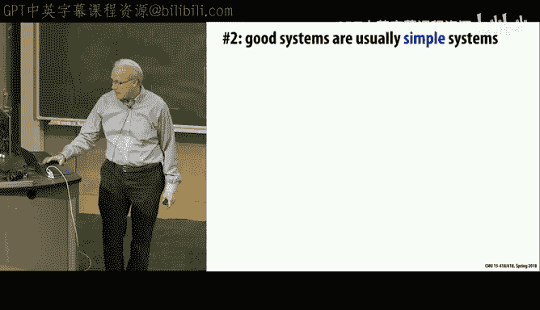
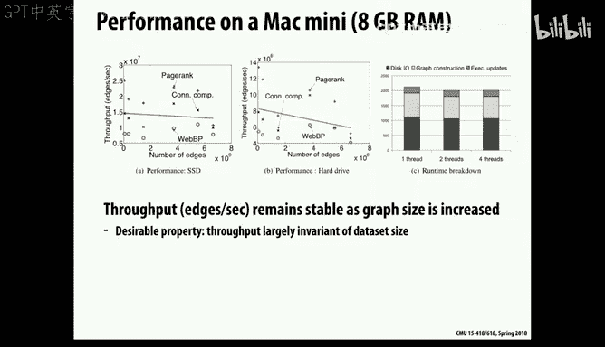

# CMU《并行计算机架构与编程｜CMU 15-418 Parallel Computer Architecture and Programming sp18》 - P28：Lecture 28 - 3-30-18 - Carnegie Mellon University.zh_en - GPT中英字幕课程资源 - BV18b421J7cA

あ guys。嗯。Sorry。I did go through these slides and make some changes， but I didn't change everything。

So today we're going to continue the discussion last time was on domain specific languages。

 meaning whole new programming languages that were designed for specific class tasks。

 there's a much larger collection of examples of what you'd call domain specific programming systems or packages that give you。

The same general capability， but they don't try to invent a whole new language in the process。

 And so what we'll look at today are some specific ones designed for describing computations on graphs。

And the idea of it similar to before was to say， look at。

There's no way we can have the universal system that gives you。Performance， high performance。

 especially on these sort of funky parallel machines that we've seen。

And they give you complete generality and that are easily expressive and easy to write things in。

 So what we're willing to do is， is compromise on two of them。And one。And exploit。

So you remember that picture from before？We said there's performance。There's completeness。

And there's tenity。 and then there's。Ease of use or。Let's call it productivity from a。From the。

Software developer's perspective。And so something like C or C++ is over here where it's a very complete language and if you're willing to work hard enough。

 you can get good performance。But it's not highly productive。

 You have to rewrite a lot of low level stuff。And so what we're looking at is more in this range of domain specific。

And like I said， there's some that have created whole new languages。

 but a more common thing is to just create essentially a package。

 a system that people can express it often in，And actually。

 by writing code in some ordinary standard language in a way that but。

In a way that a lot of the work is done for them by the system in terms of the compiler。

 the runtime system， and the various libraries involved。So we'll look at。Some more of those today。

And the topic will be graph， what's called graph analytics。 And this is a fairly big thing。

That has been。Really started in the early 2000s。Of recognizing that there's a lot of very interesting graph structures out there and analyzing just the form of those graphs can give you a lot of insight。

So the original， one of the most prominent ones was that Google was started by two graduate students at Stanford。

 as you know。 And they what they observed was that if you look at the graph structure of。

Of web pages where the edge the nodes are pages and the links are references from one page to another。

That you can infer a lot about。Which what content is sort of the most informative by looking at that and came up with the algorithm called Page ranknk that they used for that purpose and similarly these things are' used to analyze the patterns of behavior and social networks so on a graph。

 for example， of friends in Facebook or Twitter followers or any other kind of structure you can come up with where there's some relations。

 just analyzing the overall structure of that can be very insightful and there's。

Many companies have built major businesses on this， and it's an active area of interest。

 not just among computer scientists， but actually social scientists have。Created whole new ways of。

 of doing research on communities， groups， people by looking at just interactions， things like。

 are they members of the same club， are they。Anything that could could form some relation becomes then potential analytic idea and the challenge is that these graphs can be extremely large。

 they can be millions or billions of nodes in them or edges and so mapping them onto a standard processor is difficult and also the algorithms themselves you don't want to have to reimplement the same algorithms over and over again。

 so it's sort of the perfect area for domain specific capability。

 something thats specialized to graphs can scale the very large graphs and easy to to do different types of analysis on it。

And I'll mention there's a large collection， there's a project at Stanford called SnNAP。

 and the person behind it is named Yuri Lescoitz， who did his PhD here at CMU on scalable graph algorithms。

So， so again， theres a opportunity for abstraction。 And the main point we have is the。

 the idea of a graph is already an abstraction， A way of abstracting a away。

 all these different relationships or things we might want to monitor。

 And so let's build on that abstraction。And。So， again， we want to think in sort of higher level。

 What are we trying to achieve in this。 One is to say。How much can we take over， you know。

 how much can we move over in this direction by providing features that。

Are are common to this domain that would take a lot of work to write the low level code for。

 but we can provide in a very general way。And。

On the other hand， we don't want one of the tricks is。

There's already a sort of pretty good body of knowledge that the experts have in how to get performance out of these kind of algorithms。

And if those can't somehow be incorporated into。A system like this。

 then people really adopt it if they can get much better performance by rewriting the code even as painful as that might be and and optimizing it in that direction。

 then at least some will and you'll lose some of your potential benefit。

 So you really want the ability。For these systems to achieve the same kind of performance。

And that can come in two different ways。 One is that the code is just so incredibly clever that it does it automatically。

And the other is to give the system users， developers enough hooks into it。

 enough little levers that they can push and pull to get the kind of optimizations they would be doing if they were doing it at a low level。

 And so we've actually seen examples of that when we discussed this hide image processing。

Program a little bit abbreviated in the presentation。

 but one of its really interesting features is it gives you a separate language for describing how you're supposed to take this image processing pipeline and break it up by how you break it into phases。

 how you chunk up different parts of the image， how you map things on disD vector units。

 a lot of the low- levelvel stuff that programmers would be doing down here。

 that can be done by just saying do it this way， doing it that way。

 and the program will do it for you automatically， the system。And so again。

 that's an interesting way of putting the rather than just trying to achieve the perfect program that will figure it out automatically。

 do it in a way that the users can do tuning。Without having to rewrite everything from scratch。

So we saw that， that LIS was a very automated system。

 it kind of did the mapping very sophisticated compile time analysis， and the hellide。

 at least the base level hellide， was sophisticated。

 but it relied on the user to do a lot of the optimization issues。And so again。

 that's part of the goal here， we want this to have expressive but also be able to。Let the。

The system and either through human guidance or automation， be able to incorporate the best。

Feature is in terms of getting performance。So let's look at Page ranknk， as I mentioned。

 it was developed by Page and。And Bn， back in 1996， ancient times。And was the basis， as you recall。

 they dropped out of Stanford， never have graduated。嗯。And founded Google。

Which was started in about 2000， 1999， I think。So the idea of it is that。To basically say。

It sort of goes to the reason why。Let's see， let's pick somebody you might。

Who's it to the Jersey Shore， Who are those women。嗯。

I can't remember their names The reason why some people are celebrities is because they know other people who are celebrities and they become celebrities。

 they have no intrinsic value at all。But because they know the right people。

 they suddenly become celebrities and people start following。

 So that's roughly the idea of page rank is that your importance is given by whom you know your connections and in particular。

 the idea of Page rank is。From a web page is if there's a lot of pointers to some web content。

 it's a pretty good chance that's sort of an authority on it， that that's like the reference one。

 and so when you're trying to return which are the most applicable page range to a particular query。

 you tend to rank the ones higher that seem to have some trust or level of trust or authority as designated by these links。

And so that's the basic idea of pay rank is that you're ranking。Is based on。

On the ranking of your neighbors。And so there's sort of this seemingly circular definition。

 But what it actually turns into it is an iterative process that your。

 your value is obtained by sharing value with others。 So this might start off initially with。

As the initial values is how many inward edges are there to this， and then it iterates。

 and it will tend to make the sort of。The nodes that have a lot of in。Those things coming into it。

 this sort of celebrity ranking will flow into them from their other places。

 and their weights will go higher， our value。And this alpha is put in there to make this a stable process。

 that actually technically what you're computing is the first eigenvector of a very sparse matrix represented by this graph。

And so by making this alpha be some value that。啊。something like 0。9 or 0。85。

It lends some stability to the things so it actually converges。And。

Payrank is often used as an example of a typical graph place。

 but keep in mind it's a rather simple one compared to what people do。

 and Google is well beyond paid rank as their main indicator of ranking。

That's part of their secret sauce of all these search engines is how they do their ranking。

But the point is that we want to do some type of iterations where on each step we're computing some information。

 we're sort of getting information from our neighbors。

And combining it together and then using it to update a local value。

 And so this iteratively goes across the whole graph。

 across all the vertices over and over again until you reach convergence。

And one feature of it is that。That it will actually converge to a unique value under sort of mild assumptions and so it doesn't matter what order you do the iterations in。

 you can do know how you do the updates and things。

 you're all going to end up in the same place no matter what。

 so it gives a lot of options in terms of implementation of how you actually schedule these updates。

So there's a project called GraphWb， which as you know， is the inspiration behind graphra rats。

That was started at CMU by Carlos Que， and then he went off to the University of Washington and about the same time started up a company based on GraphLb。

That was commercialized， had to go through a couple different names because of trademark infringement questions。

Turned into a company called Turi， which was required by Apple。For a lot of money。 So I'm。

 by the way， planning on the same thing for graph rats。

But the idea of it is to provide a sort of framework for describing these graph algorithms like Page ranknk and ones like that。

But rather than inventing a whole new language， it just invents a way that this is embedded in C++。

And a lot of the original interest were this because the assumption was the only way you can scale to。

Graphs with millions or billion of nodes was to map it onto a huge cluster of machines and use something like Hadoop or one of these distributed system。

Frameworks to do it。 And so the original focus was to， how do we map this onto。

Coss of 100 or 1000 potential machines。So let's just take a little look at GraphWb and how it works。

 and so we can think of again， there it's based on this idea of a graph and there's data associated with both the vertices and the edges。

And this is sort of the global state at any given time。

 we can examine the values of all these data on the edges and vertices and say that's the state of the graph。

And then what we do is some rules for how do we update that state and how do we do it and when do we know that we're done？

And so again， there's this sort of notion for each vertex does not have sort of information about the entire graph。

 It just has the ability to access information about its neighbors and the edges connecting them。

 and we assume the graph is static that it will stay the same during the whole computation。

 So we'll call that the scope of a vertex。And so then in using C。

 you're actually writing functions in C to do this， you can describe。

The computation you want to perform。And this would be the one we want to do。

 sort of the single step that we want to perform on each vertex of the graph。

And we have some primitives like number， the degree， how what the out degree is。And we have。

Some iterators over the set of neighbors of a node and so forth。And in this particular case。

 we're using alpha equals 0。85， but you can imagine it's a fairly easy， as you can see。

 it's a very easy thing to write this kind of code。

 sort of this very localized computation that describes what each increment should be。呃。

And in general， it describes a little bit more than that。

 it will describe issues about how to perform this computation。

 potentially this is sort of a gather we're taking the information and we're pullinging it in and updating a node。

 there's a comparable scatter of pushing information out。And。

Also to signal to the system when there's been a change so that it will know which nodes need to be scheduled for more updates。

And ultimately， some way of being able to detect convergence as well， some criterion for that。

And then from that， the system is able to generate the code。

In C plus plus that actually is used by the execution。 So it takes that。

Coode that you provide and sort of expands it and stretches it and augments it in ways that give you the individual components that are needed to do the computation。

And so。You'll see that there's code here for the gather meaning pulling information in。

Both at the edges and the nodes and to apply to sort of the update operation you want to perform。

 and then potentially to scatter information out to the adjacent edges。Which doesn't happen here？

So that this part， though， is done automatically。And so。

Now we've given these sort of primitives of what we want to do， and then there's an engine。

 sort of how does that information then get turned into actual computation？

And you can think of it as at some level， just there's some type of a scheduler that keeps。

Quuing these vertex operations to be performed， and then in some order just keeps doing those over and over again until it decides it's time to stop。

And one way is that the。The code will explicitly provide a signal。For example， this will say。

So the the signal the。Fction signal is given by vertex。

 and it's a way for the signal to tell the vertex update to indicate to the scheduler that it should reschedule an operation either on this node or on one of the neighboring nodes。

And so it's sort of like an event propagation that if there's an update in one place that could affect the adjacent ones。

 and so the scheduler needs to know where these updates are taking place。

And this is a simple example that it's allowed to do up to 10 updates on the node。

But you could also do other versions that are designed more to say if there's sufficient change。

On some node。Then signal。Then signal that。 And also various ways to。

 so you say perform scatter means。There's some information。

 there I've exceeded some little tolerance bound here。

 and therefore the neighboring ones should be updated。

 and so you can imagine that if you just thought of this as just a bunch of updates occurring on this graph。

That by signaling which ones are changing， that sort of propagates the set of updates that take place until ultimately everyone's quiet and you say overall the graph is converged。

🤧嗯。And so the。GraphBab， because it's sort of designed to be very general purpose used by a lot of people for a lot of things。

 has various different options on how this is done。In terms of consistency rules。

 and so one is a very relaxed consistency that just says。

 just do whatever you want whatever you want， but others give a little bit more constraints。

For example， are you allowed to do a read and a write on the same vertex at the same time or the same ar at the same time？

So those are all possible options that are given。And also。

 there's different scheduling rules you can give。 So one version is synchronous。

 which looks like our， our synchronous example that says all the updates are computed。

And then the state has changed。in this example， what they say is imagine there are two copies of the state。

 so at any time you're computing the new state， in this case， B based on the value of a。

And then B becomes the current state， and then you start reusing the data structures from A to say that will now become the new state。

 so just the same idea as we've seen， but just a simpler version that you just keep flipping。

 which is the current state， which is the new state。

So that avoids any issues about possible interference， but it turns out it doesn't converge as fast。

 typically， that you do better to have a more asynchronous style of updates。

Because of the sort of oscillations， you could see the same thing with the rats。

And so there's various policies that you can dictate to the system of how it does it。

Synchronous round robin means just do them one after the other in sequence sort of what we saw the rat order。

Graph coloring is ways that like we saw before that it doesn't guarantee any particular overall one。

 but it has a property that at any given time， an update is not being performed on two adjacent nodes。

 so there's no consistency issues between them。And then dynamic is more of this driven by this signaling of update the ones as they change。

嗯。And so these are all given as hooks and the reason is because you can imagine each time somebody says。

 oh， I don't like the way you do it， I want to do it my way。

 then maybe one of the developers will say， okay， we'll implement that too and add it is an option。

It can get out of hand pretty quickly。But that's the main idea of it that you're giving this very it's very domain specific。

 but this is a sufficiently rich domain， there's a lot of people working in this area and that there's this very simple notation。

 and it's very powerful than what it can do for you。Including， as I said。

 mapping it onto clusters of potentially very large numbers of node。嗯。

So I think that it's a good lesson that says what you want to do is identify what are the important cases that really warrant a system of this sort。

And come up with a programming system that sort of makes use of the abstractions of the problem already。

 the graphs being a good example。And then have it in a way that the implementation can give you the kind of performance that you want。

And I think the other thing。One of the really hardest things about building a system like this is keeping them simple。

 so you come up GraphLb has this very simple initial concept that you've seen。

 but it gets more and more complicated as you add more features， more capabilities。

 more sophistication and start having all these different options that can become very confusing for people to choose between so as we've seen with a lot of systems。

 openM MPI， all these， they have a set of reasonably small core but then they often kind of go off the deep end with features。

But and part of the trick is to design it so these features are at least sort of composable。

 it's not like you have to figure everything out， they can sort of divide it into different parts。

 how you do the scheduling， what you assume about consistency and so forth。

 are sort of factored out as independent decisions。Okay。

But one interesting thing on graph processing， as you've seen。

 one of the really challenges is that it tends to be not the ideal case for parallel computing because。

It's very low arithmetic intensity， the structures are not very regular。

 and so it sort of defies all the metrics of that you'd like out of a high performance system。And so。

Often these come up and if you measure their performance， it's not very good。

 there's actually a whole new set of benchmarks they're using。callled the G 500。

 which is the performance of different computing systems on some graph based benchmarks rather than arithmetic benchmarks and the top performers and that are a completely different set of machines than the top performers in the regular top 500 set。

So。What can we do， What steps can we do to try and improve performance on these graph algorithms。

 And a lot of it has to do with locality。 it's sort of the memory access because we have these big data structures that are。

Typically not very well structured that don't have a natural regular structure to them。

And so how can we deal with that and the other that's an interesting ideas。啊。

Often we do better since we're often bandwidth found or memory bound or cash bound in some form。

And we have sort of extra unused compute power because there's not much going on in these algorithms。

 Can we sort of use data compression techniques to reduce the footprint of some of the data structures。

Even if it means a little bit more computation， sort of compressing it and decompressing it。

 and the challenge for that is to come up with the right types of compression。

 doing it in the right ways at the right times。So let's look at a few examples of that。

So we've seen with graphs， the sort of standard way to represent it is the same as representing a sparse matrix as a set of vertices。

 each of which has its outgoing edges or potentially its ingoing edges if you need both versions of it。

And using sort of just a representation of。Of the set of all edges ordered by either the。

The source or the destination vertex。And the problem is that in really big graph algorithms。

 we haven't really dealt with them in this class that you can't even fit the entire graph in memory at once。

So not just can you fit it in the cache， your just point can't even fit it in the memory。

And so that can get very painful to do。So just imagine sort of a billion edge graph。

You're talking tens of gigabytes of storage， which is certainly possible， but you add to that。

Data associated with the nodes and edges and things。

 and you can pretty quickly get out of the range of what a typical sort of decent quality machine would be today。

And so then your choices are then either basically to push stuff out onto disks。

And deal with the very slow performance of disks or to split it across multiple nodes in some type of a cluster。

 and those are the two options， both of which have the problem that now my ability to get parts of the graph from one place to another become much more impaired。

So the question becomes and actually there's an interesting project。

That I'll talk about that the original graph lab。Assume that what we'd really want to do is map these onto clusterers。

 but then along came another graduate student who said well。

 let's see how fast far we can push it by mapping these all onto a single machine and making use of clever data structures to do that and so that was a project called GraphC。

And you recall Lab was for Labrador and Qi was for Chihuahua， so that's the joke in there。

And so we'll look at that a little bit。嗯。But anyways。

 if we think about either putting it out onto disk or distribute it into a cluster。

 sort of a natural model becomes what you call a streaming model。

 meaning that you're allowed to pass through the data。And during that pass。

 you can sort of store some intermediate part of it， but not the whole thing。

 and the question becomes then。How can I organize it to minimize the number of passes that I have to do over the data？

So one way is to。Split the graph into a number of different parts， often referred to as shards。

If you think about if you take like a piece of a pot。ceraammic pot， and you break it。

You break it into shards， so that's the same idea you'll hear that term in systems too。

 of sharding is just breaking up something into smaller pieces。

And so if we just do a simple version idea， which is to say each shard then will represent some subset of the nodes plus the。

In this case。Chared one， it will have nodes one and two。

And it will also list all the edges coming into either of those two nodes。

So all the incoming edges are considered part of the shard。

But not the outgoing edges and some for the other ones。 but now if we say。For every shard， though。

 we'll sort the。嗯。Our list by the source。Then， for example， this yellow shard。

 what it has is for processing， you need all the information associated with that particular shard。

 but then from the other shards， the shards of the neighbors。

 all we need are the ones that refer to this particular shard。

 and since we've sorted these and we assume that，The sorting order， the numbering of the nodes。

 is also the partitioning in shards。Then all we need vicontiguous parts of these other tables too。

So we get locality。Both by saying we're only going to keep information about this some part of the information about this localized。

 but even for the part that's distributed in other places。

 we'll localize where that information is stored。And that's the idea of this。

 as this picture shows as we go through the graph if we assume the shards are nodes 1，2，3，4， and 5，6。

 we'll see that each time we're accessing，Some large table and then some contiguous part of the other tables。

And so that that's。A fairly simple trick of just how to organize the information。

And then we can write our streaming computation by saying for each partition， for each shard。

We'll load that information as well as the information from the other shards that are relevant to this one。

And now we have all the information relevant to this particular part of the graph。

 do whatever computation we have to do， Store that off to memory and then go on to the next one。

 So it gives you。A way to take a big graph and break it up into smaller places and have some reasonable way of processing it。

And so that's this idea called Gra C。That is designeds then to run on a small。

 actually as a conventional processor， but use what they call a sliding window。

 meaning the graph itself is stored on disk， but at any given time you can pull in the parts that are relevant to this some。

Subgraph and work on that and then move along to the next subgraph。

And what they found the work in this was actually tested out on a pretty minimal machine that they could get even as they。

呃。Scaled。Across larger and larger graphs。 So starting at  zero and up to 8 billion edges graph。

If you look at this red wine， sort of they're getting。A fairly uniform speedup。

Especially if you have a solid state disc。Which has much better access performance。

 but even on a magnetic disk with mechanical ones with very slow access， a fairly decent。

Throughput even as it scaled up and so the bottom line on this was it's sort of opposite of what this course is。

 this course is all how to make use of bigger and bigger machines。

 What they showed was a lot of the work that the original graphlab was mapping on to machines with 100 nodes or more could actually just be all done on a single Mac mini。

With a disk drive。For a lot less money。 So it was an interesting sort of。

Revelation that you don't necessarily need these big clusters， and part of it is。

Systems like Hadoop and things make extensive use of putting data on disk drives。

And they're really interesting systems， but they tend to be very small。At some level。

 when you really need to scale up to huge problems， you need something like that。

 but there's this intermediate level where。You actually do better to pull it into a single machine and use clever algorithms on that single machine。

And so another idea to use is this idea of data compression。And so is there some easy way we can？

Compress that representation of a graph。And here's a version that's used in a system called Lra LIGRA。

 which was a PhD project here at CMU of developing a general framework for doing parallel graph algorithms。

That could be then map onto parallel machines， and the student who did that is now on the faculty at MIT。

U。A very nice piece of work。But the observation is if we look at the standard。嗯。

Like look at the out neighborighs of some vertex。Just their numeric values and we can right away just instead of storing absolute the actual values of our neighbors。

 just store a difference between our index of this vertex and the next one and that will tend to give you much smaller numbers。

 imagine a grid graph where some of your neighbors are just plus or minus1 and others are plus or minus1 in row so that you'll tend to reduce the sort of absolute value of these。

呃。Of the neighbor by just doing it as the difference relative to the existing node。And then say。

 okay， some of these can be represented with just a single byte。

 but others might take two or four bytes。So is there some way I can compress this？

Into a smaller number of bytes， but still have the full generality of this data structure。

 And so what they do is a version thats you call a form of run length encoding that recognizing。

Here's a subrange of them that can each be done with。Excuse me， one bite。

And then here's one that's going to take more， then here's some one byte ones。

 and then here's some that will take more bytes， and so actually compressing this into a data structure that says。

 okay I'm going to my next a four are going to be one byte quantities。

 then I have a one byte and so this becomes basically the data structure that you represent。

 there's sort of special markers that give what type it is and how many there are。And then。

You use that information on how many there are to find where the next marker is and so forth。

 So the advantage of this is it doesn't actually。Involve any real change to the graph。

Or even the graph representation， we're still a list of neighbors。

 we're still doing them in the same order as before。

 we're just sort of compressing how many bytes it takes to encode that list of neighbors into a more compact form。

And。In a way that doesn't involve very the sort of decoding。

 the encoding and the decoding is reasonably inexpensive。 So it's an interesting example of。

Of being careful to sort of maintain some of the original properties of the program。

 how you've stepped through the graph。And do it in a way that gives you some significant benefit without having to do like fancy like a full scale data compression。

 a live zple compression or something like that， that's a much more expensive technique。Yes。27。

5 minutes。都 point that。And minus-27。You mean what's this for？What is that for？Yeah。

 so somehow it's related to the fact that the vertex idea。Exゼ。P意。法庭代 zero承集。Yeah。

Somehow it's related to the fact that 27 and 30 is5 as 32， so I honestly don't know。

But somehow it's encoding the starting Id of the vertex。顔表粉。You need to start。Right。

But I thought that was why。 oh， it actually sorted the edges。OhI'm sorry， it did change the order。

 it actually put them into sorted order。And then。And then gave the difference。Oh。

 so this becomes now， I see， this zero is there because it's the difference relative to the original vertex。

 right？And then from there on， it's differences between adjacent ones。

 So this was just the starting value。 How do you get。嗯。From the current vertex ID， which is 32。

So you go minus 27 to get the first vertex is number five。And then the next is 6。 So you add one。

 you add 4 to get 10 and so forth， right， So it's just the offset relative to the。The source vertex。

Of the first destination。Okay， good question， but you know， this isn't like。

Some amazing encoding scheme， the point is that a fairly simple encoding scheme actually will get you a lot of mileage question。

暮しみ？覧対のさ。Yes， so the trade off we're making here is to say。嗯。

Sort of bandwidth and storage have a cost on performance that。

Can often be offset if like in these graph algorithms。

 we're kind of underutil the arithmetic capability of the machine。

So it sort of pays to have extra cost of more work arithmeically than to do it。

 and the idea on these graph algorithms is typically in most applications we have a fairly static graph。

So we can pay money up front to do this compression。啊。

And sort of like the sorting is a non trivialvi activity。So we can pay that cost up front。

 but now the overall graph will be more compact so when we're storing it on disk when we're reading parts of a disk。

 we won't have as much reading to do。And especially a disk drive， the performance of。

The relative cost of pullinging something off a disk is so huge that you're quite willing to do some more work to then reconstruct the data structure。

It's a good question。But the point is， we can write an iterator over these edges that。Well。

 it can on the fly do this data expansion without having to do anything terribly difficult。

And so this chart shows， and like I said， the project quotes called Lera by that's， name's Julian Sn。

And。You'll see that this was different data compression techniques。

 The version that we showed is this one called Bte RLE， runtime length and coding。

And the performance。Relative to no encoding。Is one。And less is better。So in this case。

 it doesn't make much difference here。So it didn't but it did improve the performance for some of these other computations。

And then there were other data compression techniques they tried that were less successful。

And the other thing is， you've learned that a lot of these improvements come。Not suddenly。

 you're going 10 x faster。 They come by getting a factor of。

Of a little bit here and a little bit there， if they can be underway that adds it up to the overall game。

Okay so。To wrap it up， then we say that this is a demonstration then and this is a very active area to come up with these different domain specific packages。

 And you see， the domain is itself fairly large。 Graph analytics is not just for。

One commercial domain or another， it's used quite widely by a variety of different organizations。

It was no doubt used by Cambridge Analytic to figure out。What to do with all their data？

So I think I'll finish it up for today and let you guys move on to your projects and some of you are still working on assignment four。

 so I know you're pretty busy and we'll see you on Monday。

